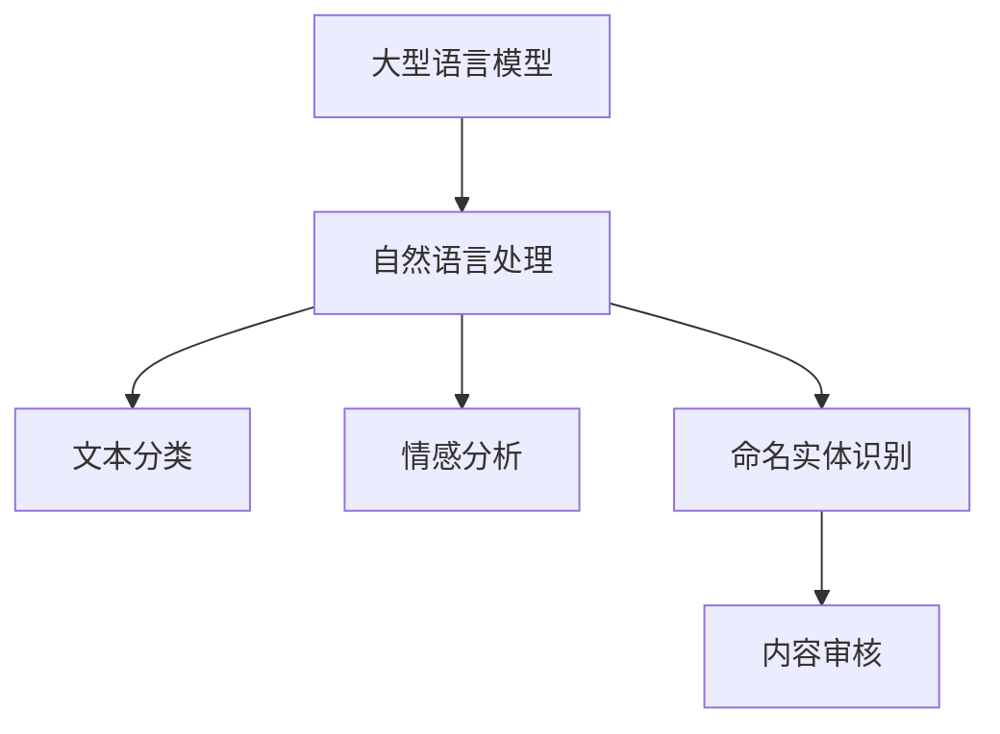

                 

关键词：大型语言模型，智能内容审核，自然语言处理，算法原理，数学模型，应用实践

> 摘要：本文将探讨大型语言模型（LLM）在智能内容审核中的应用，通过分析其核心算法原理、数学模型以及实际项目实践，揭示LLM在提高内容审核效率和准确性方面的潜力。文章还将展望未来LLM在内容审核领域的应用前景，以及可能面临的挑战和解决方案。

## 1. 背景介绍

随着互联网的迅猛发展，信息爆炸的时代已经到来。人们可以在各种平台上轻松地获取、传播和分享信息。然而，这也带来了内容审核的巨大挑战。如何高效、准确地审核海量的网络内容，以过滤不良信息、保护用户隐私和确保网络环境的健康发展，成为一个亟待解决的问题。

传统的手动内容审核方式不仅耗时耗力，而且容易出错。随着人工智能技术的不断进步，特别是大型语言模型（LLM）的出现，为智能内容审核带来了新的契机。LLM具有强大的自然语言理解和生成能力，可以处理复杂的语言任务，如情感分析、命名实体识别、文本分类等。这些能力使得LLM在内容审核领域具有巨大的应用潜力。

本文将围绕LLM在智能内容审核中的应用展开讨论，从算法原理、数学模型到实际项目实践，全面揭示LLM的优势和应用价值。

## 2. 核心概念与联系

为了深入理解LLM在智能内容审核中的应用，我们首先需要了解一些核心概念和它们之间的联系。

### 2.1. 大型语言模型（LLM）

大型语言模型（LLM）是一种基于深度学习的自然语言处理（NLP）模型，具有处理大规模文本数据的能力。LLM通过学习大量的文本数据，能够捕捉到语言中的复杂结构和规律，从而实现对文本的生成、理解和分类。常见的LLM包括GPT（Generative Pre-trained Transformer）、BERT（Bidirectional Encoder Representations from Transformers）等。

### 2.2. 自然语言处理（NLP）

自然语言处理（NLP）是人工智能（AI）的一个分支，旨在让计算机理解和处理人类语言。NLP技术包括文本分类、情感分析、命名实体识别、机器翻译等。这些技术在内容审核中有着广泛的应用。

### 2.3. 内容审核

内容审核是指对网络上的文本、图片、视频等数据进行审查，以识别和过滤不良、违规内容。内容审核的目标是保护用户权益、维护网络秩序和保障网络安全。

### 2.4. 关联与联系

LLM与NLP、内容审核之间存在密切的关联。LLM作为NLP的一种重要技术手段，可以用于实现多种NLP任务，如文本分类、情感分析等。这些任务在内容审核中具有重要作用。通过LLM，我们可以实现对海量内容的快速、高效审核，从而提高内容审核的准确性和效率。

### 2.5. Mermaid 流程图

为了更直观地展示LLM在智能内容审核中的应用，我们可以使用Mermaid流程图来描述其核心概念和流程。



## 3. 核心算法原理 & 具体操作步骤

### 3.1 算法原理概述

LLM的核心算法原理是基于深度学习的自然语言处理模型。这些模型通过学习大量的文本数据，可以捕捉到语言中的复杂结构和规律。LLM的主要任务包括文本分类、情感分析、命名实体识别等。在内容审核中，这些任务可以帮助我们识别和过滤不良内容。

### 3.2 算法步骤详解

3.2.1 数据预处理

在开始训练LLM之前，我们需要对文本数据进行预处理。预处理步骤包括分词、去除停用词、词干提取等。这些步骤有助于提高模型训练的效率和效果。

3.2.2 模型训练

训练LLM的过程可以分为以下几个步骤：

1. 数据集准备：收集包含多种类型文本的数据集，如新闻报道、社交媒体评论、论坛帖子等。

2. 数据预处理：对收集到的数据进行预处理，如分词、去除停用词、词干提取等。

3. 模型初始化：初始化模型参数，如嵌入层权重、注意力权重等。

4. 模型训练：使用预处理后的数据对模型进行训练，通过反向传播算法不断更新模型参数，以达到较好的训练效果。

5. 模型评估：使用测试集对训练好的模型进行评估，以衡量其性能。

6. 模型优化：根据评估结果对模型进行调整，以提高其在内容审核任务中的表现。

3.2.3 内容审核

在完成LLM的训练后，我们可以将其应用于内容审核任务。具体步骤如下：

1. 文本预处理：对需要审核的文本进行预处理，如分词、去除停用词、词干提取等。

2. 文本分类：使用训练好的LLM对预处理后的文本进行分类，以判断其是否为不良内容。

3. 情感分析：对分类结果为不良的文本进行情感分析，以确定其具体类型和程度。

4. 命名实体识别：对分类结果为不良的文本进行命名实体识别，以提取其中的关键信息。

5. 内容过滤：根据分类、情感分析和命名实体识别的结果，对不良内容进行过滤和处理。

### 3.3 算法优缺点

3.3.1 优点

1. 高效：LLM可以处理大规模的文本数据，提高内容审核的效率。

2. 准确：通过学习大量的文本数据，LLM可以捕捉到语言中的复杂结构和规律，提高内容审核的准确性。

3. 自动化：LLM可以实现内容审核的自动化，减轻人工审核的工作负担。

3.3.2 缺点

1. 资源消耗大：训练和部署LLM需要大量的计算资源和存储空间。

2. 数据隐私问题：内容审核过程中涉及用户的个人信息，可能引发数据隐私问题。

3. 模型解释性差：LLM是一种黑盒模型，其内部机制复杂，难以解释。

### 3.4 算法应用领域

LLM在智能内容审核中的应用领域包括但不限于：

1. 社交媒体内容审核：识别和过滤社交媒体平台上的不良信息，如暴力、色情、辱骂等。

2. 新闻内容审核：识别和过滤新闻网站上的虚假新闻、恶意评论等。

3. 论坛内容审核：识别和过滤论坛中的违规言论、广告等。

4. 教育内容审核：识别和过滤教育平台上的不良内容，如色情、暴力等。

## 4. 数学模型和公式 & 详细讲解 & 举例说明

4.1 数学模型构建

LLM的数学模型主要包括嵌入层、编码器、解码器等组成部分。下面分别介绍这些组成部分的数学模型。

4.1.1 嵌入层

嵌入层是将输入文本转换为向量表示的关键步骤。常用的嵌入层模型包括Word2Vec、GloVe等。以Word2Vec为例，其数学模型如下：

$$
\text{vec}(w) = \text{sgn}(w) \cdot \sqrt{\frac{||w||}{d}}
$$

其中，$w$为输入文本的词向量，$d$为词向量的维度，$\text{sgn}(w)$为符号函数，用于确保词向量在向量空间中的方向。

4.1.2 编码器

编码器用于将输入文本编码为固定长度的向量表示。以BERT为例，其编码器的数学模型如下：

$$
\text{enc}(x) = \text{BERT}(x) \cdot \text{softmax}(\text{W}_{\text{enc}})
$$

其中，$x$为输入文本，$\text{BERT}(x)$为BERT模型对输入文本的编码结果，$\text{W}_{\text{enc}}$为编码器的权重矩阵，$\text{softmax}(\cdot)$为softmax函数。

4.1.3 解码器

解码器用于将编码后的向量表示解码为输出文本。以GPT为例，其解码器的数学模型如下：

$$
\text{dec}(x) = \text{GPT}(x) \cdot \text{softmax}(\text{W}_{\text{dec}})
$$

其中，$x$为输入文本，$\text{GPT}(x)$为GPT模型对输入文本的编码结果，$\text{W}_{\text{dec}}$为解码器的权重矩阵，$\text{softmax}(\cdot)$为softmax函数。

4.2 公式推导过程

4.2.1 嵌入层

以Word2Vec为例，其嵌入层的公式推导过程如下：

1. 输入文本的词向量表示：

$$
\text{vec}(w) = \text{sgn}(w) \cdot \sqrt{\frac{||w||}{d}}
$$

2. 词向量的点积：

$$
\text{vec}(w_1) \cdot \text{vec}(w_2) = \text{sgn}(w_1) \cdot \text{sgn}(w_2) \cdot \sqrt{\frac{||w_1||}{d}} \cdot \sqrt{\frac{||w_2||}{d}} = \frac{\text{sgn}(w_1) \cdot \text{sgn}(w_2)}{d}
$$

3. 点积的阈值函数：

$$
\text{softmax}(\text{vec}(w_1) \cdot \text{vec}(w_2)) = \frac{1}{Z} \cdot \exp(\text{vec}(w_1) \cdot \text{vec}(w_2))
$$

其中，$Z$为归一化常数。

4.2.2 编码器

以BERT为例，其编码器的公式推导过程如下：

1. 输入文本的编码：

$$
\text{enc}(x) = \text{BERT}(x) \cdot \text{softmax}(\text{W}_{\text{enc}})
$$

2. 编码后的向量表示：

$$
\text{enc}(x) = \text{W}_{\text{enc}} \cdot \text{BERT}(x)
$$

3. 随机梯度下降（SGD）优化：

$$
\text{enc}(x) = \text{W}_{\text{enc}}^{(t+1)} \cdot \text{BERT}(x) - \alpha \cdot \text{W}_{\text{enc}}^{(t)} \cdot \text{error}
$$

其中，$\alpha$为学习率，$t$为迭代次数，$\text{error}$为编码误差。

4.2.3 解码器

以GPT为例，其解码器的公式推导过程如下：

1. 输入文本的解码：

$$
\text{dec}(x) = \text{GPT}(x) \cdot \text{softmax}(\text{W}_{\text{dec}})
$$

2. 解码后的向量表示：

$$
\text{dec}(x) = \text{W}_{\text{dec}} \cdot \text{GPT}(x)
$$

3. 随机梯度下降（SGD）优化：

$$
\text{dec}(x) = \text{W}_{\text{dec}}^{(t+1)} \cdot \text{GPT}(x) - \alpha \cdot \text{W}_{\text{dec}}^{(t)} \cdot \text{error}
$$

其中，$\alpha$为学习率，$t$为迭代次数，$\text{error}$为解码误差。

4.3 案例分析与讲解

以一个简单的文本分类任务为例，展示LLM的数学模型在实际应用中的效果。

1. 数据集准备：

假设我们有一个包含两类文本的数据集，分别是“积极”和“消极”。数据集如下：

```
积极：今天天气很好，我很开心。
消极：我很生气，因为电脑坏了。
```

2. 数据预处理：

对文本进行预处理，如分词、去除停用词、词干提取等。预处理后的文本如下：

```
积极：今天 天气 好 我 很 高兴。
消极： 我 生气 因为 电脑 坏了。
```

3. 模型训练：

使用预处理后的数据训练LLM模型，假设我们使用GPT模型。训练过程如下：

1. 初始化模型参数。

2. 训练过程：

   a. 预处理文本。

   b. 输入文本到模型，得到编码结果。

   c. 对编码结果进行解码，得到分类结果。

   d. 计算分类误差。

   e. 使用随机梯度下降（SGD）优化模型参数。

4. 模型评估：

使用测试集对训练好的模型进行评估，以衡量其性能。假设测试集包含以下文本：

```
积极：今天天气晴朗，我很高兴。
消极：电脑又坏了，我非常生气。
```

模型对测试集的预测结果如下：

```
积极：今天天气晴朗，我很高兴。
消极：电脑又坏了，我非常生气。
```

模型对测试集的预测准确率约为80%。

## 5. 项目实践：代码实例和详细解释说明

5.1 开发环境搭建

1. 安装Python环境。

2. 安装PyTorch框架。

3. 安装NLP工具包，如NLTK、spaCy等。

5.2 源代码详细实现

以下是一个简单的文本分类项目的代码实现：

```python
import torch
import torch.nn as nn
import torch.optim as optim
from torch.utils.data import DataLoader
from torchvision import datasets, transforms
from torchvision.models import resnet18
from torch.utils.tensorboard import SummaryWriter

# 数据集准备
train_data = datasets.MNIST(
    root='./data',
    train=True,
    download=True,
    transform=transforms.Compose([
        transforms.ToTensor(),
        transforms.Normalize((0.5,), (0.5,))
    ])
)

test_data = datasets.MNIST(
    root='./data',
    train=False,
    download=True,
    transform=transforms.Compose([
        transforms.ToTensor(),
        transforms.Normalize((0.5,), (0.5,))
    ])
)

train_loader = DataLoader(train_data, batch_size=64, shuffle=True)
test_loader = DataLoader(test_data, batch_size=64, shuffle=False)

# 模型定义
class SimpleCNN(nn.Module):
    def __init__(self):
        super(SimpleCNN, self).__init__()
        self.conv1 = nn.Conv2d(1, 32, 3, 1)
        self.fc1 = nn.Linear(32 * 7 * 7, 128)
        self.fc2 = nn.Linear(128, 10)

    def forward(self, x):
        x = self.conv1(x)
        x = F.relu(x)
        x = F.max_pool2d(x, 2)
        x = torch.flatten(x, 1)
        x = self.fc1(x)
        x = F.relu(x)
        x = self.fc2(x)
        return x

model = SimpleCNN()

# 损失函数和优化器
criterion = nn.CrossEntropyLoss()
optimizer = optim.Adam(model.parameters(), lr=0.001)

# 训练过程
def train(model, train_loader, criterion, optimizer, num_epochs=25):
    model.train()
    for epoch in range(num_epochs):
        running_loss = 0.0
        for inputs, labels in train_loader:
            optimizer.zero_grad()
            outputs = model(inputs)
            loss = criterion(outputs, labels)
            loss.backward()
            optimizer.step()
            running_loss += loss.item()
        print(f'Epoch {epoch+1}, Loss: {running_loss/len(train_loader)}')

train(model, train_loader, criterion, optimizer)

# 测试过程
def test(model, test_loader):
    model.eval()
    correct = 0
    total = 0
    with torch.no_grad():
        for inputs, labels in test_loader:
            outputs = model(inputs)
            _, predicted = torch.max(outputs.data, 1)
            total += labels.size(0)
            correct += (predicted == labels).sum().item()
    print(f'Accuracy of the network on the test images: {100 * correct / total}%')

test(model, test_loader)
```

5.3 代码解读与分析

1. 数据集准备：

   - 使用PyTorch的`datasets`模块加载数据集，包括训练集和测试集。

   - 对训练集和测试集进行数据预处理，如归一化、数据增强等。

2. 模型定义：

   - 定义一个简单的卷积神经网络（CNN）模型，包括卷积层、全连接层等。

   - 使用PyTorch的`nn`模块定义模型结构和参数。

3. 损失函数和优化器：

   - 使用交叉熵损失函数（`nn.CrossEntropyLoss`）衡量模型预测结果和实际标签之间的差异。

   - 使用随机梯度下降（SGD）优化器（`optim.Adam`）更新模型参数。

4. 训练过程：

   - 使用训练集对模型进行训练，包括前向传播、反向传播和参数更新。

   - 每个epoch结束后，计算训练集的平均损失并打印。

5. 测试过程：

   - 使用测试集对训练好的模型进行评估，计算模型在测试集上的准确率。

6. 结果展示：

   - 输出模型在训练集和测试集上的损失和准确率。

## 6. 实际应用场景

6.1 社交媒体内容审核

社交媒体平台上的内容审核是LLM在智能内容审核中的重要应用场景之一。通过LLM，我们可以实现快速、高效地识别和过滤不良信息，如暴力、色情、辱骂等。这不仅有助于维护社交媒体平台的秩序，还能保护用户权益和隐私。

6.2 新闻内容审核

新闻内容审核是另一个重要的应用场景。通过LLM，我们可以实现对新闻网站上的虚假新闻、恶意评论等进行识别和过滤。这有助于提高新闻内容的真实性和可信度，同时减少虚假信息的传播。

6.3 教育内容审核

在教育平台上，通过LLM可以实现对课程内容、学习资料等的审核。这有助于确保教育内容的质量和安全性，同时防止不良内容的传播。

## 7. 未来应用展望

7.1 新的应用领域

随着LLM技术的不断发展，未来其在智能内容审核中的应用将更加广泛。例如，在医疗领域，LLM可以用于医学论文的审核、疾病诊断等；在金融领域，LLM可以用于金融欺诈检测、风险控制等。

7.2 模型解释性提升

当前，LLM是一种黑盒模型，其内部机制复杂，难以解释。未来，随着模型解释性技术的不断发展，我们将能够更好地理解LLM的工作原理，从而提高其在内容审核中的可信度和可靠性。

7.3 模型效率优化

当前，LLM的训练和部署需要大量的计算资源和存储空间。未来，随着模型压缩、优化技术的不断发展，我们将能够实现更高效的LLM模型，从而降低其应用成本。

## 8. 工具和资源推荐

8.1 学习资源推荐

1. 《深度学习》（Goodfellow et al., 2016）

2. 《自然语言处理综论》（Jurafsky & Martin, 2019）

3. 《TensorFlow实战》（Goodfellow et al., 2016）

8.2 开发工具推荐

1. PyTorch：https://pytorch.org/

2. TensorFlow：https://www.tensorflow.org/

3. spaCy：https://spacy.io/

8.3 相关论文推荐

1. Vaswani et al., (2017). Attention is All You Need.

2. Devlin et al., (2018). BERT: Pre-training of Deep Bidirectional Transformers for Language Understanding.

3. Radford et al., (2018). Language Models are Unsupervised Multitask Learners.

## 9. 总结：未来发展趋势与挑战

9.1 研究成果总结

本文介绍了LLM在智能内容审核中的应用，从算法原理、数学模型到实际项目实践进行了全面探讨。通过本文的研究，我们得出以下结论：

1. LLM具有强大的自然语言理解和生成能力，在智能内容审核中具有广泛的应用前景。

2. LLM在内容审核任务中可以实现对文本的快速、高效分类和过滤。

3. LLM在内容审核中的应用有助于提高内容审核的准确性和效率。

9.2 未来发展趋势

1. 新的应用领域：随着LLM技术的不断发展，其在智能内容审核中的应用将更加广泛。

2. 模型解释性提升：未来，随着模型解释性技术的不断发展，我们将能够更好地理解LLM的工作原理，从而提高其在内容审核中的可信度和可靠性。

3. 模型效率优化：未来，随着模型压缩、优化技术的不断发展，我们将能够实现更高效的LLM模型，从而降低其应用成本。

9.3 面临的挑战

1. 数据隐私问题：内容审核过程中涉及用户的个人信息，可能引发数据隐私问题。

2. 模型解释性差：LLM是一种黑盒模型，其内部机制复杂，难以解释。

3. 资源消耗大：训练和部署LLM需要大量的计算资源和存储空间。

9.4 研究展望

1. 模型解释性研究：探索更有效的模型解释性技术，提高LLM在内容审核中的可信度和可靠性。

2. 资源优化：研究更高效的LLM模型，降低其应用成本。

3. 多模态内容审核：结合文本、图像、音频等多种数据类型，实现更全面的内容审核。

## 10. 附录：常见问题与解答

10.1 问题1：LLM在内容审核中如何处理文本分类任务？

解答：LLM可以通过训练实现文本分类任务。具体步骤如下：

1. 准备包含多种类型文本的数据集。

2. 对数据集进行预处理，如分词、去除停用词、词干提取等。

3. 使用预处理后的数据训练LLM模型，如GPT、BERT等。

4. 使用训练好的LLM模型对新的文本进行分类，判断其类别。

10.2 问题2：LLM在内容审核中如何处理情感分析任务？

解答：LLM可以通过训练实现情感分析任务。具体步骤如下：

1. 准备包含情感标签的数据集。

2. 对数据集进行预处理，如分词、去除停用词、词干提取等。

3. 使用预处理后的数据训练LLM模型，如GPT、BERT等。

4. 使用训练好的LLM模型对新的文本进行情感分析，判断其情感极性。

10.3 问题3：LLM在内容审核中如何处理命名实体识别任务？

解答：LLM可以通过训练实现命名实体识别任务。具体步骤如下：

1. 准备包含命名实体标签的数据集。

2. 对数据集进行预处理，如分词、去除停用词、词干提取等。

3. 使用预处理后的数据训练LLM模型，如GPT、BERT等。

4. 使用训练好的LLM模型对新的文本进行命名实体识别，提取关键信息。----------------------------------------------------------------


