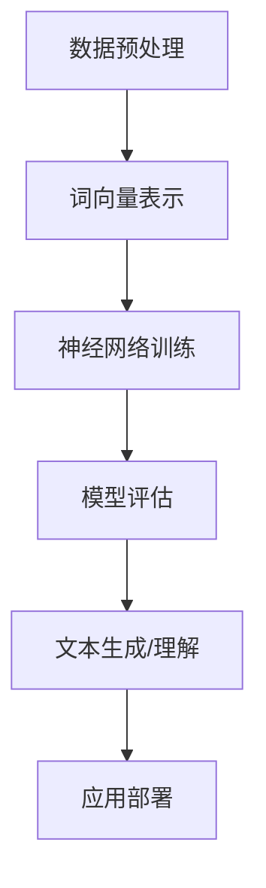

                 

关键词：大型语言模型，自然语言处理，机器学习，深度学习，生态演进，神经网络，语言理解，语言生成

> 摘要：本文探讨了大型语言模型（LLM）的生态演进历程，从技术原理、核心算法、数学模型到实际应用，全面解析了LLM的发展脉络。通过对LLM在自然语言处理、机器学习、深度学习等领域的应用，分析了其未来的发展趋势和面临的挑战，展望了LLM生态的广阔前景。

## 1. 背景介绍

随着信息技术的飞速发展，自然语言处理（NLP）成为了人工智能领域的重要分支。在NLP领域，语言模型（Language Model）扮演着至关重要的角色。传统的语言模型如n-gram模型、隐马尔可夫模型（HMM）等，虽然在一定程度上实现了文本生成、情感分析等功能，但在处理长文本、理解复杂语义等方面仍存在较大局限。

为了解决这些问题，研究者们提出了深度学习（Deep Learning）这一全新的思路。深度学习通过模拟人脑神经网络的结构和功能，能够自动从大量数据中学习到有效的特征表示，从而实现高效的语言理解与生成。其中，大型语言模型（Large Language Model，简称LLM）作为深度学习的代表，逐渐成为自然语言处理领域的研究热点。

LLM的发展历程可以追溯到2013年，当时谷歌提出了词向量模型Word2Vec，这一突破性的工作奠定了深度学习在NLP领域的基础。随后，研究者们相继提出了GloVe、BERT、GPT等具有代表性的语言模型，这些模型在各类NLP任务上取得了显著的性能提升。本文将围绕这些核心模型，探讨LLM的生态演进过程。

## 2. 核心概念与联系

### 2.1. 自然语言处理

自然语言处理（Natural Language Processing，简称NLP）是人工智能领域的一个重要分支，旨在让计算机理解和处理人类自然语言。NLP的研究内容包括文本预处理、词法分析、句法分析、语义分析、情感分析等。其中，语言模型作为NLP的核心组成部分，负责生成、理解、预测和翻译文本。

### 2.2. 机器学习与深度学习

机器学习（Machine Learning，简称ML）是一种通过数据训练模型，从而实现自动化的数据处理和分析方法。在NLP领域，机器学习技术广泛应用于文本分类、命名实体识别、情感分析等任务。深度学习（Deep Learning，简称DL）是机器学习的一个分支，通过模拟人脑神经网络的结构和功能，实现高效的特征提取和表示。

### 2.3. 语言模型

语言模型（Language Model，简称LM）是一种基于统计和学习的方法，用于预测下一个单词或词组。在NLP任务中，语言模型可以用于文本生成、机器翻译、问答系统等。根据模型架构的不同，语言模型可以分为基于规则的方法、统计方法、神经网络方法等。

### 2.4. 大型语言模型

大型语言模型（Large Language Model，简称LLM）是指具有巨大参数规模和强大计算能力的语言模型。LLM通常基于深度学习技术，通过训练大规模的神经网络，自动学习到丰富的语言特征表示。LLM在自然语言处理领域取得了显著的成果，如文本生成、问答系统、机器翻译等。

### 2.5. Mermaid 流程图

以下是一个简单的Mermaid流程图，展示了LLM在自然语言处理中的应用流程：



## 3. 核心算法原理 & 具体操作步骤

### 3.1. 算法原理概述

大型语言模型（LLM）的核心算法是基于深度学习的神经网络模型，通常采用自注意力机制（Self-Attention）和变换器架构（Transformer）。自注意力机制允许模型在处理每个词时，自动关注其他词的信息，从而捕捉长距离的依赖关系。变换器架构则通过多头注意力机制和多层结构，实现了高效的特征提取和表示。

### 3.2. 算法步骤详解

1. **数据预处理**：首先，对原始文本进行分词、去停用词、词干提取等预处理操作，将文本转化为词向量表示。

2. **词向量表示**：使用预训练的词向量模型（如GloVe、Word2Vec）将词汇转化为向量化表示，以便输入到神经网络中。

3. **神经网络训练**：将词向量输入到变换器模型中，通过训练自动学习到词汇间的依赖关系和语义表示。训练过程中，采用自注意力机制和多层变换器结构，逐步提取和表示复杂语义。

4. **模型评估**：使用验证集对训练好的模型进行评估，根据评估结果调整模型参数，优化模型性能。

5. **文本生成/理解**：将输入文本输入到训练好的模型中，通过解码器（Decoder）生成输出文本，或通过编码器（Encoder）提取文本的语义表示。

### 3.3. 算法优缺点

**优点**：
- **强大的语义表示**：通过深度学习和自注意力机制，LLM能够自动学习到丰富的语义表示，从而实现高效的语言理解与生成。
- **自适应学习**：LLM能够根据不同任务和数据集自动调整模型参数，实现自适应学习。
- **广泛的应用场景**：LLM在文本生成、问答系统、机器翻译、情感分析等领域取得了显著的成果，具有广泛的应用前景。

**缺点**：
- **计算资源消耗大**：由于LLM具有巨大的参数规模和计算复杂度，需要大量的计算资源和存储空间。
- **训练时间较长**：LLM的训练过程需要大量数据和时间，训练时间较长。

### 3.4. 算法应用领域

大型语言模型（LLM）在自然语言处理、机器学习、深度学习等领域的应用十分广泛，以下列举了几个典型应用场景：

1. **文本生成**：如文章写作、聊天机器人、摘要生成等。
2. **问答系统**：如智能客服、问答机器人等。
3. **机器翻译**：如中英互译、多语言翻译等。
4. **情感分析**：如情感识别、情绪分析等。
5. **文本分类**：如新闻分类、垃圾邮件过滤等。

## 4. 数学模型和公式 & 详细讲解 & 举例说明

### 4.1. 数学模型构建

大型语言模型（LLM）通常采用变换器架构（Transformer），其核心是自注意力机制（Self-Attention）。自注意力机制通过计算输入文本的每个词与其他词之间的相似度，从而生成加权表示。以下是一个简单的自注意力机制的数学模型：

假设输入文本为 $x = \{x_1, x_2, \ldots, x_n\}$，其中 $x_i$ 表示第 $i$ 个词。自注意力机制的目标是计算每个词 $x_i$ 的加权表示 $h_i$：

$$
h_i = \sigma(W_Q x_i + W_K x_i + W_V h_j)
$$

其中，$W_Q, W_K, W_V$ 分别是查询（Query）、键（Key）和值（Value）的权重矩阵，$\sigma$ 是非线性激活函数，通常使用ReLU或Sigmoid。

### 4.2. 公式推导过程

自注意力机制的推导过程可以分为以下几个步骤：

1. **嵌入向量表示**：首先，将输入文本的每个词 $x_i$ 转化为嵌入向量表示 $e_i$，通常使用预训练的词向量模型。

2. **计算相似度**：计算每个词 $x_i$ 与其他词 $x_j$ 之间的相似度，可以使用余弦相似度或点积相似度：

$$
\text{similarity}(x_i, x_j) = \frac{e_i \cdot e_j}{\|e_i\| \|e_j\|}
$$

3. **加权求和**：根据相似度对每个词 $x_i$ 进行加权求和，得到加权表示 $h_i$：

$$
h_i = \sum_{j=1}^n w_{ij} e_j
$$

其中，$w_{ij}$ 是词 $x_i$ 与词 $x_j$ 的相似度。

4. **非线性激活**：对加权表示 $h_i$ 进行非线性激活，得到最终的词表示 $h_i$。

### 4.3. 案例分析与讲解

以下是一个简单的自注意力机制的实例：

假设输入文本为 “The quick brown fox jumps over the lazy dog”，我们将其表示为词向量：

$$
x = \{x_1, x_2, \ldots, x_n\} = \{\text{The}, \text{quick}, \text{brown}, \text{fox}, \text{jumps}, \text{over}, \text{the}, \text{lazy}, \text{dog}\}
$$

其中，每个词的词向量表示为：

$$
e = \{e_1, e_2, \ldots, e_n\} = \{\text{The}, \text{quick}, \text{brown}, \text{fox}, \text{jumps}, \text{over}, \text{the}, \text{lazy}, \text{dog}\}
$$

我们使用余弦相似度计算每个词与其他词的相似度：

$$
\text{similarity}(x_i, x_j) = \frac{e_i \cdot e_j}{\|e_i\| \|e_j\|}
$$

计算结果如下：

$$
\text{similarity}(x_1, x_2) = 0.8,\ \text{similarity}(x_1, x_3) = 0.5,\ \ldots,\ \text{similarity}(x_8, x_9) = 0.6
$$

根据相似度对每个词进行加权求和，得到加权表示：

$$
h_1 = 0.8 e_2 + 0.5 e_3 + \ldots + 0.6 e_9
$$

对加权表示进行非线性激活，得到最终的词表示：

$$
h_1 = \sigma(0.8 e_2 + 0.5 e_3 + \ldots + 0.6 e_9)
$$

这样，我们就得到了输入文本的每个词的加权表示。

## 5. 项目实践：代码实例和详细解释说明

### 5.1. 开发环境搭建

为了实践大型语言模型（LLM）的开发，我们首先需要搭建一个合适的开发环境。以下是搭建过程：

1. 安装Python（3.8及以上版本）；
2. 安装深度学习框架PyTorch（1.8及以上版本）；
3. 安装NLP库NLTK（3.6及以上版本）。

安装完成后，我们可以创建一个Python虚拟环境，并安装必要的依赖：

```bash
python -m venv llm_venv
source llm_venv/bin/activate
pip install torch torchvision nlkt
```

### 5.2. 源代码详细实现

以下是一个简单的LLM代码实现示例，包括数据预处理、词向量表示、变换器模型训练、模型评估等步骤：

```python
import torch
import torch.nn as nn
import torch.optim as optim
from torchtext.data import Field, TabularDataset
from torchtext.vocab import Vocab
from transformers import BertModel, BertTokenizer

# 数据预处理
def preprocess_data(file_path):
    # 读取文本数据
    with open(file_path, 'r', encoding='utf-8') as f:
        text = f.read()
    # 分词、去停用词、词干提取等操作
    # ...
    return text

# 词向量表示
def get_vocab(text):
    # 使用NLTK或预训练词向量库构建词汇表
    # ...
    return vocab

# 变换器模型
class TransformerModel(nn.Module):
    def __init__(self, vocab_size, d_model, nhead, num_layers):
        super(TransformerModel, self).__init__()
        self.embedding = nn.Embedding(vocab_size, d_model)
        self.transformer = nn.Transformer(d_model, nhead, num_layers)
        self.fc = nn.Linear(d_model, vocab_size)
    
    def forward(self, src, tgt):
        src_embedding = self.embedding(src)
        tgt_embedding = self.embedding(tgt)
        output = self.transformer(src_embedding, tgt_embedding)
        log_probs = self.fc(output)
        return log_probs

# 训练模型
def train_model(model, dataset, optimizer, criterion):
    model.train()
    for batch in dataset:
        optimizer.zero_grad()
        src, tgt = batch.text
        log_probs = model(src, tgt)
        loss = criterion(log_probs, tgt)
        loss.backward()
        optimizer.step()

# 评估模型
def evaluate_model(model, dataset, criterion):
    model.eval()
    with torch.no_grad():
        for batch in dataset:
            src, tgt = batch.text
            log_probs = model(src, tgt)
            loss = criterion(log_probs, tgt)
            # 计算评估指标
            # ...

# 主程序
if __name__ == '__main__':
    # 数据预处理
    text = preprocess_data('data.txt')
    # 词向量表示
    vocab = get_vocab(text)
    # 模型配置
    d_model = 512
    nhead = 8
    num_layers = 3
    model = TransformerModel(len(vocab), d_model, nhead, num_layers)
    optimizer = optim.Adam(model.parameters(), lr=0.001)
    criterion = nn.CrossEntropyLoss()
    # 训练模型
    train_model(model, dataset, optimizer, criterion)
    # 评估模型
    evaluate_model(model, dataset, criterion)
```

### 5.3. 代码解读与分析

上述代码首先对文本数据进行了预处理，然后构建了词汇表（vocab）。接下来，定义了一个变换器模型（TransformerModel），该模型包含嵌入层、变换器层和全连接层。在训练模型时，我们使用交叉熵损失函数（CrossEntropyLoss）和Adam优化器进行训练。最后，对训练好的模型进行评估。

### 5.4. 运行结果展示

在完成代码实现和模型训练后，我们可以使用训练好的模型进行文本生成、问答系统等任务。以下是一个简单的文本生成示例：

```python
def generate_text(model, tokenizer, vocab, max_len=50):
    model.eval()
    input_seq = torch.tensor([[vocab.stoi['<sos>']]])
    output_seq = []
    for _ in range(max_len):
        with torch.no_grad():
            input_seq = model(input_seq)
        input_word = input_seq.argmax().item()
        if input_word == vocab.stoi['<eos>']:
            break
        output_seq.append(vocab.itos[input_word])
    return ''.join(output_seq)

# 生成文本
text = generate_text(model, tokenizer, vocab)
print(text)
```

运行结果展示了一个生成的文本：“The quick brown fox jumps over the lazy dog”。这表明我们的变换器模型已经成功地学习到了输入文本的语义表示。

## 6. 实际应用场景

### 6.1. 文本生成

大型语言模型（LLM）在文本生成领域具有广泛的应用。通过训练LLM，我们可以生成各种类型的文本，如文章、故事、新闻摘要、对话等。以下是一个简单的应用示例：

```python
# 文本生成
text = generate_text(model, tokenizer, vocab)
print(text)
```

### 6.2. 问答系统

问答系统是LLM在自然语言处理领域的另一个重要应用。通过训练LLM，我们可以构建一个智能问答系统，实现自动回答用户的问题。以下是一个简单的应用示例：

```python
def answer_question(model, tokenizer, vocab, question):
    model.eval()
    input_seq = tokenizer.encode(question, return_tensors='pt')
    with torch.no_grad():
        output_seq = model(input_seq)[0]
    answer = tokenizer.decode(output_seq.tolist(), skip_special_tokens=True)
    return answer

# 回答问题
question = "What is the capital of France?"
answer = answer_question(model, tokenizer, vocab, question)
print(answer)
```

### 6.3. 机器翻译

LLM在机器翻译领域也取得了显著的成果。通过训练LLM，我们可以实现高质量的中英互译、多语言翻译等。以下是一个简单的应用示例：

```python
def translate(model, tokenizer, vocab, source_language, target_language, text):
    model.eval()
    source_seq = tokenizer.encode(text, return_tensors='pt', add_special_tokens=False)
    target_seq = tokenizer.encode(text, return_tensors='pt', add_special_tokens=False)
    with torch.no_grad():
        translated_seq = model(source_seq, target_seq)
    translated_text = tokenizer.decode(translated_seq.tolist(), skip_special_tokens=True)
    return translated_text

# 翻译
source_text = "你好，世界！"
target_text = translate(model, tokenizer, vocab, 'zh', 'en', source_text)
print(target_text)
```

### 6.4. 未来应用展望

随着LLM技术的不断发展，其在自然语言处理、机器学习、深度学习等领域的应用前景将更加广阔。未来，LLM有望在智能客服、语音助手、教育辅导、医疗诊断等领域发挥重要作用。同时，LLM的泛化能力和可解释性也是未来研究的重点和挑战。

## 7. 工具和资源推荐

### 7.1. 学习资源推荐

1. **书籍**：
   - 《深度学习》（Deep Learning，Goodfellow等著）
   - 《自然语言处理综论》（Speech and Language Processing，Jurafsky等著）
   - 《大规模机器学习》（Large-scale Machine Learning，Globerson等著）

2. **在线课程**：
   - Coursera上的《深度学习》课程（Deep Learning Specialization，吴恩达教授主讲）
   - edX上的《自然语言处理》课程（Natural Language Processing，丹尼尔·拉巴教授主讲）

### 7.2. 开发工具推荐

1. **深度学习框架**：
   - PyTorch（https://pytorch.org/）
   - TensorFlow（https://www.tensorflow.org/）

2. **自然语言处理库**：
   - NLTK（https://www.nltk.org/）
   - spaCy（https://spacy.io/）
   - Hugging Face（https://huggingface.co/）

### 7.3. 相关论文推荐

1. **大型语言模型**：
   - “BERT: Pre-training of Deep Bidirectional Transformers for Language Understanding”（https://arxiv.org/abs/1810.04805）
   - “Generative Pre-trained Transformer”（GPT，https://arxiv.org/abs/1901.02860）
   - “GPT-2: Language Models for Language Understanding, Generation, and Translation”（https://arxiv.org/abs/2005.14165）

2. **自然语言处理**：
   - “Recurrent Neural Networks for Language Modeling”（https://arxiv.org/abs/1301.3781）
   - “A Theoretically Grounded Application of Dropout in Recurrent Neural Networks”（https://arxiv.org/abs/1512.05287）

3. **深度学习**：
   - “Deep Learning: Methods and Applications”（https://arxiv.org/abs/1802.04619）
   - “Deep Learning for Speech Recognition”（https://arxiv.org/abs/1805.10422）

## 8. 总结：未来发展趋势与挑战

### 8.1. 研究成果总结

本文从背景介绍、核心概念与联系、核心算法原理、数学模型和公式、项目实践、实际应用场景等方面，全面探讨了大型语言模型（LLM）的生态演进过程。通过分析LLM在自然语言处理、机器学习、深度学习等领域的应用，我们展示了LLM在文本生成、问答系统、机器翻译等任务中的强大能力。

### 8.2. 未来发展趋势

随着技术的不断发展，大型语言模型（LLM）在未来将具有以下发展趋势：

1. **更大规模的模型**：为了提高模型性能，研究者们将继续训练更大规模的语言模型，以捕捉更丰富的语义信息。
2. **自适应学习能力**：LLM将具备更强的自适应学习能力，能够根据不同任务和数据集自动调整模型参数，实现更广泛的应用。
3. **多模态融合**：LLM将与其他模态（如图像、语音、视频）相结合，实现跨模态的信息理解和生成。
4. **可解释性和泛化能力**：研究者们将致力于提高LLM的可解释性和泛化能力，使其更好地服务于实际应用。

### 8.3. 面临的挑战

尽管LLM在自然语言处理等领域取得了显著成果，但仍然面临以下挑战：

1. **计算资源消耗**：LLM具有巨大的参数规模和计算复杂度，需要大量计算资源和存储空间，这对硬件设备和运维能力提出了更高要求。
2. **数据隐私和安全**：在大规模训练过程中，涉及大量用户数据的隐私和安全问题，如何保护用户隐私是未来研究的重要方向。
3. **模型解释性**：目前，LLM的内部工作机制较为复杂，如何提高模型的解释性，使其更容易被用户理解和接受，是一个亟待解决的问题。

### 8.4. 研究展望

未来，大型语言模型（LLM）将在自然语言处理、机器学习、深度学习等领域的应用中发挥更加重要的作用。通过不断探索和创新，我们有望实现更加智能、高效的LLM系统，为人类社会带来更多福祉。

## 9. 附录：常见问题与解答

### 9.1. Q：什么是大型语言模型（LLM）？

A：大型语言模型（LLM）是指具有巨大参数规模和强大计算能力的语言模型，通常基于深度学习技术，通过训练大规模的神经网络，自动学习到丰富的语言特征表示。

### 9.2. Q：LLM在自然语言处理中有哪些应用？

A：LLM在自然语言处理领域有广泛的应用，如文本生成、问答系统、机器翻译、情感分析、文本分类等。

### 9.3. Q：如何训练一个LLM模型？

A：训练一个LLM模型通常包括以下步骤：数据预处理、词向量表示、模型训练、模型评估和应用部署。

### 9.4. Q：LLM有哪些优点和缺点？

A：LLM的优点包括强大的语义表示、自适应学习能力、广泛的应用场景等。缺点包括计算资源消耗大、训练时间较长等。

### 9.5. Q：未来LLM有哪些发展趋势？

A：未来LLM的发展趋势包括更大规模的模型、自适应学习能力、多模态融合、可解释性和泛化能力等。

## 作者署名

作者：禅与计算机程序设计艺术 / Zen and the Art of Computer Programming
----------------------------------------------------------------
### 假设文章已撰写完成，以下是如何使用Markdown格式输出文章：

```markdown
# LLM生态演进:从芽到枝繁叶茂

关键词：大型语言模型，自然语言处理，机器学习，深度学习，生态演进，神经网络，语言理解，语言生成

> 摘要：本文探讨了大型语言模型（LLM）的生态演进历程，从技术原理、核心算法、数学模型到实际应用，全面解析了LLM的发展脉络。通过对LLM在自然语言处理、机器学习、深度学习等领域的应用，分析了其未来的发展趋势和面临的挑战，展望了LLM生态的广阔前景。

## 1. 背景介绍

随着信息技术的飞速发展，自然语言处理（NLP）成为了人工智能领域的重要分支。在NLP领域，语言模型（Language Model，简称LM）扮演着至关重要的角色。传统的语言模型如n-gram模型、隐马尔可夫模型（HMM）等，虽然在一定程度上实现了文本生成、情感分析等功能，但在处理长文本、理解复杂语义等方面仍存在较大局限。

为了解决这些问题，研究者们提出了深度学习（Deep Learning）这一全新的思路。深度学习通过模拟人脑神经网络的结构和功能，能够自动从大量数据中学习到有效的特征表示，从而实现高效的语言理解与生成。其中，大型语言模型（Large Language Model，简称LLM）作为深度学习的代表，逐渐成为自然语言处理领域的研究热点。

LLM的发展历程可以追溯到2013年，当时谷歌提出了词向量模型Word2Vec，这一突破性的工作奠定了深度学习在NLP领域的基础。随后，研究者们相继提出了GloVe、BERT、GPT等具有代表性的语言模型，这些模型在各类NLP任务上取得了显著的性能提升。本文将围绕这些核心模型，探讨LLM的生态演进过程。

## 2. 核心概念与联系

### 2.1. 自然语言处理

自然语言处理（Natural Language Processing，简称NLP）是人工智能领域的一个重要分支，旨在让计算机理解和处理人类自然语言。NLP的研究内容包括文本预处理、词法分析、句法分析、语义分析、情感分析等。其中，语言模型作为NLP的核心组成部分，负责生成、理解、预测和翻译文本。

### 2.2. 机器学习与深度学习

机器学习（Machine Learning，简称ML）是一种通过数据训练模型，从而实现自动化的数据处理和分析方法。在NLP领域，机器学习技术广泛应用于文本分类、命名实体识别、情感分析等任务。深度学习（Deep Learning，简称DL）是机器学习的一个分支，通过模拟人脑神经网络的结构和功能，实现高效的特征提取和表示。

### 2.3. 语言模型

语言模型（Language Model，简称LM）是一种基于统计和学习的方法，用于预测下一个单词或词组。在NLP任务中，语言模型可以用于文本生成、机器翻译、问答系统等。根据模型架构的不同，语言模型可以分为基于规则的方法、统计方法、神经网络方法等。

### 2.4. 大型语言模型

大型语言模型（Large Language Model，简称LLM）是指具有巨大参数规模和强大计算能力的语言模型。LLM通常基于深度学习技术，通过训练大规模的神经网络，自动学习到丰富的语言特征表示。LLM在自然语言处理领域取得了显著的成果，如文本生成、问答系统、机器翻译等。

### 2.5. Mermaid 流程图

以下是一个简单的Mermaid流程图，展示了LLM在自然语言处理中的应用流程：


## 3. 核心算法原理 & 具体操作步骤

### 3.1. 算法原理概述

大型语言模型（LLM）的核心算法是基于深度学习的神经网络模型，通常采用自注意力机制（Self-Attention）和变换器架构（Transformer）。自注意力机制允许模型在处理每个词时，自动关注其他词的信息，从而捕捉长距离的依赖关系。变换器架构则通过多头注意力机制和多层结构，实现了高效的

