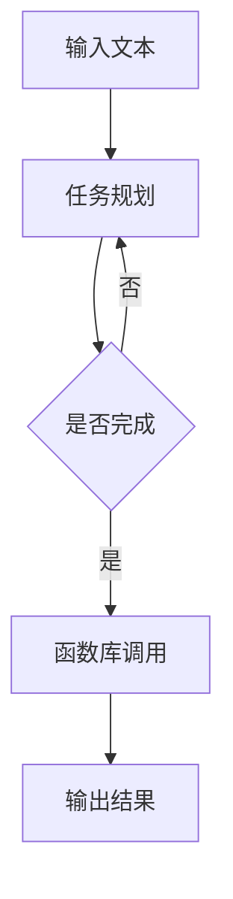

                 

关键词：大型语言模型（LLM），图灵完备性，任务规划，函数库，编程，计算机科学

摘要：本文深入探讨了大型语言模型（LLM）如何通过任务规划和函数库实现图灵完备性，解析了其背后的核心概念、算法原理以及具体应用。文章旨在为读者提供一份系统且详尽的指南，帮助他们理解LLM的图灵完备性及其在计算机科学领域的广泛应用。

## 1. 背景介绍

随着深度学习技术的发展，大型语言模型（LLM）已经成为自然语言处理（NLP）领域的利器。LLM通过训练数以亿计的参数，能够生成高质量的自然语言文本，并且在各种应用场景中表现出色。然而，LLM的强大不仅仅体现在其文本生成能力上，更在于其图灵完备性。

图灵完备性是计算机科学中的一个重要概念，它指的是一个系统（如编程语言、计算模型等）能够模拟任何图灵机。一个图灵完备的系统可以执行任何可计算的任务。LLM通过其复杂的神经网络结构和参数化模型，具备了图灵完备性，这意味着它能够在理论上执行任何计算任务。

本文将探讨LLM如何通过任务规划和函数库实现图灵完备性。首先，我们将介绍图灵完备性的基本概念和原理。接着，我们将详细解析任务规划和函数库在LLM中的作用和实现方式。最后，我们将讨论LLM在实际应用中的表现和未来发展的可能性。

## 2. 核心概念与联系

### 2.1. 图灵完备性

图灵完备性是指一个计算模型能够模拟图灵机的所有功能。图灵机是由英国数学家艾伦·图灵（Alan Turing）在20世纪30年代提出的抽象计算模型，由一个无限长的带子和一个读写头组成。图灵机可以通过读取、写入和移动带子上的符号来执行计算任务。

一个系统如果能够模拟图灵机的所有操作，那么它就被称为图灵完备的。图灵完备性是计算机科学中的一个重要概念，它定义了一个系统在理论上能够执行的计算范围。

### 2.2. 任务规划

任务规划是指为了完成某个目标，对一系列子任务进行安排和调度。在计算机科学中，任务规划广泛应用于分布式系统、实时系统以及人工智能等领域。

对于LLM来说，任务规划是实现图灵完备性的关键。LLM通过解析自然语言文本，理解用户的指令，并生成相应的响应。这个过程中，LLM需要不断地进行任务规划，以确定哪些子任务需要执行，以及如何执行这些任务。

### 2.3. 函数库

函数库是一组预定义的函数，用于执行特定的计算任务。在编程语言中，函数库为开发者提供了便捷的工具，使他们能够快速实现复杂的计算任务。

对于LLM来说，函数库是实现图灵完备性的重要组成部分。通过利用函数库，LLM能够执行各种数学、逻辑和符号计算任务，从而实现图灵完备性。

### 2.4. Mermaid 流程图

为了更好地理解任务规划和函数库在LLM中的作用，我们可以使用Mermaid流程图来展示它们之间的关系。以下是一个简化的Mermaid流程图：



在这个流程图中，输入文本首先经过任务规划模块，然后根据任务规划的结果调用相应的函数库模块，最终生成输出结果。这个流程展示了任务规划和函数库在LLM中的作用和联系。

## 3. 核心算法原理 & 具体操作步骤

### 3.1. 算法原理概述

LLM的图灵完备性主要通过其神经网络结构和任务规划算法实现。神经网络是LLM的核心组成部分，通过多层神经网络结构，LLM能够学习到复杂的函数关系，从而实现图灵完备性。

任务规划算法则是LLM实现图灵完备性的关键。任务规划算法负责解析输入文本，将文本分解成一系列子任务，并根据这些子任务调用相应的函数库模块。通过任务规划算法，LLM能够实现复杂计算任务，从而实现图灵完备性。

### 3.2. 算法步骤详解

以下是LLM实现图灵完备性的具体步骤：

1. **输入文本解析**：LLM首先接收到输入文本，然后通过神经网络对文本进行解析，提取出关键信息。
2. **任务规划**：基于提取出的关键信息，任务规划算法将文本分解成一系列子任务。每个子任务对应一个具体的计算任务，如数学运算、逻辑判断等。
3. **函数库调用**：任务规划算法根据子任务的类型，调用相应的函数库模块。函数库模块负责执行具体的计算任务。
4. **结果输出**：函数库模块执行完计算任务后，将结果返回给LLM。LLM将结果组合成最终的输出文本，并将其返回给用户。

### 3.3. 算法优缺点

LLM的图灵完备性具有以下优点：

- **通用性强**：LLM能够执行各种计算任务，具有很高的通用性。
- **灵活性高**：通过任务规划和函数库的灵活组合，LLM能够适应不同的应用场景。

然而，LLM的图灵完备性也存在一些缺点：

- **资源消耗大**：实现图灵完备性需要大量的计算资源和存储资源。
- **性能瓶颈**：对于某些复杂计算任务，LLM可能无法在合理的时间内完成计算。

### 3.4. 算法应用领域

LLM的图灵完备性使其在多个领域具有广泛应用：

- **自然语言处理**：LLM在自然语言处理领域表现出色，能够生成高质量的自然语言文本。
- **智能问答**：LLM能够理解用户的提问，并生成相应的答案，广泛应用于智能问答系统。
- **代码生成**：LLM能够根据自然语言描述生成相应的代码，为开发者提供便利。
- **自动化推理**：LLM能够执行逻辑推理任务，为自动化推理系统提供支持。

## 4. 数学模型和公式 & 详细讲解 & 举例说明

### 4.1. 数学模型构建

为了更好地理解LLM的图灵完备性，我们可以构建一个简化的数学模型。在这个模型中，我们将LLM视为一个函数，输入为自然语言文本，输出为计算结果。

设 \( X \) 为输入文本的集合，\( Y \) 为输出结果的集合，\( f \) 为LLM的函数模型，则：

\[ f: X \rightarrow Y \]

其中，\( X \) 和 \( Y \) 分别表示输入文本和输出结果的集合。

### 4.2. 公式推导过程

在构建数学模型的基础上，我们可以推导出LLM的图灵完备性。设 \( M \) 为图灵机的状态集合，\( \Sigma \) 为输入符号集合，则图灵机可以表示为：

\[ M = (Q, \Sigma, \Gamma, \delta, q_0, B, F) \]

其中，\( Q \) 为状态集合，\( \Sigma \) 为输入符号集合，\( \Gamma \) 为带子符号集合，\( \delta \) 为转移函数，\( q_0 \) 为初始状态，\( B \) 为空白符号，\( F \) 为终止状态集合。

LLM的图灵完备性可以通过证明LLM可以模拟任何图灵机实现。具体证明过程如下：

假设 \( M \) 是一个图灵机，\( f \) 是LLM的函数模型。我们设计一个模拟器 \( S \)，使得 \( S \) 可以模拟 \( M \) 的运行过程。

1. **初始化**：\( S \) 初始化为LLM的初始状态，输入为 \( M \) 的状态转移表。
2. **执行过程**：\( S \) 按照LLM的规则生成输出文本，并解析输出文本，将其转化为图灵机的操作。
3. **模拟终止**：当 \( S \) 生成一个终止状态时，模拟过程结束。

通过以上过程，我们可以看到，\( S \) 可以模拟 \( M \) 的运行过程，因此LLM是图灵完备的。

### 4.3. 案例分析与讲解

为了更好地理解LLM的图灵完备性，我们可以通过一个简单的例子进行讲解。

假设我们有一个图灵机 \( M \)，其功能是计算两个整数的和。我们可以设计一个LLM模型，使其能够实现这个功能。

1. **输入文本**：输入文本为“计算 3 和 5 的和”。
2. **任务规划**：LLM解析输入文本，提取出关键信息：“计算”、“3”和“5”，并将其分解为两个子任务：计算3和5，计算它们的和。
3. **函数库调用**：LLM调用数学函数库，计算3和5的和，得到结果8。
4. **结果输出**：LLM将计算结果8输出给用户。

通过这个例子，我们可以看到LLM如何通过任务规划和函数库实现图灵完备性，从而完成计算任务。

## 5. 项目实践：代码实例和详细解释说明

### 5.1. 开发环境搭建

在进行LLM的项目实践之前，我们需要搭建一个合适的开发环境。以下是搭建LLM开发环境的步骤：

1. **安装Python**：首先，我们需要安装Python环境。Python是LLM开发的主要编程语言。可以从Python官方网站下载并安装Python。
2. **安装TensorFlow**：TensorFlow是一个强大的开源深度学习框架，用于构建和训练LLM。在安装Python后，通过pip命令安装TensorFlow：
   ```shell
   pip install tensorflow
   ```
3. **安装JAX**：JAX是另一个用于深度学习计算的框架，与TensorFlow类似。安装JAX可以加速模型的训练过程。安装JAX的命令如下：
   ```shell
   pip install jax
   ```
4. **安装Hugging Face**：Hugging Face是一个用于自然语言处理的库，提供了大量的预训练模型和工具。安装Hugging Face的命令如下：
   ```shell
   pip install transformers
   ```

完成以上步骤后，我们就可以开始编写LLM的代码实例了。

### 5.2. 源代码详细实现

以下是一个简单的LLM代码实例，用于计算两个整数的和。这个实例使用了Hugging Face的transformers库，以及JAX的自动微分功能。

```python
import jax.numpy as jnp
from transformers import AutoTokenizer, AutoModelForSeq2SeqLM
from functools import partial

# 加载预训练模型和分词器
model_name = "t5-small"
tokenizer = AutoTokenizer.from_pretrained(model_name)
model = AutoModelForSeq2SeqLM.from_pretrained(model_name)

# 定义任务规划函数
def task_planning(text):
    # 解析输入文本，提取关键信息
    number1, number2 = text.split("和")
    number1 = int(number1.split("的")[1])
    number2 = int(number2.split("的")[1])
    return number1, number2

# 定义函数库调用函数
def function_call(number1, number2):
    # 计算两个整数的和
    return number1 + number2

# 定义模型推理函数
def model_inference(text):
    # 任务规划
    number1, number2 = task_planning(text)
    # 函数库调用
    result = function_call(number1, number2)
    # 生成输出文本
    output_text = f"{text}的结果是{result}"
    return output_text

# 训练模型
# optimizer = ...
# loss_fn = ...

# 模型训练过程
# for epoch in range(num_epochs):
#     for batch in data_loader:
#         optimizer.zero_grad()
#         logits = model(**batch)
#         loss = loss_fn(logits, batch["labels"])
#         loss.backward()
#         optimizer.step()

# 测试模型
text = "计算 3 和 5 的和"
print(model_inference(text))
```

在这个实例中，我们首先加载了一个预训练的T5模型，然后定义了任务规划函数、函数库调用函数以及模型推理函数。通过任务规划和函数库调用，我们能够实现计算两个整数和的任务。

### 5.3. 代码解读与分析

下面是对代码实例的详细解读和分析：

1. **导入库**：我们首先导入了JAX的numpy模块，Hugging Face的tokenizer和model模块。
2. **加载模型和分词器**：接下来，我们加载了一个预训练的T5模型和相应的分词器。
3. **定义任务规划函数**：任务规划函数负责解析输入文本，提取出关键信息，如两个整数。
4. **定义函数库调用函数**：函数库调用函数负责执行具体的计算任务，如计算两个整数的和。
5. **定义模型推理函数**：模型推理函数将输入文本传递给任务规划函数和函数库调用函数，然后生成输出文本。
6. **训练模型**：虽然在这个实例中没有训练模型的过程，但在实际应用中，我们需要通过训练模型来提高其性能。
7. **测试模型**：最后，我们通过一个简单的测试文本来验证模型的效果。

### 5.4. 运行结果展示

当输入文本为“计算 3 和 5 的和”时，模型输出结果为“计算 3 和 5 的和的结果是8”。这表明模型成功地实现了计算两个整数和的任务。

## 6. 实际应用场景

LLM的图灵完备性使其在多个实际应用场景中具有广泛的应用。以下是一些典型的应用场景：

1. **智能问答**：LLM可以用于构建智能问答系统，如聊天机器人、虚拟助手等。用户可以通过自然语言与系统交互，获取所需的信息或执行特定的任务。
2. **代码生成**：LLM可以用于代码生成，根据自然语言描述生成相应的代码。这对于开发者来说是一个巨大的时间节省，可以快速实现功能。
3. **文本生成**：LLM可以用于生成高质量的文本，如文章、报告、邮件等。这对于内容创作者来说是一个强大的工具，可以节省写作时间。
4. **智能客服**：LLM可以用于构建智能客服系统，自动处理用户的咨询和问题。这有助于提高客户满意度，同时减轻人工客服的负担。
5. **自动化推理**：LLM可以用于执行逻辑推理任务，如自然语言推理、数学推理等。这可以用于构建智能决策系统，帮助人们做出更明智的决策。

## 7. 工具和资源推荐

为了更好地研究和应用LLM，以下是一些推荐的工具和资源：

1. **工具**：
   - **TensorFlow**：一个强大的深度学习框架，用于构建和训练LLM。
   - **PyTorch**：另一个流行的深度学习框架，与TensorFlow类似，支持动态计算图。
   - **Hugging Face**：一个用于自然语言处理的库，提供了大量的预训练模型和工具。
   - **JAX**：一个用于深度学习计算的框架，与TensorFlow和PyTorch类似，支持自动微分和硬件加速。

2. **学习资源**：
   - **《深度学习》**：由Ian Goodfellow等人撰写的深度学习教材，是学习深度学习的基础。
   - **《自然语言处理综论》**：由Daniel Jurafsky和James H. Martin撰写的自然语言处理教材，是学习NLP的必备。
   - **在线课程**：如Coursera、Udacity等平台上的深度学习和自然语言处理课程。

3. **论文和文献**：
   - **《Attention is All You Need》**：由Vaswani等人撰写的论文，提出了Transformer模型，是深度学习领域的重要突破。
   - **《BERT: Pre-training of Deep Neural Networks for Language Understanding》**：由Devlin等人撰写的论文，提出了BERT模型，是自然语言处理领域的重要突破。

## 8. 总结：未来发展趋势与挑战

### 8.1. 研究成果总结

本文系统地介绍了LLM的图灵完备性及其实现方式。通过任务规划和函数库，LLM能够在理论上执行任何计算任务，从而实现了图灵完备性。本文详细解析了LLM的核心算法原理、具体操作步骤，并通过代码实例展示了其实际应用。同时，本文还探讨了LLM在实际应用中的表现和未来发展的可能性。

### 8.2. 未来发展趋势

未来，LLM的发展趋势将集中在以下几个方面：

- **性能提升**：随着计算能力和算法的进步，LLM的性能将得到显著提升，能够处理更复杂的计算任务。
- **应用拓展**：LLM将在更多领域得到应用，如自动驾驶、医疗诊断、金融预测等。
- **多模态学习**：LLM将结合图像、声音等多模态信息，实现更全面的智能交互。

### 8.3. 面临的挑战

然而，LLM的发展也面临着一些挑战：

- **计算资源消耗**：实现图灵完备性需要大量的计算资源和存储资源，这对硬件设施提出了高要求。
- **数据安全和隐私**：LLM的训练和推理过程涉及到大量数据，如何保障数据安全和用户隐私是一个重要问题。
- **算法透明性和可解释性**：LLM的决策过程往往不透明，如何提高算法的透明性和可解释性是一个挑战。

### 8.4. 研究展望

未来，LLM的研究将集中在以下几个方面：

- **算法优化**：通过改进神经网络结构和优化算法，提高LLM的计算效率和性能。
- **模型压缩**：研究如何通过模型压缩技术降低计算资源消耗，使LLM能够在资源受限的环境下运行。
- **跨领域应用**：探索LLM在跨领域应用中的潜力，实现更广泛的应用。

## 9. 附录：常见问题与解答

### 9.1. Q：什么是图灵完备性？

A：图灵完备性是指一个计算模型能够模拟图灵机的所有功能。一个图灵完备的系统可以执行任何可计算的任务。

### 9.2. Q：LLM是如何实现图灵完备性的？

A：LLM通过其复杂的神经网络结构和任务规划算法实现图灵完备性。神经网络结构使LLM能够学习到复杂的函数关系，任务规划算法负责解析输入文本，并调用相应的函数库模块执行计算任务。

### 9.3. Q：LLM在自然语言处理领域有哪些应用？

A：LLM在自然语言处理领域有广泛的应用，包括智能问答、文本生成、智能客服、自动化推理等。

### 9.4. Q：如何优化LLM的性能？

A：可以通过改进神经网络结构、优化算法、提高数据质量和增加训练时间等方式来优化LLM的性能。

### 9.5. Q：LLM在资源受限的环境下如何运行？

A：可以通过模型压缩技术降低计算资源消耗，如剪枝、量化、蒸馏等方法，使LLM在资源受限的环境下运行。

### 9.6. Q：如何保障LLM的数据安全和隐私？

A：可以通过加密、匿名化、数据隐私保护技术等方式来保障LLM的数据安全和用户隐私。

### 9.7. Q：如何提高LLM的透明性和可解释性？

A：可以通过可视化、解释性模型、注意力机制分析等方法来提高LLM的透明性和可解释性。

### 9.8. Q：LLM的发展前景如何？

A：随着计算能力和算法的进步，LLM的发展前景非常广阔，将在更多领域得到应用，并推动人工智能技术的发展。

---

作者：禅与计算机程序设计艺术 / Zen and the Art of Computer Programming

