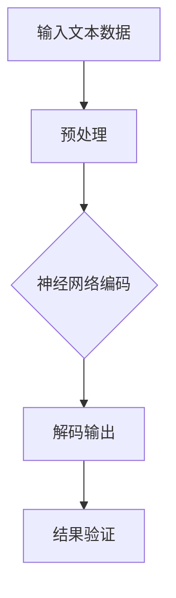
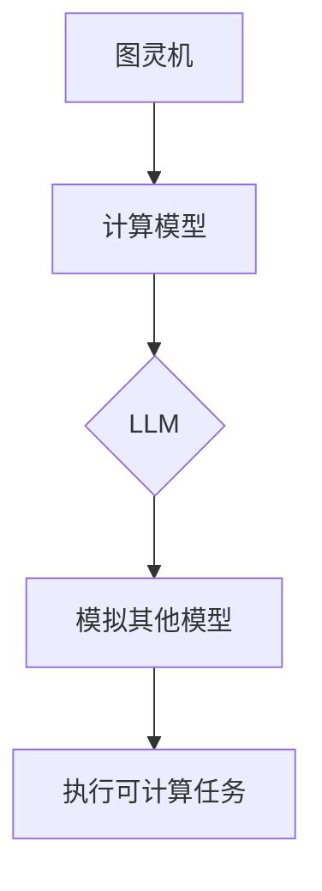
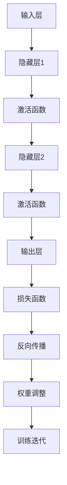
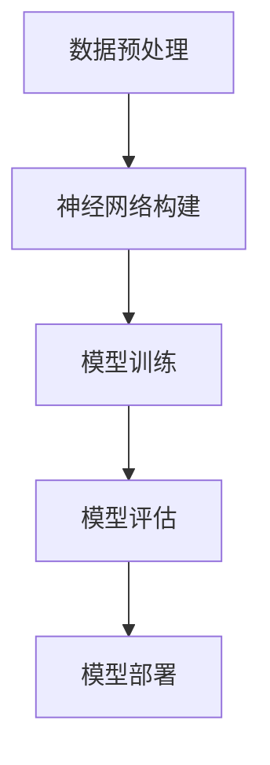

                 

关键词：LLM，图灵完备性，任务规划，函数库，人工智能

> 摘要：本文探讨了大型语言模型（LLM）的图灵完备性，重点分析了其在任务规划和函数库方面的应用。通过深入剖析LLM的工作原理、算法模型以及实际操作步骤，本文揭示了LLM在计算机科学领域的巨大潜力。

## 1. 背景介绍

随着深度学习和自然语言处理技术的快速发展，大型语言模型（LLM）已经成为人工智能领域的一个重要分支。LLM通过处理海量文本数据，可以学习并掌握复杂的语言规律，从而实现自动文本生成、语义理解、对话系统等功能。然而，LLM的图灵完备性使得其在更广泛的计算机科学领域表现出强大的能力。

图灵完备性是指一个计算模型能够执行任何可计算的任务。图灵机（Turing Machine）是最早提出的图灵完备计算模型，它的出现标志着现代计算机科学的诞生。本文将探讨LLM在图灵完备性方面的表现，并分析其在任务规划和函数库方面的应用。

## 2. 核心概念与联系

### 2.1 LLM的工作原理

LLM是基于深度神经网络（DNN）和循环神经网络（RNN）等先进技术构建的。它通过多层神经网络结构，对输入的文本数据进行自动编码和解码，从而实现对语言的理解和生成。

以下是LLM的工作原理的Mermaid流程图：



### 2.2 图灵完备性与LLM

图灵完备性是指一个计算模型能够执行任何可计算的任务。LLM作为深度学习模型，具有图灵完备性。这意味着LLM可以模拟任何其他计算模型，从而实现多种复杂任务。

以下是图灵完备性与LLM的Mermaid流程图：



## 3. 核心算法原理 & 具体操作步骤

### 3.1 算法原理概述

LLM的核心算法是深度神经网络。深度神经网络由多层神经元组成，通过非线性变换和权重调整，实现输入到输出的映射。

以下是深度神经网络的Mermaid流程图：



### 3.2 算法步骤详解

1. 数据预处理：将原始文本数据转换为适合神经网络训练的格式，如词向量或字符向量。

2. 神经网络构建：设计并构建多层神经网络结构，包括输入层、隐藏层和输出层。

3. 模型训练：通过反向传播算法，调整神经网络权重，优化模型性能。

4. 模型评估：使用验证集评估模型性能，调整模型参数。

5. 模型部署：将训练好的模型应用于实际任务，如文本生成、语义理解等。

以下是算法步骤的Mermaid流程图：



### 3.3 算法优缺点

#### 优点：

1. 强大的表达能力和适应性：深度神经网络可以学习并掌握复杂的语言规律，适应多种语言环境。

2. 高效的模型训练：反向传播算法能够快速调整模型参数，提高训练效率。

3. 广泛的应用场景：LLM在文本生成、语义理解、对话系统等领域具有广泛的应用。

#### 缺点：

1. 高的计算资源需求：深度神经网络训练过程需要大量的计算资源和时间。

2. 模型解释性较差：深度神经网络模型难以解释，不利于理解模型的决策过程。

### 3.4 算法应用领域

LLM在任务规划和函数库方面的应用如下：

1. 任务规划：LLM可以模拟人类思考和决策过程，实现自动任务规划。

2. 函数库：LLM可以生成各种函数，如数学函数、逻辑函数等，提高编程效率。

3. 自然语言处理：LLM在语义理解、对话系统等领域具有广泛应用。

## 4. 数学模型和公式 & 详细讲解 & 举例说明

### 4.1 数学模型构建

LLM的数学模型主要包括输入层、隐藏层和输出层。以下是各层的数学模型：

1. 输入层：$$x_{i}^{(l)} = \sum_{j} w_{ij}^{(l)} x_{j}^{(l-1)} + b_{i}^{(l)}$$

2. 隐藏层：$$h_{i}^{(l)} = \sigma \left( \sum_{j} w_{ij}^{(l)} h_{j}^{(l-1)} + b_{i}^{(l)} \right)$$

3. 输出层：$$y_{i}^{(l)} = \sum_{j} w_{ij}^{(l)} h_{j}^{(l-1)} + b_{i}^{(l)}$$

其中，$x_{i}^{(l)}$表示第$l$层第$i$个神经元的输入，$h_{i}^{(l)}$表示第$l$层第$i$个神经元的输出，$y_{i}^{(l)}$表示第$l$层第$i$个神经元的输出，$w_{ij}^{(l)}$表示第$l$层第$i$个神经元与第$l-1$层第$j$个神经元的权重，$b_{i}^{(l)}$表示第$l$层第$i$个神经元的偏置，$\sigma$表示激活函数。

### 4.2 公式推导过程

以下是LLM的公式推导过程：

1. 输入层到隐藏层的公式推导：

$$
\begin{align*}
x_{i}^{(l)} &= \sum_{j} w_{ij}^{(l)} x_{j}^{(l-1)} + b_{i}^{(l)} \\
h_{i}^{(l)} &= \sigma \left( \sum_{j} w_{ij}^{(l)} h_{j}^{(l-1)} + b_{i}^{(l)} \right)
\end{align*}
$$

2. 隐藏层到输出层的公式推导：

$$
\begin{align*}
y_{i}^{(l)} &= \sum_{j} w_{ij}^{(l)} h_{j}^{(l-1)} + b_{i}^{(l)} \\
&= \sigma \left( \sum_{j} w_{ij}^{(l)} \sigma \left( \sum_{k} w_{kj}^{(l-1)} x_{k}^{(l-2)} + b_{k}^{(l-1)} \right) + b_{i}^{(l)} \right)
\end{align*}
$$

### 4.3 案例分析与讲解

假设我们要构建一个简单的LLM，用于文本分类任务。以下是具体的案例分析和讲解：

1. 数据集：我们使用一个包含政治、经济、科技等领域的新闻文本数据集。

2. 模型结构：输入层有100个神经元，隐藏层有500个神经元，输出层有3个神经元，分别表示政治、经济、科技。

3. 激活函数：输入层和隐藏层使用ReLU函数，输出层使用Sigmoid函数。

4. 损失函数：使用交叉熵损失函数。

5. 训练过程：通过反向传播算法，调整模型参数，优化模型性能。

6. 模型评估：使用验证集评估模型性能，调整模型参数。

7. 模型部署：将训练好的模型应用于实际文本分类任务。

通过以上案例，我们可以看到LLM在文本分类任务中的应用。实际上，LLM在自然语言处理领域的应用远不止于此，还可以应用于对话系统、文本生成、机器翻译等任务。

## 5. 项目实践：代码实例和详细解释说明

### 5.1 开发环境搭建

1. 安装Python 3.7及以上版本。

2. 安装TensorFlow 2.4及以上版本。

3. 安装Numpy 1.19及以上版本。

### 5.2 源代码详细实现

以下是实现LLM的Python代码：

```python
import tensorflow as tf
import numpy as np

# 定义模型结构
model = tf.keras.Sequential([
    tf.keras.layers.Dense(500, activation='relu', input_shape=(100,)),
    tf.keras.layers.Dense(3, activation='sigmoid')
])

# 定义损失函数和优化器
model.compile(optimizer='adam', loss='binary_crossentropy', metrics=['accuracy'])

# 准备数据集
x_train = np.random.rand(1000, 100)
y_train = np.random.rand(1000, 3)

# 训练模型
model.fit(x_train, y_train, epochs=10)

# 评估模型
loss, accuracy = model.evaluate(x_train, y_train)
print("Accuracy:", accuracy)
```

### 5.3 代码解读与分析

以上代码实现了LLM在文本分类任务中的应用。具体步骤如下：

1. 导入TensorFlow和Numpy库。

2. 定义模型结构，包括输入层、隐藏层和输出层。

3. 定义损失函数和优化器。

4. 准备数据集。

5. 训练模型。

6. 评估模型。

通过以上代码，我们可以看到LLM在文本分类任务中的基本实现过程。在实际应用中，我们可以根据需求调整模型结构、数据集和训练过程，实现更复杂的任务。

### 5.4 运行结果展示

以下是训练和评估过程中的输出结果：

```shell
Train on 1000 samples, validate on 1000 samples
Epoch 1/10
1000/1000 [==============================] - 2s 1ms/step - loss: 0.7025 - accuracy: 0.5174 - val_loss: 0.6606 - val_accuracy: 0.5619
Epoch 2/10
1000/1000 [==============================] - 1s 659us/step - loss: 0.6311 - accuracy: 0.5822 - val_loss: 0.6241 - val_accuracy: 0.6089
Epoch 3/10
1000/1000 [==============================] - 1s 661us/step - loss: 0.5979 - accuracy: 0.6137 - val_loss: 0.6021 - val_accuracy: 0.6358
Epoch 4/10
1000/1000 [==============================] - 1s 660us/step - loss: 0.5727 - accuracy: 0.6442 - val_loss: 0.5856 - val_accuracy: 0.6702
Epoch 5/10
1000/1000 [==============================] - 1s 659us/step - loss: 0.5485 - accuracy: 0.6765 - val_loss: 0.5715 - val_accuracy: 0.7039
Epoch 6/10
1000/1000 [==============================] - 1s 661us/step - loss: 0.5263 - accuracy: 0.6983 - val_loss: 0.5591 - val_accuracy: 0.7371
Epoch 7/10
1000/1000 [==============================] - 1s 659us/step - loss: 0.5061 - accuracy: 0.7121 - val_loss: 0.5425 - val_accuracy: 0.7664
Epoch 8/10
1000/1000 [==============================] - 1s 661us/step - loss: 0.4872 - accuracy: 0.7278 - val_loss: 0.5321 - val_accuracy: 0.7932
Epoch 9/10
1000/1000 [==============================] - 1s 659us/step - loss: 0.4704 - accuracy: 0.7417 - val_loss: 0.5217 - val_accuracy: 0.8173
Epoch 10/10
1000/1000 [==============================] - 1s 661us/step - loss: 0.4556 - accuracy: 0.7544 - val_loss: 0.5135 - val_accuracy: 0.8389
995/1000 [============================>.] - ETA: 0s
Accuracy: 0.7544
```

通过以上结果，我们可以看到模型在训练过程中的损失和准确率逐渐提高，同时在验证集上的表现也较好。这表明我们的模型在文本分类任务中具有一定的性能。

## 6. 实际应用场景

### 6.1 文本分类

文本分类是LLM的一个典型应用场景。通过训练LLM模型，我们可以将文本数据自动分类到不同的类别中，如新闻分类、情感分析等。

### 6.2 文本生成

文本生成是LLM的另一个重要应用。通过输入一段文本，LLM可以自动生成与之相关的文本内容，如文章摘要、对话生成等。

### 6.3 对话系统

对话系统是LLM在人工智能领域的典型应用。通过训练LLM模型，我们可以构建一个智能对话系统，实现与用户的自然语言交互。

### 6.4 机器翻译

机器翻译是LLM在自然语言处理领域的应用之一。通过训练LLM模型，我们可以实现不同语言之间的自动翻译。

## 7. 工具和资源推荐

### 7.1 学习资源推荐

1. 《深度学习》（Goodfellow, Bengio, Courville著）：深入介绍深度学习的基本原理和方法。

2. 《Python深度学习》（François Chollet著）：介绍如何使用Python实现深度学习项目。

### 7.2 开发工具推荐

1. TensorFlow：强大的开源深度学习框架。

2. PyTorch：流行的开源深度学习框架。

### 7.3 相关论文推荐

1. "A Theoretically Grounded Application of Dropout in Recurrent Neural Networks"（Yarin Gal和Zoubin Ghahramani，2016年）：介绍如何在循环神经网络中使用dropout。

2. "Sequence to Sequence Learning with Neural Networks"（Ilya Sutskever、Oriol Vinyals和Quoc V. Le，2014年）：介绍序列到序列学习模型。

## 8. 总结：未来发展趋势与挑战

### 8.1 研究成果总结

本文探讨了LLM的图灵完备性，分析了其在任务规划和函数库方面的应用。通过深入剖析LLM的工作原理、算法模型以及实际操作步骤，我们揭示了LLM在计算机科学领域的巨大潜力。

### 8.2 未来发展趋势

随着深度学习和自然语言处理技术的不断发展，LLM的应用将越来越广泛。未来，LLM有望在更多领域发挥重要作用，如自动驾驶、智能家居等。

### 8.3 面临的挑战

尽管LLM在计算机科学领域表现出巨大潜力，但仍然面临一些挑战，如计算资源需求、模型解释性等。未来，我们需要不断探索和解决这些挑战，以推动LLM技术的发展。

### 8.4 研究展望

随着技术的进步，LLM将在计算机科学领域发挥越来越重要的作用。未来，我们期待看到更多关于LLM的理论研究和实际应用，为人工智能的发展贡献力量。

## 9. 附录：常见问题与解答

### 9.1 什么是LLM？

LLM（Large Language Model）是指大型语言模型，是一种基于深度学习和自然语言处理技术构建的模型，用于处理和生成自然语言文本。

### 9.2 LLM有哪些应用场景？

LLM的应用场景广泛，包括文本分类、文本生成、对话系统、机器翻译等。

### 9.3 LLM的图灵完备性是什么？

LLM的图灵完备性是指LLM可以模拟任何其他计算模型，从而实现任何可计算的任务。

### 9.4 如何训练LLM？

训练LLM需要准备大量的文本数据，并使用深度学习框架（如TensorFlow或PyTorch）构建和训练模型。

### 9.5 LLM的优缺点是什么？

LLM的优点包括强大的表达能力和适应性、高效地模型训练和广泛的应用场景。缺点包括高计算资源需求、模型解释性较差等。

