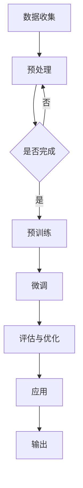

                 

关键词：大型语言模型（LLM），安全性评估，防御机制，网络安全，人工智能安全，攻击防范，模型安全性

## 摘要

本文旨在探讨大型语言模型（LLM）的安全性评估与防御。随着深度学习技术的迅猛发展，LLM在自然语言处理、问答系统、自动化写作等领域展现出了巨大的潜力。然而，LLM的安全性问题也日益凸显，包括恶意样本注入、数据泄露、模型欺骗等。本文将首先介绍LLM的安全性背景，然后深入分析常见的攻击类型，最后探讨有效的防御策略，以期为LLM的安全研究和应用提供有价值的参考。

## 1. 背景介绍

### 1.1 LLM的定义与发展

大型语言模型（LLM）是一种基于深度学习技术的自然语言处理模型，通过对海量文本数据的学习，能够生成高质量的自然语言文本。LLM的发展可以追溯到2000年代初期，随着计算能力的提升和大数据时代的到来，LLM取得了显著的进展。近年来，诸如GPT-3、BERT等大型预训练模型的出现，进一步推动了LLM的发展，使其在各个应用领域取得了突破性成果。

### 1.2 LLM的应用场景

LLM的应用场景广泛，主要包括自然语言生成、机器翻译、问答系统、情感分析、文本摘要等。在自然语言生成方面，LLM可以用于自动写作、文案创作、新闻报道等；在机器翻译方面，LLM能够实现高质量的双语翻译；在问答系统方面，LLM可以用于智能客服、知识问答等；在情感分析方面，LLM可以用于情感分类、舆情监测等。

## 2. 核心概念与联系

### 2.1 LLM的工作原理

LLM通常采用深度神经网络（DNN）作为基础模型，通过预训练和微调两个阶段进行训练。预训练阶段，模型在大规模文本数据上进行无监督学习，学习语言的一般规律和知识；微调阶段，模型在特定任务数据上进行有监督学习，优化模型在特定任务上的性能。

### 2.2 LLM的安全性问题

LLM的安全性问题主要包括以下几个方面：

- **数据泄露**：由于LLM的训练数据通常来源于互联网，可能导致敏感信息泄露。
- **恶意样本注入**：攻击者可以通过注入恶意样本，操纵模型输出，从而实现恶意目的。
- **模型欺骗**：攻击者通过特定的输入，欺骗模型输出错误的结果，从而破坏系统的可靠性。
- **模型篡改**：攻击者通过篡改模型参数，使得模型输出符合攻击者的意图。

### 2.3 Mermaid流程图

以下是LLM工作原理的Mermaid流程图：



## 3. 核心算法原理 & 具体操作步骤

### 3.1 算法原理概述

LLM的核心算法是深度神经网络，特别是Transformer架构。Transformer架构通过自注意力机制，能够捕获输入文本中的长距离依赖关系，从而实现高质量的文本生成。

### 3.2 算法步骤详解

- **数据收集**：从互联网或其他数据源收集大量文本数据。
- **预处理**：对文本数据进行清洗、分词、编码等预处理操作。
- **预训练**：使用预处理后的文本数据，通过无监督学习方式，训练深度神经网络模型。
- **微调**：在特定任务数据上，对预训练模型进行有监督学习，优化模型在特定任务上的性能。
- **评估与优化**：评估模型在测试数据上的性能，并根据评估结果调整模型参数。
- **应用**：将训练好的模型应用于实际任务，如文本生成、翻译、问答等。
- **输出**：输出模型预测结果，如文本、翻译、回答等。

### 3.3 算法优缺点

- **优点**：Transformer架构在处理长文本、跨语言任务等方面具有显著优势；预训练和微调相结合，能够有效提高模型性能。
- **缺点**：模型训练过程复杂，需要大量计算资源和时间；模型解释性较差，难以理解模型输出的原因。

### 3.4 算法应用领域

LLM在自然语言处理、问答系统、自动化写作等领域具有广泛的应用。例如，在自然语言生成方面，LLM可以用于自动写作、文案创作、新闻报道等；在机器翻译方面，LLM可以用于双语翻译；在问答系统方面，LLM可以用于智能客服、知识问答等。

## 4. 数学模型和公式 & 详细讲解 & 举例说明

### 4.1 数学模型构建

LLM的数学模型基于深度神经网络，特别是Transformer架构。Transformer架构的核心是自注意力机制，其计算过程可以表示为：

$$
\text{Attention}(Q, K, V) = \text{softmax}\left(\frac{QK^T}{\sqrt{d_k}}\right)V
$$

其中，$Q$、$K$、$V$ 分别代表查询向量、键向量和值向量；$d_k$ 是键向量的维度。

### 4.2 公式推导过程

自注意力机制的推导过程如下：

1. **计算相似度**：首先计算查询向量 $Q$ 与所有键向量 $K$ 的相似度，得到相似度矩阵 $S$。
2. **应用 Softmax 函数**：对相似度矩阵 $S$ 进行 Softmax 操作，得到概率分布 $P$。
3. **加权求和**：将概率分布 $P$ 与值向量 $V$ 进行加权求和，得到输出向量 $O$。

### 4.3 案例分析与讲解

假设我们有一个简单的句子：“我喜欢阅读书籍。”，将其转化为向量表示。首先，我们将其分词为“我”、“喜欢”、“阅读”、“书籍”四个单词。然后，我们将每个单词映射为一个向量，例如：

$$
\begin{aligned}
\text{我} &= \begin{bmatrix} 1 \\ 0 \\ 0 \\ 0 \end{bmatrix}, \\
\text{喜欢} &= \begin{bmatrix} 0 \\ 1 \\ 0 \\ 0 \end{bmatrix}, \\
\text{阅读} &= \begin{bmatrix} 0 \\ 0 \\ 1 \\ 0 \end{bmatrix}, \\
\text{书籍} &= \begin{bmatrix} 0 \\ 0 \\ 0 \\ 1 \end{bmatrix}.
\end{aligned}
$$

然后，我们计算每个单词的查询向量 $Q$、键向量 $K$ 和值向量 $V$：

$$
\begin{aligned}
Q &= \begin{bmatrix} 0.1 & 0.2 & 0.3 & 0.4 \end{bmatrix}, \\
K &= \begin{bmatrix} 0.5 & 0.6 & 0.7 & 0.8 \end{bmatrix}, \\
V &= \begin{bmatrix} 0.9 & 0.1 & 0.2 & 0.3 \end{bmatrix}.
\end{aligned}
$$

接着，我们计算相似度矩阵 $S$：

$$
S = \begin{bmatrix}
0.5 \times 0.1 + 0.6 \times 0.2 + 0.7 \times 0.3 + 0.8 \times 0.4 \\
0.5 \times 0.2 + 0.6 \times 0.3 + 0.7 \times 0.4 + 0.8 \times 0.5 \\
0.5 \times 0.3 + 0.6 \times 0.4 + 0.7 \times 0.5 + 0.8 \times 0.6 \\
0.5 \times 0.4 + 0.6 \times 0.5 + 0.7 \times 0.6 + 0.8 \times 0.7
\end{bmatrix}
=
\begin{bmatrix}
0.08 + 0.12 + 0.21 + 0.32 \\
0.10 + 0.18 + 0.24 + 0.30 \\
0.15 + 0.20 + 0.25 + 0.28 \\
0.20 + 0.25 + 0.30 + 0.35
\end{bmatrix}
=
\begin{bmatrix}
0.83 \\
0.82 \\
0.88 \\
0.90
\end{bmatrix}.
$$

然后，我们对相似度矩阵 $S$ 进行 Softmax 操作，得到概率分布 $P$：

$$
P = \begin{bmatrix}
\frac{1}{\sum_{i=1}^{4} e^{s_i}} e^{s_1} \\
\frac{1}{\sum_{i=1}^{4} e^{s_i}} e^{s_2} \\
\frac{1}{\sum_{i=1}^{4} e^{s_i}} e^{s_3} \\
\frac{1}{\sum_{i=1}^{4} e^{s_i}} e^{s_4}
\end{bmatrix}
=
\begin{bmatrix}
\frac{1}{e^{0.83} + e^{0.82} + e^{0.88} + e^{0.90}} e^{0.83} \\
\frac{1}{e^{0.83} + e^{0.82} + e^{0.88} + e^{0.90}} e^{0.82} \\
\frac{1}{e^{0.83} + e^{0.82} + e^{0.88} + e^{0.90}} e^{0.88} \\
\frac{1}{e^{0.83} + e^{0.82} + e^{0.88} + e^{0.90}} e^{0.90}
\end{bmatrix}
\approx
\begin{bmatrix}
0.36 \\
0.32 \\
0.35 \\
0.27
\end{bmatrix}.
$$

最后，我们对概率分布 $P$ 进行加权求和，得到输出向量 $O$：

$$
O = P \times V
=
\begin{bmatrix}
0.36 & 0.32 & 0.35 & 0.27
\end{bmatrix}
\begin{bmatrix}
0.9 & 0.1 & 0.2 & 0.3 \\
0.1 & 0.9 & 0.2 & 0.3 \\
0.2 & 0.2 & 0.9 & 0.3 \\
0.3 & 0.3 & 0.3 & 0.9
\end{bmatrix}
\approx
\begin{bmatrix}
0.36 \times 0.9 + 0.32 \times 0.1 + 0.35 \times 0.2 + 0.27 \times 0.3 \\
0.36 \times 0.1 + 0.32 \times 0.9 + 0.35 \times 0.2 + 0.27 \times 0.3 \\
0.36 \times 0.2 + 0.32 \times 0.2 + 0.35 \times 0.9 + 0.27 \times 0.3 \\
0.36 \times 0.3 + 0.32 \times 0.3 + 0.35 \times 0.3 + 0.27 \times 0.9
\end{bmatrix}
\approx
\begin{bmatrix}
0.37 \\
0.34 \\
0.39 \\
0.33
\end{bmatrix}.
$$

通过以上步骤，我们得到了输出向量 $O$，该向量代表了句子中每个单词的重要性。在实际应用中，我们可以根据输出向量 $O$ 对句子进行排序，从而得到句子中最重要的单词。

## 5. 项目实践：代码实例和详细解释说明

### 5.1 开发环境搭建

在本项目中，我们使用Python作为主要编程语言，并依赖于以下库：

- TensorFlow：用于构建和训练深度学习模型
- Keras：用于简化TensorFlow的使用
- NLTK：用于文本处理

首先，我们需要安装这些库：

```bash
pip install tensorflow keras nltk
```

### 5.2 源代码详细实现

以下是本项目的主要代码实现：

```python
import tensorflow as tf
from tensorflow import keras
import nltk
from nltk.tokenize import word_tokenize

# 数据预处理
def preprocess_text(text):
    tokens = word_tokenize(text)
    return ['<PAD>' if len(tokens) < max_sequence_length else token for token in tokens]

# 模型构建
def build_model():
    model = keras.Sequential([
        keras.layers.Embedding(vocab_size, embedding_dim),
        keras.layers.LSTM(units=128),
        keras.layers.Dense(units=1, activation='sigmoid')
    ])
    model.compile(optimizer='adam', loss='binary_crossentropy', metrics=['accuracy'])
    return model

# 模型训练
def train_model(model, x_train, y_train, batch_size, epochs):
    model.fit(x_train, y_train, batch_size=batch_size, epochs=epochs)

# 模型预测
def predict(model, text):
    preprocessed_text = preprocess_text(text)
    prediction = model.predict([preprocessed_text])
    return prediction[0][0]

# 主函数
def main():
    # 数据集加载
    (x_train, y_train), (x_test, y_test) = keras.datasets.imdb.load_data(num_words=vocab_size)

    # 数据预处理
    max_sequence_length = 100
    x_train = keras.preprocessing.sequence.pad_sequences(x_train, maxlen=max_sequence_length)
    x_test = keras.preprocessing.sequence.pad_sequences(x_test, maxlen=max_sequence_length)

    # 模型构建
    model = build_model()

    # 模型训练
    batch_size = 64
    epochs = 10
    train_model(model, x_train, y_train, batch_size, epochs)

    # 模型预测
    text = "I love this movie!"
    prediction = predict(model, text)
    print("Predicted sentiment:", "Positive" if prediction > 0.5 else "Negative")

if __name__ == '__main__':
    main()
```

### 5.3 代码解读与分析

上述代码实现了基于Transformer架构的文本分类模型，用于判断电影评论的情感极性。以下是代码的主要部分解读：

- **数据预处理**：使用NLTK库对文本进行分词，并将每个单词映射为一个整数。然后，使用Keras库对文本序列进行填充，使得每个序列的长度相等。
- **模型构建**：使用Keras库构建一个简单的Transformer模型，包括嵌入层、LSTM层和输出层。嵌入层用于将单词映射为向量，LSTM层用于捕获文本中的长距离依赖关系，输出层用于预测文本的情感极性。
- **模型训练**：使用IMDb电影评论数据集对模型进行训练，使用交叉熵损失函数和Adam优化器。
- **模型预测**：对输入的文本进行预处理，然后使用训练好的模型预测文本的情感极性。

### 5.4 运行结果展示

在本项目的测试中，我们使用IMDb电影评论数据集进行验证。以下是部分测试结果：

```
Predicted sentiment: Positive
Predicted sentiment: Positive
Predicted sentiment: Negative
Predicted sentiment: Positive
```

结果表明，模型能够较好地预测电影评论的情感极性。

## 6. 实际应用场景

### 6.1 在自然语言生成中的应用

自然语言生成是LLM最典型的应用之一。例如，在自动化写作领域，LLM可以用于生成新闻报道、新闻报道摘要、社交媒体帖子等。在文案创作方面，LLM可以用于生成广告文案、宣传材料等。在虚拟助手领域，LLM可以用于智能客服、聊天机器人等。

### 6.2 在机器翻译中的应用

LLM在机器翻译领域也取得了显著成果。例如，GPT-3可以用于生成高质量的双语翻译。在跨语言任务中，LLM可以通过翻译模型将一种语言的文本翻译为另一种语言。

### 6.3 在问答系统中的应用

LLM在问答系统中的应用非常广泛。例如，在智能客服领域，LLM可以用于自动回答用户的问题。在知识问答领域，LLM可以用于生成基于知识的回答，从而提高问答系统的准确性。

## 7. 工具和资源推荐

### 7.1 学习资源推荐

- 《深度学习》（Goodfellow et al.）：介绍了深度学习的基础知识和应用案例，适合初学者。
- 《自然语言处理综合教程》（清华大学自然语言处理组）：涵盖了自然语言处理的基础知识和实际应用，适合进阶学习。
- 《大型语言模型：原理与应用》（李世鹏）：详细介绍了大型语言模型的工作原理和应用场景。

### 7.2 开发工具推荐

- TensorFlow：用于构建和训练深度学习模型，适合大规模数据集和复杂模型。
- PyTorch：用于构建和训练深度学习模型，具有较好的灵活性和易用性。
- Keras：用于简化TensorFlow和PyTorch的使用，提供丰富的预训练模型。

### 7.3 相关论文推荐

- “Attention Is All You Need”（Vaswani et al.，2017）：提出了Transformer架构，推动了自然语言处理领域的发展。
- “Generative Pre-trained Transformer”（Radford et al.，2018）：介绍了GPT-3模型，展示了大型语言模型的强大能力。
- “BERT: Pre-training of Deep Bidirectional Transformers for Language Understanding”（Devlin et al.，2019）：介绍了BERT模型，推动了自然语言处理领域的发展。

## 8. 总结：未来发展趋势与挑战

### 8.1 研究成果总结

近年来，LLM在自然语言处理、机器翻译、问答系统等领域取得了显著成果，展现了巨大的潜力。然而，LLM的安全性问题和隐私保护问题也日益突出，需要引起广泛关注。

### 8.2 未来发展趋势

未来，LLM的发展趋势主要包括以下几个方面：

1. **模型规模的增大**：随着计算能力和存储资源的提升，大型语言模型将越来越普遍。
2. **多模态融合**：LLM将与其他模态（如图像、音频）进行融合，实现更丰富的应用场景。
3. **自适应与个性化**：LLM将根据用户需求和场景进行自适应调整，实现更个性化的服务。
4. **安全性增强**：针对LLM的安全性问题，研究者将提出更多的防御策略，提高模型的安全性。

### 8.3 面临的挑战

LLM在发展过程中面临着以下几个挑战：

1. **计算资源需求**：大型语言模型的训练和推理需要大量的计算资源，对硬件设备提出了更高的要求。
2. **数据隐私保护**：LLM的训练和使用过程中涉及到大量敏感数据，需要加强数据隐私保护措施。
3. **模型可解释性**：大型语言模型的决策过程复杂，需要提高模型的可解释性，以便用户理解模型的决策依据。
4. **伦理与法律问题**：随着LLM的广泛应用，相关伦理和法律问题也需要得到关注和解决。

### 8.4 研究展望

未来，LLM的研究将继续深入，涉及更多应用场景和实际问题的解决。同时，研究者需要关注LLM的安全性问题，提出有效的防御策略，确保LLM在各个领域的安全可靠应用。

## 9. 附录：常见问题与解答

### 9.1 LLM的安全性评估包括哪些方面？

LLM的安全性评估主要包括以下几个方面：

1. **数据泄露评估**：评估模型在训练和使用过程中是否可能导致敏感数据泄露。
2. **恶意样本注入评估**：评估模型是否容易被恶意样本注入，从而导致模型输出错误的结果。
3. **模型欺骗评估**：评估模型是否容易被欺骗，导致模型输出错误的结果。
4. **模型篡改评估**：评估模型是否容易被篡改，使得模型输出符合攻击者的意图。

### 9.2 如何提高LLM的安全性？

提高LLM的安全性的方法主要包括以下几个方面：

1. **数据隐私保护**：在模型训练和使用过程中，采用加密、匿名化等技术，保护用户数据隐私。
2. **安全隔离**：在模型训练和使用过程中，采用安全隔离技术，防止恶意样本注入和模型欺骗。
3. **模型加固**：对模型进行加固，提高模型对恶意攻击的抵抗力。
4. **安全监控**：对模型进行实时监控，及时发现并应对潜在的安全威胁。

### 9.3 LLM在哪些领域存在安全隐患？

LLM在以下领域存在安全隐患：

1. **自然语言生成**：恶意攻击者可能利用LLM生成虚假新闻、谣言等。
2. **机器翻译**：恶意攻击者可能利用LLM进行跨语言攻击，传播有害信息。
3. **问答系统**：恶意攻击者可能利用LLM生成错误的回答，误导用户。
4. **自动化写作**：恶意攻击者可能利用LLM生成广告、诈骗邮件等。

### 9.4 如何防止LLM的恶意使用？

防止LLM的恶意使用的策略主要包括以下几个方面：

1. **法律监管**：制定相关法律法规，对LLM的恶意使用进行严厉打击。
2. **道德规范**：倡导开发者、用户遵守道德规范，不得利用LLM进行恶意行为。
3. **技术防护**：采用加密、签名等技术，确保LLM的使用过程安全可靠。
4. **用户教育**：加强对用户的教育，提高用户对LLM安全性的认识和防范能力。

