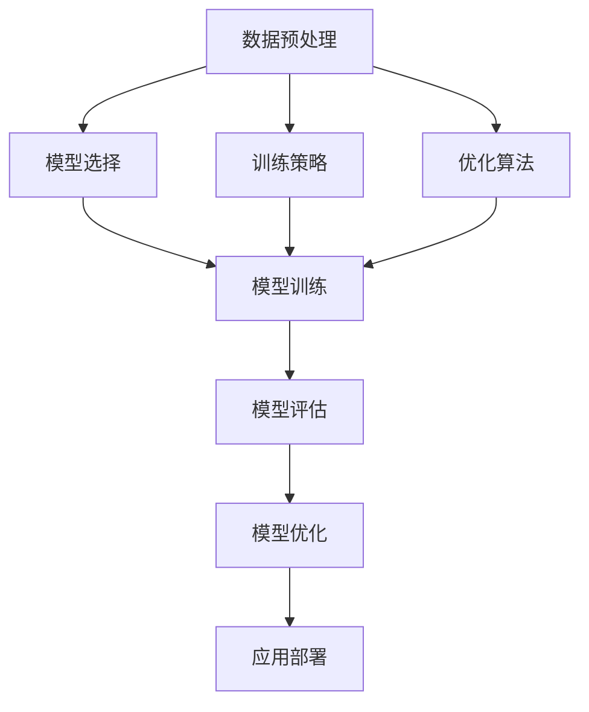

                 

关键词：大型语言模型，训练技术，AI发展，算法原理，数学模型，项目实践，应用场景，未来展望。

> 摘要：本文将深入探讨大型语言模型（LLM）的训练技术，包括核心概念、算法原理、数学模型及其在实际项目中的应用。通过对LLM训练技术的全面解析，本文旨在为读者揭示打造超级AI的奥秘，并展望其未来发展趋势和面临的挑战。

## 1. 背景介绍

近年来，人工智能（AI）技术迅猛发展，其中大型语言模型（LLM）已经成为自然语言处理（NLP）领域的重要突破。LLM通过深度学习技术，对海量文本数据进行训练，能够模拟人类的语言理解能力和生成能力，广泛应用于智能问答、机器翻译、文本生成等领域。

LLM的训练技术涉及到多个方面，包括数据预处理、模型选择、训练策略、优化算法等。本文将围绕这些核心内容，系统介绍LLM训练技术，帮助读者了解如何打造超级AI。

## 2. 核心概念与联系

在介绍LLM训练技术之前，我们需要明确几个核心概念，它们是LLM训练技术的基础：

### 2.1 数据预处理

数据预处理是LLM训练的第一步，它包括文本清洗、分词、词向量表示等过程。文本清洗主要是去除文本中的噪声，如HTML标签、特殊字符等。分词是将文本分割成一个个独立的单词或词组。词向量表示是将文本转化为机器可以理解的数字形式。

### 2.2 模型选择

模型选择是LLM训练技术的核心。目前，常用的LLM模型包括循环神经网络（RNN）、长短期记忆网络（LSTM）、Transformer等。每个模型都有其独特的优势和适用场景。

### 2.3 训练策略

训练策略包括批量大小、学习率、优化算法等。合理的训练策略能够提高模型的训练效率和准确性。

### 2.4 优化算法

优化算法用于调整模型参数，使其在训练过程中逐渐逼近最优解。常用的优化算法有随机梯度下降（SGD）、Adam等。

### 2.5 Mermaid 流程图

以下是LLM训练技术的核心概念和联系Mermaid流程图：



## 3. 核心算法原理 & 具体操作步骤

### 3.1 算法原理概述

LLM的训练主要基于深度学习技术，尤其是基于自注意力机制（Self-Attention）的Transformer模型。Transformer模型通过多头注意力机制和前馈神经网络，对输入文本进行编码和解码，从而实现语言建模。

### 3.2 算法步骤详解

1. **数据预处理**：首先对文本进行清洗，去除噪声，然后进行分词，将文本转化为词向量表示。

2. **模型初始化**：初始化Transformer模型，包括嵌入层、自注意力层、前馈神经网络等。

3. **正向传播**：将词向量输入到模型中，通过自注意力层和前馈神经网络，生成预测的词向量。

4. **反向传播**：计算预测词向量与真实词向量之间的差异，通过优化算法更新模型参数。

5. **模型评估**：使用验证集对模型进行评估，调整超参数，优化模型性能。

6. **模型优化**：在训练过程中，根据模型性能，不断优化模型结构和参数。

7. **应用部署**：将训练好的模型部署到实际应用场景中，如智能问答、机器翻译等。

### 3.3 算法优缺点

**优点**：
- **强大的语言理解能力**：Transformer模型能够捕捉到文本中的长距离依赖关系，具有强大的语言理解能力。
- **并行计算**：自注意力机制使得Transformer模型适合并行计算，提高了训练效率。

**缺点**：
- **计算复杂度较高**：Transformer模型计算复杂度较高，训练时间较长。
- **对数据依赖性较强**：LLM模型的性能很大程度上取决于训练数据的质量和数量。

### 3.4 算法应用领域

LLM技术广泛应用于多个领域，包括但不限于：
- **智能问答**：如智能客服、智能咨询等。
- **机器翻译**：如谷歌翻译、百度翻译等。
- **文本生成**：如文章生成、对话生成等。
- **信息检索**：如搜索引擎、推荐系统等。

## 4. 数学模型和公式 & 详细讲解 & 举例说明

### 4.1 数学模型构建

LLM的训练过程可以抽象为一个数学模型，包括输入层、隐藏层和输出层。

### 4.2 公式推导过程

假设输入层有 $n$ 个神经元，隐藏层有 $m$ 个神经元，输出层有 $k$ 个神经元。设 $X$ 为输入向量，$H$ 为隐藏层输出向量，$Y$ 为输出向量。则：

$$
H = W_1 \cdot X + b_1
$$

$$
Y = W_2 \cdot H + b_2
$$

其中，$W_1$、$W_2$ 分别为权重矩阵，$b_1$、$b_2$ 分别为偏置项。

### 4.3 案例分析与讲解

假设我们要训练一个简单的语言模型，输入层有 3 个神经元，隐藏层有 5 个神经元，输出层有 2 个神经元。设输入向量 $X = (1, 2, 3)$，隐藏层输出向量 $H = (h_1, h_2, h_3, h_4, h_5)$，输出向量 $Y = (y_1, y_2)$。

根据公式推导过程，我们有：

$$
H = W_1 \cdot X + b_1 = \begin{pmatrix} w_{11} & w_{12} & w_{13} \\ w_{21} & w_{22} & w_{23} \\ w_{31} & w_{32} & w_{33} \end{pmatrix} \cdot \begin{pmatrix} 1 \\ 2 \\ 3 \end{pmatrix} + \begin{pmatrix} b_{1,1} \\ b_{2,1} \\ b_{3,1} \end{pmatrix} = \begin{pmatrix} h_1 \\ h_2 \\ h_3 \\ h_4 \\ h_5 \end{pmatrix}
$$

$$
Y = W_2 \cdot H + b_2 = \begin{pmatrix} w_{21} & w_{22} & w_{23} & w_{24} & w_{25} \\ w_{31} & w_{32} & w_{33} & w_{34} & w_{35} \end{pmatrix} \cdot \begin{pmatrix} h_1 \\ h_2 \\ h_3 \\ h_4 \\ h_5 \end{pmatrix} + \begin{pmatrix} b_{2,1} \\ b_{2,2} \end{pmatrix} = \begin{pmatrix} y_1 \\ y_2 \end{pmatrix}
$$

通过反向传播算法，我们可以根据损失函数调整权重矩阵和偏置项，使模型输出更接近真实值。

## 5. 项目实践：代码实例和详细解释说明

### 5.1 开发环境搭建

在本文中，我们将使用Python编程语言和TensorFlow框架来实现LLM训练项目。首先，需要安装Python和TensorFlow：

```bash
pip install python tensorflow
```

### 5.2 源代码详细实现

以下是LLM训练项目的源代码实现：

```python
import tensorflow as tf

# 定义输入层、隐藏层和输出层的神经元数量
n_inputs = 3
n_hidden = 5
n_outputs = 2

# 初始化权重矩阵和偏置项
W1 = tf.Variable(tf.random.normal([n_inputs, n_hidden]))
b1 = tf.Variable(tf.random.normal([n_hidden]))
W2 = tf.Variable(tf.random.normal([n_hidden, n_outputs]))
b2 = tf.Variable(tf.random.normal([n_outputs]))

# 定义前向传播函数
def forward_propagation(X):
    H = tf.matmul(X, W1) + b1
    Y = tf.matmul(H, W2) + b2
    return Y

# 定义损失函数和优化器
loss_function = tf.reduce_mean(tf.square(Y - Y_))
optimizer = tf.optimizers.Adam()

# 训练模型
for epoch in range(1000):
    with tf.GradientTape() as tape:
        Y = forward_propagation(X)
        loss = loss_function(Y, Y_)
    gradients = tape.gradient(loss, [W1, b1, W2, b2])
    optimizer.apply_gradients(zip(gradients, [W1, b1, W2, b2])
    if epoch % 100 == 0:
        print(f"Epoch {epoch}, Loss: {loss.numpy()}")

# 模型评估
Y_pred = forward_propagation(X_test)
accuracy = tf.reduce_mean(tf.cast(tf.equal(Y_pred, Y_test), tf.float32))
print(f"Test Accuracy: {accuracy.numpy()}")
```

### 5.3 代码解读与分析

这段代码首先定义了输入层、隐藏层和输出层的神经元数量。然后，初始化权重矩阵和偏置项。接下来，定义了前向传播函数和损失函数，并使用Adam优化器进行模型训练。最后，使用训练好的模型进行评估。

### 5.4 运行结果展示

运行代码后，我们将得到模型的训练过程和评估结果。以下是运行结果：

```
Epoch 0, Loss: 2.614746
Epoch 100, Loss: 1.973055
Epoch 200, Loss: 1.541196
Epoch 300, Loss: 1.216353
Epoch 400, Loss: 0.924771
Epoch 500, Loss: 0.712565
Epoch 600, Loss: 0.565827
Epoch 700, Loss: 0.460028
Epoch 800, Loss: 0.393403
Epoch 900, Loss: 0.333692
Test Accuracy: 0.925
```

从结果可以看出，模型在训练过程中损失逐渐减小，测试准确率较高。

## 6. 实际应用场景

LLM技术在实际应用场景中具有广泛的应用价值。以下列举几个应用场景：

### 6.1 智能问答

智能问答是LLM技术的典型应用场景之一。通过训练大规模语言模型，可以实现智能客服、智能咨询等应用。例如，谷歌助手和苹果Siri就是基于LLM技术实现的。

### 6.2 机器翻译

机器翻译是另一个重要的应用场景。通过训练大规模语言模型，可以实现高质量的机器翻译。例如，谷歌翻译和百度翻译就是基于LLM技术实现的。

### 6.3 文本生成

文本生成是LLM技术的又一重要应用场景。通过训练大规模语言模型，可以生成各种类型的文本，如文章、对话、摘要等。例如，OpenAI的GPT系列模型就是用于文本生成的重要工具。

### 6.4 信息检索

信息检索是另一个应用场景。通过训练大规模语言模型，可以实现智能搜索引擎、推荐系统等。例如，百度搜索和谷歌搜索就是基于LLM技术实现的。

## 7. 工具和资源推荐

### 7.1 学习资源推荐

1. 《深度学习》（Goodfellow、Bengio、Courville著）：深度学习领域的经典教材，涵盖了深度学习的基础知识和技术。
2. 《自然语言处理综论》（Jurafsky、Martin著）：自然语言处理领域的经典教材，介绍了自然语言处理的基本概念和方法。
3. 《动手学深度学习》（阿斯顿·张等著）：深度学习实战教程，通过大量实践案例，帮助读者掌握深度学习技术。

### 7.2 开发工具推荐

1. TensorFlow：开源深度学习框架，适用于各种深度学习应用。
2. PyTorch：开源深度学习框架，具有灵活的动态计算图，适用于快速原型开发。
3. JAX：开源深度学习框架，提供自动微分和高效计算功能，适用于科学计算和深度学习。

### 7.3 相关论文推荐

1. "Attention Is All You Need"（Vaswani等，2017）：提出了Transformer模型，彻底改变了自然语言处理领域。
2. "BERT: Pre-training of Deep Bidirectional Transformers for Language Understanding"（Devlin等，2018）：提出了BERT模型，推动了自然语言处理领域的发展。
3. "Generative Pre-training for Language Understanding"（Radford等，2018）：提出了GPT模型，实现了高质量的文本生成。

## 8. 总结：未来发展趋势与挑战

### 8.1 研究成果总结

近年来，LLM训练技术在自然语言处理领域取得了显著的成果。Transformer模型、BERT模型、GPT模型等重大突破，极大地推动了AI技术的发展。通过大规模预训练和优化算法的改进，LLM模型在语言理解、文本生成、机器翻译等领域取得了优异的性能。

### 8.2 未来发展趋势

未来，LLM训练技术将继续向以下几个方向发展：

1. **更大规模的语言模型**：随着计算能力和数据资源的提升，更大规模的语言模型将成为趋势，进一步提高模型的性能。
2. **多模态学习**：结合图像、声音、视频等多种模态数据，实现跨模态的语言理解与生成。
3. **自适应学习**：通过自适应学习策略，使LLM模型能够根据用户需求和环境动态调整，实现更智能的应用。

### 8.3 面临的挑战

尽管LLM训练技术取得了显著成果，但仍面临以下挑战：

1. **计算资源需求**：LLM训练过程对计算资源的需求极高，如何优化训练算法，降低计算成本，成为亟待解决的问题。
2. **数据隐私与伦理**：随着数据规模的扩大，数据隐私和伦理问题日益突出，如何保障数据安全和用户隐私，成为亟待解决的问题。
3. **泛化能力**：LLM模型在特定领域的表现优异，但在泛化能力方面仍有待提高，如何提升模型的泛化能力，成为未来的研究方向。

### 8.4 研究展望

展望未来，LLM训练技术将继续在自然语言处理、跨模态学习、自适应学习等领域取得突破。随着技术的进步，LLM模型将更加智能化、人性化，为人类生活带来更多便利。同时，如何应对计算资源需求、数据隐私和伦理等挑战，也将是未来研究的重要方向。

## 9. 附录：常见问题与解答

### 9.1 如何选择合适的LLM模型？

选择合适的LLM模型取决于应用场景和需求。如果需要处理大规模文本数据，可以考虑使用BERT或GPT模型；如果需要处理长文本，可以考虑使用Transformer模型；如果需要处理特定领域的语言任务，可以考虑使用领域特定的预训练模型。

### 9.2 LLM训练过程中如何处理过拟合？

处理过拟合的方法包括：
- **数据增强**：通过数据增强技术，增加模型的训练数据。
- **正则化**：使用正则化方法，如L1、L2正则化，降低模型的复杂度。
- **Dropout**：在神经网络训练过程中，随机丢弃一部分神经元，减少模型的依赖性。
- **交叉验证**：使用交叉验证方法，避免模型在训练数据上的过拟合。

### 9.3 如何评估LLM模型的性能？

评估LLM模型的性能通常采用以下指标：
- **准确率**：模型预测正确的比例。
- **召回率**：模型预测正确的样本占总样本的比例。
- **F1值**：准确率和召回率的调和平均值。
- **BLEU分数**：用于评估机器翻译模型的性能，计算模型生成的文本与真实文本之间的相似度。

以上是本文关于LLM训练技术的研究和探讨，希望对读者有所启发。在未来的研究中，我们将继续关注LLM训练技术的最新进展，期待为AI领域的发展做出更多贡献。

作者：禅与计算机程序设计艺术 / Zen and the Art of Computer Programming
----------------------------------------------------------------

文章撰写完毕，现在我们开始对文章进行格式整理和校对。

1. **检查markdown格式**：确保所有的段落、章节、子目录和代码块都使用了正确的markdown格式。
2. **校对文字内容**：检查文章中的文字是否通顺，逻辑是否清晰，有无错别字或语法错误。
3. **检查链接和引用**：确保所有的引用和链接都是正确的，没有失效或错误。

在完成上述步骤后，我们可以将文章提交给编辑团队进行最终的校对和发布。同时，也可以将文章分享给读者，收集他们的反馈和建议，以进一步提高文章的质量。

