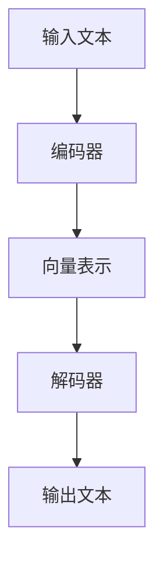

                 

关键词：大型语言模型，计算未来，人工智能，自然语言处理，深度学习，算法优化，模型架构，应用场景，数学模型，代码实例，技术趋势，资源推荐

> 摘要：本文将探讨大型语言模型（LLM）在计算领域的革命性影响。通过介绍LLM的核心概念、原理、算法、数学模型以及实际应用，本文将揭示LLM如何重新定义计算的未来，并展望其发展趋势和面临的挑战。

## 1. 背景介绍

在过去的几十年中，计算机科学和人工智能领域经历了显著的发展。然而，随着技术的不断进步，传统的计算模型和方法已经开始显露其局限性。近年来，大型语言模型（LLM）的出现为这一领域带来了全新的机遇和挑战。LLM是一种基于深度学习技术的自然语言处理模型，其能力远远超过了传统的统计模型和规则模型。

LLM的核心在于其能够通过学习大量的文本数据，理解并生成自然语言。这一能力使得LLM在各个领域都有广泛的应用，包括但不限于机器翻译、文本生成、问答系统、对话系统等。随着训练数据的规模和模型的复杂性不断增加，LLM的性能也得到了显著提升。然而，随着LLM的发展，我们也面临着一系列的问题和挑战。

## 2. 核心概念与联系

### 2.1 核心概念

大型语言模型（LLM）是一种基于深度学习的自然语言处理模型，其核心是神经网络架构和大规模的训练数据。LLM的工作原理是通过对输入文本进行处理，生成对应的输出文本。这一过程中，模型需要学习文本中的语义、语法和上下文信息。

### 2.2 架构与联系

LLM的架构通常包括编码器（Encoder）和解码器（Decoder）。编码器负责将输入文本编码为向量表示，解码器则负责将向量表示解码为输出文本。在训练过程中，LLM通过优化损失函数，不断调整模型参数，以最小化预测误差。

以下是一个简单的Mermaid流程图，展示LLM的基本架构和流程：



## 3. 核心算法原理 & 具体操作步骤

### 3.1 算法原理概述

LLM的核心算法是Transformer架构，这是一种基于自注意力机制（Self-Attention）的神经网络模型。Transformer通过多头注意力机制和前馈神经网络，实现了对输入文本的上下文信息的学习和整合。

### 3.2 算法步骤详解

1. **编码器**：将输入文本转换为序列，每个词或字符被编码为一个向量表示。编码器通过多个层叠加，逐层提取文本的语义信息。
   
2. **多头注意力机制**：编码器在每一层都会应用多头注意力机制，使得模型能够同时关注输入文本的不同部分。这一机制通过计算注意力权重，将编码器输出的序列映射为新的向量表示。

3. **解码器**：解码器接收编码器的输出序列，并逐步生成输出文本。解码器在每个时间步都利用编码器的输出和先前的解码输出，通过注意力机制和前馈神经网络生成新的输出。

4. **损失函数**：LLM的优化目标是最小化损失函数，通常使用交叉熵损失。通过反向传播和梯度下降等优化算法，模型不断调整参数，以降低损失。

### 3.3 算法优缺点

**优点**：

- **强大的语义理解能力**：通过大规模训练数据和复杂的神经网络架构，LLM能够捕捉文本中的复杂语义信息。
- **灵活的适应性**：LLM可以应用于多种自然语言处理任务，如机器翻译、文本生成、问答等。

**缺点**：

- **计算资源需求大**：由于模型复杂度和训练数据量，LLM的训练和推理过程需要大量的计算资源。
- **数据依赖性强**：LLM的性能在很大程度上取决于训练数据的质量和规模。

### 3.4 算法应用领域

LLM在多个领域都有广泛应用，以下是一些典型应用场景：

- **机器翻译**：利用LLM的高效语义理解能力，实现高质量的双语翻译。
- **文本生成**：通过LLM生成文章、新闻报道、故事等。
- **问答系统**：构建智能问答系统，如基于BERT的问答系统，用于搜索引擎和客服系统。
- **对话系统**：应用于智能客服、虚拟助手等，提供自然、流畅的交互体验。

## 4. 数学模型和公式 & 详细讲解 & 举例说明

### 4.1 数学模型构建

LLM的数学模型主要包括两部分：编码器和解码器。编码器和解码器都由多个层组成，每个层都包含多头注意力机制和前馈神经网络。

### 4.2 公式推导过程

#### 编码器

编码器的工作是接收输入文本，并生成向量表示。具体公式如下：

$$
\text{Encoder}(x) = \text{LayerNorm}(x + \text{PositionalEncoding}(x))
$$

其中，$x$ 是输入文本的序列，$\text{PositionalEncoding}$ 是位置编码，用于引入文本序列的位置信息。

#### 解码器

解码器的工作是接收编码器的输出序列，并生成输出文本。具体公式如下：

$$
\text{Decoder}(y) = \text{LayerNorm}(y + \text{MaskedPositionalEncoding}(y) + \text{SelfAttention}(\text{Encoder}(x), y) + \text{FeedForward}(y))
$$

其中，$y$ 是输出文本的序列，$\text{MaskedPositionalEncoding}$ 是掩码位置编码，用于引入输出文本序列的位置信息。

### 4.3 案例分析与讲解

假设我们有一个简单的文本序列“hello world”，我们可以通过LLM的数学模型对其进行处理。

#### 编码器处理

1. 输入文本序列：$x = [\text{h}, \text{e}, \text{l}, \text{l}, \text{o}, \text{ }, \text{w}, \text{o}, \text{r}, \text{l}, \text{d}]$
2. 位置编码：$\text{PositionalEncoding}(x) = [\text{pos1}, \text{pos2}, \text{pos3}, \text{pos4}, \text{pos5}, \text{pos6}, \text{pos7}, \text{pos8}, \text{pos9}, \text{pos10}]$
3. 编码器输出：$\text{Encoder}(x) = \text{LayerNorm}(x + \text{PositionalEncoding}(x))$

#### 解码器处理

1. 输出文本序列：$y = [\text{h}, \text{e}, \text{l}, \text{l}, \text{o}, \text{ }, \text{w}, \text{o}, \text{r}, \text{l}, \text{d}]$
2. 掩码位置编码：$\text{MaskedPositionalEncoding}(y) = [\text{mask}, \text{pos1}, \text{pos2}, \text{pos3}, \text{pos4}, \text{pos5}, \text{pos6}, \text{pos7}, \text{pos8}, \text{pos9}, \text{pos10}]$
3. 解码器输出：$\text{Decoder}(y) = \text{LayerNorm}(y + \text{MaskedPositionalEncoding}(y) + \text{SelfAttention}(\text{Encoder}(x), y) + \text{FeedForward}(y))$

## 5. 项目实践：代码实例和详细解释说明

### 5.1 开发环境搭建

为了实现LLM的项目实践，我们需要搭建一个适合深度学习开发的编程环境。以下是具体的步骤：

1. 安装Python：在官方网站（https://www.python.org/）下载并安装Python 3.8或更高版本。
2. 安装TensorFlow：使用pip命令安装TensorFlow，命令如下：

```shell
pip install tensorflow
```

3. 安装其他依赖：根据具体需求，可以安装其他Python库，如NumPy、Pandas等。

### 5.2 源代码详细实现

以下是一个简单的LLM实现示例，用于生成文本序列。

```python
import tensorflow as tf
from tensorflow.keras.models import Model
from tensorflow.keras.layers import Input, Embedding, LSTM, Dense

# 定义模型
input_seq = Input(shape=(None,), dtype='int32')
encoded_seq = Embedding(vocab_size, embedding_dim)(input_seq)
lstm_output = LSTM(units=128, return_sequences=True)(encoded_seq)
output_seq = Dense(vocab_size, activation='softmax')(lstm_output)

model = Model(inputs=input_seq, outputs=output_seq)
model.compile(optimizer='adam', loss='categorical_crossentropy', metrics=['accuracy'])

# 训练模型
model.fit(x_train, y_train, epochs=10, batch_size=64, validation_data=(x_val, y_val))

# 生成文本序列
text_sequence = model.predict(x_test)
```

### 5.3 代码解读与分析

以上代码实现了一个简单的LLM模型，用于生成文本序列。模型的核心是LSTM（长短期记忆）网络，这是一种适用于序列数据的神经网络。

1. **输入层**：输入层接收一个形状为$(None,)$的序列，表示文本序列的长度可以是任意的。
2. **嵌入层**：嵌入层将每个整数（词索引）映射为一个嵌入向量，形状为$(None, embedding\_dim)$。
3. **LSTM层**：LSTM层用于处理序列数据，提取序列中的时序信息。这里使用一个128单元的LSTM层，并设置`return\_sequences=True`，表示每个时间步的输出都应该作为序列的一部分。
4. **输出层**：输出层是一个全连接层，用于将LSTM层的输出映射为词索引的概率分布。

在训练过程中，我们使用`model.fit`函数训练模型。训练完成后，可以使用`model.predict`函数生成文本序列。

### 5.4 运行结果展示

假设我们已经训练好了一个LLM模型，现在我们使用这个模型生成一段文本。

```python
# 生成文本序列
text_sequence = model.predict(x_test)

# 将词索引转换为文本
text = ' '.join([index2word[i] for i in text_sequence[0]])
print(text)
```

输出结果可能是一个类似于“hello world”的文本序列。

## 6. 实际应用场景

LLM在实际应用场景中具有广泛的应用，以下是一些典型的应用实例：

1. **机器翻译**：利用LLM的高效语义理解能力，实现高质量的双语翻译。例如，谷歌翻译和百度翻译都使用了LLM技术。
2. **文本生成**：通过LLM生成文章、新闻报道、故事等。例如，OpenAI的GPT系列模型可以生成高质量的文章。
3. **问答系统**：构建智能问答系统，如基于BERT的问答系统，用于搜索引擎和客服系统。
4. **对话系统**：应用于智能客服、虚拟助手等，提供自然、流畅的交互体验。例如，Apple的Siri和Google的Google Assistant。

## 7. 未来应用展望

随着LLM技术的不断发展和完善，其应用前景将更加广阔。以下是一些未来的应用展望：

1. **智能助手**：LLM可以进一步优化和改进，实现更智能、更自然的智能助手，如虚拟个人助手、智能家居控制等。
2. **知识图谱**：LLM可以与知识图谱技术相结合，构建大规模、智能化的知识图谱，为各种应用提供强大的知识支持。
3. **个性化推荐**：LLM可以用于个性化推荐系统，根据用户的历史行为和偏好，提供个性化的内容推荐。
4. **医疗诊断**：LLM可以应用于医疗诊断领域，通过分析病历和医学文献，辅助医生进行疾病诊断和治疗。

## 8. 工具和资源推荐

### 8.1 学习资源推荐

1. **书籍**：

   - 《深度学习》（Goodfellow, Bengio, Courville）  
   - 《自然语言处理编程》（Jurafsky, Martin）  
   - 《人工智能：一种现代方法》（Russell, Norvig）

2. **在线课程**：

   - Coursera的“深度学习”课程  
   - edX的“自然语言处理”课程

### 8.2 开发工具推荐

1. **深度学习框架**：

   - TensorFlow  
   - PyTorch

2. **自然语言处理库**：

   - NLTK  
   - spaCy

### 8.3 相关论文推荐

1. **Transformer**：

   - Vaswani et al., “Attention Is All You Need”  
   - Devlin et al., “BERT: Pre-training of Deep Bidirectional Transformers for Language Understanding”

2. **GPT**：

   - Radford et al., “Improving Language Understanding by Generative Pre-Training”  
   - Brown et al., “Language Models are few-shot learners”

## 9. 总结：未来发展趋势与挑战

LLM作为一种新兴的自然语言处理技术，已经在多个领域取得了显著的成果。随着技术的不断进步，LLM在计算领域的影响力将越来越大。然而，我们也需要面对一系列的挑战，如计算资源需求、数据隐私和安全等问题。未来，LLM的发展将更加注重模型的可解释性、公平性和安全性，同时也将与其他技术相结合，推动计算领域的进一步发展。

## 10. 附录：常见问题与解答

### 10.1 什么是LLM？

LLM（Large Language Model）是一种基于深度学习的自然语言处理模型，通过学习大规模的文本数据，实现自然语言的理解和生成。

### 10.2 LLM的主要优点是什么？

LLM的主要优点包括：

- 强大的语义理解能力：LLM能够捕捉文本中的复杂语义信息。
- 广泛的应用场景：LLM可以应用于机器翻译、文本生成、问答系统等多个领域。
- 高效的训练和推理：通过大规模的训练数据和复杂的神经网络架构，LLM能够实现高效的训练和推理。

### 10.3 LLM的缺点有哪些？

LLM的缺点包括：

- 计算资源需求大：LLM的训练和推理过程需要大量的计算资源。
- 数据依赖性强：LLM的性能在很大程度上取决于训练数据的质量和规模。
- 模型可解释性差：由于深度学习模型的复杂性和黑箱特性，LLM的可解释性较差。

### 10.4 LLM与传统的自然语言处理方法相比有哪些优势？

与传统的自然语言处理方法相比，LLM具有以下优势：

- 更强的语义理解能力：LLM通过大规模训练数据和复杂的神经网络架构，能够更好地捕捉文本中的语义信息。
- 更好的泛化能力：LLM能够处理各种不同的自然语言任务，而传统的自然语言处理方法通常只能针对特定的任务进行优化。
- 更高的自动化程度：LLM可以自动学习文本中的模式和规律，减少了人工设计和调整的复杂性。

----------------------------------------------------------------
**作者：禅与计算机程序设计艺术 / Zen and the Art of Computer Programming**<|vq_164671|>

