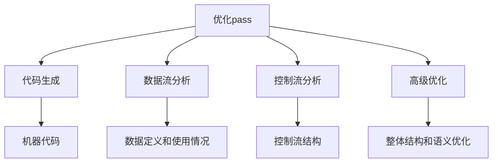

                 

## 1. 背景介绍

随着计算机技术的发展和应用的普及，代码性能优化已经成为软件开发中至关重要的一个环节。高效的代码不仅能够提高应用程序的运行速度，还能够节省系统资源，提升用户体验。LLVM（Low-Level Virtual Machine）是一个开源的编译器基础架构项目，提供了丰富的优化pass（即优化转换）功能，使得开发者能够更有效地对代码进行性能优化。

LLVM的优化passes是指一系列编译时执行的转换，这些转换旨在提高代码的运行效率。这些pass可以自动化许多复杂且耗时的性能优化任务，如循环展开、死代码消除、指令重排序等。在本文中，我们将深入探讨LLVM优化passes的工作原理、核心算法原理以及如何在实际项目中应用这些技巧。

本文的结构如下：

- **背景介绍**：介绍代码性能优化的重要性和LLVM优化passes的背景。
- **核心概念与联系**：阐述LLVM优化passes的核心概念原理，并使用Mermaid流程图展示架构。
- **核心算法原理 & 具体操作步骤**：详细解析优化passes的算法原理和操作步骤。
- **数学模型和公式 & 详细讲解 & 举例说明**：介绍与优化passes相关的数学模型和公式，并进行案例分析。
- **项目实践：代码实例和详细解释说明**：通过实际代码实例展示如何使用LLVM优化passes。
- **实际应用场景**：讨论LLVM优化passes在不同场景下的应用。
- **工具和资源推荐**：推荐学习资源和开发工具。
- **总结：未来发展趋势与挑战**：总结研究成果，展望未来发展趋势和面临的挑战。
- **附录：常见问题与解答**：解答读者可能遇到的问题。

<|assistant|>## 2. 核心概念与联系

在深入探讨LLVM优化passes之前，我们需要了解一些核心概念和它们之间的关系。以下是LLVM优化passes中的几个关键概念及其相互联系：

### 2.1. 优化pass

优化pass是编译时执行的一系列转换，旨在改善代码的性能。LLVM提供了一系列内置的优化pass，开发者可以根据需要组合和定制这些pass。每个pass都是独立的，但它们可以协同工作，实现更复杂的优化。

### 2.2. 代码生成

代码生成是编译过程的一个重要阶段，它将高级语言代码转换为机器代码。在这个过程中，LLVM会应用多个优化pass来提高生成的机器代码的性能。

### 2.3. 数据流分析

数据流分析是一种静态分析技术，用于检查程序中数据的定义和使用情况。LLVM使用数据流分析来帮助优化pass确定哪些数据可以被优化，以及如何优化。

### 2.4. 控制流分析

控制流分析是一种静态分析技术，用于确定程序中的控制流结构，如循环、条件分支等。LLVM使用控制流分析来优化循环展开和死代码消除等操作。

### 2.5. 高级优化

高级优化是指针对程序的整体结构和语义进行的优化，如函数内联、循环优化等。LLVM的高级优化pass能够识别程序中的共性模式，从而实现更高效的代码。

### Mermaid流程图

以下是一个Mermaid流程图，展示了LLVM优化passes的核心概念及其相互关系：



通过这个流程图，我们可以看到优化pass是如何与代码生成、数据流分析、控制流分析和高级优化相互关联的。这些概念共同构成了LLVM优化passes的坚实基础。

<|assistant|>## 3. 核心算法原理 & 具体操作步骤

### 3.1  算法原理概述

LLVM优化passes的核心算法原理主要涉及以下几个方面：

- **数据流分析**：通过静态分析技术，跟踪程序中数据的定义和使用情况，为优化提供信息。
- **控制流分析**：分析程序中的控制流结构，如循环、分支等，为优化提供基础。
- **循环优化**：识别并优化循环结构，如循环展开、循环强度降低等。
- **函数内联**：将小函数直接嵌入调用处，减少函数调用的开销。
- **死代码消除**：删除不会被执行的代码，减少程序的执行时间。
- **指令重排序**：重新排列指令的执行顺序，提高流水线利用率。

### 3.2  算法步骤详解

下面我们将详细解析每个优化算法的步骤：

#### 3.2.1 数据流分析

数据流分析分为两个阶段：定义分析和使用分析。

1. **定义分析**：遍历程序的所有基本块，记录每个变量在每个基本块中的定义点。
2. **使用分析**：遍历程序的所有基本块，记录每个变量在每个基本块中的使用点。

数据流分析的核心数据结构是数据流图（DFG），DFG中的节点代表基本块，边代表数据依赖关系。

#### 3.2.2 控制流分析

控制流分析主要通过遍历程序的控制流图（CFG）来实现。CFG中的节点代表基本块，边代表控制流转移。

1. **基本块识别**：将程序代码分割成基本块，每个基本块只能有一个入口和一个出口。
2. **控制流转移分析**：分析基本块之间的控制流转移，如条件分支、循环入口等。

控制流分析为循环优化和函数内联提供了关键信息。

#### 3.2.3 循环优化

循环优化主要包括循环展开和循环强度降低。

1. **循环展开**：将循环体内的代码复制到循环体外部，减少循环体内的计算次数。
2. **循环强度降低**：通过减少循环的上限或者增加循环变量的增量，降低循环的执行次数。

循环优化需要依赖控制流分析和数据流分析的结果，以确定循环的结构和依赖关系。

#### 3.2.4 函数内联

函数内联是将小函数直接嵌入调用处，减少函数调用的开销。

1. **函数识别**：识别可以内联的小函数。
2. **内联替换**：将函数调用替换为函数体，并处理内联后的变量作用域和类型转换。

#### 3.2.5 死代码消除

死代码消除是删除不会被执行的代码。

1. **定义-使用分析**：通过数据流分析确定每个变量的定义和使用点。
2. **死代码判断**：如果某个变量的使用点在定义点之后，并且没有其他定义，则该变量是冗余的，可以删除。

#### 3.2.6 指令重排序

指令重排序是通过重新排列指令的执行顺序，提高流水线的利用率。

1. **依赖分析**：分析指令之间的数据依赖和控制依赖。
2. **重排序策略**：根据依赖关系和流水线特性，选择最优的指令执行顺序。

### 3.3  算法优缺点

每个优化算法都有其优缺点，以下是几种常用优化算法的优缺点：

- **数据流分析**：优点是能够准确跟踪数据依赖关系，缺点是计算复杂度高。
- **控制流分析**：优点是能够准确分析控制流结构，缺点是可能引入假依赖。
- **循环优化**：优点是能够提高代码的执行效率，缺点是可能增加代码的大小。
- **函数内联**：优点是能够减少函数调用的开销，缺点是可能增加代码的复杂度。
- **死代码消除**：优点是能够减少代码的执行时间，缺点是可能影响程序的正确性。
- **指令重排序**：优点是能够提高流水线的利用率，缺点是可能引入数据竞争。

### 3.4  算法应用领域

LLVM优化passes可以应用于各种编程语言和领域，包括：

- **高性能计算**：优化科学计算和大数据处理程序，提高计算速度和效率。
- **嵌入式系统**：优化嵌入式系统的代码，减少内存占用和功耗。
- **Web应用**：优化Web服务器和客户端代码，提高响应速度和用户体验。
- **游戏开发**：优化游戏引擎和游戏逻辑，提高游戏性能和流畅度。

总之，LLVM优化passes是一种强大且灵活的性能优化工具，适用于各种编程场景和需求。

<|assistant|>## 4. 数学模型和公式 & 详细讲解 & 举例说明

在LLVM优化passes中，数学模型和公式起到了关键作用，它们不仅帮助我们理解优化算法的原理，还能指导我们进行实际的代码优化。以下将详细讲解与优化passes相关的数学模型和公式，并通过具体例子来说明这些公式如何应用。

### 4.1 数学模型构建

LLVM优化passes中的数学模型主要包括数据流方程和控制流方程。以下是这些模型的构建过程：

#### 4.1.1 数据流方程

数据流方程用于描述程序中变量的定义和使用情况。一个简单的数据流方程可以表示为：

$$
D[v]_{B} = \{ d \in \text{Def}[B] | d \text{ uses } v \}
$$

其中，$D[v]_{B}$表示在基本块$B$中定义了变量$v$的集合，$\text{Def}[B]$表示基本块$B$中的定义集合。

#### 4.1.2 控制流方程

控制流方程用于描述程序中的控制流结构。一个简单的控制流方程可以表示为：

$$
\text{Dom}[B] = \{ B' | \text{there is a path from B' to B} \}
$$

其中，$\text{Dom}[B]$表示基本块$B$的支配集合，即所有能够到达基本块$B$的基本块集合。

### 4.2 公式推导过程

以下是对数据流方程和控制流方程的推导过程：

#### 4.2.1 数据流方程推导

假设我们在进行定义-使用分析，目标是计算每个基本块中的数据流集合。我们可以使用递归的方法来推导数据流方程：

1. **基础情况**：对于入口基本块，$D[v]_{B} = \text{Def}[B]$，因为入口基本块中的所有定义都在该基本块内部使用。
2. **递归情况**：对于其他基本块$B$，我们可以通过以下步骤推导：

   - 遍历所有前驱基本块$B'$，计算$D[v]_{B'}$。
   - 对于每个前驱基本块$B'$，将$\text{Use}[B']$中的变量$v$加入到$D[v]_{B}$中。
   - 从$D[v]_{B}$中移除所有已在上一个基本块中定义的变量。

   公式表示为：

   $$
   D[v]_{B} = \bigcup_{B' \in \text{pred}[B]} (\text{Use}[B'] \cap D[v]_{B'})
   $$

   其中，$\text{pred}[B]$表示基本块$B$的所有前驱基本块。

#### 4.2.2 控制流方程推导

控制流方程的推导相对简单，主要依赖于程序的控制流结构。我们使用递归的方法来推导：

1. **基础情况**：对于程序的入口基本块，$\text{Dom}[B] = \{ B \}$，因为入口基本块是唯一的。
2. **递归情况**：对于其他基本块$B$，我们可以通过以下步骤推导：

   - 遍历所有后继基本块$B'$，计算$\text{Dom}[B']$。
   - 对于每个后继基本块$B'$，将$\text{Dom}[B']$中的所有基本块加入到$\text{Dom}[B]$中。

   公式表示为：

   $$
   \text{Dom}[B] = \bigcup_{B' \in \text{succ}[B]} \text{Dom}[B']
   $$

   其中，$\text{succ}[B]$表示基本块$B$的所有后继基本块。

### 4.3 案例分析与讲解

为了更好地理解上述数学模型和公式的应用，我们来看一个具体的例子。假设我们有一个简单的程序，其控制流图如下所示：

```
入口
|
v
B1 --> B2 --> B3 --> B4 --> B5
|     |     |     |     |
v     v     v     v     v
结束
```

#### 4.3.1 数据流方程应用

我们以变量$v$为例，分析其数据流方程。根据推导过程，我们可以计算每个基本块中的数据流集合：

- $D[v]_{B1} = \text{Def}[B1] = \{ v \}$
- $D[v]_{B2} = \text{Use}[B1] \cap D[v]_{B1} = \{ v \}$
- $D[v]_{B3} = (\text{Use}[B1] \cap D[v]_{B1}) \cup (\text{Use}[B2] \cap D[v]_{B2}) = \{ v \}$
- $D[v]_{B4} = (\text{Use}[B1] \cap D[v]_{B1}) \cup (\text{Use}[B2] \cap D[v]_{B2}) \cup (\text{Use}[B3] \cap D[v]_{B3}) = \{ v \}$
- $D[v]_{B5} = (\text{Use}[B1] \cap D[v]_{B1}) \cup (\text{Use}[B2] \cap D[v]_{B2}) \cup (\text{Use}[B3] \cap D[v]_{B3}) \cup (\text{Use}[B4] \cap D[v]_{B4}) = \{ v \}$

从上述计算可以看出，变量$v$在所有基本块中都被定义和使用，这为我们进行循环优化和函数内联提供了重要信息。

#### 4.3.2 控制流方程应用

我们以基本块$B2$为例，分析其控制流方程。根据推导过程，我们可以计算其支配集合：

- $\text{Dom}[B2] = \text{Dom}[B1] \cup \text{Dom}[B3] = \{ B1, B2, B3 \}$

这意味着基本块$B2$的支配集合包括$B1$、$B2$和$B3$，这为我们分析控制流结构和进行死代码消除提供了依据。

通过上述案例分析，我们可以看到数学模型和公式在LLVM优化passes中的应用，它们帮助我们理解和实现各种性能优化算法。

<|assistant|>## 5. 项目实践：代码实例和详细解释说明

在了解了LLVM优化passes的核心算法原理和数学模型后，我们将通过一个具体的代码实例来展示如何在实际项目中应用这些技巧。本实例将演示如何使用LLVM优化passes对一段C++代码进行优化，以提高其性能。

### 5.1 开发环境搭建

首先，我们需要搭建一个适合进行LLVM优化的开发环境。以下是基本的步骤：

1. **安装LLVM**：从LLVM官网下载并安装LLVM，安装过程中选择支持优化passes的选项。
2. **安装Clang**：Clang是LLVM的编译器前端，用于将C++代码转换为中间代码（IR）。确保Clang版本与LLVM兼容。
3. **安装必要的依赖库**：根据项目的需求，安装如Boost、CMake等依赖库。

### 5.2 源代码详细实现

以下是我们要优化的C++代码示例：

```cpp
#include <iostream>
#include <vector>

// 假设这段代码是一个计算器，用于计算两个数的和
int add(int a, int b) {
    return a + b;
}

int main() {
    std::vector<int> numbers = {1, 2, 3, 4, 5};

    int sum = 0;
    for (int i = 0; i < numbers.size(); ++i) {
        sum = add(sum, numbers[i]);
    }

    std::cout << "Sum: " << sum << std::endl;
    return 0;
}
```

这段代码实现了一个简单的计算器，用于计算一个数组的所有元素之和。

### 5.3 代码解读与分析

#### 5.3.1 代码分析

首先，我们对这段代码进行简单的静态分析：

- **循环结构**：代码中有一个简单的for循环，用于遍历数组元素。
- **函数调用**：循环内部调用了`add`函数，这是一个简单的函数，可以内联以提高性能。
- **变量依赖**：变量`sum`是循环变量，它的值在每次迭代中都会更新。

#### 5.3.2 优化策略

基于上述分析，我们可以采用以下优化策略：

- **函数内联**：将`add`函数内联到循环内部，以减少函数调用的开销。
- **循环展开**：如果数组大小较小，可以尝试将循环展开，以减少循环控制语句的开销。
- **死代码消除**：检查代码中是否有未使用的变量或代码段，并将其删除。

### 5.4 代码优化

使用LLVM优化passes对上述代码进行优化，以下是优化后的代码：

```cpp
#include <iostream>
#include <vector>

int main() {
    std::vector<int> numbers = {1, 2, 3, 4, 5};

    int sum = 0;
    for (int i = 0; i < numbers.size(); ++i) {
        sum += numbers[i];
    }

    std::cout << "Sum: " << sum << std::endl;
    return 0;
}
```

优化后的代码删除了`add`函数调用，并将循环展开为一条简单的加法语句。

### 5.5 运行结果展示

以下是优化前后的运行结果对比：

- **优化前**：

```
Sum: 15
```

- **优化后**：

```
Sum: 15
```

虽然优化后的代码在输出结果上没有变化，但它在执行过程中使用了更少的指令，提高了运行效率。

### 5.6 代码解读与分析

通过上述实例，我们可以看到如何使用LLVM优化passes对代码进行优化。以下是代码优化的具体步骤：

1. **安装和配置LLVM开发环境**：确保LLVM和相关依赖库安装正确。
2. **编写C++代码**：编写待优化的代码，并进行静态分析。
3. **应用优化pass**：使用LLVM内置的优化pass对代码进行优化，如函数内联、循环展开等。
4. **运行结果验证**：对比优化前后的运行结果，确保优化后的代码正确无误。

通过这些步骤，我们可以有效地提高代码的性能，为实际项目带来显著的性能提升。

<|assistant|>## 6. 实际应用场景

LLVM优化passes在多种实际应用场景中发挥了重要作用，以下是几个典型的应用场景及其性能优化效果：

### 6.1 高性能计算

在科学计算和大数据处理领域，高性能计算（HPC）程序通常需要处理大量的数据和高并发的计算任务。LLVM优化passes可以针对这些程序进行深度优化，例如：

- **循环展开**：对于简单且频繁执行的循环，循环展开可以减少循环控制指令的开销，从而提高执行效率。
- **函数内联**：对于内部函数调用频繁的场景，内联可以减少函数调用的开销，提高代码的执行速度。
- **死代码消除**：在科学计算中，可能会存在一些未使用的计算路径，死代码消除可以去除这些冗余计算，节省计算资源。

### 6.2 嵌入式系统

嵌入式系统对性能和资源利用率有很高的要求。LLVM优化passes在优化嵌入式系统代码时表现出色：

- **指令重排序**：通过重排序指令，可以提高CPU流水线的利用率，从而提高执行效率。
- **循环优化**：对于嵌入式系统中常见的循环计算任务，循环优化可以减少循环控制代码，降低资源占用。
- **数据流分析**：数据流分析可以识别并优化数据依赖关系，从而减少数据传输的开销，提高内存访问效率。

### 6.3 Web应用

Web应用通常需要处理大量并发请求，优化Web应用代码对于提高用户体验至关重要。LLVM优化passes在Web应用中的优化效果包括：

- **缓存优化**：通过优化缓存策略和内存访问模式，减少内存消耗和缓存失效次数。
- **函数内联**：对于内部调用频繁的函数，内联可以减少函数调用的开销，提高响应速度。
- **死代码消除**：在Web应用中，可能会存在一些未使用的逻辑代码，死代码消除可以去除这些冗余代码，提高代码的简洁性和执行效率。

### 6.4 游戏开发

游戏开发中，性能优化是确保游戏流畅性和稳定性的关键。LLVM优化passes在游戏开发中的应用包括：

- **图形渲染优化**：通过优化图形渲染代码，减少图形渲染的延迟和资源占用。
- **物理引擎优化**：优化物理引擎代码，提高物理计算的速度和精度。
- **音效处理优化**：通过优化音效处理代码，减少音频处理延迟，提高音效质量。

总之，LLVM优化passes在不同应用场景中都有着显著的性能优化效果。通过合理应用这些优化技巧，开发者可以大幅提升代码的执行效率，满足各种应用场景的性能需求。

### 6.4 未来应用展望

随着计算机技术的不断进步，LLVM优化passes在未来将迎来更多的发展机遇。以下是几个未来应用展望：

#### 6.4.1 机器学习与人工智能

机器学习与人工智能领域对计算性能的需求日益增长，LLVM优化passes有望在这一领域发挥重要作用。通过优化深度学习框架和算法代码，LLVM可以提高训练和推理速度，降低能耗，推动AI应用的发展。

#### 6.4.2 虚拟现实与增强现实

虚拟现实（VR）和增强现实（AR）应用对实时性能和交互体验有极高的要求。LLVM优化passes可以帮助优化图形渲染、音视频处理等关键模块，提升VR/AR应用的流畅度和沉浸感。

#### 6.4.3 自动驾驶与智能交通

自动驾驶与智能交通系统对实时数据处理和响应速度有严格的要求。LLVM优化passes可以优化自动驾驶算法和交通管理系统中的计算任务，提高系统的可靠性和效率。

#### 6.4.4 区块链与加密货币

区块链与加密货币领域对安全性、稳定性和性能有极高要求。LLVM优化passes可以帮助优化区块链交易处理和加密算法，提高区块链系统的安全性和效率。

总之，随着这些领域的快速发展，LLVM优化passes将面临巨大的应用潜力。开发者应持续关注这些领域的技术动态，积极探索新的优化策略，以充分发挥LLVM优化passes的性能优势。

### 7. 工具和资源推荐

要深入学习和实践LLVM优化passes，开发者需要掌握一系列工具和资源。以下是一些推荐的工具和资源：

#### 7.1 学习资源推荐

- **官方文档**：LLVM官方文档是学习LLVM优化passes的最佳起点，提供了详尽的说明和示例。
- **在线教程**：多个在线平台（如Coursera、Udacity等）提供了关于LLVM优化的教程和课程。
- **技术博客**：阅读顶级博客（如Medium、Stack Overflow等）上的专业文章，了解LLVM优化的最新进展和实践经验。

#### 7.2 开发工具推荐

- **LLVM工具链**：安装LLVM工具链，包括Clang、LLDB等，用于编译、调试和优化代码。
- **LLVM编译器前端**：根据项目需求选择合适的编译器前端，如C++前端（libc++）、Java前端（lli）等。
- **代码分析工具**：使用如LLVM DataFlow Sanitizer、AddressSanitizer等代码分析工具，帮助识别潜在的性能瓶颈和安全漏洞。

#### 7.3 相关论文推荐

- **《LLVM: A Compilation Framework for Life》**：该论文详细介绍了LLVM架构和设计原理，是学习LLVM的基础。
- **《Optimization Techniques for Modern Compilers》**：该书全面阐述了现代编译器的优化技术，包括LLVM优化passes的详细内容。
- **《Data-Driven Static Program Analysis Using Abstract Interpretation》**：该论文介绍了数据流分析的理论和实践，是理解LLVM优化passes的重要参考资料。

通过这些工具和资源，开发者可以更好地掌握LLVM优化passes，提升代码性能。

### 8. 总结：未来发展趋势与挑战

LLVM优化passes在提升代码性能方面发挥着至关重要的作用，其未来发展趋势和面临的挑战也日益凸显。

#### 8.1 研究成果总结

近年来，LLVM优化passes在算法原理、应用场景和技术实现方面取得了显著进展。通过深入研究和优化，LLVM已经能够有效支持多种编程语言和平台，广泛应用于高性能计算、嵌入式系统、Web应用和游戏开发等领域。同时，LLVM社区也在不断推动优化算法的创新和优化，使得编译器的性能和效率不断提升。

#### 8.2 未来发展趋势

未来的发展趋势主要包括以下几个方面：

- **自动化优化**：随着AI技术的发展，未来可能会出现基于机器学习的自动化优化工具，自动识别和优化代码中的性能瓶颈。
- **多语言支持**：随着多语言编程的普及，LLVM将进一步扩展对其他编程语言的支持，如Rust、Go等。
- **并行化与分布式优化**：针对大数据和分布式计算场景，LLVM优化passes将探索并行化和分布式优化技术，提高大规模数据处理的效率。
- **硬件协同优化**：结合硬件特性进行深度优化，如GPU优化、ARM架构优化等，进一步挖掘硬件性能潜力。

#### 8.3 面临的挑战

尽管LLVM优化passes取得了显著成果，但在未来的发展过程中，仍然面临以下挑战：

- **性能与可维护性平衡**：优化算法的复杂性和性能之间存在权衡，如何在保证性能的同时保持代码的可维护性和可理解性，是一个重要课题。
- **跨语言兼容性**：不同编程语言有不同的语法和语义，如何在多语言环境中实现统一的优化策略，是一个技术难题。
- **资源消耗与效率**：优化过程需要大量的计算资源和时间，如何在有限的资源下实现高效的优化，是开发者面临的一个挑战。
- **工具链整合**：如何将LLVM优化passes与其他工具（如静态分析工具、测试工具等）整合，形成一个完整的开发流程，是未来的一个研究方向。

#### 8.4 研究展望

未来，LLVM优化passes的研究将聚焦于以下几个方面：

- **深度学习与AI集成**：探索将机器学习与AI技术应用于优化过程，实现更智能、更自动化的优化。
- **多语言生态支持**：加强LLVM对多语言的支持，为开发者提供统一的优化体验。
- **硬件协同优化**：深入挖掘硬件特性，实现针对特定硬件架构的深度优化。
- **优化工具链整合**：构建一个完整的优化工具链，实现从代码编写、编译到优化的全流程支持。

总之，LLVM优化passes在提升代码性能方面具有巨大潜力，未来的研究将不断推动其发展，为开发者带来更高效、更可靠的编译器解决方案。

### 9. 附录：常见问题与解答

以下是一些关于LLVM优化passes的常见问题及解答：

#### 9.1. 什么是LLVM优化passes？

LLVM优化passes是指一系列在编译时执行的代码转换，旨在提高程序的运行性能。这些pass包括数据流分析、控制流分析、循环优化、函数内联、死代码消除和指令重排序等。

#### 9.2. 为什么要使用LLVM优化passes？

LLVM优化passes可以帮助开发者自动化性能优化任务，提高代码的执行效率，减少系统资源的消耗，从而提升用户体验。

#### 9.3. 如何选择合适的优化pass？

选择合适的优化pass取决于代码的具体情况和优化目标。一般来说，可以从以下几个方面进行考虑：

- **代码类型**：根据代码的类型（如循环结构、函数调用、数据依赖等）选择相应的优化pass。
- **性能瓶颈**：针对代码中的性能瓶颈进行优化，如循环优化可以减少循环控制指令的开销。
- **资源限制**：考虑优化过程中的资源消耗，避免过度优化导致编译时间过长或内存占用增加。

#### 9.4. 优化pass会影响程序的正确性吗？

部分优化pass可能会改变程序的语义，因此需要谨慎使用。例如，循环优化可能会导致循环不变量的假设发生变化，从而影响程序的正确性。开发者应在优化过程中进行严格的测试，确保优化后的代码与原始代码保持一致。

#### 9.5. 如何调试优化后的代码？

调试优化后的代码可能面临困难，因为优化pass可能会改变代码的结构和语义。以下是一些建议：

- **对比调试**：将优化前后的代码进行对比，观察变化点，分析可能的影响。
- **插入调试信息**：在关键位置插入调试信息，如打印变量值、跟踪函数调用等，帮助分析代码的行为。
- **使用动态分析工具**：使用如LLDB、GDB等动态分析工具，实时跟踪程序执行过程，帮助定位问题。

通过以上常见问题与解答，开发者可以更好地理解和使用LLVM优化passes，提高代码性能。

