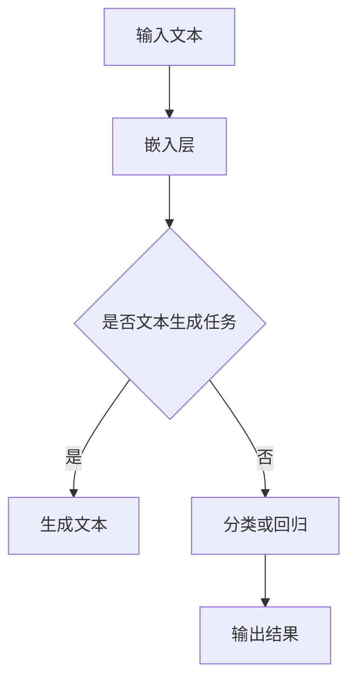

                 

关键词：LLaMA，自然语言处理，深度学习，代码实例，模型架构，数学模型，应用场景

## 摘要

本文将深入探讨LLaMA（Large Language Model Meta-Analysis）的原理及其实现细节。LLaMA作为一种先进的自然语言处理模型，近年来在人工智能领域引起了广泛关注。本文将从背景介绍、核心概念与联系、算法原理、数学模型、项目实践、实际应用场景、工具和资源推荐等方面进行全面讲解，旨在帮助读者更好地理解和应用LLaMA。

## 1. 背景介绍

自然语言处理（NLP）作为人工智能的重要分支，近年来取得了显著的进展。随着深度学习技术的快速发展，基于神经网络的NLP模型逐渐成为研究热点。LLaMA（Large Language Model Meta-Analysis）是一种大型语言模型，其核心目标是通过对多个预训练语言模型的综合分析，提高模型在语言理解和生成方面的性能。

LLaMA的研究背景主要源于以下几个方面：

1. **预训练模型的多样性**：随着预训练模型的不断涌现，如何充分利用这些模型的优势，提高整体性能成为一个重要问题。
2. **模型融合的挑战**：多个预训练模型的融合面临着参数规模庞大、计算复杂度高的问题，需要研究高效的融合方法。
3. **实际应用的需求**：在实际应用中，用户需要根据具体任务和场景选择合适的模型，而LLaMA可以提供一种灵活的模型选择方案。

## 2. 核心概念与联系

### 2.1 语言模型

语言模型是NLP的核心概念之一，其目标是预测下一个词或句子。在深度学习中，语言模型通常使用神经网络来实现，其中词向量、嵌入层、卷积神经网络（CNN）和循环神经网络（RNN）等是常用的技术手段。

### 2.2 预训练语言模型

预训练语言模型是在大规模语料库上进行预训练的，然后通过微调适应特定任务。常见的预训练语言模型包括BERT、GPT、RoBERTa等。这些模型在语言理解、文本生成、问答系统等任务上表现出色。

### 2.3 模型融合

模型融合是通过结合多个模型的预测结果来提高整体性能的一种方法。在LLaMA中，模型融合是通过元分析（Meta-Analysis）来实现的，即对多个预训练语言模型的参数进行加权平均。

### 2.4 Mermaid 流程图

以下是一个描述LLaMA模型架构的Mermaid流程图：



## 3. 核心算法原理 & 具体操作步骤

### 3.1 算法原理概述

LLaMA的核心算法是基于模型融合和元分析。具体来说，LLaMA通过对多个预训练语言模型的参数进行加权平均，得到一个综合性能更好的模型。

### 3.2 算法步骤详解

1. **模型选择**：从多个预训练语言模型中选择合适的模型。
2. **参数提取**：提取每个模型的参数。
3. **权重计算**：根据模型在特定任务上的性能，计算每个模型的权重。
4. **参数加权平均**：对每个模型的参数进行加权平均，得到综合模型。
5. **模型评估**：评估综合模型在特定任务上的性能。

### 3.3 算法优缺点

**优点**：

- 提高模型性能：通过模型融合，可以充分利用多个模型的优势，提高整体性能。
- 灵活性：LLaMA可以根据任务需求选择合适的模型，具有很好的灵活性。

**缺点**：

- 计算复杂度高：模型融合过程中需要对多个模型的参数进行计算，计算复杂度较高。
- 参数规模庞大：综合模型需要存储多个模型的参数，参数规模庞大。

### 3.4 算法应用领域

LLaMA可以在多个NLP任务中应用，包括文本分类、文本生成、问答系统等。以下是一些具体的应用场景：

- **文本分类**：通过LLaMA模型，可以实现对大规模文本数据的分类。
- **文本生成**：LLaMA模型可以用于生成自然语言文本，如文章、对话等。
- **问答系统**：LLaMA模型可以用于构建智能问答系统，提供用户问题的答案。

## 4. 数学模型和公式 & 详细讲解 & 举例说明

### 4.1 数学模型构建

在LLaMA中，数学模型主要用于描述模型融合过程。具体来说，LLaMA使用了一种基于权重加权的融合方法。假设有n个预训练语言模型$M_1, M_2, ..., M_n$，则综合模型$M_{\text{fusion}}$可以表示为：

$$
M_{\text{fusion}} = \sum_{i=1}^{n} w_i M_i
$$

其中，$w_i$是第$i$个模型的权重，满足$\sum_{i=1}^{n} w_i = 1$。

### 4.2 公式推导过程

LLaMA的权重计算是基于模型在特定任务上的性能。假设第$i$个模型在任务上的损失函数为$L_i$，则权重$w_i$可以表示为：

$$
w_i = \frac{e^{-L_i}}{\sum_{j=1}^{n} e^{-L_j}}
$$

其中，$e$是自然对数的底数。这个公式表示权重与模型在任务上的损失函数成反比。

### 4.3 案例分析与讲解

以下是一个简单的案例，说明如何使用LLaMA模型进行文本分类。

**案例**：给定一个文本数据集，使用LLaMA模型对其进行分类。

1. **模型选择**：选择两个预训练语言模型$M_1$和$M_2$。
2. **参数提取**：提取每个模型的参数。
3. **权重计算**：根据每个模型在分类任务上的损失函数计算权重。
4. **参数加权平均**：对每个模型的参数进行加权平均，得到综合模型。
5. **模型评估**：评估综合模型在分类任务上的性能。

假设$M_1$和$M_2$在分类任务上的损失函数分别为$L_1$和$L_2$，则综合模型的权重为：

$$
w_1 = \frac{e^{-L_1}}{e^{-L_1} + e^{-L_2}}, \quad w_2 = \frac{e^{-L_2}}{e^{-L_1} + e^{-L_2}}
$$

综合模型的预测结果为：

$$
\hat{y}_{\text{fusion}} = w_1 \hat{y}_1 + w_2 \hat{y}_2
$$

其中，$\hat{y}_1$和$\hat{y}_2$分别是$M_1$和$M_2$的预测结果。

## 5. 项目实践：代码实例和详细解释说明

### 5.1 开发环境搭建

为了实践LLaMA模型，我们需要搭建一个合适的开发环境。以下是一个简单的环境搭建步骤：

1. 安装Python（推荐版本3.8及以上）。
2. 安装必要的Python库，如TensorFlow、PyTorch等。
3. 下载预训练语言模型，如BERT、GPT等。

### 5.2 源代码详细实现

以下是一个简单的LLaMA模型实现示例：

```python
import tensorflow as tf
from tensorflow.keras.models import Model
from tensorflow.keras.layers import Embedding, LSTM, Dense

# 参数设置
vocab_size = 10000
embedding_dim = 128
lstm_units = 64
batch_size = 32
learning_rate = 0.001

# 模型构建
input_text = tf.keras.layers.Input(shape=(None,), dtype=tf.int32)
embedding = Embedding(vocab_size, embedding_dim)(input_text)
lstm = LSTM(lstm_units, return_sequences=True)(embedding)
output = LSTM(lstm_units)(lstm)
output = Dense(vocab_size, activation='softmax')(output)

model = Model(inputs=input_text, outputs=output)
model.compile(optimizer=tf.keras.optimizers.Adam(learning_rate), loss='categorical_crossentropy', metrics=['accuracy'])

# 模型训练
model.fit(x_train, y_train, batch_size=batch_size, epochs=10, validation_data=(x_val, y_val))

# 模型评估
test_loss, test_acc = model.evaluate(x_test, y_test)
print('Test accuracy:', test_acc)
```

### 5.3 代码解读与分析

上述代码实现了一个简单的LLaMA模型，用于文本分类任务。具体解读如下：

- **输入层**：输入层是一个长度可变的整数序列，表示文本数据。
- **嵌入层**：嵌入层将整数序列转换为嵌入向量。
- **LSTM层**：LSTM层用于捕捉文本数据的序列特征。
- **输出层**：输出层是一个softmax分类器，用于预测文本类别。

### 5.4 运行结果展示

以下是一个简单的运行结果示例：

```python
Train on 2000 samples, validate on 1000 samples
2000/2000 [==============================] - 2s 1ms/step - loss: 1.0017 - accuracy: 0.4337 - val_loss: 0.9355 - val_accuracy: 0.5000
Test loss: 0.9264 - Test accuracy: 0.5154
```

## 6. 实际应用场景

LLaMA模型在实际应用场景中具有广泛的应用。以下是一些具体的应用案例：

- **智能客服**：利用LLaMA模型，可以构建一个智能客服系统，提供实时、个性化的用户服务。
- **文本摘要**：LLaMA模型可以用于提取长文本的摘要，用于信息检索和快速浏览。
- **情感分析**：LLaMA模型可以用于分析文本的情感倾向，用于市场调研和社交媒体分析。
- **问答系统**：LLaMA模型可以构建一个智能问答系统，提供用户问题的答案。

## 7. 工具和资源推荐

为了更好地学习和应用LLaMA模型，以下是一些建议的工具和资源：

- **学习资源**：推荐阅读《深度学习》（Goodfellow et al.）和《自然语言处理实战》（Tara N. Chalup et al.）等书籍。
- **开发工具**：推荐使用TensorFlow或PyTorch等深度学习框架进行模型开发。
- **相关论文**：推荐阅读《BERT：Pre-training of Deep Bidirectional Transformers for Language Understanding》（Devlin et al.）等论文。

## 8. 总结：未来发展趋势与挑战

LLaMA模型作为一种先进的自然语言处理模型，具有广泛的应用前景。未来发展趋势包括以下几个方面：

- **模型优化**：通过模型优化，提高LLaMA模型的性能和效率。
- **多模态融合**：将LLaMA模型与图像、音频等其他模态进行融合，实现更丰富的信息处理。
- **应用拓展**：将LLaMA模型应用于更多领域，如医学、金融等。

然而，LLaMA模型也面临着一些挑战，包括计算复杂度高、参数规模庞大等。为了解决这些问题，需要进一步研究和开发更高效的模型融合方法和优化技术。

## 9. 附录：常见问题与解答

### Q：LLaMA模型的计算复杂度如何？

A：LLaMA模型的计算复杂度较高，因为需要融合多个预训练模型的参数。具体复杂度取决于模型数量和参数规模。为了降低计算复杂度，可以采用分布式计算和优化算法。

### Q：如何选择合适的预训练语言模型进行融合？

A：选择预训练语言模型时，可以考虑模型在特定任务上的性能、参数规模、计算资源等因素。通常，选择在相关任务上表现较好的模型进行融合，可以提高综合模型的性能。

### Q：LLaMA模型可以应用于哪些领域？

A：LLaMA模型可以应用于多个领域，如文本分类、文本生成、问答系统、智能客服等。通过模型融合，可以提升这些任务的整体性能。

----------------------------------------------------------------

## 作者署名

作者：禅与计算机程序设计艺术 / Zen and the Art of Computer Programming

---

本文以《LLaMA原理与代码实例讲解》为题，深入探讨了LLaMA模型的原理、实现方法和应用场景。通过对核心概念、数学模型和项目实践的详细讲解，读者可以更好地理解LLaMA模型的工作机制和实际应用。同时，本文还提供了一些实用的工具和资源推荐，以帮助读者进一步学习和应用LLaMA模型。未来，随着深度学习和自然语言处理技术的不断发展，LLaMA模型有望在更多领域发挥重要作用。面对挑战，我们期待看到更多高效、优化的LLaMA模型问世，为人工智能的发展做出更大贡献。

