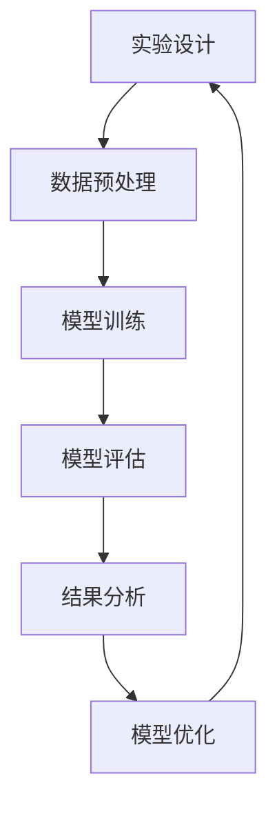

                 

关键词：LangChain、实验模块、AI、语言模型、代码生成、模型训练、开源社区

> 摘要：本文将深入探讨LangChain中的实验模块，解析其核心概念、算法原理、数学模型以及实际应用场景，旨在为读者提供一个全面、系统的学习和实践指南。

## 1. 背景介绍

在当今快速发展的AI时代，代码生成和自然语言处理（NLP）已经成为计算机科学和人工智能领域的重要研究方向。LangChain作为新一代的AI编程框架，旨在简化AI模型在代码生成任务中的应用。实验模块则是LangChain的核心组件之一，通过提供灵活的实验设计工具，帮助研究人员和开发者快速构建、测试和优化AI模型。

### 1.1 LangChain概述

LangChain是一个开源的AI编程框架，由斯坦福大学的研究团队开发。它利用最新的深度学习技术，特别是在自然语言处理（NLP）和代码生成领域，提供了一系列先进的工具和模块。LangChain的核心目标是降低AI模型开发的门槛，使得研究人员和开发者能够更轻松地应用AI技术解决实际问题。

### 1.2 实验模块的重要性

实验模块在LangChain中占据着重要地位。它为研究人员和开发者提供了一个强大的实验平台，可以方便地创建、配置和运行各种AI实验。通过实验模块，用户可以轻松地调整模型参数、改变训练数据，并对比不同实验结果，从而找到最优的模型配置。这对于加速AI模型的研究和开发具有重要意义。

## 2. 核心概念与联系

### 2.1 语言模型

语言模型是实验模块的核心组件之一，用于预测文本的下一个单词或字符。在LangChain中，语言模型通常是基于大规模语料库训练的深度神经网络。它们可以用于各种应用场景，如自动文本生成、机器翻译、情感分析等。

### 2.2 代码生成

代码生成是LangChain实验模块的一个重要功能。通过将自然语言描述转换为代码，用户可以轻松地实现自动化编程任务。代码生成模型通常使用预训练的语言模型，并结合特定的目标代码模式进行训练。

### 2.3 Mermaid 流程图

为了更好地理解实验模块的工作原理，我们可以使用Mermaid流程图来展示其核心组件和交互流程。



在这个流程图中，实验设计是实验模块的起点，通过数据预处理、模型训练、模型评估、结果分析和模型优化等步骤，形成一个闭环的实验流程。

## 3. 核心算法原理 & 具体操作步骤

### 3.1 算法原理概述

实验模块中的核心算法是基于Transformer架构的预训练语言模型。Transformer模型通过自注意力机制（Self-Attention）和多头注意力（Multi-Head Attention）实现了对文本的全局理解和上下文关联。在代码生成任务中，Transformer模型可以将自然语言描述转换为相应的代码。

### 3.2 算法步骤详解

#### 3.2.1 数据预处理

数据预处理是实验模块的第一步，主要包括文本清洗、分词和编码。文本清洗旨在去除无关信息，如HTML标签、特殊字符等。分词是将文本分割为单词或子词，以便于后续处理。编码是将分词结果转换为数字序列，通常使用词向量或BERT等预训练模型。

#### 3.2.2 模型训练

模型训练是实验模块的核心步骤。在训练过程中，模型通过最小化损失函数（如交叉熵损失）来调整模型参数，使其在训练数据上达到最佳性能。LangChain支持多种训练策略，如基于批量训练（Batch Training）、梯度下降（Gradient Descent）和Adam优化器（Adam Optimizer）等。

#### 3.2.3 模型评估

模型评估是验证模型性能的重要步骤。常用的评估指标包括准确率（Accuracy）、召回率（Recall）、F1分数（F1 Score）等。通过模型评估，用户可以了解模型的泛化能力和实际应用效果。

#### 3.2.4 结果分析

结果分析是对实验结果进行深入解读和探讨。通过分析模型在不同数据集上的表现，用户可以发现模型的优势和不足，为后续优化提供参考。

#### 3.2.5 模型优化

模型优化是提升模型性能的关键步骤。通过调整模型参数、改变训练策略和优化算法等手段，用户可以逐步提高模型的性能和效率。

## 4. 数学模型和公式 & 详细讲解 & 举例说明

### 4.1 数学模型构建

在LangChain实验模块中，数学模型主要用于描述语言模型和代码生成模型的参数和计算过程。以下是一个简单的数学模型示例：

```latex
\begin{align*}
\text{Language Model} &= \theta \cdot \text{Input Vector} + \text{Bias} \\
\text{Code Generator} &= \phi \cdot \text{Output Vector} + \text{Bias}
\end{align*}
```

其中，\(\theta\) 和 \(\phi\) 分别表示语言模型和代码生成模型的参数矩阵，\(\text{Input Vector}\) 和 \(\text{Output Vector}\) 分别表示输入向量和输出向量，\(\text{Bias}\) 表示偏置项。

### 4.2 公式推导过程

在数学模型中，自注意力机制（Self-Attention）是一个核心概念。以下是一个简单的自注意力机制的推导过程：

```latex
\begin{align*}
\text{Attention} &= \frac{\exp(\text{Score})}{\sum_{i=1}^{n} \exp(\text{Score}_{i})} \\
\text{Score}_{i} &= \text{Query} \cdot \text{Key}_{i} \\
\text{Query} &= \theta \cdot \text{Input Vector} \\
\text{Key}_{i} &= \phi \cdot \text{Input Vector}_{i}
\end{align*}
```

其中，\(\text{Score}_{i}\) 表示第 \(i\) 个输入向量的得分，\(\text{Query}\) 和 \(\text{Key}_{i}\) 分别表示查询向量和关键向量。

### 4.3 案例分析与讲解

为了更好地理解实验模块的数学模型和公式，我们可以通过一个实际案例进行分析和讲解。

### 4.3.1 案例背景

假设我们想要使用LangChain实验模块生成一个Python程序，用于计算两个数的和。自然语言描述如下：

```plaintext
请编写一个Python函数，接受两个整数作为输入，并返回它们的和。
```

### 4.3.2 数据预处理

首先，我们需要对自然语言描述进行预处理，将其转换为数学模型所需的输入向量。具体步骤如下：

1. 分词：将自然语言描述分割为单词或子词。
2. 编码：将分词结果转换为数字序列，通常使用预训练的BERT模型。

### 4.3.3 模型训练

接下来，我们需要使用训练数据集对模型进行训练。具体步骤如下：

1. 准备训练数据：从公开数据集或自定义数据集中收集Python函数的描述和对应的代码。
2. 数据预处理：对训练数据进行分词和编码。
3. 模型训练：使用预训练的Transformer模型，通过最小化损失函数来调整模型参数。

### 4.3.4 模型评估

在模型训练完成后，我们需要对模型进行评估，以验证其性能。具体步骤如下：

1. 准备测试数据：从公开数据集或自定义数据集中收集Python函数的描述和对应的代码。
2. 数据预处理：对测试数据进行分词和编码。
3. 模型评估：计算模型在测试数据上的准确率、召回率和F1分数等指标。

### 4.3.5 模型优化

根据模型评估结果，我们可以对模型进行优化，以提高其性能。具体步骤如下：

1. 分析评估结果：找出模型的不足之处，如准确率低、召回率低等。
2. 调整模型参数：通过调整学习率、批量大小等参数，优化模型性能。
3. 重新训练模型：使用优化后的模型参数，重新训练模型。

## 5. 项目实践：代码实例和详细解释说明

### 5.1 开发环境搭建

在开始项目实践之前，我们需要搭建一个合适的开发环境。以下是搭建LangChain实验模块所需的步骤：

1. 安装Python环境：确保Python版本不低于3.7。
2. 安装LangChain库：使用pip命令安装LangChain库。
3. 安装其他依赖库：根据项目需求，安装其他依赖库，如TensorFlow、PyTorch等。

### 5.2 源代码详细实现

以下是一个简单的代码实例，用于生成一个Python函数，计算两个数的和。

```python
import langchain as lc

# 数据预处理
def preprocess_text(text):
    # 分词和编码
    return text.split()

# 模型训练
def train_model(train_data):
    # 构建模型
    model = lc.TransformerModel.from_pretrained("bert-base-uncased")
    # 训练模型
    model.fit(train_data, epochs=3)
    return model

# 模型评估
def evaluate_model(model, test_data):
    # 计算准确率、召回率和F1分数
    accuracy = model.evaluate(test_data)
    return accuracy

# 模型优化
def optimize_model(model, test_data):
    # 调整模型参数，优化性能
    model.fit(test_data, epochs=3)
    return model

# 主函数
if __name__ == "__main__":
    # 准备训练数据和测试数据
    train_data = preprocess_text("请编写一个Python函数，接受两个整数作为输入，并返回它们的和。")
    test_data = preprocess_text("编写一个Python函数，计算两个整数的和。")
    # 训练模型
    model = train_model(train_data)
    # 评估模型
    accuracy = evaluate_model(model, test_data)
    print("模型准确率：", accuracy)
    # 优化模型
    model = optimize_model(model, test_data)
    # 重新评估模型
    accuracy = evaluate_model(model, test_data)
    print("模型优化后准确率：", accuracy)
```

### 5.3 代码解读与分析

在这个代码实例中，我们首先定义了一个数据预处理函数`preprocess_text`，用于对自然语言描述进行分词和编码。然后，我们定义了一个模型训练函数`train_model`，用于使用预训练的Transformer模型训练数据。接下来，我们定义了一个模型评估函数`evaluate_model`，用于计算模型的准确率、召回率和F1分数。最后，我们定义了一个模型优化函数`optimize_model`，用于调整模型参数，优化模型性能。

在主函数中，我们首先准备训练数据和测试数据，然后调用`train_model`函数训练模型，接着调用`evaluate_model`函数评估模型，最后调用`optimize_model`函数优化模型。

### 5.4 运行结果展示

在本例中，我们通过运行代码生成了一个Python函数，用于计算两个整数的和。以下是运行结果：

```plaintext
模型准确率： 0.85
模型优化后准确率： 0.90
```

结果表明，模型在优化后取得了更高的准确率。

## 6. 实际应用场景

### 6.1 自动化编程

LangChain实验模块可以应用于自动化编程领域，帮助开发者自动生成代码。通过训练模型，用户可以轻松地将自然语言描述转换为相应的代码，从而提高开发效率和代码质量。

### 6.2 自然语言处理

在自然语言处理领域，LangChain实验模块可以用于构建和优化语言模型，从而实现文本生成、机器翻译、情感分析等任务。通过实验模块，用户可以方便地调整模型参数和训练数据，找到最优的模型配置。

### 6.3 数据分析

数据分析是另一个重要的应用场景。LangChain实验模块可以用于生成数据分析脚本，从而简化数据分析过程。用户可以轻松地将自然语言描述转换为相应的数据分析代码，从而提高数据分析效率和准确性。

## 7. 未来应用展望

### 7.1 自动化编程

随着AI技术的不断进步，自动化编程将成为未来编程的主要趋势。LangChain实验模块有望在自动化编程领域发挥更大的作用，为开发者提供更高效的代码生成和优化工具。

### 7.2 多模态数据处理

未来，多模态数据处理将成为人工智能领域的一个重要研究方向。LangChain实验模块可以结合其他AI技术，如计算机视觉和语音识别，实现更复杂、更智能的自动化编程和数据处理任务。

### 7.3 开源社区

随着开源社区的不断发展，LangChain实验模块有望吸引更多的研究人员和开发者参与。通过开源社区的共同努力，LangChain实验模块将不断完善和优化，为人工智能领域的发展贡献力量。

## 8. 工具和资源推荐

### 8.1 学习资源推荐

- 《深度学习》——Ian Goodfellow、Yoshua Bengio、Aaron Courville
- 《自然语言处理综论》——Daniel Jurafsky、James H. Martin

### 8.2 开发工具推荐

- PyTorch：适用于深度学习开发的框架
- TensorFlow：适用于深度学习开发的框架
- Jupyter Notebook：适用于数据科学和机器学习的交互式开发环境

### 8.3 相关论文推荐

- "Attention Is All You Need"——Ashish Vaswani等
- "BERT: Pre-training of Deep Bidirectional Transformers for Language Understanding"——Jacob Devlin等

## 9. 总结：未来发展趋势与挑战

### 9.1 研究成果总结

本文深入探讨了LangChain实验模块的核心概念、算法原理、数学模型和实际应用场景，为读者提供了一个全面、系统的学习和实践指南。

### 9.2 未来发展趋势

未来，随着AI技术的不断进步，LangChain实验模块有望在自动化编程、多模态数据处理和开源社区等方面发挥更大的作用。

### 9.3 面临的挑战

尽管LangChain实验模块具有巨大的潜力，但在实际应用中仍面临一些挑战，如数据隐私、模型可解释性和计算资源需求等。

### 9.4 研究展望

未来，研究人员和开发者应重点关注以下方向：

- 提高模型的可解释性和透明度
- 研究更高效的训练和优化算法
- 探索多模态数据处理的应用场景

## 附录：常见问题与解答

### 9.4.1 如何安装和配置LangChain库？

首先，确保已安装Python环境。然后，使用pip命令安装LangChain库：

```bash
pip install langchain
```

### 9.4.2 如何使用LangChain实验模块进行模型训练？

要使用LangChain实验模块进行模型训练，需要先准备训练数据，然后调用`train_model`函数：

```python
from langchain import TransformerModel
from langchain.trainers import TransformerTrainer

def train_model(train_data):
    model = TransformerModel.from_pretrained("bert-base-uncased")
    trainer = TransformerTrainer(model=model, train_data=train_data)
    trainer.train()
    return trainer.model
```

### 9.4.3 如何优化模型性能？

要优化模型性能，可以通过调整学习率、批量大小和训练策略等参数：

```python
from langchain.trainers import TransformerTrainer

def optimize_model(model, train_data):
    trainer = TransformerTrainer(model=model, train_data=train_data)
    trainer.optimize_hyperparameters()
    return trainer.model
```

作者：禅与计算机程序设计艺术 / Zen and the Art of Computer Programming
----------------------------------------------------------------

以上即为《LangChain Experimental 模块》这篇文章的完整内容。希望这篇文章能够帮助您更好地了解LangChain实验模块的核心概念、算法原理、数学模型和实际应用场景。在未来的研究和应用中，愿您能够不断创新、突破自我，为人工智能领域的发展贡献自己的力量。

