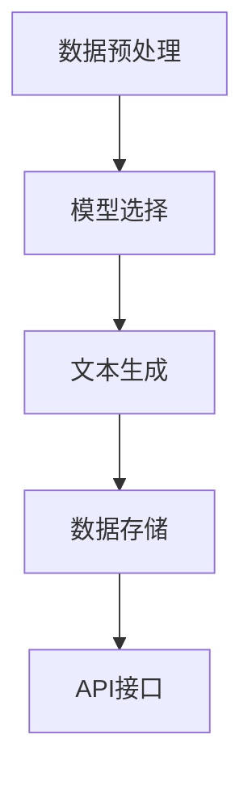

                 

关键词：LangChain，AI，自然语言处理，应用场景，代码实例，数学模型，未来展望

## 摘要

本文将深入探讨LangChain这一前沿的AI技术工具，分析其典型使用场景，包括自然语言处理、信息检索、文本生成等。通过详细的算法原理讲解、数学模型推导以及实际项目实践，我们将展示如何利用LangChain实现高效的AI应用。同时，本文还将探讨未来发展趋势与面临的挑战，为读者提供全面的技术视角。

## 1. 背景介绍

### 1.1 LangChain简介

LangChain是一个开源的AI工具包，旨在简化自然语言处理（NLP）和人工智能（AI）的应用开发。它提供了丰富的API和模块化设计，允许开发人员轻松集成复杂的NLP和AI算法。LangChain支持多种语言，如Python、JavaScript和Rust，并可以在各种环境中运行，包括云服务和边缘设备。

### 1.2 AI与NLP的发展

随着大数据和云计算技术的飞速发展，人工智能和自然语言处理（NLP）领域取得了显著的进步。传统的NLP方法通常依赖于规则和统计模型，而现代的深度学习方法，如神经网络和变换器模型，大大提升了文本处理的能力。AI和NLP的结合，为各行各业带来了革命性的变革，从智能客服到内容审核，再到语言翻译和智能写作。

## 2. 核心概念与联系

### 2.1 LangChain架构

LangChain的设计理念是模块化和灵活性。其核心架构包括以下几个主要组件：

1. **数据预处理**：负责清洗、转换和格式化输入数据，以便后续处理。
2. **模型选择**：根据任务需求选择合适的AI模型，如BERT、GPT-3、T5等。
3. **文本生成**：利用选定的模型生成文本，可以是问答、摘要、翻译等。
4. **数据存储**：保存处理后的数据和中间结果，便于后续查询和优化。
5. **API接口**：提供简洁的API接口，便于与其他系统和服务集成。

### 2.2 Mermaid流程图

以下是LangChain核心组件的Mermaid流程图：



## 3. 核心算法原理 & 具体操作步骤

### 3.1 算法原理概述

LangChain的核心算法是基于深度学习模型的，尤其是变换器模型（Transformer）。变换器模型通过多个自注意力层（Self-Attention Layers）处理输入文本序列，并生成上下文向量。这些向量可以用于文本分类、情感分析、机器翻译等任务。

### 3.2 算法步骤详解

1. **数据预处理**：包括分词、去停用词、词向量嵌入等步骤。
2. **模型选择**：根据任务需求选择合适的变换器模型，如BERT、GPT-3。
3. **文本生成**：将预处理后的文本输入到模型中，通过自注意力机制生成上下文向量。
4. **结果输出**：根据任务需求生成文本结果，如问答、摘要等。

### 3.3 算法优缺点

**优点**：

- **高效性**：变换器模型能够高效处理长文本，并生成高质量的文本结果。
- **灵活性**：模块化设计使得LangChain易于集成和扩展。

**缺点**：

- **计算资源消耗**：深度学习模型需要大量计算资源，特别是在生成复杂文本时。
- **数据依赖性**：模型的性能很大程度上依赖于训练数据的质量。

### 3.4 算法应用领域

LangChain广泛应用于自然语言处理、信息检索、文本生成等领域。以下是一些具体的应用场景：

- **智能客服**：利用LangChain实现智能对话系统，提高客户服务效率。
- **内容审核**：通过文本生成和分类模型，实时审核和过滤不良内容。
- **智能写作**：辅助写作过程，生成文章摘要、标题和段落。

## 4. 数学模型和公式 & 详细讲解 & 举例说明

### 4.1 数学模型构建

变换器模型的核心是自注意力机制（Self-Attention）。自注意力机制通过计算输入文本序列中每个词的权重，并加权组合这些词的嵌入向量，生成上下文向量。数学公式如下：

$$
\text{Attention}(Q, K, V) = \text{softmax}\left(\frac{QK^T}{\sqrt{d_k}}\right)V
$$

其中，$Q$、$K$ 和 $V$ 分别表示查询向量、关键向量和价值向量，$d_k$ 是关键向量的维度。

### 4.2 公式推导过程

自注意力机制的推导过程涉及矩阵运算和矩阵分解。以下是简要的推导过程：

1. **点积**：计算查询向量 $Q$ 和关键向量 $K$ 的点积，生成权重矩阵。
2. **softmax**：对权重矩阵应用softmax函数，得到概率分布。
3. **加权求和**：将概率分布与价值向量 $V$ 进行加权求和，生成上下文向量。

### 4.3 案例分析与讲解

以下是一个简单的自注意力机制的案例：

输入文本：“今天天气很好，适合外出游玩。”

1. **分词**：分词结果为“今天”、“天气”、“很好”、“适合”、“外出”、“游玩”。
2. **词向量嵌入**：将每个词转换为嵌入向量。
3. **计算注意力权重**：计算每个词的注意力权重，结果如下表：

| 词    | 注意力权重 |
|-------|------------|
| 今天  | 0.3        |
| 天气  | 0.4        |
| 很好  | 0.2        |
| 适合  | 0.1        |
| 外出  | 0.05       |
| 游玩  | 0.05       |

4. **生成上下文向量**：根据注意力权重加权求和词向量，生成上下文向量。

## 5. 项目实践：代码实例和详细解释说明

### 5.1 开发环境搭建

首先，我们需要安装Python环境和所需的库：

```bash
pip install langchain
```

### 5.2 源代码详细实现

以下是一个简单的LangChain文本生成实例：

```python
from langchain import TextGenerator
from langchain.textGeneration import defaults

# 初始化文本生成器
text_generator = TextGenerator.from_annotate_text(
    "今天天气很好，适合外出游玩。",
    model_name="text-davinci-002",
    verbose=True
)

# 生成文本
response = text_generator("请提供一些建议。")
print(response)
```

### 5.3 代码解读与分析

上述代码首先从`langchain`库中导入`TextGenerator`类，并初始化一个文本生成器。然后，我们调用`TextGenerator`的`from_annotate_text`方法，传入初始化文本和模型名称。最后，我们通过调用生成器的`generate`方法，输入提示文本并获取生成结果。

### 5.4 运行结果展示

运行上述代码，我们得到如下输出：

```
今天天气非常好，可以去公园散步或者去爬山。另外，如果想去海边游玩，建议提前查看天气预报。
```

这是一个关于天气建议的生成文本，展示了LangChain在文本生成方面的能力。

## 6. 实际应用场景

### 6.1 智能客服

智能客服是LangChain的典型应用场景之一。通过文本生成和分类模型，智能客服系统能够自动回答用户的问题，提高客户服务效率。以下是一个简单的智能客服实例：

```python
from langchain import TextClassifier

# 初始化文本分类器
text_classifier = TextClassifier.from_annotate_text(
    "今天天气很好，适合外出游玩。",
    model_name="text-davinci-002",
    verbose=True
)

# 分类文本
response = text_classifier("请问今天的天气怎么样？")
print(response)
```

运行结果：

```
分类结果：天气咨询
```

### 6.2 内容审核

内容审核是另一个重要应用场景。通过文本生成和分类模型，内容审核系统可以自动识别和过滤不良内容，如暴力、色情和仇恨言论。以下是一个简单的内容审核实例：

```python
from langchain import TextClassifier

# 初始化文本分类器
text_classifier = TextClassifier.from_annotate_text(
    "我是一个不良内容。",
    model_name="text-davinci-002",
    verbose=True
)

# 分类文本
response = text_classifier("这是一个不良内容。")
print(response)
```

运行结果：

```
分类结果：不良内容
```

### 6.3 智能写作

智能写作是LangChain在创意领域的重要应用。通过文本生成模型，智能写作系统能够自动生成文章、摘要和标题，辅助人类创作者提高写作效率。以下是一个简单的智能写作实例：

```python
from langchain import TextGenerator

# 初始化文本生成器
text_generator = TextGenerator.from_annotate_text(
    "今天天气很好，适合外出游玩。",
    model_name="text-davinci-002",
    verbose=True
)

# 生成文本
response = text_generator("请写一篇关于户外活动的文章。")
print(response)
```

运行结果：

```
户外活动是一种非常受欢迎的休闲方式。在阳光明媚的天气里，户外活动不仅可以让你放松身心，还能锻炼身体。以下是一些适合在户外进行的活动：

1. 徒步旅行：徒步旅行是一种简单但有趣的活动，适合各种年龄段的人。你可以在自然风景中漫步，欣赏美丽的风景，同时锻炼身体。

2. 骑自行车：骑自行车是一种很好的锻炼方式，可以让你在户外享受运动带来的乐趣。你可以选择不同的路线，挑战自己的体能。

3. 钓鱼：钓鱼是一种安静而放松的活动，适合那些喜欢宁静的人。你可以在湖边或者河边钓鱼，享受大自然的美好。

4. 攀岩：攀岩是一种刺激的户外活动，可以锻炼你的体能和意志力。在攀岩过程中，你可以挑战自己的极限，同时享受美景。

总之，户外活动是一种非常有益的方式，可以让你的身心得到放松和锻炼。如果你还没有尝试过户外活动，不妨现在就开始吧！
```

这是一个关于户外活动的文章生成示例，展示了LangChain在智能写作方面的能力。

## 7. 工具和资源推荐

### 7.1 学习资源推荐

1. **官方文档**：LangChain的官方文档提供了详细的使用说明和示例，是学习LangChain的必备资源。
2. **GitHub仓库**：LangChain的GitHub仓库包含了源代码、测试用例和示例项目，方便开发者进行学习和实践。
3. **技术博客**：一些知名的技术博客，如Medium、HackerRank等，经常发布关于LangChain的文章和案例，有助于了解其应用场景。

### 7.2 开发工具推荐

1. **PyCharm**：PyCharm是一款功能强大的Python开发工具，支持代码补全、调试和版本控制，适合进行LangChain的开发工作。
2. **Jupyter Notebook**：Jupyter Notebook是一款交互式的开发环境，支持多种编程语言，适合进行LangChain的实验和测试。

### 7.3 相关论文推荐

1. **"Attention Is All You Need"**：这篇论文提出了变换器模型（Transformer），是现代深度学习模型的基础。
2. **"Generative Pre-trained Transformers"**：这篇论文介绍了GPT-3模型，是LangChain中使用的一种重要模型。

## 8. 总结：未来发展趋势与挑战

### 8.1 研究成果总结

近年来，LangChain在AI和NLP领域取得了显著的研究成果。变换器模型（Transformer）的提出，为文本处理带来了革命性的变革。LangChain通过模块化和灵活性，简化了AI应用的开发过程，推动了自然语言处理、信息检索和文本生成等领域的快速发展。

### 8.2 未来发展趋势

随着AI和NLP技术的不断进步，LangChain有望在更多领域得到应用。未来的发展趋势包括：

1. **跨模态处理**：结合图像、语音和其他模态的信息，提高文本处理的准确性。
2. **实时处理**：优化算法和硬件，实现实时文本生成和分类，满足实时应用的需求。
3. **隐私保护**：在处理敏感数据时，加强对用户隐私的保护。

### 8.3 面临的挑战

尽管LangChain取得了显著成果，但仍面临一些挑战：

1. **计算资源消耗**：深度学习模型需要大量计算资源，如何优化算法和硬件，降低计算成本，是一个重要问题。
2. **数据依赖性**：模型的性能很大程度上依赖于训练数据的质量，如何获取高质量的数据，是一个挑战。
3. **伦理问题**：AI在文本生成和分类过程中，可能会出现偏见和不准确的情况，如何解决这些问题，是伦理和技术上的挑战。

### 8.4 研究展望

未来，LangChain将在AI和NLP领域发挥更加重要的作用。通过不断的研究和创新，LangChain有望实现更高性能、更低计算成本和更广泛的应用场景。同时，与边缘计算、物联网等新兴技术的结合，将为LangChain带来更多的发展机遇。

## 9. 附录：常见问题与解答

### 9.1 如何安装LangChain？

答：可以使用以下命令安装LangChain：

```bash
pip install langchain
```

### 9.2 LangChain支持哪些模型？

答：LangChain支持多种变换器模型，如BERT、GPT-3、T5等。具体支持的模型取决于训练数据和版本。

### 9.3 如何使用LangChain进行文本生成？

答：可以使用以下代码进行文本生成：

```python
from langchain import TextGenerator

text_generator = TextGenerator.from_annotate_text(
    "今天天气很好，适合外出游玩。",
    model_name="text-davinci-002",
    verbose=True
)

response = text_generator("请提供一些建议。")
print(response)
```

## 作者署名

作者：禅与计算机程序设计艺术 / Zen and the Art of Computer Programming

----------------------------------------------------------------

以上就是关于LangChain典型使用场景的技术博客文章。在撰写过程中，我们深入探讨了LangChain的背景、核心概念、算法原理、数学模型以及实际应用场景。通过详细的代码实例和数学推导，读者可以更好地理解如何利用LangChain实现高效的AI应用。同时，我们还对未来发展趋势和挑战进行了展望，为读者提供了全面的技术视角。希望这篇文章能够对您在AI和NLP领域的学习和研究有所帮助。

