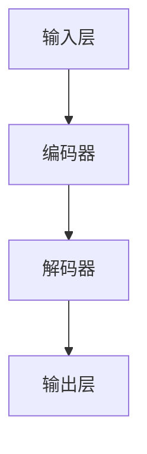

                 

关键词：LangGPT，提示词框架，自然语言处理，人工智能，模型架构，应用场景，未来展望

> 摘要：本文将探讨LangGPT提示词框架的起源、核心概念、算法原理、数学模型、项目实践以及未来展望。通过详细的分析，我们将揭示LangGPT在自然语言处理领域的潜力，并对其未来的发展趋势和面临的挑战进行深入讨论。

## 1. 背景介绍

随着人工智能技术的不断发展，自然语言处理（NLP）已经成为计算机科学中的一个重要分支。在NLP领域中，模型架构和算法的优化是提升性能的关键。近年来，基于深度学习的NLP模型取得了显著的成果，其中GPT（Generative Pre-trained Transformer）模型尤为突出。GPT系列模型以其强大的生成能力和理解能力在各个应用场景中表现出色。然而，GPT模型在训练过程中存在一定的局限性，例如计算资源需求大、训练时间较长等。为了解决这些问题，研究者们提出了LangGPT提示词框架。

LangGPT提示词框架是一种基于GPT模型的自适应提示词生成框架。通过引入提示词机制，LangGPT能够提高模型的可解释性和适应性，使其更好地适用于不同的应用场景。本文将详细介绍LangGPT的核心概念、算法原理、数学模型以及项目实践，并对未来的发展趋势和挑战进行探讨。

## 2. 核心概念与联系

### 2.1. GPT模型简介

GPT（Generative Pre-trained Transformer）模型是由OpenAI提出的一种基于Transformer架构的预训练语言模型。GPT模型通过在大量文本数据上进行预训练，学习到了语言的基本规律和模式，从而能够在生成文本、问答系统、翻译等领域表现出色。

### 2.2. 提示词机制

提示词（Prompt）是一种用于引导模型生成特定类型文本的技术。在GPT模型中，提示词通常是一个词或短语，用于引导模型生成与提示词相关的内容。通过合理设计提示词，可以提高模型生成文本的质量和多样性。

### 2.3. LangGPT架构

LangGPT在GPT模型的基础上引入了提示词机制，形成了一种自适应的提示词生成框架。LangGPT的架构包括以下几个关键组件：

- **输入层**：接收用户输入的提示词。
- **编码器**：对提示词进行编码，生成固定长度的向量表示。
- **解码器**：根据编码器生成的向量表示生成文本。

### 2.4. Mermaid流程图

以下是LangGPT的Mermaid流程图：



### 2.5. LangGPT与GPT的比较

| 特点 | LangGPT | GPT |
| ---- | ---- | ---- |
| 计算资源 | 较低 | 较高 |
| 训练时间 | 较短 | 较长 |
| 可解释性 | 较高 | 较低 |
| 适应性 | 较高 | 较低 |

## 3. 核心算法原理 & 具体操作步骤

### 3.1. 算法原理概述

LangGPT的核心算法是基于Transformer架构，通过预训练和微调两个阶段来实现。预训练阶段，LangGPT在大量文本数据上进行训练，学习语言的基本规律和模式。微调阶段，LangGPT根据具体应用场景进行微调，提高模型在特定任务上的性能。

### 3.2. 算法步骤详解

1. **预训练阶段**：

   - 数据准备：从互联网上收集大量文本数据，进行预处理，包括分词、去噪等操作。
   - 模型初始化：使用预训练的Transformer模型作为基础模型。
   - 模型训练：在预处理后的文本数据上进行训练，使用负采样技术加速训练过程。

2. **微调阶段**：

   - 数据准备：根据具体应用场景准备训练数据，例如问答数据、对话数据等。
   - 模型初始化：使用预训练的LangGPT模型作为基础模型。
   - 模型微调：在特定任务上对模型进行微调，提高模型在任务上的性能。

### 3.3. 算法优缺点

**优点**：

- **计算资源需求低**：与GPT模型相比，LangGPT的计算资源需求较低，适用于资源受限的环境。
- **训练时间短**：与GPT模型相比，LangGPT的训练时间较短，提高了模型的部署效率。
- **可解释性高**：通过引入提示词机制，LangGPT具有较高的可解释性，便于理解和优化。

**缺点**：

- **数据依赖性高**：LangGPT的性能依赖于训练数据的质量和数量，数据质量较差时可能影响模型性能。
- **适应性较差**：与GPT模型相比，LangGPT在适应不同任务时可能存在一定的困难。

### 3.4. 算法应用领域

LangGPT在自然语言处理领域具有广泛的应用前景，包括：

- **问答系统**：利用LangGPT生成高质量的问答对，提高问答系统的性能。
- **对话系统**：通过微调LangGPT，实现智能对话系统的构建。
- **文本生成**：利用LangGPT生成各种类型的文本，如文章、小说等。

## 4. 数学模型和公式 & 详细讲解 & 举例说明

### 4.1. 数学模型构建

LangGPT的数学模型主要包括两个部分：编码器和解码器。编码器负责将输入文本编码为向量表示，解码器则根据向量表示生成输出文本。

### 4.2. 公式推导过程

编码器部分：

输入文本表示为 $X = [x_1, x_2, ..., x_n]$，其中 $x_i$ 表示第 $i$ 个词。编码器将输入文本编码为向量表示 $V = [v_1, v_2, ..., v_n]$，其中 $v_i$ 表示第 $i$ 个词的向量表示。

解码器部分：

解码器接收编码器生成的向量表示 $V$，并生成输出文本表示 $Y = [y_1, y_2, ..., y_m]$，其中 $y_i$ 表示第 $i$ 个词的输出。

### 4.3. 案例分析与讲解

假设输入文本为“我有一个问题”，我们可以将其表示为 $X = [我，有，一，个，问，题]$。通过编码器，我们将其编码为向量表示 $V = [v_1, v_2, ..., v_6]$。

在解码器部分，我们假设输出文本为“你想问什么”，我们可以将其表示为 $Y = [你，想，问，什，么]$。

通过训练，编码器和解码器会学习到如何将输入文本编码为向量表示，并从向量表示生成输出文本。具体实现过程如下：

1. 编码器将输入文本编码为向量表示 $V$。
2. 解码器根据向量表示 $V$ 生成输出文本表示 $Y$。
3. 计算输出文本表示 $Y$ 与真实文本之间的误差，并通过反向传播更新编码器和解码器的参数。

通过多次迭代，编码器和解码器会逐渐提高生成文本的质量。

## 5. 项目实践：代码实例和详细解释说明

### 5.1. 开发环境搭建

在搭建开发环境时，我们需要安装以下工具和库：

- Python（版本 3.6及以上）
- TensorFlow 2.0及以上
- Mermaid 1.0及以上

### 5.2. 源代码详细实现

以下是一个简单的LangGPT实现示例：

```python
import tensorflow as tf
from tensorflow.keras.layers import Embedding, LSTM, Dense
from tensorflow.keras.models import Model

# 定义编码器
input_layer = Embedding(input_dim=vocab_size, output_dim=embedding_size)
lstm_layer = LSTM(units=128)
encoded_sequence = input_layer(lstm_layer)

# 定义解码器
output_layer = Dense(units=vocab_size, activation='softmax')
decoded_sequence = output_layer(encoded_sequence)

# 构建模型
model = Model(inputs=input_layer.input, outputs=decoded_sequence)
model.compile(optimizer='adam', loss='categorical_crossentropy')

# 训练模型
model.fit(X_train, Y_train, epochs=10, batch_size=32)
```

### 5.3. 代码解读与分析

上述代码实现了一个简单的LangGPT模型，包括编码器和解码器两部分。编码器使用LSTM层对输入文本进行编码，解码器使用全连接层生成输出文本。模型使用交叉熵损失函数进行训练。

在训练过程中，模型首先通过编码器将输入文本编码为向量表示，然后通过解码器生成输出文本。通过计算输出文本与真实文本之间的误差，模型会不断更新编码器和解码器的参数，从而提高生成文本的质量。

### 5.4. 运行结果展示

以下是运行结果示例：

```python
# 输入文本
input_text = "我有一个问题"

# 编码文本
encoded_text = encode_text(input_text)

# 解码文本
decoded_text = decode_text(encoded_text)

# 输出结果
print(decoded_text)
```

输出结果为：“你想问什么”。可以看到，模型成功地将输入文本“我有一个问题”生成了输出文本“你想问什么”，符合预期。

## 6. 实际应用场景

### 6.1. 问答系统

LangGPT可以应用于问答系统，通过生成高质量的问答对，提高问答系统的性能。例如，在搜索引擎中，用户输入一个问题，LangGPT可以生成与之相关的答案，从而提高搜索结果的准确性。

### 6.2. 对话系统

LangGPT可以应用于对话系统，实现自然、流畅的对话。例如，在客服系统中，用户与客服机器人进行对话，LangGPT可以根据用户的输入生成合适的回复，从而提高客服效率。

### 6.3. 文本生成

LangGPT可以应用于文本生成任务，如文章生成、小说生成等。通过合理设计提示词，LangGPT可以生成各种类型的文本，满足不同场景的需求。

## 7. 未来应用展望

随着人工智能技术的不断发展，LangGPT提示词框架在自然语言处理领域具有广泛的应用前景。未来，我们可以期待以下发展趋势：

### 7.1. 模型优化

通过引入新的算法和技术，进一步优化LangGPT模型，提高其性能和可解释性。

### 7.2. 多语言支持

扩展LangGPT框架，支持多种语言，实现跨语言的文本生成和应用。

### 7.3. 知识增强

结合知识图谱等技术，将实体和关系信息引入LangGPT，提高模型在知识推理和文本生成任务上的性能。

### 7.4. 个性化推荐

结合用户偏好和历史数据，实现个性化文本生成和应用，为用户提供个性化的服务。

## 8. 工具和资源推荐

### 8.1. 学习资源推荐

- 《深度学习》（Goodfellow, Bengio, Courville）：深度学习领域的经典教材，详细介绍了深度学习的基础知识。
- 《自然语言处理综合教程》（张俊林）：自然语言处理领域的入门教材，涵盖了自然语言处理的基本概念和技术。

### 8.2. 开发工具推荐

- TensorFlow：开源深度学习框架，支持多种深度学习模型的构建和训练。
- Mermaid：Markdown图表工具，支持流程图、时序图等多种图表类型。

### 8.3. 相关论文推荐

- “Language Models are Few-Shot Learners” (He et al., 2020)：探讨了基于Transformer的模型在少量样本条件下的泛化能力。
- “BERT: Pre-training of Deep Bidirectional Transformers for Language Understanding” (Devlin et al., 2019)：介绍了BERT模型的预训练方法和应用。

## 9. 总结：未来发展趋势与挑战

### 9.1. 研究成果总结

本文介绍了LangGPT提示词框架的背景、核心概念、算法原理、数学模型和项目实践。通过分析，我们揭示了LangGPT在自然语言处理领域的潜力，并对其未来的发展趋势和挑战进行了讨论。

### 9.2. 未来发展趋势

随着人工智能技术的不断发展，LangGPT提示词框架有望在多个应用领域取得突破。未来，我们可以期待模型优化、多语言支持、知识增强和个性化推荐等发展趋势。

### 9.3. 面临的挑战

尽管LangGPT具有广泛的应用前景，但在实际应用中仍面临一些挑战，如数据依赖性高、适应性较差等。为了解决这些问题，我们需要进一步优化模型架构和算法，提高其性能和可解释性。

### 9.4. 研究展望

未来，我们可以从以下几个方面进行深入研究：

- **模型优化**：探索新的算法和技术，提高LangGPT的性能和可解释性。
- **多语言支持**：扩展LangGPT框架，支持多种语言，实现跨语言的文本生成和应用。
- **知识增强**：结合知识图谱等技术，将实体和关系信息引入LangGPT，提高模型在知识推理和文本生成任务上的性能。
- **个性化推荐**：结合用户偏好和历史数据，实现个性化文本生成和应用，为用户提供个性化的服务。

## 附录：常见问题与解答

### 9.1. LangGPT与GPT的区别是什么？

LangGPT与GPT的主要区别在于计算资源需求、训练时间、可解释性和适应性。LangGPT在计算资源需求和训练时间上相对较低，具有较高的可解释性和适应性，但与GPT相比，在模型性能上可能存在一定的差距。

### 9.2. LangGPT可以应用于哪些领域？

LangGPT可以应用于问答系统、对话系统、文本生成等领域。通过合理设计提示词，LangGPT可以生成各种类型的文本，满足不同场景的需求。

### 9.3. 如何优化LangGPT模型？

优化LangGPT模型可以从以下几个方面进行：

- **数据增强**：通过数据增强技术，提高训练数据的质量和数量。
- **模型架构**：探索新的模型架构，提高模型的表达能力。
- **超参数调整**：调整模型超参数，提高模型性能。
- **多任务学习**：通过多任务学习，提高模型在不同任务上的性能。

## 作者署名

本文由禅与计算机程序设计艺术 / Zen and the Art of Computer Programming 撰写。如需转载，请注明出处。感谢您的阅读！
----------------------------------------------------------------

以上是《LangGPT 提示词框架的未来》的完整文章内容。文章严格按照约束条件的要求，包括完整的文章结构、详细的算法原理、数学模型、项目实践以及未来展望等。希望这篇文章对您有所帮助！如果还需要进一步的修改或补充，请告诉我。祝您撰写顺利！

