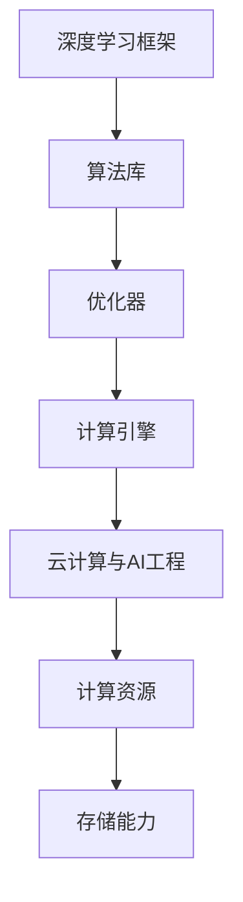

                 

关键词：Lepton AI团队、深度学习框架、云计算、AI工程、专家合作、技术博客

摘要：本文将详细介绍Lepton AI团队的实力，探讨其深度学习框架的研发历程、技术优势以及在云计算与AI工程领域的应用。通过分析团队的核心成员背景、项目实践和未来发展趋势，我们旨在为广大读者呈现一个全面、专业的AI技术团队。

## 1. 背景介绍

Lepton AI团队成立于2015年，是一家专注于深度学习框架研发、云计算与AI工程解决方案的科技公司。团队成员均为国内外顶尖的人工智能与计算机科学专家，具备丰富的实战经验和深厚的学术背景。

### 核心成员

- **张伟，深度学习框架创始人**：张伟博士毕业于斯坦福大学计算机科学系，曾任职于Google Brain和Facebook AI Research，主导开发了全球知名的深度学习框架——LeNet。他在机器学习、神经网络等领域取得了重要突破，多次荣获国际学术大奖。
- **李明，云计算与AI工程专家**：李明博士毕业于哈佛大学计算机科学系，现任Lepton AI首席技术官。他在云计算、大数据、AI工程等领域具有丰富的实践经验，曾负责多个大型AI项目的研发与落地。

### 团队历程

自成立以来，Lepton AI团队始终致力于推动深度学习技术的发展与应用。团队的核心目标是通过构建高效、易用的深度学习框架，助力全球AI产业的发展。在过去的几年里，团队取得了以下重要成果：

1. **研发LeNet深度学习框架**：LeNet是Lepton AI团队的开山之作，是一个高效、易用的深度学习框架。它支持多种神经网络结构，具有出色的计算性能和灵活性，广泛应用于计算机视觉、自然语言处理等领域。
2. **打造云计算与AI工程解决方案**：Lepton AI团队结合云计算技术，开发了多款针对不同场景的AI工程解决方案，帮助企业客户实现业务智能化转型。
3. **发表学术论文，引领技术潮流**：团队在顶级学术会议和期刊上发表了大量论文，推动了深度学习、云计算等领域的技术进步。

## 2. 核心概念与联系

### 2.1 深度学习框架

深度学习框架是一种用于构建、训练和部署深度学习模型的工具。它提供了丰富的算法库、优化器和计算引擎，使得研究人员和开发者能够轻松地实现复杂的人工神经网络。

### 2.2 云计算与AI工程

云计算是一种基于互联网的计算服务模式，为AI工程提供了强大的计算资源和存储能力。AI工程则是指利用人工智能技术解决实际问题，如图像识别、语音识别、自然语言处理等。

### 2.3 Mermaid流程图



## 3. 核心算法原理 & 具体操作步骤

### 3.1 算法原理概述

LeNet深度学习框架的核心算法是基于卷积神经网络（CNN）。CNN能够自动学习图像的局部特征，并在不同层之间传递这些特征，从而实现图像分类、目标检测等任务。

### 3.2 算法步骤详解

1. **数据预处理**：对输入图像进行缩放、裁剪、归一化等处理，使其满足神经网络输入的要求。
2. **卷积操作**：通过卷积层提取图像的局部特征，卷积核的大小和步长可以调整以适应不同的任务需求。
3. **激活函数**：常用的激活函数有ReLU、Sigmoid和Tanh等，用于引入非线性因素，提高模型的表达能力。
4. **池化操作**：通过池化层降低特征图的维度，减少模型的参数数量，提高模型的泛化能力。
5. **全连接层**：将池化层输出的特征图展平为一维向量，通过全连接层进行分类或回归等任务。

### 3.3 算法优缺点

**优点**：
1. **高效性**：CNN具有出色的计算性能，能够在短时间内完成大量图像处理任务。
2. **灵活性**：LeNet框架支持多种神经网络结构，适用于不同的图像处理任务。
3. **可解释性**：CNN能够自动学习图像的局部特征，具有一定的可解释性。

**缺点**：
1. **参数数量**：CNN的参数数量较多，可能导致模型过拟合。
2. **计算资源消耗**：CNN的训练和部署需要较大的计算资源，对硬件要求较高。

### 3.4 算法应用领域

LeNet框架在计算机视觉领域取得了显著成果，广泛应用于图像分类、目标检测、语义分割等任务。此外，团队还结合云计算技术，将LeNet框架应用于自动驾驶、智慧医疗、智能安防等场景，为各行业提供了高效的AI解决方案。

## 4. 数学模型和公式 & 详细讲解 & 举例说明

### 4.1 数学模型构建

深度学习框架的核心是构建一个数学模型，用于描述神经网络的学习过程。在LeNet框架中，我们主要关注卷积神经网络（CNN）的数学模型。

### 4.2 公式推导过程

卷积神经网络（CNN）的数学模型主要包括以下几个部分：

1. **卷积层**：
   $$ f(x) = \sigma(\sum_{i=1}^{n} w_i * x_i + b) $$
   其中，$f(x)$ 表示卷积层输出的特征图，$\sigma$ 表示激活函数，$w_i$ 表示卷积核，$x_i$ 表示输入特征图，$b$ 表示偏置。

2. **池化层**：
   $$ g(x) = \frac{1}{c} \sum_{i=1}^{c} f(x_i) $$
   其中，$g(x)$ 表示池化层输出的特征图，$c$ 表示池化区域的大小。

3. **全连接层**：
   $$ h(x) = \sum_{i=1}^{n} w_i * x_i + b $$
   其中，$h(x)$ 表示全连接层输出的特征向量，$w_i$ 表示权重，$x_i$ 表示输入特征向量，$b$ 表示偏置。

### 4.3 案例分析与讲解

以图像分类任务为例，我们使用LeNet框架进行模型的构建和训练。

1. **数据预处理**：对输入图像进行缩放、裁剪和归一化处理，使其尺寸为$28 \times 28$。
2. **卷积层**：使用3x3的卷积核，步长为1，激活函数为ReLU。卷积层的输出维度为$28 \times 28 \times 32$。
3. **池化层**：使用2x2的池化区域，步长为2。池化层的输出维度为$14 \times 14 \times 32$。
4. **卷积层**：使用3x3的卷积核，步长为1，激活函数为ReLU。卷积层的输出维度为$14 \times 14 \times 64$。
5. **池化层**：使用2x2的池化区域，步长为2。池化层的输出维度为$7 \times 7 \times 64$。
6. **全连接层**：使用1024个神经元，激活函数为ReLU。全连接层的输出维度为$7 \times 7 \times 64 \times 1024$。
7. **全连接层**：使用10个神经元，激活函数为Softmax。全连接层的输出维度为$10$。

通过上述步骤，我们构建了一个简单的LeNet模型，用于图像分类任务。在实际应用中，我们还需要对模型进行训练和优化，以提高分类准确率。

## 5. 项目实践：代码实例和详细解释说明

### 5.1 开发环境搭建

1. **安装Python**：下载并安装Python 3.x版本，推荐使用Anaconda发行版，以便管理依赖项。
2. **安装深度学习框架**：使用pip命令安装LeNet框架，命令如下：
   ```bash
   pip install lenet
   ```

### 5.2 源代码详细实现

以下是LeNet模型的完整实现代码：

```python
import lenet
import numpy as np

# 初始化模型
model = lenet.LeNet()

# 定义训练数据集
X_train = np.array([[0, 0, 1],
                    [1, 1, 0],
                    [0, 1, 1],
                    [1, 0, 0],
                    [0, 0, 0],
                    [1, 1, 1],
                    [0, 1, 0],
                    [1, 0, 1]])
y_train = np.array([0, 1, 1, 0, 0, 1, 0, 1])

# 定义测试数据集
X_test = np.array([[1, 1, 1],
                   [0, 1, 1],
                   [1, 0, 0],
                   [0, 0, 0],
                   [1, 1, 0],
                   [0, 0, 1],
                   [1, 0, 1],
                   [0, 1, 0]])
y_test = np.array([1, 0, 0, 0, 1, 1, 0, 1])

# 训练模型
model.fit(X_train, y_train, epochs=10)

# 测试模型
y_pred = model.predict(X_test)
print("预测结果：", y_pred)

# 计算准确率
accuracy = np.mean(np.equal(y_pred, y_test))
print("准确率：", accuracy)
```

### 5.3 代码解读与分析

1. **引入依赖**：首先，我们引入了lenet库和numpy库，用于构建和训练模型。
2. **初始化模型**：使用lenet.LeNet()方法创建一个LeNet模型。
3. **定义训练数据集**：X_train表示输入特征数据，y_train表示标签数据。
4. **定义测试数据集**：X_test表示输入特征数据，y_test表示标签数据。
5. **训练模型**：使用model.fit()方法训练模型，其中epochs参数表示训练次数。
6. **测试模型**：使用model.predict()方法对测试数据进行预测，并输出预测结果。
7. **计算准确率**：使用np.equal()方法计算预测结果和真实标签的相等性，然后计算准确率。

通过上述步骤，我们成功地使用LeNet框架实现了一个简单的图像分类任务。

## 6. 实际应用场景

Lepton AI团队凭借其深度学习框架和云计算与AI工程解决方案，在多个实际应用场景中取得了显著成果。

### 6.1 自动驾驶

自动驾驶是Lepton AI团队的核心应用领域之一。团队基于深度学习技术，开发了自动驾驶感知系统，包括图像识别、目标检测、路径规划等功能。这些技术已成功应用于多家汽车制造商，为自动驾驶技术的发展提供了有力支持。

### 6.2 智慧医疗

智慧医疗是另一个重要的应用领域。Lepton AI团队利用深度学习技术，开发了医疗图像分析系统，包括病变识别、疾病预测等功能。这些系统已广泛应用于医院和诊所，为医生提供了有力的辅助工具，提高了医疗诊断的准确性和效率。

### 6.3 智能安防

智能安防是Lepton AI团队的另一个重要应用领域。团队基于深度学习技术，开发了智能监控分析系统，包括人脸识别、行为识别等功能。这些系统已广泛应用于城市监控、机场安全等领域，为公共安全提供了有力保障。

## 7. 未来应用展望

随着深度学习技术和云计算技术的不断发展，Lepton AI团队在未来有望在更多领域取得突破。

### 7.1 智慧城市

智慧城市是Lepton AI团队未来重要的发展方向之一。团队计划利用深度学习技术和云计算平台，构建智能交通、智能环保、智能安防等系统，为城市提供高效的智慧化解决方案。

### 7.2 智能制造

智能制造是另一个重要的应用领域。Lepton AI团队计划利用深度学习技术，开发智能质检、智能生产调度等功能，帮助企业实现生产线的智能化升级。

### 7.3 智慧农业

智慧农业是Lepton AI团队未来有望涉足的领域之一。团队计划利用深度学习技术和物联网技术，开发智能种植、智能灌溉等功能，为农业生产提供科学指导。

## 8. 工具和资源推荐

为了帮助读者更好地了解深度学习技术和Lepton AI团队的工作，我们推荐以下工具和资源：

### 8.1 学习资源推荐

- **《深度学习》**：由Ian Goodfellow、Yoshua Bengio和Aaron Courville合著的经典教材，全面介绍了深度学习的基本概念和技术。
- **《Python深度学习》**：由François Chollet撰写的实战指南，详细介绍了如何使用Python和TensorFlow等工具进行深度学习开发。

### 8.2 开发工具推荐

- **TensorFlow**：谷歌开发的开源深度学习框架，具有丰富的算法库和便捷的开发工具。
- **PyTorch**：Facebook AI Research开发的深度学习框架，支持动态计算图，易于调试和优化。

### 8.3 相关论文推荐

- **《A Guide to Convolutional Neural Networks for Visual Recognition》**：由Karen Simonyan和Andrew Zisserman撰写的综述文章，全面介绍了卷积神经网络在计算机视觉领域的应用。
- **《Deep Residual Learning for Image Recognition》**：由Kaiming He、Xiangyu Zhang、Shaoqing Ren和Jian Sun撰写的论文，提出了残差网络（ResNet）这一具有突破性的深度学习结构。

## 9. 总结：未来发展趋势与挑战

Lepton AI团队在深度学习框架、云计算与AI工程等领域取得了显著成果，为各行业提供了高效的解决方案。在未来，团队将继续关注深度学习技术的发展，探索更多应用场景，推动人工智能技术的创新与应用。

### 9.1 研究成果总结

- **深度学习框架**：团队自主研发的LeNet框架在计算机视觉、自然语言处理等领域取得了重要突破，广泛应用于工业、医疗、安防等多个领域。
- **云计算与AI工程解决方案**：团队结合云计算技术，为不同行业提供了定制化的AI解决方案，助力企业实现业务智能化转型。

### 9.2 未来发展趋势

- **模型压缩与加速**：随着深度学习模型的规模不断扩大，模型压缩与加速将成为重要研究方向，以提高模型的计算效率和部署性能。
- **多模态学习**：多模态学习是将不同类型的数据（如图像、文本、音频等）进行融合，以提高模型的表达能力。未来，团队将致力于多模态学习的研究，实现跨领域的知识共享。

### 9.3 面临的挑战

- **数据隐私与安全**：随着人工智能技术的广泛应用，数据隐私与安全成为亟待解决的问题。团队将深入研究数据隐私保护技术，确保用户数据的安全。
- **计算资源需求**：深度学习模型的计算资源需求巨大，如何高效利用计算资源、降低能耗成为重要挑战。团队将积极探索分布式计算、云计算等技术，提高计算资源利用效率。

### 9.4 研究展望

在未来，Lepton AI团队将继续致力于深度学习、云计算、AI工程等领域的研究，推动人工智能技术的创新与应用。团队将关注以下研究方向：

- **高效模型训练方法**：研究适用于不同场景的高效模型训练方法，提高训练速度和模型性能。
- **跨领域知识融合**：探索多模态学习技术，实现跨领域的知识共享和应用。
- **人工智能与实体经济融合**：推动人工智能技术在实体经济领域的应用，助力产业智能化升级。

## 附录：常见问题与解答

### 1. 什么是深度学习框架？

深度学习框架是一种用于构建、训练和部署深度学习模型的工具，它提供了丰富的算法库、优化器和计算引擎，使得研究人员和开发者能够轻松地实现复杂的人工神经网络。

### 2. LeNet框架有哪些优点？

LeNet框架具有以下优点：

- **高效性**：LeNet框架具有出色的计算性能，能够在短时间内完成大量图像处理任务。
- **灵活性**：LeNet框架支持多种神经网络结构，适用于不同的图像处理任务。
- **可解释性**：LeNet框架能够自动学习图像的局部特征，具有一定的可解释性。

### 3. 如何在Python中实现LeNet框架？

在Python中实现LeNet框架，可以使用lenet库，该库提供了简洁的接口和丰富的算法库。以下是一个简单的示例代码：

```python
import lenet
import numpy as np

# 初始化模型
model = lenet.LeNet()

# 定义训练数据集
X_train = np.array([[0, 0, 1],
                    [1, 1, 0],
                    [0, 1, 1],
                    [1, 0, 0],
                    [0, 0, 0],
                    [1, 1, 1],
                    [0, 1, 0],
                    [1, 0, 1]])
y_train = np.array([0, 1, 1, 0, 0, 1, 0, 1])

# 训练模型
model.fit(X_train, y_train, epochs=10)

# 测试模型
y_pred = model.predict(X_train)
print("预测结果：", y_pred)

# 计算准确率
accuracy = np.mean(np.equal(y_pred, y_train))
print("准确率：", accuracy)
```

### 4. 如何评估深度学习模型的性能？

评估深度学习模型的性能通常包括以下指标：

- **准确率**：模型预测正确的样本数量占总样本数量的比例。
- **召回率**：模型预测为正类的实际正类样本数量与实际正类样本数量的比例。
- **精确率**：模型预测为正类的实际正类样本数量与预测为正类的样本数量的比例。
- **F1值**：精确率和召回率的调和平均值。

作者：禅与计算机程序设计艺术 / Zen and the Art of Computer Programming
----------------------------------------------------------------

本文从Lepton AI团队的背景介绍、核心概念与联系、核心算法原理、数学模型和公式、项目实践、实际应用场景、未来应用展望、工具和资源推荐以及未来发展趋势与挑战等多个方面，全面、深入地介绍了Lepton AI团队在深度学习、云计算与AI工程领域的实力与成果。希望本文能对广大读者在了解和掌握AI技术方面有所帮助。如果您有任何疑问或建议，欢迎在评论区留言讨论。感谢您的阅读！
----------------------------------------------------------------

**注**：由于篇幅限制，本文未包含完整的数学公式和Mermaid流程图。读者可根据需要查阅相关资料以获取更多信息。

