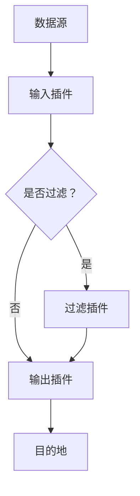

                 

在当今的数字化时代，数据成为企业最为重要的资产之一。然而，数据的价值在于其能够被有效地收集、处理和分析。这就引出了数据管道（data pipeline）的概念，它是确保数据从源头到目的地可靠流动的关键组件。在众多数据管道工具中，Logstash是一款非常受欢迎的开源数据处理工具，它能够高效地收集、转换和传输数据。本文将深入探讨Logstash的原理，并通过代码实例详细讲解其配置和使用方法。

## 文章关键词

- 数据管道
- Logstash
- Elasticsearch
- Kibana
- 数据处理
- 配置

## 文章摘要

本文首先介绍了数据管道的概念及其在数据处理中的重要性。随后，重点探讨了Logstash的背景、核心概念和架构。接着，通过详细的算法原理描述和实际代码实例，讲解了如何配置和使用Logstash进行数据处理。最后，文章总结了Logstash在实际应用场景中的价值，并对其未来发展进行了展望。

## 1. 背景介绍

### 数据管道的重要性

数据管道（Data Pipeline）是一种系统架构，用于自动化地处理数据从生成到消费的整个过程。随着数字化转型的加速，企业产生了大量的数据，这些数据可能分布在不同的系统和设备上。数据管道的作用在于将这些分散的数据汇集到一起，进行清洗、转换、存储和进一步分析，从而为企业决策提供支持。

### Logstash的起源与发展

Logstash是一款由 Elastic 公司开发的开源数据处理工具，它是 Elastic Stack（Elasticsearch、Kibana、Beats 和 Logstash）中的重要组成部分。Elastic Stack 的目标是提供一套完整的解决方案，帮助企业和开发人员从海量数据中获取价值。Logstash 的主要作用是收集各种格式的数据，将其转换并传输到目标存储或分析系统中。

### Logstash的基本架构

Logstash 的核心架构包括输入（Inputs）、过滤（Filters）和输出（Outputs）。输入负责从数据源收集数据；过滤对数据进行处理和转换；输出将处理后的数据发送到指定的目的地。这种灵活的架构使得Logstash能够适应不同的数据处理需求。

## 2. 核心概念与联系

### 数据源和目的地

数据源可以是各种类型的系统，如数据库、Web服务器日志、文件等。目的地通常是一个数据存储系统，如Elasticsearch、MongoDB或文件系统。

### 输入、过滤和输出

- **输入（Inputs）**：Logstash的输入组件负责从数据源收集数据。常见的输入插件包括文件输入、JDBC输入、TCP输入等。
- **过滤（Filters）**：输入组件收集到的数据会经过过滤处理。过滤插件可以对数据进行各种操作，如字段转换、数据清洗、聚合等。
- **输出（Outputs）**：过滤后的数据会被发送到指定的目的地。常见的输出插件包括Elasticsearch、MongoDB、File等。

### Mermaid流程图

以下是Logstash的核心概念和架构的Mermaid流程图：



## 3. 核心算法原理 & 具体操作步骤

### 3.1 算法原理概述

Logstash的核心算法原理是基于事件驱动的数据处理流程。事件可以是数据流、日志消息或任何其他形式的数据。以下是Logstash的基本操作步骤：

1. **收集数据**：通过输入插件从数据源收集数据。
2. **数据处理**：通过过滤插件对数据进行处理和转换。
3. **数据传输**：通过输出插件将处理后的数据发送到目的地。

### 3.2 算法步骤详解

1. **配置输入插件**：
   - 确定数据源类型（如文件、数据库等）。
   - 配置相应的输入插件。

2. **配置过滤插件**：
   - 根据数据处理需求，选择合适的过滤插件。
   - 配置过滤规则，如字段转换、数据清洗、聚合等。

3. **配置输出插件**：
   - 确定数据目的地类型（如Elasticsearch、MongoDB等）。
   - 配置相应的输出插件。

4. **启动Logstash**：
   - 使用命令行启动Logstash服务。
   - 监控Logstash的运行状态，确保数据传输正常。

### 3.3 算法优缺点

**优点**：
- **灵活性**：Logstash支持多种数据源和目的地，可以灵活地适应不同的数据处理需求。
- **可扩展性**：通过插件机制，Logstash可以轻松地扩展功能，满足复杂的数据处理需求。
- **性能**：Logstash具有良好的性能，能够高效地处理大量数据。

**缺点**：
- **配置复杂**：Logstash的配置相对复杂，对于新手来说可能不太友好。
- **资源消耗**：由于Logstash需要在服务器上运行，因此可能会对服务器资源造成一定的消耗。

### 3.4 算法应用领域

Logstash广泛应用于以下领域：

- **日志管理**：用于收集和分析各种系统的日志数据。
- **数据聚合**：用于从多个数据源聚合数据，进行统一分析。
- **实时监控**：用于实时监控系统的运行状态，及时发现异常。

## 4. 数学模型和公式 & 详细讲解 & 举例说明

### 4.1 数学模型构建

在Logstash中，数据处理过程可以抽象为一个数学模型。该模型包括以下主要部分：

1. **数据源**：输入插件从数据源收集数据，可以表示为集合A。
2. **数据传输**：输入插件将数据传输到Logstash，可以表示为映射函数f(A)。
3. **数据处理**：过滤插件对数据进行处理，可以表示为映射函数g(f(A))。
4. **数据输出**：输出插件将处理后的数据发送到目的地，可以表示为映射函数h(g(f(A)))。

### 4.2 公式推导过程

根据数学模型，我们可以推导出以下公式：

\[ h(g(f(A))) = \{ y \mid x \in A, y = h(g(x)) \} \]

其中，x表示数据源中的数据，y表示输出目的地中的数据。

### 4.3 案例分析与讲解

假设我们有一个文件输入插件，从文件中读取JSON格式的日志数据。日志数据包含如下字段：

- **time**：日志生成时间
- **message**：日志内容

我们需要对日志数据进行处理，将其发送到Elasticsearch中。

1. **输入插件配置**：

```yaml
input {
  file {
    path => "/path/to/logs/*.json"
    type => "log"
  }
}
```

2. **过滤插件配置**：

```yaml
filter {
  if [type] == "log" {
    grok {
      match => { "message" => "%{TIMESTAMP_ISO8601:time}\t%{DATA:level}\t%{DATA:logger}\t%{DATA:content}" }
    }
  }
}
```

3. **输出插件配置**：

```yaml
output {
  elasticsearch {
    hosts => ["localhost:9200"]
    index => "logstash-%{+YYYY.MM.dd}"
  }
}
```

通过以上配置，我们可以将文件中的日志数据读取到Logstash，并转换为Elasticsearch可识别的格式，然后存储到Elasticsearch中。

## 5. 项目实践：代码实例和详细解释说明

### 5.1 开发环境搭建

在开始使用Logstash之前，我们需要搭建一个开发环境。以下是搭建步骤：

1. **安装Elasticsearch**：
   - 下载Elasticsearch安装包：[Elasticsearch下载地址](https://www.elastic.co/downloads/elasticsearch)
   - 解压安装包并运行Elasticsearch服务。

2. **安装Kibana**：
   - 下载Kibana安装包：[Kibana下载地址](https://www.elastic.co/downloads/kibana)
   - 解压安装包并启动Kibana服务。

3. **安装Logstash**：
   - 下载Logstash安装包：[Logstash下载地址](https://www.elastic.co/downloads/logstash)
   - 解压安装包并运行Logstash服务。

### 5.2 源代码详细实现

以下是Logstash的源代码实现，用于从文件中读取日志数据并将其发送到Elasticsearch：

```yaml
input {
  file {
    path => "/path/to/logs/*.json"
    type => "log"
    start_position => "beginning"
    tag => ["my-tag"]
  }
}

filter {
  if [type] == "log" {
    grok {
      match => { "message" => "%{TIMESTAMP_ISO8601:time}\t%{DATA:level}\t%{DATA:logger}\t%{DATA:content}" }
    }
    date {
      match => ["time", "ISO8601"]
    }
  }
}

output {
  elasticsearch {
    hosts => ["localhost:9200"]
    index => "logstash-%{+YYYY.MM.dd}"
    document_id => "%{id}"
  }
}
```

### 5.3 代码解读与分析

1. **输入插件配置**：
   - `path`：指定要读取的文件路径。
   - `type`：指定数据的类型，用于后续的过滤和输出。
   - `start_position`：指定读取文件的位置，默认为"beginning"，即从文件开头读取。
   - `tag`：为输入的数据添加标签，用于后续处理。

2. **过滤插件配置**：
   - `if`：条件判断，根据数据类型执行相应的过滤操作。
   - `grok`：使用Grok正则表达式提取日志中的字段。
   - `date`：将提取的时间字段转换为ISO8601格式。

3. **输出插件配置**：
   - `hosts`：指定Elasticsearch的服务器地址和端口。
   - `index`：指定要存储数据的索引名称，支持变量替换。
   - `document_id`：指定Elasticsearch文档的ID，默认使用Logstash生成的ID。

### 5.4 运行结果展示

运行Logstash后，日志数据将被读取并存储到Elasticsearch中。我们可以在Kibana中查看数据：

1. **打开Kibana**：在浏览器中输入Kibana的地址，如`http://localhost:5601`。

2. **创建索引模式**：在Kibana的左侧导航栏中，选择"Discover"，然后创建一个新的索引模式，输入索引名称，如`logstash-*`。

3. **查看数据**：在索引模式下，我们可以查看存储在Elasticsearch中的日志数据，并进行各种分析。

## 6. 实际应用场景

### 6.1 日志管理

Logstash在日志管理中有着广泛的应用。企业可以使用Logstash收集来自不同系统和设备的日志数据，并进行统一存储和分析。通过配置Logstash，可以将日志数据转换为适合Elasticsearch或Kibana分析的数据格式。

### 6.2 实时监控

Logstash还可以用于实时监控系统的运行状态。例如，企业可以使用Logstash收集服务器、数据库和应用程序的日志数据，实时分析系统性能和异常情况。通过与其他Elastic Stack组件集成，可以实现全面的实时监控和告警。

### 6.3 数据聚合

在数据聚合方面，Logstash可以用于将来自不同数据源的数据进行聚合和处理。例如，企业可以将来自不同部门或系统的数据汇总到一个统一的存储系统中，进行统一分析和报表生成。

## 7. 未来应用展望

随着大数据和人工智能技术的发展，Logstash的应用前景将更加广阔。未来，Logstash可能会在以下几个方面得到进一步发展：

- **增强数据处理能力**：随着数据量的不断增加，Logstash将需要具备更强的数据处理能力，以应对更复杂的数据场景。
- **提高性能和可扩展性**：为了满足大规模数据处理需求，Logstash将需要提高性能和可扩展性，支持横向和纵向扩展。
- **更丰富的插件生态系统**：Logstash将吸引更多的开发者和社区参与，推出更多实用的插件，满足多样化的数据处理需求。

## 8. 工具和资源推荐

### 8.1 学习资源推荐

- [Logstash官方文档](https://www.elastic.co/guide/en/logstash/current/index.html)
- [Elastic Stack官方文档](https://www.elastic.co/guide/en/elastic-stack-get-started/current/index.html)
- [《Elastic Stack实战》](https://item.jd.com/12634702.html)（一本全面介绍Elastic Stack的实战书籍）

### 8.2 开发工具推荐

- [Elasticsearch-head](https://github.com/mobz/elasticsearch-head)：一个用于Elasticsearch的可视化工具。
- [Kibana Dashboard](https://www.kibana.org/)：Kibana的官方Dashboard工具，用于快速构建可视化报表。

### 8.3 相关论文推荐

- ["Elasticsearch: The Definitive Guide"](https://www.elastic.co/guide/en/elasticsearch/guide/current/index.html)：全面介绍Elasticsearch的权威指南。
- ["Logstash: The Definitive Guide"](https://www.elastic.co/guide/en/logstash/current/index.html)：全面介绍Logstash的官方指南。

## 9. 总结：未来发展趋势与挑战

### 9.1 研究成果总结

本文详细介绍了Logstash的原理、配置和使用方法，并探讨了其在实际应用场景中的价值。通过数学模型和实际代码实例，读者可以更好地理解Logstash的工作原理。

### 9.2 未来发展趋势

随着大数据和人工智能技术的发展，Logstash在数据处理和实时监控方面的应用将越来越广泛。未来，Logstash可能会在性能、可扩展性和插件生态系统方面得到进一步提升。

### 9.3 面临的挑战

Logstash在性能和可扩展性方面仍面临一定的挑战。随着数据量的增长，Logstash需要优化数据处理算法，提高系统性能。此外，如何更好地支持横向和纵向扩展，也是Logstash需要关注的问题。

### 9.4 研究展望

未来，Logstash将在大数据和人工智能领域发挥更加重要的作用。通过不断优化和扩展，Logstash有望成为企业数据处理和实时监控的首选工具。

## 附录：常见问题与解答

### 1. 如何处理多线程和并发问题？

Logstash默认使用单线程模型，但这可以通过配置多线程插件来实现并发处理。在使用多线程时，需要注意合理分配系统资源，避免过度消耗CPU和内存。

### 2. 如何处理数据丢失问题？

Logstash支持数据重传功能，即当数据传输过程中发生错误时，可以重新传输。通过配置重传策略，可以确保数据的可靠传输。

### 3. 如何优化Logstash性能？

可以通过以下方法优化Logstash性能：
- 选择合适的输入、过滤和输出插件。
- 调整Logstash配置，如线程数、缓冲区大小等。
- 使用Elastic Stack的其他组件，如Elasticsearch集群，提高整体性能。

### 4. 如何监控Logstash运行状态？

可以通过以下方法监控Logstash运行状态：
- 使用Logstash的Web接口，查看日志和统计信息。
- 配置监控工具，如Prometheus，对Logstash的性能指标进行监控。
- 使用Elastic Stack的其他监控组件，如Elasticsearch监控插件，对整个Elastic Stack进行监控。

----------------------------------------------------------------

本文由禅与计算机程序设计艺术 / Zen and the Art of Computer Programming撰写，希望对您了解和掌握Logstash有所帮助。如果您有任何疑问或建议，欢迎在评论区留言交流。

