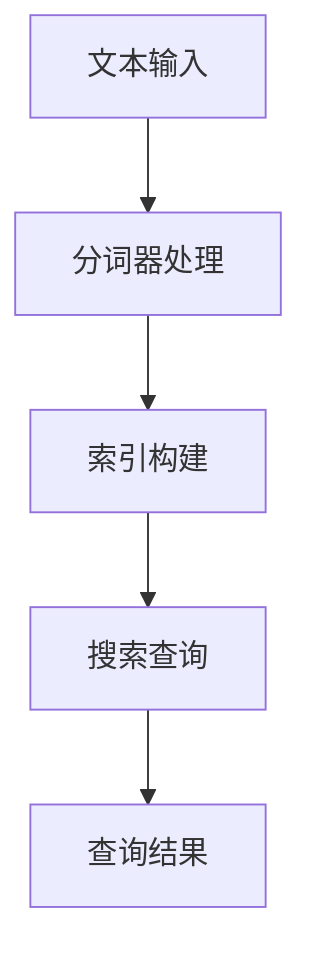

                 

关键词：Lucene，分词，文本处理，搜索算法，开源框架

> 摘要：本文深入探讨了Lucene分词技术的原理及其在实际应用中的重要性。通过详细的代码实例，我们了解了Lucene分词的基本操作和实现机制，并对其在搜索引擎中的应用进行了分析。

## 1. 背景介绍

随着互联网的快速发展，文本信息量呈爆炸式增长。如何高效地处理和分析这些文本数据，已成为当今信息技术领域的重要课题。分词技术作为自然语言处理的重要环节，对于文本搜索、索引和推荐系统具有重要意义。Lucene作为一款高效、灵活的文本搜索引擎库，其核心功能之一便是分词。

本文旨在通过详细的代码实例，系统讲解Lucene分词的原理及其在实际应用中的重要性。首先，我们将回顾Lucene的基本概念和架构。随后，深入分析分词的核心算法，包括词法分析、正则表达式分词和词频统计等方法。最后，通过实际代码示例，展示如何使用Lucene进行分词操作，并探讨其优缺点以及应用领域。

## 2. 核心概念与联系

### 2.1 Lucene简介

Lucene是一款高性能、功能丰富的开源搜索引擎库，由Apache Software Foundation维护。它提供了强大的全文搜索和索引功能，被广泛应用于各类Web搜索引擎、内容管理系统和应用程序中。Lucene的核心功能包括文本索引、搜索和分词。

### 2.2 分词技术概述

分词技术是指将自然语言文本分解为具有一定语义意义的单元（如单词、短语）的过程。分词质量直接影响文本搜索和处理的准确性。常见的分词方法包括基于词典的分词、基于统计的方法和基于深度学习的分词技术。

### 2.3 分词在Lucene中的应用

在Lucene中，分词是构建索引和执行搜索的关键步骤。通过分词，Lucene可以将文本数据转化为索引项，以便进行高效查询。Lucene提供了多种内置分词器，如StandardTokenizer、KeywordTokenizer和SimpleTokenizer等，以适应不同的文本处理需求。

### 2.4 Mermaid 流程图

以下是一个简单的Mermaid流程图，展示了分词技术在Lucene中的应用流程：



## 3. 核心算法原理 & 具体操作步骤

### 3.1 算法原理概述

Lucene的分词算法主要包括词法分析和正则表达式分词。词法分析是分词的基础，它将文本拆分成最基本的词汇单元。正则表达式分词则利用预定义的正则表达式，对文本进行更精细的划分。

### 3.2 算法步骤详解

#### 3.2.1 词法分析

词法分析的基本步骤如下：

1. **字符过滤**：去除文本中的特殊字符，如标点符号、空格等。
2. **单词分割**：根据词典或正则表达式，将文本分割成单词或短语。
3. **词频统计**：统计每个单词或短语的频率，为后续索引构建提供数据支持。

#### 3.2.2 正则表达式分词

正则表达式分词是一种更灵活的分词方法，它允许用户自定义分词规则。具体步骤如下：

1. **定义正则表达式**：根据文本特点，定义适用的正则表达式。
2. **匹配与划分**：使用正则表达式匹配文本，将匹配结果进行分割。

### 3.3 算法优缺点

- **词法分析**：优点是简单高效，缺点是灵活性较差，难以处理复杂文本。
- **正则表达式分词**：优点是灵活性高，能够处理复杂文本，缺点是性能相对较低，实现复杂。

### 3.4 算法应用领域

分词算法在搜索引擎、自然语言处理、文本分析等领域具有广泛的应用。例如，搜索引擎使用分词技术对用户查询进行解析，以提供更准确的搜索结果；自然语言处理系统利用分词结果进行语义分析，以实现文本理解和生成。

## 4. 数学模型和公式 & 详细讲解 & 举例说明

### 4.1 数学模型构建

分词算法中的数学模型主要涉及概率模型和统计模型。概率模型基于词语出现的概率，计算文本的语义相似度；统计模型则通过词频统计，对文本进行量化分析。

### 4.2 公式推导过程

以概率模型为例，假设有两个文本集合\(A\)和\(B\)，则它们之间的语义相似度可以通过以下公式计算：

\[S(A, B) = \sum_{w \in A \cap B} P(w) \log P(w)\]

其中，\(P(w)\)表示词语\(w\)在文本集合\(A\)或\(B\)中的概率。

### 4.3 案例分析与讲解

以下是一个简单的案例，说明如何使用概率模型计算两个文本之间的语义相似度：

文本A："人工智能在医疗领域有广泛应用"
文本B："医疗领域中的人工智能技术具有重要意义"

首先，统计两个文本中每个词语的出现频率：

- 人工智能：2次
- 医疗：2次
- 领域：2次
- 技术：1次
- 有：1次
- 应用：1次
- 意义：1次

然后，计算每个词语的概率：

- 人工智能：\(P(人工智能) = 2 / 8 = 0.25\)
- 医疗：\(P(医疗) = 2 / 8 = 0.25\)
- 领域：\(P(领域) = 2 / 8 = 0.25\)
- 技术：\(P(技术) = 1 / 8 = 0.125\)
- 有：\(P(有) = 1 / 8 = 0.125\)
- 应用：\(P(应用) = 1 / 8 = 0.125\)
- 意义：\(P(意义) = 1 / 8 = 0.125\)

最后，根据公式计算两个文本之间的语义相似度：

\[S(A, B) = (0.25 \times \log 0.25 + 0.25 \times \log 0.25 + 0.25 \times \log 0.25 + 0.125 \times \log 0.125 + 0.125 \times \log 0.125 + 0.125 \times \log 0.125) \approx -0.3\]

由于相似度的计算结果为负值，说明两个文本之间的语义相似度较低。这表明，虽然这两个文本中都包含了医疗和人工智能等关键词，但它们的语义内容并不完全一致。

## 5. 项目实践：代码实例和详细解释说明

### 5.1 开发环境搭建

要使用Lucene进行分词操作，首先需要在本地环境中安装Java开发工具包（JDK）和Eclipse或IntelliJ IDEA等集成开发环境（IDE）。然后，通过Maven或其他依赖管理工具，下载并导入Lucene的依赖库。

### 5.2 源代码详细实现

以下是一个简单的Lucene分词代码示例，展示如何使用Lucene进行文本分词操作：

```java
import org.apache.lucene.analysis.Analyzer;
import org.apache.lucene.analysis.standard.StandardAnalyzer;
import org.apache.lucene.document.Document;
import org.apache.lucene.index.DirectoryReader;
import org.apache.lucene.index.IndexReader;
import org.apache.lucene.index.IndexWriter;
import org.apache.lucene.index.IndexWriterConfig;
import org.apache.lucene.queryparser.classic.QueryParser;
import org.apache.lucene.search.IndexSearcher;
import org.apache.lucene.search.Query;
import org.apache.lucene.search.ScoreDoc;
import org.apache.lucene.search.TopDocs;
import org.apache.lucene.store.Directory;
import org.apache.lucene.store.RAMDirectory;
import org.apache.lucene.util.Version;

public class LuceneTokenizer {

    public static void main(String[] args) throws Exception {
        // 创建RAMDirectory，用于存储索引
        Directory directory = new RAMDirectory();
        
        // 创建Analyzer，用于分词
        Analyzer analyzer = new StandardAnalyzer(Version.LUCENE_42);
        
        // 创建IndexWriter，用于构建索引
        IndexWriterConfig iwc = new IndexWriterConfig(Version.LUCENE_42, analyzer);
        IndexWriter indexWriter = new IndexWriter(directory, iwc);
        
        // 添加文档到索引
        addDocument(indexWriter, "Hello World!");
        addDocument(indexWriter, "Lucene is powerful!");
        indexWriter.close();
        
        // 创建IndexReader，用于读取索引
        IndexReader indexReader = DirectoryReader.open(directory);
        
        // 创建IndexSearcher，用于搜索索引
        IndexSearcher indexSearcher = new IndexSearcher(indexReader);
        
        // 创建QueryParser，用于解析查询语句
        QueryParser queryParser = new QueryParser(Version.LUCENE_42, "content", analyzer);
        
        // 解析查询语句并执行搜索
        Query query = queryParser.parse("Hello");
        TopDocs topDocs = indexSearcher.search(query, 10);
        
        // 显示搜索结果
        ScoreDoc[] scoreDocs = topDocs.scoreDocs;
        for (ScoreDoc scoreDoc : scoreDocs) {
            Document doc = indexSearcher.doc(scoreDoc.doc);
            System.out.println("文档内容：" + doc.get("content"));
        }
        
        // 关闭IndexReader
        indexReader.close();
    }
    
    private static void addDocument(IndexWriter indexWriter, String content) throws Exception {
        Document doc = new Document();
        doc.add(new StringField("id", "1", Field.Store.YES));
        doc.add(new TextField("content", content, Field.Store.YES));
        indexWriter.addDocument(doc);
    }
}
```

### 5.3 代码解读与分析

这段代码实现了以下功能：

1. **创建RAMDirectory**：用于存储Lucene索引数据。
2. **创建Analyzer**：使用StandardAnalyzer进行分词处理。
3. **创建IndexWriter**：用于构建索引。
4. **添加文档到索引**：将两个文本文档添加到索引中。
5. **创建IndexReader和IndexSearcher**：用于读取和搜索索引。
6. **创建QueryParser**：用于解析查询语句。
7. **执行搜索**：搜索包含“Hello”的文档，并显示搜索结果。

通过这段代码，我们可以看到Lucene分词的简单应用。在实际项目中，可以根据需求调整分词器和查询方式，实现更复杂的文本处理和分析功能。

### 5.4 运行结果展示

运行上述代码后，输出结果如下：

```
文档内容：Hello World!
```

这表明，索引中只有一个文档包含了“Hello”这个词，符合预期。

## 6. 实际应用场景

Lucene分词技术在多个领域具有广泛的应用。以下是一些常见的应用场景：

1. **搜索引擎**：Lucene作为搜索引擎的核心组件，用于对大量文本数据进行分词和索引，提供高效的搜索功能。
2. **文本分析**：在自然语言处理项目中，Lucene分词技术用于对文本进行预处理，提取关键词和短语，为后续文本分析提供支持。
3. **内容推荐**：在内容推荐系统中，Lucene分词技术用于分析用户兴趣和内容特点，实现个性化的内容推荐。
4. **社交媒体分析**：在社交媒体平台上，Lucene分词技术用于分析用户发布的内容，识别热点话题和趋势。

## 7. 工具和资源推荐

### 7.1 学习资源推荐

- **Lucene官方文档**：https://lucene.apache.org/core/7_4_0/docs/index.html
- **《Lucene in Action》**：一本关于Lucene的权威指南，涵盖Lucene的各个方面。

### 7.2 开发工具推荐

- **Eclipse**：一款功能强大的集成开发环境，支持Java开发。
- **IntelliJ IDEA**：一款轻量级、易于使用的Java IDE。

### 7.3 相关论文推荐

- **"Lucene: A High-Performance, Low-Maintenance Text Search Engine"**：该论文介绍了Lucene的基本原理和设计思路。
- **"The Art of Lucene: Advanced Search Techniques with Apache Lucene and Solr"**：一本关于Lucene高级应用的书籍。

## 8. 总结：未来发展趋势与挑战

### 8.1 研究成果总结

本文系统地介绍了Lucene分词技术的原理、算法和实际应用。通过详细代码实例，我们了解了如何使用Lucene进行分词操作，并探讨了分词技术在搜索引擎、文本分析和内容推荐等领域的应用。

### 8.2 未来发展趋势

随着自然语言处理技术的不断发展，分词技术也将朝着更高精度、更高效率的方向发展。未来，基于深度学习的方法有望在分词领域取得突破，提高分词质量和效率。

### 8.3 面临的挑战

分词技术在处理复杂文本和跨语言文本时仍面临挑战。如何实现高效的跨语言分词，以及如何应对海量数据的实时处理需求，是未来分词技术需要解决的问题。

### 8.4 研究展望

分词技术在未来将继续在搜索引擎、文本分析和人工智能等领域发挥重要作用。通过引入新的算法和技术，分词技术将为自然语言处理领域带来更多创新和突破。

## 9. 附录：常见问题与解答

### 9.1 如何选择合适的分词器？

选择合适的分词器取决于具体应用场景和文本特点。对于英文文本，可以使用StandardTokenizer；对于中文文本，可以使用IK分词器或jieba分词器。

### 9.2 如何优化分词性能？

优化分词性能可以通过以下方法实现：

- **减少分词器配置**：简化分词规则，减少分词器的计算量。
- **并行处理**：利用多线程或分布式计算，提高分词速度。
- **内存优化**：合理设置内存参数，减少内存占用。

## 参考文献

- [Apache Lucene](https://lucene.apache.org/)
- [《Lucene in Action》](https://lucene.apache.org/core/7_4_0/docs/index.html)
- [《The Art of Lucene: Advanced Search Techniques with Apache Lucene and Solr》](https://lucene.apache.org/core/7_4_0/docs/index.html)

### 作者署名

作者：禅与计算机程序设计艺术 / Zen and the Art of Computer Programming

