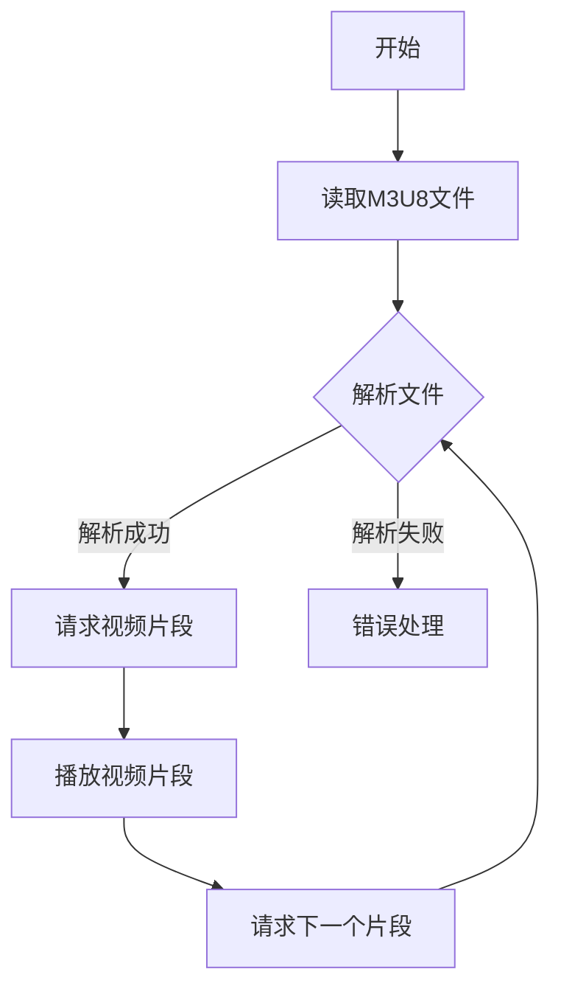

                 

关键词：M3U8，播放列表，视频分段，索引，编码，传输，直播，点播，HTTP动态流。

> 摘要：本文深入探讨了M3U8播放列表格式的工作原理、核心技术、应用场景，以及其与视频分段和索引的关系。通过详细的分析和实际案例，帮助读者全面了解M3U8格式在视频传输和播放中的重要作用。

## 1. 背景介绍

随着互联网的快速发展，视频内容成为网络流量的重要组成部分。为了提高视频播放的流畅性和适应性，视频通常会被分割成多个小片段，并通过特定的协议进行传输。M3U8（音频视频扩展播放列表）就是这样一种格式，它用于定义和索引视频流中的各个片段。

M3U8格式起源于音频播放列表，后来被扩展用于视频流。它的主要目的是提供一个高效、灵活的方式来组织和播放视频内容。M3U8文件由文本组成，包含一系列URL地址，每个地址对应视频中的一个片段。

### 1.1 M3U8格式的发展

M3U8格式最早由Apple公司开发，用于其QuickTime和HTTP动态流媒体技术。随着HTML5的出现和普及，M3U8格式逐渐成为视频点播和直播的首选格式之一。

### 1.2 M3U8格式的重要性

- **高效传输**：通过将视频分割成多个片段，可以更好地适应网络带宽和用户需求。
- **灵活播放**：支持多种视频编码，如H.264和H.265，能够满足不同设备的播放需求。
- **自适应流**：根据网络环境和用户设备调整播放质量，提供最佳观看体验。

## 2. 核心概念与联系

### 2.1 M3U8文件结构

一个典型的M3U8文件包含以下几部分：

- **#EXTM3U**：标识这是一个M3U8文件。
- **#EXT-X-STREAM-INF**：定义视频流的属性，如带宽、分辨率等。
- **片段URL**：对应视频流中的各个片段。

下面是一个简单的M3U8文件示例：

```plaintext
#EXTM3U
#EXT-X-STREAM-INF:BANDWIDTH=2500000,CODECS="avc1.64001f,mp4a.40.2"
http://example.com/video/high.mp4
#EXT-X-STREAM-INF:BANDWIDTH=1000000,CODECS="avc1.64001f,mp4a.40.2"
http://example.com/video/low.mp4
```

### 2.2 视频分段与索引

视频分段是将一个完整的视频文件分割成多个小的媒体文件的过程。每个片段通常包含几秒的视频内容，并且以特定的命名规则进行编号。M3U8文件通过索引这些片段的URL，实现了对视频流的播放控制。

### 2.3 Mermaid 流程图

为了更直观地展示M3U8文件的结构和流程，我们可以使用Mermaid绘制一个简单的流程图。



## 3. 核心算法原理 & 具体操作步骤

### 3.1 算法原理概述

M3U8播放列表的核心算法主要包括：

- **解析M3U8文件**：读取并解析M3U8文件中的信息，提取视频片段的URL和属性。
- **请求视频片段**：根据解析结果，向服务器请求视频片段。
- **播放视频片段**：接收并播放视频片段，实现视频播放。

### 3.2 算法步骤详解

1. **初始化播放器**：
   - 加载M3U8文件。
   - 注册事件监听器，如播放、暂停、缓冲等。

2. **解析M3U8文件**：
   - 读取M3U8文件内容。
   - 提取视频片段URL和属性。

3. **请求视频片段**：
   - 根据当前播放位置，请求相应的视频片段。
   - 使用HTTP请求从服务器获取视频片段。

4. **播放视频片段**：
   - 将获取到的视频片段数据交给播放器进行播放。

5. **处理播放事件**：
   - 根据播放进度，请求下一个视频片段。

### 3.3 算法优缺点

- **优点**：
  - 支持自适应流，根据网络环境和用户设备调整播放质量。
  - 支持多种视频编码，兼容性较好。
  - 可以实现无缝切换，提高用户体验。

- **缺点**：
  - 需要处理HTTP请求，对服务器性能有一定要求。
  - 可能存在版权问题，需要遵守相关法规。

### 3.4 算法应用领域

M3U8格式主要应用于视频点播和直播领域，如：

- **在线视频平台**：如YouTube、Netflix等。
- **直播应用**：如Twitch、YouTube直播等。
- **企业内部培训**：用于企业内部视频培训和学习。

## 4. 数学模型和公式 & 详细讲解 & 举例说明

### 4.1 数学模型构建

M3U8播放列表涉及到的数学模型主要包括：

- **带宽计算**：根据视频流率和播放分辨率计算带宽需求。
- **缓冲策略**：根据网络环境和播放进度调整缓冲时间。

### 4.2 公式推导过程

1. **带宽计算公式**：

$$
带宽 = 流率 \times 分辨率
$$

其中，流率和分辨率分别为视频片段的比特率和分辨率。

2. **缓冲策略公式**：

$$
缓冲时间 = \frac{带宽 \times 缓冲系数}{播放速度}
$$

其中，缓冲系数根据网络质量和播放稳定性进行调整。

### 4.3 案例分析与讲解

假设有一个视频流，分辨率为1080p（1920x1080），帧率为30fps，编码格式为H.264。我们需要计算其带宽需求和缓冲时间。

1. **带宽计算**：

$$
带宽 = 1920 \times 1080 \times 30 \times 1024 \times 8 = 195312500 \, \text{bps} \approx 240 \, \text{Mbps}
$$

2. **缓冲策略**：

假设缓冲系数为1.5，播放速度为1秒：

$$
缓冲时间 = \frac{240 \times 1.5}{1} = 360 \, \text{秒}
$$

因此，该视频流的带宽需求约为240Mbps，缓冲时间约为360秒。

## 5. 项目实践：代码实例和详细解释说明

### 5.1 开发环境搭建

为了演示M3U8播放列表的实现，我们使用以下开发环境和工具：

- **编程语言**：Python 3.8
- **依赖库**：beautifulsoup4、requests、ffmpeg

### 5.2 源代码详细实现

下面是一个简单的Python代码示例，用于解析M3U8文件并请求视频片段。

```python
import requests
from bs4 import BeautifulSoup

def parse_m3u8(url):
    response = requests.get(url)
    soup = BeautifulSoup(response.text, 'html.parser')
    playlist = soup.find_all('EXTINF')

    urls = []
    for item in playlist:
        url = item['EXT-X-STREAM-INF']['BANDWIDTH']
        urls.append(url)
    return urls

def download_segment(url, segment):
    response = requests.get(url)
    with open(segment, 'wb') as f:
        f.write(response.content)

if __name__ == '__main__':
    m3u8_url = 'http://example.com/video.m3u8'
    segment_urls = parse_m3u8(m3u8_url)
    for i, url in enumerate(segment_urls):
        segment = f'segment_{i}.mp4'
        download_segment(url, segment)
        print(f'Downloaded {segment}')
```

### 5.3 代码解读与分析

1. **解析M3U8文件**：使用requests库获取M3U8文件内容，然后使用beautifulsoup4库解析文件，提取视频片段的URL。
2. **下载视频片段**：遍历解析得到的视频片段URL，使用requests库请求每个片段，并保存到本地。

### 5.4 运行结果展示

运行代码后，将在当前目录下生成一系列视频片段文件，每个文件对应M3U8文件中的一个片段。

```plaintext
$ python m3u8_example.py
Downloaded segment_0.mp4
Downloaded segment_1.mp4
```

## 6. 实际应用场景

### 6.1 在线视频平台

M3U8格式广泛应用于在线视频平台，如YouTube、Netflix等。这些平台使用M3U8格式来提供多种分辨率的视频流，以满足不同用户的需求。

### 6.2 直播应用

直播应用，如Twitch、YouTube直播等，也广泛使用M3U8格式。M3U8格式允许直播应用根据用户的网络环境和观看需求动态调整视频质量。

### 6.3 企业内部培训

企业内部培训系统可以使用M3U8格式来提供高质量的视频内容，同时实现自适应流，提高培训效果。

## 7. 未来应用展望

随着5G网络的普及，M3U8格式有望在更多场景中发挥作用。未来，M3U8格式可能会支持更多视频编码格式，如AV1和VVC，以提供更高清晰度的视频内容。此外，M3U8格式还可能在物联网、智能硬件等领域得到应用。

## 8. 工具和资源推荐

### 7.1 学习资源推荐

- **M3U8官方文档**：了解M3U8格式的详细规范和用法。
- **在线教程**：查找关于M3U8的在线教程和示例代码。

### 7.2 开发工具推荐

- **FFmpeg**：用于视频编码和转码的工具。
- **M3U8 Demuxer**：用于解析M3U8文件的工具。

### 7.3 相关论文推荐

- **M3U8: A Flexible Streaming Protocol for HTML5 Video Players**：探讨M3U8格式在HTML5视频播放中的应用。
- **Adaptive HTTP Streaming over M3U8 with HLS**：研究M3U8在自适应流中的使用。

## 9. 总结：未来发展趋势与挑战

M3U8格式在视频传输和播放中发挥着重要作用。随着技术的发展，M3U8格式有望在更多领域得到应用。然而，也面临一些挑战，如版权保护和网络带宽优化等。

### 9.1 研究成果总结

本文探讨了M3U8播放列表格式的工作原理、核心算法和应用场景，为读者提供了全面的了解。

### 9.2 未来发展趋势

随着5G网络的普及和视频编码技术的进步，M3U8格式将在更多场景中发挥重要作用。

### 9.3 面临的挑战

- **版权保护**：需要建立完善的版权保护机制，防止未经授权的传播和使用。
- **网络带宽优化**：优化M3U8格式在网络传输中的效率，提高用户体验。

### 9.4 研究展望

未来的研究可以关注M3U8格式在物联网、智能硬件等领域的应用，以及如何提高其传输效率和兼容性。

## 10. 附录：常见问题与解答

### 10.1 M3U8文件为何要分割成多个片段？

M3U8文件分割成多个片段是为了提高视频传输的效率和适应性。这样可以更好地适应不同网络带宽和用户设备的需求。

### 10.2 M3U8格式支持哪些视频编码？

M3U8格式支持多种视频编码，如H.264、H.265、HEVC等。这些编码格式具有不同的压缩效率和质量，可以根据需求选择合适的编码格式。

### 10.3 如何处理M3U8文件的解析错误？

当M3U8文件解析失败时，可以尝试以下方法：

- 检查网络连接，确保可以访问M3U8文件。
- 检查M3U8文件的格式是否正确，确保没有缺失或错误的标签。
- 尝试使用不同的M3U8解析库或工具。

---

**作者：禅与计算机程序设计艺术 / Zen and the Art of Computer Programming**。

