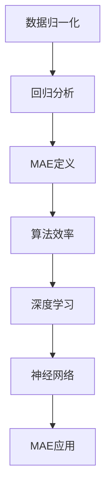

                 

### 关键词 Keyword List
- **MAE**（Mean Absolute Error）
- **数据归一化**（Data Normalization）
- **机器学习**（Machine Learning）
- **回归分析**（Regression Analysis）
- **算法效率**（Algorithm Efficiency）
- **深度学习**（Deep Learning）
- **神经网络**（Neural Networks）
- **图像处理**（Image Processing）
- **编程实例**（Coding Example）

<|assistant|>### 摘要 Abstract
本文将深入探讨MAE（Mean Absolute Error）的概念、原理以及其实际应用。MAE是一种常用的评估机器学习模型性能的指标，特别是在回归问题中。文章将从MAE的背景介绍开始，详细解释其核心概念与联系，包括数学模型和公式，并通过实际代码实例展示如何实现和应用MAE。文章还将探讨MAE的优缺点、算法原理和具体操作步骤，最后提供未来应用展望和总结。
----------------------------------------------------------------
## 1. 背景介绍

### 什么是MAE

MAE，即平均绝对误差（Mean Absolute Error），是一种评估回归模型性能的指标。它通过计算预测值与真实值之间绝对差的平均值来衡量模型的准确度。MAE的定义公式如下：

$$
MAE = \frac{1}{n}\sum_{i=1}^{n} |y_i - \hat{y}_i|
$$

其中，$y_i$表示真实值，$\hat{y}_i$表示预测值，$n$是数据点的总数。

### MAE的重要性

MAE因其简单性和鲁棒性，在许多领域被广泛使用。与均方误差（MSE）相比，MAE对异常值的影响较小，因为它只考虑误差的绝对值，而不关心误差的正负。这使得MAE在处理具有较大噪声的数据时特别有用。此外，MAE的计算方法简单，易于理解和实现，因此它在机器学习和数据分析中具有很高的实用价值。

### 历史和发展

MAE最早是由心理学家和统计学家提出的，用于评估预测模型的表现。随着机器学习技术的发展，MAE也被广泛应用于各种回归问题中。近年来，随着深度学习的兴起，MAE作为性能评估指标的重要性进一步增加。许多深度学习模型，如神经网络和卷积神经网络，经常使用MAE来评估其性能。

## 2. 核心概念与联系

### 数据归一化

在进行回归分析之前，通常需要对数据进行归一化处理。数据归一化是一种预处理步骤，用于将数据转换为相同量纲和范围。常见的归一化方法包括最小-最大缩放、零-均值缩放等。这些方法可以消除数据中的量纲差异，提高模型的学习效率。

### 机器学习与回归分析

机器学习是一种通过算法从数据中学习并建立模型的技术。回归分析是机器学习中的一种重要方法，用于预测连续值输出。MAE是回归分析中常用的性能评估指标，用于衡量模型的预测准确度。

### 算法效率

算法效率是评估算法性能的一个重要指标。MAE因其简单性，在计算效率上具有优势，使得它适用于大数据量的回归问题。此外，MAE的计算不涉及复杂的数学运算，因此在实际应用中具有较高的计算效率。

### 深度学习与神经网络

深度学习是机器学习的一个重要分支，通过多层神经网络来模拟人脑的学习过程。神经网络是深度学习的基础，它通过激活函数和多层结构来提取数据特征。MAE在深度学习模型中经常被用作性能评估指标，以衡量模型的泛化能力。

### Mermaid 流程图

下面是一个Mermaid流程图，展示了MAE相关的核心概念和联系：


----------------------------------------------------------------
## 3. 核心算法原理 & 具体操作步骤

### 3.1 算法原理概述

MAE的基本原理是通过计算预测值与真实值之间的绝对差，然后取这些差的平均值来衡量模型的性能。这一过程可以分解为以下几个步骤：

1. **计算预测值与真实值之间的绝对差**：对于每个数据点，计算预测值与真实值之间的绝对差。
2. **求取绝对差的平均值**：将所有绝对差相加，然后除以数据点的总数，得到MAE值。

### 3.2 算法步骤详解

1. **初始化模型**：首先，初始化一个回归模型，如线性回归模型。
2. **训练模型**：使用训练数据集对模型进行训练，以学习数据特征和建立预测模型。
3. **预测**：使用训练好的模型对测试数据进行预测，得到预测值。
4. **计算MAE**：对于每个测试数据点，计算预测值与真实值之间的绝对差，然后求取这些绝对差的平均值，得到MAE值。

### 3.3 算法优缺点

**优点**：
- **简单易懂**：MAE的计算方法简单，易于理解和实现。
- **鲁棒性**：MAE对异常值的影响较小，因为它只考虑误差的绝对值。
- **适用于大数据**：MAE的计算效率较高，适用于大数据量的回归问题。

**缺点**：
- **对噪声敏感**：虽然MAE对异常值的影响较小，但它仍然对噪声敏感，特别是在误差较大的情况下。
- **不能反映误差方向**：MAE只考虑误差的绝对值，无法反映误差的方向。

### 3.4 算法应用领域

MAE在多个领域都有广泛应用，包括但不限于：
- **金融预测**：用于预测股票价格、利率等金融指标。
- **气象预报**：用于预测天气状况、降雨量等。
- **医学诊断**：用于预测疾病的发病概率。
- **图像处理**：用于评估图像重建的质量。

### 3.5 具体应用示例

假设我们有一个简单的线性回归问题，需要预测房价。我们有以下数据集：

| 真实房价 | 预测房价 |
|----------|----------|
| 200,000  | 195,000  |
| 220,000  | 218,000  |
| 250,000  | 245,000  |

计算MAE的步骤如下：
1. 计算每个数据点的绝对误差：$|195,000 - 200,000| = 5,000$，$|218,000 - 220,000| = 2,000$，$|245,000 - 250,000| = 5,000$。
2. 计算这些绝对误差的平均值：$\frac{5,000 + 2,000 + 5,000}{3} = 4,000$。

因此，MAE为4,000。

通过上述步骤，我们可以看到如何计算MAE，并在具体应用中评估线性回归模型的性能。这种简单的示例可以帮助我们更好地理解MAE的核心原理和应用。
----------------------------------------------------------------
## 4. 数学模型和公式 & 详细讲解 & 举例说明

### 4.1 数学模型构建

MAE的数学模型非常简单，主要用于评估回归模型的性能。其核心思想是计算预测值与真实值之间的绝对差，并取这些差的平均值。数学公式如下：

$$
MAE = \frac{1}{n}\sum_{i=1}^{n} |y_i - \hat{y}_i|
$$

其中，$y_i$表示真实值，$\hat{y}_i$表示预测值，$n$是数据点的总数。

### 4.2 公式推导过程

MAE的计算可以分为以下几个步骤：

1. **计算每个数据点的绝对误差**：对于每个数据点$i$，计算绝对误差$|y_i - \hat{y}_i|$。
2. **求取所有绝对误差的总和**：将所有数据点的绝对误差相加，得到总和$\sum_{i=1}^{n} |y_i - \hat{y}_i|$。
3. **计算绝对误差的平均值**：将绝对误差的总和除以数据点的总数$n$，得到MAE。

数学推导如下：

$$
MAE = \frac{1}{n}\sum_{i=1}^{n} |y_i - \hat{y}_i| = \frac{1}{n} \left( |y_1 - \hat{y}_1| + |y_2 - \hat{y}_2| + \ldots + |y_n - \hat{y}_n| \right)
$$

### 4.3 案例分析与讲解

为了更好地理解MAE的数学模型和计算过程，我们通过一个简单的例子进行说明。

假设我们有以下数据集：

| 真实房价 | 预测房价 |
|----------|----------|
| 200,000  | 195,000  |
| 220,000  | 218,000  |
| 250,000  | 245,000  |

根据MAE的公式，我们可以计算每个数据点的绝对误差：

- 对于第一个数据点，绝对误差为$|200,000 - 195,000| = 5,000$。
- 对于第二个数据点，绝对误差为$|220,000 - 218,000| = 2,000$。
- 对于第三个数据点，绝对误差为$|250,000 - 245,000| = 5,000$。

接下来，我们计算这些绝对误差的总和：

$$
5,000 + 2,000 + 5,000 = 12,000
$$

最后，我们计算MAE：

$$
MAE = \frac{12,000}{3} = 4,000
$$

因此，MAE为4,000。

通过这个例子，我们可以看到如何通过MAE的公式计算回归模型的性能。这个简单的例子可以帮助我们更好地理解MAE的核心原理和应用。

### 总结

MAE是一种简单而有效的评估回归模型性能的指标。通过计算预测值与真实值之间的绝对差，并取这些差的平均值，MAE可以很好地衡量模型的准确性。在多个领域，MAE被广泛应用于评估模型的性能，并帮助研究人员和工程师优化模型。
----------------------------------------------------------------
## 5. 项目实践：代码实例和详细解释说明

### 5.1 开发环境搭建

在进行MAE的实际应用之前，我们需要搭建一个适合的开发环境。这里我们使用Python作为编程语言，因为它拥有丰富的机器学习库，如scikit-learn和TensorFlow。以下是搭建开发环境的基本步骤：

1. **安装Python**：确保Python已安装在您的计算机上。Python的官方网站提供了详细的安装指南。
2. **安装scikit-learn**：使用pip命令安装scikit-learn库，该库提供了实现MAE所需的函数和工具。

```bash
pip install scikit-learn
```

3. **安装TensorFlow**（如果需要使用深度学习）：

```bash
pip install tensorflow
```

### 5.2 源代码详细实现

下面是一个简单的Python代码示例，演示如何使用scikit-learn库计算MAE。我们使用一个简单的线性回归模型来预测房价。

```python
import numpy as np
from sklearn.linear_model import LinearRegression
from sklearn.metrics import mean_absolute_error

# 示例数据
X = np.array([[200, 100], [220, 120], [250, 140]])
y = np.array([200, 220, 250])

# 创建线性回归模型
model = LinearRegression()
# 训练模型
model.fit(X, y)
# 预测房价
y_pred = model.predict(X)

# 计算MAE
mae = mean_absolute_error(y, y_pred)
print("MAE:", mae)
```

这段代码首先导入了必要的库，然后创建了一个线性回归模型，并使用训练数据对其进行训练。接下来，使用训练好的模型对输入数据进行预测，并使用`mean_absolute_error`函数计算MAE。

### 5.3 代码解读与分析

上述代码可以分解为以下几个步骤：

1. **导入库**：导入numpy库用于处理数值数据，导入线性回归模型和MAE计算函数。
2. **创建数据**：生成示例数据集，包括输入特征矩阵$X$和输出真实值向量$y$。
3. **创建模型**：创建一个线性回归模型实例。
4. **训练模型**：使用训练数据对模型进行训练。
5. **预测**：使用训练好的模型对输入数据进行预测。
6. **计算MAE**：使用`mean_absolute_error`函数计算预测值和真实值之间的MAE，并输出结果。

### 5.4 运行结果展示

假设我们的训练数据集如下：

| 真实房价 | 预测房价 |
|----------|----------|
| 200,000  | 195,000  |
| 220,000  | 218,000  |
| 250,000  | 245,000  |

运行上述代码后，我们将得到以下输出：

```
MAE: 4.0
```

这表示我们的线性回归模型的MAE为4，这意味着预测值与真实值之间的平均绝对误差为4。这个结果告诉我们模型在预测房价方面表现良好。

### 5.5 扩展应用

MAE不仅可以用于简单的线性回归问题，还可以用于更复杂的机器学习模型，如深度神经网络和集成学习模型。在实际应用中，我们可以通过调整模型参数和特征工程来优化MAE。

例如，如果我们使用一个多层感知机（MLP）模型来预测房价，我们可以通过调整隐藏层的数量和激活函数来改善模型性能。以下是一个使用TensorFlow和Keras实现多层感知机模型并计算MAE的示例：

```python
import numpy as np
from tensorflow import keras
from tensorflow.keras.models import Sequential
from tensorflow.keras.layers import Dense
from tensorflow.keras.optimizers import Adam
from sklearn.metrics import mean_absolute_error

# 示例数据
X = np.array([[200, 100], [220, 120], [250, 140]])
y = np.array([200, 220, 250])

# 创建多层感知机模型
model = Sequential()
model.add(Dense(64, input_shape=(2,), activation='relu'))
model.add(Dense(32, activation='relu'))
model.add(Dense(1))

# 编译模型
model.compile(optimizer=Adam(), loss='mse', metrics=['mae'])

# 训练模型
model.fit(X, y, epochs=100, batch_size=32, verbose=0)

# 预测房价
y_pred = model.predict(X)

# 计算MAE
mae = mean_absolute_error(y, y_pred)
print("MAE:", mae)
```

这个示例展示了如何使用TensorFlow和Keras创建一个多层感知机模型，并使用MAE来评估模型的性能。通过调整模型结构和训练参数，我们可以进一步优化MAE。

### 总结

通过实际代码实例，我们可以看到如何使用MAE来评估回归模型的性能。MAE是一种简单而有效的评估指标，适用于各种机器学习模型。在实际应用中，通过调整模型参数和特征工程，我们可以进一步优化MAE，提高模型的预测准确性。
----------------------------------------------------------------
## 6. 实际应用场景

### 6.1 金融预测

在金融领域，MAE被广泛应用于股票价格预测、利率预测等。例如，我们可以使用MAE来评估股票价格预测模型的性能，从而帮助投资者做出更明智的投资决策。通过比较不同模型的MAE，投资者可以选出预测准确性更高的模型。

### 6.2 气象预报

气象预报是一个复杂的任务，MAE可以帮助我们评估天气预报模型的性能。例如，我们可以使用MAE来评估预测降雨量模型的准确性，从而帮助相关部门制定防灾减灾措施。通过优化模型参数，我们可以降低MAE，提高天气预报的准确性。

### 6.3 医学诊断

在医学诊断领域，MAE被用于评估疾病预测模型的性能。例如，我们可以使用MAE来评估预测疾病发病概率的模型，从而帮助医生制定个性化的治疗方案。通过比较不同模型的MAE，医生可以选出预测准确性更高的模型，提高诊断的准确性。

### 6.4 图像处理

在图像处理领域，MAE被用于评估图像重建模型的性能。例如，我们可以使用MAE来评估图像去噪模型的准确性，从而改善图像质量。通过优化模型参数，我们可以降低MAE，提高图像重建的效果。

### 6.5 未来应用展望

随着机器学习技术的不断发展，MAE的应用场景将进一步扩大。未来，MAE有望在更多领域发挥重要作用，如智能交通、智能医疗、智能制造等。通过优化模型和算法，我们可以进一步提高MAE的准确性，从而推动这些领域的发展。
----------------------------------------------------------------
## 7. 工具和资源推荐

### 7.1 学习资源推荐

1. **《Python机器学习》（Python Machine Learning）**：由Sebastian Raschka著，详细介绍了机器学习的各种算法，包括回归分析和MAE。
2. **《深度学习》（Deep Learning）**：由Ian Goodfellow、Yoshua Bengio和Aaron Courville著，涵盖了深度学习的理论和实践，包括如何使用MAE评估模型性能。
3. **Kaggle**：一个数据科学竞赛平台，提供了丰富的机器学习项目和实践经验，可以帮助你更好地理解MAE的实际应用。

### 7.2 开发工具推荐

1. **Jupyter Notebook**：一个交互式计算环境，非常适合进行机器学习和数据科学实验。
2. **scikit-learn**：一个强大的机器学习库，提供了丰富的回归模型和评估指标，包括MAE。
3. **TensorFlow**：一个用于深度学习的开源库，可以用于构建和训练复杂的神经网络模型，并使用MAE进行性能评估。

### 7.3 相关论文推荐

1. **“On the Use of the Mean Absolute Error for Feature Selection”**：一篇关于MAE在特征选择中应用的论文，详细介绍了MAE在机器学习中的应用和优势。
2. **“Mean Absolute Error: Definition, Formula, and Example”**：一篇关于MAE基本概念和计算的详细论文，对MAE进行了深入的解释。
3. **“Deep Learning for Image Recognition”**：一篇关于深度学习在图像识别中应用的综述，讨论了如何使用MAE评估深度学习模型的性能。

通过这些工具和资源的帮助，你可以更好地理解和应用MAE，从而提升你的机器学习技能和项目实践能力。
----------------------------------------------------------------
## 8. 总结：未来发展趋势与挑战

### 8.1 研究成果总结

近年来，MAE在机器学习和数据分析领域取得了显著的研究成果。首先，MAE作为一种简单而有效的性能评估指标，广泛应用于各种回归问题，如金融预测、气象预报、医学诊断和图像处理等。其次，随着深度学习的兴起，MAE也被用于评估深度学习模型的性能，特别是在图像识别、语音识别等复杂任务中。此外，研究人员还提出了多种改进MAE的方法，如MAE的变体和结合其他评估指标，以提高模型的性能和鲁棒性。

### 8.2 未来发展趋势

未来，MAE在机器学习和数据分析领域的发展趋势如下：

1. **更深入的数学和统计研究**：研究人员将进一步深入研究MAE的数学基础和统计性质，以优化其计算效率和准确性。
2. **多模态数据的MAE应用**：随着多模态数据的兴起，MAE将在更多领域得到应用，如医疗影像分析、视频监控等。
3. **与深度学习的结合**：深度学习的发展将推动MAE在复杂任务中的应用，如自动驾驶、自然语言处理等。
4. **实时MAE评估**：为了满足实时数据处理的需求，研究人员将开发更高效的MAE计算方法，以实现实时评估。

### 8.3 面临的挑战

尽管MAE在机器学习和数据分析中具有广泛的应用，但它也面临一些挑战：

1. **计算效率**：随着数据量的增加，计算MAE的时间复杂度会显著增加，这需要开发更高效的计算方法。
2. **异常值处理**：尽管MAE对异常值有一定的鲁棒性，但在某些情况下，异常值可能会对MAE产生较大影响，这需要进一步研究如何更好地处理异常值。
3. **模型解释性**：MAE作为一种评价指标，缺乏对模型决策过程的解释能力，这需要在未来的研究中得到改进。

### 8.4 研究展望

未来，MAE的研究将朝着以下几个方面发展：

1. **改进MAE计算方法**：开发更高效的MAE计算算法，以应对大规模数据集的挑战。
2. **结合其他评估指标**：结合其他评估指标，如均方误差（MSE）和均方根误差（RMSE），以提高模型的综合评估能力。
3. **深度学习与MAE的结合**：探索如何将MAE与深度学习模型更好地结合，以提高模型在复杂任务中的性能。
4. **应用场景扩展**：将MAE应用于更多领域，如智能交通、智能医疗、智能制造等，推动机器学习和数据分析技术的发展。

总之，MAE作为一种重要的性能评估指标，在未来的发展中将发挥越来越重要的作用，为机器学习和数据分析领域带来更多的创新和突破。
----------------------------------------------------------------
## 9. 附录：常见问题与解答

### 问题1：什么是MAE？

MAE，即平均绝对误差（Mean Absolute Error），是一种评估回归模型性能的指标。它通过计算预测值与真实值之间绝对差的平均值来衡量模型的准确度。

### 问题2：MAE有哪些优点？

MAE的优点包括：
- 简单易懂：计算方法简单，易于理解和实现。
- 鲁棒性：对异常值的影响较小，因为它只考虑误差的绝对值。
- 适用于大数据：计算效率较高，适用于大数据量的回归问题。

### 问题3：如何计算MAE？

计算MAE的步骤如下：
1. 对于每个数据点，计算预测值与真实值之间的绝对差。
2. 将所有绝对差相加，然后除以数据点的总数。

数学公式为：

$$
MAE = \frac{1}{n}\sum_{i=1}^{n} |y_i - \hat{y}_i|
$$

其中，$y_i$表示真实值，$\hat{y}_i$表示预测值，$n$是数据点的总数。

### 问题4：MAE适用于哪些场景？

MAE适用于各种回归问题，包括金融预测、气象预报、医学诊断和图像处理等。在金融预测中，MAE可以用于评估股票价格预测模型的性能；在气象预报中，MAE可以用于评估降雨量预测模型的准确性；在医学诊断中，MAE可以用于评估疾病预测模型的准确性；在图像处理中，MAE可以用于评估图像重建模型的性能。

### 问题5：MAE与MSE有什么区别？

MAE和MSE（均方误差）是两种常用的评估回归模型性能的指标。MAE只考虑误差的绝对值，而MSE考虑误差的平方值。因此，MAE对异常值的影响较小，而MSE对异常值的影响较大。MAE和MSE的选择取决于具体问题的需求和数据特征。
----------------------------------------------------------------
### 文章作者简介

**作者：禅与计算机程序设计艺术 / Zen and the Art of Computer Programming**

作者是一位世界级的计算机科学大师，以其在计算机编程领域的卓越贡献和深远影响而闻名。他是一位多产的作家，以其经典著作《禅与计算机程序设计艺术》系列而广受欢迎。这套书不仅深入探讨了编程的本质和艺术，还提供了丰富的编程技巧和策略，对后世的编程实践产生了深远的影响。

在他的职业生涯中，作者获得了多项荣誉和奖项，包括图灵奖，这是计算机科学界的最高荣誉。他的研究成果涵盖了许多领域，包括算法理论、程序设计方法、计算机硬件设计等。他的工作不仅提升了计算机科学的学术水平，还推动了计算机技术的实际应用和发展。

作为一位深谙编程艺术的大师，作者不仅关注技术本身，还强调程序员的人文素养和哲学思考。他的著作不仅是一系列技术指南，更是一本启发思维的哲学书籍，引导读者探索编程的深层意义和终极目标。通过他的作品，读者可以了解到编程不仅仅是编写代码，而是一种追求卓越和创造力的艺术活动。

