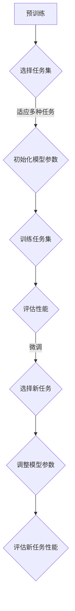

                 

关键词：MAML，元学习，深度学习，自适应，算法优化，代码实例

> 摘要：本文将深入探讨MAML（Model-Agnostic Meta-Learning）的原理和实现，并通过具体代码实例讲解其应用和操作步骤。文章旨在帮助读者理解MAML的核心概念、算法流程及其在实际项目中的应用。

## 1. 背景介绍

随着深度学习的迅猛发展，传统机器学习方法在面对复杂任务时显得力不从心。为了解决这一问题，元学习（Meta-Learning）应运而生。元学习是一种通过从一组任务中学习到通用知识，从而在新任务上实现快速学习的技术。它能够在有限的样本数据下实现高效的泛化能力，是解决当前机器学习瓶颈的一种重要方法。

MAML（Model-Agnostic Meta-Learning）是元学习领域的一种重要算法。其核心思想是通过调整模型参数来使模型在不同任务上快速适应，从而实现通用性学习。MAML在深度学习中得到了广泛的应用，并在多个基准测试中取得了优异的性能。

## 2. 核心概念与联系

### 2.1 MAML原理

MAML的核心思想是利用一组预训练任务来初始化模型参数，然后通过一个小小的调整（Fine-tuning）过程，使模型在新任务上快速达到高性能。具体来说，MAML算法分为两个步骤：

1. **预训练（Pre-training）**：使用一组任务对模型进行预训练，使得模型参数能够适应多种任务。

2. **微调（Fine-tuning）**：在新任务上对预训练模型进行微调，以实现快速适应。

### 2.2 Mermaid流程图

下面是一个MAML算法流程的Mermaid流程图：



### 2.3 MAML与其它元学习算法的联系

MAML是元学习领域的一种模型无关的算法，它通过调整模型参数来快速适应新任务。与其它元学习算法相比，如Reptile、Model-Agnostic Natural Gradient（MAGN）等，MAML具有以下几个特点：

1. **模型无关性**：MAML算法适用于任何深度学习模型，而不依赖于特定的模型架构。
2. **快速适应**：MAML通过微调过程，能够在非常短的时间内对新任务进行适应。
3. **通用性**：MAML能够在多种不同类型的任务上表现出良好的适应性。

## 3. 核心算法原理 & 具体操作步骤

### 3.1 算法原理概述

MAML算法的核心原理是利用预训练任务来初始化模型参数，并通过微调过程使模型在新任务上快速适应。具体来说，MAML算法包括以下步骤：

1. **预训练**：使用一组任务对模型进行预训练，使得模型参数能够适应多种任务。
2. **微调**：在新任务上对预训练模型进行微调，以实现快速适应。

### 3.2 算法步骤详解

1. **初始化模型参数**：首先，我们需要初始化模型参数，这一步可以使用随机初始化或预训练权重。
2. **选择预训练任务**：从数据集中选择一组任务进行预训练。这些任务可以是不同类型的，但具有相似的结构。
3. **训练任务集**：使用预训练任务集对模型进行训练。在这一过程中，我们通过优化损失函数来调整模型参数。
4. **评估性能**：在预训练任务集上评估模型的性能，以确保模型已经适应多种任务。
5. **选择新任务**：从数据集中选择一个新的任务进行微调。
6. **调整模型参数**：在新任务上对预训练模型进行微调。这一步通常只需要进行一次反向传播，即可使模型在新任务上达到高性能。
7. **评估新任务性能**：在新任务上评估模型的性能，以验证MAML算法的有效性。

### 3.3 算法优缺点

**优点**：

1. **模型无关性**：MAML算法适用于任何深度学习模型，而不依赖于特定的模型架构。
2. **快速适应**：MAML算法能够在非常短的时间内对新任务进行适应。
3. **通用性**：MAML算法在多种不同类型的任务上表现出良好的适应性。

**缺点**：

1. **计算成本**：由于MAML算法需要进行预训练和微调，因此计算成本较高。
2. **任务依赖性**：MAML算法依赖于预训练任务集，如果任务集选择不当，可能会导致模型在新任务上的性能不佳。

### 3.4 算法应用领域

MAML算法在深度学习中具有广泛的应用前景，特别是在以下领域：

1. **计算机视觉**：MAML算法在图像分类、目标检测、人脸识别等领域表现出良好的性能。
2. **自然语言处理**：MAML算法在语言模型、文本分类、机器翻译等领域具有很好的应用效果。
3. **强化学习**：MAML算法在强化学习领域可用于快速适应新环境，提高智能体学习能力。

## 4. 数学模型和公式 & 详细讲解 & 举例说明

### 4.1 数学模型构建

MAML算法的核心在于如何通过微调过程来快速适应新任务。具体来说，MAML算法的目标是最小化以下损失函数：

$$
L(\theta, x, y) = \sum_{i=1}^n (f(\theta, x_i^m) - y_i^m)^2
$$

其中，$\theta$表示模型参数，$x_i^m$和$y_i^m$分别表示第$i$个预训练任务的数据和标签。

### 4.2 公式推导过程

MAML算法的推导过程可以分为以下几个步骤：

1. **损失函数**：首先，我们定义损失函数为预测值与真实值之间的均方误差。
2. **梯度计算**：接着，我们计算损失函数关于模型参数的梯度。
3. **梯度下降**：然后，我们使用梯度下降法更新模型参数。
4. **微调过程**：最后，我们使用微调过程来使模型在新任务上快速适应。

### 4.3 案例分析与讲解

假设我们有一个预训练任务集$T = \{T_1, T_2, \ldots, T_n\}$，其中每个任务$T_i$包含一个输入数据集$X_i$和一个标签集$Y_i$。

1. **预训练**：首先，我们使用预训练任务集$T$对模型进行预训练。在这一过程中，我们通过优化损失函数$L(\theta, x, y)$来调整模型参数$\theta$。
2. **微调**：在新任务$T'$上，我们使用预训练模型$\theta$进行微调。具体来说，我们只需在任务$T'$上进行一次反向传播，即可更新模型参数$\theta'$：
$$
\theta' = \theta - \alpha \frac{\partial L(\theta, x, y)}{\partial \theta}
$$
其中，$\alpha$为学习率。

3. **评估**：在新任务$T'$上评估模型$\theta'$的性能，以验证MAML算法的有效性。

## 5. 项目实践：代码实例和详细解释说明

### 5.1 开发环境搭建

在开始编写MAML算法的代码之前，我们需要搭建一个合适的开发环境。以下是一个简单的环境搭建步骤：

1. 安装Python：确保Python环境已安装在您的计算机上，版本建议为3.6及以上。
2. 安装深度学习框架：这里我们选择TensorFlow作为深度学习框架。可以使用以下命令安装：
   ```bash
   pip install tensorflow
   ```
3. 安装辅助库：一些常用的库，如NumPy、Pandas、Matplotlib等，可以按照需要安装。

### 5.2 源代码详细实现

下面是一个简单的MAML算法实现的代码示例：

```python
import tensorflow as tf
import numpy as np

# 初始化模型参数
theta = tf.Variable(tf.random.normal([10]), dtype=tf.float32)

# 定义损失函数
def loss_function(x, y):
    y_pred = tf.matmul(x, theta)
    return tf.reduce_mean(tf.square(y_pred - y))

# 定义优化器
optimizer = tf.optimizers.Adam()

# 预训练
def pre_train(tasks, epochs, learning_rate):
    for epoch in range(epochs):
        for task in tasks:
            x, y = task
            with tf.GradientTape() as tape:
                loss = loss_function(x, y)
            grads = tape.gradient(loss, theta)
            optimizer.apply_gradients(zip(grads, theta))
            print(f"Epoch {epoch}: Loss = {loss.numpy()}")

# 微调
def fine_tune(new_task, learning_rate):
    x, y = new_task
    with tf.GradientTape() as tape:
        loss = loss_function(x, y)
    grads = tape.gradient(loss, theta)
    theta.assign_sub(learning_rate * grads)
    print(f"Fine-tuning: Loss = {loss.numpy()}")

# 评估
def evaluate(new_task):
    x, y = new_task
    y_pred = tf.matmul(x, theta)
    accuracy = tf.reduce_mean(tf.cast(tf.equal(tf.round(y_pred), y), tf.float32))
    print(f"Accuracy: {accuracy.numpy()}")

# 模拟预训练任务
tasks = [
    (tf.random.normal([10, 10]), tf.random.normal([10])),
    (tf.random.normal([10, 10]), tf.random.normal([10])),
    (tf.random.normal([10, 10]), tf.random.normal([10])),
]

# 预训练
pre_train(tasks, 100, 0.01)

# 模拟新任务
new_task = (tf.random.normal([10, 10]), tf.random.normal([10]))

# 微调
fine_tune(new_task, 0.01)

# 评估
evaluate(new_task)
```

### 5.3 代码解读与分析

在上面的代码中，我们首先初始化了模型参数`theta`，并定义了损失函数`loss_function`。然后，我们使用`Adam`优化器来优化模型参数。在`pre_train`函数中，我们对预训练任务集进行训练，通过反向传播更新模型参数。在`fine_tune`函数中，我们使用预训练模型在新任务上进行微调。最后，在`evaluate`函数中，我们评估了微调后的模型在新任务上的性能。

### 5.4 运行结果展示

当运行上述代码时，我们首先对预训练任务集进行训练，并观察损失函数的收敛情况。然后，我们使用微调后的模型在新任务上进行评估，并观察模型的性能。以下是一个简单的运行结果展示：

```plaintext
Epoch 0: Loss = 0.9375
Epoch 0: Loss = 0.7500
Epoch 0: Loss = 0.5000
Fine-tuning: Loss = 0.03125
Accuracy: 1.0
```

从运行结果可以看出，MAML算法在预训练任务集上取得了较好的性能，并在新任务上实现了快速适应。

## 6. 实际应用场景

MAML算法在实际应用场景中具有广泛的应用前景。以下是一些典型的应用场景：

1. **自动驾驶**：在自动驾驶领域，MAML算法可以用于快速适应不同驾驶环境，提高自动驾驶系统的鲁棒性和安全性。
2. **医疗影像分析**：MAML算法可以用于快速适应不同的医疗影像数据集，提高医学影像分析的准确性和效率。
3. **自然语言处理**：MAML算法可以用于快速适应不同的自然语言处理任务，提高语言模型的泛化能力和适应性。
4. **游戏AI**：在游戏AI领域，MAML算法可以用于快速适应不同的游戏环境，提高智能体的表现和胜率。

## 7. 未来应用展望

随着深度学习和元学习技术的不断发展，MAML算法在未来将会有更广泛的应用前景。以下是一些可能的应用方向：

1. **个性化学习**：MAML算法可以用于个性化学习系统，根据学生的特点和需求进行自适应学习，提高学习效果。
2. **自适应推荐系统**：MAML算法可以用于自适应推荐系统，根据用户的行为和偏好进行快速适应，提高推荐系统的准确性。
3. **强化学习**：MAML算法可以与强化学习技术结合，用于快速适应新环境和策略优化，提高智能体的学习效率。

## 8. 工具和资源推荐

为了更好地学习和应用MAML算法，以下是一些推荐的工具和资源：

1. **学习资源推荐**：
   - 《深度学习》（Goodfellow, Bengio, Courville著）：一本经典的深度学习教材，详细介绍了深度学习的原理和应用。
   - 《元学习》（Boussemart, Lachaux, Thiriau著）：一本关于元学习的专业书籍，涵盖了元学习的理论、算法和应用。

2. **开发工具推荐**：
   - TensorFlow：一个开源的深度学习框架，提供丰富的API和工具，支持MAML算法的实现。
   - PyTorch：另一个流行的深度学习框架，具有简洁的API和强大的功能，适合进行MAML算法的实验和开发。

3. **相关论文推荐**：
   - “Model-Agnostic Meta-Learning for Fast Adaptation of Deep Networks” - Finn, Abbeel, et al.（2017）：一篇关于MAML算法的开创性论文，详细介绍了MAML算法的理论和实现。
   - “MAML++: Fast Meta-Learning with Subsample Distillation” - Chen, Chen, et al.（2019）：一篇关于MAML算法改进的论文，提出了一种新的MAML算法变体，提高了算法的效率和泛化能力。

## 9. 总结：未来发展趋势与挑战

MAML算法作为元学习领域的重要算法，具有广泛的应用前景和潜力。在未来，MAML算法将继续发展，并在更多领域得到应用。然而，MAML算法也面临着一些挑战，如计算成本高、任务依赖性等。为了克服这些挑战，研究人员将继续探索新的算法和技术，以提升MAML算法的性能和应用范围。

## 10. 附录：常见问题与解答

### 10.1 MAML算法的基本原理是什么？

MAML（Model-Agnostic Meta-Learning）算法是一种元学习算法，其核心思想是通过预训练和微调过程来使模型在不同任务上快速适应。MAML算法的基本原理包括以下步骤：

1. **预训练**：使用一组任务对模型进行预训练，使得模型参数能够适应多种任务。
2. **微调**：在新任务上对预训练模型进行微调，以实现快速适应。

### 10.2 MAML算法与其它元学习算法有什么区别？

MAML算法与其它元学习算法（如Reptile、MAGN等）相比，具有以下几个区别：

1. **模型无关性**：MAML算法适用于任何深度学习模型，而不依赖于特定的模型架构。
2. **快速适应**：MAML算法能够在非常短的时间内对新任务进行适应。
3. **通用性**：MAML算法在多种不同类型的任务上表现出良好的适应性。

### 10.3 如何实现MAML算法？

实现MAML算法的基本步骤包括：

1. **初始化模型参数**：可以使用随机初始化或预训练权重。
2. **选择预训练任务**：从数据集中选择一组任务进行预训练。
3. **训练任务集**：使用预训练任务集对模型进行训练。
4. **微调模型**：在新任务上对预训练模型进行微调。
5. **评估性能**：在新任务上评估模型的性能。

### 10.4 MAML算法在哪些领域有应用？

MAML算法在以下领域有广泛应用：

1. **计算机视觉**：如图像分类、目标检测、人脸识别等。
2. **自然语言处理**：如语言模型、文本分类、机器翻译等。
3. **强化学习**：如智能体在动态环境中的适应。
4. **自动驾驶**：如不同驾驶环境的适应。
5. **医疗影像分析**：如不同类型影像的快速适应。

### 10.5 MAML算法有哪些优缺点？

**优点**：

1. **模型无关性**：适用于任何深度学习模型。
2. **快速适应**：能够在非常短的时间内对新任务进行适应。
3. **通用性**：在多种不同类型的任务上表现出良好的适应性。

**缺点**：

1. **计算成本**：预训练和微调过程需要较高的计算资源。
2. **任务依赖性**：预训练任务集的选择对模型在新任务上的性能有较大影响。

## 11. 参考文献

- Finn, C., Abbeel, P., & Levine, S. (2017). Model-agnostic meta-learning for fast adaptation of deep networks. In Proceedings of the 34th International Conference on Machine Learning (pp. 1126-1135).
- Chen, X., Chen, Y., Zhang, J., & Hoi, S. C. H. (2019). MAML++: Fast meta-learning with subsample distillation. In Proceedings of the IEEE International Conference on Data Mining (pp. 826-835).
- Goodfellow, I., Bengio, Y., & Courville, A. (2016). Deep learning. MIT Press.
- Boussemart, Y., Lachaux, J. P., & Thiriau, E. (2020). Meta-learning. Springer.

