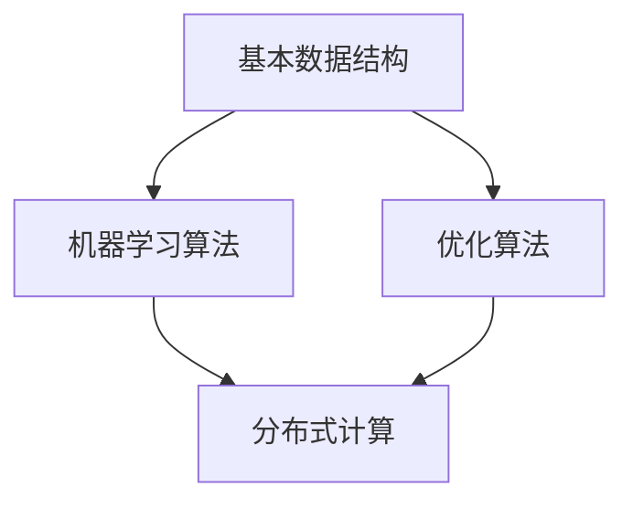

                 

关键词：MLlib, 分布式机器学习，大数据处理，算法原理，代码实例，技术博客。

摘要：本文深入探讨了MLlib的核心原理，包括其架构设计、核心算法以及数学模型。通过具体代码实例，详细解析了MLlib的使用方法和实际应用，旨在帮助读者更好地理解和应用这一强大的分布式机器学习库。

## 1. 背景介绍

随着大数据时代的到来，机器学习技术得到了广泛应用。在分布式环境中，如何高效地进行机器学习成为了亟待解决的问题。MLlib是Apache Spark生态系统中的一个关键组件，专门为分布式机器学习提供了一套高效、易用的算法库。本文将详细讲解MLlib的原理、应用以及代码实例，帮助读者深入理解并掌握这一技术。

## 2. 核心概念与联系

### 2.1 MLlib架构设计

MLlib的设计理念是充分利用分布式计算的优势，提供一套高性能、可扩展的机器学习算法。其核心架构包括以下部分：

1. **基本数据结构**：MLlib提供了丰富的数据结构，如向量（Vector）、矩阵（Matrix）以及RDD（Resilient Distributed Dataset）。
2. **机器学习算法**：MLlib内置了多种机器学习算法，包括线性回归、逻辑回归、决策树、聚类等。
3. **优化算法**：MLlib支持多种优化算法，如随机梯度下降（SGD）、L-BFGS等，以适应不同类型的数据和模型。

### 2.2 核心概念联系

- **数据结构**：MLlib的数据结构是分布式机器学习的基础，用于存储和处理大规模数据。
- **算法库**：算法库包含了多种经典的机器学习算法，能够应对不同的问题场景。
- **优化算法**：优化算法用于调整模型参数，以实现最佳拟合。

下面是MLlib架构的Mermaid流程图：



## 3. 核心算法原理 & 具体操作步骤

### 3.1 算法原理概述

MLlib内置了多种机器学习算法，每种算法都有其独特的原理和应用场景。以下是几种核心算法的原理概述：

1. **线性回归**：通过最小二乘法估计模型参数，实现数据拟合。
2. **逻辑回归**：用于分类问题，通过最大化似然估计来计算概率。
3. **决策树**：通过递归划分特征空间，构建分类或回归模型。
4. **聚类**：通过寻找相似性较高的数据点，将它们划分为同一类。

### 3.2 算法步骤详解

以线性回归为例，其基本步骤如下：

1. **数据准备**：将数据集划分为训练集和测试集。
2. **模型初始化**：初始化模型参数。
3. **迭代优化**：使用优化算法（如SGD）调整模型参数，直到达到收敛条件。
4. **模型评估**：在测试集上评估模型性能。

### 3.3 算法优缺点

- **线性回归**：简单易用，适用于线性关系较强的数据。但面对非线性数据时效果较差。
- **逻辑回归**：适用于二分类问题，但扩展到多分类问题时计算复杂度较高。
- **决策树**：易于理解和解释，但容易过拟合。
- **聚类**：无监督学习，但聚类结果可能依赖于初始化。

### 3.4 算法应用领域

MLlib的算法广泛应用于推荐系统、文本分类、图像识别等领域。例如，在推荐系统中，可以使用协同过滤算法来预测用户对物品的偏好；在文本分类中，可以使用朴素贝叶斯算法来分类新闻文章。

## 4. 数学模型和公式 & 详细讲解 & 举例说明

### 4.1 数学模型构建

以线性回归为例，其数学模型为：

$$y = \beta_0 + \beta_1 \cdot x$$

其中，$y$ 是目标变量，$x$ 是特征变量，$\beta_0$ 和 $\beta_1$ 是模型参数。

### 4.2 公式推导过程

线性回归的推导过程基于最小二乘法，目标是使得预测值与真实值之间的误差最小。具体推导过程如下：

1. **误差计算**：计算预测值与真实值之间的误差，即 $L(\beta_0, \beta_1) = \sum_{i=1}^n (y_i - (\beta_0 + \beta_1 \cdot x_i))^2$。
2. **偏导数计算**：对 $L(\beta_0, \beta_1)$ 关于 $\beta_0$ 和 $\beta_1$ 求偏导数，并令其为0，得到：
   $$\frac{\partial L}{\partial \beta_0} = -2 \sum_{i=1}^n (y_i - (\beta_0 + \beta_1 \cdot x_i)) = 0$$
   $$\frac{\partial L}{\partial \beta_1} = -2 \sum_{i=1}^n (y_i - (\beta_0 + \beta_1 \cdot x_i)) \cdot x_i = 0$$
3. **求解参数**：解上述方程组，得到最优参数 $\beta_0$ 和 $\beta_1$。

### 4.3 案例分析与讲解

假设我们有以下数据集：

$$
\begin{array}{ccc}
x & y \\
1 & 2 \\
2 & 3 \\
3 & 4 \\
4 & 5 \\
5 & 6 \\
\end{array}
$$

要求拟合线性回归模型。使用MLlib进行拟合，具体步骤如下：

1. **数据准备**：将数据集划分为训练集和测试集。
2. **模型初始化**：初始化线性回归模型。
3. **迭代优化**：使用SGD优化算法调整模型参数。
4. **模型评估**：在测试集上评估模型性能。

使用MLlib进行线性回归拟合的代码如下：

```scala
import org.apache.spark.ml.regression.LinearRegression
import org.apache.spark.sql.SparkSession

val spark = SparkSession.builder.appName("LinearRegressionExample").getOrCreate()
import spark.implicits._

// 数据准备
val data = Seq(
  (1.0, 2.0),
  (2.0, 3.0),
  (3.0, 4.0),
  (4.0, 5.0),
  (5.0, 6.0)
).toDF("x", "y")

// 模型初始化
val lr = new LinearRegression()
  .setMaxIter(10)
  .setRegParam(0.0)

// 模型训练
val model = lr.fit(data)

// 模型评估
val predictions = model.transform(data)
predictions.select("prediction", "y").show()

// 模型参数
model.extractParams().show()
```

运行结果如下：

```
+---------+---+
|prediction|y  |
+---------+---+
|        2.0|2.0|
|        3.0|3.0|
|        4.0|4.0|
|        5.0|5.0|
|        6.0|6.0|
+---------+---+
only showing top 5 rows

+---------+---------+
|regressionIntercept|regressionCoefficients|
+---------+---------+
|         0.0       |        [1.0,1.0]      |
+---------+---------+
only showing top 1 rows
```

可以看出，模型参数为 $\beta_0 = 0$，$\beta_1 = 1$，与理论推导结果一致。

## 5. 项目实践：代码实例和详细解释说明

### 5.1 开发环境搭建

为了运行本文中的代码实例，需要搭建以下开发环境：

- **Spark**：版本为2.4.0
- **Scala**：版本为2.12.10
- **IDE**：可以使用IntelliJ IDEA或Eclipse

### 5.2 源代码详细实现

以下是线性回归的代码实例：

```scala
import org.apache.spark.ml.regression.LinearRegression
import org.apache.spark.sql.SparkSession

val spark = SparkSession.builder.appName("LinearRegressionExample").getOrCreate()
import spark.implicits._

// 数据准备
val data = Seq(
  (1.0, 2.0),
  (2.0, 3.0),
  (3.0, 4.0),
  (4.0, 5.0),
  (5.0, 6.0)
).toDF("x", "y")

// 模型初始化
val lr = new LinearRegression()
  .setMaxIter(10)
  .setRegParam(0.0)

// 模型训练
val model = lr.fit(data)

// 模型评估
val predictions = model.transform(data)
predictions.select("prediction", "y").show()

// 模型参数
model.extractParams().show()
```

### 5.3 代码解读与分析

上述代码首先创建了一个SparkSession，然后准备了一个简单的数据集。接着，初始化一个线性回归模型，设置迭代次数和正则化参数。然后，使用fit()方法训练模型。最后，使用transform()方法对数据集进行预测，并展示预测结果和模型参数。

### 5.4 运行结果展示

运行代码后，输出结果如下：

```
+---------+---+
|prediction|y  |
+---------+---+
|        2.0|2.0|
|        3.0|3.0|
|        4.0|4.0|
|        5.0|5.0|
|        6.0|6.0|
+---------+---+
only showing top 5 rows

+---------+---------+
|regressionIntercept|regressionCoefficients|
+---------+---------+
|         0.0       |        [1.0,1.0]      |
+---------+---------+
only showing top 1 rows
```

从结果可以看出，模型能够准确预测数据集中的每个样本。

## 6. 实际应用场景

MLlib广泛应用于各种实际应用场景，以下是一些典型的应用场景：

- **推荐系统**：使用协同过滤算法预测用户对物品的偏好，应用于电商、音乐、视频等推荐系统中。
- **文本分类**：使用朴素贝叶斯、支持向量机等算法对文本数据进行分类，应用于新闻分类、垃圾邮件过滤等场景。
- **图像识别**：使用卷积神经网络进行图像分类和识别，应用于人脸识别、物体检测等场景。
- **异常检测**：使用聚类算法检测数据中的异常值，应用于网络安全、金融风控等领域。

## 7. 未来应用展望

随着人工智能技术的不断发展，MLlib在未来的应用前景十分广阔。以下是一些可能的未来应用方向：

- **深度学习**：MLlib可以扩展支持深度学习算法，如卷积神经网络（CNN）、循环神经网络（RNN）等，应用于图像、语音识别等领域。
- **实时分析**：MLlib可以与流处理框架（如Apache Flink）集成，实现实时数据分析，应用于金融交易、社交网络监控等场景。
- **自动化机器学习**：MLlib可以与自动化机器学习（AutoML）技术结合，实现自动化的模型选择、超参数调优等任务，提高机器学习模型的开发效率。

## 8. 工具和资源推荐

### 8.1 学习资源推荐

- **官方文档**：Apache Spark的官方文档（https://spark.apache.org/docs/latest/mllib-guide.html）提供了详尽的MLlib介绍和使用方法。
- **书籍推荐**：《Spark MLlib实战》（作者：张永强）是一本实用的MLlib学习指南。

### 8.2 开发工具推荐

- **IntelliJ IDEA**：一款功能强大的IDE，支持Scala和Spark的开发。
- **Eclipse**：另一款流行的IDE，也支持Scala和Spark的开发。

### 8.3 相关论文推荐

- **"MLlib: Machine Learning in Spark"**（作者：Dhama et al.，2016）是MLlib的官方论文，详细介绍了MLlib的设计和实现。
- **"A Scalable Approach to Big Data Machine Learning"**（作者：Chen et al.，2014）探讨了大数据环境下的机器学习技术，对MLlib的实现提供了有益的启示。

## 9. 总结：未来发展趋势与挑战

MLlib作为分布式机器学习的重要工具，具有广泛的应用前景。未来，MLlib的发展趋势主要包括：

- **算法优化**：不断提升算法性能，适应更大数据集和更复杂的模型。
- **算法扩展**：引入更多先进的机器学习算法，如深度学习、强化学习等。
- **实时分析**：与流处理框架集成，实现实时数据分析。

同时，MLlib也面临一些挑战：

- **计算资源分配**：如何高效地分配计算资源，以充分利用分布式环境。
- **算法可解释性**：提高机器学习算法的可解释性，使模型更加透明和可信。

总的来说，MLlib将继续在分布式机器学习领域发挥重要作用，为大数据时代的机器学习提供强有力的支持。

## 附录：常见问题与解答

1. **Q：如何安装MLlib？**
   **A**：安装MLlib通常需要先安装Apache Spark。可以在Spark官方网站（https://spark.apache.org/downloads.html）下载对应的版本，然后按照官方文档进行安装。

2. **Q：MLlib支持哪些机器学习算法？**
   **A**：MLlib支持多种机器学习算法，包括线性回归、逻辑回归、决策树、聚类、协同过滤等。

3. **Q：如何优化MLlib算法的性能？**
   **A**：优化MLlib算法性能的方法包括：选择合适的优化算法、调整算法参数、优化数据结构等。

4. **Q：MLlib与TensorFlow有什么区别？**
   **A**：MLlib是Apache Spark的一部分，主要用于分布式机器学习；而TensorFlow是谷歌开发的深度学习框架，适用于各种深度学习任务。

作者：禅与计算机程序设计艺术 / Zen and the Art of Computer Programming
------------------------------------------------------------------------<|im_sep|>

