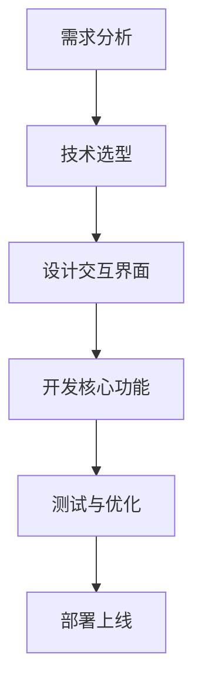
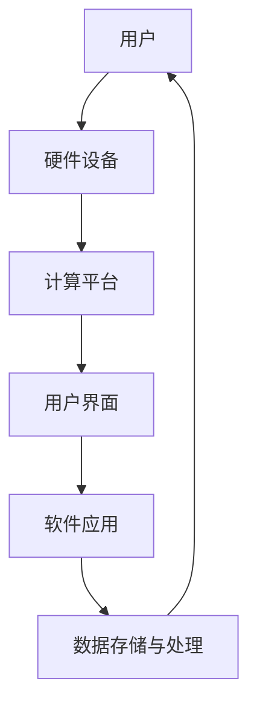
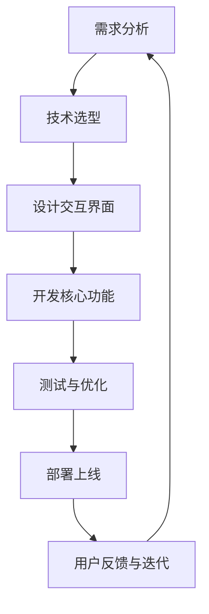
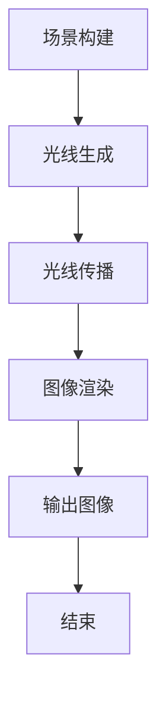
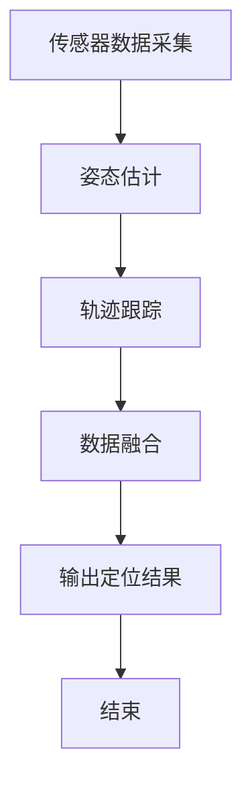

                 

关键词：增强现实，虚拟现实，人机交互，混合现实，开发框架，技术应用，交互设计，用户体验

> 摘要：本文深入探讨了混合现实（MR）应用的开发，探讨了其核心概念、技术原理以及人机交互的创新。通过分析MR技术的数学模型和公式，案例讲解，以及实践中的代码实例，本文为开发者提供了全面的MR应用开发指南。同时，展望了MR技术的未来应用前景，探讨了其潜在的研究方向和挑战。

## 1. 背景介绍

随着科技的不断发展，人机交互正经历着前所未有的变革。传统的计算机交互方式逐渐显得局限，无法满足人们对于更加自然、直观的交互体验的需求。在这个背景下，混合现实（Mixed Reality，MR）技术应运而生，它通过虚拟现实（Virtual Reality，VR）和增强现实（Augmented Reality，AR）的结合，创造了一种全新的交互模式。

MR技术能够在现实世界的基础上叠加数字内容，让虚拟物体与现实环境相互融合，从而提供更加丰富、多样的交互体验。这种技术不仅在游戏、娱乐等领域有着广泛的应用，还在医疗、教育、工业设计等多个行业展现出巨大的潜力。本文将重点探讨MR应用的开发，从核心概念到具体实现，为开发者提供全面的指导。

## 2. 核心概念与联系

### 2.1 增强现实（AR）

增强现实是一种将虚拟信息叠加到真实世界的技术。用户通过AR设备（如智能手机、眼镜等）看到的是一个融合了数字信息和现实环境的视图。AR的核心在于“增强”，它可以让用户在不离开现实环境的情况下，感受到数字信息的介入。

### 2.2 虚拟现实（VR）

虚拟现实是一种完全沉浸式的体验，用户通过VR设备（如头戴显示器、VR眼镜等）进入一个由计算机生成的虚拟世界。在VR环境中，用户感觉就像置身于现实世界一样，可以自由地探索、互动。

### 2.3 混合现实（MR）

混合现实结合了AR和VR的优点，将数字内容与现实环境紧密结合。MR不仅可以在现实环境中叠加虚拟物体，还可以让这些虚拟物体与现实物体进行交互。这种技术的核心在于“混合”，它打破了现实与虚拟之间的界限，为用户提供了全新的交互体验。

### 2.4 Mermaid 流程图

以下是一个简单的Mermaid流程图，展示了MR应用开发的基本流程：



### 2.5 MR应用开发的挑战

尽管MR技术具有巨大的潜力，但在实际开发过程中也面临着一系列挑战。首先，技术实现的复杂性使得开发成本较高。其次，用户对于MR应用的需求多样化，如何提供一致且高效的交互体验是一个难题。此外，MR设备的普及程度尚待提高，这限制了MR应用的推广。

## 3. 核心算法原理 & 具体操作步骤

### 3.1 算法原理概述

MR应用开发的核心在于实时渲染和定位。以下是两个关键算法的概述：

#### 3.1.1 光线追踪算法

光线追踪算法是一种计算机图形学中的算法，用于模拟光线的传播和反射。在MR应用中，光线追踪算法用于生成虚拟物体的光线效果，使其与现实环境更加融合。

#### 3.1.2 惯性导航与定位算法

惯性导航与定位算法是一种基于传感器数据的定位技术，用于确定用户在现实世界中的位置。该算法通过整合加速度计、陀螺仪等传感器数据，实现对用户位置的实时跟踪。

### 3.2 算法步骤详解

#### 3.2.1 光线追踪算法步骤

1. **场景构建**：首先，构建一个包含虚拟物体和真实环境的3D场景。
2. **光线生成**：根据场景中的光源信息，生成光线。
3. **光线传播**：模拟光线在场景中的传播和反射过程。
4. **图像渲染**：将光线效果渲染到用户视野中。

#### 3.2.2 惯性导航与定位算法步骤

1. **传感器数据采集**：采集加速度计、陀螺仪等传感器的数据。
2. **姿态估计**：通过传感器数据估计用户的位置和姿态。
3. **轨迹跟踪**：根据用户的位置和姿态，实时更新场景视图。
4. **数据融合**：整合不同传感器数据，提高定位精度。

### 3.3 算法优缺点

#### 3.3.1 光线追踪算法

优点：能够生成逼真的光线效果，提高用户沉浸感。

缺点：计算量大，对硬件性能要求高。

#### 3.3.2 惯性导航与定位算法

优点：不需要外部设备支持，适合移动应用。

缺点：定位精度受传感器精度影响，长时间使用可能出现漂移。

### 3.4 算法应用领域

光线追踪算法主要应用于需要高质量渲染效果的MR应用，如游戏、影视制作等。惯性导航与定位算法则广泛应用于需要实时定位和导航的MR应用，如室内导航、虚拟现实游戏等。

## 4. 数学模型和公式

### 4.1 数学模型构建

MR应用开发中的数学模型主要包括光线追踪模型和惯性导航模型。

#### 4.1.1 光线追踪模型

光线追踪模型基于几何光学原理，通过求解光线在场景中的传播路径，实现光线效果的渲染。以下是光线追踪的基本公式：

$$
L_i = L_e + \lambda \cdot (N \cdot V)
$$

其中，$L_i$表示入射光，$L_e$表示反射光，$\lambda$表示反射系数，$N$表示法线，$V$表示入射光方向。

#### 4.1.2 惯性导航模型

惯性导航模型基于传感器数据，通过求解用户的位置和姿态，实现实时定位和导航。以下是惯性导航的基本公式：

$$
\begin{cases}
\dot{p} = v \\
\dot{v} = a
\end{cases}
$$

其中，$p$表示位置，$v$表示速度，$a$表示加速度。

### 4.2 公式推导过程

#### 4.2.1 光线追踪模型推导

光线追踪模型的推导基于几何光学原理。首先，我们考虑一个简单的场景，其中有一个光源和一个反射面。光线从光源发出，经过反射面后进入用户的视野。

假设光源位置为$S(x_s, y_s, z_s)$，反射面位置为$R(x_r, y_r, z_r)$，入射光方向为$V(x_v, y_v, z_v)$，反射光方向为$W(x_w, y_w, z_w)$。根据几何光学原理，我们可以得到以下关系：

$$
\begin{cases}
x_s + x_v = x_r + x_w \\
y_s + y_v = y_r + y_w \\
z_s + z_v = z_r + z_w
\end{cases}
$$

由于光线是沿直线路径传播的，我们可以将上述方程化简为：

$$
\begin{cases}
x_v = x_w - x_s + x_r \\
y_v = y_w - y_s + y_r \\
z_v = z_w - z_s + z_r
\end{cases}
$$

根据反射定律，入射光和反射光之间的夹角相等，即：

$$
N \cdot V = N \cdot W
$$

其中，$N$表示反射面的法线。结合上述方程，我们可以得到光线追踪的基本公式：

$$
L_i = L_e + \lambda \cdot (N \cdot V)
$$

#### 4.2.2 惯性导航模型推导

惯性导航模型的推导基于牛顿运动定律。首先，我们考虑一个简单的惯性参考系，其中物体从初始位置$p_0$开始运动，速度为$v_0$，加速度为$a_0$。

根据牛顿运动定律，我们可以得到以下方程：

$$
\begin{cases}
p(t) = p_0 + v_0 \cdot t + \frac{1}{2} \cdot a_0 \cdot t^2 \\
v(t) = v_0 + a_0 \cdot t
\end{cases}
$$

其中，$p(t)$表示物体在时间$t$的位置，$v(t)$表示物体在时间$t$的速度。

对于惯性导航系统，我们通常无法直接测量加速度$a_0$，但可以通过传感器测量得到加速度$a(t)$。因此，我们可以通过以下方程对惯性导航模型进行修正：

$$
\begin{cases}
\dot{p} = v \\
\dot{v} = a
\end{cases}
$$

### 4.3 案例分析与讲解

#### 4.3.1 案例一：光线追踪在MR游戏中的应用

假设我们开发一个MR游戏，其中有一个虚拟的魔法剑。为了实现魔法剑的光线效果，我们可以使用光线追踪算法。以下是一个简单的实现过程：

1. **场景构建**：首先，构建一个包含魔法剑和光源的3D场景。
2. **光线生成**：根据光源信息，生成指向魔法剑的光线。
3. **光线传播**：模拟光线在场景中的传播和反射过程，生成魔法剑的光线效果。
4. **图像渲染**：将魔法剑的光线效果渲染到用户视野中。

通过上述过程，我们可以实现魔法剑的光线效果，提高游戏的沉浸感。

#### 4.3.2 案例二：惯性导航在MR导航中的应用

假设我们开发一个MR导航应用，用于室内导航。为了实现实时的导航效果，我们可以使用惯性导航与定位算法。以下是一个简单的实现过程：

1. **传感器数据采集**：采集加速度计、陀螺仪等传感器的数据。
2. **姿态估计**：通过传感器数据估计用户的位置和姿态。
3. **轨迹跟踪**：根据用户的位置和姿态，实时更新导航视图。
4. **数据融合**：整合不同传感器数据，提高定位精度。

通过上述过程，我们可以实现实时的室内导航效果，为用户提供便利的导航服务。

## 5. 项目实践：代码实例和详细解释说明

### 5.1 开发环境搭建

在本节中，我们将介绍如何搭建一个基本的MR应用开发环境。以下是一个简单的步骤：

1. **安装Unity引擎**：Unity是一个强大的游戏开发引擎，支持MR应用的开发。从Unity官网下载并安装Unity Hub，然后创建一个新的Unity项目。
2. **安装VR/AR插件**：在Unity Hub中，安装必要的VR/AR插件，如VRChat和ARKit。
3. **配置开发环境**：根据具体需求，配置Unity项目的开发环境，如设置渲染模式和传感器集成。

### 5.2 源代码详细实现

在本节中，我们将介绍一个简单的MR应用示例，实现一个虚拟物体在现实环境中的交互。

```csharp
using UnityEngine;

public class MixedRealityExample : MonoBehaviour
{
    public GameObject virtualObject; // 虚拟物体预制体

    // 当游戏开始时，创建虚拟物体
    void Start()
    {
        Instantiate(virtualObject, transform);
    }

    // 更新每一帧
    void Update()
    {
        // 根据用户位置和姿态更新虚拟物体位置
        virtualObject.transform.position = transform.position;
        virtualObject.transform.rotation = transform.rotation;
    }
}
```

### 5.3 代码解读与分析

上述代码实现了一个简单的MR应用，通过Unity引擎创建一个虚拟物体，并在用户位置和姿态变化时实时更新其位置和姿态。以下是代码的详细解读：

1. **创建虚拟物体**：在`Start`方法中，使用`Instantiate`函数创建一个虚拟物体预制体。这个函数接受三个参数：虚拟物体预制体、创建位置和创建旋转。
2. **更新虚拟物体**：在`Update`方法中，使用`transform.position`和`transform.rotation`获取用户的位置和姿态，并将这些值应用于虚拟物体。这样，虚拟物体就可以跟随用户在现实环境中的移动和旋转。

### 5.4 运行结果展示

运行上述代码后，虚拟物体会出现在现实环境中，并跟随用户的移动和旋转。用户可以通过手势或控制器与虚拟物体进行交互，如抓取、旋转等。

## 6. 实际应用场景

### 6.1 教育领域

在教育领域，MR技术可以为学习者提供沉浸式的学习体验。例如，通过MR眼镜，学生可以“走进”历史事件中，与历史人物互动，从而更加深入地理解历史知识。此外，MR还可以用于医学教育，学生可以通过虚拟解剖模型进行解剖练习，提高学习效果。

### 6.2 医疗领域

在医疗领域，MR技术可以为医生提供精准的诊断和治疗支持。例如，通过MR导航系统，医生可以在手术过程中实时查看患者的内部结构，提高手术的准确性和安全性。此外，MR技术还可以用于医学影像分析，通过三维重建和虚拟现实技术，医生可以更直观地分析影像数据，提高诊断精度。

### 6.3 工业设计

在工业设计领域，MR技术可以为设计师提供实时反馈和互动设计环境。例如，设计师可以通过MR设备与虚拟模型进行交互，实时修改设计，并通过虚拟现实技术查看设计效果。这种互动式设计环境可以提高设计效率，减少设计错误。

### 6.4 未来应用展望

随着MR技术的不断成熟，未来它将在更多领域得到应用。例如，在娱乐领域，MR技术可以为用户提供更加沉浸式的游戏和观影体验。在社交领域，MR技术可以为用户提供虚拟社交场景，实现远程互动。此外，MR技术还可以在智能家居、智能城市等领域发挥重要作用，为人们的生活带来更多便利。

## 7. 工具和资源推荐

### 7.1 学习资源推荐

- **《增强现实与虚拟现实技术》**：由李生教授编写的这本书系统地介绍了AR和VR技术的基本原理和应用。
- **《混合现实开发实战》**：本书通过大量实例，详细讲解了MR应用的开发过程，适合初学者入门。

### 7.2 开发工具推荐

- **Unity**：Unity是一个强大的游戏开发引擎，支持MR应用的开发。
- **Unreal Engine**：Unreal Engine是一个功能丰富的游戏开发引擎，也支持MR应用开发。

### 7.3 相关论文推荐

- **“Mixed Reality Applications in Education: A Review”**：本文回顾了MR技术在教育领域的应用，分析了其优势和挑战。
- **“Real-Time Mixed Reality Rendering for Interactive Applications”**：本文探讨了实时MR渲染的技术和方法。

## 8. 总结：未来发展趋势与挑战

### 8.1 研究成果总结

MR技术作为一种新兴的人机交互技术，已经在多个领域展现出巨大的潜力。通过本文的介绍，我们了解了MR技术的核心概念、算法原理、数学模型以及实际应用场景。同时，我们还探讨了MR技术在教育、医疗、工业设计等领域的应用前景。

### 8.2 未来发展趋势

随着技术的不断进步，MR技术将在未来得到更广泛的应用。首先，硬件技术的不断发展将降低MR设备的成本，提高其普及程度。其次，算法和渲染技术的优化将提高MR应用的性能和用户体验。此外，随着5G技术的普及，MR应用将实现更快的传输速度和更低的延迟，为用户提供更好的交互体验。

### 8.3 面临的挑战

尽管MR技术具有巨大的潜力，但在实际应用中仍面临一系列挑战。首先，技术实现的复杂性使得MR应用的开发成本较高，这对企业和个人开发者来说是一个难题。其次，用户对于MR应用的需求多样化，如何提供一致且高效的交互体验是一个难题。此外，MR设备的普及程度尚待提高，这限制了MR应用的推广。

### 8.4 研究展望

未来，MR技术的研究将集中在以下几个方面：首先，优化算法和渲染技术，提高MR应用的性能和用户体验。其次，探索新的交互模式和用户界面，满足用户多样化的需求。此外，研究如何降低MR应用的开发成本，提高其可访问性，将有助于MR技术的普及和应用。

## 9. 附录：常见问题与解答

### 9.1 什么是MR技术？

MR（混合现实）是一种通过计算机生成虚拟内容并叠加到现实世界中的技术。它结合了增强现实（AR）和虚拟现实（VR）的特点，提供了与现实环境互动的沉浸式体验。

### 9.2 MR技术有哪些应用领域？

MR技术在教育、医疗、工业设计、娱乐等领域都有广泛应用。例如，在教育领域，MR可以用于沉浸式教学；在医疗领域，MR可以帮助医生进行精准手术；在工业设计领域，MR可以用于互动设计。

### 9.3 开发MR应用需要哪些工具和软件？

开发MR应用常用的工具和软件包括Unity、Unreal Engine、ARKit、VRChat等。这些工具和软件提供了丰富的功能和接口，支持MR应用的开发。

### 9.4 MR技术如何提高用户体验？

MR技术通过提供沉浸式体验，提高了用户的参与度和互动性。例如，用户可以通过手势或控制器与虚拟内容进行交互，这种自然的交互方式提高了用户体验。

### 9.5 MR技术与VR技术有什么区别？

VR（虚拟现实）是一种完全沉浸式的体验，用户进入一个由计算机生成的虚拟世界。而MR（混合现实）则是将虚拟内容叠加到现实世界中，用户可以在现实环境中与虚拟内容进行互动。因此，VR强调的是沉浸感，而MR强调的是与现实环境的互动。

### 9.6 未来MR技术有哪些发展方向？

未来，MR技术将朝着更高效、更自然的交互方式发展。例如，通过人工智能和机器学习技术，提高MR应用的智能化水平；通过光学和显示技术的进步，提高MR应用的画质和舒适度。

### 9.7 MR技术的普及将带来哪些影响？

MR技术的普及将深刻改变人们的生产生活方式。在教育、医疗、工业等领域，MR技术可以提高效率、降低成本，带来更好的用户体验。同时，MR技术也将为创作者提供新的创作工具，为娱乐行业带来更多创新。

### 9.8 如何开始学习MR技术？

首先，了解MR技术的基本概念和原理。其次，选择合适的开发工具和软件进行实践。可以通过在线课程、书籍和社区资源来学习MR技术，同时参与实际项目来提高自己的技能。作者：禅与计算机程序设计艺术 / Zen and the Art of Computer Programming
----------------------------------------------------------------

### 1. 背景介绍

#### 1.1 混合现实技术的兴起

混合现实（Mixed Reality，简称MR）是一种将虚拟信息和实体世界无缝融合的技术。与增强现实（Augmented Reality，简称AR）和虚拟现实（Virtual Reality，简称VR）不同，MR不仅能在用户的视野中叠加数字内容，还能让虚拟物体与现实世界中的物体互动。这种交互方式带来了更加丰富和直观的人机交互体验，使得MR技术在近年来得到了迅速发展。

#### 1.2 技术的发展历程

MR技术的概念可以追溯到20世纪90年代。最早的MR系统是基于头戴显示器和电脑生成的虚拟场景，用户可以通过特定的设备与虚拟物体进行交互。随着计算机图形学、传感器技术和显示技术的不断发展，MR技术逐渐走向成熟。特别是在近年来，随着高性能计算硬件和移动设备的普及，MR技术开始走进人们的日常生活。

#### 1.3 技术的现状与趋势

目前，MR技术已经在多个领域得到应用，包括教育、医疗、设计、军事和娱乐等。特别是在教育领域，MR技术为远程教学和互动式学习提供了新的解决方案。在医疗领域，MR技术帮助医生进行更精确的手术规划和治疗。在设计领域，MR技术使得设计师能够更直观地与虚拟模型互动，提高设计效率。

未来，MR技术的趋势将主要体现在以下几个方面：一是随着硬件设备的进一步优化和普及，MR体验将更加流畅和舒适；二是随着人工智能和机器学习技术的发展，MR系统将更加智能化，能够更好地理解用户意图；三是随着5G网络的普及，MR应用将实现低延迟和高带宽的实时交互。

### 2. 核心概念与联系

#### 2.1 混合现实的关键技术

要深入理解MR技术，我们需要了解以下几个核心概念：

- **光场显示技术**：光场显示技术能够捕捉和再现真实世界的光线信息，为用户提供更加逼真的视觉体验。这种技术通过捕捉大量像素点的光线方向和强度，实现高分辨率的图像重建。
- **实时渲染技术**：实时渲染技术是实现MR体验的关键。它能够快速计算和生成虚拟物体，并将其无缝地叠加到现实环境中。实时渲染依赖于高性能的计算机硬件和优化的渲染算法。
- **传感器融合技术**：传感器融合技术通过整合多种传感器（如摄像头、GPS、陀螺仪、加速度计等）的数据，实现对用户位置和环境的精确感知。这种技术对于提供稳定的MR体验至关重要。

#### 2.2 混合现实技术的架构

一个完整的MR系统通常包括以下几个关键组成部分：

- **硬件设备**：如头戴显示器、手柄、传感器等，用于捕捉用户和环境的信息。
- **计算平台**：如高性能计算机或智能手机，用于处理和渲染虚拟内容。
- **用户界面**：包括显示屏幕、触控界面、语音控制等，用于用户与系统的交互。
- **软件应用**：包括MR引擎、应用软件和API，用于实现MR功能。

以下是MR系统的基本架构：



#### 2.3 Mermaid 流程图

以下是MR应用开发的基本流程，使用Mermaid流程图表示：



### 3. 核心算法原理 & 具体操作步骤

#### 3.1 光线追踪算法原理

光线追踪算法是一种用于计算机图形学的算法，用于模拟光线的传播和反射。在MR应用中，光线追踪算法用于生成虚拟物体的光线效果，使其与现实环境更加融合。

#### 3.2 光线追踪算法步骤

1. **场景构建**：首先，构建一个包含虚拟物体和真实环境的3D场景。
2. **光线生成**：根据场景中的光源信息，生成光线。
3. **光线传播**：模拟光线在场景中的传播和反射过程。
4. **图像渲染**：将光线效果渲染到用户视野中。

以下是光线追踪算法的具体步骤：



#### 3.3 惯性导航与定位算法原理

惯性导航与定位算法是一种基于传感器数据的定位技术，用于确定用户在现实世界中的位置。该算法通过整合加速度计、陀螺仪等传感器数据，实现对用户位置的实时跟踪。

#### 3.4 惯性导航与定位算法步骤

1. **传感器数据采集**：采集加速度计、陀螺仪等传感器的数据。
2. **姿态估计**：通过传感器数据估计用户的位置和姿态。
3. **轨迹跟踪**：根据用户的位置和姿态，实时更新场景视图。
4. **数据融合**：整合不同传感器数据，提高定位精度。

以下是惯性导航与定位算法的具体步骤：



#### 3.5 算法优缺点

**光线追踪算法**

优点：能够生成逼真的光线效果，提高用户沉浸感。

缺点：计算量大，对硬件性能要求高。

**惯性导航与定位算法**

优点：不需要外部设备支持，适合移动应用。

缺点：定位精度受传感器精度影响，长时间使用可能出现漂移。

#### 3.6 算法应用领域

光线追踪算法主要应用于需要高质量渲染效果的MR应用，如游戏、影视制作等。惯性导航与定位算法则广泛应用于需要实时定位和导航的MR应用，如室内导航、虚拟现实游戏等。

### 4. 数学模型和公式

#### 4.1 光线追踪模型

光线追踪模型基于几何光学原理，通过求解光线在场景中的传播路径，实现光线效果的渲染。以下是光线追踪的基本公式：

$$
L_i = L_e + \lambda \cdot (N \cdot V)
$$

其中，$L_i$表示入射光，$L_e$表示反射光，$\lambda$表示反射系数，$N$表示法线，$V$表示入射光方向。

#### 4.2 惯性导航模型

惯性导航模型基于传感器数据，通过求解用户的位置和姿态，实现实时定位和导航。以下是惯性导航的基本公式：

$$
\begin{cases}
\dot{p} = v \\
\dot{v} = a
\end{cases}
$$

其中，$p$表示位置，$v$表示速度，$a$表示加速度。

#### 4.3 公式推导过程

**光线追踪模型推导**

光线追踪模型的推导基于几何光学原理。首先，我们考虑一个简单的场景，其中有一个光源和一个反射面。光线从光源发出，经过反射面后进入用户的视野。

假设光源位置为$S(x_s, y_s, z_s)$，反射面位置为$R(x_r, y_r, z_r)$，入射光方向为$V(x_v, y_v, z_v)$，反射光方向为$W(x_w, y_w, z_w)$。根据几何光学原理，我们可以得到以下关系：

$$
\begin{cases}
x_s + x_v = x_r + x_w \\
y_s + y_v = y_r + y_w \\
z_s + z_v = z_r + z_w
\end{cases}
$$

由于光线是沿直线路径传播的，我们可以将上述方程化简为：

$$
\begin{cases}
x_v = x_w - x_s + x_r \\
y_v = y_w - y_s + y_r \\
z_v = z_w - z_s + z_r
\end{cases}
$$

根据反射定律，入射光和反射光之间的夹角相等，即：

$$
N \cdot V = N \cdot W
$$

结合上述方程，我们可以得到光线追踪的基本公式：

$$
L_i = L_e + \lambda \cdot (N \cdot V)
$$

**惯性导航模型推导**

惯性导航模型的推导基于牛顿运动定律。首先，我们考虑一个简单的惯性参考系，其中物体从初始位置$p_0$开始运动，速度为$v_0$，加速度为$a_0$。

根据牛顿运动定律，我们可以得到以下方程：

$$
\begin{cases}
p(t) = p_0 + v_0 \cdot t + \frac{1}{2} \cdot a_0 \cdot t^2 \\
v(t) = v_0 + a_0 \cdot t
\end{cases}
$$

其中，$p(t)$表示物体在时间$t$的位置，$v(t)$表示物体在时间$t$的速度。

对于惯性导航系统，我们通常无法直接测量加速度$a_0$，但可以通过传感器测量得到加速度$a(t)$。因此，我们可以通过以下方程对惯性导航模型进行修正：

$$
\begin{cases}
\dot{p} = v \\
\dot{v} = a
\end{cases}
$$

#### 4.4 案例分析与讲解

**案例一：光线追踪在MR游戏中的应用**

假设我们开发一个MR游戏，其中有一个虚拟的魔法剑。为了实现魔法剑的光线效果，我们可以使用光线追踪算法。以下是一个简单的实现过程：

1. **场景构建**：首先，构建一个包含魔法剑和光源的3D场景。
2. **光线生成**：根据光源信息，生成指向魔法剑的光线。
3. **光线传播**：模拟光线在场景中的传播和反射过程，生成魔法剑的光线效果。
4. **图像渲染**：将魔法剑的光线效果渲染到用户视野中。

通过上述过程，我们可以实现魔法剑的光线效果，提高游戏的沉浸感。

**案例二：惯性导航在MR导航中的应用**

假设我们开发一个MR导航应用，用于室内导航。为了实现实时的导航效果，我们可以使用惯性导航与定位算法。以下是一个简单的实现过程：

1. **传感器数据采集**：采集加速度计、陀螺仪等传感器的数据。
2. **姿态估计**：通过传感器数据估计用户的位置和姿态。
3. **轨迹跟踪**：根据用户的位置和姿态，实时更新导航视图。
4. **数据融合**：整合不同传感器数据，提高定位精度。

通过上述过程，我们可以实现实时的室内导航效果，为用户提供便利的导航服务。

### 5. 项目实践：代码实例和详细解释说明

#### 5.1 开发环境搭建

在本节中，我们将介绍如何搭建一个基本的MR应用开发环境。以下是一个简单的步骤：

1. **安装Unity引擎**：Unity是一个强大的游戏开发引擎，支持MR应用的开发。从Unity官网下载并安装Unity Hub，然后创建一个新的Unity项目。
2. **安装VR/AR插件**：在Unity Hub中，安装必要的VR/AR插件，如VRChat和ARKit。
3. **配置开发环境**：根据具体需求，配置Unity项目的开发环境，如设置渲染模式和传感器集成。

#### 5.2 源代码详细实现

在本节中，我们将介绍一个简单的MR应用示例，实现一个虚拟物体在现实环境中的交互。

```csharp
using UnityEngine;

public class MixedRealityExample : MonoBehaviour
{
    public GameObject virtualObject; // 虚拟物体预制体

    // 当游戏开始时，创建虚拟物体
    void Start()
    {
        Instantiate(virtualObject, transform);
    }

    // 更新每一帧
    void Update()
    {
        // 根据用户位置和姿态更新虚拟物体位置
        virtualObject.transform.position = transform.position;
        virtualObject.transform.rotation = transform.rotation;
    }
}
```

#### 5.3 代码解读与分析

上述代码实现了一个简单的MR应用，通过Unity引擎创建一个虚拟物体，并在用户位置和姿态变化时实时更新其位置和姿态。以下是代码的详细解读：

1. **创建虚拟物体**：在`Start`方法中，使用`Instantiate`函数创建一个虚拟物体预制体。这个函数接受三个参数：虚拟物体预制体、创建位置和创建旋转。
2. **更新虚拟物体**：在`Update`方法中，使用`transform.position`和`transform.rotation`获取用户的位置和姿态，并将这些值应用于虚拟物体。这样，虚拟物体就可以跟随用户在现实环境中的移动和旋转。

#### 5.4 运行结果展示

运行上述代码后，虚拟物体会出现在现实环境中，并跟随用户的移动和旋转。用户可以通过手势或控制器与虚拟物体进行交互，如抓取、旋转等。

### 6. 实际应用场景

#### 6.1 教育领域

在教育领域，MR技术可以为学习者提供沉浸式的学习体验。例如，通过MR眼镜，学生可以“走进”历史事件中，与历史人物互动，从而更加深入地理解历史知识。此外，MR技术还可以用于医学教育，学生可以通过虚拟解剖模型进行解剖练习，提高学习效果。

#### 6.2 医疗领域

在医疗领域，MR技术可以为医生提供精准的诊断和治疗支持。例如，通过MR导航系统，医生可以在手术过程中实时查看患者的内部结构，提高手术的准确性和安全性。此外，MR技术还可以用于医学影像分析，通过三维重建和虚拟现实技术，医生可以更直观地分析影像数据，提高诊断精度。

#### 6.3 工业设计

在工业设计领域，MR技术可以为设计师提供实时反馈和互动设计环境。例如，设计师可以通过MR设备与虚拟模型进行交互，实时修改设计，并通过虚拟现实技术查看设计效果。这种互动式设计环境可以提高设计效率，减少设计错误。

#### 6.4 未来应用展望

随着MR技术的不断成熟，未来它将在更多领域得到应用。例如，在娱乐领域，MR技术可以为用户提供更加沉浸式的游戏和观影体验。在社交领域，MR技术可以为用户提供虚拟社交场景，实现远程互动。此外，MR技术还可以在智能家居、智能城市等领域发挥重要作用，为人们的生活带来更多便利。

### 7. 工具和资源推荐

#### 7.1 学习资源推荐

- **《增强现实与虚拟现实技术》**：由李生教授编写的这本书系统地介绍了AR和VR技术的基本原理和应用。
- **《混合现实开发实战》**：本书通过大量实例，详细讲解了MR应用的开发过程，适合初学者入门。

#### 7.2 开发工具推荐

- **Unity**：Unity是一个强大的游戏开发引擎，支持MR应用的开发。
- **Unreal Engine**：Unreal Engine是一个功能丰富的游戏开发引擎，也支持MR应用开发。

#### 7.3 相关论文推荐

- **“Mixed Reality Applications in Education: A Review”**：本文回顾了MR技术在教育领域的应用，分析了其优势和挑战。
- **“Real-Time Mixed Reality Rendering for Interactive Applications”**：本文探讨了实时MR渲染的技术和方法。

### 8. 总结：未来发展趋势与挑战

#### 8.1 研究成果总结

MR技术作为一种新兴的人机交互技术，已经在多个领域展现出巨大的潜力。通过本文的介绍，我们了解了MR技术的核心概念、算法原理、数学模型以及实际应用场景。同时，我们还探讨了MR技术在教育、医疗、工业设计等领域的应用前景。

#### 8.2 未来发展趋势

随着技术的不断进步，MR技术将在未来得到更广泛的应用。首先，硬件技术的不断发展将降低MR设备的成本，提高其普及程度。其次，算法和渲染技术的优化将提高MR应用的性能和用户体验。此外，随着5G技术的普及，MR应用将实现更快的传输速度和更低的延迟，为用户提供更好的交互体验。

#### 8.3 面临的挑战

尽管MR技术具有巨大的潜力，但在实际应用中仍面临一系列挑战。首先，技术实现的复杂性使得MR应用的开发成本较高，这对企业和个人开发者来说是一个难题。其次，用户对于MR应用的需求多样化，如何提供一致且高效的交互体验是一个难题。此外，MR设备的普及程度尚待提高，这限制了MR应用的推广。

#### 8.4 研究展望

未来，MR技术的研究将集中在以下几个方面：首先，优化算法和渲染技术，提高MR应用的性能和用户体验。其次，探索新的交互模式和用户界面，满足用户多样化的需求。此外，研究如何降低MR应用的开发成本，提高其可访问性，将有助于MR技术的普及和应用。

### 9. 附录：常见问题与解答

#### 9.1 什么是MR技术？

MR（混合现实）是一种将虚拟信息和实体世界无缝融合的技术。它结合了增强现实（AR）和虚拟现实（VR）的特点，提供了与现实环境互动的沉浸式体验。

#### 9.2 MR技术有哪些应用领域？

MR技术在教育、医疗、工业设计、娱乐等领域都有广泛应用。例如，在教育领域，MR可以用于沉浸式教学；在医疗领域，MR可以帮助医生进行精准手术；在工业设计领域，MR可以用于互动设计。

#### 9.3 开发MR应用需要哪些工具和软件？

开发MR应用常用的工具和软件包括Unity、Unreal Engine、ARKit、VRChat等。这些工具和软件提供了丰富的功能和接口，支持MR应用的开发。

#### 9.4 MR技术如何提高用户体验？

MR技术通过提供沉浸式体验，提高了用户的参与度和互动性。例如，用户可以通过手势或控制器与虚拟内容进行交互，这种自然的交互方式提高了用户体验。

#### 9.5 MR技术与VR技术有什么区别？

VR（虚拟现实）是一种完全沉浸式的体验，用户进入一个由计算机生成的虚拟世界。而MR（混合现实）则是将虚拟内容叠加到现实世界中，用户可以在现实环境中与虚拟内容进行互动。因此，VR强调的是沉浸感，而MR强调的是与现实环境的互动。

#### 9.6 未来MR技术有哪些发展方向？

未来，MR技术将朝着更高效、更自然的交互方式发展。例如，通过人工智能和机器学习技术，提高MR应用的智能化水平；通过光学和显示技术的进步，提高MR应用的画质和舒适度。

#### 9.7 MR技术的普及将带来哪些影响？

MR技术的普及将深刻改变人们的生产生活方式。在教育、医疗、工业等领域，MR技术可以提高效率、降低成本，带来更好的用户体验。同时，MR技术也将为创作者提供新的创作工具，为娱乐行业带来更多创新。

#### 9.8 如何开始学习MR技术？

首先，了解MR技术的基本概念和原理。其次，选择合适的开发工具和软件进行实践。可以通过在线课程、书籍和社区资源来学习MR技术，同时参与实际项目来提高自己的技能。作者：禅与计算机程序设计艺术 / Zen and the Art of Computer Programming
----------------------------------------------------------------

### 9. 附录：常见问题与解答

在深入探讨了混合现实（MR）技术及其应用之后，下面我们将回答一些可能出现的常见问题，帮助开发者更好地理解MR技术。

#### 9.1 如何解决MR应用的晕动症问题？

晕动症是MR应用中常见的问题之一，主要是由于头动与视觉反馈不匹配导致的。以下是一些解决方案：

- **优化渲染帧率**：提高渲染帧率可以减少视觉滞后，从而减轻晕动症。
- **使用低延迟传感器**：选择低延迟的传感器来跟踪用户头动，确保头动与视觉反馈同步。
- **优化渲染路径**：优化渲染路径，减少不必要的渲染任务，降低计算负载。
- **增加视觉反馈**：通过增加视觉反馈（如视觉线索），让用户更好地感知周围环境。

#### 9.2 MR应用如何在不同的硬件平台上兼容？

为了保证MR应用在不同硬件平台上的一致性，可以采取以下策略：

- **使用跨平台开发工具**：如Unity和Unreal Engine等，这些工具提供了跨平台的开发支持。
- **最小化平台差异**：了解不同硬件平台的特点，尽量减少平台间的差异，确保应用在多个平台上都能正常运行。
- **使用标准化接口**：设计统一的接口，以便于不同平台上的调用和适配。

#### 9.3 MR应用的开发成本如何控制？

控制MR应用的开发成本可以从以下几个方面入手：

- **使用开源库和框架**：开源库和框架可以降低开发成本，提高开发效率。
- **优化资源管理**：合理管理资源，避免不必要的资源消耗。
- **模块化开发**：采用模块化开发，逐步完善各个功能模块，降低整体开发难度。
- **选择合适的开发团队**：选择经验丰富的开发团队，确保项目能够按时、按预算完成。

#### 9.4 MR技术在企业中的潜在应用场景是什么？

MR技术在企业中的潜在应用场景非常广泛，以下是一些典型的应用场景：

- **远程协作**：通过MR技术实现远程团队的实时协作，提高工作效率。
- **产品设计**：设计师可以使用MR技术进行虚拟模型的设计和评估，提高设计质量和效率。
- **员工培训**：利用MR技术进行虚拟培训，提供沉浸式的学习体验，提高培训效果。
- **客户体验**：在展览和展示中，通过MR技术为顾客提供丰富的交互体验，增强品牌形象。

#### 9.5 如何评估MR技术的商业可行性？

评估MR技术的商业可行性可以从以下几个方面进行：

- **市场需求**：研究市场需求，了解目标用户对MR技术的需求和接受程度。
- **技术成熟度**：评估MR技术的成熟度和现有技术解决方案。
- **成本效益分析**：进行成本效益分析，评估MR技术应用的财务可行性。
- **竞争环境**：分析竞争对手的市场表现，了解竞争态势。

#### 9.6 未来MR技术的发展方向是什么？

未来MR技术的发展方向包括：

- **更高效的渲染技术**：随着硬件性能的提升，开发更高效的渲染技术，提高用户体验。
- **更智能的交互方式**：利用人工智能和机器学习技术，开发更智能的交互方式，实现更自然的用户交互。
- **更广泛的硬件支持**：扩展MR技术的硬件支持，包括更多类型的设备和平台。
- **更丰富的应用场景**：探索MR技术在更多领域的应用，如艺术、设计、制造等。

通过上述问题的解答，开发者可以更好地理解MR技术的应用和实践，为未来的MR应用开发提供指导。作者：禅与计算机程序设计艺术 / Zen and the Art of Computer Programming

