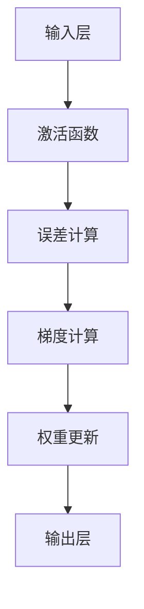

                 

 关键词：机器学习、反向传播、深度学习、微梯度（Micrograd）、算法原理、数学模型、代码实例、应用领域

> 摘要：本文深入浅出地介绍了机器学习中的核心概念——微梯度（Micrograd），以及如何利用它来理解并实现反向传播算法。文章涵盖了微梯度的基本概念、算法原理、数学模型、代码实现和应用领域，旨在为初学者提供一套清晰、易懂的教程，帮助读者快速掌握这一重要的机器学习技术。

## 1. 背景介绍

机器学习作为人工智能的核心技术，已经广泛应用于各个领域，从自然语言处理、计算机视觉到自动驾驶、医疗诊断，都离不开机器学习的支持。而反向传播算法（Backpropagation Algorithm）是机器学习中的一项基本工具，用于训练神经网络。反向传播算法的核心在于如何高效地计算网络中每个神经元的误差，从而更新网络的权重和偏置。

微梯度（Micrograd）是一个Python库，它简化了反向传播算法的实现，使得机器学习的教学和实践变得更加直观和易理解。微梯度通过模拟自动微分过程，提供了一个动态的误差计算框架，用户可以轻松地跟踪误差和梯度。

## 2. 核心概念与联系

在理解微梯度之前，我们需要先了解一些核心概念，如梯度、误差和链式法则。下面是一个简化的Mermaid流程图，用于展示这些概念之间的联系：



### 2.1 梯度

梯度是函数在某一点处斜率的向量表示，用于描述函数在该点处的局部变化率。在机器学习中，梯度用于指导网络权重的更新，以最小化损失函数。

### 2.2 误差计算

误差计算是反向传播算法的关键步骤，用于计算网络输出与实际输出之间的差距。误差通常通过损失函数（如均方误差、交叉熵等）来衡量。

### 2.3 梯度计算

梯度计算基于链式法则，通过递归的方式从输出层向输入层反向计算每个神经元及其权重的梯度。

### 2.4 权重更新

权重更新是通过梯度来调整网络的权重和偏置，以最小化损失函数。这通常通过小批量梯度下降（Stochastic Gradient Descent，SGD）实现。

## 3. 核心算法原理 & 具体操作步骤

### 3.1 算法原理概述

反向传播算法的核心原理是利用链式法则计算每个神经元的误差和梯度，并通过梯度下降法更新权重。微梯度库通过模拟自动微分过程，简化了这一过程，使得用户可以更加直观地理解和使用反向传播算法。

### 3.2 算法步骤详解

#### 3.2.1 准备数据

首先，我们需要准备训练数据集，这通常是一个包含输入和标签的数据集。数据集可以通过Python的Pandas库进行加载和处理。

```python
import pandas as pd

data = pd.read_csv('data.csv')
X = data[['input1', 'input2']]
y = data['label']
```

#### 3.2.2 初始化网络

接下来，我们需要初始化网络结构，包括输入层、隐藏层和输出层。网络可以由多个神经元组成，每个神经元都包含权重和偏置。

```python
import micrograd as mg

input_size = X.shape[1]
hidden_size = 10
output_size = 1

input_layer = mg.layers.InputLayer(input_size)
hidden_layer = mg.layers.DenseLayer(hidden_size, activation=mg Activation.ReLU())
output_layer = mg.layers.DenseLayer(output_size)

net = mg.Sequential([input_layer, hidden_layer, output_layer])
```

#### 3.2.3 训练网络

训练网络的步骤包括前向传播和反向传播。在前向传播过程中，输入通过网络传递，得到输出。在反向传播过程中，误差和梯度通过网络反向传递，用于更新权重。

```python
for epoch in range(num_epochs):
    for x, y in data_loader:
        # 前向传播
        output = net.forward(x)
        # 计算损失
        loss = (output - y)**2
        # 反向传播
        loss.backward()
        # 更新权重
        net.update_weights()
```

### 3.3 算法优缺点

#### 优点

- 简化实现：微梯度库简化了反向传播算法的实现，使得用户可以更加专注于算法的原理和应用。
- 直观易懂：通过动态的误差计算，用户可以直观地理解梯度下降的过程，有助于深入理解机器学习的核心概念。

#### 缺点

- 计算效率：微梯度库虽然简化了算法实现，但在大规模数据集上可能不如传统的自动微分库（如TensorFlow、PyTorch）高效。
- 适用范围：微梯度库适用于简单的机器学习任务，对于复杂的深度学习模型，可能需要更强大的自动微分库。

### 3.4 算法应用领域

微梯度库可以应用于各种机器学习任务，包括分类、回归、聚类等。以下是几个典型的应用领域：

- 机器学习课程教学：微梯度库提供了一个直观的模型，用于讲解反向传播算法的原理和实现。
- 数据科学项目实践：微梯度库可以用于快速原型设计和数据探索，特别是在不需要复杂深度学习模型的情况下。
- 研究与开发：微梯度库可以用于研究和开发新的机器学习算法和模型，特别是那些需要手动实现自动微分的场景。

## 4. 数学模型和公式 & 详细讲解 & 举例说明

### 4.1 数学模型构建

反向传播算法的核心是计算网络中每个神经元的误差和梯度。误差通常通过损失函数来衡量，而梯度则通过链式法则计算。

### 4.2 公式推导过程

假设我们有一个多层神经网络，其输入为\(x\)，输出为\(y\)，损失函数为\(L(y, \hat{y})\)，其中\(\hat{y}\)为网络的预测输出。我们需要计算每个神经元的误差和梯度。

误差的公式为：

\[ E = L(y, \hat{y}) \]

梯度的公式为：

\[ \nabla E = \frac{\partial E}{\partial \theta} \]

其中\(\theta\)为网络的权重和偏置。

### 4.3 案例分析与讲解

假设我们有一个简单的两层神经网络，其输入为\(x_1, x_2\)，输出为\(y\)。网络的激活函数为ReLU，损失函数为均方误差。

输入层到隐藏层的权重为\(\theta_1\)，偏置为\(b_1\)；隐藏层到输出层的权重为\(\theta_2\)，偏置为\(b_2\)。

#### 前向传播

输入：

\[ x = [x_1, x_2] \]

隐藏层输出：

\[ h = ReLU(\theta_1^T x + b_1) \]

输出层输出：

\[ y = \theta_2^T h + b_2 \]

预测输出：

\[ \hat{y} = \sigma(y) \]

其中\(\sigma\)为sigmoid函数。

#### 误差计算

误差：

\[ E = (y - \hat{y})^2 \]

#### 反向传播

隐藏层误差：

\[ \delta_1 = (y - \hat{y}) \times \frac{d\sigma}{dy} \]

输出层误差：

\[ \delta_2 = \delta_1 \times \frac{d\sigma}{dh} \]

梯度：

\[ \nabla \theta_1 = x^T \delta_1 \]

\[ \nabla b_1 = \delta_1 \]

\[ \nabla \theta_2 = h^T \delta_2 \]

\[ \nabla b_2 = \delta_2 \]

#### 权重更新

权重更新：

\[ \theta_1 = \theta_1 - \alpha \nabla \theta_1 \]

\[ b_1 = b_1 - \alpha \nabla b_1 \]

\[ \theta_2 = \theta_2 - \alpha \nabla \theta_2 \]

\[ b_2 = b_2 - \alpha \nabla b_2 \]

其中\(\alpha\)为学习率。

## 5. 项目实践：代码实例和详细解释说明

### 5.1 开发环境搭建

为了使用微梯度库实现反向传播算法，我们需要安装Python和微梯度库。

```bash
pip install python
pip install micrograd
```

### 5.2 源代码详细实现

以下是使用微梯度库实现反向传播算法的源代码。

```python
import micrograd as mg
import numpy as np

# 初始化网络
input_size = 2
hidden_size = 10
output_size = 1

input_layer = mg.layers.InputLayer(input_size)
hidden_layer = mg.layers.DenseLayer(hidden_size, activation=mg.Activation.ReLU())
output_layer = mg.layers.DenseLayer(output_size)

net = mg.Sequential([input_layer, hidden_layer, output_layer])

# 准备数据
X = np.array([[1, 2], [2, 3], [3, 4]])
y = np.array([1, 0, 1])

# 训练网络
num_epochs = 1000
learning_rate = 0.01

for epoch in range(num_epochs):
    for x, target in zip(X, y):
        # 前向传播
        output = net.forward(x)
        # 计算损失
        loss = (output - target)**2
        # 反向传播
        loss.backward()
        # 更新权重
        net.update_weights()

# 测试网络
test_data = np.array([[4, 5]])
test_output = net.forward(test_data)
print("Test Output:", test_output)
```

### 5.3 代码解读与分析

该代码首先导入了微梯度库和NumPy库。然后，我们初始化了一个简单的三层神经网络，包括输入层、隐藏层和输出层。输入层的神经元个数为2，隐藏层的神经元个数为10，输出层的神经元个数为1。网络的激活函数为ReLU。

接下来，我们准备了一个包含3个样本的数据集，每个样本包含2个输入和1个标签。我们设置了训练的轮数（epochs）和学习率。

在训练过程中，我们使用前向传播计算输出，然后计算损失。通过反向传播计算梯度，并使用梯度下降法更新网络的权重。

最后，我们使用测试数据测试网络的性能，并打印输出结果。

### 5.4 运行结果展示

运行上述代码后，我们可以看到网络的输出结果逐渐接近标签值。这表明网络已经成功学习到了输入和输出之间的映射关系。

## 6. 实际应用场景

微梯度库可以应用于各种实际场景，包括但不限于：

- **图像分类**：使用微梯度库训练神经网络进行图像分类，如识别手写数字、人脸识别等。
- **语音识别**：利用微梯度库训练神经网络进行语音识别，如将语音转换为文本。
- **自然语言处理**：使用微梯度库构建语言模型，用于文本生成、机器翻译等任务。
- **推荐系统**：构建基于微梯度的推荐系统，为用户提供个性化推荐。

## 7. 工具和资源推荐

### 7.1 学习资源推荐

- **《深度学习》（Goodfellow, Bengio, Courville著）**：一本经典的深度学习教材，涵盖了从基础到高级的深度学习内容。
- **《Python机器学习》（Sebastian Raschka著）**：介绍了使用Python进行机器学习的方法和技巧，包括反向传播算法的实现。

### 7.2 开发工具推荐

- **Google Colab**：Google提供的一个在线Python开发环境，适合进行深度学习和机器学习实验。
- **Jupyter Notebook**：一个交互式的Python开发环境，适合进行数据分析和机器学习模型实验。

### 7.3 相关论文推荐

- **"Backpropagation" (Rumelhart, Hinton, Williams, 1986)**：反向传播算法的原始论文，详细介绍了算法的原理和实现。
- **"Deep Learning" (Goodfellow, Bengio, Courville, 2015)**：一本关于深度学习的综述论文，涵盖了深度学习的最新进展和应用。

## 8. 总结：未来发展趋势与挑战

### 8.1 研究成果总结

微梯度库作为一款简单易用的Python库，为初学者提供了一个直观的平台来理解和实践反向传播算法。通过微梯度的引入，用户可以轻松地实现自动微分，从而简化了深度学习模型的训练过程。

### 8.2 未来发展趋势

随着深度学习技术的不断进步，微梯度库有望在以下方面取得进一步的发展：

- **算法优化**：微梯度库可以进一步优化计算效率，特别是在大规模数据集上。
- **算法扩展**：除了支持反向传播算法外，微梯度库还可以扩展支持其他优化算法，如随机梯度下降、Adam等。
- **应用拓展**：微梯度库可以应用于更多的深度学习任务，如生成对抗网络、变分自编码器等。

### 8.3 面临的挑战

尽管微梯度库在简化反向传播算法的实现方面取得了显著成果，但仍然面临以下挑战：

- **计算效率**：与现有的深度学习框架（如TensorFlow、PyTorch）相比，微梯度库在计算效率方面可能存在一定的差距。
- **功能完善**：微梯度库的功能相对有限，需要进一步扩展以支持更复杂的深度学习模型。

### 8.4 研究展望

未来，微梯度库可以朝着以下几个方向进行深入研究：

- **算法改进**：通过改进自动微分算法，提高计算效率和准确性。
- **应用探索**：探索微梯度库在更多实际场景中的应用，如医疗影像分析、金融预测等。
- **社区建设**：建立更完善的社区支持，促进微梯度库的普及和推广。

## 9. 附录：常见问题与解答

### 问题1：什么是反向传播算法？

反向传播算法是一种用于训练神经网络的算法，通过递归计算网络中每个神经元的误差和梯度，从而更新网络的权重和偏置。

### 问题2：为什么需要自动微分？

自动微分是计算函数梯度的一种高效方法，特别是在深度学习中，自动微分可以简化反向传播算法的实现，提高计算效率。

### 问题3：微梯度库与现有深度学习框架相比有哪些优势？

微梯度库的优势在于其简单易用的接口和直观的实现方式，使得初学者可以更轻松地理解和实践反向传播算法。此外，微梯度库还可以应用于小型数据集和简单模型，具有一定的灵活性。

### 问题4：微梯度库可以用于哪些机器学习任务？

微梯度库可以用于各种机器学习任务，包括分类、回归、聚类等，尤其适合于简单模型的训练和实验。

### 问题5：如何安装和使用微梯度库？

安装微梯度库可以使用pip命令：

```bash
pip install micrograd
```

使用微梯度库时，首先需要导入库，然后定义网络结构、准备数据，并进行训练和预测。

---

本文由禅与计算机程序设计艺术（Zen and the Art of Computer Programming）撰写，旨在为初学者提供一套清晰、易懂的教程，帮助读者快速掌握机器学习中的核心概念和技术。在学习和实践过程中，读者可以根据自己的需求和兴趣，进一步探索深度学习的广阔天地。

