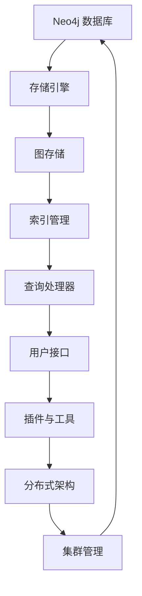
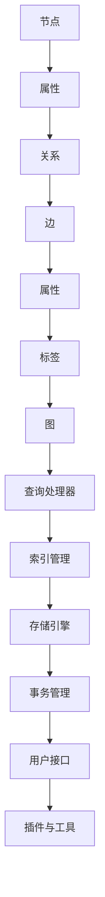
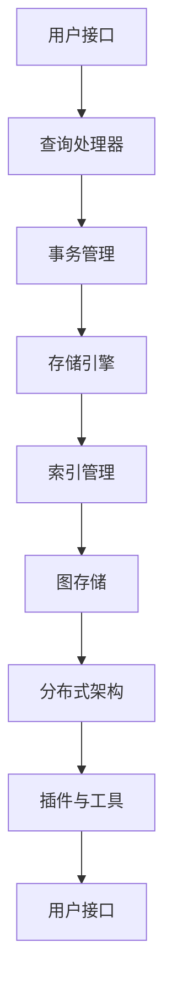

                 

在当今的信息时代，数据已成为驱动企业决策和运营的核心资产。随着数据量的激增和复杂性的增加，传统的数据库管理系统（DBMS）面临着诸多挑战。图数据库作为一种新型的数据库技术，以其强大的图结构数据存储和处理能力，正在逐渐受到业界的广泛关注。Neo4j，作为当前最流行的图数据库之一，其独特的图遍历算法和高效的图查询语言Cypher，使得它在复杂关系网络的构建和分析中表现出了卓越的性能。

本文旨在深入探讨Neo4j的原理，并通过代码实例来详细解释其使用方法。我们将从Neo4j的基本概念和架构开始，逐步介绍其核心算法原理、数学模型以及实际应用案例。希望通过本文的阅读，读者能够对Neo4j有一个全面而深入的理解，并能将其应用于实际项目中。

本文的结构如下：

1. **背景介绍**：介绍图数据库的发展背景和Neo4j的兴起原因。
2. **核心概念与联系**：讲解Neo4j中的关键概念，并通过Mermaid流程图展示其架构。
3. **核心算法原理 & 具体操作步骤**：详细剖析Neo4j的核心算法和操作步骤。
4. **数学模型和公式 & 详细讲解 & 举例说明**：阐述Neo4j的数学模型和公式，并结合实例进行说明。
5. **项目实践：代码实例和详细解释说明**：通过一个具体的代码实例，展示Neo4j的实践应用。
6. **实际应用场景**：讨论Neo4j在不同场景中的应用。
7. **未来应用展望**：展望Neo4j未来的发展与应用。
8. **工具和资源推荐**：推荐学习资源、开发工具和相关论文。
9. **总结：未来发展趋势与挑战**：总结研究成果，探讨未来趋势和面临的挑战。
10. **附录：常见问题与解答**：解答读者可能遇到的问题。

让我们开始这次关于Neo4j的深度探索之旅。

## 1. 背景介绍

### 图数据库的发展

随着互联网的普及和数据规模的爆炸性增长，传统的基于关系型数据库的管理系统逐渐暴露出其局限性。关系型数据库擅长处理结构化数据，但在面对复杂的网络关系时，往往显得力不从心。这使得研究者开始探索新的数据库技术——图数据库。

图数据库以图论为基础，将数据表示为节点（实体）和边（关系）的集合，通过节点和边之间的关系进行数据的存储和查询。这种数据模型非常适合处理社交网络、推荐系统、生物信息学、交通网络等领域中的复杂关系。

Neo4j作为图数据库的先驱之一，于2007年由Emil Eifrem和Amy Herrmann创立。Neo4j以图论为基础，通过高效的图遍历算法和Cypher查询语言，实现了对大规模复杂网络的快速查询和处理。自问世以来，Neo4j凭借其高性能和易用性，在业界获得了广泛的认可和应用。

### Neo4j的兴起原因

Neo4j之所以能够迅速崛起，主要有以下几个原因：

1. **高效的图遍历算法**：Neo4j采用了高效的图遍历算法，如深度优先搜索（DFS）和广度优先搜索（BFS），能够在极短时间内完成复杂的图查询。
2. **Cypher查询语言**：Cypher是一种声明式图查询语言，具有类似SQL的易用性，但更适用于图结构的查询。它能够以简明易懂的语法表达复杂的图遍历和关联查询。
3. **灵活的节点和边属性**：Neo4j支持在节点和边上存储任意类型的属性，这使得模型更加灵活，能够更好地适应不同的应用场景。
4. **分布式架构**：Neo4j支持分布式架构，能够通过集群模式处理大规模数据，提高系统的扩展性和可用性。

### 本文内容安排

本文将首先介绍Neo4j的基本概念和架构，然后深入探讨其核心算法原理和具体操作步骤。接着，我们将详细讲解Neo4j的数学模型和公式，并通过实例进行说明。随后，我们将通过一个具体的代码实例，展示Neo4j在实践中的应用。最后，本文将讨论Neo4j的实际应用场景，展望其未来的发展与应用。

### Mermaid流程图

以下是一个简化的Neo4j架构的Mermaid流程图：

这个流程图展示了Neo4j的核心组件及其相互关系。在接下来的章节中，我们将逐一介绍这些组件的工作原理。

## 2. 核心概念与联系

在深入理解Neo4j之前，我们需要先掌握其核心概念。Neo4j是一种基于图论的数据库，因此节点（Node）和边（Relationship）是理解Neo4j的关键。

### 节点（Node）

节点是Neo4j中的基本数据单元，类似于关系型数据库中的行。节点可以表示任何实体，如人、产品、地点等。每个节点都有一个唯一的标识符，通常称为节点ID。节点可以具有一个或多个属性，这些属性可以用来描述节点的特征。例如，一个表示人的节点可能有姓名、年龄、性别等属性。

### 边（Relationship）

边是节点之间的关系，用于表示实体之间的联系。边也有方向性，可以是从一个节点指向另一个节点，也可以是从另一个节点指向这个节点。边同样可以具有属性，这些属性描述了边的关系特征。例如，在一个社交网络中，两个用户之间可以有“朋友”关系，这个关系的属性可能包括相识的时间、共同兴趣等。

### 核心概念联系

在Neo4j中，节点和边构成了一个图结构。每个节点通过边与其他节点相连，形成了一个复杂的网络。以下是一个简化的Mermaid流程图，展示了Neo4j中的核心概念及其相互关系：

### Neo4j的架构

Neo4j的架构可以看作是一个分层系统，每一层都为其上层提供服务。以下是一个简化的Neo4j架构图，通过Mermaid表示：

#### 用户接口（A）

用户接口层是Neo4j与用户交互的界面，包括命令行界面、图形界面（如Neo4j Browser）以及API接口。用户可以通过这些接口执行各种操作，如创建节点、添加边、查询数据等。

#### 查询处理器（B）

查询处理器层负责处理用户输入的Cypher查询语句，将其解析并转换为底层存储引擎能够理解的操作。查询处理器还包括了优化器，用于优化查询性能。

#### 事务管理（C）

事务管理层确保了Neo4j中的数据操作是原子性的，即要么全部成功，要么全部失败。它负责维护数据的一致性，保证系统在并发操作下的稳定性。

#### 存储引擎（D）

存储引擎层负责数据的持久化存储。Neo4j使用了一种称为Nativ

