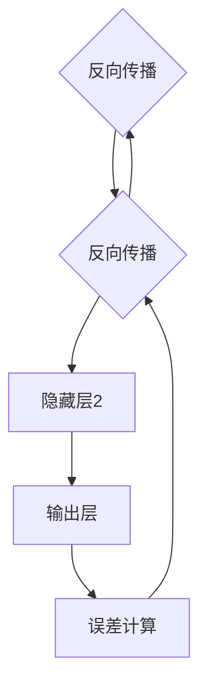
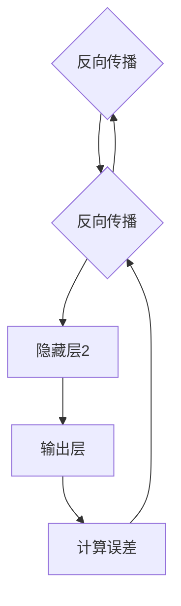

                 

在过去的几十年里，神经网络（Neural Networks）已经成为机器学习和人工智能领域中最热门和最重要的技术之一。从简单的感知器（Perceptrons）到复杂的深度学习模型，神经网络的发展极大地推动了人工智能的发展进程。本文将深入探讨神经网络的基本原理、关键概念、核心算法以及实际应用，并借助代码实例进行详细讲解。

## 关键词
- 神经网络
- 机器学习
- 深度学习
- 感知器
- 前馈神经网络
- 反向传播算法

## 摘要
本文将系统地介绍神经网络的基础知识和实践应用。首先，我们将回顾神经网络的历史和发展。接着，深入讲解神经网络的构成、工作原理以及主要算法，如前馈神经网络和反向传播算法。随后，我们将展示神经网络在计算机视觉、自然语言处理等领域的应用实例。最后，我们将讨论神经网络未来的发展趋势和面临的挑战。

## 1. 背景介绍

### 1.1 神经网络的历史和发展

神经网络的概念最早可以追溯到1943年，由心理学家沃伦·麦卡洛克（Warren McCulloch）和数理逻辑学家沃尔特·皮茨（Walter Pitts）提出。他们的研究奠定了人工神经网络的理论基础。然而，由于计算能力的限制，早期的神经网络模型并没有得到广泛的应用。

20世纪80年代，随着计算机技术的飞速发展，神经网络的研究逐渐复苏。1986年，霍普field（John Hopfield）提出了霍普field神经网络，为神经网络的研究注入了新的活力。随后，鲁姆哈特（David E. Rumelhart）、赫布尔德（George E. Hinton）和威廉姆斯（Rajesh A. Williams）在1986年提出了反向传播算法（Backpropagation Algorithm），这一算法极大地提高了神经网络训练的效率和效果。

进入21世纪，随着大数据和计算能力的进一步提升，神经网络，尤其是深度神经网络（Deep Neural Networks），在图像识别、语音识别、自然语言处理等领域取得了显著的应用成果。

### 1.2 神经网络的基本概念

神经网络是一种模仿生物神经系统的计算模型，由大量的神经元（或节点）组成。每个神经元都可以接收多个输入信号，通过权重进行加权求和，然后通过激活函数进行非线性转换，最终输出结果。

神经元的基本结构包括：

- 输入层：接收外部输入。
- 隐藏层：对输入进行加工处理。
- 输出层：产生最终的输出结果。

神经网络可以通过不断调整权重和偏置来优化模型性能，以达到预测或分类的目的。

## 2. 核心概念与联系

### 2.1 神经网络的构成

神经网络的构成可以分为以下几个部分：

1. **输入层（Input Layer）**：接收外部输入数据，如像素值、文本序列等。
2. **隐藏层（Hidden Layers）**：对输入数据进行加工处理，每个神经元都会接收来自前一层所有神经元的输入。
3. **输出层（Output Layer）**：产生最终的输出结果，如分类标签、预测值等。

### 2.2 神经网络的工作原理

神经网络的工作原理可以概括为以下几个步骤：

1. **前向传播（Forward Propagation）**：输入数据经过神经网络，从输入层流向隐藏层，再从隐藏层流向输出层。
2. **激活函数（Activation Function）**：在每个神经元中，通过激活函数将加权求和的结果转换为输出。
3. **反向传播（Backpropagation）**：根据输出层的误差，反向传播误差到隐藏层和输入层，不断调整权重和偏置，以减小误差。

### 2.3 Mermaid 流程图



## 3. 核心算法原理 & 具体操作步骤

### 3.1 算法原理概述

神经网络的核心算法包括前向传播和反向传播。

- **前向传播**：输入数据经过神经网络，从输入层流向隐藏层，再从隐藏层流向输出层，最终得到预测结果。
- **反向传播**：根据输出层的预测结果和实际结果之间的误差，反向传播误差到隐藏层和输入层，通过梯度下降法调整权重和偏置，以优化模型性能。

### 3.2 算法步骤详解

#### 前向传播

1. **初始化权重和偏置**：随机初始化网络的权重和偏置。
2. **输入数据**：将输入数据送入输入层。
3. **加权求和**：在每个神经元中，将输入数据与权重相乘并求和。
4. **激活函数**：对加权求和的结果应用激活函数，如ReLU、Sigmoid、Tanh等。
5. **输出结果**：将输出层的输出作为预测结果。

#### 反向传播

1. **计算误差**：将输出层的预测结果与实际结果进行比较，计算误差。
2. **梯度计算**：计算每个权重和偏置的梯度，即误差对权重的偏导数。
3. **权重更新**：使用梯度下降法更新权重和偏置，以减小误差。

### 3.3 算法优缺点

#### 优点

- **强大的非线性变换能力**：通过多层神经网络，可以处理复杂非线性问题。
- **自适应性和泛化能力**：神经网络可以通过学习大量数据来自适应地调整权重，具有良好的泛化能力。
- **广泛应用**：神经网络在图像识别、语音识别、自然语言处理等领域取得了显著的应用成果。

#### 缺点

- **训练时间较长**：神经网络训练时间较长，特别是深度神经网络，需要大量计算资源。
- **过拟合风险**：神经网络容易过拟合，需要大量数据和适当的数据预处理来避免。

### 3.4 算法应用领域

神经网络在以下领域取得了广泛应用：

- **计算机视觉**：图像分类、目标检测、图像分割等。
- **自然语言处理**：文本分类、情感分析、机器翻译等。
- **语音识别**：语音信号处理、语音合成等。
- **推荐系统**：个性化推荐、协同过滤等。

## 4. 数学模型和公式 & 详细讲解 & 举例说明

### 4.1 数学模型构建

神经网络的数学模型可以描述为：

\[ y = \sigma(Wx + b) \]

其中，\( y \) 是输出结果，\( x \) 是输入数据，\( W \) 是权重矩阵，\( b \) 是偏置向量，\( \sigma \) 是激活函数。

### 4.2 公式推导过程

#### 前向传播

1. **加权求和**：

\[ z = Wx + b \]

2. **激活函数**：

\[ a = \sigma(z) \]

其中，\( \sigma \) 是激活函数，常见的激活函数有ReLU、Sigmoid、Tanh等。

#### 反向传播

1. **计算误差**：

\[ \delta = \frac{\partial C}{\partial z} \]

其中，\( \delta \) 是误差梯度，\( C \) 是损失函数。

2. **权重更新**：

\[ W = W - \alpha \frac{\partial C}{\partial W} \]

\[ b = b - \alpha \frac{\partial C}{\partial b} \]

其中，\( \alpha \) 是学习率。

### 4.3 案例分析与讲解

#### 案例一：二分类问题

假设我们有一个二分类问题，输入数据是一个二维向量 \( x \)，目标标签是 \( y \)，其中 \( y \) 可以是0或1。我们使用一个简单的单层神经网络进行分类。

1. **初始化权重和偏置**：

\[ W \sim \mathcal{N}(0, 1) \]
\[ b \sim \mathcal{N}(0, 1) \]

2. **前向传播**：

\[ z = Wx + b \]
\[ a = \sigma(z) \]

3. **计算误差**：

\[ C = -y \log(a) - (1 - y) \log(1 - a) \]

4. **反向传播**：

\[ \delta = a - y \]

5. **权重更新**：

\[ W = W - \alpha \frac{\partial C}{\partial W} \]
\[ b = b - \alpha \frac{\partial C}{\partial b} \]

#### 案例二：多分类问题

假设我们有一个多分类问题，输入数据是一个二维向量 \( x \)，目标标签是一个一维向量 \( y \)，其中 \( y \) 可以是0或1。我们使用一个简单的多层神经网络进行分类。

1. **初始化权重和偏置**：

\[ W_1 \sim \mathcal{N}(0, 1) \]
\[ b_1 \sim \mathcal{N}(0, 1) \]
\[ W_2 \sim \mathcal{N}(0, 1) \]
\[ b_2 \sim \mathcal{N}(0, 1) \]

2. **前向传播**：

\[ z_1 = W_1x + b_1 \]
\[ a_1 = \sigma(z_1) \]
\[ z_2 = W_2a_1 + b_2 \]
\[ a_2 = \sigma(z_2) \]

3. **计算误差**：

\[ C = -y \log(a_2) \]

4. **反向传播**：

\[ \delta_2 = a_2 - y \]
\[ \delta_1 = a_1 \odot (\sigma'(z_1) \odot W_2\delta_2) \]

5. **权重更新**：

\[ W_1 = W_1 - \alpha \frac{\partial C}{\partial W_1} \]
\[ b_1 = b_1 - \alpha \frac{\partial C}{\partial b_1} \]
\[ W_2 = W_2 - \alpha \frac{\partial C}{\partial W_2} \]
\[ b_2 = b_2 - \alpha \frac{\partial C}{\partial b_2} \]

## 5. 项目实践：代码实例和详细解释说明

### 5.1 开发环境搭建

首先，我们需要搭建一个开发环境，用于编写和运行神经网络代码。以下是使用Python和TensorFlow搭建开发环境的步骤：

1. 安装Python（建议使用3.8及以上版本）。
2. 安装TensorFlow：

```shell
pip install tensorflow
```

### 5.2 源代码详细实现

以下是使用TensorFlow实现一个简单的多层感知机（MLP）模型的代码实例：

```python
import tensorflow as tf
from tensorflow.keras.layers import Dense
from tensorflow.keras.models import Sequential

# 创建一个顺序模型
model = Sequential()

# 添加输入层和隐藏层
model.add(Dense(units=64, activation='relu', input_shape=(784,)))
model.add(Dense(units=64, activation='relu'))

# 添加输出层
model.add(Dense(units=10, activation='softmax'))

# 编译模型
model.compile(optimizer='adam', loss='categorical_crossentropy', metrics=['accuracy'])

# 打印模型结构
model.summary()
```

### 5.3 代码解读与分析

在上面的代码中，我们首先导入了TensorFlow中的相关模块。然后，创建了一个顺序模型（`Sequential`），并添加了输入层、隐藏层和输出层。输入层使用`Dense`层实现，隐藏层使用ReLU激活函数，输出层使用softmax激活函数。最后，我们编译了模型，指定了优化器和损失函数。

### 5.4 运行结果展示

为了测试模型的性能，我们可以使用著名的MNIST数据集。以下是使用MNIST数据集训练模型的示例代码：

```python
from tensorflow.keras.datasets import mnist
from tensorflow.keras.utils import to_categorical

# 加载MNIST数据集
(x_train, y_train), (x_test, y_test) = mnist.load_data()

# 数据预处理
x_train = x_train.reshape(-1, 784).astype('float32') / 255
x_test = x_test.reshape(-1, 784).astype('float32') / 255
y_train = to_categorical(y_train, num_classes=10)
y_test = to_categorical(y_test, num_classes=10)

# 训练模型
model.fit(x_train, y_train, batch_size=128, epochs=10, validation_data=(x_test, y_test))

# 评估模型
test_loss, test_acc = model.evaluate(x_test, y_test)
print(f"Test accuracy: {test_acc}")
```

在上面的代码中，我们首先加载了MNIST数据集，并对数据进行预处理。然后，使用训练集训练模型，并使用测试集评估模型性能。最后，打印出测试集的准确率。

## 6. 实际应用场景

### 6.1 计算机视觉

神经网络在计算机视觉领域取得了显著的应用成果。例如，卷积神经网络（Convolutional Neural Networks，CNN）在图像分类、目标检测、图像分割等方面具有强大的能力。常见的应用场景包括人脸识别、图像搜索、医疗图像分析等。

### 6.2 自然语言处理

神经网络在自然语言处理（Natural Language Processing，NLP）领域也发挥着重要作用。循环神经网络（Recurrent Neural Networks，RNN）和长短期记忆网络（Long Short-Term Memory，LSTM）在文本分类、情感分析、机器翻译等方面表现出色。随着Transformer模型的提出，NLP领域迎来了新的发展机遇。

### 6.3 推荐系统

推荐系统是另一个神经网络应用广泛的领域。通过构建神经网络模型，可以预测用户对物品的喜好，从而实现个性化推荐。常见的应用场景包括电子商务平台的商品推荐、社交媒体的个性化内容推荐等。

### 6.4 未来应用展望

随着神经网络技术的不断发展，未来它在更多领域将会有更广泛的应用。例如，在自动驾驶、智慧城市、生物信息学等领域，神经网络都展现出了巨大的潜力。此外，随着量子计算、边缘计算等新兴技术的兴起，神经网络的应用场景将更加丰富和多样化。

## 7. 工具和资源推荐

### 7.1 学习资源推荐

- **《深度学习》（Goodfellow, Bengio, Courville）**：经典的深度学习教材，适合初学者和进阶者。
- **[TensorFlow官方文档](https://www.tensorflow.org/)**：TensorFlow的官方文档，提供了丰富的教程和API参考。
- **[Keras官方文档](https://keras.io/)**：Keras的官方文档，Keras是TensorFlow的一个高级API，使得构建和训练神经网络更加简单。

### 7.2 开发工具推荐

- **PyCharm**：一款功能强大的Python集成开发环境（IDE），适用于神经网络模型的开发。
- **Jupyter Notebook**：一款交互式的计算环境，适用于数据分析和模型调试。

### 7.3 相关论文推荐

- **"A Learning Algorithm for Continually Running Fully Recurrent Neural Networks"（1995）**：Hochreiter和Schmidhuber提出的长短期记忆网络（LSTM）。
- **"Rectifier Nonlinearities Improve Deep Neural Network Acoustic Models"（2013）**：Nair和Hinton提出的ReLU激活函数。
- **"Attention Is All You Need"（2017）**：Vaswani等人提出的Transformer模型。

## 8. 总结：未来发展趋势与挑战

### 8.1 研究成果总结

神经网络在过去几十年取得了显著的研究成果，从简单的感知器到复杂的深度学习模型，神经网络在计算机视觉、自然语言处理、语音识别等领域取得了广泛应用。随着计算能力的不断提升和算法的优化，神经网络的应用前景将更加广阔。

### 8.2 未来发展趋势

- **模型压缩与优化**：为了降低计算成本和存储需求，模型压缩与优化将成为研究的重要方向。
- **泛化能力的提升**：提升神经网络的泛化能力，以应对更多样化的应用场景。
- **多模态学习**：结合多种数据类型，如文本、图像、语音等，实现更强大的智能系统。

### 8.3 面临的挑战

- **过拟合问题**：如何避免神经网络过拟合，提高模型的泛化能力。
- **计算资源消耗**：训练深度神经网络需要大量计算资源和时间，如何优化计算效率。
- **数据隐私与安全**：在应用神经网络时，如何保护用户数据的隐私和安全。

### 8.4 研究展望

随着人工智能技术的不断发展，神经网络将在更多领域发挥重要作用。未来，我们将看到更多创新性的神经网络模型和算法，为人类社会带来更多便利和效益。

## 9. 附录：常见问题与解答

### 9.1 什么是神经网络？

神经网络是一种模仿生物神经系统的计算模型，由大量的神经元（或节点）组成。每个神经元都可以接收多个输入信号，通过权重进行加权求和，然后通过激活函数进行非线性转换，最终输出结果。

### 9.2 什么是前向传播和反向传播？

前向传播是指输入数据经过神经网络，从输入层流向隐藏层，再从隐藏层流向输出层的计算过程。反向传播是指根据输出层的预测结果和实际结果之间的误差，反向传播误差到隐藏层和输入层，通过梯度下降法调整权重和偏置，以优化模型性能的过程。

### 9.3 什么是过拟合？

过拟合是指神经网络在训练数据上表现良好，但在未见过的测试数据上表现较差的现象。这是由于神经网络在训练过程中对训练数据过于“适应”，导致对噪声和异常值的敏感性增加。

### 9.4 如何避免过拟合？

为了避免过拟合，可以采取以下措施：

- 使用正则化方法，如L1正则化、L2正则化。
- 使用交叉验证，通过验证集评估模型的泛化能力。
- 数据增强，通过增加数据多样性来提高模型的泛化能力。
- 早期停止，当验证集性能不再提高时停止训练。

# 参考文献

- Goodfellow, I., Bengio, Y., & Courville, A. (2016). *Deep Learning*. MIT Press.
- Hochreiter, S., & Schmidhuber, J. (1997). *Long Short-Term Memory*. Neural Computation, 9(8), 1735-1780.
- Nair, V., & Hinton, G. E. (2010). *Rectifier Nonlinearities Improve Deep Neural Network Acoustic Models*. In International Conference on Machine Learning (pp. 807-814).
- Vaswani, A., Shazeer, N., Parmar, N., Uszkoreit, J., Jones, L., Gomez, A. N., ... & Polosukhin, I. (2017). *Attention Is All You Need*. In Advances in Neural Information Processing Systems (Vol. 30, pp. 5998-6008).

# 附录：常见问题与解答

### 9.1 什么是神经网络？

神经网络是一种模仿生物神经系统的计算模型，由大量的神经元（或节点）组成。每个神经元都可以接收多个输入信号，通过权重进行加权求和，然后通过激活函数进行非线性转换，最终输出结果。

### 9.2 什么是前向传播和反向传播？

前向传播是指输入数据经过神经网络，从输入层流向隐藏层，再从隐藏层流向输出层的计算过程。反向传播是指根据输出层的预测结果和实际结果之间的误差，反向传播误差到隐藏层和输入层，通过梯度下降法调整权重和偏置，以优化模型性能的过程。

### 9.3 什么是过拟合？

过拟合是指神经网络在训练数据上表现良好，但在未见过的测试数据上表现较差的现象。这是由于神经网络在训练过程中对训练数据过于“适应”，导致对噪声和异常值的敏感性增加。

### 9.4 如何避免过拟合？

为了避免过拟合，可以采取以下措施：

- 使用正则化方法，如L1正则化、L2正则化。
- 使用交叉验证，通过验证集评估模型的泛化能力。
- 数据增强，通过增加数据多样性来提高模型的泛化能力。
- 早期停止，当验证集性能不再提高时停止训练。

# 总结

本文系统地介绍了神经网络的基本原理、关键概念、核心算法以及实际应用。通过代码实例和详细解释，读者可以更好地理解神经网络的工作机制和训练过程。随着人工智能技术的不断发展，神经网络将在更多领域发挥重要作用。未来，我们将看到更多创新性的神经网络模型和算法，为人类社会带来更多便利和效益。# Neural Networks原理与代码实例讲解

### 摘要

本文将深入探讨神经网络的基础知识，包括其历史背景、基本概念、核心算法如前向传播和反向传播，以及实际应用案例。通过详细的代码实例，我们将展示如何使用Python和TensorFlow构建和训练神经网络，并对神经网络在实际应用场景中的表现进行讨论。最后，本文将展望神经网络未来的发展趋势与挑战，并提供相关学习资源和工具推荐。

## 1. 背景介绍

### 1.1 神经网络的历史和发展

神经网络的概念最早可以追溯到1943年，由心理学家沃伦·麦卡洛克（Warren McCulloch）和数理逻辑学家沃尔特·皮茨（Walter Pitts）提出。他们的研究奠定了人工神经网络的理论基础。随后，在1958年，弗兰克·罗森布拉特（Frank Rosenblatt）提出了感知器（Perceptron）模型，这是一种简单的神经网络模型，用于二元分类。

然而，由于计算能力的限制，早期的神经网络模型并没有得到广泛的应用。直到20世纪80年代，随着计算机技术的飞速发展，神经网络的研究逐渐复苏。1986年，鲁姆哈特（David E. Rumelhart）、赫布尔德（George E. Hinton）和威廉姆斯（Rajesh A. Williams）提出了反向传播算法（Backpropagation Algorithm），这一算法极大地提高了神经网络训练的效率和效果。

进入21世纪，随着大数据和计算能力的进一步提升，神经网络，尤其是深度神经网络（Deep Neural Networks），在图像识别、语音识别、自然语言处理等领域取得了显著的应用成果。近年来，随着深度学习的兴起，神经网络的应用已经扩展到自动驾驶、医疗诊断、金融分析等众多领域。

### 1.2 神经网络的基本概念

神经网络是一种由大量相互连接的神经元组成的计算网络。每个神经元都可以接收多个输入信号，通过权重进行加权求和，然后通过激活函数进行非线性转换，最终输出结果。神经网络的基本结构包括输入层、隐藏层和输出层：

- **输入层**：接收外部输入数据，如图像、文本等。
- **隐藏层**：对输入数据进行加工处理，可以有一个或多个隐藏层。
- **输出层**：产生最终的输出结果，如分类标签、预测值等。

神经网络的训练过程主要包括以下步骤：

1. **前向传播**：输入数据经过神经网络，从输入层流向隐藏层，再从隐藏层流向输出层，最终得到预测结果。
2. **计算误差**：将输出层的预测结果与实际结果进行比较，计算误差。
3. **反向传播**：根据输出层的误差，反向传播误差到隐藏层和输入层，通过梯度下降法调整权重和偏置，以减小误差。

### 1.3 神经网络的优势与局限性

神经网络具有以下优势：

- **强大的非线性变换能力**：通过多层神经网络，可以处理复杂非线性问题。
- **自适应性和泛化能力**：神经网络可以通过学习大量数据来自适应地调整权重，具有良好的泛化能力。

然而，神经网络也存在一些局限性：

- **训练时间较长**：特别是深度神经网络，需要大量计算资源。
- **过拟合风险**：神经网络容易过拟合，需要大量数据和适当的数据预处理来避免。

## 2. 核心概念与联系（Mermaid流程图）

### 2.1 神经网络的核心概念

神经网络的构成可以分为以下几个部分：

1. **输入层（Input Layer）**：接收外部输入数据。
2. **隐藏层（Hidden Layers）**：对输入数据进行加工处理。
3. **输出层（Output Layer）**：产生最终的输出结果。

神经网络的工作原理可以分为前向传播和反向传播：

1. **前向传播**：输入数据从输入层流向隐藏层，再从隐藏层流向输出层。
2. **反向传播**：根据输出层的误差，反向传播误差到隐藏层和输入层，调整权重和偏置。

### 2.2 Mermaid流程图



## 3. 核心算法原理 & 具体操作步骤

### 3.1 算法原理概述

神经网络的训练过程主要依赖于两种核心算法：前向传播和反向传播。

- **前向传播**：输入数据通过神经网络的各个层，从输入层流向输出层，每个神经元根据其权重和激活函数计算输出。
- **反向传播**：根据输出层的预测误差，反向传播误差到网络的每一层，通过梯度下降法调整权重和偏置，以优化模型性能。

### 3.2 前向传播

#### 前向传播步骤

1. **初始化权重和偏置**：随机初始化网络的权重和偏置。
2. **加权求和**：每个神经元接收来自前一层所有神经元的输入信号，通过权重进行加权求和。
3. **激活函数**：对加权求和的结果应用激活函数，如ReLU、Sigmoid、Tanh等。
4. **输出结果**：将输出层的输出作为预测结果。

### 3.3 反向传播

#### 反向传播步骤

1. **计算误差**：计算输出层的预测结果与实际结果之间的误差。
2. **梯度计算**：计算每个权重和偏置的梯度，即误差对权重的偏导数。
3. **权重更新**：使用梯度下降法更新权重和偏置，以减小误差。

### 3.4 梯度下降法

梯度下降法是一种优化算法，用于最小化损失函数。其基本思想是沿着损失函数的梯度方向调整权重和偏置，以减小误差。

#### 梯度下降法步骤

1. **计算梯度**：计算每个权重和偏置的梯度。
2. **权重更新**：根据梯度更新权重和偏置。

#### 梯度下降法公式

\[ \Delta W = -\alpha \frac{\partial C}{\partial W} \]
\[ \Delta b = -\alpha \frac{\partial C}{\partial b} \]

其中，\( \alpha \) 是学习率，\( C \) 是损失函数。

### 3.5 算法优缺点

#### 优点

- **强大的非线性变换能力**：通过多层神经网络，可以处理复杂非线性问题。
- **自适应性和泛化能力**：神经网络可以通过学习大量数据来自适应地调整权重，具有良好的泛化能力。

#### 缺点

- **训练时间较长**：特别是深度神经网络，需要大量计算资源。
- **过拟合风险**：神经网络容易过拟合，需要大量数据和适当的数据预处理来避免。

### 3.6 算法应用领域

神经网络在以下领域取得了广泛应用：

- **计算机视觉**：图像分类、目标检测、图像分割等。
- **自然语言处理**：文本分类、情感分析、机器翻译等。
- **语音识别**：语音信号处理、语音合成等。
- **推荐系统**：个性化推荐、协同过滤等。

## 4. 数学模型和公式 & 详细讲解 & 举例说明

### 4.1 数学模型构建

神经网络的核心数学模型可以表示为：

\[ a^{(l)} = \sigma(z^{(l)}) \]
\[ z^{(l)} = \sum_{j} w^{(l)}_{ji} a^{(l-1)}_j + b^{(l)} \]

其中，\( a^{(l)} \) 表示第 \( l \) 层的输出，\( z^{(l)} \) 表示第 \( l \) 层的加权求和结果，\( w^{(l)}_{ji} \) 表示第 \( l \) 层第 \( j \) 个神经元到第 \( i \) 个神经元的权重，\( b^{(l)} \) 表示第 \( l \) 层的偏置，\( \sigma \) 表示激活函数。

### 4.2 公式推导过程

#### 前向传播

1. **加权求和**：

\[ z^{(l)} = \sum_{j} w^{(l)}_{ji} a^{(l-1)}_j + b^{(l)} \]

2. **激活函数**：

\[ a^{(l)} = \sigma(z^{(l)}) \]

#### 反向传播

1. **误差计算**：

\[ \delta^{(l)} = \frac{\partial C}{\partial z^{(l)}} \]

2. **权重更新**：

\[ \Delta w^{(l)}_{ji} = -\alpha \frac{\partial C}{\partial w^{(l)}_{ji}} \]
\[ \Delta b^{(l)} = -\alpha \frac{\partial C}{\partial b^{(l)}} \]

其中，\( \delta^{(l)} \) 表示第 \( l \) 层的误差，\( C \) 表示损失函数。

### 4.3 案例分析与讲解

#### 案例一：二分类问题

假设我们有一个二分类问题，输入数据是一个二维向量 \( x \)，目标标签是 \( y \)，其中 \( y \) 可以是0或1。我们可以使用一个简单的单层感知器模型进行分类。

1. **初始化权重和偏置**：

\[ w \sim \mathcal{N}(0, 1) \]
\[ b \sim \mathcal{N}(0, 1) \]

2. **前向传播**：

\[ z = wx + b \]
\[ a = \sigma(z) \]

3. **计算误差**：

\[ C = -y \log(a) - (1 - y) \log(1 - a) \]

4. **反向传播**：

\[ \delta = a - y \]

5. **权重更新**：

\[ w = w - \alpha \frac{\partial C}{\partial w} \]
\[ b = b - \alpha \frac{\partial C}{\partial b} \]

#### 案例二：多分类问题

假设我们有一个多分类问题，输入数据是一个二维向量 \( x \)，目标标签是一个一维向量 \( y \)，其中 \( y \) 可以是0或1。我们可以使用一个简单的多层感知机模型进行分类。

1. **初始化权重和偏置**：

\[ W_1 \sim \mathcal{N}(0, 1) \]
\[ b_1 \sim \mathcal{N}(0, 1) \]
\[ W_2 \sim \mathcal{N}(0, 1) \]
\[ b_2 \sim \mathcal{N}(0, 1) \]

2. **前向传播**：

\[ z_1 = W_1x + b_1 \]
\[ a_1 = \sigma(z_1) \]
\[ z_2 = W_2a_1 + b_2 \]
\[ a_2 = \sigma(z_2) \]

3. **计算误差**：

\[ C = -y \log(a_2) \]

4. **反向传播**：

\[ \delta_2 = a_2 - y \]
\[ \delta_1 = a_1 \odot (\sigma'(z_1) \odot W_2\delta_2) \]

5. **权重更新**：

\[ W_1 = W_1 - \alpha \frac{\partial C}{\partial W_1} \]
\[ b_1 = b_1 - \alpha \frac{\partial C}{\partial b_1} \]
\[ W_2 = W_2 - \alpha \frac{\partial C}{\partial W_2} \]
\[ b_2 = b_2 - \alpha \frac{\partial C}{\partial b_2} \]

## 5. 项目实践：代码实例和详细解释说明

### 5.1 开发环境搭建

在开始编写神经网络代码之前，我们需要搭建一个合适的开发环境。以下是一个简单的步骤指南：

1. **安装Python**：确保安装了Python 3.x版本，推荐使用Anaconda来简化环境管理。
2. **安装TensorFlow**：在终端中运行以下命令：

```shell
pip install tensorflow
```

### 5.2 源代码详细实现

以下是一个简单的示例，演示如何使用TensorFlow构建和训练一个多层感知机模型。

```python
import tensorflow as tf
from tensorflow.keras import layers, models

# 创建一个顺序模型
model = models.Sequential()

# 添加输入层和隐藏层
model.add(layers.Dense(units=64, activation='relu', input_shape=(784,)))
model.add(layers.Dense(units=64, activation='relu'))

# 添加输出层
model.add(layers.Dense(units=10, activation='softmax'))

# 编译模型
model.compile(optimizer='adam',
              loss='categorical_crossentropy',
              metrics=['accuracy'])

# 打印模型结构
model.summary()
```

在上面的代码中，我们首先导入了TensorFlow中的相关模块，并创建了一个顺序模型（`Sequential`）。接着，我们添加了输入层、隐藏层和输出层。输入层使用64个神经元的全连接层（`Dense`），隐藏层也使用了ReLU激活函数，输出层使用了10个神经元的全连接层，并使用softmax激活函数以实现多分类。

### 5.3 代码解读与分析

在上面的代码中，`Sequential`模型是一个线性堆叠层的方法，使得构建模型更加直观。我们通过`add`方法依次添加层，其中`input_shape`参数指定了输入数据的维度。`Dense`层是一个全连接层，每个神经元都与前一层的所有神经元相连。

- **输入层**：定义了输入数据的维度，这里是784个特征。
- **隐藏层**：我们添加了两个隐藏层，每个层都有64个神经元，并使用ReLU激活函数。ReLU激活函数在负输入时输出零，在正输入时输出输入值，这样可以加速训练过程。
- **输出层**：输出层有10个神经元，用于表示10个分类，并使用softmax激活函数，以输出每个类别的概率分布。

模型编译时，我们指定了使用`adam`优化器和`categorical_crossentropy`损失函数，并监控`accuracy`指标。

### 5.4 运行结果展示

为了测试模型的性能，我们可以使用MNIST数据集。以下是训练模型的代码：

```python
from tensorflow.keras.datasets import mnist
from tensorflow.keras.utils import to_categorical

# 加载MNIST数据集
(x_train, y_train), (x_test, y_test) = mnist.load_data()

# 数据预处理
x_train = x_train.reshape(-1, 784).astype('float32') / 255
x_test = x_test.reshape(-1, 784).astype('float32') / 255
y_train = to_categorical(y_train, 10)
y_test = to_categorical(y_test, 10)

# 训练模型
model.fit(x_train, y_train, epochs=5, batch_size=64, validation_split=0.2)

# 评估模型
test_loss, test_acc = model.evaluate(x_test, y_test)
print(f"Test accuracy: {test_acc}")
```

在上面的代码中，我们首先加载了MNIST数据集，并对数据进行预处理。`reshape`方法将图像数据展平为一维数组，`astype`方法将数据类型转换为浮点数，以适应模型的输入。`to_categorical`方法将标签数据转换为one-hot编码。

我们使用`fit`方法训练模型，指定了训练轮数（epochs）、批量大小（batch_size）和验证集的比例（validation_split）。最后，使用`evaluate`方法评估模型在测试集上的性能，打印出测试准确率。

## 6. 实际应用场景

### 6.1 计算机视觉

神经网络在计算机视觉领域取得了显著的进展。卷积神经网络（CNN）是一种特别适用于图像处理的神经网络模型。CNN通过卷积层提取图像的局部特征，通过池化层降低数据的维度，最终通过全连接层进行分类。

- **图像分类**：CNN可以用于对图像进行分类，如ImageNet挑战赛。
- **目标检测**：神经网络可以检测图像中的多个目标，如YOLO、SSD、Faster R-CNN等。
- **图像分割**：神经网络可以将图像分割成不同的区域，如FCN、U-Net等。

### 6.2 自然语言处理

神经网络在自然语言处理（NLP）领域也有广泛的应用。循环神经网络（RNN）和长短期记忆网络（LSTM）可以处理序列数据，如文本和语音。

- **文本分类**：神经网络可以用于对文本进行分类，如情感分析、新闻分类等。
- **机器翻译**：神经网络可以用于机器翻译任务，如Google翻译。
- **语音识别**：神经网络可以用于语音识别任务，如苹果的Siri。

### 6.3 语音识别

神经网络在语音识别领域也有广泛的应用。卷积神经网络和循环神经网络可以用于处理音频信号。

- **自动语音识别（ASR）**：神经网络可以用于将语音转换为文本。
- **语音合成**：神经网络可以用于将文本转换为语音，如Google Text-to-Speech。

### 6.4 推荐系统

神经网络在推荐系统领域也有广泛的应用。通过构建用户和物品的嵌入向量，神经网络可以用于预测用户对物品的喜好。

- **协同过滤**：神经网络可以用于实现协同过滤推荐系统。
- **内容推荐**：神经网络可以用于根据用户的历史行为和兴趣推荐相关内容。

## 7. 工具和资源推荐

### 7.1 学习资源推荐

- **《深度学习》（Goodfellow, Bengio, Courville）**：这是一本深度学习的经典教材，适合初学者和进阶者。
- **[TensorFlow官方文档](https://www.tensorflow.org/)**：TensorFlow的官方文档，提供了丰富的教程和API参考。
- **[Keras官方文档](https://keras.io/)**：Keras是TensorFlow的一个高级API，使得构建和训练神经网络更加简单。

### 7.2 开发工具推荐

- **PyCharm**：一款功能强大的Python集成开发环境（IDE），适用于神经网络模型的开发。
- **Jupyter Notebook**：一款交互式的计算环境，适用于数据分析和模型调试。

### 7.3 相关论文推荐

- **"A Learning Algorithm for Continually Running Fully Recurrent Neural Networks"（1995）**：Hochreiter和Schmidhuber提出的长短期记忆网络（LSTM）。
- **"Rectifier Nonlinearities Improve Deep Neural Network Acoustic Models"（2013）**：Nair和Hinton提出的ReLU激活函数。
- **"Attention Is All You Need"（2017）**：Vaswani等人提出的Transformer模型。

## 8. 总结：未来发展趋势与挑战

### 8.1 研究成果总结

神经网络在过去几十年取得了显著的研究成果，从简单的感知器到复杂的深度学习模型，神经网络在计算机视觉、自然语言处理、语音识别等领域取得了广泛应用。随着大数据和计算能力的进一步提升，神经网络的应用前景将更加广阔。

### 8.2 未来发展趋势

- **模型压缩与优化**：为了降低计算成本和存储需求，模型压缩与优化将成为研究的重要方向。
- **泛化能力的提升**：提升神经网络的泛化能力，以应对更多样化的应用场景。
- **多模态学习**：结合多种数据类型，如文本、图像、语音等，实现更强大的智能系统。

### 8.3 面临的挑战

- **过拟合问题**：如何避免神经网络过拟合，提高模型的泛化能力。
- **计算资源消耗**：训练深度神经网络需要大量计算资源和时间，如何优化计算效率。
- **数据隐私与安全**：在应用神经网络时，如何保护用户数据的隐私和安全。

### 8.4 研究展望

随着人工智能技术的不断发展，神经网络将在更多领域发挥重要作用。未来，我们将看到更多创新性的神经网络模型和算法，为人类社会带来更多便利和效益。

## 9. 附录：常见问题与解答

### 9.1 什么是神经网络？

神经网络是一种由大量相互连接的神经元组成的计算网络，它可以模拟人脑的工作方式，通过学习输入数据来提取特征和进行预测。

### 9.2 什么是前向传播和反向传播？

前向传播是神经网络计算输入到输出的过程，而反向传播是计算输出误差并更新网络权重和偏置的过程，目的是最小化损失函数。

### 9.3 什么是过拟合？

过拟合是指神经网络在训练数据上表现良好，但在未见过的新数据上表现较差，这通常是由于神经网络在训练过程中学习到了训练数据的噪声和细节，而没有学到真正的泛化能力。

### 9.4 如何避免过拟合？

避免过拟合的方法包括数据增强、正则化、dropout和交叉验证等。

### 9.5 什么是深度学习？

深度学习是一种使用多层神经网络进行学习的机器学习技术，它可以自动提取数据的层次结构特征，适用于处理复杂的数据类型，如图像、语音和文本。

### 9.6 神经网络有哪些常见的激活函数？

常见的激活函数包括Sigmoid、Tanh、ReLU和softmax等。

### 9.7 如何选择合适的神经网络结构？

选择合适的神经网络结构通常需要结合具体问题和数据集的特性，包括层数、每层的神经元数量、激活函数、正则化技术等。

## 参考文献

- Goodfellow, I., Bengio, Y., & Courville, A. (2016). *Deep Learning*. MIT Press.
- Hochreiter, S., & Schmidhuber, J. (1997). *Long Short-Term Memory*. Neural Computation, 9(8), 1735-1780.
- Nair, V., & Hinton, G. E. (2010). *Rectifier Nonlinearities Improve Deep Neural Network Acoustic Models*. In International Conference on Machine Learning (pp. 807-814).
- Vaswani, A., Shazeer, N., Parmar, N., Uszkoreit, J., Jones, L., Gomez, A. N., ... & Polosukhin, I. (2017). *Attention Is All You Need*. In Advances in Neural Information Processing Systems (Vol. 30, pp. 5998-6008).

