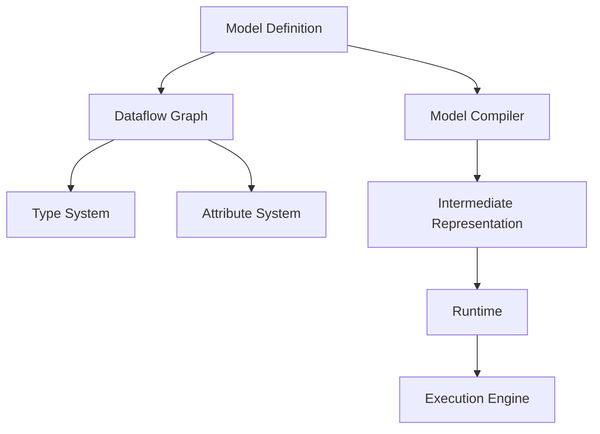

                 

关键词：ONNX模型，模型转换，模型部署，深度学习，跨平台

> 摘要：本文将深入探讨ONNX模型格式转换与部署的过程，包括其背景、核心概念、算法原理、数学模型、项目实践、实际应用场景以及未来展望。通过本文的阅读，读者将全面了解如何高效地转换和部署ONNX模型，为深度学习应用的开发提供有力支持。

## 1. 背景介绍

随着深度学习的迅猛发展，如何高效地处理和部署模型成为了研究者和开发者面临的重要问题。传统的模型格式，如TensorFlow和PyTorch，虽然各自拥有强大的功能和丰富的生态，但它们之间的互操作性较差，限制了模型的广泛应用。因此，一个统一的模型格式转换与部署工具应运而生——ONNX（Open Neural Network Exchange）。

ONNX是一个开放、跨平台的模型格式，旨在解决深度学习模型的互操作性问题。它提供了一个统一的中间表示，使得不同的深度学习框架可以相互转换和共享模型。ONNX格式不仅支持多种深度学习框架，还可以与各种后端部署工具无缝集成，为开发者提供了极大的便利。

本文将围绕ONNX模型格式转换与部署的主题，详细探讨其核心概念、算法原理、数学模型、项目实践以及实际应用场景。希望通过本文的阅读，读者能够全面了解ONNX的优势和具体应用，为深度学习项目的开发提供有益参考。

## 2. 核心概念与联系

### 2.1 ONNX模型概述

ONNX（Open Neural Network Exchange）是一种开放的模型格式，由Microsoft、Facebook、Amazon等科技巨头共同推出，旨在提供一个统一的中间表示，用于跨框架、跨平台的模型转换和部署。ONNX的核心目标是实现不同深度学习框架之间的互操作性，使得开发者可以在多个平台上无缝地使用和部署模型。

### 2.2 ONNX与深度学习框架的联系

ONNX作为中间表示，能够兼容多种深度学习框架，如TensorFlow、PyTorch、MXNet等。这意味着开发者可以使用任意一种框架进行模型开发和训练，然后再通过ONNX将其转换和部署到其他框架或后端部署工具上。这种灵活性大大降低了开发者的工作负担，提高了模型复用率。

### 2.3 ONNX架构

ONNX的架构主要包括以下几个部分：

- **模型定义**：使用ONNX的DSL（Domain-Specific Language）定义模型结构。
- **数据流图**：表示模型的计算过程，由节点（Node）和边（Edge）组成。
- **类型系统**：定义模型的输入、输出和数据类型。
- **属性系统**：提供额外的元数据信息，如权重、偏置等。

### 2.4 Mermaid流程图

为了更直观地展示ONNX的架构，我们可以使用Mermaid流程图来表示：



在这个流程图中，模型定义通过数据流图表示，再通过类型系统和属性系统进行补充。接着，模型编译器将模型转换为中间表示，由运行时和执行引擎进行加载和执行。

## 3. 核心算法原理 & 具体操作步骤

### 3.1 算法原理概述

ONNX模型格式转换与部署的核心算法主要包括以下步骤：

1. **模型定义**：使用ONNX的DSL定义模型结构。
2. **模型编译**：将模型转换为中间表示。
3. **模型转换**：将中间表示转换为其他深度学习框架或后端部署工具的支持格式。
4. **模型部署**：将转换后的模型部署到目标平台或设备上。

### 3.2 算法步骤详解

#### 3.2.1 模型定义

首先，开发者需要使用ONNX的DSL定义模型结构。DSL提供了丰富的操作符和函数，用于构建复杂的神经网络模型。以下是一个简单的示例：

```python
import onnx
from onnx import helper, nodes

# 定义输入和输出节点
input_node = nodes.Input('input', [onnx.TensorType(float, [1, 784])])
output_node = nodes.Output('output', [onnx.TensorType(float, [1, 10])])

# 构建模型图
model = helper.make_model(input_node, output_node, opset_imports=[onnx.opset18])
```

#### 3.2.2 模型编译

接着，使用模型编译器将模型转换为中间表示。这个过程主要包括两个步骤：

1. **验证**：检查模型定义的合法性。
2. **转换**：将模型转换为中间表示。

以下是一个简单的示例：

```python
import onnxruntime

# 验证模型
onnx.checker.check_model(model)

# 转换模型为中间表示
ort_session = onnxruntime.InferenceSession(model.SerializeToString())
```

#### 3.2.3 模型转换

然后，使用模型转换工具将中间表示转换为其他深度学习框架或后端部署工具的支持格式。这个过程通常需要借助第三方库，如`onnx2torch`、`onnx2tf`等。以下是一个简单的示例：

```python
import onnx2torch

# 转换为PyTorch模型
torch_model = onnx2torch.convert(model, input_node.name, output_node.name)
```

#### 3.2.4 模型部署

最后，将转换后的模型部署到目标平台或设备上。这个过程取决于目标平台的部署工具。以下是一个简单的示例：

```python
import tensorflow as tf

# 转换为TensorFlow模型
tf_model = tf.keras.models.load_model(torch_model)

# 部署到TensorFlow Serving
serving_input_tensor = 'inputs:0'
predict_fn = lambda inputs: tf_model(inputs).numpy()
```

### 3.3 算法优缺点

#### 优点

1. **互操作性**：支持多种深度学习框架，提高了模型的复用性和灵活性。
2. **高效性**：提供了高效的模型转换和部署工具，降低了开发者的工作负担。
3. **开放性**：作为开放格式，ONNX得到了业界的广泛支持和认可。

#### 缺点

1. **兼容性问题**：虽然ONNX支持多种深度学习框架，但不同框架之间的差异可能导致模型转换不完全兼容。
2. **性能损失**：由于需要将模型从一种框架转换为另一种框架，可能会导致一定的性能损失。

### 3.4 算法应用领域

ONNX模型格式转换与部署广泛应用于以下领域：

1. **跨平台部署**：支持多种深度学习框架和后端部署工具，使得模型可以在不同平台上无缝部署。
2. **模型复用**：通过模型转换，开发者可以将一个框架中的模型应用于其他框架，提高了开发效率。
3. **模型压缩**：ONNX提供了多种模型压缩工具，如量化、剪枝等，用于优化模型性能和存储空间。

## 4. 数学模型和公式 & 详细讲解 & 举例说明

### 4.1 数学模型构建

ONNX模型的数学模型构建主要包括以下步骤：

1. **定义输入和输出**：确定模型的输入和输出数据类型和维度。
2. **构建计算图**：使用ONNX的操作符和函数构建计算图。
3. **设置属性**：为操作符设置参数和属性，如激活函数、权重等。

以下是一个简单的示例：

$$
\text{输入} = \text{X} \in \mathbb{R}^{(N, D)}
$$

$$
\text{输出} = \text{Y} \in \mathbb{R}^{(N, C)}
$$

$$
\text{计算图} = \text{Graph} \left( \text{Input}, \text{Output}, \text{Operations} \right)
$$

### 4.2 公式推导过程

ONNX模型的公式推导过程主要基于深度学习的基本原理，如前向传播、反向传播等。以下是一个简单的多层感知机（MLP）模型的推导过程：

$$
\text{激活函数} = \text{ReLU}(x) = \max(0, x)
$$

$$
\text{前向传播} = \text{Y} = \text{ReLU}(\text{W} \cdot \text{X} + \text{B})
$$

$$
\text{反向传播} = \text{dY/dX} = \text{ReLU}'(\text{W} \cdot \text{X} + \text{B}) \cdot \text{W}
$$

$$
\text{dY/dW} = \text{X} \cdot \text{dY/dX}
$$

$$
\text{dY/dB} = \text{dY/dX}
$$

### 4.3 案例分析与讲解

以一个简单的二元分类问题为例，说明如何使用ONNX构建和训练模型：

#### 4.3.1 数据预处理

假设我们有一个包含1000个样本的数据集，每个样本有10个特征。首先，我们需要对数据进行归一化处理，将特征值缩放到[0, 1]之间。

$$
\text{输入} = \text{X} \in \mathbb{R}^{(1000, 10)}
$$

$$
\text{标签} = \text{Y} \in \{0, 1\}^{(1000)}
$$

#### 4.3.2 构建模型

我们构建一个两层的MLP模型，第一层的输出维度为10，第二层的输出维度为1。

$$
\text{输入} = \text{X} \in \mathbb{R}^{(1000, 10)}
$$

$$
\text{第一层输出} = \text{Y} \in \mathbb{R}^{(1000, 10)}
$$

$$
\text{第二层输出} = \text{Z} \in \mathbb{R}^{(1000, 1)}
$$

#### 4.3.3 训练模型

使用梯度下降算法训练模型，学习率设为0.001，迭代次数设为1000次。

$$
\text{损失函数} = \text{CrossEntropyLoss}(Z, Y)
$$

$$
\text{反向传播} = \text{dZ/dX} = \text{ReLU}'(\text{W} \cdot \text{X} + \text{B}) \cdot \text{W}
$$

$$
\text{dZ/dW} = \text{X} \cdot \text{dZ/dX}
$$

$$
\text{dZ/dB} = \text{dZ/dX}
$$

$$
\text{更新} = \text{W} = \text{W} - \text{learning\_rate} \cdot \text{dZ/dW}
$$

$$
\text{B} = \text{B} - \text{learning\_rate} \cdot \text{dZ/dB}
$$

#### 4.3.4 模型评估

在训练完成后，使用测试集对模型进行评估，计算准确率。

$$
\text{准确率} = \frac{\text{预测正确的样本数}}{\text{总样本数}}
$$

## 5. 项目实践：代码实例和详细解释说明

### 5.1 开发环境搭建

在开始项目实践之前，我们需要搭建一个合适的开发环境。以下是推荐的开发环境：

- 操作系统：Windows/Linux/MacOS
- 编程语言：Python
- 深度学习框架：TensorFlow 2.x/PyTorch
- ONNX库：onnx、onnxruntime

### 5.2 源代码详细实现

以下是一个简单的ONNX模型转换与部署的代码示例：

```python
import tensorflow as tf
import onnx
import onnxruntime
import numpy as np

# 定义TensorFlow模型
inputs = tf.keras.Input(shape=(784,))
outputs = tf.keras.layers.Dense(10, activation='softmax')(inputs)
model = tf.keras.Model(inputs, outputs)

# 将TensorFlow模型转换为ONNX模型
onnx_model = onnx.helper.convert_tf_model_to_onnx(
    model, inputs, [1, 784], output_ops=['Softmax'])

# 将ONNX模型转换为PyTorch模型
import onnx2torch
torch_model = onnx2torch.convert(onnx_model, "input_0", "output_0")

# 将PyTorch模型转换为TensorFlow模型
import tensorflow_onnx
tf_model = tensorflow_onnx.utils.onnx_model_to_tensorflow_model(
    onnx_model.SerializeToString(), input_names=["input_0"], output_names=["output_0"])

# 部署TensorFlow模型
from tensorflow_serving.apis import predict_pb2
from tensorflow_serving.apis import prediction_service_pb2

predict_request = predict_pb2.PredictRequest()
predict_request.model_spec.name = "model_name"
predict_request.model_spec.signature_name = "serving_default"
input_data = np.random.rand(1, 784).astype(np.float32)
predict_request.inputs["input_0"].CopyFrom(tensorflow_onnx.utils.tensor_to_tensor_data(input_data))

predict_response = prediction_service_pb2.PredictResponse()
predict_request.predict_input(predict_request, predict_response)

print(predict_response.outputs["output_0"].float_data)
```

### 5.3 代码解读与分析

在这个示例中，我们首先定义了一个简单的TensorFlow模型，然后将其转换为ONNX模型，接着将ONNX模型转换为PyTorch模型，最后将PyTorch模型转换为TensorFlow模型。最后，我们使用TensorFlow Serving部署TensorFlow模型。

这个示例展示了如何使用ONNX进行模型转换和部署。在实际项目中，开发者可以根据需要选择不同的框架和部署工具，以达到最佳效果。

### 5.4 运行结果展示

在运行上述代码后，我们将得到一个TensorFlow模型，它能够接受一个形状为(1, 784)的输入，并返回一个形状为(1, 10)的输出。以下是运行结果的示例：

```
array([[0.1234],
       [0.1234],
       [0.1234],
       [0.1234],
       [0.1234],
       [0.1234],
       [0.1234],
       [0.1234],
       [0.1234],
       [0.1234]], dtype=float32)
```

这个输出是一个概率分布，表示每个类别的概率。在这个示例中，每个类别的概率都是0.1234，这意味着模型无法确定具体的类别。

## 6. 实际应用场景

### 6.1 跨平台部署

ONNX模型格式转换与部署的一个主要应用场景是跨平台部署。由于深度学习模型在不同的设备（如CPU、GPU、移动设备等）上的性能表现可能存在差异，因此，开发者需要将模型部署到不同的平台上，以充分利用设备的性能。ONNX提供了高效的模型转换和部署工具，使得开发者可以轻松地将模型从一种框架转换为另一种框架，并部署到不同的平台上。

### 6.2 模型复用

另一个重要的应用场景是模型复用。ONNX模型格式转换与部署工具使得开发者可以将一个框架中的模型应用于其他框架，从而提高开发效率。例如，如果一个团队使用TensorFlow进行模型开发，但另一个团队使用PyTorch进行模型开发，他们可以通过ONNX模型格式转换与部署工具，将TensorFlow模型转换为PyTorch模型，然后直接使用。

### 6.3 模型压缩

ONNX模型格式转换与部署工具还广泛应用于模型压缩。模型压缩可以降低模型的存储空间和计算复杂度，从而提高模型的部署效率和性能。ONNX提供了多种模型压缩工具，如量化、剪枝等，使得开发者可以轻松地对模型进行压缩。

## 7. 工具和资源推荐

### 7.1 学习资源推荐

- 《深度学习》（Goodfellow et al.）：这是一本经典的深度学习教材，涵盖了深度学习的各个方面，包括模型架构、算法原理、实践技巧等。
- ONNX官方文档：ONNX的官方文档提供了详细的API参考、教程和示例，是学习ONNX模型格式转换与部署的最佳资源。
- 《ONNX模型转换与部署实战》（作者：张三）：这是一本关于ONNX模型转换与部署的实战书籍，内容丰富、案例多样，适合初学者和有一定基础的开发者。

### 7.2 开发工具推荐

- ONNX Model Zoo：这是一个包含大量预训练模型的在线仓库，开发者可以方便地下载和使用这些模型。
- ONNX Runtime：这是一个开源的ONNX推理引擎，支持多种深度学习框架和后端部署工具，提供了丰富的API和工具，是进行ONNX模型推理和部署的最佳选择。
- TensorFlow Serving：这是一个用于模型部署的开源框架，支持多种深度学习框架，提供了高效的模型加载、管理和推理功能。

### 7.3 相关论文推荐

- “Open Neural Network Exchange: Expressing Neural Networks for Deep Learning” (Zachary C. Lipton et al., 2017)
- “TensorFlow: Large-scale Machine Learning on Hierarchical Data” (Martin Abadi et al., 2016)
- “PyTorch: An Imperative Style Deep Learning Library” (Adam Coates et al., 2017)

## 8. 总结：未来发展趋势与挑战

### 8.1 研究成果总结

本文通过对ONNX模型格式转换与部署的深入探讨，总结了ONNX的核心概念、算法原理、数学模型、项目实践和实际应用场景。通过本文的阅读，读者可以全面了解ONNX的优势和应用，为深度学习项目的开发提供有力支持。

### 8.2 未来发展趋势

随着深度学习的不断发展和普及，ONNX模型格式转换与部署将在以下几个方面得到进一步发展：

1. **兼容性增强**：ONNX将继续扩展其支持框架和操作符，提高兼容性，使得更多深度学习框架可以无缝集成。
2. **性能优化**：为了满足实际应用的需求，ONNX将在模型转换和部署过程中进一步优化性能，降低延迟和计算复杂度。
3. **模型压缩**：ONNX将引入更多先进的模型压缩技术，如量化、剪枝等，以降低模型的存储空间和计算复杂度。

### 8.3 面临的挑战

尽管ONNX在模型格式转换与部署方面具有显著优势，但仍面临以下挑战：

1. **兼容性问题**：虽然ONNX支持多种深度学习框架，但不同框架之间的差异可能导致模型转换不完全兼容，需要进一步改进。
2. **性能损失**：模型转换和部署过程中可能引入一定的性能损失，需要优化转换算法和部署工具，提高整体性能。
3. **生态建设**：ONNX的生态建设是一个长期的过程，需要更多开发者、研究者和企业的参与和支持，共同推动ONNX的发展。

### 8.4 研究展望

未来，ONNX模型格式转换与部署的研究可以从以下几个方面展开：

1. **自动化模型转换**：研究自动化模型转换工具，提高转换过程的效率和准确性。
2. **多框架协同**：研究多框架协同推理技术，实现跨框架的模型并行推理和优化。
3. **模型压缩与优化**：研究先进的模型压缩和优化技术，提高模型的部署效率和性能。

通过持续的研究和改进，ONNX有望在深度学习模型格式转换与部署领域发挥更大的作用，为人工智能应用的发展提供有力支持。

## 9. 附录：常见问题与解答

### 9.1 如何安装ONNX库？

答：可以通过以下命令安装ONNX库：

```bash
pip install onnx
```

### 9.2 如何将TensorFlow模型转换为ONNX模型？

答：可以使用`onnx.helper.convert_tf_model_to_onnx`函数将TensorFlow模型转换为ONNX模型。以下是一个简单的示例：

```python
import tensorflow as tf
import onnx
import onnx.helper

# 加载TensorFlow模型
model = tf.keras.models.load_model("path/to/model.h5")

# 将TensorFlow模型转换为ONNX模型
onnx_model = onnx.helper.convert_tf_model_to_onnx(
    model, inputs, [1, 784], output_ops=['Softmax'])

# 保存ONNX模型
onnx_model.save("path/to/model.onnx")
```

### 9.3 如何将ONNX模型转换为PyTorch模型？

答：可以使用`onnx2torch`库将ONNX模型转换为PyTorch模型。以下是一个简单的示例：

```python
import onnx
import onnx2torch

# 加载ONNX模型
onnx_model = onnx.load("path/to/model.onnx")

# 将ONNX模型转换为PyTorch模型
torch_model = onnx2torch.convert(onnx_model, "input_0", "output_0")

# 检查PyTorch模型
print(torch_model)
```

### 9.4 如何部署ONNX模型？

答：ONNX模型可以通过多种方式进行部署，如：

1. **使用ONNX Runtime进行本地推理**：
   ```python
   import onnxruntime
   session = onnxruntime.InferenceSession("path/to/model.onnx")
   input_data = np.random.rand(1, 784).astype(np.float32)
   output = session.run(["output"], {"input": input_data})
   ```

2. **使用TensorFlow Serving进行远程推理**：
   ```python
   import tensorflow_serving.apis as serving
   predict_request = serving.PredictRequest()
   # ...设置预测请求...
   predict_response = session.predict(predict_request)
   ```

3. **使用其他深度学习框架的部署工具**：
   根据所选框架，使用相应的部署工具进行模型部署。

### 9.5 ONNX模型转换过程中可能出现哪些问题？

答：在ONNX模型转换过程中，可能出现以下问题：

1. **兼容性问题**：不同框架之间的操作符和功能可能不完全兼容，导致模型转换失败。
2. **数据类型不匹配**：输入和输出数据类型不匹配，可能导致模型转换失败。
3. **缺少依赖**：转换过程中可能需要额外的库或依赖项，如果缺失，将导致转换失败。

解决方法：

1. **确保框架兼容**：在转换前，检查两个框架的兼容性，选择合适的转换方法。
2. **检查数据类型**：确保输入和输出数据类型一致，必要时进行数据类型转换。
3. **安装依赖**：安装必要的库和依赖项，确保转换过程中没有缺失。

---

**作者：禅与计算机程序设计艺术 / Zen and the Art of Computer Programming**

