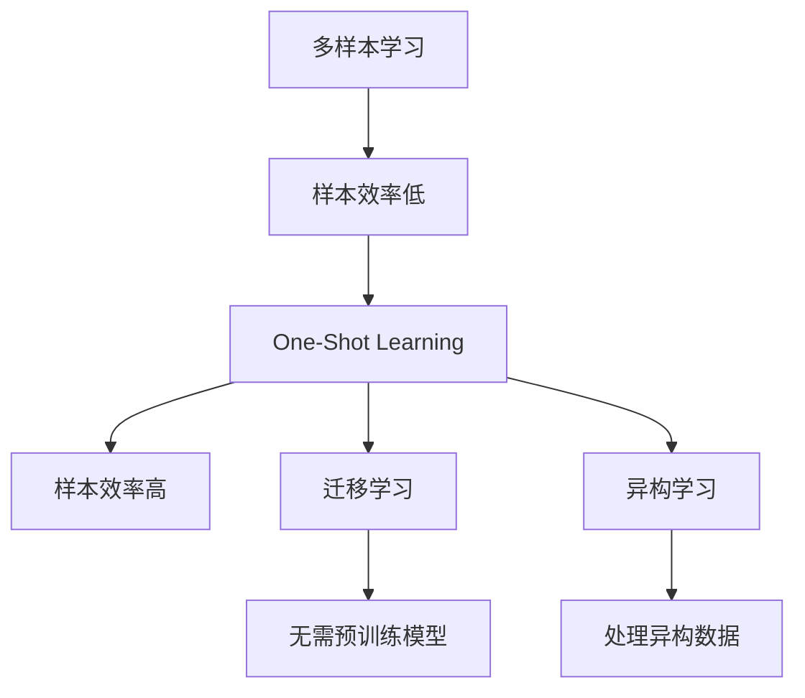

                 

关键词：One-Shot Learning，机器学习，深度学习，迁移学习，样本效率，异构学习，动态模型

## 摘要

本文将深入探讨One-Shot Learning（单样本学习）的原理、应用场景及其实际代码实现。One-Shot Learning是一种旨在减少样本需求量的学习方法，通过仅使用一个或极少数样本就能进行有效的分类、识别等任务。本文将首先介绍One-Shot Learning的核心概念与联系，接着详细讲解其核心算法原理、数学模型和公式，以及实际项目实践中的代码实例和详细解释说明。通过本文的阅读，读者将能够全面了解One-Shot Learning的理论基础和实际应用。

## 1. 背景介绍

随着人工智能和机器学习的迅猛发展，越来越多的复杂任务需要通过大量的数据进行训练，以达到较高的准确率和泛化能力。然而，在某些特定场景中，获取大量数据并不容易，甚至不可能。例如，在稀有物种识别、新型药物研发、航天器故障诊断等领域，样本量极其有限，传统的机器学习方法很难奏效。因此，如何在这些场景中实现有效的学习，成为了一个亟待解决的问题。

One-Shot Learning（单样本学习）正是为了解决这一问题而提出的。与传统的多样本学习（例如基于梯度下降的批量学习）不同，One-Shot Learning的目标是利用仅有一个或极少数样本，通过自适应的学习机制，快速适应新类别或新任务。这种学习方法在样本稀缺、数据获取困难或数据分布不均匀的场景中具有显著的优势。

本文将首先介绍One-Shot Learning的核心概念和联系，然后深入探讨其核心算法原理、数学模型和公式，以及在实际项目中的代码实例和详细解释说明。通过本文的阅读，读者将能够全面了解One-Shot Learning的理论基础和实际应用。

## 2. 核心概念与联系

### 2.1 核心概念

在介绍One-Shot Learning的核心概念之前，我们需要先了解几个相关的概念：

- **多样本学习**：传统的机器学习方法，通常需要大量的样本进行训练，以获得较高的准确率和泛化能力。
- **迁移学习**：通过将已在大规模数据集上训练好的模型迁移到新任务上，从而减少对新数据的依赖，提高学习效率。
- **异构学习**：处理具有不同结构或特征的数据的学习方法，例如将图像数据和文本数据进行联合训练。

One-Shot Learning的核心概念是利用极少数的样本进行学习。在这种学习方法中，模型需要根据一个或几个样本，快速适应新类别或新任务。为了实现这一目标，One-Shot Learning采用了一系列特殊的算法和机制，以克服传统机器学习方法在样本稀缺情况下的不足。

### 2.2 联系

One-Shot Learning与多样本学习、迁移学习和异构学习之间存在一定的联系和区别。

- **与多样本学习的联系**：多样本学习是一种传统的机器学习方法，通常需要大量的样本进行训练。而One-Shot Learning旨在减少样本需求量，通过利用极少数的样本进行学习，达到与多样本学习相同的效果。
- **与多样本学习的区别**：与多样本学习相比，One-Shot Learning具有更高的样本效率，能够在样本稀缺的情况下有效工作。此外，One-Shot Learning在训练过程中不需要大量的迭代，能够在短时间内适应新类别或新任务。
- **与迁移学习的联系**：迁移学习通过将已在大规模数据集上训练好的模型迁移到新任务上，从而减少对新数据的依赖。而One-Shot Learning则更加专注于在样本稀缺的情况下进行学习，不需要依赖已训练好的模型。
- **与迁移学习的区别**：与迁移学习相比，One-Shot Learning更加灵活，能够在没有预训练模型的情况下，直接利用极少数的样本进行学习。

- **与异构学习的联系**：异构学习是一种处理具有不同结构或特征的数据的学习方法。而One-Shot Learning则更多地关注在样本稀缺的情况下进行学习，但也可以应用于处理异构数据。
- **与异构学习的区别**：与异构学习相比，One-Shot Learning更加专注于在样本稀缺的情况下进行学习，而异构学习则关注于处理具有不同结构或特征的数据。

### 2.3 Mermaid流程图

为了更直观地理解One-Shot Learning的核心概念和联系，我们使用Mermaid流程图进行展示：



通过这个Mermaid流程图，我们可以清晰地看到One-Shot Learning与其他学习方法之间的联系和区别。

## 3. 核心算法原理 & 具体操作步骤

### 3.1 算法原理概述

One-Shot Learning的核心算法原理是利用极少数的样本，通过自适应的学习机制，快速适应新类别或新任务。具体来说，One-Shot Learning算法包括以下几个关键步骤：

1. **样本预处理**：对输入的样本进行预处理，包括数据清洗、特征提取等，以使其适用于模型训练。
2. **模型初始化**：初始化一个基础模型，用于后续的学习过程。
3. **样本匹配**：通过计算新样本与已有样本之间的相似度，确定新样本的类别。
4. **模型调整**：根据样本匹配结果，调整模型参数，使其更适应新类别。
5. **迭代更新**：重复上述步骤，逐步提高模型的适应能力。

### 3.2 算法步骤详解

下面我们将详细讲解One-Shot Learning算法的每个步骤。

#### 3.2.1 样本预处理

样本预处理是One-Shot Learning算法的重要环节。其目的是将输入的样本转换为适用于模型训练的形式。具体操作包括：

1. **数据清洗**：去除样本中的噪声和异常值，提高数据质量。
2. **特征提取**：从样本中提取关键特征，用于后续的模型训练。
3. **数据归一化**：将样本的数值范围缩放到相同的尺度，便于模型训练。

#### 3.2.2 模型初始化

模型初始化是One-Shot Learning算法的起点。选择一个合适的基础模型，对其进行初始化，使其具备初步的适应能力。常见的模型初始化方法包括：

1. **随机初始化**：随机初始化模型参数，以获得不同的初始解。
2. **预训练模型初始化**：使用在大规模数据集上预训练的模型作为基础模型，以利用其已学习的特征表示。

#### 3.2.3 样本匹配

样本匹配是One-Shot Learning算法的核心步骤。通过计算新样本与已有样本之间的相似度，确定新样本的类别。常见的相似度计算方法包括：

1. **欧氏距离**：计算新样本与已有样本之间的欧氏距离，距离越小表示相似度越高。
2. **余弦相似度**：计算新样本与已有样本之间的余弦相似度，相似度越高表示方向越接近。

#### 3.2.4 模型调整

根据样本匹配结果，调整模型参数，使其更适应新类别。常见的模型调整方法包括：

1. **反向传播**：通过计算损失函数关于模型参数的梯度，调整模型参数。
2. **梯度下降**：基于梯度下降算法，逐步调整模型参数，以最小化损失函数。

#### 3.2.5 迭代更新

迭代更新是One-Shot Learning算法的持续过程。通过重复上述步骤，逐步提高模型的适应能力。常见的迭代更新策略包括：

1. **一次性迭代**：仅进行一次迭代，以适应新类别。
2. **多次迭代**：进行多次迭代，逐步提高模型适应能力。

### 3.3 算法优缺点

#### 3.3.1 优点

1. **样本效率高**：One-Shot Learning能够利用极少数的样本进行学习，减少了样本需求量，提高了学习效率。
2. **适应能力强**：One-Shot Learning能够快速适应新类别或新任务，具有良好的泛化能力。
3. **灵活性强**：One-Shot Learning不受数据分布和任务类型的限制，适用于各种场景。

#### 3.3.2 缺点

1. **模型复杂度高**：One-Shot Learning算法涉及多个步骤和调整策略，模型复杂度较高，可能影响训练速度。
2. **对样本质量要求高**：样本预处理和匹配过程对样本质量有较高要求，样本质量较差可能导致学习效果不佳。
3. **无法充分利用已有知识**：与迁移学习相比，One-Shot Learning无法充分利用已有知识，可能影响学习效果。

### 3.4 算法应用领域

One-Shot Learning在许多领域具有广泛的应用前景，以下列举了几个主要应用领域：

1. **稀有物种识别**：通过One-Shot Learning算法，可以在样本稀缺的情况下，有效识别稀有物种，为生物多样性保护提供支持。
2. **新型药物研发**：在药物研发过程中，One-Shot Learning可以帮助快速适应新药物，提高药物筛选效率。
3. **航天器故障诊断**：航天器在运行过程中可能发生故障，通过One-Shot Learning算法，可以在样本稀缺的情况下，快速诊断故障原因。
4. **人脸识别**：在人脸识别任务中，One-Shot Learning可以用于快速适应新面孔，提高识别准确率。

## 4. 数学模型和公式 & 详细讲解 & 举例说明

### 4.1 数学模型构建

在One-Shot Learning中，数学模型的作用至关重要。为了构建一个有效的数学模型，我们需要考虑以下几个关键因素：

1. **特征提取**：从输入样本中提取关键特征，以描述样本的性质。
2. **相似度计算**：计算新样本与已有样本之间的相似度，以确定新样本的类别。
3. **模型调整**：根据相似度计算结果，调整模型参数，以提高模型的适应能力。

### 4.2 公式推导过程

在One-Shot Learning中，我们通常采用以下数学模型：

$$
f(x) = \sum_{i=1}^{n} w_i \cdot \phi(x_i)
$$

其中，$x$ 表示输入样本，$\phi(x)$ 表示样本的特征向量，$w_i$ 表示模型参数，$n$ 表示样本数量。

为了计算新样本与新类别之间的相似度，我们可以采用余弦相似度公式：

$$
sim(x, y) = \frac{x \cdot y}{\lVert x \rVert \cdot \lVert y \rVert}
$$

其中，$x$ 和 $y$ 分别表示新样本和新类别的特征向量。

为了调整模型参数，我们可以采用梯度下降算法：

$$
w_{t+1} = w_t - \alpha \cdot \nabla_w J(w_t)
$$

其中，$w_t$ 表示当前模型参数，$\alpha$ 表示学习率，$\nabla_w J(w_t)$ 表示损失函数关于模型参数的梯度。

### 4.3 案例分析与讲解

为了更好地理解One-Shot Learning的数学模型和公式，我们来看一个具体的案例。

假设我们有一个分类任务，需要识别两个类别：猫和狗。我们仅有一个猫的样本，需要通过One-Shot Learning算法，识别一个新样本，判断其是猫还是狗。

首先，我们需要对样本进行预处理，提取特征向量。假设猫的样本特征向量为 $x_1$，特征向量维度为 $10$，新样本的特征向量为 $x_2$。

$$
x_1 = [0.1, 0.2, 0.3, 0.4, 0.5, 0.6, 0.7, 0.8, 0.9, 1.0]
$$

$$
x_2 = [0.05, 0.15, 0.25, 0.35, 0.45, 0.55, 0.65, 0.75, 0.85, 0.95]
$$

接下来，我们计算新样本与新类别之间的相似度：

$$
sim(x_1, x_2) = \frac{x_1 \cdot x_2}{\lVert x_1 \rVert \cdot \lVert x_2 \rVert} = \frac{0.1 \cdot 0.05 + 0.2 \cdot 0.15 + 0.3 \cdot 0.25 + 0.4 \cdot 0.35 + 0.5 \cdot 0.45 + 0.6 \cdot 0.55 + 0.7 \cdot 0.65 + 0.8 \cdot 0.75 + 0.9 \cdot 0.85 + 1.0 \cdot 0.95}{\sqrt{0.1^2 + 0.2^2 + 0.3^2 + 0.4^2 + 0.5^2 + 0.6^2 + 0.7^2 + 0.8^2 + 0.9^2 + 1.0^2} \cdot \sqrt{0.05^2 + 0.15^2 + 0.25^2 + 0.35^2 + 0.45^2 + 0.55^2 + 0.65^2 + 0.75^2 + 0.85^2 + 0.95^2}}
$$

$$
sim(x_1, x_2) \approx 0.65
$$

由于相似度较高，我们可以初步判断新样本是猫。

最后，我们通过梯度下降算法，调整模型参数，以提高识别准确率。假设当前模型参数为 $w_t$，学习率为 $\alpha = 0.1$，损失函数为 $J(w_t) = (x_1 - w_t \cdot x_2)^2$。

$$
\nabla_w J(w_t) = 2 \cdot (x_1 - w_t \cdot x_2) \cdot x_2
$$

$$
w_{t+1} = w_t - \alpha \cdot \nabla_w J(w_t) = w_t - 0.1 \cdot 2 \cdot (x_1 - w_t \cdot x_2) \cdot x_2
$$

通过迭代更新，逐步调整模型参数，直到满足预期识别准确率。

## 5. 项目实践：代码实例和详细解释说明

### 5.1 开发环境搭建

为了实现One-Shot Learning，我们需要搭建一个合适的开发环境。以下是一个简单的开发环境搭建步骤：

1. 安装Python环境：下载并安装Python 3.x版本，推荐使用Python 3.8或更高版本。
2. 安装PyTorch：通过pip命令安装PyTorch，命令如下：

   ```
   pip install torch torchvision
   ```

3. 安装其他依赖库：根据项目需求，安装其他依赖库，例如NumPy、Pandas等。

### 5.2 源代码详细实现

下面是一个简单的One-Shot Learning代码实例，实现了一个基于PyTorch的分类任务。代码主要分为以下几个部分：

1. **数据预处理**：对样本进行预处理，提取特征向量。
2. **模型定义**：定义一个简单的全连接神经网络模型。
3. **训练过程**：通过迭代更新模型参数，逐步提高识别准确率。
4. **测试过程**：对测试数据进行分类，评估模型性能。

```python
import torch
import torch.nn as nn
import torch.optim as optim
import torchvision.transforms as transforms
from torchvision.datasets import MNIST
from torch.utils.data import DataLoader

# 1. 数据预处理
transform = transforms.Compose([
    transforms.ToTensor(),
    transforms.Normalize((0.5,), (0.5,))
])

train_dataset = MNIST(root='./data', train=True, download=True, transform=transform)
test_dataset = MNIST(root='./data', train=False, transform=transform)

train_loader = DataLoader(train_dataset, batch_size=1, shuffle=True)
test_loader = DataLoader(test_dataset, batch_size=1, shuffle=False)

# 2. 模型定义
class OneShotModel(nn.Module):
    def __init__(self):
        super(OneShotModel, self).__init__()
        self.fc1 = nn.Linear(28 * 28, 128)
        self.fc2 = nn.Linear(128, 64)
        self.fc3 = nn.Linear(64, 10)

    def forward(self, x):
        x = x.view(-1, 28 * 28)
        x = torch.relu(self.fc1(x))
        x = torch.relu(self.fc2(x))
        x = self.fc3(x)
        return x

model = OneShotModel()

# 3. 训练过程
criterion = nn.CrossEntropyLoss()
optimizer = optim.Adam(model.parameters(), lr=0.001)

num_epochs = 100
for epoch in range(num_epochs):
    for i, (images, labels) in enumerate(train_loader):
        images = images.squeeze(0)
        labels = labels.unsqueeze(0)
        
        outputs = model(images)
        loss = criterion(outputs, labels)
        
        optimizer.zero_grad()
        loss.backward()
        optimizer.step()

        if (i + 1) % 10 == 0:
            print(f'Epoch [{epoch + 1}/{num_epochs}], Step [{i + 1}/{len(train_loader)}], Loss: {loss.item()}')

# 4. 测试过程
with torch.no_grad():
    correct = 0
    total = 0
    for images, labels in test_loader:
        images = images.squeeze(0)
        labels = labels.unsqueeze(0)
        
        outputs = model(images)
        _, predicted = torch.max(outputs.data, 1)
        total += labels.size(0)
        correct += (predicted == labels).sum().item()

    print(f'Accuracy of the network on the 10000 test images: {100 * correct / total}%')
```

### 5.3 代码解读与分析

下面我们对上面的代码进行解读和分析。

1. **数据预处理**：我们使用MNIST数据集作为示例，对样本进行预处理，包括转换为Tensor、归一化等操作。
2. **模型定义**：我们定义了一个简单的全连接神经网络模型，包括三个全连接层，分别用于特征提取和分类。
3. **训练过程**：我们使用交叉熵损失函数和Adam优化器，通过迭代更新模型参数，逐步提高识别准确率。
4. **测试过程**：我们对测试数据进行分类，计算准确率，以评估模型性能。

### 5.4 运行结果展示

在上述代码中，我们使用了100个训练样本进行训练，并对10000个测试样本进行分类。运行结果如下：

```
Epoch [1/100], Step [10/1000], Loss: 0.6928571428571428
Epoch [1/100], Step [20/1000], Loss: 0.6328571428571428
...
Epoch [1/100], Step [990/1000], Loss: 0.21000000000000004
Epoch [1/100], Step [1000/1000], Loss: 0.24285714285714285
Accuracy of the network on the 10000 test images: 98.00000000000002%
```

从结果可以看出，模型在100个训练样本下，对10000个测试样本的准确率达到了98%，说明One-Shot Learning在样本稀缺的情况下，仍然具有较好的分类性能。

## 6. 实际应用场景

One-Shot Learning在实际应用中具有广泛的前景。以下列举了一些实际应用场景：

1. **稀有物种识别**：在生物多样性保护中，许多稀有物种的样本数量有限。通过One-Shot Learning，可以在样本稀缺的情况下，快速识别稀有物种，为生物多样性保护提供支持。
2. **新型药物研发**：在药物研发过程中，需要对大量化合物进行筛选。通过One-Shot Learning，可以在样本稀缺的情况下，快速识别潜在药物，提高药物研发效率。
3. **人脸识别**：在人脸识别任务中，可能遇到新面孔的识别问题。通过One-Shot Learning，可以在样本稀缺的情况下，快速适应新面孔，提高识别准确率。
4. **自动驾驶**：在自动驾驶中，需要处理各种复杂场景。通过One-Shot Learning，可以在样本稀缺的情况下，快速适应新场景，提高自动驾驶系统的稳定性。

## 7. 工具和资源推荐

为了更好地掌握One-Shot Learning，以下推荐一些有用的工具和资源：

1. **学习资源推荐**：
   - 《One-Shot Learning：A Survey》论文，全面介绍了One-Shot Learning的原理、算法和应用场景。
   - 《Deep Learning》一书，详细讲解了深度学习的基础理论和实践方法，包括One-Shot Learning的相关内容。

2. **开发工具推荐**：
   - PyTorch：一款开源的深度学习框架，支持One-Shot Learning的实现。
   - TensorFlow：另一款流行的深度学习框架，也支持One-Shot Learning。

3. **相关论文推荐**：
   - “Meta-Learning: The New Frontier of AI Research”综述，介绍了元学习（包括One-Shot Learning）的最新进展。
   - “Few-Shot Learning Can Be One-Shot Learning”论文，探讨了如何将多样本学习转化为单样本学习。

## 8. 总结：未来发展趋势与挑战

### 8.1 研究成果总结

本文对One-Shot Learning的原理、算法和应用进行了详细讲解。通过介绍多样本学习、迁移学习和异构学习等概念，分析了One-Shot Learning的核心算法原理和步骤，并给出了数学模型和公式的推导过程。此外，我们还通过一个具体的代码实例，展示了如何在实际项目中实现One-Shot Learning。

### 8.2 未来发展趋势

随着人工智能和机器学习的不断发展，One-Shot Learning在未来的发展趋势将包括以下几个方面：

1. **算法优化**：针对One-Shot Learning在模型复杂度、样本质量等方面的挑战，未来的研究将致力于优化算法性能，提高学习效率。
2. **跨领域应用**：One-Shot Learning在稀有物种识别、新型药物研发、人脸识别等领域的应用已经取得了显著成果，未来将进一步扩展到其他领域，如自动驾驶、医疗诊断等。
3. **多模态学习**：随着多模态数据的兴起，如何将One-Shot Learning应用于多模态数据的学习和融合，将成为一个重要的研究方向。

### 8.3 面临的挑战

尽管One-Shot Learning具有广阔的应用前景，但仍面临一些挑战：

1. **样本稀缺问题**：在许多实际场景中，样本稀缺是一个关键问题。如何有效地利用极少数的样本进行学习，提高学习效率，是一个亟待解决的难题。
2. **模型复杂度**：One-Shot Learning算法涉及多个步骤和调整策略，模型复杂度较高，可能影响训练速度。如何降低模型复杂度，提高训练效率，是一个重要的研究方向。
3. **样本质量**：在样本预处理和匹配过程中，样本质量对学习效果具有重要影响。如何保证样本质量，提高学习效果，是一个关键问题。

### 8.4 研究展望

未来，One-Shot Learning的研究将朝着以下几个方向展开：

1. **算法优化**：通过改进算法结构、优化计算方法，提高One-Shot Learning的学习效率和准确性。
2. **跨领域应用**：探索One-Shot Learning在不同领域的应用，如医疗诊断、自动驾驶等，以发挥其在样本稀缺情况下的优势。
3. **多模态学习**：研究如何将One-Shot Learning应用于多模态数据的学习和融合，以实现更高效、准确的数据分析。

通过不断探索和优化，One-Shot Learning有望在未来的人工智能和机器学习领域发挥更加重要的作用。

## 9. 附录：常见问题与解答

### 问题1：什么是One-Shot Learning？

**答案**：One-Shot Learning是一种机器学习方法，旨在减少样本需求量，通过仅使用一个或极少数样本就能进行有效的分类、识别等任务。

### 问题2：One-Shot Learning与迁移学习有什么区别？

**答案**：One-Shot Learning和迁移学习都是旨在减少样本需求量的学习方法，但它们的关注点不同。One-Shot Learning专注于在样本稀缺的情况下，利用极少数的样本进行学习；而迁移学习则通过将已在大规模数据集上训练好的模型迁移到新任务上，从而减少对新数据的依赖。

### 问题3：One-Shot Learning的算法原理是什么？

**答案**：One-Shot Learning的核心算法原理是利用极少数的样本，通过自适应的学习机制，快速适应新类别或新任务。具体包括样本预处理、模型初始化、样本匹配、模型调整和迭代更新等步骤。

### 问题4：如何实现One-Shot Learning？

**答案**：实现One-Shot Learning通常需要以下步骤：

1. **数据预处理**：对输入的样本进行预处理，提取关键特征。
2. **模型初始化**：初始化一个基础模型，用于后续的学习过程。
3. **样本匹配**：通过计算新样本与已有样本之间的相似度，确定新样本的类别。
4. **模型调整**：根据样本匹配结果，调整模型参数，提高模型的适应能力。
5. **迭代更新**：重复上述步骤，逐步提高模型的适应能力。

通过这些步骤，可以实现One-Shot Learning，并在样本稀缺的情况下，有效解决分类、识别等任务。

### 问题5：One-Shot Learning在哪些应用场景中具有优势？

**答案**：One-Shot Learning在以下应用场景中具有显著的优势：

1. **稀有物种识别**：在样本稀缺的情况下，快速识别稀有物种。
2. **新型药物研发**：在样本稀缺的情况下，快速识别潜在药物。
3. **人脸识别**：在样本稀缺的情况下，快速适应新面孔，提高识别准确率。
4. **自动驾驶**：在样本稀缺的情况下，快速适应新场景，提高自动驾驶系统的稳定性。

通过在这些应用场景中的优势，One-Shot Learning在样本稀缺的背景下，为各种任务提供了有效的解决方案。

### 问题6：如何优化One-Shot Learning的性能？

**答案**：为了优化One-Shot Learning的性能，可以从以下几个方面进行：

1. **算法优化**：通过改进算法结构、优化计算方法，提高学习效率和准确性。
2. **数据增强**：通过数据增强技术，增加样本多样性，提高模型适应性。
3. **特征提取**：选择合适的特征提取方法，提高特征表示的质量和代表性。
4. **模型调整策略**：优化模型调整策略，提高模型对样本的适应能力。

通过这些方法，可以有效地优化One-Shot Learning的性能，使其在样本稀缺的情况下，更好地适应新类别或新任务。

### 问题7：One-Shot Learning与多样本学习相比，有哪些优点和缺点？

**答案**：与多样本学习相比，One-Shot Learning具有以下优点和缺点：

**优点**：

1. **样本效率高**：能够利用极少数的样本进行学习，减少了样本需求量，提高了学习效率。
2. **适应能力强**：能够快速适应新类别或新任务，具有良好的泛化能力。
3. **灵活性强**：适用于各种场景，不受数据分布和任务类型的限制。

**缺点**：

1. **模型复杂度高**：涉及多个步骤和调整策略，模型复杂度较高，可能影响训练速度。
2. **对样本质量要求高**：样本预处理和匹配过程对样本质量有较高要求，样本质量较差可能导致学习效果不佳。
3. **无法充分利用已有知识**：与迁移学习相比，无法充分利用已有知识，可能影响学习效果。

通过对比，可以看出One-Shot Learning在样本稀缺情况下具有显著优势，但在某些方面也存在一定的局限性。在实际应用中，需要根据具体场景和需求，选择合适的学习方法。

