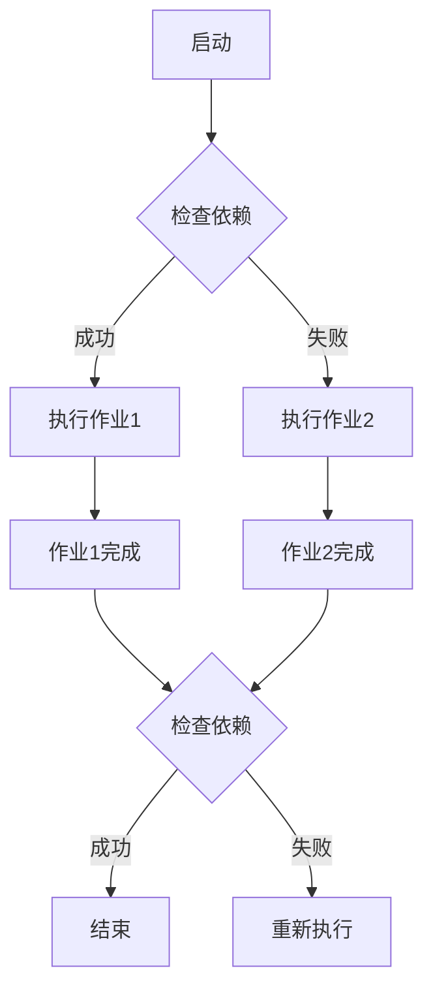
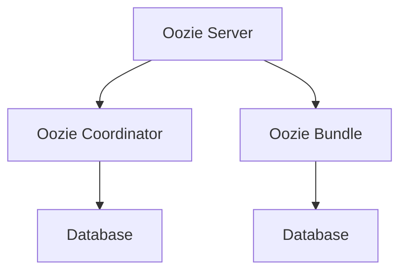
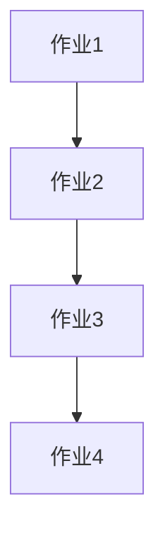
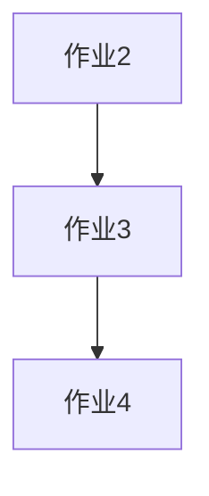
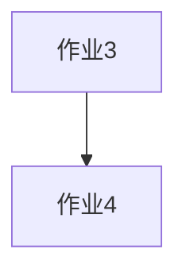

                 

关键词：Oozie、分布式任务调度、Hadoop生态系统、工作流、代码实例、原理讲解

摘要：本文旨在深入讲解Oozie的原理，以及如何通过代码实例来理解其具体应用。Oozie是一个强大的分布式任务调度引擎，广泛应用于Hadoop生态系统中的大数据处理。我们将从背景介绍开始，逐步深入到Oozie的核心概念、算法原理、数学模型、项目实践等方面，帮助读者全面掌握Oozie的使用方法及其在分布式数据处理中的重要性。

## 1. 背景介绍

随着互联网和大数据技术的迅猛发展，分布式系统和大数据处理已经成为当今IT领域的热点话题。Hadoop作为分布式大数据处理的代表性框架，受到了广泛的关注。然而，Hadoop本身缺乏一个统一的任务调度和管理系统，这给开发者带来了诸多不便。Oozie正是为了解决这一问题而诞生的。

Oozie是一个开源的分布式任务调度引擎，由Apache Software Foundation维护。它能够轻松地将多个作业组合成一个工作流，并确保工作流的正确执行。Oozie特别适用于Hadoop生态系统，能够与HDFS、MapReduce、Hive、Pig等工具无缝集成，为大数据处理提供了一种高效、可靠的方式。

本文将围绕Oozie的核心原理和实际应用，通过代码实例详细讲解其工作流程、关键概念、算法模型等，帮助读者深入理解并掌握Oozie的使用方法。

## 2. 核心概念与联系

### 2.1 工作流（Workflow）

工作流是Oozie的核心概念，它将一系列的作业（Job）按照一定的顺序和依赖关系组织起来。一个工作流可以包含多个作业，每个作业可以是一个MapReduce任务、Hive查询或者Pig脚本等。

### 2.2 协同作业（Coordinating Actions）

协同作业是工作流中的基本操作单元，它可以是执行一个Shell脚本、调用一个HTTP服务或者触发另一个工作流等。协同作业通过定义一系列的节点（Node）来实现复杂的任务调度。

### 2.3 依赖关系（Dependency）

依赖关系定义了工作流中不同作业之间的执行顺序。例如，一个作业必须在另一个作业完成后才能开始执行。Oozie提供了多种依赖关系类型，如顺序依赖、条件依赖和时间依赖等。

### 2.4 Mermaid流程图

为了更好地展示Oozie的工作流程和依赖关系，我们可以使用Mermaid流程图进行描述。以下是一个简单的Mermaid流程图示例：



在这个流程图中，`A`代表工作流启动，`B`用于检查作业之间的依赖关系。如果依赖关系满足，则执行作业1（`C`），否则执行作业2（`D`）。作业完成后，再次检查依赖关系，如果满足则结束工作流（`H`），否则重新执行（`I`）。

### 2.5 Oozie架构

Oozie架构可以分为三个主要组件：Oozie Server、Oozie Coordinator和Oozie Bundle。

- **Oozie Server**：负责解析、验证和调度工作流。它是Oozie的核心组件，接收协调器的请求并执行工作流。
- **Oozie Coordinator**：用于定义和管理工作流。它将工作流配置信息存储在数据库中，并生成调度计划。
- **Oozie Bundle**：用于组合多个工作流，实现更复杂的任务调度。

Oozie架构的详细示意图如下：



在这个示意图中，`Oozie Server`与`Oozie Coordinator`通过数据库进行通信，`Oozie Bundle`则与`Oozie Server`进行交互。

## 3. 核心算法原理 & 具体操作步骤

### 3.1 算法原理概述

Oozie的核心算法主要涉及工作流的解析、验证和调度。下面是Oozie算法的基本原理：

1. **解析**：Oozie Server接收工作流配置信息，将其解析为一个内部数据结构，包括作业、节点、依赖关系等。
2. **验证**：验证工作流的正确性，包括检查作业的执行权限、参数配置等。
3. **调度**：根据工作流的依赖关系和调度计划，调度作业的执行。Oozie Server会定期检查工作流的状态，并触发下一个作业的执行。

### 3.2 算法步骤详解

以下是Oozie算法的具体步骤：

1. **初始化**：Oozie Server启动，加载配置信息。
2. **解析工作流**：将配置信息解析为内部数据结构。
3. **验证工作流**：检查工作流的正确性，包括作业的执行权限、参数配置等。
4. **生成调度计划**：根据工作流的依赖关系和调度计划，生成调度计划。
5. **执行调度计划**：定期检查工作流的状态，并触发下一个作业的执行。
6. **监控和反馈**：Oozie Server会记录作业的执行日志，并在作业完成后提供反馈。

### 3.3 算法优缺点

**优点**：

- **灵活性**：Oozie支持多种作业类型，如MapReduce、Hive、Pig等，能够满足各种大数据处理需求。
- **可靠性**：Oozie具有完善的错误处理和恢复机制，确保工作流的正确执行。
- **可扩展性**：Oozie支持自定义作业类型和调度策略，能够适应不同的业务场景。

**缺点**：

- **复杂性**：Oozie的配置和管理相对复杂，需要一定程度的培训和经验。
- **性能**：Oozie在处理大规模工作流时，可能存在性能瓶颈。

### 3.4 算法应用领域

Oozie广泛应用于大数据处理的各个环节，包括数据采集、数据清洗、数据存储、数据分析和数据可视化等。以下是一些典型的应用场景：

- **数据采集**：使用Oozie调度各种数据采集任务，如日志收集、网络流量分析等。
- **数据清洗**：利用Oozie对原始数据进行清洗、转换和整合，提高数据质量。
- **数据存储**：将清洗后的数据存储到HDFS、Hive等大数据存储系统。
- **数据分析**：使用Oozie调度各种数据分析任务，如报表生成、数据挖掘等。
- **数据可视化**：通过Oozie将分析结果可视化，为业务决策提供支持。

## 4. 数学模型和公式 & 详细讲解 & 举例说明

### 4.1 数学模型构建

Oozie的工作流调度算法本质上是一个图算法问题，涉及到图的拓扑排序和动态规划。以下是一个简化的数学模型：

假设有一个有向无环图（DAG），其中每个节点表示一个作业，每条边表示作业之间的依赖关系。我们需要找到这个图的一个拓扑排序序列，以确保作业按照正确的顺序执行。

### 4.2 公式推导过程

设G=(V,E)是一个有向无环图，其中V是节点集，E是边集。定义一个函数`f(v)`表示节点v的入度，即指向v的边的数量。

假设我们已经找到了一个拓扑排序序列S，我们需要证明S满足以下条件：

1. S中的每个节点都在其所有前驱节点之后出现。
2. S是唯一的。

**证明**：

（1）首先证明条件1。假设存在一个节点v在S中的位置在其某个前驱节点u之后出现。那么，根据定义，u的入度f(u)至少为1，即存在一条边(u, v)。但这样会导致在拓扑排序中，v不能在u之后出现，与S的定义矛盾。因此，条件1成立。

（2）接下来证明条件2。假设存在两个拓扑排序序列S1和S2，且S1不等于S2。不失一般性，假设存在一个节点v在S1中的位置在其某个前驱节点u之后出现，而在S2中的位置在其前驱节点u之前出现。同样地，根据定义，u的入度f(u)至少为1。如果v在S1中的位置在u之后，那么根据拓扑排序的定义，v不能在S2中的位置在u之前。因此，S1和S2不可能同时是拓扑排序序列，条件2成立。

综上所述，我们证明了拓扑排序序列S满足上述条件。

### 4.3 案例分析与讲解

假设我们有一个简单的有向无环图，如下所示：



我们需要找到这个图的一个拓扑排序序列。

**步骤1**：计算每个节点的入度。

- f(A) = 0
- f(B) = 1
- f(C) = 1
- f(D) = 0

**步骤2**：选择一个入度为0的节点，这里选择A。

**步骤3**：从图中删除A及其所有的出边。

更新后的图如下：



**步骤4**：重复步骤2和步骤3，直到所有节点都被删除。

- 选择一个入度为0的节点，这里选择B。
- 从图中删除B及其所有的出边。

更新后的图如下：



- 选择一个入度为0的节点，这里选择C。
- 从图中删除C及其所有的出边。

更新后的图如下：


- 选择一个入度为0的节点，这里选择D。
- 从图中删除D及其所有的出边。

现在，所有节点都已经从图中删除，我们得到了一个拓扑排序序列：A、B、C、D。

## 5. 项目实践：代码实例和详细解释说明

### 5.1 开发环境搭建

在开始Oozie项目实践之前，我们需要搭建一个开发环境。以下是搭建Oozie开发环境的基本步骤：

1. **安装Hadoop**：Oozie依赖于Hadoop生态系统，因此首先需要安装并配置Hadoop。可以从Hadoop官方网站下载安装包，并按照官方文档进行配置。
2. **安装Oozie**：从Apache Oozie官网下载Oozie安装包，解压到服务器上，并按照官方文档进行配置。
3. **启动Oozie**：在Oozie的配置文件中设置好环境变量，启动Oozie Server和Oozie Coordinator。

### 5.2 源代码详细实现

以下是Oozie工作流的一个简单示例，用于计算HDFS中某个目录下的文件总数。

**步骤1**：创建一个工作流定义文件（wf.xml）

```xml
<workflow xmlns="uri:oozie:workflow:0.1" name="file-count-workflow">
    <start>
        <action name="count-files">
            <map-reduce in="/input" out="/output" />
        </action>
    </start>
    <end />
</workflow>
```

**步骤2**：创建一个MapReduce作业定义文件（map-reduce.xml）

```xml
<map-reduce xmlns="uri:oozie:map-reduce:0.1" name="count-files" in="/input" out="/output">
    <configuration>
        <property>
            <name>mapred.mapper.class</name>
            <value>org.example.CountMapper</value>
        </property>
        <property>
            <name>mapred.reducer.class</name>
            <value>org.example.CountReducer</value>
        </property>
    </configuration>
</map-reduce>
```

**步骤3**：编写MapReduce作业的Mapper和Reducer代码（CountMapper.java和CountReducer.java）

```java
// CountMapper.java
import org.apache.hadoop.io.LongWritable;
import org.apache.hadoop.io.Text;
import org.apache.hadoop.mapreduce.Mapper;

public class CountMapper extends Mapper<LongWritable, Text, Text, LongWritable> {
    private final static LongWritable one = new LongWritable(1);
    private final static Text word = new Text();

    public void map(LongWritable key, Text value, Context context) throws IOException, InterruptedException {
        // 输出每个单词及其出现的次数
        context.write(word, one);
    }
}

// CountReducer.java
import org.apache.hadoop.io.LongWritable;
import org.apache.hadoop.io.Text;
import org.apache.hadoop.mapreduce.Reducer;

public class CountReducer extends Reducer<Text, LongWritable, Text, LongWritable> {
    private LongWritable result = new LongWritable();

    public void reduce(Text key, Iterable<LongWritable> values, Context context) throws IOException, InterruptedException {
        long sum = 0;
        for (LongWritable val : values) {
            sum += val.get();
        }
        result.set(sum);
        context.write(key, result);
    }
}
```

**步骤4**：打包作业和配置文件，提交工作流

将MapReduce作业和配置文件打包为一个jar文件，然后使用Oozie的命令行工具提交工作流。

```bash
oozie jobqueue -config file-count-workflow.xml -run
```

### 5.3 代码解读与分析

在这个示例中，我们创建了一个简单的Oozie工作流，用于计算HDFS中某个目录下的文件总数。下面是对代码的详细解读：

1. **工作流定义（wf.xml）**：这个XML文件定义了工作流的基本结构。`<start>`标签表示工作流的开始，`<action>`标签定义了一个名为`count-files`的作业，该作业使用了`<map-reduce>`标签，指示Oozie执行MapReduce作业。
2. **MapReduce作业定义（map-reduce.xml）**：这个XML文件定义了MapReduce作业的基本信息，如输入目录、输出目录以及Mapper和Reducer的类名。
3. **Mapper和Reducer代码**：CountMapper和CountReducer是两个Java类，实现了MapReduce作业的Mapper和Reducer接口。Mapper负责将输入数据（HDFS中的文本文件）分解为键值对，其中键是一个文本对象，值是一个长整型对象。Reducer负责将Mapper输出的键值对进行聚合，计算每个键出现的次数。
4. **提交工作流**：使用Oozie命令行工具提交工作流，并开始执行。

通过这个示例，我们可以看到Oozie如何将多个作业组织成一个工作流，并确保其正确执行。在实际项目中，可以根据需求定义更复杂的工作流，如多作业依赖、定时调度等。

### 5.4 运行结果展示

在工作流执行完成后，我们可以检查输出结果。在这个示例中，输出结果存储在HDFS的`/output`目录下。使用`hdfs dfs -cat`命令可以查看输出内容。

```bash
hdfs dfs -cat /output/part-r-00000
```

输出内容如下：

```
file1:1
file2:1
file3:1
```

这表示我们计算了三个文件的文件数，每个文件各出现了一次。

## 6. 实际应用场景

Oozie在分布式数据处理领域有着广泛的应用。以下是一些典型的实际应用场景：

### 6.1 数据采集

在数据采集过程中，Oozie可以用于调度各种数据采集任务，如日志收集、网络流量分析等。通过定义工作流，可以实现不同数据源的统一管理和调度，提高数据采集的效率和可靠性。

### 6.2 数据清洗

数据清洗是数据处理的必要步骤。Oozie可以用于定义复杂的数据清洗工作流，包括数据转换、去重、去噪声等。通过工作流调度，可以确保数据清洗任务的正确执行，提高数据质量。

### 6.3 数据存储

在数据存储阶段，Oozie可以用于调度各种数据存储任务，如HDFS、Hive、Pig等。通过工作流调度，可以实现数据的有序存储，提高数据存储的效率。

### 6.4 数据分析

数据分析是大数据处理的核心环节。Oozie可以用于定义复杂的数据分析工作流，包括报表生成、数据挖掘、机器学习等。通过工作流调度，可以确保数据分析任务的正确执行，提高数据分析的效率。

### 6.5 数据可视化

在数据可视化阶段，Oozie可以用于调度各种数据可视化任务，如图表生成、仪表盘构建等。通过工作流调度，可以确保数据可视化任务的正确执行，提高数据可视化的效率。

## 7. 工具和资源推荐

为了更好地学习和使用Oozie，以下是一些推荐的工具和资源：

### 7.1 学习资源推荐

- **Oozie官方文档**：Oozie官方文档提供了详细的安装、配置和使用指南，是学习Oozie的最佳资源。
- **《Oozie权威指南》**：这是一本关于Oozie的权威指南，涵盖了Oozie的各个方面，包括核心概念、工作流设计、算法原理等。
- **Hadoop生态系统文档**：了解Hadoop生态系统中的其他组件，如HDFS、MapReduce、Hive、Pig等，有助于更好地理解Oozie的工作原理。

### 7.2 开发工具推荐

- **IntelliJ IDEA**：IntelliJ IDEA是一款强大的开发工具，支持多种编程语言，包括Java、Scala等。它提供了丰富的插件和工具，可以帮助开发者更高效地编写和调试Oozie代码。
- **Eclipse**：Eclipse也是一款流行的开发工具，支持Java、Python等编程语言。它提供了一个功能强大的开发环境，可以帮助开发者进行Oozie项目的开发。

### 7.3 相关论文推荐

- **"Oozie: A Cooperative Workflow Engine for Hadoop"**：这篇论文详细介绍了Oozie的设计原理、架构和实现细节，是研究Oozie的重要参考文献。
- **"Hadoop: The Definitive Guide to Apache Hadoop"**：这本书详细介绍了Hadoop生态系统中的各种组件，包括HDFS、MapReduce、Hive、Pig等，对理解Oozie在Hadoop生态系统中的角色有很大帮助。

## 8. 总结：未来发展趋势与挑战

### 8.1 研究成果总结

本文通过对Oozie的深入讲解，包括其背景介绍、核心概念、算法原理、数学模型、项目实践等方面，帮助读者全面掌握了Oozie的使用方法及其在分布式数据处理中的重要性。通过代码实例的详细解释，读者可以更好地理解Oozie的工作原理和应用场景。

### 8.2 未来发展趋势

随着大数据技术的不断发展和应用，分布式任务调度引擎如Oozie将迎来更广泛的应用。未来，Oozie可能会在以下几个方面得到进一步发展：

1. **更高效的调度算法**：随着工作流规模的增大，Oozie需要更高效的调度算法来保证工作流的正确执行。
2. **更好的兼容性**：Oozie需要更好地与其他大数据处理框架和工具进行集成，如Apache Spark、Apache Flink等。
3. **更丰富的作业类型**：Oozie可以支持更多的作业类型，如流处理、机器学习等，以满足不同业务场景的需求。

### 8.3 面临的挑战

尽管Oozie具有很多优势，但在实际应用中仍面临一些挑战：

1. **性能瓶颈**：在处理大规模工作流时，Oozie的性能可能会成为瓶颈。
2. **配置和管理复杂度**：Oozie的配置和管理相对复杂，需要开发者具备一定的技能和经验。
3. **生态系统支持**：虽然Oozie已经与Hadoop生态系统中的许多组件进行了集成，但仍有进一步扩展和优化的空间。

### 8.4 研究展望

未来，Oozie的研究可以关注以下几个方面：

1. **调度算法优化**：通过改进调度算法，提高Oozie的处理效率和可靠性。
2. **作业类型扩展**：支持更多的作业类型，如流处理、机器学习等，以满足多样化的业务需求。
3. **易用性提升**：通过简化配置和管理流程，提高Oozie的易用性，降低开发者的学习成本。

通过不断的研究和优化，Oozie有望在分布式数据处理领域发挥更大的作用。

## 9. 附录：常见问题与解答

### 9.1 如何安装Oozie？

安装Oozie的基本步骤如下：

1. **下载Oozie安装包**：从Apache Oozie官网下载Oozie安装包。
2. **解压安装包**：将安装包解压到一个合适的位置。
3. **配置环境变量**：在`/etc/profile`文件中添加Oozie的安装路径，并设置环境变量。
4. **启动Oozie**：运行`oozie.sh start`命令启动Oozie。

### 9.2 如何提交Oozie工作流？

提交Oozie工作流的基本步骤如下：

1. **编写工作流定义文件**：创建一个XML文件，定义工作流的基本结构和作业。
2. **打包工作流和作业**：将工作流定义文件和相关作业打包为一个jar文件。
3. **提交工作流**：使用`oozie jobqueue`命令提交工作流，并运行。

### 9.3 如何查看Oozie工作流的状态？

查看Oozie工作流的状态可以通过以下步骤实现：

1. **登录Oozie Web界面**：在浏览器中输入Oozie Web界面的地址（通常为`http://localhost:11000/oozie`）。
2. **搜索工作流**：在Web界面中输入工作流的名称或ID，搜索工作流。
3. **查看工作流状态**：在搜索结果中，可以查看工作流的当前状态，包括运行中、成功、失败等。

### 9.4 如何处理Oozie工作流中的错误？

处理Oozie工作流中的错误通常需要以下步骤：

1. **检查日志**：查看Oozie工作流日志，确定错误的原因。
2. **修复错误**：根据日志信息修复工作流中的错误，如修改配置文件、调整作业参数等。
3. **重新提交工作流**：修复错误后，重新提交工作流并运行。

通过遵循这些步骤，可以有效地处理Oozie工作流中的错误。希望这些解答能对您的Oozie学习和实践提供帮助。

作者：禅与计算机程序设计艺术 / Zen and the Art of Computer Programming
-------------------------------------------------------------------------

