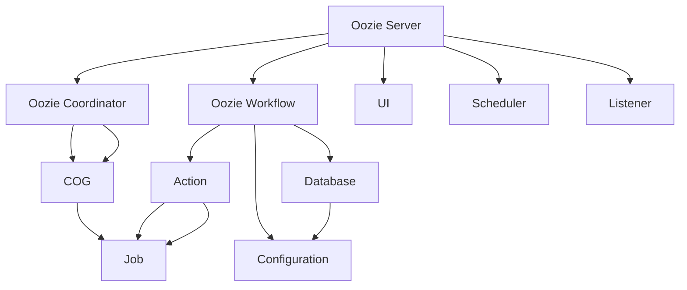

                 

关键词：(Oozie, 工作流调度，Hadoop生态系统，分布式计算，作业调度，数据流管理，编程实例，性能优化，架构设计)

摘要：本文深入探讨了Oozie工作流调度系统的原理、核心组件及其在分布式计算环境中的应用。通过详细讲解Oozie的工作机制、架构设计、核心算法和编程实例，帮助读者理解Oozie在Hadoop生态系统中的关键作用，并学会如何利用Oozie进行高效的数据流管理和作业调度。同时，本文还分析了Oozie的优缺点，以及其在未来应用场景中的发展趋势和面临的挑战。

## 1. 背景介绍

随着大数据时代的到来，分布式计算和数据处理需求日益增长。Hadoop生态系统作为开源大数据技术的代表，为数据处理提供了强大的支持。然而，在面对复杂的数据处理任务时，如何有效地管理和调度这些任务成为了一个重要的课题。

Oozie是一种强大的工作流调度系统，它能够有效地管理分布式计算环境中的任务调度和数据流管理。Oozie的设计初衷是为了解决Hadoop生态系统中的工作流调度问题，其支持多种数据处理任务，如MapReduce、Spark、Hive等。通过Oozie，用户可以轻松地定义、调度和监控工作流任务，从而提高数据处理效率。

本文将围绕Oozie的工作原理、架构设计、核心算法和编程实例进行讲解，帮助读者全面掌握Oozie的使用方法，并在实际项目中应用。

### 1.1 Oozie的历史与发展

Oozie最初由Apache软件基金会开发，并于2008年作为Apache孵化项目正式启动。随着其在Hadoop生态系统中的广泛应用，Oozie逐渐从孵化项目升级为主流项目。Oozie的发展历程经历了多个版本的迭代，不断优化和完善其功能。

Oozie的早期版本主要支持MapReduce作业调度，但随着大数据技术的发展，Oozie也逐渐支持了Spark、Hive、Pig等其他数据处理框架。此外，Oozie还引入了诸如事务处理、并行执行等高级功能，使得其能够更好地适应复杂的数据处理需求。

### 1.2 Oozie的定位与优势

Oozie在Hadoop生态系统中的定位是一种分布式计算工作流调度系统，其主要功能是管理和调度分布式计算任务。与其他调度系统（如Quartz、Cron等）相比，Oozie具有以下优势：

1. **支持多种数据处理框架**：Oozie能够与MapReduce、Spark、Hive、Pig等多种数据处理框架无缝集成，实现跨框架的任务调度。
2. **高可靠性**：Oozie支持事务处理，确保工作流的正确性和一致性。同时，Oozie具有强大的容错机制，能够自动处理任务失败和恢复。
3. **灵活性**：Oozie提供了丰富的配置和扩展接口，用户可以根据实际需求自定义工作流和调度策略。
4. **可视化**：Oozie提供了Web界面，用户可以通过图形化的方式定义和监控工作流，提高了使用体验。

## 2. 核心概念与联系

在深入了解Oozie的工作原理之前，我们需要先了解其核心概念和架构设计。下面通过一个Mermaid流程图来展示Oozie的核心组件及其相互关系。

### 2.1 Mermaid流程图



### 2.2 核心概念解释

1. **Oozie Server**：Oozie服务器是Oozie的核心组件，负责调度和管理工作流和协调器。它接收用户提交的工作流和协调器请求，并将它们分配给相应的协调器进行执行。
2. **Oozie Workflow**：工作流是指一系列任务的组合，用于执行特定的数据处理任务。工作流可以包含多个动作（Action），每个动作可以是一个独立的任务，如MapReduce作业、Spark作业等。
3. **Action**：动作是工作流中的基本单元，表示一个具体的任务。动作可以是同步的，也可以是异步的，用于实现任务之间的依赖关系。
4. **Job**：作业是指由一个或多个动作组成的工作流实例。作业是Oozie调度的基本单位，可以并行或顺序执行。
5. **Oozie Coordinator**：协调器是一种特殊的工作流，用于周期性地执行一系列任务。协调器可以定义任务的执行频率、触发条件等，从而实现自动化调度。
6. **COG**：COG是协调器的工作流实例，表示一个具体的协调器执行实例。COG负责执行协调器定义的任务序列，并管理任务的状态和依赖关系。
7. **Database**：Oozie使用数据库来存储元数据，如工作流定义、作业状态、调度信息等。常用的数据库包括HBase、MySQL等。
8. **Configuration**：配置文件用于定义Oozie的工作环境、调度策略、参数等。配置文件通常以XML格式存储。
9. **UI**：Oozie Web界面提供了直观的图形化操作界面，用户可以通过Web界面创建、监控和管理工作流。
10. **Scheduler**：调度器负责根据工作流和协调器的定义，定期执行调度任务。
11. **Listener**：监听器用于接收外部事件，并根据事件触发相应的操作。监听器可以与调度器结合使用，实现基于事件触发的工作流调度。

## 3. 核心算法原理 & 具体操作步骤

### 3.1 算法原理概述

Oozie的核心算法主要涉及任务调度和数据流管理。其基本原理可以概括为：

1. **任务调度**：Oozie根据工作流和协调器的定义，将任务分配给相应的执行节点，并按照依赖关系依次执行。
2. **数据流管理**：Oozie通过数据流图来管理任务之间的数据依赖关系，确保数据流的正确性和一致性。

具体操作步骤如下：

### 3.2 算法步骤详解

#### 3.2.1 创建工作流

1. 使用Oozie Web界面或命令行工具创建工作流定义文件。
2. 定义工作流的名称、描述、版本等信息。

#### 3.2.2 添加动作

1. 在工作流定义文件中添加动作，如MapReduce作业、Spark作业等。
2. 定义动作的名称、参数、依赖关系等。

#### 3.2.3 配置调度策略

1. 根据工作流和协调器的需求，配置调度策略，如定时执行、基于事件触发等。
2. 配置调度策略的参数，如执行时间、触发条件等。

#### 3.2.4 提交工作流

1. 使用Oozie命令行工具或Web界面提交工作流。
2. 查看工作流状态和执行日志。

### 3.3 算法优缺点

#### 优点

1. **高可靠性**：Oozie支持事务处理和容错机制，确保工作流的正确性和一致性。
2. **灵活性**：Oozie支持多种数据处理框架，用户可以根据需求自定义工作流和调度策略。
3. **易用性**：Oozie提供了图形化的Web界面，简化了工作流管理和调度操作。

#### 缺点

1. **性能瓶颈**：Oozie在处理大规模任务时可能会出现性能瓶颈，需要优化配置和算法。
2. **依赖外部组件**：Oozie依赖Hadoop生态系统中的其他组件（如HDFS、MapReduce等），需要额外配置和管理。

### 3.4 算法应用领域

Oozie广泛应用于大数据处理、实时数据流分析、离线数据分析等场景，具体应用领域包括：

1. **大数据处理**：Oozie可以用于处理大规模数据集，如日志分析、用户行为分析等。
2. **实时数据流分析**：Oozie可以与Apache Kafka等实时数据流系统结合，实现实时数据处理和分析。
3. **离线数据分析**：Oozie可以用于处理大量离线数据，如数据挖掘、报告生成等。

## 4. 数学模型和公式 & 详细讲解 & 举例说明

### 4.1 数学模型构建

Oozie的核心算法涉及任务调度和数据流管理，下面我们通过一个简单的数学模型来解释这些概念。

#### 4.1.1 任务调度模型

假设有n个任务需要调度，每个任务有一个执行时间t_i，任务之间的依赖关系可以用图表示。任务调度模型的目标是找到一种最优的调度策略，使得任务完成时间最短。

#### 4.1.2 数据流管理模型

数据流管理模型主要涉及数据依赖关系的管理。假设有m个数据流，每个数据流有一个数据量d_i，数据流之间的依赖关系可以用图表示。数据流管理模型的目标是确保数据流的正确性和一致性。

### 4.2 公式推导过程

#### 4.2.1 任务调度公式

任务调度模型可以使用最短路径算法（如Dijkstra算法）来求解。假设任务图的权值为执行时间t_i，则最短路径公式为：

$$
d(i, j) = \min \{ t_i + d(j) \mid (i, j) \in E \}
$$

其中，d(i, j)表示从任务i到任务j的最短路径长度，E表示任务图中的边集合。

#### 4.2.2 数据流管理公式

数据流管理模型可以使用拓扑排序算法来求解。假设数据流图的入度分别为in_i，则拓扑排序公式为：

$$
in'(i) = \sum_{j \in predecessors(i)} in(j)
$$

其中，in'(i)表示任务i的入度，predecessors(i)表示任务i的前驱任务集合。

### 4.3 案例分析与讲解

#### 4.3.1 案例背景

假设有一个包含5个任务的工作流，任务之间的依赖关系如下：

```
A -> B
B -> C
C -> D
D -> E
```

任务执行时间如下：

```
t(A) = 2
t(B) = 3
t(C) = 4
t(D) = 5
t(E) = 6
```

#### 4.3.2 任务调度分析

使用最短路径算法求解任务调度，结果如下：

```
A -> B -> C -> D -> E
总执行时间：2 + 3 + 4 + 5 + 6 = 20
```

#### 4.3.3 数据流管理分析

使用拓扑排序算法求解数据流管理，结果如下：

```
A -> B -> C -> D -> E
```

数据流的正确性和一致性得到保证。

## 5. 项目实践：代码实例和详细解释说明

### 5.1 开发环境搭建

在开始项目实践之前，我们需要搭建一个Oozie的开发环境。以下是搭建Oozie开发环境的步骤：

1. **安装Java开发环境**：Oozie基于Java开发，因此需要安装Java开发环境。可以从[Oracle官网](https://www.oracle.com/java/technologies/javase-downloads.html)下载Java开发工具包（JDK），并配置环境变量。
2. **安装Hadoop**：Oozie依赖于Hadoop生态系统，因此需要安装Hadoop。可以从[Hadoop官网](https://hadoop.apache.org/)下载Hadoop安装包，并按照官方文档进行安装。
3. **安装Oozie**：从[Apache Oozie官网](https://oozie.apache.org/)下载Oozie安装包，并按照官方文档进行安装。安装过程中需要配置Oozie的配置文件，如`oozie-site.xml`等。
4. **启动Oozie**：启动Oozie服务，可以通过命令行执行以下命令：

```shell
oozie bin/oozie.sh start
```

### 5.2 源代码详细实现

以下是Oozie工作流的一个简单示例，该示例将实现一个包含两个任务的工作流，任务A执行一个MapReduce作业，任务B执行一个Spark作业。

1. **定义工作流**：在Oozie的Web界面或命令行工具中创建一个工作流定义文件，如`example workflows/example Workflow.xml`，文件内容如下：

```xml
<workflow-app name="example Workflow" xmlns="uri:oozie:workflow:0.1">
    <start>
        <action name="taskA">
            <map-reduce action-name="taskA" in="/input" out="/output" />
        </action>
    </start>
    <action name="taskB">
        <spark action-name="taskB" in="/input" out="/output" />
    </action>
    <end>
        <kill name="end"/>
    </end>
</workflow-app>
```

2. **提交工作流**：使用Oozie命令行工具提交工作流，命令如下：

```shell
oozie jobqueue -run -config example workflows/example Workflow.xml
```

### 5.3 代码解读与分析

在上面的示例中，我们定义了一个包含两个任务的工作流。以下是代码的详细解读：

1. **工作流定义**：`<workflow-app>`标签用于定义工作流，包括工作流的名称、版本等信息。`<start>`标签表示工作流的起始节点，`<action>`标签用于定义具体的任务，如MapReduce作业或Spark作业。`<end>`标签表示工作流的结束节点。
2. **任务定义**：在`<action>`标签中，我们定义了任务A和任务B。任务A是一个MapReduce作业，`<map-reduce>`标签用于定义作业的输入、输出路径等参数。任务B是一个Spark作业，`<spark>`标签用于定义作业的输入、输出路径等参数。
3. **提交工作流**：使用`oozie jobqueue -run -config`命令提交工作流，其中`-config`参数指定了工作流定义文件的路径。

通过这个示例，我们可以看到Oozie工作流的基本结构和实现方法。在实际项目中，可以根据需求定义更多复杂的任务和调度策略。

### 5.4 运行结果展示

在Oozie Web界面中，我们可以查看工作流的运行状态和日志。以下是一个示例：

```
Status: RUNNING
Logs:
  - 2023-03-02 10:30:00, Start
  - 2023-03-02 10:30:02, TaskA Started
  - 2023-03-02 10:30:05, TaskA Completed
  - 2023-03-02 10:30:07, TaskB Started
  - 2023-03-02 10:30:10, TaskB Completed
  - 2023-03-02 10:30:12, End
```

从日志中可以看到，工作流已经成功运行，并且任务A和任务B已经完成。通过Oozie Web界面，我们还可以查看工作流的详细执行日志和性能指标，从而更好地监控和管理工作流任务。

## 6. 实际应用场景

Oozie作为一种强大的工作流调度系统，在多个实际应用场景中发挥了重要作用。以下是一些典型的应用场景：

### 6.1 大数据处理平台

在大数据处理平台中，Oozie被广泛应用于任务调度和数据流管理。例如，在一个基于Hadoop的大数据处理平台中，Oozie可以调度MapReduce、Spark、Hive等作业，实现大规模数据的分布式处理。Oozie的高可靠性和灵活性使得其成为大数据平台的首选调度系统。

### 6.2 实时数据流分析

在实时数据流分析场景中，Oozie可以与Apache Kafka等实时数据流系统结合，实现实时数据处理和分析。例如，在一个金融交易数据的实时分析系统中，Oozie可以调度实时数据清洗、分析和报表生成的作业，实现对海量金融交易数据的实时监控和分析。

### 6.3 离线数据分析

在离线数据分析场景中，Oozie可以用于处理大量离线数据，如用户行为分析、报告生成等。例如，在一个电子商务平台的用户行为分析系统中，Oozie可以调度离线数据清洗、用户画像构建、报表生成的作业，实现对用户行为的全面分析和洞察。

### 6.4 企业级应用

Oozie在企业级应用中也有着广泛的应用。例如，在一个大型企业的数据仓库系统中，Oozie可以用于调度ETL（提取、转换、加载）作业，实现数据的实时更新和分析。Oozie的可靠性和灵活性使得其在企业级应用中具有重要地位。

### 6.5 未来应用展望

随着大数据和云计算技术的发展，Oozie的应用场景将更加广泛。以下是Oozie未来应用的几个展望：

1. **支持更多数据处理框架**：随着大数据技术的不断发展，Oozie将支持更多新型数据处理框架，如Flink、Ray等，以适应不断变化的技术需求。
2. **集成人工智能和机器学习**：Oozie可以与人工智能和机器学习技术结合，实现数据驱动的智能分析和决策。
3. **跨云部署和多云管理**：随着云计算的普及，Oozie将支持跨云部署和多云管理，实现数据的灵活调度和优化。
4. **增强安全性和合规性**：随着数据安全需求的提高，Oozie将加强数据安全和合规性管理，保障数据的安全和合规性。

## 7. 工具和资源推荐

### 7.1 学习资源推荐

1. **官方文档**：Apache Oozie的官方文档是学习Oozie的最佳资源。可以通过[Apache Oozie官网](https://oozie.apache.org/)访问官方文档，了解Oozie的安装、配置、使用方法等。
2. **在线教程**：网络上有很多关于Oozie的在线教程，如MOOC课程、博客文章等。可以通过搜索引擎查找相关教程，学习Oozie的基本概念和实践方法。
3. **社区论坛**：Apache Oozie有一个活跃的社区论坛，用户可以在论坛中提问、交流经验。可以通过[Apache Oozie社区论坛](https://community.apache.org/oozie)加入社区，与其他Oozie用户互动。

### 7.2 开发工具推荐

1. **Oozie Web界面**：Oozie Web界面是一个图形化的操作界面，可以帮助用户轻松创建、监控和管理工作流。可以通过[Apache Oozie Web界面](https://oozie.apache.org/docs/latest/oozie-web-ui.html)了解Web界面的使用方法。
2. **Eclipse插件**：Eclipse是一个流行的集成开发环境（IDE），其插件市场提供了多个Oozie插件，可以帮助用户在Eclipse中开发、调试和部署Oozie工作流。可以通过Eclipse插件市场查找并安装Oozie插件。
3. **命令行工具**：Oozie提供了丰富的命令行工具，如`oozie jobqueue`、`oozie coordinator`等，可以帮助用户通过命令行进行工作流管理和调度。可以通过[Apache Oozie命令行工具](https://oozie.apache.org/docs/latest/oozie-commandline-tools.html)了解命令行工具的使用方法。

### 7.3 相关论文推荐

1. **"Oozie: A Cooperative Work Flow System for Hadoop"**：这是Oozie最早的论文之一，详细介绍了Oozie的工作原理和设计思路。
2. **"A Survey of Work Flow Management Systems for Big Data Processing"**：这篇论文对大数据处理领域的工作流管理系统进行了全面的综述，包括Oozie在内的多个工作流调度系统。
3. **"Oozie in Practice: Real World Applications and Performance Analysis"**：这篇论文通过实际案例分析了Oozie在多个应用场景中的性能和优化方法。

## 8. 总结：未来发展趋势与挑战

### 8.1 研究成果总结

本文从背景介绍、核心概念、算法原理、数学模型、项目实践等方面全面讲解了Oozie工作流调度系统。通过本文的学习，读者可以了解Oozie在分布式计算环境中的关键作用，掌握Oozie的使用方法，并在实际项目中应用。

### 8.2 未来发展趋势

随着大数据和云计算技术的不断发展，Oozie在未来具有广泛的应用前景。以下是Oozie未来发展趋势的几个方向：

1. **支持更多数据处理框架**：Oozie将支持更多新型数据处理框架，如Flink、Ray等，以满足不断变化的技术需求。
2. **集成人工智能和机器学习**：Oozie将结合人工智能和机器学习技术，实现数据驱动的智能分析和决策。
3. **跨云部署和多云管理**：Oozie将支持跨云部署和多云管理，实现数据的灵活调度和优化。
4. **增强安全性和合规性**：Oozie将加强数据安全和合规性管理，保障数据的安全和合规性。

### 8.3 面临的挑战

尽管Oozie在分布式计算环境中具有广泛的应用前景，但仍面临着一些挑战：

1. **性能优化**：在处理大规模任务时，Oozie可能会出现性能瓶颈。因此，如何优化Oozie的性能是当前研究的一个重点。
2. **依赖外部组件**：Oozie依赖于Hadoop生态系统中的其他组件，如HDFS、MapReduce等。如何降低对其他组件的依赖，提高系统的独立性是未来的一个挑战。
3. **易用性和用户体验**：尽管Oozie提供了图形化的Web界面，但用户仍需具备一定的技术背景才能使用。如何提高Oozie的易用性和用户体验是未来的一个重要方向。

### 8.4 研究展望

未来，Oozie的研究将重点关注以下几个方面：

1. **性能优化**：研究如何优化Oozie的性能，提高其在大规模任务处理中的效率。
2. **模块化设计**：研究如何实现Oozie的模块化设计，降低对其他组件的依赖，提高系统的独立性。
3. **智能化调度**：研究如何利用人工智能和机器学习技术实现智能化的任务调度，提高数据处理效率。
4. **用户体验优化**：研究如何优化Oozie的用户体验，降低用户使用门槛，提高系统的易用性。

通过不断优化和完善，Oozie有望在分布式计算领域发挥更大的作用，助力大数据处理和实时数据流分析等应用的发展。

## 9. 附录：常见问题与解答

### 9.1 问题1：如何配置Oozie的调度策略？

**解答**：Oozie的调度策略可以通过修改`oozie-site.xml`文件进行配置。例如，要配置一个每天运行一次的任务，可以在`oozie-site.xml`文件中添加以下配置：

```xml
<configuration>
    <property>
        <name>oozie.scheduler.enable</name>
        <value>true</value>
    </property>
    <property>
        <name>oozie.scheduler.cron</name>
        <value>0 0 * * *</value>
    </property>
</configuration>
```

其中，`oozie.scheduler.enable`用于启用调度器，`oozie.scheduler.cron`用于配置调度策略。

### 9.2 问题2：如何监控Oozie工作流的状态？

**解答**：Oozie提供了Web界面，用户可以通过Web界面监控工作流的状态。在Oozie Web界面中，用户可以查看工作流的运行日志、任务状态、执行时间等信息。同时，用户还可以通过命令行工具（如`oozie admin`）查询工作流的状态。

### 9.3 问题3：如何处理Oozie工作流中的错误？

**解答**：Oozie支持事务处理，可以确保工作流的正确性和一致性。当工作流中的任务发生错误时，Oozie会自动回滚到上一个正确的状态，并重新执行错误的任务。用户可以通过Oozie Web界面或命令行工具查看错误日志和错误信息，并根据实际情况进行调试和修复。

### 9.4 问题4：如何扩展Oozie的功能？

**解答**：Oozie提供了丰富的扩展接口，用户可以通过自定义动作、调度策略、监听器等扩展Oozie的功能。例如，用户可以编写自定义的Java类实现动作，并将其集成到Oozie中。此外，Oozie还支持通过插件的方式扩展功能，用户可以通过编写插件来实现特定的功能需求。

