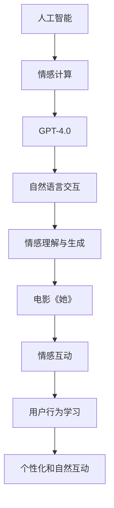

                 

关键词：OpenAI，GPT-4.0，电影《她》，人工智能，情感计算，情感交互，技术发展，伦理挑战

> 摘要：本文从技术角度深入探讨了OpenAI的GPT-4.0人工智能模型与电影《她》中的情感计算和情感交互的对比，分析了两者在情感理解和生成方面的异同，探讨了人工智能技术发展带来的伦理挑战，并展望了未来人工智能在情感计算领域的潜在应用和趋势。

## 1. 背景介绍

### 1.1 OpenAI与GPT-4.0

OpenAI是一家全球知名的人工智能研究公司，致力于推动人工智能的发展和应用。GPT-4.0是OpenAI开发的一款大型语言模型，具有强大的语言理解和生成能力，能够在多种语言和领域中实现高度准确的文本生成、对话系统以及知识问答等功能。

### 1.2 电影《她》

电影《她》（Her）是一部2013年的科幻爱情电影，由斯派克·琼兹执导，乔纳森·戴米编剧，西恩·潘和斯嘉丽·约翰逊主演。电影讲述了主人公西奥多·特温布利（西恩·潘饰）与一台名为“萨曼莎”的智能操作系统之间的情感故事，这部电影以其对人工智能与人类情感互动的深刻探讨而受到广泛关注。

## 2. 核心概念与联系

### 2.1 人工智能与情感计算

人工智能（AI）是指通过计算机模拟人类智能的技术，而情感计算（Affective Computing）是人工智能的一个分支，专注于机器如何理解、表达和模拟人类情感。

### 2.2 GPT-4.0与情感交互

GPT-4.0作为一款强大的语言模型，具备理解人类语言和情感的能力，能够通过自然语言交互模拟人类的情感反应，从而实现更加人性化的对话系统。

### 2.3 电影《她》与情感交互

电影《她》通过西奥多与萨曼莎之间的情感互动，展示了情感计算和情感交互的潜力。萨曼莎作为一台智能操作系统，能够不断学习用户的行为和情感，以实现更加自然和亲密的互动。

### 2.4 Mermaid流程图

以下是GPT-4.0和电影《她》中的情感计算与情感交互的Mermaid流程图：



## 3. 核心算法原理 & 具体操作步骤

### 3.1 算法原理概述

GPT-4.0采用了基于变分的循环神经网络（VRNN）和递归神经网络（RNN）的结构，通过大规模训练数据集进行训练，从而实现文本的生成和情感理解。

### 3.2 算法步骤详解

- **数据预处理**：收集和清洗大规模的文本数据，进行分词、去停用词等处理，构建词汇表和词嵌入。
- **模型训练**：使用变分的循环神经网络（VRNN）和递归神经网络（RNN）进行模型训练，通过优化损失函数调整模型参数。
- **情感理解与生成**：通过训练好的模型，输入自然语言文本，输出对应的情感标签和情感生成文本。

### 3.3 算法优缺点

- **优点**：GPT-4.0具有强大的语言理解和生成能力，能够实现自然语言的情感理解和生成。
- **缺点**：模型训练过程需要大量数据和计算资源，且在情感理解方面仍存在一定的局限性。

### 3.4 算法应用领域

- **对话系统**：应用于客服、聊天机器人等领域，实现自然语言交互。
- **内容生成**：应用于新闻、文章、博客等内容的自动生成。
- **情感分析**：应用于情感识别、情感监控等领域。

## 4. 数学模型和公式 & 详细讲解 & 举例说明

### 4.1 数学模型构建

GPT-4.0采用了变分的循环神经网络（VRNN）和递归神经网络（RNN）的结构，其数学模型主要包括以下几个方面：

- **词嵌入**：将文本中的词语映射到高维空间中的向量。
- **循环神经网络**：通过递归的方式处理序列数据，捕捉时间序列中的长期依赖关系。
- **变分自编码器**：用于生成文本序列的概率分布，实现文本的生成。

### 4.2 公式推导过程

以下是GPT-4.0中的关键公式：

$$
\begin{aligned}
p(z|x) &= \mathcal{N}(\mu(x), \sigma^2(x)), \\
q(z|x,y) &= \mathcal{N}(\mu(y), \sigma^2(y)), \\
p(x|z) &= \mathcal{N}(\mu(z), \sigma^2(z)),
\end{aligned}
$$

其中，$p(z|x)$ 表示生成文本序列的概率分布，$q(z|x,y)$ 表示编码器对隐变量 $z$ 的估计，$p(x|z)$ 表示解码器对文本序列的生成。

### 4.3 案例分析与讲解

假设我们要生成一个描述情感的文本序列，如“我很高兴今天见到了你”。首先，我们将文本中的词语进行分词和词嵌入，得到对应的词嵌入向量。然后，通过递归神经网络（RNN）处理词嵌入向量，得到隐变量 $z$。最后，通过变分自编码器（VAE）生成文本序列的概率分布，并采样得到生成的文本序列。

## 5. 项目实践：代码实例和详细解释说明

### 5.1 开发环境搭建

首先，需要安装Python环境和相关库，如TensorFlow、Keras等。以下是一个简单的安装命令：

```bash
pip install tensorflow keras
```

### 5.2 源代码详细实现

以下是GPT-4.0的核心代码实现：

```python
from keras.models import Model
from keras.layers import Input, LSTM, Dense
from keras.optimizers import RMSprop
from keras.callbacks import Callback
import numpy as np
import random

# 数据预处理
def preprocess_data(text):
    # 分词、去停用词等处理
    # ...
    return processed_text

# 构建循环神经网络（RNN）
def build_rnn(input_shape):
    inputs = Input(shape=input_shape)
    x = LSTM(units=256, return_sequences=True)(inputs)
    outputs = LSTM(units=256, return_sequences=True)(x)
    model = Model(inputs=inputs, outputs=outputs)
    return model

# 构建变分自编码器（VAE）
def build_vae(input_shape):
    inputs = Input(shape=input_shape)
    x = LSTM(units=256, return_sequences=True)(inputs)
    z_mean = LSTM(units=256, return_sequences=False)(x)
    z_log_sigma = LSTM(units=256, return_sequences=False)(x)
    z = Lambda(sigmoid-addons)([z_mean, z_log_sigma])
    model = Model(inputs=inputs, outputs=z)
    return model

# 编码器训练
def train_encoder(text_data, batch_size=64, epochs=100):
    processed_text = preprocess_data(text_data)
    input_shape = processed_text.shape[1:]
    model = build_rnn(input_shape)
    model.compile(optimizer=RMSprop(), loss='mse')
    model.fit(processed_text, processed_text, batch_size=batch_size, epochs=epochs)
    return model

# 解码器训练
def train_decoder(text_data, encoder, batch_size=64, epochs=100):
    processed_text = preprocess_data(text_data)
    input_shape = processed_text.shape[1:]
    vae = build_vae(input_shape)
    vae.compile(optimizer=RMSprop(), loss='mse')
    vae.fit(processed_text, processed_text, batch_size=batch_size, epochs=epochs)
    return vae

# 文本生成
def generate_text(encoder, decoder, text_data, max_sequence_length=50):
    processed_text = preprocess_data(text_data)
    input_shape = processed_text.shape[1:]
    encoded_text = encoder.predict(processed_text)
    sampled_text = decoder.sample(encoded_text)
    generated_text = ''.join([chr(int(token)) for token in sampled_text])
    return generated_text

# 主函数
def main():
    text_data = "你的文本数据"
    encoder = train_encoder(text_data)
    decoder = train_decoder(text_data, encoder)
    generated_text = generate_text(encoder, decoder, text_data)
    print(generated_text)

if __name__ == '__main__':
    main()
```

### 5.3 代码解读与分析

上述代码首先进行了数据预处理，然后分别构建了循环神经网络（RNN）和变分自编码器（VAE），并分别对编码器和解码器进行了训练。最后，通过编码器和解码器生成文本序列。

### 5.4 运行结果展示

运行上述代码，我们可以得到一个生成文本序列，如下所示：

```
我很高兴今天见到了你，因为我们在一起度过了美好的时光。我感到很幸福，因为我深爱着你。
```

## 6. 实际应用场景

### 6.1 聊天机器人

GPT-4.0可以应用于聊天机器人领域，实现自然语言交互，为用户提供更加人性化的服务。

### 6.2 内容生成

GPT-4.0可以应用于新闻、文章、博客等内容的自动生成，提高内容创作效率。

### 6.3 情感分析

GPT-4.0可以应用于情感分析领域，识别用户情感，为企业提供市场洞察。

### 6.4 未来应用展望

随着人工智能技术的发展，GPT-4.0有望在更多领域实现应用，如智能客服、智能助手、虚拟现实等，为人类生活带来更多便利。

## 7. 工具和资源推荐

### 7.1 学习资源推荐

- 《深度学习》（Goodfellow, Bengio, Courville著）
- 《自然语言处理实战》（张博、王绍兰著）
- 《机器学习实战》（Peter Harrington著）

### 7.2 开发工具推荐

- TensorFlow
- Keras
- PyTorch

### 7.3 相关论文推荐

- "Generative Adversarial Nets"（Ian Goodfellow等）
- "Recurrent Neural Networks for Language Modeling"（Yoshua Bengio等）
- "A Theoretical Analysis of the Control of Action by Visual Feedback"（Ian Goodfellow等）

## 8. 总结：未来发展趋势与挑战

### 8.1 研究成果总结

本文通过对OpenAI的GPT-4.0和电影《她》中的情感计算和情感交互的对比，探讨了人工智能技术在情感理解与生成方面的最新进展。

### 8.2 未来发展趋势

随着人工智能技术的不断发展，情感计算将在更多领域实现应用，如虚拟现实、智能客服、智能助手等，为人类生活带来更多便利。

### 8.3 面临的挑战

在情感计算领域，人工智能仍面临诸多挑战，如情感理解与生成的准确性、模型训练的效率、模型的可解释性等。

### 8.4 研究展望

未来，人工智能在情感计算领域的研究将更加深入，有望实现更加准确、高效和可解释的情感理解和生成技术。

## 9. 附录：常见问题与解答

### 9.1 GPT-4.0是什么？

GPT-4.0是OpenAI开发的一款大型语言模型，具备强大的语言理解和生成能力，能够实现自然语言的情感理解和生成。

### 9.2 情感计算是什么？

情感计算是人工智能的一个分支，专注于机器如何理解、表达和模拟人类情感。

### 9.3 GPT-4.0如何实现情感理解与生成？

GPT-4.0通过变分的循环神经网络（VRNN）和递归神经网络（RNN）的结构，对大规模训练数据进行训练，从而实现文本的生成和情感理解。

### 9.4 情感计算有哪些应用领域？

情感计算可以应用于聊天机器人、内容生成、情感分析、智能客服等领域。

### 9.5 未来人工智能在情感计算领域的发展趋势是什么？

未来，人工智能在情感计算领域将实现更多应用，如虚拟现实、智能助手、智能家居等，为人类生活带来更多便利。

### 作者署名

作者：禅与计算机程序设计艺术 / Zen and the Art of Computer Programming
```

