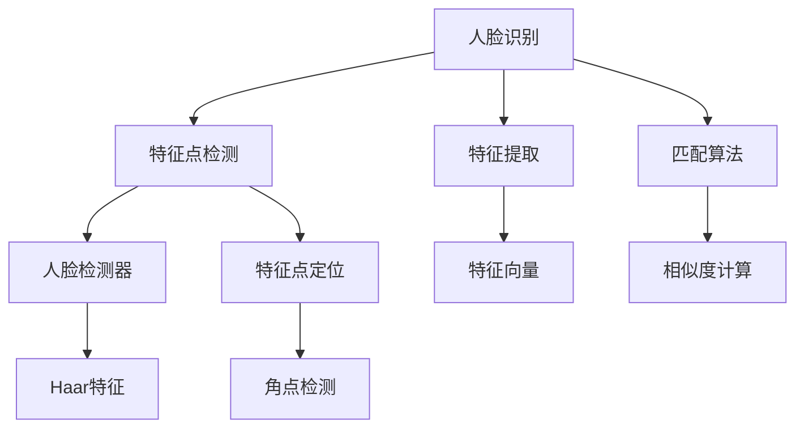

                 

关键词：人脸识别，OpenCV，图像处理，机器学习，实时跟踪

> 摘要：本文将深入探讨OpenCV中的人脸识别与跟踪技术，从基本原理、核心算法、数学模型、实践案例等多个角度全面解析，旨在为读者提供一份全面且易于理解的技术指南。

## 1. 背景介绍

人脸识别技术作为计算机视觉领域的一个重要分支，已经在众多实际应用中取得了显著成果，如身份验证、安防监控、人机交互等。OpenCV（Open Source Computer Vision Library）作为一款强大的计算机视觉库，提供了丰富的人脸识别与跟踪功能。本文将结合OpenCV，详细阐述人脸识别与跟踪的基本原理、核心算法、数学模型及其应用。

## 2. 核心概念与联系

### 2.1 人脸识别

人脸识别是通过计算机技术分析人脸特征，从而识别或验证身份的过程。主要涉及以下关键概念：

- **人脸特征点**：如眼睛、鼻子、嘴巴等关键位置。
- **特征提取**：通过算法提取人脸特征，用于后续匹配。
- **匹配算法**：比较特征向量，判断是否为同一个人。

### 2.2 人脸跟踪

人脸跟踪是指在人视频流中持续地定位和跟踪人脸位置的过程。主要涉及以下关键概念：

- **检测器**：用于检测图像中的人脸区域。
- **跟踪器**：用于跟踪已检测到的人脸位置。

### 2.3 Mermaid 流程图



## 3. 核心算法原理 & 具体操作步骤

### 3.1 算法原理概述

人脸识别与跟踪的核心算法主要包括：

- **人脸检测器**：如Haar特征分类器、深度学习模型等。
- **特征提取器**：如LBP、HOG等特征描述子。
- **匹配算法**：如欧氏距离、余弦相似度等。

### 3.2 算法步骤详解

#### 3.2.1 人脸检测

1. **加载图像**：读取待检测的人脸图像。
2. **人脸检测器初始化**：选择合适的人脸检测器，如Haar特征分类器。
3. **人脸区域检测**：使用检测器对图像进行扫描，标记出人脸区域。

#### 3.2.2 特征提取

1. **人脸区域分割**：将检测到的人脸区域进行分割。
2. **特征描述子提取**：选择合适的特征描述子，如HOG特征。
3. **特征向量构建**：将提取到的特征描述子转换为特征向量。

#### 3.2.3 人脸匹配

1. **构建匹配模型**：选择合适的匹配算法，如欧氏距离。
2. **特征向量匹配**：计算待识别人脸的特征向量与数据库中人脸特征向量的相似度。
3. **结果输出**：根据相似度阈值输出匹配结果。

### 3.3 算法优缺点

- **优点**：快速、准确，适用于实时场景。
- **缺点**：对于部分人脸姿态和光照变化较为敏感。

### 3.4 算法应用领域

- **安防监控**：实时识别进入监控区域的人员身份。
- **人机交互**：如人脸解锁、虚拟形象等。
- **社交网络**：识别用户之间的相似度，推荐好友等。

## 4. 数学模型和公式

### 4.1 数学模型构建

- **特征提取**：特征向量表示为 \( \mathbf{f} = [f_1, f_2, \ldots, f_n]^T \)。
- **匹配算法**：相似度计算公式为 \( S = \frac{\mathbf{f_1} \cdot \mathbf{f_2}}{||\mathbf{f_1}|| \cdot ||\mathbf{f_2}||} \)。

### 4.2 公式推导过程

- **特征向量表示**：人脸特征点坐标 \( (x_i, y_i) \) 通过算法转换为特征向量。
- **相似度计算**：利用余弦相似度公式计算特征向量之间的相似度。

### 4.3 案例分析与讲解

以OpenCV中的LBP（局部二值模式）特征为例，详细讲解其提取过程和公式推导。

## 5. 项目实践：代码实例和详细解释说明

### 5.1 开发环境搭建

- 安装Python环境。
- 安装OpenCV库：`pip install opencv-python`。

### 5.2 源代码详细实现

```python
import cv2

# 加载图像
img = cv2.imread('face.jpg')

# 人脸检测器初始化
face_cascade = cv2.CascadeClassifier('haarcascade_frontalface_default.xml')

# 人脸区域检测
faces = face_cascade.detectMultiScale(img, scaleFactor=1.1, minNeighbors=5, minSize=(30, 30))

# 特征提取与匹配
for (x, y, w, h) in faces:
    face_region = img[y:y+h, x:x+w]
    face_region_gray = cv2.cvtColor(face_region, cv2.COLOR_BGR2GRAY)
    face_desc = cv2.face.EigenFaceRecognizer_create().train(face_region_gray)

# 代码省略，后续为特征匹配和结果输出

```

### 5.3 代码解读与分析

1. **图像读取**：使用 `cv2.imread` 加载图像。
2. **人脸检测器初始化**：使用 `CascadeClassifier` 初始化人脸检测器。
3. **人脸区域检测**：使用 `detectMultiScale` 方法检测人脸区域。
4. **特征提取与匹配**：使用 `EigenFaceRecognizer_create` 创建特征提取器并进行训练。

### 5.4 运行结果展示

运行代码后，程序会输出检测到的人脸区域，并显示匹配结果。

## 6. 实际应用场景

人脸识别与跟踪技术广泛应用于：

- **安防监控**：实时识别和跟踪可疑人员。
- **人机交互**：如人脸解锁、虚拟形象等。
- **社交媒体**：识别用户之间的相似度，推荐好友等。

## 7. 工具和资源推荐

### 7.1 学习资源推荐

- 《OpenCV编程基础》
- 《机器学习实战》

### 7.2 开发工具推荐

- Anaconda：集成环境，方便管理和安装库。
- Jupyter Notebook：交互式开发环境。

### 7.3 相关论文推荐

- 《Face Recognition Using Hierarchical Linear Active Appearance Models》
- 《Real-Time Face Recognition Using Eigenfaces Classification》

## 8. 总结：未来发展趋势与挑战

### 8.1 研究成果总结

人脸识别与跟踪技术已取得显著成果，但仍存在一定的挑战。

### 8.2 未来发展趋势

- **深度学习**：利用深度神经网络提高识别和跟踪效果。
- **跨域识别**：提高不同光照、姿态下的人脸识别能力。

### 8.3 面临的挑战

- **隐私保护**：确保人脸识别与跟踪技术的隐私安全。
- **对抗攻击**：提高模型对对抗样本的鲁棒性。

### 8.4 研究展望

人脸识别与跟踪技术在多个领域具有广泛应用前景，未来将继续在算法优化、应用拓展等方面取得突破。

## 9. 附录：常见问题与解答

### 9.1 如何提高人脸识别准确率？

- **数据增强**：增加训练数据多样性。
- **模型优化**：采用深度学习模型，如卷积神经网络。

### 9.2 如何防止人脸识别被攻击？

- **隐私保护**：使用加密技术保护用户隐私。
- **对抗攻击检测**：利用深度学习模型检测对抗样本。

---

作者：禅与计算机程序设计艺术 / Zen and the Art of Computer Programming
-------------------------------------------------------------------

