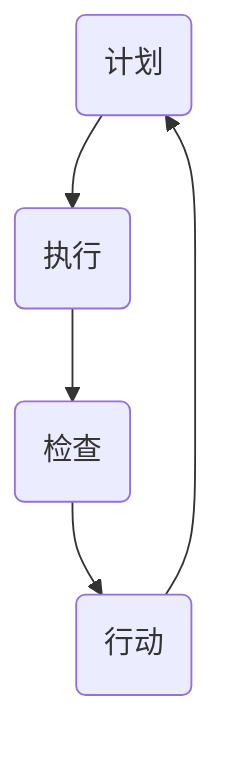

                 

 **关键词：** PDCA循环、戴明环、持续改进、质量管理、IT项目管理

**摘要：** 本文将深入探讨PDCA循环（戴明环）在IT项目管理和软件工程中的应用。我们将详细解析PDCA循环的四个核心阶段：计划（Plan）、执行（Do）、检查（Check）和行动（Act）。通过具体的案例分析，我们将展示如何利用PDCA循环实现持续改进，提高项目质量和效率。文章还将探讨未来应用展望，以及面临的挑战。

## 1. 背景介绍

PDCA循环，也称为戴明环，是一种广泛应用于质量管理和其他领域的持续改进模型。PDCA循环由美国质量管理专家爱德华·戴明（Edwards Deming）提出，并在日本得到广泛应用，因此也被称为“戴明环”。PDCA循环的四个阶段——计划（Plan）、执行（Do）、检查（Check）和行动（Act）——构成了一个循环反复、不断优化的过程。

在IT项目管理中，PDCA循环被广泛采用，以实现项目目标的持续改进。通过这个模型，项目团队可以系统地识别问题、制定解决方案、执行计划并评估结果，从而确保项目的高效和高质量。

本文将首先介绍PDCA循环的四个核心阶段，然后通过具体案例展示如何在实际项目中应用PDCA循环，最后讨论PDCA循环的未来应用展望和面临的挑战。

### 1.1 PDCA循环的历史和发展

PDCA循环起源于20世纪30年代的美国，由爱德华·戴明提出。戴明是一位杰出的统计学家和管理顾问，他在二战期间被美国战时生产局邀请，帮助提高美国工业的生产效率。戴明的质量管理理论对战后日本经济复兴产生了深远影响，PDCA循环成为日本企业普遍采用的质量管理工具。

PDCA循环的四个阶段分别代表了质量管理的不同方面。计划阶段关注的是设定目标和制定计划；执行阶段是将计划付诸实践；检查阶段是对执行结果进行评估；行动阶段是根据评估结果调整计划，确保改进措施的有效实施。

随着时间的推移，PDCA循环逐渐被应用于各个领域，包括IT项目管理、软件开发、生产制造和医疗卫生等。PDCA循环作为一种系统化、循环反复的改进方法，其优势在于能够帮助组织持续优化过程，提高产品和服务的质量。

### 1.2 IT项目管理中的PDCA循环

在IT项目管理中，PDCA循环被广泛应用于项目管理的各个环节，从项目规划到项目执行，再到项目监控和评估。以下是PDCA循环在IT项目管理中的具体应用：

#### 1.2.1 计划阶段

计划阶段是项目启动的关键阶段。在这一阶段，项目团队需要明确项目目标、制定详细的项目计划、分配资源并设定时间表。具体任务包括：

- 项目目标设定：明确项目要实现的具体目标，确保目标是具体、可衡量和可实现的。
- 项目范围定义：确定项目包含的工作范围和排除的工作范围，避免项目范围的蔓延。
- 资源分配：根据项目需求，合理分配人力、物力和财力等资源。
- 时间表制定：制定项目的时间表，包括关键里程碑和交付物的交付时间。

#### 1.2.2 执行阶段

执行阶段是将计划付诸实践的过程。在这一阶段，项目团队按照计划执行各项工作，确保项目进度和质量。具体任务包括：

- 项目任务的分配和执行：根据项目计划，将任务分配给项目团队成员，并确保任务得到有效执行。
- 资源的有效利用：合理利用分配的资源，确保项目顺利进行。
- 项目监控：实时监控项目进度和质量，确保项目按计划进行。

#### 1.2.3 检查阶段

检查阶段是对项目执行结果进行评估和审核的过程。在这一阶段，项目团队需要收集项目数据，评估项目绩效，识别潜在问题和改进机会。具体任务包括：

- 数据收集：收集项目执行过程中产生的各种数据，包括进度、成本、质量等。
- 绩效评估：对项目绩效进行评估，确定项目是否达到预期目标。
- 问题识别：识别项目执行过程中出现的问题和风险，分析原因。

#### 1.2.4 行动阶段

行动阶段是根据检查阶段的结果，制定和实施改进措施的过程。在这一阶段，项目团队需要根据评估结果调整计划，确保项目持续改进。具体任务包括：

- 改进措施的制定：根据问题识别的结果，制定相应的改进措施。
- 改进措施的实施：实施改进措施，确保问题得到有效解决。
- 持续改进：将改进措施纳入项目计划，持续优化项目过程。

### 1.3 PDCA循环在IT项目管理中的优势

PDCA循环在IT项目管理中具有以下优势：

- 系统性：PDCA循环提供了一个系统化的方法，帮助项目团队系统地识别问题、制定解决方案、执行计划和评估结果。
- 可持续性：PDCA循环强调持续改进，确保项目团队在项目执行过程中不断优化过程，提高项目质量。
- 易于实施：PDCA循环的结构简单明了，易于理解和实施，适用于各种规模和类型的项目。
- 适应性：PDCA循环可以适应不同的项目环境和需求，灵活调整计划，确保项目成功。

## 2. 核心概念与联系

### 2.1 PDCA循环的核心概念

PDCA循环由四个核心阶段组成：计划（Plan）、执行（Do）、检查（Check）和行动（Act）。

- **计划（Plan）**：这一阶段是项目启动的关键，项目团队需要明确项目目标、制定详细的项目计划、分配资源并设定时间表。具体任务包括项目目标设定、项目范围定义、资源分配和时间表制定。
- **执行（Do）**：执行阶段是将计划付诸实践的过程，项目团队按照计划执行各项工作，确保项目进度和质量。具体任务包括项目任务的分配和执行、资源的有效利用和项目监控。
- **检查（Check）**：检查阶段是对项目执行结果进行评估和审核的过程，项目团队需要收集项目数据，评估项目绩效，识别潜在问题和改进机会。具体任务包括数据收集、绩效评估和问题识别。
- **行动（Act）**：行动阶段是根据检查阶段的结果，制定和实施改进措施的过程，项目团队需要根据评估结果调整计划，确保项目持续改进。具体任务包括改进措施的制定、改进措施的实施和持续改进。

### 2.2 PDCA循环的架构和流程

PDCA循环的架构和流程可以用以下Mermaid流程图表示：



### 2.3 PDCA循环与其他质量管理模型的联系

PDCA循环与其他质量管理模型如ISO 9001、六西格玛（Six Sigma）和精益生产（Lean Production）有紧密的联系。

- **ISO 9001**：ISO 9001是国际标准化组织（ISO）制定的质量管理体系标准，PDCA循环是ISO 9001的核心组成部分。ISO 9001要求组织建立和实施质量管理体系，通过PDCA循环实现持续改进。
- **六西格玛**：六西格玛是一种基于统计学的质量管理方法，PDCA循环是六西格玛的基本流程。六西格玛强调通过数据驱动的方法识别和解决质量问题，PDCA循环提供了系统化的过程。
- **精益生产**：精益生产是一种以最小化浪费和最大化价值创造为目标的生产管理方法，PDCA循环是精益生产的核心工具。通过PDCA循环，组织可以不断优化生产过程，提高生产效率和质量。

### 2.4 PDCA循环在IT项目管理中的实际应用案例

以下是一个具体的案例，展示如何在实际项目中应用PDCA循环：

**案例：某IT公司的软件项目改进**

某IT公司负责开发一款企业级管理软件，该项目在实施过程中遇到了多个问题，包括功能缺陷、进度延误和质量不稳定。为了解决这些问题，公司决定采用PDCA循环进行持续改进。

**计划阶段**：

- 明确项目目标：确保软件功能齐全、性能稳定、用户界面友好。
- 项目范围定义：确定软件的功能模块、技术架构和用户需求。
- 资源分配：为项目团队分配开发人员、测试人员和项目管理资源。
- 时间表制定：制定详细的项目时间表，包括开发、测试和部署阶段。

**执行阶段**：

- 项目任务的分配和执行：根据项目计划，将任务分配给项目团队成员，并确保任务得到有效执行。
- 资源的有效利用：确保项目团队成员充分利用资源，提高工作效率。
- 项目监控：实时监控项目进度和质量，确保项目按计划进行。

**检查阶段**：

- 数据收集：收集项目执行过程中产生的各种数据，包括功能测试结果、性能测试数据和用户反馈。
- 绩效评估：对项目绩效进行评估，确定项目是否达到预期目标。
- 问题识别：识别项目执行过程中出现的问题和风险，分析原因。

**行动阶段**：

- 改进措施的制定：根据问题识别的结果，制定相应的改进措施，包括功能优化、性能提升和用户界面改进。
- 改进措施的实施：实施改进措施，确保问题得到有效解决。
- 持续改进：将改进措施纳入项目计划，持续优化项目过程。

通过PDCA循环，该IT公司成功地解决了软件项目中的问题，提高了项目的质量和效率。这个案例展示了PDCA循环在IT项目管理中的实际应用效果。

## 3. 核心算法原理 & 具体操作步骤

### 3.1 算法原理概述

PDCA循环是一种基于持续改进的质量管理方法，其核心思想是通过计划（Plan）、执行（Do）、检查（Check）和行动（Act）四个阶段的循环，不断优化项目过程，提高项目质量和效率。

在PDCA循环中，计划阶段是制定目标和计划的关键，执行阶段是将计划付诸实践，检查阶段是对执行结果进行评估和审核，行动阶段是根据评估结果制定和实施改进措施。

PDCA循环的优点在于其系统性和持续性，能够帮助项目团队系统地识别问题、制定解决方案、执行计划并评估结果，从而确保项目的高效和高质量。

### 3.2 算法步骤详解

#### 3.2.1 计划阶段

1. **项目目标设定**：
   - 明确项目要实现的具体目标，确保目标是具体、可衡量和可实现的。
   - 例如，对于一个软件开发项目，目标可以是“确保软件功能齐全、性能稳定、用户界面友好”。

2. **项目范围定义**：
   - 确定项目包含的工作范围和排除的工作范围，避免项目范围的蔓延。
   - 例如，确定软件的功能模块、技术架构和用户需求。

3. **资源分配**：
   - 根据项目需求，合理分配人力、物力和财力等资源。
   - 例如，为项目团队分配开发人员、测试人员和项目管理资源。

4. **时间表制定**：
   - 制定详细的项目时间表，包括关键里程碑和交付物的交付时间。
   - 例如，制定开发、测试和部署阶段的具体时间表。

#### 3.2.2 执行阶段

1. **项目任务的分配和执行**：
   - 根据项目计划，将任务分配给项目团队成员，并确保任务得到有效执行。
   - 例如，将开发任务分配给开发人员，测试任务分配给测试人员。

2. **资源的有效利用**：
   - 确保项目团队成员充分利用资源，提高工作效率。
   - 例如，确保开发人员有足够的时间和资源进行编码。

3. **项目监控**：
   - 实时监控项目进度和质量，确保项目按计划进行。
   - 例如，通过项目进度报告和里程碑评审来监控项目进展。

#### 3.2.3 检查阶段

1. **数据收集**：
   - 收集项目执行过程中产生的各种数据，包括进度、成本、质量等。
   - 例如，收集功能测试结果、性能测试数据和用户反馈。

2. **绩效评估**：
   - 对项目绩效进行评估，确定项目是否达到预期目标。
   - 例如，评估软件的功能完整性、性能稳定性和用户满意度。

3. **问题识别**：
   - 识别项目执行过程中出现的问题和风险，分析原因。
   - 例如，分析软件中的功能缺陷、性能问题和用户反馈中的意见。

#### 3.2.4 行动阶段

1. **改进措施的制定**：
   - 根据问题识别的结果，制定相应的改进措施，包括功能优化、性能提升和用户界面改进。
   - 例如，针对功能缺陷进行代码修复、针对性能问题进行优化。

2. **改进措施的实施**：
   - 实施改进措施，确保问题得到有效解决。
   - 例如，修复代码缺陷、优化系统性能。

3. **持续改进**：
   - 将改进措施纳入项目计划，持续优化项目过程。
   - 例如，将优化措施纳入下一版本的软件开发计划。

### 3.3 算法优缺点

#### 优点：

- **系统性**：PDCA循环提供了一个系统化的方法，帮助项目团队系统地识别问题、制定解决方案、执行计划和评估结果。
- **持续性**：PDCA循环强调持续改进，确保项目团队在项目执行过程中不断优化过程，提高项目质量。
- **易于实施**：PDCA循环的结构简单明了，易于理解和实施，适用于各种规模和类型的项目。
- **适应性**：PDCA循环可以适应不同的项目环境和需求，灵活调整计划，确保项目成功。

#### 缺点：

- **需要持续投入**：PDCA循环需要项目团队持续投入时间和精力，以确保持续改进。
- **初期效果不明显**：在PDCA循环的初期阶段，改进效果可能不明显，需要团队有耐心和信心。

### 3.4 算法应用领域

PDCA循环在以下领域有广泛的应用：

- **IT项目管理**：用于项目规划、执行和监控，确保项目的高效和高质量。
- **软件开发**：用于软件测试、性能优化和功能改进，提高软件质量。
- **生产制造**：用于生产过程的优化和质量控制，提高生产效率和产品质量。
- **医疗卫生**：用于医疗服务的质量管理和持续改进，提高医疗服务水平。
- **金融服务**：用于金融服务的风险管理和质量改进，确保金融服务的稳定和安全。

## 4. 数学模型和公式 & 详细讲解 & 举例说明

### 4.1 数学模型构建

PDCA循环中的数学模型主要集中在质量管理和绩效评估方面。以下是一个简化的数学模型，用于描述PDCA循环中的绩效评估过程：

$$
P = f(T, Q, C)
$$

其中：
- \( P \)：绩效指标（Performance）
- \( T \)：时间（Time）
- \( Q \)：质量（Quality）
- \( C \)：成本（Cost）

这个模型表示绩效指标是时间、质量和成本的函数。在实际应用中，可以根据具体情况调整模型中的变量和权重，以更准确地评估项目的绩效。

### 4.2 公式推导过程

为了推导绩效指标 \( P \)，我们可以考虑以下三个主要因素：

1. **时间效率**：
   - 时间效率可以用完成任务的时长来衡量，公式为：
     $$
     E_T = \frac{1}{T}
     $$
   - 时间效率越高，表示单位时间内完成的任务量越大。

2. **质量标准**：
   - 质量标准可以用缺陷率（Defect Rate）来衡量，公式为：
     $$
     D_Q = \frac{N_D}{N_T}
     $$
   - 其中 \( N_D \) 是在时间 \( T \) 内发现的缺陷数量，\( N_T \) 是总任务量。

3. **成本效益**：
   - 成本效益可以用成本效率（Cost Efficiency）来衡量，公式为：
     $$
     E_C = \frac{Q}{C}
     $$
   - 成本效率越高，表示在相同成本下，获得的质量越高。

将这三个因素结合起来，我们得到绩效指标 \( P \) 的公式：
$$
P = f(T, Q, C) = w_1 \cdot E_T + w_2 \cdot D_Q + w_3 \cdot E_C
$$

其中，\( w_1, w_2, w_3 \) 分别是时间效率、质量标准和成本效益的权重，可以根据项目的具体需求和优先级进行调整。

### 4.3 案例分析与讲解

为了更好地理解这个数学模型，我们可以通过一个实际案例来分析。

**案例：软件开发项目绩效评估**

某IT公司开发一个企业级软件，项目周期为6个月。在项目结束时，收集了以下数据：

- **时间（T）**：实际项目周期为5.5个月。
- **质量（Q）**：通过功能测试，发现20个缺陷，总任务量为100个。
- **成本（C）**：项目总成本为50万元。

假设根据项目需求和优先级，时间效率、质量标准和成本效益的权重分别为 \( w_1 = 0.4 \)，\( w_2 = 0.3 \)，\( w_3 = 0.3 \)。

1. **时间效率**：
   $$
   E_T = \frac{1}{5.5} \approx 0.1818
   $$

2. **质量标准**：
   $$
   D_Q = \frac{20}{100} = 0.2
   $$

3. **成本效益**：
   $$
   E_C = \frac{100}{500000} = 0.002
   $$

4. **绩效指标 \( P \)**：
   $$
   P = 0.4 \cdot 0.1818 + 0.3 \cdot 0.2 + 0.3 \cdot 0.002 = 0.0727 + 0.06 + 0.0006 = 0.1343
   $$

根据绩效指标 \( P \) 的计算结果，该软件项目的绩效得分为0.1343。这个得分可以用来评估项目的整体绩效，并与以往的项目绩效进行比较。

通过这个案例，我们可以看到如何使用数学模型对项目绩效进行量化评估，从而帮助项目团队了解项目的优势和不足，为未来的项目提供改进的方向。

## 5. 项目实践：代码实例和详细解释说明

### 5.1 开发环境搭建

为了更好地演示PDCA循环在软件开发中的应用，我们将使用Python语言编写一个简单的Web应用程序。以下是搭建开发环境的步骤：

1. **安装Python**：
   - 访问 [Python官方网站](https://www.python.org/) 下载Python安装程序。
   - 安装完成后，打开命令行工具（如Terminal或Cmd），输入 `python --version` 验证Python安装是否成功。

2. **安装Flask**：
   - Flask是一个轻量级的Web框架，用于构建Web应用程序。
   - 在命令行中输入 `pip install flask` 安装Flask。

3. **创建项目目录**：
   - 在桌面或合适的位置创建一个名为 `pdca_web_app` 的项目目录。
   - 在该目录中创建一个名为 `app.py` 的Python文件。

### 5.2 源代码详细实现

以下是 `app.py` 的源代码，实现了PDCA循环的基本功能：

```python
from flask import Flask, render_template, request
from flask_sqlalchemy import SQLAlchemy

app = Flask(__name__)
app.config['SQLALCHEMY_DATABASE_URI'] = 'sqlite:///pdca.db'
db = SQLAlchemy(app)

class PDCA(db.Model):
    id = db.Column(db.Integer, primary_key=True)
    plan = db.Column(db.Text)
    do = db.Column(db.Text)
    check = db.Column(db.Text)
    act = db.Column(db.Text)

@app.route('/', methods=['GET', 'POST'])
def index():
    if request.method == 'POST':
        plan = request.form['plan']
        do = request.form['do']
        check = request.form['check']
        act = request.form['act']
        new_pdca = PDCA(plan=plan, do=do, check=check, act=act)
        db.session.add(new_pdca)
        db.session.commit()
        return render_template('success.html')
    return render_template('index.html')

@app.route('/pdca-list')
def pdca_list():
    pdcas = PDCA.query.all()
    return render_template('list.html', pdcas=pdcas)

if __name__ == '__main__':
    db.create_all()
    app.run(debug=True)
```

### 5.3 代码解读与分析

1. **数据库配置**：
   - 使用Flask-SQLAlchemy库连接SQLite数据库，用于存储PDCA循环的数据。

2. **模型定义**：
   - 定义 `PDCA` 模型，包含计划（plan）、执行（do）、检查（check）和行动（act）四个字段。

3. **主路由函数 `index`**：
   - 处理主页的GET和POST请求。
   - 当用户提交表单时，收集计划、执行、检查和行动的输入数据，并存储到数据库中。

4. **列表路由函数 `pdca_list`**：
   - 显示存储在数据库中的所有PDCA记录。

### 5.4 运行结果展示

1. **启动服务器**：
   - 在命令行中运行 `python app.py`，服务器将启动。

2. **访问主页**：
   - 在浏览器中访问本地地址 `http://127.0.0.1:5000/`，显示主页。

3. **提交PDCA记录**：
   - 在主页上填写计划、执行、检查和行动的输入框，提交表单。

4. **查看PDCA列表**：
   - 访问 `http://127.0.0.1:5000/pdca-list`，查看存储在数据库中的PDCA记录。

通过这个简单的Web应用程序，用户可以方便地记录PDCA循环的四个阶段，并在列表中查看和管理这些记录。这个实例展示了如何在实际项目中应用PDCA循环，实现持续改进。

## 6. 实际应用场景

### 6.1 在软件开发中的实际应用

PDCA循环在软件开发中被广泛应用于项目管理和质量控制。通过以下案例，我们可以看到PDCA循环如何在实际的软件开发项目中发挥作用：

**案例：改进软件项目的开发流程**

某软件公司正在开发一款企业资源规划（ERP）系统。在项目执行过程中，团队发现开发进度缓慢，质量不稳定，用户反馈问题较多。为了改善这些问题，公司决定采用PDCA循环进行持续改进。

**计划阶段**：

- 项目目标：确保项目按计划完成，提高软件质量，满足用户需求。
- 项目范围：明确软件的功能模块和用户需求，避免范围蔓延。
- 资源分配：合理分配开发、测试和项目管理的资源。
- 时间表制定：制定详细的项目时间表，包括开发、测试和部署阶段。

**执行阶段**：

- 开发任务分配：根据项目计划，将任务分配给开发人员，确保任务得到有效执行。
- 资源管理：确保开发人员有足够的时间和资源进行编码，测试人员有足够的资源进行测试。
- 项目监控：实时监控项目进度和质量，及时调整计划。

**检查阶段**：

- 数据收集：收集项目执行过程中产生的数据，包括开发进度、缺陷数量和用户反馈。
- 绩效评估：对项目绩效进行评估，确定项目是否达到预期目标。
- 问题识别：识别项目执行过程中出现的问题和风险，分析原因。

**行动阶段**：

- 改进措施制定：根据问题识别的结果，制定改进措施，包括优化开发流程、加强代码审查和用户沟通。
- 改进措施实施：实施改进措施，确保问题得到有效解决。
- 持续改进：将改进措施纳入项目计划，持续优化项目过程。

通过PDCA循环，该软件公司成功地提高了项目的开发效率和质量，用户满意度显著提升。

### 6.2 在IT运维中的实际应用

PDCA循环在IT运维中也被广泛应用，用于优化运维流程、提高系统稳定性和安全性。以下是一个实际案例：

**案例：优化数据中心运维流程**

某大型数据中心在运营过程中，经常出现服务器宕机、网络故障等问题，影响了业务的正常运行。为了改善这些问题，数据中心决定采用PDCA循环进行持续改进。

**计划阶段**：

- 项目目标：提高数据中心的系统稳定性，降低故障率，提升运维效率。
- 项目范围：明确运维流程中的关键环节和潜在问题。
- 资源分配：为运维团队分配必要的资源和工具。
- 时间表制定：制定详细的运维流程优化计划，包括风险评估、故障处理和系统升级。

**执行阶段**：

- 风险评估：对数据中心的各种风险进行评估，制定相应的预防措施。
- 故障处理：优化故障处理流程，确保故障得到及时处理。
- 系统升级：根据需要升级系统，提高系统的稳定性和安全性。

**检查阶段**：

- 数据收集：收集运维过程中产生的数据，包括故障率、系统性能和用户满意度。
- 绩效评估：对运维绩效进行评估，确定是否达到预期目标。
- 问题识别：识别运维过程中出现的问题和风险，分析原因。

**行动阶段**：

- 改进措施制定：根据问题识别的结果，制定改进措施，包括优化故障处理流程、加强系统监控和用户沟通。
- 改进措施实施：实施改进措施，确保问题得到有效解决。
- 持续改进：将改进措施纳入运维流程，持续优化系统稳定性。

通过PDCA循环，数据中心成功降低了故障率，提高了系统稳定性和用户满意度。

### 6.3 在IT咨询服务中的实际应用

PDCA循环在IT咨询服务中也有广泛的应用，用于提高服务质量、满足客户需求。以下是一个实际案例：

**案例：优化IT咨询服务流程**

某IT咨询公司在为客户提供咨询服务时，发现客户满意度较低，服务质量有待提高。为了改善这些问题，公司决定采用PDCA循环进行持续改进。

**计划阶段**：

- 项目目标：提高客户满意度，提升咨询服务质量。
- 项目范围：明确咨询服务中的关键环节和客户需求。
- 资源分配：为咨询团队分配必要的资源和培训。
- 时间表制定：制定详细的咨询服务流程优化计划，包括需求调研、方案制定和实施。

**执行阶段**：

- 需求调研：与客户进行深入沟通，了解客户需求和期望。
- 方案制定：根据客户需求制定详细的解决方案。
- 实施服务：按照方案为客户提供咨询服务。

**检查阶段**：

- 数据收集：收集客户满意度调查数据、服务反馈和项目成果。
- 绩效评估：对咨询服务绩效进行评估，确定是否达到预期目标。
- 问题识别：识别咨询服务中存在的问题和风险，分析原因。

**行动阶段**：

- 改进措施制定：根据问题识别的结果，制定改进措施，包括优化需求调研流程、加强项目管理和提升客户沟通。
- 改进措施实施：实施改进措施，确保问题得到有效解决。
- 持续改进：将改进措施纳入咨询服务流程，持续提升服务质量。

通过PDCA循环，该IT咨询公司成功提高了客户满意度，提升了咨询服务质量。

### 6.4 未来应用展望

随着信息技术的发展，PDCA循环在各个领域的应用将越来越广泛。未来，PDCA循环可能面临以下发展趋势：

- **智能化应用**：利用人工智能和大数据技术，对PDCA循环中的数据进行智能分析，提供更精准的改进建议。
- **跨领域融合**：PDCA循环与其他质量管理模型（如六西格玛、精益生产）融合，形成更全面的质量管理方法。
- **全球化应用**：随着全球化的发展，PDCA循环将在更多国家和地区得到应用，推动全球范围内的质量提升。

## 7. 工具和资源推荐

### 7.1 学习资源推荐

1. **《质量管理方法论》**：一本全面介绍质量管理方法的教材，适合初学者入门。
2. **《PDCA循环与质量管理》**：详细解析PDCA循环在质量管理中的应用，适合对PDCA循环有一定了解的读者。
3. **《PDCA循环与IT项目管理》**：专注于PDCA循环在IT项目管理中的应用，适合IT项目经理和团队成员阅读。

### 7.2 开发工具推荐

1. **JIRA**：一款功能强大的项目管理工具，支持PDCA循环的各个阶段，适用于各种规模的项目。
2. **Trello**：一款简单易用的看板工具，可以帮助团队跟踪项目进度和任务分配。
3. **Asana**：一款功能全面的任务管理工具，支持团队协作和任务跟踪，有助于实施PDCA循环。

### 7.3 相关论文推荐

1. **“PDCA循环在软件开发中的应用研究”**：探讨了PDCA循环在软件开发中的具体应用和实践效果。
2. **“基于PDCA循环的IT运维流程优化研究”**：分析了PDCA循环在IT运维中的应用，并提出了一种优化运维流程的方法。
3. **“PDCA循环在IT咨询服务中的应用与实践”**：研究了PDCA循环在IT咨询服务中的实施策略和效果评估。

## 8. 总结：未来发展趋势与挑战

### 8.1 研究成果总结

PDCA循环作为一种系统化的质量管理方法，已经在各个领域得到了广泛应用。通过实际应用案例，我们看到了PDCA循环在IT项目管理、IT运维和IT咨询服务中的成功应用。这些案例表明，PDCA循环能够帮助项目团队实现持续改进，提高项目质量和效率。

### 8.2 未来发展趋势

随着信息技术的不断发展，PDCA循环在未来的应用将更加广泛和深入。以下是未来PDCA循环发展的几个趋势：

1. **智能化应用**：利用人工智能和大数据技术，对PDCA循环中的数据进行智能分析，提供更精准的改进建议。
2. **跨领域融合**：PDCA循环与其他质量管理模型（如六西格玛、精益生产）融合，形成更全面的质量管理方法。
3. **全球化应用**：随着全球化的发展，PDCA循环将在更多国家和地区得到应用，推动全球范围内的质量提升。

### 8.3 面临的挑战

尽管PDCA循环在质量管理中具有显著的优势，但在实际应用过程中也面临着一些挑战：

1. **实施难度**：PDCA循环的实施需要系统化的过程管理和团队协作，对于一些小规模团队或项目来说，实施难度较大。
2. **数据准确性**：PDCA循环的检查阶段依赖于准确的数据收集和分析，数据的准确性和完整性对于PDCA循环的有效性至关重要。
3. **文化适应**：PDCA循环在不同国家和地区的应用可能需要根据当地的文化和习惯进行调整，以确保其适用性和有效性。

### 8.4 研究展望

未来，对PDCA循环的研究应关注以下几个方面：

1. **智能化改进**：探索如何利用人工智能和大数据技术，提高PDCA循环的数据分析和决策能力。
2. **跨领域应用**：研究PDCA循环在不同领域的具体应用和实践效果，推动其在更多领域的应用。
3. **国际化推广**：推动PDCA循环在全球范围内的应用，提升全球质量管理水平。

通过不断的研究和实践，PDCA循环将在质量管理中发挥更大的作用，推动组织的持续改进和发展。

## 9. 附录：常见问题与解答

### 问题1：PDCA循环的四个阶段具体是什么？

**解答**：PDCA循环的四个阶段分别是：

- **计划（Plan）**：设定目标和制定计划。
- **执行（Do）**：将计划付诸实践。
- **检查（Check）**：对执行结果进行评估和审核。
- **行动（Act）**：根据评估结果制定和实施改进措施。

### 问题2：PDCA循环在IT项目管理中的应用有哪些？

**解答**：PDCA循环在IT项目管理中的应用主要包括：

- **项目规划**：在项目启动阶段，使用PDCA循环制定项目目标和计划。
- **项目执行**：在项目执行过程中，使用PDCA循环确保项目按计划进行。
- **项目监控**：使用PDCA循环监控项目进度和质量，及时识别和解决问题。
- **项目改进**：根据项目评估结果，使用PDCA循环制定和实施改进措施。

### 问题3：如何确保PDCA循环的有效实施？

**解答**：

1. **明确目标和计划**：确保计划阶段的目标和计划具体、可衡量和可实现。
2. **数据收集和分析**：在检查阶段，确保收集到准确的数据，并进行分析。
3. **团队协作**：确保项目团队在PDCA循环的各个阶段紧密协作，共同推进改进。
4. **持续改进**：将改进措施纳入项目计划，持续优化项目过程。

### 问题4：PDCA循环与其他质量管理方法有何区别？

**解答**：PDCA循环与其他质量管理方法（如六西格玛、ISO 9001）的区别主要在于：

- **六西格玛**：强调通过统计分析方法识别和解决质量问题，注重过程优化。
- **ISO 9001**：是一个国际标准化的质量管理体系，强调建立和实施质量管理体系。
- **PDCA循环**：是一种系统化的质量管理方法，强调通过循环反复的改进过程提高项目质量和效率。

### 问题5：PDCA循环在IT咨询服务中的具体应用是什么？

**解答**：在IT咨询服务中，PDCA循环的具体应用包括：

- **需求分析**：在项目启动阶段，使用PDCA循环分析客户需求，确保需求明确和可实施。
- **解决方案制定**：在项目规划阶段，使用PDCA循环制定详细的解决方案。
- **服务交付**：在项目执行阶段，使用PDCA循环确保服务交付符合客户期望。
- **客户满意度评估**：在项目结束后，使用PDCA循环评估客户满意度，并根据反馈进行改进。

