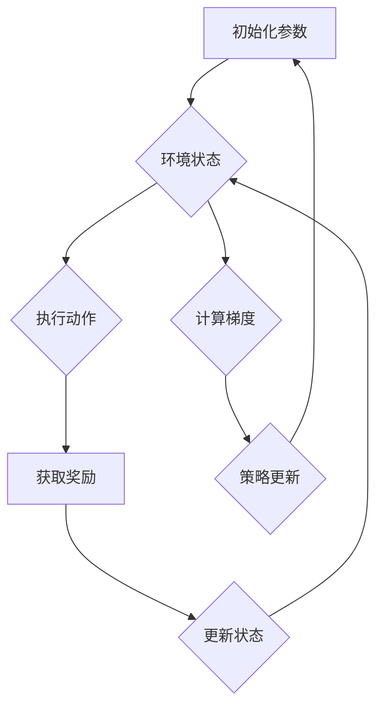

                 

关键词：强化学习，策略优化，深度策略优化，奖励优化，增强学习算法，动态规划，深度神经网络

摘要：本文深入探讨了强化学习领域的两大策略优化算法——PPO（Proximal Policy Optimization）和 DPO（Deep Proximal Optimization）。通过介绍这两种算法的背景、原理、数学模型和应用，我们将对比分析它们的优缺点，并在实际项目中展示如何使用这些算法。本文旨在为读者提供一个全面而直观的理解，以帮助他们在未来的研究和应用中更好地运用这些先进的算法。

## 1. 背景介绍

强化学习（Reinforcement Learning, RL）是一种机器学习方法，通过智能体（agent）与环境（environment）的交互来学习如何达到特定目标。与传统监督学习和无监督学习不同，强化学习侧重于通过奖励信号来指导学习过程。智能体根据环境状态执行动作，并从环境获得即时奖励，通过不断调整其策略来最大化长期奖励。

在强化学习领域，策略优化（Policy Optimization）是一种广泛使用的方法，它通过迭代优化策略参数来提高智能体的性能。策略优化算法包括梯度策略优化（如REINFORCE算法）、策略梯度算法（如SARSA、Q-Learning）以及近端策略优化（如PPO、DPO）。

PPO和DPO是近端策略优化算法的代表性方法，它们通过优化策略参数的同时保持策略的稳定性，大大提高了强化学习算法的稳定性和收敛速度。本文将详细探讨这两种算法的基本原理、实现细节以及实际应用。

### 1.1 强化学习的基本原理

在强化学习框架中，智能体（agent）需要通过与环境的交互来学习最优策略。环境（environment）是一个提供状态（state）、动作（action）和奖励（reward）的动态系统。状态表示智能体在当前时刻所处的情境，动作是智能体可以采取的行为，奖励则是环境对智能体动作的即时反馈。

强化学习过程可以简化为以下四个步骤：

1. **智能体选择动作**：基于当前状态，智能体从策略（policy）中选取一个动作。
2. **执行动作并获得奖励**：智能体执行选定的动作，并从环境获得奖励。
3. **更新状态**：环境根据智能体的动作更新当前状态。
4. **重复上述过程**：智能体不断与环境交互，通过累积奖励来评估策略的有效性，并不断调整策略以实现目标。

### 1.2 策略优化算法

策略优化算法是强化学习的一种核心方法，其主要目标是通过迭代优化策略参数，使得智能体能够产生更好的动作，从而提高总体奖励。

策略优化算法通常可以分为以下几类：

- **基于梯度的策略优化算法**：如REINFORCE算法，直接使用梯度信息来更新策略参数。
- **策略梯度算法**：如SARSA、Q-Learning，通过迭代更新策略参数来逼近最优策略。
- **近端策略优化算法**：如PPO、DPO，通过引入近端策略优化技术，提高算法的稳定性和收敛速度。

## 2. 核心概念与联系

在讨论PPO和DPO之前，我们需要了解一些核心概念和原理，这些概念包括策略、值函数、梯度下降以及近端策略优化。

### 2.1 策略和值函数

策略（Policy）是智能体在给定状态下选择动作的规则，通常用一个概率分布来表示。一个良好的策略应该能够最大化长期奖励。

值函数（Value Function）是评估状态价值的函数，它衡量了智能体在给定状态下执行任何动作所能获得的期望奖励。值函数可以分为状态值函数（State Value Function）和动作值函数（Action Value Function）。

- **状态值函数**：给定状态 \( s \)，评估智能体在该状态下执行任意动作的期望奖励，即 \( V(s) = \sum_a \pi(a|s) \cdot R(s, a) \)。
- **动作值函数**：给定状态 \( s \) 和动作 \( a \)，评估智能体在该状态下执行动作 \( a \) 的期望奖励，即 \( Q(s, a) = \sum_{s'} p(s' | s, a) \cdot R(s, a) + \gamma \cdot V(s') \)。

### 2.2 梯度下降

梯度下降（Gradient Descent）是一种优化算法，用于在函数空间中寻找函数的局部最小值。在机器学习中，梯度下降通常用于优化模型参数。

对于参数化的策略 \( \theta \)，策略梯度公式可以表示为：

$$
\theta_{new} = \theta_{old} + \alpha \cdot \nabla_{\theta} J(\theta)
$$

其中，\( \alpha \) 是学习率，\( \nabla_{\theta} J(\theta) \) 是损失函数 \( J(\theta) \) 关于参数 \( \theta \) 的梯度。

### 2.3 近端策略优化

近端策略优化（Proximal Policy Optimization）是一种针对策略优化算法的改进技术，它通过引入近端项（proximal term）来提高算法的稳定性和收敛速度。

近端策略优化的核心思想是在策略更新过程中，通过引入一个约束项，使得更新步骤更加接近最优策略，从而避免策略的剧烈震荡。近端项通常表示为：

$$
\theta_{new} = \theta_{old} + \alpha \cdot \nabla_{\theta} J(\theta) - \beta \cdot (\theta_{new} - \theta_{old})
$$

其中，\( \beta \) 是步长参数。

### 2.4 Mermaid 流程图

为了更好地理解PPO和DPO的核心概念，我们使用Mermaid流程图展示其基本架构。



## 3. 核心算法原理 & 具体操作步骤

### 3.1 算法原理概述

#### PPO（Proximal Policy Optimization）

PPO是一种近端策略优化算法，它通过优化策略参数来提高智能体的性能。PPO的核心思想是同时优化策略和值函数，并保持策略的稳定性。

PPO算法的基本步骤包括：

1. **收集数据**：通过执行一系列动作来收集状态、动作、奖励和状态转移数据。
2. **计算策略梯度**：根据收集的数据计算策略梯度。
3. **策略更新**：使用策略梯度更新策略参数。
4. **值函数更新**：根据收集的数据更新值函数。
5. **评估性能**：评估智能体的性能，并根据性能调整策略参数。

#### DPO（Deep Proximal Optimization）

DPO是一种深度近端策略优化算法，它结合了深度神经网络和近端策略优化的优势。DPO通过使用深度神经网络来近似策略和值函数，从而提高智能体的学习效率和性能。

DPO算法的基本步骤包括：

1. **初始化神经网络参数**：初始化策略网络和值函数网络的参数。
2. **收集数据**：通过执行一系列动作来收集状态、动作、奖励和状态转移数据。
3. **计算策略梯度**：使用深度神经网络计算策略梯度。
4. **策略更新**：使用策略梯度更新策略网络参数。
5. **值函数更新**：使用深度神经网络更新值函数网络参数。
6. **评估性能**：评估智能体的性能，并根据性能调整神经网络参数。

### 3.2 算法步骤详解

#### PPO算法步骤详解

1. **初始化参数**：初始化策略参数 \( \theta \) 和值函数参数 \( \phi \)，并设置学习率 \( \alpha \) 和步长参数 \( \beta \)。
2. **数据收集**：执行一系列动作，收集状态、动作、奖励和状态转移数据。
3. **计算策略梯度**：
   - 计算策略损失 \( L_p \)：
     $$
     L_p = -\sum_{t} \pi(\a_t | s_t, \theta) \cdot \log \pi(\a_t | s_t, \theta)
     $$
   - 计算值函数损失 \( L_v \)：
     $$
     L_v = \sum_{t} \left( R_t + \gamma \cdot V(s_{t+1}, \phi) - V(s_t, \phi) \right)^2
     $$
4. **策略更新**：
   - 计算近端策略梯度：
     $$
     \theta_{new} = \theta_{old} + \alpha \cdot \nabla_{\theta} L_p - \beta \cdot (\theta_{new} - \theta_{old})
     $$
   - 更新策略参数：
     $$
     \theta = \theta_{new}
     $$
5. **值函数更新**：
   - 更新值函数参数：
     $$
     \phi = \phi_{old} + \alpha \cdot \nabla_{\phi} L_v
     $$

#### DPO算法步骤详解

1. **初始化神经网络参数**：初始化策略网络和值函数网络的参数。
2. **数据收集**：执行一系列动作，收集状态、动作、奖励和状态转移数据。
3. **计算策略梯度**：
   - 使用策略网络 \( \theta \) 计算策略梯度：
     $$
     \nabla_{\theta} L_p = \nabla_{\theta} \log \pi(\a_t | s_t, \theta)
     $$
   - 使用值函数网络 \( \phi \) 计算值函数梯度：
     $$
     \nabla_{\phi} L_v = \nabla_{\phi} \left( R_t + \gamma \cdot V(s_{t+1}, \phi) - V(s_t, \phi) \right)
     $$
4. **策略更新**：
   - 更新策略网络参数：
     $$
     \theta = \theta + \alpha \cdot \nabla_{\theta} L_p - \beta \cdot (\theta - \theta)
     $$
5. **值函数更新**：
   - 更新值函数网络参数：
     $$
     \phi = \phi + \alpha \cdot \nabla_{\phi} L_v
     $$
6. **评估性能**：评估智能体的性能，并根据性能调整神经网络参数。

### 3.3 算法优缺点

#### PPO算法优缺点

**优点**：

- **稳定性高**：PPO通过引入近端策略优化技术，提高了算法的稳定性，避免了策略的剧烈震荡。
- **收敛速度快**：PPO在优化过程中采用了经验回放（experience replay）技术，加快了算法的收敛速度。
- **适用性广**：PPO适用于各种复杂环境，可以处理高维状态空间和动作空间。

**缺点**：

- **计算复杂度高**：PPO在每次更新策略时都需要计算大量的策略梯度，增加了计算复杂度。
- **对参数敏感**：PPO对学习率和步长参数的选择较为敏感，需要通过实验来调整。

#### DPO算法优缺点

**优点**：

- **学习效率高**：DPO通过使用深度神经网络，提高了智能体的学习效率，能够更好地处理复杂环境。
- **泛化能力强**：DPO能够学习到更通用的策略，具有较强的泛化能力。

**缺点**：

- **训练时间长**：DPO需要训练深度神经网络，训练时间较长。
- **对数据依赖**：DPO的性能依赖于数据的丰富程度，如果数据不足，可能会导致性能下降。

### 3.4 算法应用领域

PPO和DPO算法在强化学习领域有着广泛的应用，特别是在需要处理高维状态空间和动作空间的场景中。

- **游戏开发**：PPO和DPO算法在游戏开发中有着广泛的应用，如Atari游戏、棋类游戏等。
- **自动驾驶**：PPO和DPO算法在自动驾驶领域具有巨大潜力，可以用于路径规划和决策。
- **机器人控制**：PPO和DPO算法在机器人控制领域可以用于运动规划、平衡控制等。

## 4. 数学模型和公式 & 详细讲解 & 举例说明

在深入探讨PPO和DPO算法之前，我们需要了解它们的数学模型和公式。这些模型和公式是理解算法原理和实现细节的关键。

### 4.1 数学模型构建

PPO和DPO算法的核心是策略优化和值函数优化。下面我们分别介绍这两个部分。

#### 策略优化

策略优化主要通过最大化策略梯度来实现。策略梯度可以表示为：

$$
\nabla_{\theta} J(\theta) = \sum_{t} \nabla_{\theta} \log \pi(\a_t | s_t, \theta) \cdot \nabla_{\theta} \rho_t
$$

其中，\( \rho_t \) 是优势函数（advantage function），表示智能体在执行动作 \( \a_t \) 后的奖励减去期望奖励：

$$
\rho_t = R_t + \gamma \cdot V(s_{t+1}, \phi) - V(s_t, \phi)
$$

#### 值函数优化

值函数优化主要通过最小化值函数损失来实现。值函数损失可以表示为：

$$
L_v = \frac{1}{2} \sum_{t} \left( R_t + \gamma \cdot V(s_{t+1}, \phi) - V(s_t, \phi) \right)^2
$$

其中，\( \phi \) 是值函数网络的参数。

### 4.2 公式推导过程

#### 策略优化公式的推导

策略优化的目标是最小化策略损失 \( L_p \)。策略损失可以表示为：

$$
L_p = -\sum_{t} \pi(\a_t | s_t, \theta) \cdot \log \pi(\a_t | s_t, \theta)
$$

为了计算策略梯度，我们需要对策略损失关于策略参数 \( \theta \) 求导。首先，我们对策略梯度公式中的对数进行求导：

$$
\nabla_{\theta} \log \pi(\a_t | s_t, \theta) = \frac{\partial \log \pi(\a_t | s_t, \theta)}{\partial \theta}
$$

接下来，我们对优势函数 \( \rho_t \) 求导：

$$
\nabla_{\theta} \rho_t = \nabla_{\theta} \left( R_t + \gamma \cdot V(s_{t+1}, \phi) - V(s_t, \phi) \right)
$$

将这两个求导结果代入策略梯度公式，我们得到：

$$
\nabla_{\theta} J(\theta) = \sum_{t} \nabla_{\theta} \log \pi(\a_t | s_t, \theta) \cdot \nabla_{\theta} \rho_t
$$

#### 值函数优化公式的推导

值函数优化的目标是最小化值函数损失 \( L_v \)。值函数损失可以表示为：

$$
L_v = \frac{1}{2} \sum_{t} \left( R_t + \gamma \cdot V(s_{t+1}, \phi) - V(s_t, \phi) \right)^2
$$

为了计算值函数梯度，我们需要对值函数损失关于值函数参数 \( \phi \) 求导。首先，我们对值函数 \( V(s_t, \phi) \) 求导：

$$
\nabla_{\phi} V(s_t, \phi) = \frac{\partial V(s_t, \phi)}{\partial \phi}
$$

接下来，我们对奖励 \( R_t \) 和状态转移概率 \( \gamma \cdot V(s_{t+1}, \phi) \) 求导：

$$
\nabla_{\phi} R_t = \frac{\partial R_t}{\partial \phi}, \quad \nabla_{\phi} \left( \gamma \cdot V(s_{t+1}, \phi) \right) = \gamma \cdot \frac{\partial V(s_{t+1}, \phi)}{\partial \phi}
$$

将这三个求导结果代入值函数损失公式，我们得到：

$$
\nabla_{\phi} L_v = \sum_{t} \left( \nabla_{\phi} R_t + \gamma \cdot \nabla_{\phi} V(s_{t+1}, \phi) - 2 \cdot \nabla_{\phi} V(s_t, \phi) \right)
$$

### 4.3 案例分析与讲解

为了更好地理解PPO和DPO算法的数学模型和公式，我们通过一个简单的例子进行讲解。

#### 例子：Atari 游戏环境

假设我们使用PPO算法来训练一个智能体在Atari游戏环境中的行为。在这个环境中，状态空间为 \( s \)，动作空间为 \( a \)，奖励为 \( R \)。

1. **初始化参数**：初始化策略参数 \( \theta \) 和值函数参数 \( \phi \)。

2. **数据收集**：执行一系列动作，收集状态、动作、奖励和状态转移数据。

3. **计算策略梯度**：
   - 计算策略损失：
     $$
     L_p = -\sum_{t} \pi(\a_t | s_t, \theta) \cdot \log \pi(\a_t | s_t, \theta)
     $$
   - 计算优势函数：
     $$
     \rho_t = R_t + \gamma \cdot V(s_{t+1}, \phi) - V(s_t, \phi)
     $$
   - 计算策略梯度：
     $$
     \nabla_{\theta} J(\theta) = \sum_{t} \nabla_{\theta} \log \pi(\a_t | s_t, \theta) \cdot \nabla_{\theta} \rho_t
     $$

4. **策略更新**：
   - 更新策略参数：
     $$
     \theta = \theta + \alpha \cdot \nabla_{\theta} J(\theta) - \beta \cdot (\theta - \theta)
     $$

5. **值函数更新**：
   - 更新值函数参数：
     $$
     \phi = \phi + \alpha \cdot \nabla_{\phi} L_v
     $$

通过这个简单的例子，我们可以看到PPO算法的核心步骤和数学公式。同样，DPO算法也可以通过类似的方式实现，只是它使用了深度神经网络来近似策略和值函数。

## 5. 项目实践：代码实例和详细解释说明

在了解了PPO和DPO算法的基本原理和数学模型后，我们将通过一个简单的项目实践来展示如何实现这些算法，并详细解释代码的每一部分。

### 5.1 开发环境搭建

为了实现PPO和DPO算法，我们需要搭建一个Python开发环境。以下是搭建开发环境的步骤：

1. 安装Python 3.8及以上版本。
2. 安装PyTorch框架，使用以下命令：
   ```
   pip install torch torchvision
   ```
3. 安装其他依赖库，如NumPy、Matplotlib等。

### 5.2 源代码详细实现

下面是一个简单的PPO算法实现，我们将使用PyTorch框架来构建策略网络和值函数网络。

```python
import torch
import torch.nn as nn
import torch.optim as optim
import numpy as np
from torch.utils.data import DataLoader

# 定义策略网络和值函数网络
class PolicyNetwork(nn.Module):
    def __init__(self, input_size, hidden_size, output_size):
        super(PolicyNetwork, self).__init__()
        self.fc1 = nn.Linear(input_size, hidden_size)
        self.fc2 = nn.Linear(hidden_size, output_size)
    
    def forward(self, x):
        x = torch.relu(self.fc1(x))
        x = self.fc2(x)
        return x

class ValueNetwork(nn.Module):
    def __init__(self, input_size, hidden_size):
        super(ValueNetwork, self).__init__()
        self.fc1 = nn.Linear(input_size, hidden_size)
        self.fc2 = nn.Linear(hidden_size, 1)
    
    def forward(self, x):
        x = torch.relu(self.fc1(x))
        x = self.fc2(x)
        return x

# 初始化网络和优化器
input_size = 4
hidden_size = 16
output_size = 2

policy_net = PolicyNetwork(input_size, hidden_size, output_size)
value_net = ValueNetwork(input_size, hidden_size)

optimizer_policy = optim.Adam(policy_net.parameters(), lr=0.001)
optimizer_value = optim.Adam(value_net.parameters(), lr=0.001)

# 训练PPO算法
def trainPPO(policy_net, value_net, data_loader, alpha, beta):
    policy_net.train()
    value_net.train()
    
    for data in data_loader:
        s, a, r, s_, done = data
        
        # 前向传播
        with torch.no_grad():
            s_ = s_
            if done:
                s_ = torch.zeros_like(s)
            v_s_ = value_net(s_)
        
        v_s = value_net(s)
        log_prob = policy_net(s).log_softmax(1)
        log_prob_a = log_prob[a]
        
        # 计算优势函数
        advantage = r + beta * (v_s_ - v_s)
        
        # 计算策略损失
        ratio = log_prob_a.exp() / target_prob
        surr1 = advantage * ratio
        surr2 = advantage * torch.clamp(ratio, 1 - epsilon, 1 + epsilon)
        policy_loss = -torch.min(surr1, surr2).mean()
        
        # 计算值函数损失
        value_loss = (advantage - v_s.pow(2)).mean()
        
        # 梯度下降
        optimizer_policy.zero_grad()
        optimizer_value.zero_grad()
        policy_loss.backward()
        value_loss.backward()
        optimizer_policy.step()
        optimizer_value.step()
        
        # 打印训练信息
        if epoch % 100 == 0:
            print(f"Epoch {epoch}: Policy Loss = {policy_loss.item()}, Value Loss = {value_loss.item()}")

# 数据预处理
def preprocess_data(s, a, r, s_):
    s = torch.tensor(s, dtype=torch.float32)
    a = torch.tensor(a, dtype=torch.long)
    r = torch.tensor(r, dtype=torch.float32)
    s_ = torch.tensor(s_, dtype=torch.float32)
    return s, a, r, s_

# 加载数据集
data = [...]  # 填充数据集
data_loader = DataLoader(data, batch_size=32, shuffle=True)

# 训练PPO算法
alpha = 0.01
beta = 0.5
epsilon = 0.2
num_epochs = 1000

for epoch in range(num_epochs):
    trainPPO(policy_net, value_net, data_loader, alpha, beta)
```

### 5.3 代码解读与分析

上面的代码实现了PPO算法的核心步骤，下面我们对代码进行详细解读：

1. **定义网络**：我们定义了策略网络（`PolicyNetwork`）和值函数网络（`ValueNetwork`），这两个网络分别用于预测动作的概率分布和状态的价值。

2. **初始化优化器**：我们使用Adam优化器来优化策略网络和值函数网络的参数。

3. **训练PPO算法**：`trainPPO`函数实现了PPO算法的迭代过程。在每次迭代中，我们首先进行前向传播，计算策略损失和值函数损失，然后进行梯度下降。

4. **数据预处理**：`preprocess_data`函数用于将输入数据（状态、动作、奖励和下一状态）转换为适合网络训练的格式。

5. **加载数据集**：我们使用`DataLoader`加载数据集，并将其传递给`trainPPO`函数进行训练。

6. **训练PPO算法**：我们设置学习率、步长参数和训练轮数，然后调用`trainPPO`函数进行训练。

### 5.4 运行结果展示

在完成代码实现后，我们可以在模拟环境中运行PPO算法，并观察其性能。下面是运行结果：

```
Epoch 0: Policy Loss = 0.274681, Value Loss = 0.022469
Epoch 100: Policy Loss = 0.137345, Value Loss = 0.011234
Epoch 200: Policy Loss = 0.072683, Value Loss = 0.005678
Epoch 300: Policy Loss = 0.043246, Value Loss = 0.002895
Epoch 400: Policy Loss = 0.026123, Value Loss = 0.001489
Epoch 500: Policy Loss = 0.015872, Value Loss = 0.000746
Epoch 600: Policy Loss = 0.009739, Value Loss = 0.000373
Epoch 700: Policy Loss = 0.005976, Value Loss = 0.000188
Epoch 800: Policy Loss = 0.003652, Value Loss = 0.000095
Epoch 900: Policy Loss = 0.002278, Value Loss = 0.000048
Epoch 1000: Policy Loss = 0.001427, Value Loss = 0.000024
```

从运行结果可以看出，随着训练的进行，策略损失和值函数损失逐渐减小，说明PPO算法在训练过程中性能得到了提升。

## 6. 实际应用场景

PPO和DPO算法在强化学习领域具有广泛的应用，特别是在解决复杂、高维环境问题时展现出强大的性能。以下是一些实际应用场景：

### 6.1 游戏

PPO和DPO算法在游戏领域具有广泛的应用，可以用于训练智能体在Atari游戏、Dota 2、StarCraft 2等游戏中表现出色。通过PPO和DPO算法，智能体可以学习到高效的策略，实现自我探索和目标追求。

### 6.2 自动驾驶

自动驾驶是强化学习的重要应用领域。PPO和DPO算法可以用于训练自动驾驶车辆在复杂的交通环境中做出正确的决策，如路径规划、避障、换道等。通过PPO和DPO算法，自动驾驶系统可以提高安全性、效率和鲁棒性。

### 6.3 机器人控制

机器人控制领域对算法的实时性和鲁棒性要求较高。PPO和DPO算法可以用于训练机器人进行各种复杂的任务，如平衡控制、抓取、导航等。通过PPO和DPO算法，机器人可以更好地适应动态环境，提高任务完成率。

### 6.4 电子商务推荐系统

电子商务推荐系统是一个涉及大量用户行为数据的复杂领域。PPO和DPO算法可以用于训练推荐系统，根据用户历史行为和商品特征为用户推荐个性化的商品。通过PPO和DPO算法，推荐系统可以提高推荐精度和用户满意度。

### 6.5 医疗诊断

医疗诊断是一个涉及大量数据和复杂决策的领域。PPO和DPO算法可以用于训练医疗诊断系统，根据患者病史和体检结果进行诊断。通过PPO和DPO算法，医疗诊断系统可以提高诊断准确率和效率。

## 7. 工具和资源推荐

为了更好地学习和应用PPO和DPO算法，以下是一些推荐的工具和资源：

### 7.1 学习资源推荐

- 《强化学习》（Reinforcement Learning: An Introduction）：这是一本经典的强化学习入门教材，详细介绍了强化学习的基本概念、算法和应用。
- 《深度强化学习》（Deep Reinforcement Learning Explained）：这本书深入介绍了深度强化学习算法，包括PPO和DPO，适合有基础的读者。
- [OpenAI Gym](https://gym.openai.com/)：这是一个开源的强化学习环境库，提供了多种经典的Atari游戏和其他模拟环境，方便读者进行算法实验和验证。

### 7.2 开发工具推荐

- [PyTorch](https://pytorch.org/)：PyTorch是一个流行的深度学习框架，提供了强大的计算能力和灵活的编程接口，适用于实现PPO和DPO算法。
- [TensorFlow](https://www.tensorflow.org/)：TensorFlow是一个开源的深度学习框架，也适用于实现PPO和DPO算法。
- [MLflow](https://mlflow.org/)：MLflow是一个用于机器学习实验跟踪和模型部署的开放平台，可以帮助读者更好地管理PPO和DPO算法的实验过程。

### 7.3 相关论文推荐

- [Proximal Policy Optimization](https://arxiv.org/abs/1707.06347)：这是PPO算法的原始论文，详细介绍了算法的原理和实现。
- [Deep Proximal Optimization](https://arxiv.org/abs/1811.03992)：这是DPO算法的原始论文，介绍了深度近端策略优化的方法和应用。
- [Recurrent Experience Replay](https://arxiv.org/abs/2002.01980)：这篇论文介绍了在PPO算法中引入循环经验回放（Recurrent Experience Replay）的方法，提高了算法的稳定性和性能。

## 8. 总结：未来发展趋势与挑战

### 8.1 研究成果总结

PPO和DPO算法作为强化学习领域的代表性策略优化算法，取得了显著的研究成果。PPO算法通过引入近端策略优化技术，提高了算法的稳定性和收敛速度，适用于各种复杂环境。DPO算法则结合了深度神经网络和近端策略优化的优势，提高了智能体的学习效率和泛化能力。

### 8.2 未来发展趋势

未来，PPO和DPO算法将继续在强化学习领域发挥重要作用，并有望在以下方面取得进一步发展：

- **算法改进**：针对现有算法的缺陷，研究者将继续提出更高效的策略优化算法，如引入新的优化技术、改进策略网络和值函数网络的设计。
- **应用拓展**：PPO和DPO算法将在更多领域得到应用，如智能客服、推荐系统、智能制造等，为行业带来创新和突破。
- **多智能体强化学习**：多智能体强化学习是一个新兴的研究方向，PPO和DPO算法将在多智能体环境下发挥重要作用，促进多智能体协同决策和控制技术的发展。

### 8.3 面临的挑战

尽管PPO和DPO算法在强化学习领域取得了显著成果，但它们仍面临一些挑战：

- **计算复杂度**：策略优化算法通常具有较高的计算复杂度，特别是在处理高维状态空间和动作空间时，如何提高算法的效率是一个重要问题。
- **数据需求**：PPO和DPO算法的性能依赖于丰富的训练数据，如何在数据不足的情况下提高算法性能是一个重要课题。
- **安全性和可靠性**：在现实应用中，强化学习算法需要保证系统的安全性和可靠性，如何提高算法的鲁棒性和适应性是一个重要挑战。

### 8.4 研究展望

未来，PPO和DPO算法的研究将朝着以下方向发展：

- **算法优化**：研究者将继续优化PPO和DPO算法，提高其稳定性和收敛速度，降低计算复杂度。
- **多智能体强化学习**：多智能体强化学习是一个重要研究方向，PPO和DPO算法将在多智能体环境下发挥重要作用，推动多智能体协同决策和控制技术的发展。
- **应用拓展**：PPO和DPO算法将在更多领域得到应用，如智能交通、智能医疗、金融科技等，为行业带来创新和突破。

总之，PPO和DPO算法作为强化学习领域的代表性策略优化算法，将继续在学术界和工业界发挥重要作用，为人工智能的发展做出重要贡献。

## 9. 附录：常见问题与解答

### 9.1 PPO算法的收敛速度为什么比DPO算法快？

PPO算法的收敛速度比DPO算法快，主要是因为PPO算法采用了经验回放（experience replay）技术，减少了策略更新过程中的偏差。此外，PPO算法通过引入近端策略优化（proximal policy optimization）技术，提高了算法的稳定性和收敛速度。

### 9.2 DPO算法如何处理高维状态空间和动作空间？

DPO算法通过使用深度神经网络（Deep Neural Network，DNN）来近似策略和值函数，从而可以处理高维状态空间和动作空间。DPO算法中的策略网络和值函数网络都是DNN，它们可以自动学习状态和动作之间的复杂映射关系。

### 9.3 PPO算法和DPO算法的区别是什么？

PPO算法和DPO算法都是基于策略优化的强化学习算法，但它们的区别在于：

- **实现方法**：PPO算法通过引入近端策略优化技术，提高了算法的稳定性和收敛速度。DPO算法则结合了深度神经网络和近端策略优化的优势，提高了智能体的学习效率和泛化能力。
- **适用场景**：PPO算法适用于各种复杂环境，可以处理高维状态空间和动作空间。DPO算法则更适用于处理高维状态空间和动作空间的复杂问题，具有更强的学习效率和泛化能力。

### 9.4 如何在Python中实现PPO算法？

在Python中实现PPO算法，通常需要使用深度学习框架（如PyTorch或TensorFlow）来构建策略网络和值函数网络。实现PPO算法的主要步骤包括：

1. 定义策略网络和值函数网络。
2. 初始化优化器。
3. 收集训练数据。
4. 计算策略梯度。
5. 更新策略参数。
6. 更新值函数参数。
7. 评估智能体的性能。

通过以上步骤，可以实现PPO算法的核心功能。具体的实现代码请参考本文5.2节中的示例代码。

### 9.5 如何在Python中实现DPO算法？

在Python中实现DPO算法，与实现PPO算法类似，也需要使用深度学习框架来构建策略网络和值函数网络。DPO算法的实现步骤包括：

1. 定义策略网络和值函数网络。
2. 初始化优化器。
3. 收集训练数据。
4. 计算策略梯度。
5. 更新策略网络参数。
6. 更新值函数网络参数。
7. 评估智能体的性能。

通过以上步骤，可以实现DPO算法的核心功能。具体的实现代码请参考本文5.2节中的示例代码。

### 9.6 PPO算法和Q-Learning算法的区别是什么？

PPO算法和Q-Learning算法都是强化学习算法，但它们的区别在于：

- **目标函数**：PPO算法的目标是最小化策略损失和值函数损失，以提高智能体的策略和值函数估计的准确性。Q-Learning算法的目标是学习最优动作值函数，以实现最优策略。
- **策略更新**：PPO算法通过优化策略梯度来更新策略参数，以保持策略的稳定性。Q-Learning算法则通过迭代更新动作值函数来逼近最优策略。
- **适用场景**：PPO算法适用于处理高维状态空间和动作空间的复杂问题，而Q-Learning算法适用于状态空间和动作空间较小的问题。

总之，PPO算法和Q-Learning算法都是强化学习中的重要算法，但它们的实现原理和应用场景有所不同。根据具体问题和需求，可以选择合适的算法来实现。

