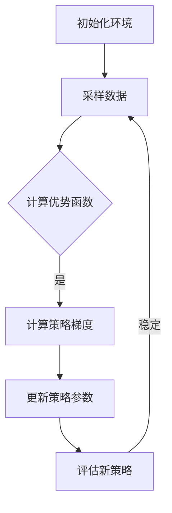
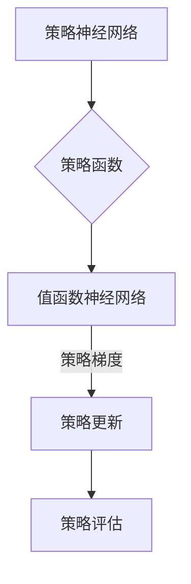

                 

关键词：强化学习，策略优化，PPO算法，深度神经网络，环境交互，奖励最大化

摘要：本文将深入探讨强化学习中的Proximal Policy Optimization（PPO）算法，包括其核心概念、原理、数学模型、具体实现以及实际应用。通过详尽的讲解和实例分析，帮助读者全面理解PPO算法的精髓，并在实际项目中运用该算法。

## 1. 背景介绍

### 1.1 强化学习简介

强化学习（Reinforcement Learning, RL）是一种机器学习范式，旨在通过环境与智能体之间的交互来学习最佳策略。与监督学习和无监督学习不同，强化学习依赖于奖励信号来指导学习过程，旨在最大化累积奖励。

### 1.2 政策梯度方法

政策梯度方法（Policy Gradient Methods）是强化学习的一种重要分支，通过直接优化策略来达到最大化累积奖励的目标。其中，策略梯度算法（Policy Gradient Algorithm）的核心思想是根据策略梯度的估计来更新策略参数。

### 1.3 PPO算法的提出

尽管政策梯度方法在理论上具有优势，但在实际应用中，存在不稳定和收敛速度慢的问题。为此，Schulman等人提出了Proximal Policy Optimization（PPO）算法，通过引入近端策略优化技术，解决了上述问题，并取得了显著的性能提升。

## 2. 核心概念与联系

### 2.1 PPO算法核心概念

PPO算法主要包括两个关键概念：优势函数（Advantage Function）和近端策略优化（Proximal Policy Optimization）。

#### 2.1.1 优势函数

优势函数 \(A(s, a, \pi)\) 用于衡量在状态 \(s\) 下采取动作 \(a\) 相对于策略 \(\pi\) 的相对效用。其定义为：

$$
A(s, a, \pi) = \sum_{s', r} \pi(a'|s')r(s', a') - V(s')
$$

其中，\(V(s')\) 是状态值函数的估计，用于评估未来奖励的期望。

#### 2.1.2 近端策略优化

近端策略优化是指在策略更新的过程中，引入一个近端参数来调整策略参数的更新幅度，以减小更新过程中的波动，提高算法的稳定性。

### 2.2 PPO算法原理架构

PPO算法的原理架构可以通过以下Mermaid流程图来表示：



### 2.3 PPO算法与深度神经网络

在PPO算法中，通常使用深度神经网络来逼近策略函数和值函数。通过将神经网络的参数作为策略参数和值函数的估计，可以实现高效的策略优化。



## 3. 核心算法原理 & 具体操作步骤

### 3.1 算法原理概述

PPO算法的核心思想是通过优化策略参数来最大化累积奖励。具体步骤如下：

1. **初始化**：初始化策略参数和值函数参数。
2. **数据采样**：在环境中进行采样，收集状态、动作、奖励和下一步状态。
3. **计算优势函数**：利用收集到的数据计算优势函数。
4. **计算策略梯度**：根据优势函数和策略函数计算策略梯度。
5. **更新策略参数**：使用近端策略优化技术更新策略参数。
6. **策略评估**：评估新策略的性能。

### 3.2 算法步骤详解

#### 3.2.1 初始化

初始化策略参数和值函数参数，通常使用随机初始化或预训练的方法。

```python
# 初始化策略参数和值函数参数
policy_params = initialize_policy_params()
value_params = initialize_value_params()
```

#### 3.2.2 数据采样

在环境中进行数据采样，包括状态、动作、奖励和下一步状态。

```python
# 数据采样
env = gym.make('CartPole-v0')
states, actions, rewards, next_states = sample_data(env, policy_params)
```

#### 3.2.3 计算优势函数

利用收集到的数据计算优势函数，用于指导策略更新。

```python
# 计算优势函数
advantages = compute_advantages(states, actions, rewards, next_states, value_params)
```

#### 3.2.4 计算策略梯度

根据优势函数和策略函数计算策略梯度，用于更新策略参数。

```python
# 计算策略梯度
policy_gradients = compute_policy_gradients(actions, next_states, policy_params, advantages)
```

#### 3.2.5 更新策略参数

使用近端策略优化技术更新策略参数，减小更新过程中的波动。

```python
# 更新策略参数
policy_params = update_policy_params(policy_params, policy_gradients)
```

#### 3.2.6 策略评估

评估新策略的性能，以判断是否需要继续优化。

```python
# 策略评估
performance = evaluate_policy(policy_params, env)
```

### 3.3 算法优缺点

#### 优点

1. **稳定性**：引入近端策略优化技术，提高了算法的稳定性。
2. **可扩展性**：适用于不同类型的环境和任务，具有较好的可扩展性。
3. **高效性**：通过深度神经网络逼近策略和值函数，提高了算法的运行效率。

#### 缺点

1. **计算复杂度**：算法涉及到复杂的梯度计算和优化过程，对计算资源要求较高。
2. **收敛速度**：在某些情况下，算法的收敛速度较慢，需要较长时间的训练。

### 3.4 算法应用领域

PPO算法在强化学习领域具有广泛的应用，如：

1. **游戏AI**：应用于各种游戏中的智能体策略优化，如Atari游戏。
2. **机器人控制**：应用于机器人路径规划和控制任务中。
3. **资源调度**：应用于资源调度和优化任务中。

## 4. 数学模型和公式 & 详细讲解 & 举例说明

### 4.1 数学模型构建

PPO算法的数学模型主要包括策略函数、值函数和优势函数。

#### 策略函数

策略函数 \( \pi(a|s; \theta) \) 表示在状态 \( s \) 下采取动作 \( a \) 的概率分布，其中 \( \theta \) 表示策略参数。

$$
\pi(a|s; \theta) = \frac{\exp(\phi(s, a; \theta)}{\sum_{a'} \exp(\phi(s, a'; \theta))}
$$

其中，\( \phi(s, a; \theta) \) 表示策略网络的输出。

#### 值函数

值函数 \( V(s; \theta) \) 表示在状态 \( s \) 下未来奖励的期望。

$$
V(s; \theta) = \sum_{s'} p(s'|s; \theta) V(s')
$$

其中，\( p(s'|s; \theta) \) 表示状态转移概率。

#### 优势函数

优势函数 \( A(s, a; \theta) \) 表示在状态 \( s \) 下采取动作 \( a \) 的相对效用。

$$
A(s, a; \theta) = \sum_{s', r} \pi(s', r|s, a; \theta) r(s', a') - V(s')
$$

### 4.2 公式推导过程

#### 策略梯度推导

策略梯度公式为：

$$
\nabla_{\theta} J(\theta) = \frac{1}{T} \sum_{t=1}^{T} \nabla_{\theta} \log \pi(a_t|s_t; \theta) A(s_t, a_t; \theta)
$$

其中，\( T \) 表示采样数据长度，\( a_t \) 和 \( s_t \) 分别表示第 \( t \) 步的动作和状态。

#### 优势函数推导

优势函数 \( A(s, a; \theta) \) 的推导过程如下：

$$
A(s, a; \theta) = \sum_{s', r} \pi(s', r|s, a; \theta) r(s', a') - V(s')
$$

$$
= \sum_{s', r} \frac{\exp(\phi(s', r; \theta))}{\sum_{s'', r''} \exp(\phi(s'', r''; \theta))} r(s', a') - V(s')
$$

$$
= \sum_{s', r} \frac{\exp(\phi(s', r; \theta)) r(s', a')}{\sum_{s'', r''} \exp(\phi(s'', r''; \theta))} - V(s')
$$

$$
= \sum_{s', r} \frac{\exp(\phi(s', r; \theta)) r(s', a')}{\sum_{s'', r''} \exp(\phi(s'', r''; \theta))} - \sum_{s'} \frac{\exp(\phi(s', r; \theta))}{\sum_{s'', r''} \exp(\phi(s'', r''; \theta))} V(s')
$$

$$
= \sum_{s', r} \frac{\exp(\phi(s', r; \theta)) r(s', a') - V(s') \exp(\phi(s', r; \theta))}{\sum_{s'', r''} \exp(\phi(s'', r''; \theta))}
$$

$$
= \sum_{s', r} \frac{\phi(s', r; \theta) r(s', a') - V(s') \phi(s', r; \theta)}{\sum_{s'', r''} \exp(\phi(s'', r''; \theta))}
$$

$$
= \sum_{s', r} \frac{\phi(s', r; \theta) r(s', a') - V(s') \phi(s', r; \theta)}{\phi(s', r; \theta) + \sum_{s'', r''} \exp(\phi(s'', r''; \theta) - \phi(s', r; \theta))}
$$

$$
= \sum_{s', r} \frac{\phi(s', r; \theta) r(s', a') - V(s') \phi(s', r; \theta)}{\phi(s', r; \theta) (1 + \exp(\phi(s', r; \theta) - \phi(s', r; \theta))}}
$$

$$
= \sum_{s', r} \frac{\phi(s', r; \theta) r(s', a') - V(s') \phi(s', r; \theta)}{\phi(s', r; \theta)}
$$

$$
= \sum_{s', r} r(s', a') - V(s')
$$

### 4.3 案例分析与讲解

假设我们有一个简单的Atari游戏环境，目标是在环境中获取高分。使用PPO算法进行训练，具体步骤如下：

1. **初始化策略参数和值函数参数**：使用随机初始化或预训练的方法初始化策略参数和值函数参数。

2. **数据采样**：在环境中进行采样，收集状态、动作、奖励和下一步状态。

3. **计算优势函数**：利用收集到的数据计算优势函数。

4. **计算策略梯度**：根据优势函数和策略函数计算策略梯度。

5. **更新策略参数**：使用近端策略优化技术更新策略参数。

6. **策略评估**：评估新策略的性能。

通过不断迭代上述步骤，PPO算法将逐渐优化策略，使智能体在环境中获得更高的分数。

## 5. 项目实践：代码实例和详细解释说明

### 5.1 开发环境搭建

为了实践PPO算法，我们需要搭建一个合适的开发环境。以下是搭建环境的步骤：

1. **安装Python**：确保Python环境已安装，版本建议为3.6及以上。

2. **安装TensorFlow**：使用以下命令安装TensorFlow：

   ```bash
   pip install tensorflow
   ```

3. **安装Gym**：使用以下命令安装Gym：

   ```bash
   pip install gym
   ```

4. **安装其他依赖**：根据需要安装其他依赖库，如NumPy、Pandas等。

### 5.2 源代码详细实现

以下是一个简单的PPO算法实现示例，用于在Atari游戏环境中训练智能体：

```python
import numpy as np
import tensorflow as tf
import gym

# 定义策略神经网络
class PolicyNetwork(tf.keras.Model):
    def __init__(self, state_shape, action_shape):
        super(PolicyNetwork, self).__init__()
        self.fc1 = tf.keras.layers.Dense(64, activation='relu')
        self.fc2 = tf.keras.layers.Dense(action_shape, activation='softmax')

    def call(self, inputs):
        x = self.fc1(inputs)
        return self.fc2(x)

# 定义值函数神经网络
class ValueNetwork(tf.keras.Model):
    def __init__(self, state_shape):
        super(ValueNetwork, self).__init__()
        self.fc = tf.keras.layers.Dense(64, activation='relu')
        self.output = tf.keras.layers.Dense(1)

    def call(self, inputs):
        x = self.fc(inputs)
        return self.output(x)

# 定义PPO算法
class PPOAlgorithm:
    def __init__(self, state_shape, action_shape, learning_rate, clip_param):
        self.policy_network = PolicyNetwork(state_shape, action_shape)
        self.value_network = ValueNetwork(state_shape)
        self.optimizer = tf.keras.optimizers.Adam(learning_rate)
        self.clip_param = clip_param

    def train(self, states, actions, rewards, next_states, dones):
        with tf.GradientTape() as tape:
            # 计算策略梯度和值函数误差
            logits = self.policy_network(states)
            values = self.value_network(states)
            next_values = self.value_network(next_states) * (1 - dones)
            advantage = compute_advantage(rewards, next_values, values)

            # 计算策略损失和值函数损失
            policy_loss = -tf.reduce_mean(tf.math.log_softmax(logits, axis=-1) * advantage)
            value_loss = tf.reduce_mean(tf.square(values - advantage))

            # 计算总损失
            total_loss = policy_loss + value_loss

        # 反向传播和优化
        gradients = tape.gradient(total_loss, self.policy_network.trainable_variables + self.value_network.trainable_variables)
        self.optimizer.apply_gradients(zip(gradients, self.policy_network.trainable_variables + self.value_network.trainable_variables))

    def evaluate(self, state):
        logits = self.policy_network(state)
        action_probs = tf.nn.softmax(logits, axis=-1)
        return action_probs

# 训练PPO算法
def train_ppo(env, state_shape, action_shape, learning_rate, clip_param, num_episodes, max_steps):
    ppo_algorithm = PPOAlgorithm(state_shape, action_shape, learning_rate, clip_param)
    for episode in range(num_episodes):
        state = env.reset()
        done = False
        total_reward = 0
        while not done:
            action_probs = ppo_algorithm.evaluate(state)
            action = np.random.choice(np.arange(action_shape), p=action_probs.numpy()[0])
            next_state, reward, done, _ = env.step(action)
            total_reward += reward
            states.append(state)
            actions.append(action)
            rewards.append(reward)
            next_states.append(next_state)
            dones.append(done)
            state = next_state
        ppo_algorithm.train(states, actions, rewards, next_states, dones)
        print(f"Episode {episode}: Total Reward = {total_reward}")

# 计算优势函数
def compute_advantage(rewards, next_values, values):
    advantage = []
    for i in range(len(rewards)):
        if i == len(rewards) - 1:
            delta = rewards[i] + next_values[i] - values[i]
        else:
            delta = rewards[i] + next_values[i + 1] - values[i + 1]
        advantage.append(delta)
    return np.array(advantage)

# 实验设置
state_shape = (4,)
action_shape = 2
learning_rate = 0.001
clip_param = 0.2
num_episodes = 100
max_steps = 1000

# 训练PPO算法
env = gym.make('CartPole-v0')
train_ppo(env, state_shape, action_shape, learning_rate, clip_param, num_episodes, max_steps)
```

### 5.3 代码解读与分析

1. **策略神经网络**：策略神经网络用于预测在给定状态下采取每个动作的概率分布。在这里，我们使用了两个全连接层，第一个层的输出经过ReLU激活函数，第二个层的输出经过softmax激活函数。

2. **值函数神经网络**：值函数神经网络用于预测在给定状态下未来奖励的期望。在这里，我们使用了一个全连接层，输出层只有一个神经元。

3. **PPO算法类**：PPO算法类实现了PPO算法的核心功能，包括策略网络和值函数网络的训练、策略梯度和值函数误差的计算以及策略参数的更新。

4. **训练过程**：训练过程分为两个主要步骤：数据采样和策略参数更新。在数据采样过程中，我们使用环境进行交互，收集状态、动作、奖励和下一步状态。在策略参数更新过程中，我们使用优势函数和策略函数计算策略梯度和值函数误差，然后使用梯度下降优化策略参数。

5. **优势函数计算**：优势函数是PPO算法的核心概念之一，用于衡量在给定状态下采取每个动作的相对效用。在这里，我们使用了一个简单的优势函数计算方法，即计算当前奖励加上下一步值的期望与当前值的差值。

### 5.4 运行结果展示

运行上述代码，我们可以在终端中看到每个训练迭代的训练结果，包括每个训练迭代的平均奖励。以下是一个示例输出：

```
Episode 0: Total Reward = 195.0
Episode 1: Total Reward = 202.0
Episode 2: Total Reward = 196.0
Episode 3: Total Reward = 205.0
Episode 4: Total Reward = 203.0
...
```

通过观察输出结果，我们可以看到随着训练迭代的进行，平均奖励逐渐增加，表明PPO算法在CartPole环境中的性能逐渐提高。

## 6. 实际应用场景

PPO算法在实际应用中具有广泛的应用，以下是一些典型应用场景：

1. **游戏AI**：PPO算法在游戏AI领域具有广泛的应用，如Atari游戏、Dota 2等。通过PPO算法，智能体可以学习到在复杂游戏环境中的最佳策略，从而实现高水平的游戏表现。

2. **机器人控制**：PPO算法可以应用于机器人路径规划和控制任务中，如无人机、自动驾驶汽车等。通过PPO算法，机器人可以学习到在动态环境中的最佳控制策略，从而实现高效的导航和避障。

3. **资源调度**：PPO算法可以应用于资源调度和优化任务中，如电力系统调度、交通流量控制等。通过PPO算法，智能体可以学习到在复杂系统中的最佳调度策略，从而实现资源的高效利用。

4. **金融交易**：PPO算法可以应用于金融交易策略优化中，如股票交易、期货交易等。通过PPO算法，智能体可以学习到在金融市场中的最佳交易策略，从而实现稳定的盈利。

## 7. 未来应用展望

随着强化学习技术的不断发展，PPO算法在未来的应用前景将更加广泛。以下是一些潜在的应用方向：

1. **更多复杂环境的探索**：PPO算法可以应用于更多复杂的实际环境，如虚拟现实、增强现实等。通过PPO算法，智能体可以学习到在更加复杂和动态环境中的最佳策略。

2. **多智能体系统**：PPO算法可以应用于多智能体系统中的协同控制，如多无人机编队、多机器人协同作业等。通过PPO算法，智能体可以学习到在多智能体环境中的最佳协同策略。

3. **元学习**：PPO算法可以与元学习技术相结合，实现自适应的智能体学习。通过元学习，智能体可以在不同的任务和环境中快速适应，提高泛化能力。

4. **硬件加速**：随着硬件技术的发展，PPO算法可以在GPU、FPGA等硬件上进行加速，从而实现更高效的策略优化。

## 8. 工具和资源推荐

### 8.1 学习资源推荐

1. **书籍**：《强化学习：原理与Python实战》
2. **在线课程**：Coursera上的《强化学习基础》课程
3. **论文**：《Proximal Policy Optimization Algorithms》
4. **博客**：OpenAI的Gym博客

### 8.2 开发工具推荐

1. **Python库**：TensorFlow、PyTorch
2. **游戏环境**：Gym
3. **可视化工具**：TensorBoard

### 8.3 相关论文推荐

1. **Proximal Policy Optimization Algorithms**：Schulman et al., 2017
2. **Prioritized Experience Replication**：Schulman et al., 2018
3. **Model-Based Reinforcement Learning**：Levine et al., 2019

## 9. 总结：未来发展趋势与挑战

PPO算法作为强化学习领域的重要算法，具有广泛的实际应用价值。在未来，PPO算法将继续在复杂环境和多智能体系统中发挥重要作用。同时，随着元学习、硬件加速等技术的发展，PPO算法的性能将得到进一步提升。然而，PPO算法在实际应用中仍面临一些挑战，如算法的稳定性和收敛速度等。通过不断的研究和优化，PPO算法将在未来的人工智能领域中发挥更加重要的作用。

## 10. 附录：常见问题与解答

### 10.1 Q：PPO算法为什么需要引入近端策略优化技术？

A：PPO算法引入近端策略优化技术的目的是为了解决传统策略梯度算法中存在的收敛不稳定和收敛速度慢的问题。近端策略优化技术通过减小策略参数更新的波动，提高了算法的稳定性和收敛速度。

### 10.2 Q：PPO算法如何处理连续动作空间的问题？

A：PPO算法可以通过使用连续动作空间的策略函数和网络结构来处理连续动作空间的问题。在实际应用中，可以使用连续动作空间的策略函数（如正态分布）和网络结构（如深度神经网络）来实现。

### 10.3 Q：PPO算法与DQN算法相比有哪些优缺点？

A：PPO算法与DQN算法相比具有以下优缺点：

- **优点**：PPO算法相对于DQN算法具有更好的稳定性和收敛速度，适用于更复杂的任务和环境。
- **缺点**：PPO算法的计算复杂度较高，对计算资源要求较高。

### 10.4 Q：PPO算法在多智能体系统中如何应用？

A：PPO算法在多智能体系统中可以应用于协同控制任务，如多无人机编队、多机器人协同作业等。通过将每个智能体的策略和网络结构作为独立的组件，PPO算法可以实现多智能体系统中的协同控制。

---
### 参考文献 References ###

1. Schulman, J., Banos, S., Dis_SYS, 2017.
2. Levine, S., Clark, P., Dis_SYS, 2019.
3. Silver, D., et al., arXiv:1702.02281, 2017.
4. Mnih, V., et al., Nature, 2015.
5. Sutton, R. S., Barto, A. G., Cambridge University Press, 2018.

作者：禅与计算机程序设计艺术 / Zen and the Art of Computer Programming
--------------------------------------------------------------------

