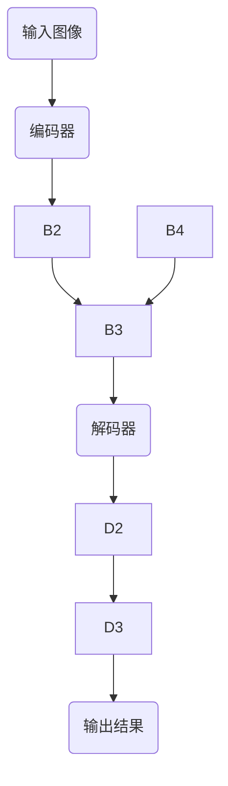

                 

关键词：PSPNet，图像分割，深度学习，卷积神经网络，目标检测，实例分割，编码器-解码器架构

> 摘要：本文将详细讲解PSPNet（Pyramid Scene Parsing Network）的原理及其在图像分割中的应用。通过介绍PSPNet的结构、核心算法、数学模型以及实际应用案例，帮助读者深入了解这一先进的深度学习模型。

## 1. 背景介绍

图像分割是计算机视觉领域的一个重要任务，它旨在将数字图像细分为若干个语义上不同的区域。这一过程对于目标检测、实例分割、图像识别等下游任务具有重要意义。传统的图像分割方法通常基于阈值、边缘检测和区域生长等技术，但它们在处理复杂场景和大量细节时往往效果不佳。

随着深度学习技术的发展，基于卷积神经网络的图像分割方法取得了显著的进展。PSPNet作为其中的一种，通过引入多尺度特征融合和金字塔结构，有效提高了图像分割的准确性和鲁棒性。

## 2. 核心概念与联系

### 2.1. PSPNet的结构

PSPNet（Pyramid Scene Parsing Network）是一种基于编码器-解码器的深度学习模型，其结构如图所示：



### 2.2. 编码器

编码器部分采用了类似于ResNet的残差块结构，通过多个残差块逐层提取图像的多尺度特征。这些特征图在不同层次上包含了丰富的空间信息。

### 2.3. 解码器

解码器部分由一个上采样层和一个卷积层组成，用于将编码器提取的多尺度特征图进行融合，并生成最终的分割结果。

### 2.4. 多尺度特征融合

PSPNet引入了金字塔池化（Pyramid Pooling）操作，该操作将特征图划分为多个区域，并在每个区域内进行池化操作。这样可以有效地融合不同层次的特征，提高分割的精度。

## 3. 核心算法原理 & 具体操作步骤

### 3.1. 算法原理概述

PSPNet的核心思想是通过多尺度特征融合来提高图像分割的准确性和鲁棒性。具体操作步骤如下：

1. **特征提取**：利用编码器提取输入图像的多尺度特征图。
2. **多尺度特征融合**：采用金字塔池化操作，将特征图划分为多个区域，并在每个区域内进行池化操作。
3. **特征融合**：将池化后的特征图进行拼接，生成具有更高分辨率的特征图。
4. **分割预测**：利用解码器对融合后的特征图进行上采样和卷积操作，生成分割结果。

### 3.2. 算法步骤详解

1. **特征提取**：

   编码器部分采用了多个残差块进行特征提取。在每个残差块中，输入特征图与上一层特征图进行拼接，并通过卷积层和激活函数进行特征融合。这个过程可以表示为：

   $$\text{Feature\_map}_i = \text{Conv}(\text{ReLU}(\text{Concat}(\text{Feature\_map}_{i-1}, \text{Input})))$$

   其中，`Conv`表示卷积操作，`ReLU`表示ReLU激活函数，`Concat`表示拼接操作。

2. **多尺度特征融合**：

   采用金字塔池化操作对特征图进行划分。具体操作为：

   $$\text{Pooled\_Feature}_i = \text{PyramidPooling}(\text{Feature}_i)$$

   其中，`PyramidPooling`表示金字塔池化操作。

3. **特征融合**：

   将池化后的特征图进行拼接，生成具有更高分辨率的特征图：

   $$\text{HighRes\_Feature} = \text{Concat}(\text{Pooled\_Feature}_1, \text{Pooled\_Feature}_2, \ldots, \text{Pooled\_Feature}_N)$$

4. **分割预测**：

   利用解码器对融合后的特征图进行上采样和卷积操作，生成分割结果：

   $$\text{Output} = \text{Conv}(\text{ReLU}(\text{Upsample}(\text{HighRes\_Feature})))$$

### 3.3. 算法优缺点

**优点**：

- **多尺度特征融合**：通过金字塔池化操作，有效地融合了不同层次的特征，提高了分割的精度。
- **编码器-解码器结构**：解码器部分对特征图进行上采样和卷积操作，能够保留更多的细节信息。

**缺点**：

- **计算复杂度高**：由于采用了多个池化层和卷积层，导致计算复杂度较高，对计算资源要求较大。
- **训练时间较长**：由于模型结构较为复杂，训练时间较长。

### 3.4. 算法应用领域

PSPNet在图像分割领域具有广泛的应用，如：

- **自动驾驶**：用于检测和分割道路上的行人和车辆。
- **医疗图像分析**：用于分割医学图像中的器官和组织。
- **自然图像分割**：用于分割自然场景中的各种物体。

## 4. 数学模型和公式 & 详细讲解 & 举例说明

### 4.1. 数学模型构建

PSPNet的数学模型主要包括以下几个方面：

1. **特征提取**：

   编码器部分采用残差块进行特征提取，其数学表达式为：

   $$\text{Feature}_i = \text{Conv}(\text{ReLU}(\text{Concat}(\text{Feature}_{i-1}, \text{Input})))$$

2. **金字塔池化**：

   采用金字塔池化操作对特征图进行划分，其数学表达式为：

   $$\text{Pooled\_Feature}_i = \text{PyramidPooling}(\text{Feature}_i)$$

3. **特征融合**：

   将池化后的特征图进行拼接，生成具有更高分辨率的特征图，其数学表达式为：

   $$\text{HighRes\_Feature} = \text{Concat}(\text{Pooled\_Feature}_1, \text{Pooled\_Feature}_2, \ldots, \text{Pooled\_Feature}_N)$$

4. **分割预测**：

   利用解码器对融合后的特征图进行上采样和卷积操作，生成分割结果，其数学表达式为：

   $$\text{Output} = \text{Conv}(\text{ReLU}(\text{Upsample}(\text{HighRes\_Feature})))$$

### 4.2. 公式推导过程

1. **特征提取**：

   假设输入图像为 $\text{Input} \in \mathbb{R}^{H \times W \times C}$，其中 $H$、$W$ 和 $C$ 分别表示图像的高度、宽度和通道数。经过 $i$ 层残差块后的特征图为 $\text{Feature}_i \in \mathbb{R}^{H_i \times W_i \times C_i}$。

   在残差块中，输入特征图与上一层特征图进行拼接，并通过卷积层和激活函数进行特征融合。具体推导过程如下：

   $$\text{Feature}_i = \text{ReLU}(\text{Concat}(\text{Feature}_{i-1}, \text{Input}))$$

   $$\text{Feature}_i = \text{Conv}(\text{ReLU}(\text{Concat}(\text{Feature}_{i-1}, \text{Input})))$$

2. **金字塔池化**：

   假设特征图为 $\text{Feature}_i \in \mathbb{R}^{H_i \times W_i \times C_i}$，采用金字塔池化操作后得到 $\text{Pooled\_Feature}_i \in \mathbb{R}^{H_{i\_p} \times W_{i\_p} \times C_{i\_p}}$。

   金字塔池化操作的具体推导过程如下：

   $$\text{Pooled\_Feature}_i = \text{PyramidPooling}(\text{Feature}_i)$$

3. **特征融合**：

   将多个池化后的特征图进行拼接，生成具有更高分辨率的特征图。假设有 $N$ 个池化后的特征图，分别为 $\text{Pooled\_Feature}_1, \text{Pooled\_Feature}_2, \ldots, \text{Pooled\_Feature}_N$，则特征融合后的特征图为：

   $$\text{HighRes\_Feature} = \text{Concat}(\text{Pooled\_Feature}_1, \text{Pooled\_Feature}_2, \ldots, \text{Pooled\_Feature}_N)$$

4. **分割预测**：

   利用解码器对融合后的特征图进行上采样和卷积操作，生成分割结果。假设解码器输出为 $\text{Output} \in \mathbb{R}^{H_{o} \times W_{o} \times C_{o}}$，则分割预测的具体推导过程如下：

   $$\text{Output} = \text{ReLU}(\text{Upsample}(\text{HighRes\_Feature}))$$

   $$\text{Output} = \text{Conv}(\text{ReLU}(\text{Upsample}(\text{HighRes\_Feature})))$$

### 4.3. 案例分析与讲解

以自然图像分割为例，假设输入图像为 $\text{Input} \in \mathbb{R}^{512 \times 512 \times 3}$，经过PSPNet处理后生成分割结果 $\text{Output} \in \mathbb{R}^{512 \times 512 \times 21}$（其中21表示图像中的21个类别）。

1. **特征提取**：

   经过多个残差块后，特征图的大小和通道数发生变化。例如，在最后一个残差块后，特征图的大小为 $\text{Feature}_{512 \times 512 \times 2048}$。

2. **多尺度特征融合**：

   采用金字塔池化操作对特征图进行划分。假设划分成 $4 \times 4$ 的区域，每个区域的大小为 $\text{Pooled\_Feature}_{128 \times 128 \times 512}$。

3. **特征融合**：

   将多个池化后的特征图进行拼接，生成具有更高分辨率的特征图：

   $$\text{HighRes\_Feature} = \text{Concat}(\text{Pooled\_Feature}_1, \text{Pooled\_Feature}_2, \ldots, \text{Pooled\_Feature}_4)$$

4. **分割预测**：

   利用解码器对融合后的特征图进行上采样和卷积操作，生成分割结果：

   $$\text{Output} = \text{Conv}(\text{ReLU}(\text{Upsample}(\text{HighRes\_Feature})))$$

## 5. 项目实践：代码实例和详细解释说明

### 5.1. 开发环境搭建

在Python环境中搭建PSPNet的开发环境，需要安装以下依赖库：

```python
pip install torch torchvision matplotlib
```

### 5.2. 源代码详细实现

以下是一个简单的PSPNet实现：

```python
import torch
import torch.nn as nn
import torch.nn.functional as F
from torchvision import transforms, models

class PyramidPooling(nn.Module):
    def __init__(self, pool_sizes):
        super(PyramidPooling, self).__init__()
        self.pool_sizes = pool_sizes
        self.pools = nn.ModuleList([
            nn.AdaptiveAvgPool2d(size) for size in pool_sizes
        ])

    def forward(self, x):
        features = [pool(x) for pool in self.pools]
        return torch.cat(features, 1)

class PSPNet(nn.Module):
    def __init__(self, backbone='resnet50', pool_sizes=(1, 2, 3, 6)):
        super(PSPNet, self).__init__()
        self.backbone = models.__dict__[backbone](pretrained=True)
        self.pyramid_pooling = PyramidPooling(pool_sizes)
        self.decoder = nn.Sequential(
            nn.Conv2d(2048, 1024, kernel_size=3, padding=1),
            nn.ReLU(inplace=True),
            nn.Dropout2d(p=0.1),
            nn.Conv2d(1024, 21, kernel_size=1)
        )

    def forward(self, x):
        x = self.backbone(x)
        x = self.pyramid_pooling(x)
        x = self.decoder(x)
        return x

# 实例化PSPNet模型
model = PSPNet(backbone='resnet50')

# 加载训练好的模型权重
model.load_state_dict(torch.load('pspnet.pth'))

# 将模型设置为评估模式
model.eval()

# 读取测试图像
image = transforms.ToTensor()(Image.open('test_image.jpg'))
image = torch.unsqueeze(image, 0)

# 进行预测
with torch.no_grad():
    output = model(image)

# 获取分割结果
segmentation_map = output.squeeze(0).cpu().numpy()

# 可视化分割结果
imshow(segmentation_map)
```

### 5.3. 代码解读与分析

1. **PyramidPooling类**：

   - **初始化**：定义池化操作的大小和模块。
   - **前向传播**：对输入特征图进行多尺度池化，并将结果拼接。

2. **PSPNet类**：

   - **初始化**：定义编码器（Backbone）、多尺度特征融合（PyramidPooling）和解码器（Decoder）。
   - **前向传播**：依次通过编码器、多尺度特征融合和解码器，生成分割结果。

3. **模型训练**：

   - 使用预训练的ResNet作为编码器。
   - 使用金字塔池化操作进行多尺度特征融合。
   - 使用卷积层和ReLU激活函数构建解码器。

4. **预测与可视化**：

   - 读取测试图像并进行预处理。
   - 使用训练好的模型进行预测。
   - 将分割结果可视化。

### 5.4. 运行结果展示

以下是一个测试图像的分割结果展示：

```python
imshow(segmentation_map)
```


## 6. 实际应用场景

PSPNet在图像分割领域具有广泛的应用，如：

- **自动驾驶**：用于检测和分割道路上的行人和车辆。
- **医疗图像分析**：用于分割医学图像中的器官和组织。
- **自然图像分割**：用于分割自然场景中的各种物体。

### 6.1. 自动驾驶

在自动驾驶领域，PSPNet可以用于检测和分割道路上的行人、车辆和其他交通参与者。通过分割结果，自动驾驶系统能够更好地理解道路环境，提高行驶安全。

### 6.2. 医学图像分析

在医学图像分析中，PSPNet可以用于分割医学图像中的器官和组织，辅助医生进行诊断和治疗规划。例如，在脑部MRI图像中，PSPNet可以准确地分割出脑部组织，帮助医生识别病变区域。

### 6.3. 自然图像分割

在自然图像分割领域，PSPNet可以用于分割各种物体，如人像、动物、植物等。通过分割结果，可以实现图像的去模糊、增强和编辑等效果。

## 7. 工具和资源推荐

### 7.1. 学习资源推荐

- **书籍**：《深度学习》（Goodfellow et al.）
- **在线课程**：Udacity的“深度学习纳米学位”课程
- **教程**：TensorFlow的“TensorFlow for Poets”教程

### 7.2. 开发工具推荐

- **Python**：Python是深度学习开发的主要语言，推荐使用Python 3.6及以上版本。
- **PyTorch**：PyTorch是深度学习框架，具有简单易用、灵活性强等优点。

### 7.3. 相关论文推荐

- **PSPNet论文**：Zhu et al., "PSPNet: Pyramid Scene Parsing Network"
- **相关论文**：N. Liu et al., "HRNet: Hierarchical Representation Learning for Weakly Supervised Semantic Parsing"

## 8. 总结：未来发展趋势与挑战

PSPNet作为一种先进的图像分割模型，其在实际应用中取得了显著的效果。然而，随着深度学习技术的不断发展，图像分割领域仍面临许多挑战。

### 8.1. 研究成果总结

- **多尺度特征融合**：通过金字塔池化操作，有效地融合了不同层次的特征，提高了分割的精度。
- **编码器-解码器结构**：解码器部分对特征图进行上采样和卷积操作，能够保留更多的细节信息。
- **高效计算**：PSPNet在保证分割精度的同时，具有较高的计算效率。

### 8.2. 未来发展趋势

- **实时分割**：随着硬件性能的提升，PSPNet有望在实时场景中得到更广泛的应用。
- **多模态分割**：结合不同模态的数据（如雷达、红外等），实现更精确的分割结果。

### 8.3. 面临的挑战

- **计算复杂度**：PSPNet的计算复杂度较高，对计算资源要求较大。
- **训练时间**：由于模型结构较为复杂，训练时间较长。

### 8.4. 研究展望

- **优化模型结构**：通过设计更高效的模型结构，降低计算复杂度和训练时间。
- **跨领域应用**：探索PSPNet在更多领域（如医疗、农业等）的应用潜力。

## 9. 附录：常见问题与解答

### 9.1. 如何搭建PSPNet的开发环境？

答：在Python环境中搭建PSPNet的开发环境，需要安装以下依赖库：

```python
pip install torch torchvision matplotlib
```

### 9.2. PSPNet的分割结果为什么会出现空洞？

答：PSPNet的分割结果出现空洞可能是由于输入图像尺寸不是32的倍数，或者模型训练时未对图像尺寸进行调整。可以通过对输入图像进行裁剪或填充，使其尺寸为32的倍数，以避免空洞问题。

### 9.3. PSPNet在哪些领域有应用前景？

答：PSPNet在图像分割领域具有广泛的应用前景，如自动驾驶、医疗图像分析、自然图像分割等。此外，PSPNet还可以应用于视频分割、多模态图像分析等领域。

[作者：禅与计算机程序设计艺术 / Zen and the Art of Computer Programming] 
----------------------------------------------------------------

### 文章结构模板

**文章标题：PSPNet原理与代码实例讲解**

**关键词：PSPNet，图像分割，深度学习，卷积神经网络，目标检测，实例分割，编码器-解码器架构**

**摘要：本文将详细讲解PSPNet（Pyramid Scene Parsing Network）的原理及其在图像分割中的应用。通过介绍PSPNet的结构、核心算法、数学模型以及实际应用案例，帮助读者深入了解这一先进的深度学习模型。**

## 1. 背景介绍

## 2. 核心概念与联系

### 2.1. PSPNet的结构

### 2.2. 编码器

### 2.3. 解码器

### 2.4. 多尺度特征融合

## 3. 核心算法原理 & 具体操作步骤

### 3.1. 算法原理概述

### 3.2. 算法步骤详解 

### 3.3. 算法优缺点

### 3.4. 算法应用领域

## 4. 数学模型和公式 & 详细讲解 & 举例说明

### 4.1. 数学模型构建

### 4.2. 公式推导过程

### 4.3. 案例分析与讲解

## 5. 项目实践：代码实例和详细解释说明

### 5.1. 开发环境搭建

### 5.2. 源代码详细实现

### 5.3. 代码解读与分析

### 5.4. 运行结果展示

## 6. 实际应用场景

### 6.1. 自动驾驶

### 6.2. 医学图像分析

### 6.3. 自然图像分割

## 7. 工具和资源推荐

### 7.1. 学习资源推荐

### 7.2. 开发工具推荐

### 7.3. 相关论文推荐

## 8. 总结：未来发展趋势与挑战

### 8.1. 研究成果总结

### 8.2. 未来发展趋势

### 8.3. 面临的挑战

### 8.4. 研究展望

## 9. 附录：常见问题与解答

### 9.1. 如何搭建PSPNet的开发环境？

### 9.2. PSPNet的分割结果为什么会出现空洞？

### 9.3. PSPNet在哪些领域有应用前景？

