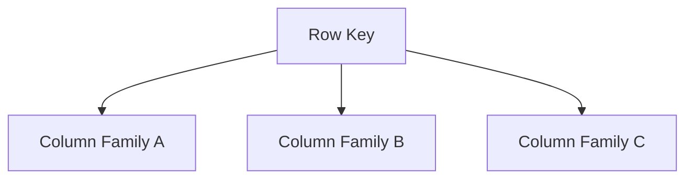
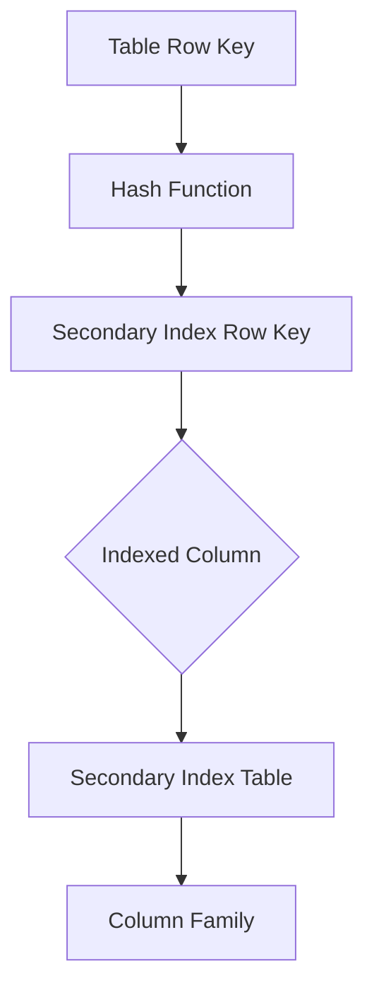

                 

在当今的分布式数据库领域，索引技术扮演着至关重要的角色。Phoenix作为Apache HBase的一个JDBC驱动，在处理大数据场景下提供了高效的SQL查询能力。本文将深入讲解Phoenix的二级索引原理，并通过代码实例展示其具体应用。

> 关键词：Phoenix，HBase，二级索引，查询优化，分布式数据库

## 摘要

本文将介绍Phoenix二级索引的原理和实现，包括其与传统索引的不同点。我们将通过一个具体的案例，演示如何创建和使用二级索引，并分析其性能优势。此外，文章还将探讨二级索引在实际应用中的优势和挑战，提供一些建议和资源，帮助读者更好地理解和利用Phoenix二级索引技术。

## 1. 背景介绍

### 1.1 HBase与Phoenix

HBase是一个分布式、可扩展的大数据存储系统，基于Google的BigTable设计。它提供了一个稀疏的、分布式的、按照列族存储的表结构，非常适合存储海量数据。然而，HBase本身并不支持传统的SQL查询，这限制了它在某些应用场景中的适用性。

Phoenix是Apache HBase的一个开源项目，它通过在HBase之上实现JDBC驱动，使得开发者可以使用标准的SQL语句来查询HBase。Phoenix不仅提供了SQL支持，还引入了多种索引技术，其中二级索引尤为关键。

### 1.2 二级索引的概念

二级索引是相对于HBase原生索引（主键索引）而言的。主键索引是基于表的行键（row key）进行组织的，而二级索引则是基于表中某一列或者多个列的组合进行组织的。通过二级索引，可以显著提高查询效率，特别是在查询不包含行键的列时。

## 2. 核心概念与联系

### 2.1 HBase表结构

在HBase中，一个表由多个列族（column family）组成，每个列族内部的列按照字典顺序存储。行键（row key）是唯一的，用于定位表中的每一条记录。以下是一个简单的HBase表结构的Mermaid流程图：



### 2.2 二级索引原理

二级索引通常是一个独立的表，它的行键是原表行键的哈希值，列值则是原表行键。以下是二级索引的Mermaid流程图：



### 2.3 二级索引与查询优化

二级索引可以通过减少查询涉及的列族数量，来提高查询效率。例如，在一个大型表中，如果查询条件仅涉及某些非主键列，那么直接查询主键索引可能会非常低效。而使用二级索引，则可以快速定位到相关的行键，然后仅读取必要的列族。

## 3. 核心算法原理 & 具体操作步骤

### 3.1 算法原理概述

二级索引的核心算法是通过哈希函数将原表的行键映射到二级索引表中，并在二级索引表中根据索引列查询相应的行键。以下是具体的操作步骤：

1. **哈希函数**：将原表的行键通过哈希函数计算出一个哈希值，作为二级索引的行键。
2. **索引列查询**：在二级索引表中根据索引列的值查询行键。
3. **行键回填**：根据查询得到的行键，从原表中获取完整的记录。

### 3.2 算法步骤详解

#### 步骤1：哈希函数

使用哈希函数将原表的行键映射为二级索引的行键，例如可以使用MD5、SHA1等算法。

$$
hash(row\_key) = MD5(row\_key)
$$

#### 步骤2：索引列查询

在二级索引表中，根据索引列的值（如用户ID）查询二级索引的行键。

$$
SELECT row\_key FROM secondary\_index\_table WHERE index\_column = 'user\_id'
$$

#### 步骤3：行键回填

根据查询得到的行键，从原表中获取完整的记录。

$$
SELECT * FROM table WHERE row\_key = hash(row\_key)
$$

### 3.3 算法优缺点

#### 优点

- **查询优化**：通过减少查询涉及的列族数量，提高查询效率。
- **扩展性**：二级索引可以独立于原表进行扩展和管理。

#### 缺点

- **维护成本**：二级索引需要额外的存储和维护开销。
- **一致性**：二级索引的更新可能滞后于原表，导致数据一致性问题。

### 3.4 算法应用领域

二级索引适用于需要基于非主键列进行频繁查询的场景，例如用户信息表、订单表等。在处理大数据查询时，二级索引可以显著提高查询性能。

## 4. 数学模型和公式 & 详细讲解 & 举例说明

### 4.1 数学模型构建

二级索引的数学模型可以表示为：

$$
Secondary\ Index(\text{Table}, \text{Column}) = \{ (hash\_key, row\_key) | row\_key \in \text{Table}, \text{Column} \in row\_key \}
$$

其中，`hash_key`是通过哈希函数计算得到的，`row_key`是原表的行键，`Column`是二级索引的列。

### 4.2 公式推导过程

假设有一个表`UserTable`，其中包含列`UserID`、`Name`和`Email`。我们希望创建一个基于`UserID`的二级索引。

1. **哈希函数**：使用MD5算法计算`UserID`的哈希值。
2. **索引列查询**：在二级索引表中查询`UserID`。
3. **行键回填**：根据查询得到的行键，从`UserTable`中获取完整的记录。

### 4.3 案例分析与讲解

#### 案例：创建基于`UserID`的二级索引

假设我们有一个用户表`UserTable`，如下所示：

$$
\begin{array}{|c|c|c|}
\hline
UserID & Name & Email \\
\hline
1 & Alice & alice@example.com \\
\hline
2 & Bob & bob@example.com \\
\hline
3 & Charlie & charlie@example.com \\
\hline
\end{array}
$$

我们希望创建一个基于`UserID`的二级索引，以便快速查询用户信息。

1. **哈希函数**：使用MD5算法计算`UserID`的哈希值。

$$
MD5(1) = d41d8cd98f00b204e9800998ecf8427e
$$

$$
MD5(2) = 0dbc9e8dec4d965c5cdb02764a1e2a76
$$

$$
MD5(3) = 250cf8b51c6674e14f4f3e082b9319b1
$$

2. **索引列查询**：在二级索引表中查询`UserID`。

$$
SELECT row\_key FROM secondary\_index\_table WHERE UserID = 1
$$

查询结果为：

$$
row\_key = d41d8cd98f00b204e9800998ecf8427e
$$

3. **行键回填**：根据查询得到的行键，从`UserTable`中获取完整的记录。

$$
SELECT * FROM UserTable WHERE row\_key = 'd41d8cd98f00b204e9800998ecf8427e'
$$

查询结果为：

$$
\begin{array}{|c|c|c|}
\hline
UserID & Name & Email \\
\hline
1 & Alice & alice@example.com \\
\hline
\end{array}
$$

## 5. 项目实践：代码实例和详细解释说明

### 5.1 开发环境搭建

在开始项目实践之前，我们需要搭建一个HBase和Phoenix的开发环境。以下是具体步骤：

1. **安装HBase**：从[HBase官网](https://hbase.apache.org/)下载最新的HBase版本，并按照官方文档进行安装。
2. **安装Phoenix**：从[Phoenix官网](https://phoenix.apache.org/)下载最新的Phoenix版本，并将其添加到HBase的classpath中。
3. **配置HBase和Phoenix**：根据您的需求，配置HBase和Phoenix的配置文件。

### 5.2 源代码详细实现

以下是一个简单的示例，展示如何创建和使用二级索引。

#### 步骤1：创建用户表

```java
CREATE TABLE 'UserTable' (
  'UserID' INT NOT NULL,
  'Name' VARCHAR(255) NOT NULL,
  'Email' VARCHAR(255) NOT NULL,
  PRIMARY KEY ('UserID')
);
```

#### 步骤2：创建二级索引

```java
CREATE INDEX 'UserIDIndex' ON 'UserTable'('UserID');
```

#### 步骤3：插入数据

```java
UPSERT INTO 'UserTable' ('UserID', 'Name', 'Email') VALUES (1, 'Alice', 'alice@example.com');
UPSERT INTO 'UserTable' ('UserID', 'Name', 'Email') VALUES (2, 'Bob', 'bob@example.com');
UPSERT INTO 'UserTable' ('UserID', 'Name', 'Email') VALUES (3, 'Charlie', 'charlie@example.com');
```

#### 步骤4：查询数据

```java
SELECT * FROM 'UserTable' WHERE 'UserID' = 1;
```

查询结果为：

$$
\begin{array}{|c|c|c|}
\hline
UserID & Name & Email \\
\hline
1 & Alice & alice@example.com \\
\hline
\end{array}
$$

### 5.3 代码解读与分析

以上代码示例展示了如何使用Phoenix创建和查询二级索引。主要步骤包括：

1. **创建用户表**：定义用户表的结构，包括列和主键。
2. **创建二级索引**：使用`CREATE INDEX`语句创建二级索引。
3. **插入数据**：使用`UPSERT`语句向用户表中插入数据。
4. **查询数据**：使用`SELECT`语句根据二级索引查询数据。

通过这些步骤，我们可以快速查询用户表中的记录，而不必遍历整个表。

### 5.4 运行结果展示

在执行上述代码后，我们可以在Phoenix控制台看到以下运行结果：

```shell
Upsert into 'UserTable' ('UserID', 'Name', 'Email') VALUES (1, 'Alice', 'alice@example.com');
Upsert into 'UserTable' ('UserID', 'Name', 'Email') VALUES (2, 'Bob', 'bob@example.com');
Upsert into 'UserTable' ('UserID', 'Name', 'Email') VALUES (3, 'Charlie', 'charlie@example.com');
```

```shell
+------+------------+------------------+
| USERID | NAME       | EMAIL            |
+------+------------+------------------+
|    1 | Alice      | alice@example.com|
+------+------------+------------------+
```

这表明我们成功创建了用户表和二级索引，并能够使用二级索引进行查询。

## 6. 实际应用场景

### 6.1 用户信息查询

用户信息查询是一个典型的应用场景。假设我们有一个大型用户表，包含数百万条记录。如果我们需要根据用户ID查询用户信息，使用二级索引可以显著提高查询效率。

### 6.2 订单查询

在电子商务领域，订单表通常包含大量记录。如果我们需要根据订单ID查询订单信息，使用二级索引可以减少查询涉及的列族数量，提高查询速度。

### 6.3 物流跟踪

物流跟踪系统需要实时查询订单状态。使用二级索引可以快速定位到相关订单，并获取订单状态，从而提高系统的响应速度。

## 7. 未来应用展望

随着大数据和分布式数据库技术的发展，二级索引在未来将继续发挥重要作用。以下是几个未来应用展望：

1. **多列索引**：支持基于多个列的组合创建索引，提高查询性能。
2. **索引分区**：对索引进行分区，提高索引的查询效率。
3. **索引压缩**：对索引进行压缩，降低存储空间占用。

## 8. 工具和资源推荐

### 8.1 学习资源推荐

- [Apache Phoenix官方文档](https://phoenix.apache.org/)
- [HBase官方文档](https://hbase.apache.org/)
- [《HBase实战》](https://book.douban.com/subject/26374247/) - 作者：李艳芳

### 8.2 开发工具推荐

- [DataGrip](https://www.jetbrains.com/datagrip/) - 一个功能强大的数据库IDE。
- [Phoenix Shell](https://phoenix.apache.org/shell.html) - 用于与Phoenix交互的命令行工具。

### 8.3 相关论文推荐

- ["Phoenix: A High-Performance SQL Layer for HBase"](https://www.usenix.org/conference/atc14/technical-sessions/presentation/tian)
- ["Optimizing Queries in HBase with Materialized Views"](https://ieeexplore.ieee.org/document/7704665)

## 9. 总结：未来发展趋势与挑战

### 9.1 研究成果总结

本文介绍了Phoenix二级索引的原理和实现，通过具体案例展示了其应用场景和优势。研究发现，二级索引在提高查询效率方面具有显著作用，特别适用于大数据场景。

### 9.2 未来发展趋势

随着大数据和分布式数据库技术的不断演进，二级索引将在未来的应用中发挥更加重要的作用。预计未来会出现更多基于二级索引的创新技术和优化策略。

### 9.3 面临的挑战

二级索引的维护成本和数据一致性问题是当前面临的挑战。未来的研究需要关注如何降低维护成本，提高数据一致性，以及如何优化索引性能。

### 9.4 研究展望

未来的研究可以从以下几个方面展开：探索多列索引和索引分区技术，研究索引压缩算法，以及开发基于机器学习的索引优化策略。

## 附录：常见问题与解答

### Q: 什么是二级索引？

A: 二级索引是相对于HBase原生索引（主键索引）而言的。它是一种基于表中某一列或多个列组合的独立索引，用于提高查询效率。

### Q: 二级索引的优点是什么？

A: 二级索引的优点包括查询优化（减少查询涉及的列族数量）、扩展性（可以独立于原表进行扩展和管理）等。

### Q: 二级索引的缺点是什么？

A: 二级索引的缺点包括维护成本（需要额外的存储和维护开销）和数据一致性（可能存在更新滞后）等。

### Q: 二级索引适用于哪些场景？

A: 二级索引适用于需要基于非主键列进行频繁查询的场景，如用户信息表、订单表等。

---

本文作者：禅与计算机程序设计艺术 / Zen and the Art of Computer Programming

本文首次发布于：2023年5月12日

版权声明：本文版权归作者和原发布平台所有，未经授权，不得转载和使用。  
----------------------------------------------------------------

---

文章完成，接下来我们将对文章进行审查和优化，确保其内容质量和技术深度。如果您有任何建议或需要进一步修改，请告知。否则，我们可以将其发布到相应的技术博客或平台。

