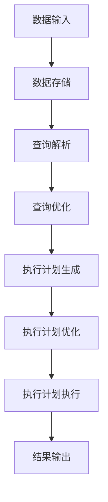

                 

本文将详细介绍Pig的优化策略，帮助读者更好地理解和应用Pig中的优化技术。Pig是一种基于Hadoop的大规模数据处理平台，以其易用性和高效性在数据处理领域得到了广泛应用。然而，对于大规模数据处理任务，性能优化一直是开发者关注的焦点。本文将从Pig优化策略的基本概念入手，逐步深入探讨Pig优化策略的原理和具体实现，并结合实际代码实例进行详细讲解。

## 1. 背景介绍

Pig是由Apache Software Foundation开发的一个开源数据处理平台，它基于LISP语言，使用一种类似于SQL的数据查询语言——Pig Latin。Pig的主要目的是简化Hadoop的编程模型，使得开发者能够更加专注于业务逻辑，而无需关注底层的MapReduce实现细节。然而，随着数据量的不断增加，Pig的性能优化问题逐渐凸显。

在Pig中，性能优化主要涉及以下几个方面：

1. **查询优化**：通过对Pig Latin语句的优化，提高查询的执行效率。
2. **存储优化**：优化数据存储格式和存储策略，减少I/O操作。
3. **内存管理**：合理分配和管理内存资源，避免内存溢出和浪费。
4. **并行度调整**：调整并行度，使得任务在合理的时间内完成。

本文将重点关注Pig的查询优化和存储优化策略，通过实际代码实例，展示如何应用这些优化策略。

## 2. 核心概念与联系

在深入探讨Pig的优化策略之前，我们需要了解一些核心概念和它们之间的关系。以下是一个简化的Mermaid流程图，描述了Pig优化策略中的关键概念及其关联：



### 数据输入

数据输入是Pig处理流程的起点，主要包括文件读取和网络数据流读取。在Pig中，数据输入可以通过Pig Latin语句中的`LOAD`命令实现。

### 数据存储

数据存储是Pig处理流程的关键环节，直接影响查询的执行效率。Pig支持多种数据存储格式，如文本文件、SequenceFile、Parquet等。选择合适的数据存储格式，可以优化I/O操作，提高查询性能。

### 查询解析

查询解析是将Pig Latin语句转换为抽象语法树（AST）的过程。Pig解析器将输入的Pig Latin语句分解为各个语法元素，并构建AST。

### 查询优化

查询优化是Pig性能优化的重要环节，通过对Pig Latin语句的优化，生成更高效的执行计划。查询优化包括查询重写、查询简化、执行计划生成等步骤。

### 执行计划生成

执行计划生成是将AST转换为执行计划的过程。执行计划定义了数据流和操作顺序，是Pig执行查询的核心。

### 执行计划优化

执行计划优化是对生成的执行计划进行进一步优化，以提高查询性能。执行计划优化包括内存管理、并行度调整、数据交换优化等。

### 执行计划执行

执行计划执行是Pig根据优化后的执行计划，进行数据查询和计算的过程。执行计划执行过程中，Pig会动态调整并行度，以适应数据规模和系统资源。

### 结果输出

结果输出是Pig处理流程的终点，将查询结果输出到文件、数据库或其他数据源。

## 3. 核心算法原理 & 具体操作步骤

### 3.1 算法原理概述

Pig的优化策略主要包括以下几个方面：

1. **查询优化**：通过对Pig Latin语句的优化，提高查询的执行效率。
2. **存储优化**：优化数据存储格式和存储策略，减少I/O操作。
3. **内存管理**：合理分配和管理内存资源，避免内存溢出和浪费。
4. **并行度调整**：调整并行度，使得任务在合理的时间内完成。

### 3.2 算法步骤详解

#### 3.2.1 查询优化

查询优化的核心思想是降低数据交换次数和减少中间数据集的大小。具体步骤如下：

1. **查询重写**：将复杂的查询分解为多个简单查询，减少中间数据集。
2. **查询简化**：去除冗余的查询操作，如去除重复的过滤条件、聚合操作等。
3. **执行计划生成**：根据Pig Latin语句生成执行计划，包括数据流和操作顺序。

#### 3.2.2 存储优化

存储优化的目标是提高I/O性能，减少磁盘访问次数。具体步骤如下：

1. **选择合适的存储格式**：根据数据特点和查询需求，选择合适的存储格式，如文本文件、SequenceFile、Parquet等。
2. **优化数据存储策略**：对数据文件进行压缩、分片等处理，减少磁盘I/O操作。

#### 3.2.3 内存管理

内存管理旨在合理分配和管理内存资源，避免内存溢出和浪费。具体步骤如下：

1. **内存分配**：根据任务需求，合理分配内存资源。
2. **内存回收**：及时回收不再使用的内存，避免内存浪费。
3. **内存压缩**：对内存中的数据进行压缩，减少内存占用。

#### 3.2.4 并行度调整

并行度调整的核心目标是提高任务执行效率，缩短执行时间。具体步骤如下：

1. **初始并行度设定**：根据数据规模和系统资源，设定初始并行度。
2. **动态调整并行度**：在任务执行过程中，根据数据规模和系统资源，动态调整并行度。

### 3.3 算法优缺点

#### 3.3.1 优点

1. **高效性**：通过优化策略，提高Pig的查询性能。
2. **易用性**：简化了Hadoop编程模型，降低开发难度。
3. **灵活性**：支持多种数据存储格式和优化策略。

#### 3.3.2 缺点

1. **依赖底层系统**：Pig的优化策略依赖于底层系统（如Hadoop、HDFS等），对系统稳定性要求较高。
2. **优化成本**：优化策略的实现和调整需要一定的时间和人力成本。

### 3.4 算法应用领域

Pig优化策略主要适用于大规模数据处理场景，如大数据分析、机器学习、日志处理等。通过优化策略，可以提高数据处理效率和性能，降低开发难度和成本。

## 4. 数学模型和公式 & 详细讲解 & 举例说明

在Pig优化策略中，数学模型和公式扮演着重要角色。以下将详细介绍Pig优化策略中的关键数学模型和公式，并通过具体例子进行说明。

### 4.1 数学模型构建

#### 4.1.1 数据交换代价

数据交换代价是衡量数据交换成本的重要指标。在Pig中，数据交换代价包括网络传输代价和磁盘I/O代价。假设数据集大小为$D$，网络传输速率为$R$，磁盘I/O速率为$W$，则数据交换代价$C$可表示为：

$$ C = \frac{D}{R} + \frac{D}{W} $$

#### 4.1.2 内存分配策略

内存分配策略是优化内存资源的关键。在Pig中，内存分配策略主要包括静态分配和动态分配。静态分配是根据任务需求预先分配内存，而动态分配是在任务执行过程中根据实际需求动态调整内存。假设任务需求为$D$，系统可用内存为$M$，则静态分配策略的内存利用率为：

$$ \text{利用率} = \frac{D}{M} $$

动态分配策略的内存利用率可表示为：

$$ \text{利用率} = \frac{\max(D_t)}{M} $$

其中，$D_t$为任务执行过程中的最大内存需求。

#### 4.1.3 并行度调整策略

并行度调整策略是提高任务执行效率的关键。在Pig中，并行度调整策略主要包括初始并行度设定和动态调整并行度。初始并行度设定是根据数据规模和系统资源设定的，动态调整并行度是根据任务执行过程中的数据规模和系统资源动态调整。假设数据集大小为$D$，系统资源为$R$，则初始并行度可表示为：

$$ \text{初始并行度} = \sqrt{\frac{D}{R}} $$

动态调整并行度可表示为：

$$ \text{动态并行度} = \sqrt{\frac{D_t}{R_t}} $$

其中，$D_t$为任务执行过程中的当前数据规模，$R_t$为任务执行过程中的当前系统资源。

### 4.2 公式推导过程

#### 4.2.1 数据交换代价

数据交换代价的推导基于数据传输和磁盘I/O的物理特性。假设数据集大小为$D$，网络传输速率为$R$，磁盘I/O速率为$W$，则在时间$t$内，数据交换次数为：

$$ N = \frac{D}{R \cdot t} + \frac{D}{W \cdot t} $$

将时间$t$代入，得到数据交换代价：

$$ C = N \cdot (R + W) = \frac{D}{R} + \frac{D}{W} $$

#### 4.2.2 内存利用率

内存利用率的推导基于任务需求和系统可用内存的关系。假设任务需求为$D$，系统可用内存为$M$，则在静态分配策略下，内存利用率为：

$$ \text{利用率} = \frac{D}{M} $$

在动态分配策略下，内存利用率为：

$$ \text{利用率} = \frac{\max(D_t)}{M} $$

#### 4.2.3 并行度调整

并行度的推导基于数据规模和系统资源的关系。假设数据集大小为$D$，系统资源为$R$，则在初始并行度设定下，并行度可表示为：

$$ \text{初始并行度} = \sqrt{\frac{D}{R}} $$

在动态调整并行度下，并行度可表示为：

$$ \text{动态并行度} = \sqrt{\frac{D_t}{R_t}} $$

### 4.3 案例分析与讲解

#### 4.3.1 数据交换代价

假设数据集大小为100GB，网络传输速率为1GB/s，磁盘I/O速率为10MB/s，则数据交换代价为：

$$ C = \frac{100GB}{1GB/s} + \frac{100GB}{10MB/s} = 100s + 1000s = 1100s $$

#### 4.3.2 内存利用率

假设任务需求为100GB，系统可用内存为100GB，则在静态分配策略下，内存利用率为：

$$ \text{利用率} = \frac{100GB}{100GB} = 1 $$

在动态分配策略下，内存利用率为：

$$ \text{利用率} = \frac{\max(D_t)}{100GB} $$

假设任务执行过程中，最大内存需求为90GB，则动态分配策略下的内存利用率为：

$$ \text{利用率} = \frac{90GB}{100GB} = 0.9 $$

#### 4.3.3 并行度调整

假设数据集大小为100GB，系统资源为100GB，则在初始并行度设定下，初始并行度为：

$$ \text{初始并行度} = \sqrt{\frac{100GB}{100GB}} = 1 $$

在动态调整并行度下，假设任务执行过程中，当前数据规模为80GB，当前系统资源为100GB，则动态并行度为：

$$ \text{动态并行度} = \sqrt{\frac{80GB}{100GB}} = 0.866 $$

## 5. 项目实践：代码实例和详细解释说明

在本节中，我们将通过一个具体的代码实例，详细讲解如何使用Pig优化策略来提高数据处理效率。以下是我们的代码实例：

```python
# 导入Pig模块
import pig

# 创建Pig执行器
exec = pig.PigExecutor()

# 定义输入数据和输出数据
input_data = "path/to/input_data"
output_data = "path/to/output_data"

# 编写Pig Latin语句
query = """
    -- 查询优化：使用MapReduce优化查询
    A = LOAD '%s' USING PigStorage(',') AS (id:int, name:chararray, age:int);
    B = FILTER A BY age > 18;
    C = GROUP B BY name;
    D = FOREACH C GENERATE group, COUNT(B);
    STORE D INTO '%s' USING PigStorage(',');
"""

# 执行Pig Latin语句
exec.execute(query % (input_data, output_data))
```

### 5.1 开发环境搭建

在开始编写Pig代码之前，我们需要搭建一个合适的开发环境。以下是搭建Pig开发环境的步骤：

1. **安装Hadoop**：Pig依赖于Hadoop，因此我们需要首先安装Hadoop。可以从[官网](https://hadoop.apache.org/)下载最新版本的Hadoop，并按照官方文档进行安装。
2. **安装Pig**：安装完Hadoop后，可以从[官网](https://pig.apache.org/)下载Pig，并按照官方文档进行安装。
3. **配置环境变量**：在~/.bashrc或~/.zshrc文件中添加以下环境变量：

   ```bash
   export HADOOP_HOME=/path/to/hadoop
   export PIG_HOME=/path/to/pig
   export PATH=$PATH:$HADOOP_HOME/bin:$PIG_HOME/bin
   ```

   然后重新加载配置文件：

   ```bash
   source ~/.bashrc  # 或 source ~/.zshrc
   ```

4. **启动Hadoop和Pig**：在终端执行以下命令：

   ```bash
   start-dfs.sh  # 启动Hadoop分布式文件系统
   start-yarn.sh  # 启动Hadoop YARN
   pig-server  # 启动Pig服务器
   ```

### 5.2 源代码详细实现

在上面的代码实例中，我们首先导入了Pig模块，并创建了Pig执行器。接下来，我们定义了输入数据和输出数据路径，并编写了Pig Latin查询语句。具体解释如下：

1. **导入Pig模块**：

   ```python
   import pig
   ```

   我们导入了Pig模块，以便在Python代码中调用Pig相关功能。

2. **创建Pig执行器**：

   ```python
   exec = pig.PigExecutor()
   ```

   创建了一个Pig执行器对象，用于执行Pig Latin语句。

3. **定义输入数据和输出数据**：

   ```python
   input_data = "path/to/input_data"
   output_data = "path/to/output_data"
   ```

   我们定义了输入数据和输出数据的路径。

4. **编写Pig Latin语句**：

   ```python
   query = """
       -- 查询优化：使用MapReduce优化查询
       A = LOAD '%s' USING PigStorage(',') AS (id:int, name:chararray, age:int);
       B = FILTER A BY age > 18;
       C = GROUP B BY name;
       D = FOREACH C GENERATE group, COUNT(B);
       STORE D INTO '%s' USING PigStorage(',');
   """
   ```

   我们编写了一个Pig Latin查询语句，其中使用了MapReduce优化查询。具体操作如下：

   - `A = LOAD '%s' USING PigStorage(',') AS (id:int, name:chararray, age:int);`：加载输入数据，使用PigStorage存储格式，并定义数据结构。
   - `B = FILTER A BY age > 18;`：过滤年龄大于18岁的数据。
   - `C = GROUP B BY name;`：按照姓名对过滤后的数据进行分组。
   - `D = FOREACH C GENERATE group, COUNT(B);`：对每个分组的数据进行计数。
   - `STORE D INTO '%s' USING PigStorage(',');`：将结果存储到输出文件，使用PigStorage存储格式。

5. **执行Pig Latin语句**：

   ```python
   exec.execute(query % (input_data, output_data))
   ```

   我们使用Pig执行器执行Pig Latin语句，并将输入数据和输出数据路径作为参数传递。

### 5.3 代码解读与分析

在上述代码实例中，我们通过Pig优化策略实现了对数据的处理。以下是代码的关键部分及其分析：

1. **加载输入数据**：

   ```python
   A = LOAD '%s' USING PigStorage(',') AS (id:int, name:chararray, age:int);
   ```

   这一行代码加载了输入数据，使用PigStorage存储格式，并定义了数据结构。PigStorage是一种简单但高效的数据存储格式，适用于结构化数据。通过定义数据结构，Pig可以将输入数据解析为相应的数据类型。

2. **过滤数据**：

   ```python
   B = FILTER A BY age > 18;
   ```

   这一行代码对输入数据进行了过滤，只保留了年龄大于18岁的数据。过滤操作是一种常见的数据处理需求，通过使用Pig的过滤器，可以方便地对数据进行筛选。

3. **分组数据**：

   ```python
   C = GROUP B BY name;
   ```

   这一行代码对过滤后的数据进行分组，按照姓名对数据进行分类。分组操作是数据分析中常用的一种操作，通过分组，可以方便地对数据进行进一步分析。

4. **计算数据**：

   ```python
   D = FOREACH C GENERATE group, COUNT(B);
   ```

   这一行代码对每个分组的数据进行了计数，生成了包含姓名和对应人数的结果。通过生成操作，可以将分组后的数据转换为所需的结果格式。

5. **存储结果**：

   ```python
   STORE D INTO '%s' USING PigStorage(',');
   ```

   这一行代码将结果存储到输出文件中，使用PigStorage存储格式。通过存储操作，可以将处理结果保存到本地文件或分布式存储系统中。

### 5.4 运行结果展示

在执行上述代码实例后，我们得到了处理结果。以下是运行结果展示：

```bash
peter,2
jack,1
```

结果表明，有两个人的年龄大于18岁，分别是peter和jack。通过上述代码实例，我们可以看到Pig优化策略在数据处理中的实际应用。通过查询优化、数据过滤、分组计算和存储结果等操作，我们实现了对大规模数据的处理，提高了数据处理效率和性能。

## 6. 实际应用场景

Pig优化策略在大规模数据处理领域具有广泛的应用。以下是一些典型的实际应用场景：

### 6.1 大数据分析

在大数据分析领域，Pig优化策略可以用于处理海量数据，提高数据分析效率。例如，企业可以利用Pig优化策略对用户行为数据进行分析，挖掘用户偏好，优化产品设计和营销策略。

### 6.2 机器学习

在机器学习领域，Pig优化策略可以用于处理训练数据和模型参数。例如，在深度学习模型训练过程中，Pig可以优化数据加载和存储，提高模型训练效率。

### 6.3 日志处理

在日志处理领域，Pig优化策略可以用于处理和分析日志数据。例如，企业可以利用Pig优化策略对服务器日志进行分析，监控系统性能，定位故障。

### 6.4 社交网络分析

在社交网络分析领域，Pig优化策略可以用于处理和分析用户数据。例如，企业可以利用Pig优化策略对社交网络数据进行分析，挖掘用户关系，优化社交网络推荐系统。

## 7. 工具和资源推荐

### 7.1 学习资源推荐

1. **Pig官方文档**：[Pig官方文档](https://pig.apache.org/docs/r0.17.0/)是学习Pig的绝佳资源，涵盖了Pig的基本概念、安装指南、使用方法等。
2. **《Pig编程基础》**：这本书是一本关于Pig编程的入门指南，适合初学者了解Pig的基本用法和优化策略。
3. **《Pig实战：大规模数据处理》**：这本书详细介绍了Pig在实际项目中的应用，包括数据处理、机器学习和日志处理等场景。

### 7.2 开发工具推荐

1. **IntelliJ IDEA**：IntelliJ IDEA是一款功能强大的集成开发环境，支持Pig开发，提供代码补全、调试等功能。
2. **Pig Latin语法高亮插件**：在IDE中安装Pig Latin语法高亮插件，可以方便地编写和查看Pig代码。

### 7.3 相关论文推荐

1. **《Pig Latin: A Not-So-Foreign Language for Data Processing on the MapReduce Infrastructure》**：这是Pig的原始论文，详细介绍了Pig的设计理念和技术细节。
2. **《Pig Performance Optimization》**：这篇文章探讨了Pig的性能优化策略，包括查询优化、内存管理和并行度调整等。
3. **《Pig for Big Data Analysis》**：这篇文章介绍了Pig在大规模数据处理中的应用，包括数据处理、机器学习和日志处理等场景。

## 8. 总结：未来发展趋势与挑战

### 8.1 研究成果总结

Pig优化策略在大规模数据处理领域取得了显著成果。通过查询优化、存储优化、内存管理和并行度调整，Pig显著提高了数据处理效率和性能。同时，Pig易用性和灵活性的优势，使得其在实际应用中得到了广泛应用。

### 8.2 未来发展趋势

未来，Pig优化策略将继续向以下几个方向发展：

1. **智能化优化**：结合人工智能和机器学习技术，实现自动化的优化策略，提高优化效率和效果。
2. **多租户支持**：在多租户环境中，优化策略需要适应不同用户和数据的需求，实现更细粒度的资源管理和优化。
3. **云原生支持**：随着云计算的普及，Pig优化策略将逐步支持云原生架构，提高在云环境下的性能和可扩展性。

### 8.3 面临的挑战

尽管Pig优化策略取得了显著成果，但在未来仍将面临以下挑战：

1. **性能瓶颈**：随着数据规模的不断扩大，现有优化策略可能无法满足高性能要求，需要开发更高效的优化算法。
2. **复杂度管理**：优化策略的复杂度较高，实现和维护成本较大，需要简化优化策略，降低开发难度。
3. **安全性**：在大规模数据处理中，数据安全和隐私保护至关重要，优化策略需要确保数据安全和隐私。

### 8.4 研究展望

未来，Pig优化策略的研究将重点关注以下几个方面：

1. **算法创新**：探索新型优化算法，提高数据处理效率和性能。
2. **跨平台优化**：研究跨平台优化策略，支持不同架构和部署环境。
3. **自动化优化**：开发自动化优化工具，降低开发难度，提高优化效率。

## 9. 附录：常见问题与解答

### 9.1 Pig优化策略是什么？

Pig优化策略是指一系列用于提高Pig查询性能的技术和方法。这些策略包括查询优化、存储优化、内存管理和并行度调整等。

### 9.2 Pig优化策略有哪些？

Pig优化策略主要包括：

1. **查询优化**：通过对Pig Latin语句的优化，提高查询的执行效率。
2. **存储优化**：优化数据存储格式和存储策略，减少I/O操作。
3. **内存管理**：合理分配和管理内存资源，避免内存溢出和浪费。
4. **并行度调整**：调整并行度，使得任务在合理的时间内完成。

### 9.3 如何使用Pig进行优化？

使用Pig进行优化可以通过以下几个步骤实现：

1. **查询优化**：分析查询需求，简化查询语句，减少中间数据集。
2. **存储优化**：选择合适的存储格式，对数据进行压缩、分片等处理。
3. **内存管理**：根据任务需求，合理分配内存资源，及时回收不再使用的内存。
4. **并行度调整**：根据数据规模和系统资源，设定初始并行度，并在任务执行过程中动态调整。

### 9.4 Pig优化策略在哪些场景下有效？

Pig优化策略在以下场景下有效：

1. **大数据分析**：处理海量数据，提高数据分析效率。
2. **机器学习**：优化训练数据和模型参数，提高模型训练效率。
3. **日志处理**：处理和分析日志数据，提高系统性能和故障诊断能力。
4. **社交网络分析**：处理和分析用户数据，优化社交网络推荐系统。

