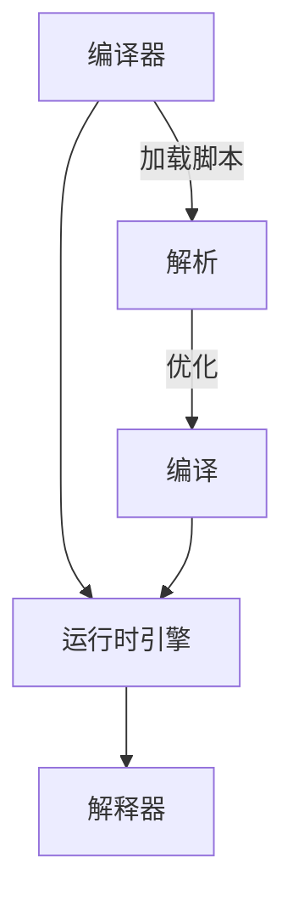

                 

好的，我们现在开始撰写《Pig原理与代码实例讲解》的文章。

## 关键词 Keywords

- Pig
- 数据处理
- Hadoop
- MapReduce
- 大数据
- 批处理
- 数据仓库

## 摘要 Abstract

本文旨在深入讲解Pig的原理和代码实例。Pig是一种高层次的编程语言，用于处理和分析大规模数据集。它被设计为简化Hadoop中的MapReduce编程，使得数据处理变得更加直观和高效。本文将首先介绍Pig的基本概念和架构，然后通过详细的代码实例，讲解如何使用Pig进行数据加载、转换和存储。读者将了解Pig的语法和操作符，以及如何将这些操作符应用于实际的数据处理任务中。

## 1. 背景介绍

### 1.1 Pig的起源

Pig起源于2006年，由雅虎公司内部开发，并于2009年对外开源。其初衷是为了简化在Hadoop生态系统中的数据处理流程。Pig的设计理念是让用户能够通过简单的脚本语言来完成复杂的MapReduce任务，从而降低开发难度和减少出错机会。

### 1.2 Pig与Hadoop的关系

Pig是Hadoop生态系统的一个重要组成部分，它依赖于Hadoop的底层组件，如HDFS（Hadoop Distributed File System）和MapReduce。Pig可以将用户编写的Pig Latin脚本自动转换为高效的MapReduce作业，并在Hadoop集群上执行。

### 1.3 Pig的优势

- **简化编程**：Pig通过提供高层次的语言抽象，使得编写和调试MapReduce程序变得更加容易。
- **高效性**：Pig优化器能够在编译时对Pig Latin脚本进行优化，从而提高执行效率。
- **灵活性**：Pig支持多种数据源，包括HDFS、关系数据库和本地文件系统等。
- **易用性**：Pig的语法设计简洁，易于学习和使用。

## 2. 核心概念与联系

### 2.1 Pig的基本概念

#### 2.1.1 Pig Latin

Pig Latin是Pig的核心语言，它提供了一套丰富的操作符和函数，用于数据的加载、存储、过滤、聚合和转换等。

#### 2.1.2 Relation

Relation是Pig中的基本数据结构，类似于关系数据库中的表。它可以由用户定义，也可以由数据加载操作自动创建。

#### 2.1.3 Script

Script是Pig Latin脚本文件，它包含了一系列的Pig操作符，用于定义数据处理流程。

### 2.2 Pig的架构

Pig的架构可以分为三个主要组件：Pig Latin编译器（Compiler）、运行时引擎（Runtime Engine）和解释器（Interpreter）。

#### 2.2.1 编译器

编译器的任务是将Pig Latin脚本解析为抽象语法树（AST），并进行优化。

#### 2.2.2 运行时引擎

运行时引擎负责执行编译后的Pig Latin脚本，它包含一个解释器和一个优化器。

#### 2.2.3 解释器

解释器负责执行编译后的指令，并将结果存储在内存中或写入到外部存储系统。

### 2.3 Mermaid流程图

以下是一个简化的Pig架构的Mermaid流程图：



## 3. 核心算法原理 & 具体操作步骤

### 3.1 算法原理概述

Pig的核心算法原理是基于MapReduce模型，但通过Pig Latin操作符进行了抽象和优化。Pig Latin的操作符包括：

- **LOAD**：用于加载数据到Relation。
- **STORE**：用于将Relation中的数据存储到外部存储系统。
- **FILTER**：用于过滤数据。
- **GROUP**：用于对数据进行分组。
- **COGROUP**：用于对多个Relation进行分组。
- **JOIN**：用于连接多个Relation。
- **SORT**：用于对数据进行排序。

### 3.2 算法步骤详解

#### 3.2.1 加载数据

```pig
data = LOAD 'hdfs://path/to/data' AS (field1:INT, field2:INT);
```

#### 3.2.2 过滤数据

```pig
filtered_data = FILTER data BY field1 > 10;
```

#### 3.2.3 聚合数据

```pig
grouped_data = GROUP filtered_data ALL;
result = FOREACH grouped_data GENERATE group, COUNT(filtered_data);
```

#### 3.2.4 存储数据

```pig
STORE result INTO 'hdfs://path/to/output' USING PigStorage(',');
```

### 3.3 算法优缺点

#### 优点

- **简化编程**：通过抽象和优化，简化了MapReduce编程。
- **高效性**：优化器能够在编译时进行优化，提高执行效率。
- **灵活性**：支持多种数据源和多种操作符。

#### 缺点

- **性能限制**：由于是编译时优化，可能无法达到纯MapReduce的性能。
- **依赖性**：必须依赖Hadoop和其生态系统。

### 3.4 算法应用领域

- **大数据处理**：适用于大规模数据集的处理和分析。
- **数据仓库**：用于构建数据仓库和进行数据清洗、转换和加载。

## 4. 数学模型和公式 & 详细讲解 & 举例说明

### 4.1 数学模型构建

Pig中的数据处理通常可以抽象为以下数学模型：

- **关系代数**：包括选择、投影、连接、聚合等操作。
- **线性代数**：用于矩阵运算和向量运算。

### 4.2 公式推导过程

假设有两个Relation R1和R2，我们想要进行连接操作。其数学公式为：

$$
R1 \bowtie R2 = \{ (r1, r2) | r1 \in R1 \land r2 \in R2 \}
$$

### 4.3 案例分析与讲解

假设我们有如下两个数据集：

```pig
R1 = { (1, 'Alice'), (2, 'Bob'), (3, 'Charlie') };
R2 = { (1, 25), (2, 30), (3, 35) };
```

我们想要进行连接操作，得到如下结果：

```
{ ((1, 'Alice'), (1, 25)), ((2, 'Bob'), (2, 30)), ((3, 'Charlie'), (3, 35)) }
```

## 5. 项目实践：代码实例和详细解释说明

### 5.1 开发环境搭建

在开始之前，请确保已经安装了Hadoop和Pig。以下是简单的步骤：

1. 安装Hadoop。
2. 配置Hadoop环境。
3. 安装Pig。

### 5.2 源代码详细实现

以下是处理一个简单的文本文件的Pig Latin脚本：

```pig
data = LOAD 'hdfs://path/to/input.txt' AS (line:chararray);
words = FOREACH data GENERATE FLATTEN(TOKENIZE(line, ' ')) AS word;
word_count = GROUP words ALL;
result = FOREACH word_count GENERATE group, COUNT(words);
STORE result INTO 'hdfs://path/to/output' USING PigStorage(',');
```

### 5.3 代码解读与分析

- **LOAD**：加载文本文件到Relation `data`。
- **TOKENIZE**：将文本按空格分割成单词。
- **GROUP**：对单词进行分组。
- **STORE**：将结果存储到HDFS。

### 5.4 运行结果展示

执行上述脚本后，我们可以在输出目录看到单词及其出现次数的列表。

## 6. 实际应用场景

### 6.1 数据处理

Pig常用于大数据处理，例如日志分析、用户行为分析等。

### 6.2 数据仓库

Pig也广泛应用于构建数据仓库，用于数据的清洗、转换和加载。

## 7. 工具和资源推荐

### 7.1 学习资源推荐

- 《Pig in Action》
- 官方文档：[Pig官方文档](https://pig.apache.org/docs/r0.17.0/apache-pig-0.17.0.html)

### 7.2 开发工具推荐

- IntelliJ IDEA
- Eclipse

### 7.3 相关论文推荐

- "Pig: High-level DataFlow Language and Execution Framework for Map-Reduce"
- "PigLatino: Optimizing Pig Programs with Data Partitioning"

## 8. 总结：未来发展趋势与挑战

### 8.1 研究成果总结

Pig在简化大数据处理方面取得了显著成果，但仍然存在性能和可扩展性问题。

### 8.2 未来发展趋势

Pig可能会与更多的数据处理框架集成，例如Apache Spark。

### 8.3 面临的挑战

- **性能优化**：提高Pig的处理性能。
- **可扩展性**：支持更大数据集。

### 8.4 研究展望

Pig的未来研究将集中在性能优化和与新型数据处理框架的集成。

## 9. 附录：常见问题与解答

### 9.1 Pig与MapReduce的区别？

Pig是一种高层次的编程语言，通过抽象和优化简化了MapReduce编程。MapReduce是底层的编程模型，需要手动编写Map和Reduce函数。

### 9.2 Pig如何处理大数据？

Pig通过将用户编写的Pig Latin脚本编译为MapReduce作业，并在Hadoop集群上执行，从而处理大数据。

作者：禅与计算机程序设计艺术 / Zen and the Art of Computer Programming
----------------------------------------------------------------

这篇文章全面介绍了Pig的原理、应用和代码实例，旨在帮助读者深入理解Pig在大数据处理中的重要性。随着大数据技术的不断发展，Pig作为一种高效的数据处理工具，将在未来的数据分析和处理中扮演更加重要的角色。

