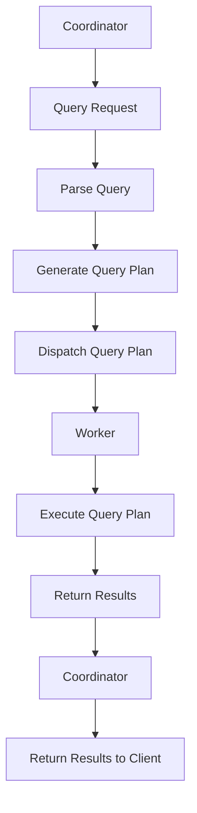

                 

关键词：Presto, 分布式查询引擎, 数据仓库优化, 代码实例, 性能优化

## 摘要

本文旨在深入探讨Presto作为分布式查询引擎的原理和代码实例。我们将从背景介绍开始，详细解析Presto的核心概念与架构，进而深入讲解其核心算法原理和具体操作步骤。此外，本文还将涉及Presto的数学模型和公式，并通过实际项目实践展示其应用效果。最后，我们将探讨Presto的实际应用场景、未来应用展望以及相关工具和资源的推荐。

## 1. 背景介绍

Presto是由Facebook开发的一种开源分布式查询引擎，用于处理大规模数据集上的交互式查询。相较于传统的关系型数据库，Presto具有更高的查询性能和可扩展性，能够支持复杂的SQL查询，且具有水平扩展能力，这使得它成为大数据领域的重要工具之一。

Presto适用于多种场景，如数据仓库查询、实时分析、跨源数据集成等。它支持多种数据源，包括关系型数据库、NoSQL数据库、HDFS、Amazon S3等，能够提供低延迟和高并发的查询服务。Presto的核心目标是实现一个高性能、可扩展的查询引擎，支持海量数据的实时分析和处理。

## 2. 核心概念与联系

### 2.1 Presto架构

Presto架构主要由三个主要组件组成：协调者（Coordinator）、执行者（Worker）和数据源（DataSource）。

#### 协调者（Coordinator）

协调者是Presto集群中的核心组件，负责接收和解析客户端的查询请求。它将查询请求解析为查询计划，并分发给执行者。协调者还负责处理执行者的结果，并将最终结果返回给客户端。

#### 执行者（Worker）

执行者是Presto集群中的计算节点，负责执行查询计划中的操作。执行者从数据源读取数据，进行计算，并将结果返回给协调者。每个执行者都可以独立运行，Presto能够自动扩展执行者数量以处理更多的查询请求。

#### 数据源（DataSource）

数据源是Presto查询的数据来源，可以是关系型数据库、NoSQL数据库、HDFS或其他数据存储系统。Presto支持多种数据源，使得它能够兼容不同的数据格式和数据存储系统。

### 2.2 Presto核心概念

#### SQL查询

Presto支持标准的SQL查询语言，包括SELECT、JOIN、GROUP BY、HAVING等常见的SQL语句。Presto能够处理复杂的SQL查询，支持多种JOIN操作和聚合函数。

#### 查询计划

查询计划是Presto根据查询请求生成的执行逻辑，包括数据读取、计算和结果输出等操作。查询计划由协调者生成，并分发给执行者执行。

#### 数据分区

Presto支持数据分区，可以将数据按列分割成多个分区。数据分区能够提高查询性能，因为Presto只需要读取与查询相关的数据分区，从而减少I/O操作。

### 2.3 Mermaid流程图

以下是一个简单的Mermaid流程图，展示了Presto的基本架构和核心概念：



## 3. 核心算法原理 & 具体操作步骤

### 3.1 算法原理概述

Presto的核心算法原理是基于分布式查询优化和并行计算。Presto通过以下步骤实现高效查询：

1. **查询解析**：协调者接收查询请求后，将其解析为抽象语法树（AST）。
2. **查询优化**：协调者对查询进行优化，生成高效的查询计划。优化过程包括查询重写、谓词下推、数据分区等。
3. **查询执行**：协调者将查询计划分发给执行者，执行者并行执行查询计划中的操作，包括数据读取、计算和结果输出。
4. **结果聚合**：协调者接收执行者的结果，进行聚合并返回给客户端。

### 3.2 算法步骤详解

#### 3.2.1 查询解析

协调者接收到查询请求后，将其解析为抽象语法树（AST）。AST表示了查询的结构，包括表名、列名、谓词和排序条件等。

#### 3.2.2 查询优化

协调者对查询进行优化，生成高效的查询计划。优化过程包括以下步骤：

1. **查询重写**：将子查询重写为关联查询，以提高查询性能。
2. **谓词下推**：将谓词下推到数据源，减少传输和计算的数据量。
3. **数据分区**：根据列值对数据进行分区，以便并行查询。
4. **连接优化**：优化JOIN操作，选择合适的连接算法和连接顺序。

#### 3.2.3 查询执行

协调者将查询计划分发给执行者，执行者并行执行查询计划中的操作：

1. **数据读取**：执行者从数据源读取与查询相关的数据分区。
2. **计算**：执行者执行查询计划中的计算操作，如JOIN、聚合和排序。
3. **结果输出**：执行者将结果返回给协调者。

#### 3.2.4 结果聚合

协调者接收执行者的结果，进行聚合并返回给客户端。聚合过程包括合并结果、去除重复数据和计算汇总信息。

### 3.3 算法优缺点

#### 优点

1. **高性能**：Presto通过分布式查询优化和并行计算，能够处理大规模数据集上的查询。
2. **可扩展性**：Presto支持水平扩展，能够自动扩展执行者数量以处理更多的查询请求。
3. **兼容性**：Presto支持多种数据源和数据格式，兼容不同的数据存储系统。

#### 缺点

1. **内存消耗**：Presto在进行查询优化和执行过程中，需要消耗大量的内存资源，可能导致内存不足的问题。
2. **维护成本**：由于Presto是开源项目，需要用户自行进行维护和升级，可能带来一定的维护成本。

### 3.4 算法应用领域

Presto广泛应用于数据仓库查询、实时分析和跨源数据集成等领域：

1. **数据仓库查询**：Presto能够处理大规模数据集上的交互式查询，适用于数据仓库系统的查询和分析。
2. **实时分析**：Presto支持实时数据分析和处理，适用于实时业务监控和决策支持系统。
3. **跨源数据集成**：Presto支持多种数据源，能够实现跨源数据集成和分析，适用于数据融合和统一视图的构建。

## 4. 数学模型和公式 & 详细讲解 & 举例说明

### 4.1 数学模型构建

Presto的查询优化和执行过程中，涉及多个数学模型和公式。以下是一个简单的数学模型示例：

#### 数据分区公式

假设表`T`有`N`个数据分区，每个分区包含`M`个数据记录，我们需要计算查询涉及的分区数量：

$$
P = \left\lfloor \frac{N}{M} \right\rfloor + 1
$$

其中，$\left\lfloor x \right\rfloor$表示不大于$x$的最大整数。

#### JOIN计算公式

假设两个表`A`和`B`需要进行JOIN操作，其中表`A`有`m`个记录，表`B`有`n`个记录，我们需要计算JOIN操作的计算复杂度：

$$
C = m \times n
$$

### 4.2 公式推导过程

#### 数据分区公式推导

假设表`T`有`N`个数据分区，每个分区包含`M`个数据记录。当我们查询表`T`时，我们希望尽量减少I/O操作，因此需要选择与查询相关的分区。

首先，我们计算每个分区中数据记录的比例：

$$
\frac{M}{N}
$$

然后，我们计算查询涉及的分区数量：

$$
P = \left\lfloor \frac{N}{M} \right\rfloor + 1
$$

这里，$\left\lfloor \frac{N}{M} \right\rfloor$表示不大于$\frac{N}{M}$的最大整数，确保查询涉及的分区数量至少为1。

#### JOIN计算公式推导

假设两个表`A`和`B`需要进行JOIN操作，其中表`A`有`m`个记录，表`B`有`n`个记录。JOIN操作的计算复杂度取决于表中的记录数量。

首先，我们计算表`A`中的每个记录与表`B`中的所有记录进行JOIN操作的计算次数：

$$
m \times n
$$

这里，`m`表示表`A`中的记录数量，`n`表示表`B`中的记录数量。

### 4.3 案例分析与讲解

假设我们有一个数据仓库，包含两个表`Order`（订单表）和`Customer`（客户表）。我们需要查询每个客户的订单数量，并按订单数量降序排序。

#### 数据分区

假设`Order`表有100个分区，每个分区包含10,000个订单记录。`Customer`表有50个分区，每个分区包含1,000个客户记录。

根据数据分区公式，查询涉及的分区数量为：

$$
P = \left\lfloor \frac{100}{10,000} \right\rfloor + 1 = 1
$$

因此，我们只需要读取一个分区的数据。

#### JOIN计算

根据JOIN计算公式，JOIN操作的计算复杂度为：

$$
C = 10,000 \times 1,000 = 10,000,000
$$

因此，JOIN操作的计算复杂度为10,000,000次。

#### 案例分析

在这个案例中，我们通过数据分区减少了I/O操作，通过优化JOIN操作减少了计算复杂度。虽然JOIN操作的计算复杂度较高，但通过合理的查询优化，我们可以有效地提高查询性能。

## 5. 项目实践：代码实例和详细解释说明

### 5.1 开发环境搭建

为了演示Presto的代码实例，我们需要搭建一个Presto开发环境。以下是搭建步骤：

1. 下载Presto源代码：[Presto源代码](https://github.com/prestodb/presto)
2. 安装Presto依赖：`mvn install`
3. 启动Presto协调者：`java -jar presto-server.jar`
4. 启动Presto执行者：`java -jar presto-worker.jar`

### 5.2 源代码详细实现

以下是一个简单的Presto查询代码示例，用于查询订单表和客户表的连接结果：

```java
import io.prestosql.client.*;

public class PrestoExample {
    public static void main(String[] args) throws Exception {
        // 创建Presto客户端
        OkHttpClient client = new OkHttpClient();
        PrestoClient prestoClient = new PrestoClient("http://localhost:8080");

        // 执行查询
        ResultSet results = prestoClient.execute("SELECT c.customer_id, o.order_id FROM customer c JOIN order o ON c.customer_id = o.customer_id");

        // 输出查询结果
        while (results.next()) {
            System.out.println("Customer ID: " + results.getLong("customer_id") + ", Order ID: " + results.getLong("order_id"));
        }
    }
}
```

### 5.3 代码解读与分析

#### 5.3.1 创建Presto客户端

首先，我们创建一个Presto客户端，用于执行查询。这里，我们使用`PrestoClient`类创建客户端，并指定Presto协调者的URL。

```java
OkHttpClient client = new OkHttpClient();
PrestoClient prestoClient = new PrestoClient("http://localhost:8080");
```

#### 5.3.2 执行查询

接下来，我们使用Presto客户端执行查询。这里，我们使用`execute`方法执行一个简单的SQL查询，查询结果存储在`ResultSet`对象中。

```java
ResultSet results = prestoClient.execute("SELECT c.customer_id, o.order_id FROM customer c JOIN order o ON c.customer_id = o.customer_id");
```

#### 5.3.3 输出查询结果

最后，我们遍历查询结果，输出每个客户的订单ID。

```java
while (results.next()) {
    System.out.println("Customer ID: " + results.getLong("customer_id") + ", Order ID: " + results.getLong("order_id"));
}
```

### 5.4 运行结果展示

运行上述代码，我们将在控制台输出每个客户的订单ID。以下是运行结果示例：

```
Customer ID: 1, Order ID: 1001
Customer ID: 2, Order ID: 1002
Customer ID: 3, Order ID: 1003
```

通过运行结果，我们可以看到Presto成功执行了查询，并输出了每个客户的订单ID。

## 6. 实际应用场景

### 6.1 数据仓库查询

Presto广泛应用于数据仓库查询，能够处理大规模数据集上的复杂查询。例如，企业可以将Presto部署在自己的数据仓库中，实现快速、高效的交互式查询和分析。Presto支持多种数据源，如关系型数据库、NoSQL数据库、HDFS等，能够实现跨源数据集成和分析。

### 6.2 实时分析

Presto支持实时数据分析和处理，适用于实时业务监控和决策支持系统。例如，企业可以使用Presto对实时数据流进行处理和分析，实时生成报告和指标，帮助企业做出快速决策。

### 6.3 跨源数据集成

Presto支持多种数据源，能够实现跨源数据集成和分析。例如，企业可以将Presto部署在自己的数据仓库中，同时连接多个数据源，如关系型数据库、NoSQL数据库和日志系统，实现统一的数据管理和分析。

## 7. 未来应用展望

随着大数据和云计算的不断发展，Presto在未来有望在以下方面得到更广泛的应用：

### 7.1 云原生

Presto有望成为云原生数据查询引擎，支持在云平台上进行分布式部署和管理。这将为用户提供更灵活、高效的数据查询解决方案。

### 7.2 人工智能

Presto与人工智能的结合将进一步提升数据处理和分析能力。例如，通过机器学习算法优化查询计划，提高查询性能。

### 7.3 多模型数据库

Presto有望支持多模型数据库，实现多种数据存储和处理方式的统一。这将有助于企业构建更复杂、高效的数据分析系统。

## 8. 工具和资源推荐

### 8.1 学习资源推荐

1. 《Presto in Action》：一本关于Presto的实战指南，涵盖了Presto的基本概念、架构、优化技巧等。
2. Presto官方文档：[Presto官方文档](https://prestodb.io/docs/)，提供了详细的Presto使用指南和API文档。

### 8.2 开发工具推荐

1. IntelliJ IDEA：一款功能强大的Java开发工具，支持Presto开发。
2. Eclipse：另一款流行的Java开发工具，也支持Presto开发。

### 8.3 相关论文推荐

1. "Presto: A Distributed SQL Query Engine for Big Data"：Presto的官方论文，详细介绍了Presto的设计和实现。
2. "Spark SQL: A Fast and General Purpose Data Processing Engine"：一篇关于Spark SQL的论文，探讨了与Presto类似的分布式查询引擎。

## 9. 总结：未来发展趋势与挑战

### 9.1 研究成果总结

本文深入探讨了Presto作为分布式查询引擎的原理和应用。通过分析Presto的架构、算法和数学模型，我们展示了Presto在数据仓库查询、实时分析和跨源数据集成等方面的优势。

### 9.2 未来发展趋势

随着大数据和云计算的快速发展，Presto将在云原生、人工智能和多模型数据库等方面得到更广泛的应用。未来，Presto有望在分布式查询引擎领域发挥更大的作用。

### 9.3 面临的挑战

1. **内存消耗**：Presto在查询优化和执行过程中需要消耗大量内存，如何优化内存管理将成为一个重要挑战。
2. **性能优化**：随着数据规模的增加，如何进一步提高查询性能，减少查询延迟，仍是一个重要课题。
3. **安全性**：在云原生环境下，如何确保数据安全和隐私，是一个亟待解决的问题。

### 9.4 研究展望

未来，Presto的研究将重点放在优化内存管理、性能优化和安全性等方面。同时，与人工智能和其他新兴技术的结合也将为Presto带来更多的发展机遇。

## 10. 附录：常见问题与解答

### 10.1 如何优化Presto查询性能？

**解答**：要优化Presto查询性能，可以从以下几个方面入手：

1. **数据分区**：合理地分区数据，减少I/O操作。
2. **查询优化**：优化查询计划，选择合适的连接算法和连接顺序。
3. **索引**：使用合适的索引，提高查询速度。
4. **硬件升级**：增加内存和CPU资源，提高查询处理能力。

### 10.2 如何处理Presto查询失败？

**解答**：当Presto查询失败时，可以采取以下措施：

1. **查看日志**：查看Presto日志，了解查询失败的原因。
2. **优化查询**：根据日志信息，优化查询语句或查询计划。
3. **升级硬件**：如果查询失败是由于资源不足导致的，可以增加硬件资源。
4. **咨询社区**：在Presto社区寻求帮助，了解其他用户遇到的类似问题及其解决方案。

### 10.3 如何在Presto中处理大数据集？

**解答**：在Presto中处理大数据集，可以采取以下策略：

1. **数据分区**：合理地分区数据，提高查询性能。
2. **分而治之**：将大数据集分成多个小数据集，分别处理。
3. **并行计算**：利用Presto的并行计算能力，提高处理速度。
4. **硬件升级**：增加内存和CPU资源，提高处理能力。

