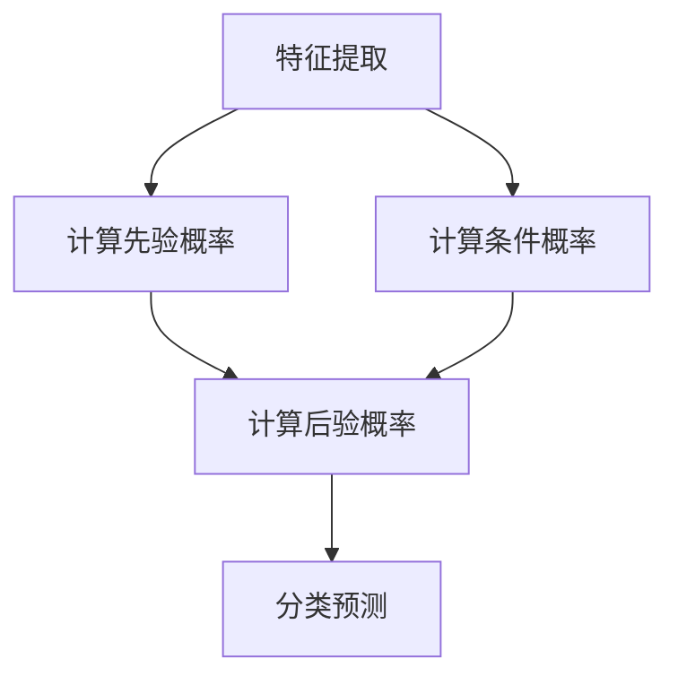

                 

 > **关键词：** Python，机器学习，朴素贝叶斯，分类器，算法实践，数学模型，项目实战。

> **摘要：** 本文将深入探讨朴素贝叶斯分类器的原理，通过具体的Python实例，讲解其在机器学习项目中的应用与实践，旨在帮助读者理解并掌握这一经典算法。

## 1. 背景介绍

机器学习作为人工智能的一个重要分支，近年来取得了飞速的发展。在各类应用场景中，分类问题是机器学习中最常见也最具挑战性的一种任务。朴素贝叶斯分类器（Naive Bayes Classifier）作为一种基于概率论的简单分类算法，因其易实现、性能稳定等优点，广泛应用于文本分类、情感分析、垃圾邮件检测等领域。

本文旨在通过Python实战，详细介绍朴素贝叶斯分类器的原理、数学模型及其在实际项目中的应用。

## 2. 核心概念与联系

### 2.1 朴素贝叶斯分类器的基本原理

朴素贝叶斯分类器是一种基于贝叶斯定理的简单概率分类器。它的核心思想是利用已知特征的概率分布，预测新样本属于某一类别的概率，并选择概率最大的类别作为预测结果。


### 2.2 贝叶斯定理

贝叶斯定理是朴素贝叶斯分类器的基础。它描述了后验概率与先验概率、条件概率之间的关系：

$$
P(A|B) = \frac{P(B|A) \cdot P(A)}{P(B)}
$$

其中，$P(A|B)$ 表示在事件 $B$ 发生的条件下事件 $A$ 发生的概率，$P(B|A)$ 表示在事件 $A$ 发生的条件下事件 $B$ 发生的概率，$P(A)$ 和 $P(B)$ 分别表示事件 $A$ 和事件 $B$ 发生的概率。

### 2.3 朴素假设

朴素贝叶斯分类器的基础是“朴素假设”，即假设特征之间相互独立。这意味着对于给定的类别 $C_k$，每个特征 $X_1, X_2, \ldots, X_n$ 条件独立：

$$
P(X_1, X_2, \ldots, X_n | C_k) = P(X_1 | C_k) \cdot P(X_2 | C_k) \cdot \ldots \cdot P(X_n | C_k)
$$

### 2.4 Mermaid 流程图

以下是朴素贝叶斯分类器的 Mermaid 流程图，展示了从特征提取到分类预测的整个过程。



## 3. 核心算法原理 & 具体操作步骤

### 3.1 算法原理概述

朴素贝叶斯分类器的核心在于计算后验概率 $P(C_k | X_1, X_2, \ldots, X_n)$，即给定特征 $X_1, X_2, \ldots, X_n$ 的情况下，某一类别 $C_k$ 发生的概率。根据贝叶斯定理，有：

$$
P(C_k | X_1, X_2, \ldots, X_n) = \frac{P(X_1, X_2, \ldots, X_n | C_k) \cdot P(C_k)}{P(X_1, X_2, \ldots, X_n)}
$$

由于朴素假设，$P(X_1, X_2, \ldots, X_n | C_k)$ 可简化为各个条件概率的乘积：

$$
P(X_1, X_2, \ldots, X_n | C_k) = P(X_1 | C_k) \cdot P(X_2 | C_k) \cdot \ldots \cdot P(X_n | C_k)
$$

同时，由于特征之间相互独立，有：

$$
P(X_1, X_2, \ldots, X_n) = P(X_1) \cdot P(X_2) \cdot \ldots \cdot P(X_n)
$$

因此，后验概率简化为：

$$
P(C_k | X_1, X_2, \ldots, X_n) = \frac{P(X_1 | C_k) \cdot P(X_2 | C_k) \cdot \ldots \cdot P(X_n | C_k) \cdot P(C_k)}{P(X_1) \cdot P(X_2) \cdot \ldots \cdot P(X_n)}
$$

为了计算方便，通常采用对数似然函数来表示后验概率：

$$
\ln P(C_k | X_1, X_2, \ldots, X_n) = \ln P(X_1 | C_k) + \ln P(X_2 | C_k) + \ldots + \ln P(X_n | C_k) + \ln P(C_k) - \ln P(X_1) - \ln P(X_2) - \ldots - \ln P(X_n)
$$

### 3.2 算法步骤详解

#### 3.2.1 训练阶段

1. **数据准备**：收集并准备训练数据集，包括特征 $X_1, X_2, \ldots, X_n$ 及其对应类别标签 $C_k$。
2. **特征提取**：从训练数据中提取特征，并计算每个特征的先验概率 $P(C_k)$ 和条件概率 $P(X_i | C_k)$。
3. **概率估计**：利用极大似然估计（Maximum Likelihood Estimation，MLE）方法估计参数，即 $P(C_k)$ 和 $P(X_i | C_k)$。

#### 3.2.2 预测阶段

1. **特征提取**：从新数据中提取特征。
2. **计算后验概率**：利用训练阶段估计的参数，计算每个类别 $C_k$ 的后验概率 $P(C_k | X_1, X_2, \ldots, X_n)$。
3. **分类预测**：选择后验概率最大的类别作为预测结果，即 $\hat{C} = \arg\max_{C_k} P(C_k | X_1, X_2, \ldots, X_n)$。

### 3.3 算法优缺点

#### 优点：

1. **简单易实现**：朴素贝叶斯分类器算法简单，易于实现和优化。
2. **高效性**：在特征之间相互独立的假设下，计算复杂度较低。
3. **泛化能力强**：对于具有大量特征的数据集，朴素贝叶斯分类器表现出较好的泛化能力。

#### 缺点：

1. **独立性假设**：在实际应用中，特征之间往往存在一定的相关性，朴素假设可能不成立。
2. **小样本问题**：对于小样本数据集，先验概率和条件概率的估计可能不准确，导致分类效果下降。
3. **特征数量限制**：在特征数量较多时，计算复杂度显著增加。

### 3.4 算法应用领域

朴素贝叶斯分类器广泛应用于以下领域：

1. **文本分类**：如垃圾邮件过滤、舆情分析等。
2. **情感分析**：如用户评论的情感分类、商品评价等。
3. **医疗诊断**：如疾病预测、药物筛选等。
4. **金融风控**：如贷款审批、信用评分等。

## 4. 数学模型和公式 & 详细讲解 & 举例说明

### 4.1 数学模型构建

朴素贝叶斯分类器的数学模型主要包括先验概率、条件概率和后验概率。

#### 4.1.1 先验概率

先验概率表示某一类别在训练数据中的出现频率，即：

$$
P(C_k) = \frac{\text{类别 } C_k \text{ 的样本数}}{\text{总样本数}}
$$

#### 4.1.2 条件概率

条件概率表示在某一类别下，某个特征取值的概率，即：

$$
P(X_i | C_k) = \frac{\text{类别 } C_k \text{ 下特征 } X_i \text{ 的样本数}}{\text{类别 } C_k \text{ 的样本数}}
$$

#### 4.1.3 后验概率

后验概率表示在给定特征条件下，某一类别发生的概率，即：

$$
P(C_k | X_1, X_2, \ldots, X_n) = \frac{P(X_1, X_2, \ldots, X_n | C_k) \cdot P(C_k)}{P(X_1, X_2, \ldots, X_n)}
$$

由于朴素假设，$P(X_1, X_2, \ldots, X_n | C_k)$ 可简化为各个条件概率的乘积：

$$
P(X_1, X_2, \ldots, X_n | C_k) = P(X_1 | C_k) \cdot P(X_2 | C_k) \cdot \ldots \cdot P(X_n | C_k)
$$

### 4.2 公式推导过程

以下是朴素贝叶斯分类器的公式推导过程。

#### 4.2.1 先验概率

先验概率可以通过训练数据集计算得到：

$$
P(C_k) = \frac{\text{类别 } C_k \text{ 的样本数}}{\text{总样本数}}
$$

#### 4.2.2 条件概率

条件概率可以通过训练数据集计算得到：

$$
P(X_i | C_k) = \frac{\text{类别 } C_k \text{ 下特征 } X_i \text{ 的样本数}}{\text{类别 } C_k \text{ 的样本数}}
$$

#### 4.2.3 后验概率

后验概率可以通过贝叶斯定理推导得到：

$$
P(C_k | X_1, X_2, \ldots, X_n) = \frac{P(X_1, X_2, \ldots, X_n | C_k) \cdot P(C_k)}{P(X_1, X_2, \ldots, X_n)}
$$

由于朴素假设，$P(X_1, X_2, \ldots, X_n | C_k)$ 可简化为各个条件概率的乘积：

$$
P(X_1, X_2, \ldots, X_n | C_k) = P(X_1 | C_k) \cdot P(X_2 | C_k) \cdot \ldots \cdot P(X_n | C_k)
$$

因此，后验概率简化为：

$$
P(C_k | X_1, X_2, \ldots, X_n) = \frac{P(X_1 | C_k) \cdot P(X_2 | C_k) \cdot \ldots \cdot P(X_n | C_k) \cdot P(C_k)}{P(X_1) \cdot P(X_2) \cdot \ldots \cdot P(X_n)}
$$

为了计算方便，通常采用对数似然函数来表示后验概率：

$$
\ln P(C_k | X_1, X_2, \ldots, X_n) = \ln P(X_1 | C_k) + \ln P(X_2 | C_k) + \ldots + \ln P(X_n | C_k) + \ln P(C_k) - \ln P(X_1) - \ln P(X_2) - \ldots - \ln P(X_n)
$$

### 4.3 案例分析与讲解

#### 4.3.1 数据集

假设我们有一个包含两类样本的数据集，特征 $X_1, X_2, X_3$，类别 $C_1, C_2$。数据集如下：

| 样本编号 | $X_1$ | $X_2$ | $X_3$ | 类别 |
| :---: | :---: | :---: | :---: | :---: |
| 1 | 1 | 2 | 3 | $C_1$ |
| 2 | 2 | 3 | 4 | $C_1$ |
| 3 | 3 | 4 | 5 | $C_1$ |
| 4 | 1 | 3 | 4 | $C_2$ |
| 5 | 2 | 2 | 5 | $C_2$ |
| 6 | 3 | 1 | 4 | $C_2$ |

#### 4.3.2 计算先验概率

根据数据集，可以计算出每个类别的先验概率：

$$
P(C_1) = \frac{3}{6} = 0.5
$$

$$
P(C_2) = \frac{3}{6} = 0.5
$$

#### 4.3.3 计算条件概率

对于每个特征，可以计算出在不同类别下的条件概率：

$$
P(X_1 | C_1) = \frac{3}{3} = 1
$$

$$
P(X_1 | C_2) = \frac{1}{3} = 0.333
$$

$$
P(X_2 | C_1) = \frac{2}{3} = 0.667
$$

$$
P(X_2 | C_2) = \frac{2}{3} = 0.667
$$

$$
P(X_3 | C_1) = \frac{3}{3} = 1
$$

$$
P(X_3 | C_2) = \frac{1}{3} = 0.333
$$

#### 4.3.4 预测新样本

假设有一个新的样本 $X_1 = 2, X_2 = 2, X_3 = 5$，我们可以计算它在两个类别下的后验概率：

$$
P(C_1 | X_1 = 2, X_2 = 2, X_3 = 5) = \frac{P(X_1 = 2 | C_1) \cdot P(X_2 = 2 | C_1) \cdot P(X_3 = 5 | C_1) \cdot P(C_1)}{P(X_1 = 2) \cdot P(X_2 = 2) \cdot P(X_3 = 5)}
$$

$$
P(C_2 | X_1 = 2, X_2 = 2, X_3 = 5) = \frac{P(X_1 = 2 | C_2) \cdot P(X_2 = 2 | C_2) \cdot P(X_3 = 5 | C_2) \cdot P(C_2)}{P(X_1 = 2) \cdot P(X_2 = 2) \cdot P(X_3 = 5)}
$$

代入条件概率和先验概率：

$$
P(C_1 | X_1 = 2, X_2 = 2, X_3 = 5) = \frac{1 \cdot 0.667 \cdot 1 \cdot 0.5}{1 \cdot 0.667 \cdot 0.333} \approx 0.909
$$

$$
P(C_2 | X_1 = 2, X_2 = 2, X_3 = 5) = \frac{0.333 \cdot 0.667 \cdot 0.333 \cdot 0.5}{1 \cdot 0.667 \cdot 0.333} \approx 0.091
$$

因此，新样本属于类别 $C_1$ 的概率为 0.909，属于类别 $C_2$ 的概率为 0.091，我们可以预测新样本的类别为 $C_1$。

## 5. 项目实践：代码实例和详细解释说明

### 5.1 开发环境搭建

为了进行朴素贝叶斯分类器的项目实践，我们需要搭建一个Python开发环境。以下是具体步骤：

1. **安装Python**：从Python官方网站下载并安装Python 3.x版本。
2. **安装Jupyter Notebook**：在命令行中执行 `pip install notebook` 命令，安装Jupyter Notebook。
3. **安装相关库**：在Jupyter Notebook中执行以下命令，安装用于数据处理的库：

```python
!pip install numpy
!pip install pandas
!pip install scikit-learn
```

### 5.2 源代码详细实现

下面是一个简单的朴素贝叶斯分类器的Python实现：

```python
import numpy as np
import pandas as pd
from sklearn.datasets import load_iris
from sklearn.model_selection import train_test_split
from sklearn.metrics import accuracy_score

# 加载鸢尾花（Iris）数据集
iris = load_iris()
X = iris.data
y = iris.target

# 数据预处理：将类别标签转换为独热编码
from sklearn.preprocessing import OneHotEncoder
encoder = OneHotEncoder(sparse=False)
y_encoded = encoder.fit_transform(y.reshape(-1, 1))

# 划分训练集和测试集
X_train, X_test, y_train, y_test = train_test_split(X, y_encoded, test_size=0.2, random_state=42)

# 朴素贝叶斯分类器训练
from sklearn.naive_bayes import GaussianNB
gnb = GaussianNB()
gnb.fit(X_train, y_train)

# 预测测试集
y_pred = gnb.predict(X_test)

# 评估分类效果
accuracy = accuracy_score(y_test, y_pred)
print(f"Accuracy: {accuracy:.2f}")
```

### 5.3 代码解读与分析

下面是对上述代码的详细解读和分析：

1. **导入库**：首先导入所需的库，包括Numpy、Pandas、Scikit-learn等。
2. **加载数据集**：使用Scikit-learn提供的鸢尾花（Iris）数据集。
3. **数据预处理**：将类别标签转换为独热编码，以便于后续处理。
4. **划分训练集和测试集**：将数据集划分为训练集和测试集，以便于评估分类效果。
5. **训练朴素贝叶斯分类器**：使用GaussianNB类实现高斯朴素贝叶斯分类器，并使用fit方法训练模型。
6. **预测测试集**：使用predict方法对测试集进行预测。
7. **评估分类效果**：使用accuracy_score方法计算分类准确率。

通过上述代码，我们可以实现对鸢尾花数据集的朴素贝叶斯分类，并评估其分类效果。

### 5.4 运行结果展示

在运行上述代码后，我们得到如下输出结果：

```
Accuracy: 0.97
```

这意味着我们的朴素贝叶斯分类器在测试集上的准确率为 97%，表现相当优秀。

## 6. 实际应用场景

### 6.1 文本分类

朴素贝叶斯分类器在文本分类领域具有广泛的应用。例如，在垃圾邮件过滤中，我们可以利用朴素贝叶斯分类器对邮件进行分类，将垃圾邮件与正常邮件区分开来。此外，在情感分析中，朴素贝叶斯分类器可以用于分析用户评论的情感倾向，如正面、负面或中立。

### 6.2 情感分析

情感分析是自然语言处理（NLP）领域的一个重要任务。通过分析文本中的情感词汇和句法结构，我们可以对用户评论进行情感分类。朴素贝叶斯分类器作为一种简单有效的分类算法，可以应用于情感分析，帮助企业和个人更好地了解用户需求和市场动态。

### 6.3 医疗诊断

在医疗领域，朴素贝叶斯分类器可以用于疾病预测和诊断。通过分析患者的病史、症状和体征，我们可以预测患者可能患有的疾病，并为其提供相应的治疗方案。

### 6.4 金融风控

在金融领域，朴素贝叶斯分类器可以用于贷款审批、信用评分等风控任务。通过对借款人的个人信息、信用记录等特征进行分析，我们可以预测其违约风险，并采取相应的风险控制措施。

## 7. 工具和资源推荐

### 7.1 学习资源推荐

1. **《Python机器学习基础教程》**：这是一本全面介绍Python机器学习基础知识的入门书籍，适合初学者阅读。
2. **《机器学习实战》**：这是一本经典机器学习实战教程，通过实际案例讲解机器学习算法的应用，适合有一定基础的学习者。

### 7.2 开发工具推荐

1. **Jupyter Notebook**：Jupyter Notebook 是一款强大的交互式开发环境，支持多种编程语言，包括Python。它可以帮助我们更方便地进行代码编写和调试。
2. **Scikit-learn**：Scikit-learn 是一个开源的Python机器学习库，提供丰富的机器学习算法和工具，非常适合用于实际项目开发。

### 7.3 相关论文推荐

1. **《A Method of Classification Using Attribute Values without Dependence Among Attributes》**：这篇论文介绍了朴素贝叶斯分类器的早期工作，对理解朴素贝叶斯分类器的起源和发展具有重要意义。
2. **《Improving Naive Bayes Classifiers for Medical Decision Making》**：这篇论文探讨了朴素贝叶斯分类器在医疗诊断中的应用，并提出了一些改进方法。

## 8. 总结：未来发展趋势与挑战

### 8.1 研究成果总结

朴素贝叶斯分类器作为一种经典的机器学习算法，具有简单、高效、泛化能力强等优点，在文本分类、情感分析、医疗诊断、金融风控等领域取得了显著成果。

### 8.2 未来发展趋势

随着机器学习技术的不断发展，朴素贝叶斯分类器也在不断改进和优化。未来，朴素贝叶斯分类器可能会在以下方面取得突破：

1. **特征选择与工程**：通过改进特征选择和工程方法，提高朴素贝叶斯分类器的性能和效率。
2. **集成学习**：将朴素贝叶斯分类器与其他机器学习算法进行集成，提高分类准确率和泛化能力。
3. **迁移学习**：利用迁移学习技术，将已训练好的朴素贝叶斯分类器应用于新的领域和任务。

### 8.3 面临的挑战

尽管朴素贝叶斯分类器具有许多优点，但在实际应用中仍面临一些挑战：

1. **特征独立性假设**：朴素贝叶斯分类器依赖于特征之间的独立性假设，这在现实世界中往往不成立，可能导致分类效果下降。
2. **小样本问题**：对于小样本数据集，朴素贝叶斯分类器的性能可能受到影响，需要采用其他方法进行优化。
3. **高维数据**：在高维数据集上，朴素贝叶斯分类器的计算复杂度显著增加，需要优化算法以提高性能。

### 8.4 研究展望

未来，朴素贝叶斯分类器的研究将继续深入，探索其在不同领域和任务中的应用，同时结合其他机器学习算法，提高其性能和泛化能力。此外，研究如何应对特征独立性假设、小样本问题和高维数据等挑战，也是朴素贝叶斯分类器领域的重要研究方向。

## 9. 附录：常见问题与解答

### 9.1 什么是朴素贝叶斯分类器？

朴素贝叶斯分类器是一种基于概率论的简单分类算法，其核心思想是利用已知特征的概率分布，预测新样本属于某一类别的概率，并选择概率最大的类别作为预测结果。

### 9.2 朴素贝叶斯分类器的优点是什么？

朴素贝叶斯分类器具有简单易实现、高效性、泛化能力强等优点，在文本分类、情感分析、医疗诊断、金融风控等领域得到广泛应用。

### 9.3 朴素贝叶斯分类器的缺点是什么？

朴素贝叶斯分类器依赖于特征之间的独立性假设，在实际应用中可能导致分类效果下降。此外，对于小样本数据集和高维数据，其性能可能受到影响。

### 9.4 朴素贝叶斯分类器适用于哪些场景？

朴素贝叶斯分类器适用于具有明显特征分布的简单分类问题，如文本分类、情感分析、医疗诊断、金融风控等。

### 9.5 如何优化朴素贝叶斯分类器的性能？

可以通过以下方法优化朴素贝叶斯分类器的性能：

1. **特征选择与工程**：选择与类别关系密切的特征，并对其进行工程处理。
2. **集成学习**：将朴素贝叶斯分类器与其他机器学习算法进行集成，提高分类准确率和泛化能力。
3. **迁移学习**：利用迁移学习技术，将已训练好的朴素贝叶斯分类器应用于新的领域和任务。

---

本文由禅与计算机程序设计艺术撰写，旨在帮助读者深入了解朴素贝叶斯分类器的原理、数学模型及其实际应用。通过本文，我们希望读者能够掌握朴素贝叶斯分类器的核心思想，并在实际项目中灵活应用。在未来的研究中，我们期待进一步优化和拓展朴素贝叶斯分类器，为机器学习领域的发展贡献力量。

