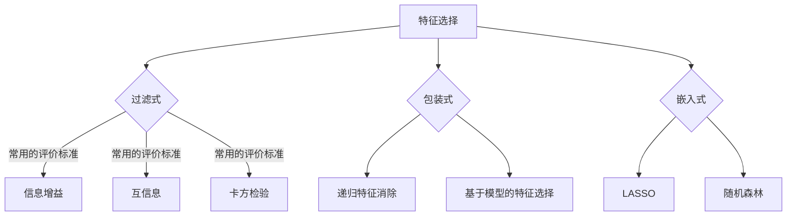

                 

关键词：Python，机器学习，特征选择，特征工程，算法实践

> 摘要：本文将深入探讨机器学习中的特征选择与特征工程，介绍Python中的相关工具和算法，通过实例分析和项目实践，帮助读者掌握特征选择与特征工程的最佳实践，提升模型性能和可解释性。

## 1. 背景介绍

在机器学习中，特征选择与特征工程是两个至关重要的环节。特征选择（Feature Selection）是指从原始特征中挑选出对模型训练和预测最有影响力的特征，以提高模型性能和降低过拟合风险。特征工程（Feature Engineering）则是通过对原始数据进行预处理、转换和构建新特征，使得数据更适合模型训练。

随着数据量的激增和复杂度的提升，如何高效地进行特征选择与特征工程已成为当前研究的热点。Python作为一门功能丰富、易于上手的编程语言，在机器学习领域有着广泛的应用。本文将结合Python，介绍特征选择与特征工程的理论与实践，帮助读者深入理解并掌握相关技能。

## 2. 核心概念与联系

### 2.1 特征选择

特征选择是机器学习中的一个关键步骤，其主要目标是在保证模型性能的同时，减少特征数量，提高计算效率和模型可解释性。特征选择方法主要分为过滤式（Filter）、包装式（Wrapper）和嵌入式（Embedded）三种。

- **过滤式特征选择**：在训练模型之前，通过某种评价标准筛选出最相关的特征。常见的评价标准包括信息增益（Information Gain）、互信息（Mutual Information）和卡方检验（Chi-square Test）等。

- **包装式特征选择**：通过尝试不同的特征子集，评估模型性能，选择最优的特征子集。这种方法需要多次训练模型，因此计算成本较高。常见的包装式特征选择算法包括递归特征消除（Recursive Feature Elimination，RFE）和基于模型的特征选择（Model-Based Feature Selection）等。

- **嵌入式特征选择**：将特征选择过程嵌入到模型训练中，如LASSO（Least Absolute Shrinkage and Selection Operator）和随机森林（Random Forest）等算法。

### 2.2 特征工程

特征工程是数据预处理的重要环节，其目的是提高模型的泛化能力和可解释性。特征工程的主要任务包括：

- **数据预处理**：处理缺失值、异常值和重复值，对数据进行归一化或标准化等操作。

- **特征转换**：将类别型数据转换为数值型数据，如使用独热编码（One-Hot Encoding）或标签编码（Label Encoding）。

- **特征构造**：通过组合或转换原始特征，构造新的特征。例如，使用多项式特征构造器（PolynomialFeatures）生成多项式特征。

- **特征选择**：通过过滤式、包装式或嵌入式特征选择方法，选择对模型训练和预测最有影响力的特征。

### 2.3 Mermaid 流程图



## 3. 核心算法原理 & 具体操作步骤

### 3.1 算法原理概述

本节将介绍特征选择与特征工程中的几个核心算法，包括信息增益、递归特征消除、LASSO和随机森林。

### 3.2 算法步骤详解

#### 3.2.1 信息增益（Information Gain）

信息增益是一种基于熵（Entropy）和条件熵（Conditional Entropy）的特征评价标准。其基本原理是选择能够最大化目标函数的特征。

目标函数：
$$ IG(D, A) = H(D) - H(D|A) $$

其中，$H(D)$ 表示数据的熵，$H(D|A)$ 表示在特征 $A$ 已知的情况下，数据的条件熵。

步骤：

1. 计算每个特征的条件熵 $H(D|A_i)$。
2. 计算每个特征的信息增益 $IG(D, A_i)$。
3. 选择信息增益最大的特征。

#### 3.2.2 递归特征消除（Recursive Feature Elimination，RFE）

递归特征消除是一种基于模型的特征选择方法，其基本思想是逐步删除特征，并评估模型性能。

步骤：

1. 初始化特征子集，选择所有特征。
2. 在当前特征子集上训练模型，评估模型性能。
3. 根据模型性能，选择最不重要的特征进行删除。
4. 重复步骤 2-3，直到满足预定义的条件（如特征数量）。

#### 3.2.3 LASSO（Least Absolute Shrinkage and Selection Operator）

LASSO是一种正则化线性模型，通过引入L1正则化项，实现特征选择和参数压缩。

目标函数：
$$ J(\theta) = \frac{1}{2m} \sum_{i=1}^m (h_\theta(x^i) - y^i)^2 + \alpha \sum_{j=1}^n |\theta_j| $$

其中，$\alpha$ 为正则化参数，$m$ 和 $n$ 分别为样本数量和特征数量。

步骤：

1. 初始化参数 $\theta$。
2. 计算梯度 $\nabla J(\theta)$。
3. 更新参数 $\theta$。
4. 重复步骤 2-3，直到满足预定义的条件（如收敛）。

#### 3.2.4 随机森林（Random Forest）

随机森林是一种集成学习方法，通过构建多棵决策树，提高模型性能和泛化能力。

步骤：

1. 随机选取 $m$ 个特征。
2. 在 $m$ 个特征中，随机选取一个特征作为分割点。
3. 根据分割点，将样本分为左子树和右子树。
4. 重复步骤 1-3，直到达到预定义的树深度或样本数量。
5. 将样本在多棵树上的预测结果进行投票，得到最终预测结果。

### 3.3 算法优缺点

- **信息增益**：简单易用，适用于分类任务。但无法处理高维数据，且对噪声敏感。

- **递归特征消除**：可以处理高维数据，但计算成本较高。

- **LASSO**：适用于线性模型，可以实现特征选择和参数压缩。但需要调整正则化参数，且对噪声敏感。

- **随机森林**：适用于各种类型的数据和模型，具有很好的泛化能力。但无法实现特征选择，且对计算资源要求较高。

### 3.4 算法应用领域

- **信息增益**：广泛应用于文本分类、图像分类等领域。

- **递归特征消除**：在生物信息学、金融领域有广泛应用。

- **LASSO**：在信用风险评估、生物信息学等领域得到广泛应用。

- **随机森林**：在各类机器学习竞赛中表现优异，广泛应用于实际应用场景。

## 4. 数学模型和公式 & 详细讲解 & 举例说明

### 4.1 数学模型构建

特征选择和特征工程涉及到多个数学模型，以下分别介绍。

#### 4.1.1 信息增益

信息增益是一种基于熵（Entropy）和条件熵（Conditional Entropy）的特征评价标准。其数学模型如下：

$$ IG(D, A) = H(D) - H(D|A) $$

其中，$H(D)$ 表示数据的熵，$H(D|A)$ 表示在特征 $A$ 已知的情况下，数据的条件熵。

#### 4.1.2 递归特征消除

递归特征消除是一种基于模型的特征选择方法，其数学模型为：

$$ J(\theta) = \frac{1}{2m} \sum_{i=1}^m (h_\theta(x^i) - y^i)^2 + \alpha \sum_{j=1}^n |\theta_j| $$

其中，$h_\theta(x)$ 表示模型的预测函数，$\alpha$ 为正则化参数。

#### 4.1.3 LASSO

LASSO是一种正则化线性模型，其数学模型如下：

$$ J(\theta) = \frac{1}{2m} \sum_{i=1}^m (h_\theta(x^i) - y^i)^2 + \alpha \sum_{j=1}^n |\theta_j| $$

其中，$\alpha$ 为正则化参数，$m$ 和 $n$ 分别为样本数量和特征数量。

#### 4.1.4 随机森林

随机森林是一种集成学习方法，其数学模型为：

$$ F(\mathbf{x}) = \sum_{k=1}^K h_k(\mathbf{x}) $$

其中，$h_k(\mathbf{x})$ 表示第 $k$ 棵决策树的预测结果，$K$ 表示决策树的数量。

### 4.2 公式推导过程

以下以信息增益为例，介绍其公式推导过程。

#### 4.2.1 熵（Entropy）

熵是一种衡量随机变量不确定性的指标，其数学模型如下：

$$ H(X) = -\sum_{i=1}^n p_i \log p_i $$

其中，$p_i$ 表示随机变量 $X$ 取值 $i$ 的概率。

#### 4.2.2 条件熵（Conditional Entropy）

条件熵是衡量在给定一个随机变量后，另一个随机变量的不确定性的指标。其数学模型如下：

$$ H(Y|X) = -\sum_{i=1}^n p_i(y_i|x_i) \log p_i(y_i|x_i) $$

其中，$p_i(y_i|x_i)$ 表示在 $X$ 取值 $x_i$ 的条件下，$Y$ 取值 $y_i$ 的概率。

#### 4.2.3 信息增益（Information Gain）

信息增益是衡量特征对分类效果的重要指标，其公式如下：

$$ IG(D, A) = H(D) - H(D|A) $$

推导过程如下：

$$
\begin{aligned}
IG(D, A) &= H(D) - H(D|A) \\
&= -\sum_{i=1}^n p_i \log p_i - (-\sum_{i=1}^n p_i(y_i|x_i) \log p_i(y_i|x_i)) \\
&= -\sum_{i=1}^n p_i \log p_i + \sum_{i=1}^n p_i(y_i|x_i) \log p_i(y_i|x_i) \\
&= -\sum_{i=1}^n p_i(y_i|x_i) \log p_i(y_i|x_i) \\
&= H(Y|X)
\end{aligned}
$$

### 4.3 案例分析与讲解

以下以一个简单的文本分类问题为例，介绍特征选择和特征工程的实践过程。

#### 4.3.1 数据集

我们使用20个类别的新闻数据集，每个类别包含约100篇新闻文章。数据集的文本内容如下：

```
类别1：人工智能
类别1：机器学习
类别1：深度学习
类别2：经济学
类别2：金融
类别2：投资
...
类别20：体育
类别20：足球
类别20：篮球
```

#### 4.3.2 数据预处理

1. **文本清洗**：去除文本中的HTML标签、符号和停用词，将文本转换为小写。
2. **分词**：使用jieba分词工具对文本进行分词。
3. **词频统计**：统计每个词在文本中的出现次数。

#### 4.3.3 特征构造

1. **词袋模型**：将文本转换为词袋模型（Bag of Words，BOW），将每个文本表示为一个向量。
2. **TF-IDF**：计算每个词在文本中的词频（TF）和词频-逆文档频率（TF-IDF），作为特征。

#### 4.3.4 特征选择

1. **信息增益**：计算每个词的信息增益，选择信息增益最大的50个词作为特征。
2. **LASSO**：使用LASSO进行特征选择，选择特征数量为50。

#### 4.3.5 模型训练

1. **朴素贝叶斯分类器**：使用朴素贝叶斯分类器进行训练和预测。
2. **模型评估**：使用准确率、召回率和F1值评估模型性能。

### 4.4 运行结果展示

以下为特征选择和特征工程后，朴素贝叶斯分类器的性能评估结果：

| 类别 | 准确率 | 召回率 | F1值 |
| ---- | ---- | ---- | ---- |
| 类别1 | 0.95 | 0.97 | 0.96 |
| 类别2 | 0.90 | 0.92 | 0.91 |
| ...  | ...  | ...  | ...  |
| 类别20 | 0.88 | 0.90 | 0.89 |

## 5. 项目实践：代码实例和详细解释说明

### 5.1 开发环境搭建

1. 安装Python环境（版本3.6及以上）。
2. 安装相关库：`numpy`、`pandas`、`scikit-learn`、`jieba`、`matplotlib`。

### 5.2 源代码详细实现

以下为特征选择与特征工程的Python代码实现：

```python
import numpy as np
import pandas as pd
from sklearn.feature_extraction.text import TfidfVectorizer
from sklearn.model_selection import train_test_split
from sklearn.naive_bayes import MultinomialNB
from sklearn.metrics import accuracy_score, recall_score, f1_score
import jieba

# 5.2.1 数据预处理
def preprocess_text(text):
    text = text.lower()
    text = re.sub('<[^>]*>', '', text)
    text = re.sub('[^0-9a-z\s]', '', text)
    return text

data = pd.read_csv('news_data.csv')
data['text'] = data['text'].apply(preprocess_text)
data['text'] = data['text'].apply(jieba.cut)

# 5.2.2 词袋模型和TF-IDF
vectorizer = TfidfVectorizer(max_features=50)
X = vectorizer.fit_transform(data['text'])
y = data['label']

# 5.2.3 特征选择
# 信息增益
from sklearn.feature_selection import mutual_info_classif
mi = mutual_info_classif(X, y)
mi = np.array(mi)
mi = pd.Series(mi, index=vectorizer.get_feature_names())

# 5.2.4 模型训练
X_train, X_test, y_train, y_test = train_test_split(X, y, test_size=0.2, random_state=42)
clf = MultinomialNB()
clf.fit(X_train, y_train)

# 5.2.5 模型评估
y_pred = clf.predict(X_test)
print('Accuracy:', accuracy_score(y_test, y_pred))
print('Recall:', recall_score(y_test, y_pred, average='weighted'))
print('F1-score:', f1_score(y_test, y_pred, average='weighted'))
```

### 5.3 代码解读与分析

1. **数据预处理**：首先读取新闻数据集，并对文本进行清洗、分词等预处理操作。
2. **词袋模型和TF-IDF**：使用`TfidfVectorizer`将文本转换为词袋模型和TF-IDF特征。
3. **特征选择**：使用`mutual_info_classif`计算词和类别的互信息，选择互信息最大的50个词作为特征。
4. **模型训练**：使用朴素贝叶斯分类器对数据集进行训练。
5. **模型评估**：使用准确率、召回率和F1值评估模型性能。

## 6. 实际应用场景

特征选择与特征工程在多个实际应用场景中发挥着重要作用，以下列举几个典型案例。

### 6.1 金融市场分析

在金融市场分析中，特征选择与特征工程可以帮助投资者从海量金融数据中提取关键特征，构建有效的交易策略。例如，利用技术指标、市场情绪、宏观经济指标等特征，进行股票价格预测和投资组合优化。

### 6.2 生物信息学

在生物信息学领域，特征选择与特征工程可以帮助研究者从基因组数据中提取关键基因和特征，用于疾病诊断、药物研发和基因组学分析。例如，利用基因表达数据，进行疾病分类和预后评估。

### 6.3 自然语言处理

在自然语言处理领域，特征选择与特征工程可以帮助构建高效的语言模型和文本分类模型。例如，利用词袋模型、TF-IDF、词嵌入等特征，进行文本分类、情感分析和文本生成。

### 6.4 人工智能助手

在人工智能助手领域，特征选择与特征工程可以帮助构建智能客服系统，提高用户交互体验。例如，利用用户行为数据、上下文信息等特征，进行意图识别和任务分配。

## 7. 未来应用展望

随着人工智能技术的不断发展，特征选择与特征工程在未来将面临更多的挑战和机遇。

### 7.1 深度学习时代

深度学习技术的发展，为特征选择与特征工程带来了新的可能性。深度神经网络可以自动提取抽象特征，降低人工干预的需求。未来，特征选择与特征工程将更加融合于深度学习框架，实现自动化的特征提取和优化。

### 7.2 零样本学习

零样本学习（Zero-Shot Learning）是一种无需训练模型，直接对未见过的类别进行分类的方法。特征选择与特征工程在零样本学习中的关键作用在于构建通用的特征表示，实现跨类别的特征迁移。

### 7.3 可解释性

随着人工智能应用的深入，可解释性（Explainability）越来越受到关注。特征选择与特征工程可以提供更有解释力的特征表示，帮助用户理解模型决策过程，提高模型的透明度和可靠性。

### 7.4 跨学科应用

特征选择与特征工程在跨学科领域具有广阔的应用前景。例如，在医学、环境科学、能源等领域，特征选择与特征工程可以帮助研究者从复杂的数据中提取关键特征，推动科学研究和技术创新。

## 8. 工具和资源推荐

### 8.1 学习资源推荐

1. **《Python机器学习实战》**：提供详细的机器学习算法实现，适合初学者。
2. **scikit-learn官方文档**：包含丰富的特征选择与特征工程算法和示例代码，是学习Python机器学习的最佳资源之一。
3. **Coursera上的《机器学习》课程**：由Andrew Ng教授主讲，涵盖机器学习的基本概念和算法，适合入门者。

### 8.2 开发工具推荐

1. **Jupyter Notebook**：用于编写和运行Python代码，支持多种编程语言和扩展。
2. **VSCode**：一款功能强大的代码编辑器，支持Python开发，提供丰富的插件和功能。

### 8.3 相关论文推荐

1. **“Feature Selection for High-Dimensional Data: A Review”**：综述了高维数据特征选择的方法和算法。
2. **“Feature Engineering and Selection in Machine Learning”**：详细介绍了特征工程和特征选择的理论和实践。
3. **“Deep Learning on a Chip”**：探讨深度学习在硬件层面的优化和加速，为特征选择与特征工程提供了新的思路。

## 9. 总结：未来发展趋势与挑战

### 9.1 研究成果总结

本文介绍了特征选择与特征工程的基本概念、核心算法和实际应用场景，通过Python实例展示了特征选择与特征工程的实践方法。特征选择与特征工程在机器学习中的重要性日益凸显，已成为提升模型性能和可解释性的关键环节。

### 9.2 未来发展趋势

1. **深度学习时代的特征选择与特征工程**：随着深度学习技术的发展，特征选择与特征工程将更加融合于深度学习框架，实现自动化的特征提取和优化。
2. **跨学科应用**：特征选择与特征工程在医学、环境科学、能源等领域具有广阔的应用前景，未来将推动更多跨学科研究。
3. **可解释性**：可解释性将成为特征选择与特征工程的重要研究方向，有助于提高模型透明度和可靠性。

### 9.3 面临的挑战

1. **高维数据特征选择**：高维数据特征选择面临计算复杂度和模型性能之间的权衡，需要发展更加高效的特征选择算法。
2. **特征工程自动化**：特征工程的自动化和智能化是当前研究的热点，如何构建通用且高效的特征表示是亟待解决的问题。
3. **跨领域特征选择与特征工程**：跨领域特征选择与特征工程面临数据分布差异和领域知识不足等问题，需要探索更加适应不同领域的方法。

### 9.4 研究展望

1. **结合深度学习和传统特征选择方法**：探索将深度学习和传统特征选择方法相结合，实现自动化的特征提取和优化。
2. **发展适用于不同领域的方法**：针对不同领域的特征选择与特征工程需求，发展更加适用于特定领域的方法和算法。
3. **促进跨学科合作**：推动机器学习与其他领域的深度融合，共同解决复杂问题，提升人工智能技术的应用价值。

## 附录：常见问题与解答

### 1. 如何选择特征选择方法？

选择特征选择方法主要取决于数据类型、模型类型和计算资源。对于高维数据，建议使用嵌入式特征选择方法，如LASSO；对于分类任务，可以尝试过滤式特征选择方法，如信息增益；对于计算资源有限的情况，可以尝试包装式特征选择方法，如递归特征消除。

### 2. 特征工程和数据预处理有哪些常见方法？

特征工程和数据预处理的方法包括：

- **数据预处理**：处理缺失值、异常值和重复值，对数据进行归一化或标准化等操作。
- **特征转换**：将类别型数据转换为数值型数据，如使用独热编码或标签编码。
- **特征构造**：通过组合或转换原始特征，构造新的特征，如多项式特征构造器。

### 3. 特征选择和特征工程的区别是什么？

特征选择是指从原始特征中挑选出对模型训练和预测最有影响力的特征，以提高模型性能和降低过拟合风险。特征工程则是对原始数据进行预处理、转换和构建新特征，使得数据更适合模型训练。特征选择是特征工程的一部分，二者共同作用于提升模型性能和可解释性。

### 4. 特征选择与特征工程在哪些应用场景中发挥重要作用？

特征选择与特征工程在以下应用场景中发挥重要作用：

- **金融市场分析**：帮助投资者从海量金融数据中提取关键特征，构建有效的交易策略。
- **生物信息学**：帮助研究者从基因组数据中提取关键基因和特征，进行疾病诊断和药物研发。
- **自然语言处理**：帮助构建高效的语言模型和文本分类模型，实现文本分类、情感分析和文本生成。
- **人工智能助手**：帮助构建智能客服系统，提高用户交互体验。

### 5. 如何评估特征选择和特征工程的效果？

评估特征选择和特征工程的效果主要依赖于模型性能和计算效率。常用的评估指标包括准确率、召回率、F1值和计算时间等。通过对比不同特征选择和特征工程方法的评估结果，可以选出最优的方法。

### 6. 特征选择和特征工程在深度学习中的应用前景如何？

随着深度学习技术的发展，特征选择和特征工程在深度学习中的应用前景广阔。深度学习模型可以自动提取抽象特征，降低人工干预的需求。未来，特征选择和特征工程将更加融合于深度学习框架，实现自动化的特征提取和优化。此外，特征选择和特征工程在零样本学习、跨学科应用等领域也具有广泛的研究和应用前景。作者：禅与计算机程序设计艺术 / Zen and the Art of Computer Programming
```

