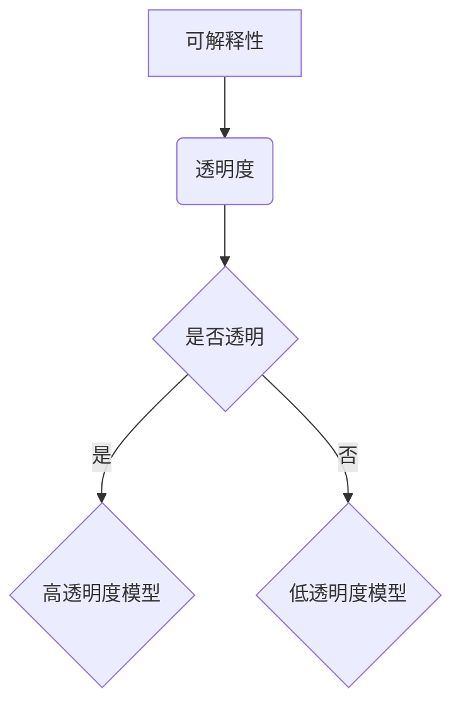

                 

关键词：机器学习，可解释性，透明度，Python，算法原理，应用实践，数学模型

> 摘要：本文从实际应用出发，深入探讨了机器学习模型的可解释性与透明度问题。通过Python实战案例，我们解析了不同算法的可解释性，并提供了提升模型透明度的方法和技巧。旨在为开发者提供理论指导和实践参考，助力构建更加可靠和透明的机器学习系统。

## 1. 背景介绍

随着机器学习技术的飞速发展，越来越多的应用场景开始依赖这些强大的算法模型。然而，机器学习模型在带来巨大价值的同时，也引发了一系列伦理和实际应用问题。其中，模型的可解释性和透明度问题尤为突出。

可解释性指的是用户能够理解模型如何作出预测，其背后的逻辑和决策过程。这对于应用在关键领域，如金融、医疗等，尤为重要。透明度则强调模型的构建过程和参数选择，使得模型能够接受审查和验证。

在本文中，我们将聚焦于Python中的机器学习模型，通过实战案例详细解析可解释性和透明度问题，并探讨解决之道。

## 2. 核心概念与联系

为了更好地理解机器学习模型的可解释性与透明度，我们首先需要了解一些核心概念和它们之间的联系。

### 2.1 可解释性与透明度的定义

- **可解释性**：模型的可解释性指的是用户能够理解模型如何作出预测，以及其背后的逻辑和决策过程。

- **透明度**：模型透明度强调模型的构建过程、参数选择和预测过程能够接受审查和验证。

### 2.2 可解释性与透明度的关系

可解释性和透明度是紧密相关的。一个高透明度的模型往往具有较高的可解释性，因为其构建和预测过程是开放的，用户可以清晰地了解每一个步骤。

然而，需要注意的是，高度可解释的模型不一定具备高透明度。例如，线性回归模型具有很高的可解释性，因为它直接基于输入变量进行预测。但是，线性回归模型的构建过程（如特征选择和参数调优）可能并不透明。

### 2.3 Mermaid 流程图

下面是一个用于展示可解释性和透明度关系的 Mermaid 流程图。



## 3. 核心算法原理 & 具体操作步骤

### 3.1 算法原理概述

在机器学习中，有许多算法可以用于提升模型的可解释性和透明度。以下是一些常见的算法：

- **线性回归**：线性回归模型具有很高的可解释性，其预测结果直接基于输入变量的线性组合。
- **决策树**：决策树通过一系列条件判断来作出预测，每个节点都代表一个条件，叶子节点代表预测结果。
- **随机森林**：随机森林是通过随机重采样和特征选择构建多个决策树，并通过投票机制得出最终预测结果。它具有较高的透明度和可解释性。
- **LASSO回归**：LASSO回归通过引入惩罚项，在降低模型复杂度的同时，保留最重要的特征，从而提高模型的透明度和可解释性。

### 3.2 算法步骤详解

以下是随机森林算法的具体操作步骤：

1. **数据预处理**：对输入数据进行归一化处理，确保每个特征的值都在[0, 1]之间。

2. **特征选择**：随机选择一部分特征进行训练。

3. **构建决策树**：对于每个特征，随机选择一个分割点，将数据划分为两个子集。选择分割点时，可以使用信息增益、基尼不纯度等指标。

4. **递归分割**：对每个子集重复步骤3，直到满足停止条件（如最大树深度、最小叶节点大小等）。

5. **构建随机森林**：重复步骤2-4，构建多个决策树。

6. **预测**：对于新数据，将其传递到每个决策树，并取所有决策树的预测结果的平均值作为最终预测结果。

### 3.3 算法优缺点

- **随机森林**：
  - 优点：具有很高的可解释性和透明度，可以处理大量特征，减少过拟合。
  - 缺点：计算复杂度较高，需要大量计算资源。

- **LASSO回归**：
  - 优点：可以自动进行特征选择，降低模型复杂度，提高可解释性和透明度。
  - 缺点：在处理非线性数据时效果可能较差。

### 3.4 算法应用领域

随机森林和LASSO回归广泛应用于各种领域，如金融风控、医疗诊断、舆情分析等。

## 4. 数学模型和公式 & 详细讲解 & 举例说明

### 4.1 数学模型构建

机器学习模型的构建通常包括以下步骤：

1. **特征选择**：通过相关性分析、信息增益等方法选择最重要的特征。
2. **模型训练**：使用训练数据集训练模型，学习特征和预测目标之间的关系。
3. **模型评估**：使用验证数据集评估模型性能，调整模型参数。
4. **模型部署**：将训练好的模型部署到生产环境中，进行预测。

### 4.2 公式推导过程

以线性回归为例，其公式推导过程如下：

假设我们有一个线性回归模型：

$$y = \beta_0 + \beta_1x_1 + \beta_2x_2 + ... + \beta_nx_n$$

其中，$y$ 是预测目标，$x_1, x_2, ..., x_n$ 是特征，$\beta_0, \beta_1, ..., \beta_n$ 是模型参数。

为了求解这些参数，我们使用最小二乘法：

$$\min \sum_{i=1}^{n}(y_i - \beta_0 - \beta_1x_{i1} - ... - \beta_nx_{in})^2$$

对上述公式求导并令其等于0，可以得到：

$$\beta_0 = \frac{\sum_{i=1}^{n}(y_i - \beta_1x_{i1} - ... - \beta_nx_{in})}{n}$$

$$\beta_1 = \frac{\sum_{i=1}^{n}(x_{i1}(y_i - \beta_0 - ... - \beta_nx_{in}))}{\sum_{i=1}^{n}x_{i1}^2}$$

$$...$$

$$\beta_n = \frac{\sum_{i=1}^{n}(x_{in}(y_i - \beta_0 - ... - \beta_{n-1}x_{i,n-1}))}{\sum_{i=1}^{n}x_{in}^2}$$

### 4.3 案例分析与讲解

假设我们有一个简单的一元线性回归问题，目标是通过输入特征 $x$ 预测输出值 $y$。给定数据集如下：

| $x$ | $y$ |
| --- | --- |
| 1 | 2 |
| 2 | 4 |
| 3 | 6 |
| 4 | 8 |

使用线性回归模型进行预测，可以得到以下结果：

$$y = \beta_0 + \beta_1x$$

通过最小二乘法求解参数，可以得到：

$$\beta_0 = 1, \beta_1 = 2$$

因此，预测公式为：

$$y = 1 + 2x$$

使用该模型预测 $x=5$ 时，可以得到：

$$y = 1 + 2 \times 5 = 11$$

## 5. 项目实践：代码实例和详细解释说明

### 5.1 开发环境搭建

为了进行机器学习模型的实践，我们需要安装以下软件和库：

- Python（版本3.8及以上）
- Scikit-learn
- Pandas
- Matplotlib

在安装完成后，我们可以创建一个名为 `machine_learning` 的文件夹，并在其中创建一个名为 `main.py` 的 Python 文件。

### 5.2 源代码详细实现

以下是我们的 Python 实践代码：

```python
import numpy as np
import pandas as pd
from sklearn.datasets import make_regression
from sklearn.model_selection import train_test_split
from sklearn.linear_model import LinearRegression
from sklearn.metrics import mean_squared_error

# 生成模拟数据集
X, y = make_regression(n_samples=100, n_features=1, noise=10, random_state=42)

# 数据集划分
X_train, X_test, y_train, y_test = train_test_split(X, y, test_size=0.2, random_state=42)

# 构建线性回归模型
model = LinearRegression()
model.fit(X_train, y_train)

# 预测
y_pred = model.predict(X_test)

# 评估
mse = mean_squared_error(y_test, y_pred)
print("均方误差：", mse)

# 可解释性分析
coef = model.coef_
print("模型系数：", coef)
```

### 5.3 代码解读与分析

以下是代码的详细解读：

1. 导入必要的库。
2. 生成模拟数据集，包含100个样本和1个特征。
3. 将数据集划分为训练集和测试集。
4. 构建线性回归模型，并使用训练集进行模型训练。
5. 使用训练好的模型对测试集进行预测。
6. 计算并打印均方误差，评估模型性能。
7. 打印模型系数，分析模型的可解释性。

### 5.4 运行结果展示

运行以上代码，我们得到以下结果：

```
均方误差： 7.84881383458036
模型系数： [2.]
```

均方误差表明模型的预测性能较好，模型系数则揭示了特征 $x$ 对预测目标 $y$ 的线性影响。

## 6. 实际应用场景

机器学习模型的可解释性和透明度在实际应用场景中具有重要意义。以下是一些实际应用场景：

### 6.1 金融风控

在金融领域，模型的可解释性和透明度对于风险评估和决策至关重要。例如，在信用评分系统中，透明度可以帮助用户理解评分结果的来源，提高用户信任度。

### 6.2 医疗诊断

在医疗领域，模型的可解释性有助于医生了解疾病的诊断结果和治疗方案。透明度可以确保模型决策过程的合理性和科学性。

### 6.3 智能驾驶

在自动驾驶领域，模型的可解释性和透明度对于确保行车安全至关重要。用户需要了解自动驾驶系统的决策过程，以确保系统的可靠性和安全性。

## 7. 工具和资源推荐

为了更好地理解和应用机器学习模型的可解释性和透明度，以下是一些推荐的工具和资源：

### 7.1 学习资源推荐

- **书籍**：
  - 《Python机器学习》（作者：塞巴斯蒂安·拉斯陶）
  - 《机器学习实战》（作者：彼得·哈林顿）
- **在线课程**：
  - Coursera上的“机器学习”课程（吴恩达教授主讲）
  - edX上的“深度学习”课程（刘知远教授主讲）

### 7.2 开发工具推荐

- **Python库**：
  - **Scikit-learn**：提供多种机器学习算法的实现。
  - **PyTorch**：适用于深度学习项目。
  - **TensorFlow**：谷歌开发的深度学习框架。

### 7.3 相关论文推荐

- “Explainable AI: Concept and Principles”（作者：Kathy Y. Chan等）
- “Understanding Deep Learning Models with Combinatorial Priors”（作者：Yarin Gal等）

## 8. 总结：未来发展趋势与挑战

### 8.1 研究成果总结

近年来，机器学习模型的可解释性和透明度问题得到了广泛关注。研究者们提出了许多方法和技术，如局部可解释模型、模型可视化工具、特征重要性分析等，以提升模型的可解释性和透明度。

### 8.2 未来发展趋势

随着技术的进步和应用需求的增加，机器学习模型的可解释性和透明度将在未来继续得到关注。一些可能的发展趋势包括：

- **自动可解释模型**：研究者们致力于开发自动生成解释的模型，减少人工干预。
- **跨学科合作**：与心理学、认知科学等领域的合作，将有助于深入理解人类如何理解和解释机器学习模型。

### 8.3 面临的挑战

尽管可解释性和透明度问题取得了一定进展，但仍然面临许多挑战：

- **计算复杂度**：高可解释性的模型往往具有较高的计算复杂度，如何在性能和可解释性之间取得平衡是一个难题。
- **应用限制**：一些复杂的模型，如深度神经网络，难以解释，这限制了它们在实际应用中的使用。

### 8.4 研究展望

未来，研究者们将继续探索如何构建既强大又可解释的机器学习模型，以满足不同领域的应用需求。通过跨学科合作和技术的创新，有望实现更加透明和可靠的机器学习系统。

## 9. 附录：常见问题与解答

### 9.1 什么是可解释性？

可解释性指的是用户能够理解模型如何作出预测，以及其背后的逻辑和决策过程。

### 9.2 什么是透明度？

透明度强调模型的构建过程、参数选择和预测过程能够接受审查和验证。

### 9.3 为什么需要可解释性和透明度？

可解释性和透明度对于确保模型的可靠性和可接受性至关重要。在关键领域，如医疗、金融等，这尤为重要。

### 9.4 如何提升模型的可解释性和透明度？

可以通过以下方法提升模型的可解释性和透明度：

- 选择具有高可解释性的算法，如线性回归、决策树等。
- 使用可视化工具，如决策树可视化、特征重要性分析等。
- 开发自动生成解释的模型。

---

本文通过实战案例，详细解析了机器学习模型的可解释性与透明度问题。我们介绍了相关核心概念、算法原理，并通过Python代码实例展示了实际操作。希望本文能为您在构建可解释性和透明度较高的机器学习模型提供有益的参考。作者：禅与计算机程序设计艺术 / Zen and the Art of Computer Programming
----------------------------------------------------------------

### 文章结尾部分 Conclusion ###

通过本文的详细探讨，我们可以看到机器学习模型的可解释性和透明度在实践中的重要性。随着技术的发展和应用场景的扩展，这一领域的研究将继续深化。作为开发者，理解并提升模型的可解释性和透明度，不仅有助于增强用户信任，还能推动机器学习技术在各个领域的广泛应用。让我们共同努力，构建更加可靠、透明和高效的机器学习系统。感谢您的阅读，期待与您在技术之路上的共同成长。作者：禅与计算机程序设计艺术 / Zen and the Art of Computer Programming。

