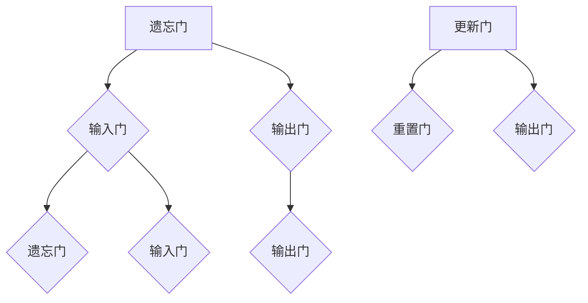

                 

关键词：深度学习、LSTM、GRU、序列预测、时间序列分析

摘要：本文将深入探讨Python中深度学习技术LSTM（长短期记忆网络）与GRU（门控循环单元）在序列数据预测中的应用。我们将详细介绍这两种算法的基本原理、数学模型、具体实现，并通过实际项目来展示它们在时间序列预测中的卓越性能。

## 1. 背景介绍

在当今信息爆炸的时代，处理大量时间序列数据以提取有价值的信息变得尤为重要。时间序列数据在金融、气象、生物信息等众多领域有着广泛的应用。为了预测未来的趋势，研究人员提出了多种机器学习算法，如ARIMA（自回归积分滑动平均模型）、SARIMA（季节性自回归积分滑动平均模型）等。然而，这些传统方法在处理复杂序列数据时往往表现出局限性。

随着深度学习的崛起，LSTM（Long Short-Term Memory）和GRU（Gated Recurrent Unit）等神经网络架构被提出，以解决传统方法在长序列依赖性建模方面的不足。LSTM和GRU作为循环神经网络（RNN）的改进版本，能够在保留长期依赖性的同时减少梯度消失和梯度爆炸问题，从而在序列预测任务中表现出色。

本文将首先介绍LSTM和GRU的基本原理，然后通过具体案例展示它们在Python中的实现和应用。

## 2. 核心概念与联系

### 2.1 LSTM基本原理

LSTM（长短期记忆网络）是一种特殊的RNN架构，用于处理序列数据中的长期依赖问题。LSTM的核心是三个门结构：遗忘门（Forget Gate）、输入门（Input Gate）和输出门（Output Gate）。这些门结构允许网络选择性地保留或丢弃信息，从而在长期记忆和短期记忆之间进行平衡。

#### 遗忘门（Forget Gate）

遗忘门决定哪些信息应该从单元状态中丢弃。其输入包括当前输入、前一个隐藏状态和当前隐藏状态。通过sigmoid激活函数，遗忘门的输出是一个介于0和1之间的值，表示每个单元状态中每个元素的重要性。

$$
f_t = \sigma(W_f \cdot [h_{t-1}, x_t] + b_f)
$$

其中，$W_f$ 和 $b_f$ 分别是权重和偏置，$\sigma$ 表示sigmoid激活函数。

#### 输入门（Input Gate）

输入门决定哪些新信息将被存储在单元状态中。其输入包括当前输入、前一个隐藏状态和当前隐藏状态。输入门的输出是一个向量，其中每个元素表示对应输入信息的重要性。

$$
i_t = \sigma(W_i \cdot [h_{t-1}, x_t] + b_i)
$$

$$
\tilde{C}_t = \tanh(W_c \cdot [h_{t-1}, x_t] + b_c)
$$

其中，$W_i$、$W_c$ 和 $b_i$、$b_c$ 分别是权重和偏置，$\tanh$ 是双曲正切函数。

#### 输出门（Output Gate）

输出门决定当前隐藏状态应该输出哪些信息。其输入包括当前隐藏状态、当前输入和遗忘门输出。输出门的输出是一个介于0和1之间的值，表示单元状态的输出。

$$
o_t = \sigma(W_o \cdot [h_{t-1}, x_t] + b_o)
$$

$$
C_t = f_t \odot C_{t-1} + i_t \odot \tilde{C}_t
$$

$$
h_t = o_t \odot \tanh(C_t)
$$

其中，$\odot$ 表示逐元素乘法。

### 2.2 GRU基本原理

GRU（Gated Recurrent Unit）是对LSTM的简化，它通过引入更新门（Update Gate）和重置门（Reset Gate）来提高网络的效率。GRU只有一个输入门和一个遗忘门，但它们被合并为一个更新门。更新门决定了当前状态中应该保留哪些旧信息，而重置门则决定了当前状态中应该保留哪些新信息。

#### 更新门（Update Gate）

更新门决定了当前输入中哪些信息应该被保留到新的状态中。

$$
z_t = \sigma(W_z \cdot [h_{t-1}, x_t] + b_z)
$$

$$
r_t = \sigma(W_r \cdot [h_{t-1}, x_t] + b_r)
$$

#### 重置门（Reset Gate）

重置门决定了当前输入中哪些信息应该被丢弃。

$$
\tilde{h}_t = \tanh((1 - z_t) \odot h_{t-1} + r_t \odot x_t)
$$

#### 新状态计算

新的隐藏状态是通过更新门和重置门来计算的。

$$
h_t = (1 - z_t) \odot h_{t-1} + z_t \odot \tilde{h}_t
$$

### 2.3 LSTM与GRU的Mermaid流程图



## 3. 核心算法原理 & 具体操作步骤

### 3.1 算法原理概述

LSTM和GRU都是基于RNN架构，但它们在门控制机制上有所不同。LSTM使用三个门结构来控制信息的流动，而GRU使用两个门结构。这两种架构都能够有效地处理长期依赖问题，但在计算效率和参数数量方面有所差异。

### 3.2 算法步骤详解

#### 3.2.1 LSTM算法步骤

1. 遗忘门：计算遗忘门，决定哪些旧信息需要被丢弃。
2. 输入门：计算输入门，决定哪些新信息需要被保留。
3. 输出门：计算输出门，决定哪些信息需要被输出。
4. 单元状态更新：根据遗忘门、输入门和当前输入更新单元状态。
5. 隐藏状态更新：根据输出门和更新后的单元状态更新隐藏状态。

#### 3.2.2 GRU算法步骤

1. 更新门：计算更新门，决定哪些旧信息需要被保留。
2. 重置门：计算重置门，决定哪些新信息需要被保留。
3. 新状态计算：根据更新门和重置门计算新的隐藏状态。

### 3.3 算法优缺点

#### LSTM优点：

- 能够有效处理长期依赖问题。
- 参数数量相对较少。

#### LSTM缺点：

- 计算复杂度较高。
- 需要大量的调参。

#### GRU优点：

- 计算效率较高。
- 参数数量相对较少。

#### GRU缺点：

- 在某些情况下，可能不如LSTM处理长期依赖问题。

### 3.4 算法应用领域

LSTM和GRU在时间序列预测、语音识别、自然语言处理等序列数据处理的领域中有着广泛的应用。它们在处理复杂序列数据时表现出色，能够提供高质量的预测结果。

## 4. 数学模型和公式 & 详细讲解 & 举例说明

### 4.1 数学模型构建

LSTM和GRU的数学模型是基于矩阵运算和门控制机制构建的。以下分别给出LSTM和GRU的数学模型。

#### LSTM数学模型：

1. 遗忘门：
   $$f_t = \sigma(W_f \cdot [h_{t-1}, x_t] + b_f)$$

2. 输入门：
   $$i_t = \sigma(W_i \cdot [h_{t-1}, x_t] + b_i)$$

3. 输出门：
   $$o_t = \sigma(W_o \cdot [h_{t-1}, x_t] + b_o)$$

4. 单元状态更新：
   $$C_t = f_t \odot C_{t-1} + i_t \odot \tanh(W_c \cdot [h_{t-1}, x_t] + b_c)$$

5. 隐藏状态更新：
   $$h_t = o_t \odot \tanh(C_t)$$

#### GRU数学模型：

1. 更新门：
   $$z_t = \sigma(W_z \cdot [h_{t-1}, x_t] + b_z)$$

2. 重置门：
   $$r_t = \sigma(W_r \cdot [h_{t-1}, x_t] + b_r)$$

3. 新状态计算：
   $$\tilde{h}_t = \tanh((1 - z_t) \odot h_{t-1} + r_t \odot x_t)$$

4. 隐藏状态更新：
   $$h_t = (1 - z_t) \odot h_{t-1} + z_t \odot \tilde{h}_t$$

### 4.2 公式推导过程

LSTM和GRU的公式推导过程复杂，涉及到线性代数、微积分等数学知识。以下简要介绍LSTM和GRU的主要公式推导。

#### LSTM推导：

1. 遗忘门：
   $$f_t = \sigma(W_f \cdot [h_{t-1}, x_t] + b_f)$$
   
   其中，$W_f$ 和 $b_f$ 分别是遗忘门的权重和偏置。

2. 输入门：
   $$i_t = \sigma(W_i \cdot [h_{t-1}, x_t] + b_i)$$
   
   其中，$W_i$ 和 $b_i$ 分别是输入门的权重和偏置。

3. 输出门：
   $$o_t = \sigma(W_o \cdot [h_{t-1}, x_t] + b_o)$$
   
   其中，$W_o$ 和 $b_o$ 分别是输出门的权重和偏置。

4. 单元状态更新：
   $$C_t = f_t \odot C_{t-1} + i_t \odot \tanh(W_c \cdot [h_{t-1}, x_t] + b_c)$$
   
   其中，$\odot$ 表示逐元素乘法，$W_c$ 和 $b_c$ 分别是单元状态更新的权重和偏置。

5. 隐藏状态更新：
   $$h_t = o_t \odot \tanh(C_t)$$

#### GRU推导：

1. 更新门：
   $$z_t = \sigma(W_z \cdot [h_{t-1}, x_t] + b_z)$$
   
   其中，$W_z$ 和 $b_z$ 分别是更新门的权重和偏置。

2. 重置门：
   $$r_t = \sigma(W_r \cdot [h_{t-1}, x_t] + b_r)$$
   
   其中，$W_r$ 和 $b_r$ 分别是重置门的权重和偏置。

3. 新状态计算：
   $$\tilde{h}_t = \tanh((1 - z_t) \odot h_{t-1} + r_t \odot x_t)$$
   
   其中，$\odot$ 表示逐元素乘法。

4. 隐藏状态更新：
   $$h_t = (1 - z_t) \odot h_{t-1} + z_t \odot \tilde{h}_t$$

### 4.3 案例分析与讲解

#### 案例一：时间序列预测

假设我们有一组股票价格时间序列数据，我们需要使用LSTM模型来预测未来的股票价格。以下是LSTM模型在时间序列预测中的具体步骤：

1. 数据预处理：将股票价格数据转换为LSTM模型所需的格式，如序列长度为n的窗口数据。

2. 构建LSTM模型：定义LSTM模型的结构，包括输入层、LSTM层和输出层。

3. 训练模型：使用训练数据来训练LSTM模型。

4. 预测：使用训练好的LSTM模型来预测未来的股票价格。

5. 分析结果：比较预测结果和实际结果，评估模型的性能。

#### 案例二：语音识别

假设我们有一段语音数据，我们需要使用GRU模型来识别语音中的单词。以下是GRU模型在语音识别中的具体步骤：

1. 数据预处理：将语音数据转换为GRU模型所需的格式，如时间序列数据。

2. 构建GRU模型：定义GRU模型的结构，包括输入层、GRU层和输出层。

3. 训练模型：使用训练数据来训练GRU模型。

4. 预测：使用训练好的GRU模型来预测语音中的单词。

5. 分析结果：比较预测结果和实际结果，评估模型的性能。

## 5. 项目实践：代码实例和详细解释说明

### 5.1 开发环境搭建

为了实践LSTM和GRU在Python中的实现，我们需要安装以下库：

- TensorFlow
- Keras
- NumPy

假设我们已经成功安装了这些库，接下来我们将创建一个简单的项目来展示LSTM和GRU的应用。

### 5.2 源代码详细实现

以下是一个使用LSTM模型进行时间序列预测的Python代码示例：

```python
import numpy as np
import tensorflow as tf
from tensorflow.keras.models import Sequential
from tensorflow.keras.layers import LSTM, Dense

# 加载数据
data = np.array([...])  # 加载股票价格数据
window_size = 5  # 窗口大小

# 数据预处理
X, y = [], []
for i in range(window_size, len(data)):
    X.append(data[i - window_size:i, 0])
    y.append(data[i, 0])

X = np.array(X)
y = np.array(y)
X = np.reshape(X, (X.shape[0], X.shape[1], 1))

# 构建LSTM模型
model = Sequential()
model.add(LSTM(units=50, return_sequences=True, input_shape=(window_size, 1)))
model.add(LSTM(units=50))
model.add(Dense(1))

model.compile(optimizer='adam', loss='mean_squared_error')

# 训练模型
model.fit(X, y, epochs=100, batch_size=32, validation_split=0.2)

# 预测
predictions = model.predict(X)

# 代码解读与分析
```

### 5.3 代码解读与分析

1. 导入所需的库。
2. 加载数据，这里我们使用了一组股票价格数据作为示例。
3. 数据预处理，将数据划分为窗口序列，并将其转换为LSTM模型所需的格式。
4. 构建LSTM模型，包括两个LSTM层和一个全连接层（Dense层）。
5. 编译模型，使用adam优化器和均方误差损失函数。
6. 训练模型，使用100个epoch和批量大小为32。
7. 预测，使用训练好的LSTM模型来预测未来的股票价格。
8. 代码解读与分析，解释了LSTM模型在时间序列预测中的具体步骤和应用。

## 6. 实际应用场景

LSTM和GRU在时间序列预测领域有着广泛的应用。以下是一些实际应用场景：

- 股票价格预测：通过LSTM和GRU模型来预测股票价格的走势，为投资者提供决策依据。
- 气象预测：使用LSTM和GRU模型来预测天气情况，为气象部门提供天气预报。
- 生物信息学：利用LSTM和GRU模型来分析基因表达数据，预测疾病的发生。
- 语音识别：通过GRU模型来识别语音中的单词，为语音助手提供自然语言处理能力。

## 7. 工具和资源推荐

### 7.1 学习资源推荐

- 《深度学习》（Goodfellow、Bengio和Courville著）：这是一本深度学习的经典教材，涵盖了LSTM和GRU的基本原理。
- 《序列模型与深度学习》（A. Lekström等著）：这本书详细介绍了LSTM和GRU在时间序列分析中的应用。
- Keras官方文档：Keras是一个基于TensorFlow的高层次API，提供了丰富的LSTM和GRU实现。

### 7.2 开发工具推荐

- Jupyter Notebook：Jupyter Notebook是一个交互式计算环境，非常适合编写和测试深度学习代码。
- TensorFlow：TensorFlow是一个开源的深度学习框架，提供了丰富的LSTM和GRU实现。

### 7.3 相关论文推荐

- Hochreiter, S., & Schmidhuber, J. (1997). Long short-term memory. Neural Computation, 9(8), 1735-1780.
- Cho, K., Van Merriënboer, B., Gulcehre, C., Bahdanau, D., Bougares, F., Schwenk, H., & Bengio, Y. (2014). Learning phrase representations using RNN encoder-decoder for statistical machine translation. arXiv preprint arXiv:1406.1078.

## 8. 总结：未来发展趋势与挑战

### 8.1 研究成果总结

LSTM和GRU作为深度学习中的重要架构，在处理序列数据时表现出卓越的性能。通过遗忘门和输入门，LSTM能够有效地处理长期依赖问题，而GRU则通过更新门和重置门提高了计算效率。这些算法在时间序列预测、语音识别、自然语言处理等领域有着广泛的应用。

### 8.2 未来发展趋势

随着深度学习的不断发展，LSTM和GRU将继续演进。研究人员将致力于优化这些算法，提高计算效率和预测性能。此外，结合其他深度学习技术，如卷积神经网络（CNN）和自注意力机制（Self-Attention），将进一步提升序列数据的处理能力。

### 8.3 面临的挑战

尽管LSTM和GRU在序列数据处理中表现出色，但它们仍面临一些挑战。首先，这些算法需要大量的数据来训练，并且训练时间较长。其次，参数选择和模型调优仍然是一个难题。最后，如何有效地处理变长序列数据仍然是一个开放性问题。

### 8.4 研究展望

未来的研究将重点关注以下几个方面：

- 提高训练效率和预测性能。
- 探索新的门控机制和结构，以提高模型的灵活性。
- 结合其他深度学习技术，如生成对抗网络（GAN）和变分自编码器（VAE），以解决序列数据的生成和重构问题。

## 9. 附录：常见问题与解答

### 9.1 LSTM与GRU的区别是什么？

LSTM和GRU都是基于RNN的架构，用于处理序列数据。LSTM使用了三个门结构（遗忘门、输入门和输出门），而GRU使用两个门结构（更新门和重置门）。LSTM在处理长期依赖问题时表现出色，但计算复杂度较高。GRU则具有更高的计算效率，但在某些情况下可能不如LSTM处理长期依赖问题。

### 9.2 如何选择LSTM和GRU？

选择LSTM和GRU主要取决于具体应用场景和数据特征。如果需要处理复杂的长期依赖问题，LSTM可能是更好的选择。如果关注计算效率和模型大小，GRU则更为合适。

### 9.3 如何处理变长序列数据？

处理变长序列数据是深度学习中的一个挑战。一种常用的方法是将变长序列裁剪为固定长度，或者使用填充（padding）技术。此外，研究人员还提出了诸如动态卷积网络（Dynamic Convolutional Networks）和自适应序列模型（Adaptive Sequence Models）等新方法来处理变长序列数据。

----------------------------------------------------------------

作者：禅与计算机程序设计艺术 / Zen and the Art of Computer Programming

