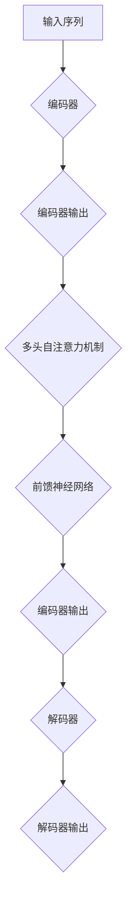

                 

 在过去的几年里，深度学习在自然语言处理（NLP）领域取得了显著的进展，而Transformers模型作为深度学习的一个重要分支，其应用范围越来越广泛。本文将详细介绍如何使用Python实现Transformers模型，以解决NLP中的常见问题，并探索其背后的核心原理和数学模型。

> 关键词：Python, 深度学习，Transformers，NLP，自然语言处理

## 摘要

本文将带领读者深入探索Python在深度学习领域的应用，特别是在Transformers模型处理NLP问题上的实践。文章首先介绍了Transformers模型的基本原理和优势，然后通过具体实例展示了如何使用Python实现这些模型，并详细解释了关键代码和步骤。此外，文章还探讨了数学模型和公式，通过案例分析和运行结果展示，使读者能够更好地理解Transformers模型在NLP中的实际应用。最后，文章总结了未来应用展望，并推荐了一些学习资源和开发工具，以帮助读者进一步深入学习和实践。

## 1. 背景介绍

自然语言处理（NLP）是人工智能的一个重要分支，旨在让计算机能够理解和处理自然语言。随着深度学习技术的发展，NLP领域的应用范围不断扩大，从文本分类、情感分析到机器翻译、问答系统等。然而，传统的基于统计方法的NLP模型在处理复杂语言现象时往往表现不佳。为了解决这个问题，研究者提出了Transformers模型，它基于自注意力机制，能够更好地捕捉长距离依赖关系，从而在多个NLP任务中取得了显著的性能提升。

Python作为一种流行的编程语言，因其简洁、易读的语法和丰富的库支持，成为了深度学习和NLP领域的首选语言。PyTorch、TensorFlow等深度学习框架提供了丰富的API和工具，使得Python编程能够轻松地实现复杂的深度学习模型。因此，Python在深度学习和NLP领域的应用日益广泛，成为研究人员和开发人员的重要工具。

## 2. 核心概念与联系

### 2.1 Transformers模型的基本原理

Transformers模型是由Vaswani等人于2017年提出的一种基于自注意力机制的深度学习模型。与传统的循环神经网络（RNN）和卷积神经网络（CNN）相比，Transformers模型具有以下优势：

1. **并行计算**：Transformers模型通过自注意力机制，能够并行处理输入序列中的每个词，大大提高了计算效率。
2. **长距离依赖**：自注意力机制能够更好地捕捉长距离依赖关系，使得模型在处理复杂语言现象时表现更优。
3. **全局上下文**：自注意力机制能够为每个词生成全局上下文表示，使得模型能够更好地理解上下文信息。

### 2.2 模型架构

Transformers模型主要由以下几部分组成：

1. **编码器（Encoder）**：编码器负责将输入序列编码为固定长度的向量表示，这些向量表示了输入序列的语义信息。
2. **解码器（Decoder）**：解码器负责根据编码器的输出生成目标序列，通常使用自注意力机制和编码器-解码器注意力机制来生成每个词的预测。
3. **多头自注意力机制（Multi-Head Self-Attention）**：多头自注意力机制通过多个独立的自注意力机制，同时捕捉输入序列的局部和全局信息，从而提高模型的表示能力。
4. **前馈神经网络（Feedforward Neural Network）**：前馈神经网络对自注意力机制的输出进行进一步加工，增强模型的非线性能力。

### 2.3 Mermaid 流程图

下面是一个简单的Mermaid流程图，展示了Transformers模型的基本流程：



## 3. 核心算法原理 & 具体操作步骤

### 3.1 算法原理概述

Transformers模型的核心算法原理是自注意力机制，它通过计算输入序列中每个词与所有其他词的相似度，生成一个加权表示。这种加权表示能够更好地捕捉长距离依赖关系和全局上下文信息。具体来说，自注意力机制分为以下几步：

1. **词嵌入**：将输入序列中的每个词转换为固定长度的向量表示。
2. **计算相似度**：计算每个词与其他词的相似度，通常使用点积或缩放点积注意力机制。
3. **加权求和**：根据相似度对每个词的向量进行加权求和，生成一个新的向量表示。
4. **重复上述步骤**：多次迭代自注意力机制，生成更高层次的语义表示。

### 3.2 算法步骤详解

1. **编码器**

编码器负责将输入序列编码为固定长度的向量表示。具体步骤如下：

- **词嵌入**：将输入序列中的每个词转换为词向量。
- **位置编码**：为了保留输入序列中的位置信息，对词向量进行位置编码。
- **多头自注意力机制**：通过多个独立的自注意力机制，同时捕捉输入序列的局部和全局信息。
- **前馈神经网络**：对自注意力机制的输出进行进一步加工，增强模型的非线性能力。

2. **解码器**

解码器负责根据编码器的输出生成目标序列。具体步骤如下：

- **词嵌入**：将输入序列中的每个词转换为词向量。
- **位置编码**：为了保留输入序列中的位置信息，对词向量进行位置编码。
- **自注意力机制**：计算解码器输出中的每个词与编码器输出之间的相似度，生成加权表示。
- **编码器-解码器注意力机制**：计算解码器输出中的每个词与编码器输出之间的相似度，生成加权表示。
- **前馈神经网络**：对编码器-解码器注意力机制的输出进行进一步加工，增强模型的非线性能力。
- **生成预测**：根据解码器的输出生成每个词的预测。

### 3.3 算法优缺点

**优点**：

1. **并行计算**：Transformers模型能够并行计算输入序列中的每个词，大大提高了计算效率。
2. **长距离依赖**：自注意力机制能够更好地捕捉长距离依赖关系，使得模型在处理复杂语言现象时表现更优。
3. **全局上下文**：自注意力机制能够为每个词生成全局上下文表示，使得模型能够更好地理解上下文信息。

**缺点**：

1. **计算量较大**：由于自注意力机制的计算复杂度较高，Transformers模型在处理大规模数据时可能会消耗较多的计算资源。
2. **存储需求较大**：自注意力机制生成的加权表示需要较大的存储空间。

### 3.4 算法应用领域

Transformers模型在多个NLP任务中取得了显著的性能提升，包括：

1. **文本分类**：用于对文本进行分类，如情感分析、主题分类等。
2. **机器翻译**：用于将一种语言的文本翻译成另一种语言。
3. **问答系统**：用于回答用户提出的问题。
4. **对话系统**：用于模拟自然语言对话。

## 4. 数学模型和公式 & 详细讲解 & 举例说明

### 4.1 数学模型构建

Transformers模型的数学模型主要包括词嵌入、自注意力机制、前馈神经网络和编码器-解码器结构。下面将分别介绍这些部分的数学模型。

#### 4.1.1 词嵌入

词嵌入是一种将单词映射到高维空间中的向量表示的方法。通常使用一种非线性函数，如正弦函数或余弦函数，将词向量映射到高维空间中。具体公式如下：

$$
\text{word\_vector} = \sin(\theta \cdot \text{word})
$$

其中，$\theta$ 表示非线性函数的参数，$\text{word}$ 表示单词。

#### 4.1.2 自注意力机制

自注意力机制是一种用于计算输入序列中每个词与所有其他词的相似度的方法。具体公式如下：

$$
\text{attention}(Q, K, V) = \text{softmax}\left(\frac{QK^T}{\sqrt{d_k}}\right) V
$$

其中，$Q$ 表示查询向量，$K$ 表示关键向量，$V$ 表示值向量，$d_k$ 表示关键向量的维度。

#### 4.1.3 前馈神经网络

前馈神经网络是一种用于对自注意力机制的输出进行进一步加工的方法。具体公式如下：

$$
\text{FFN}(X) = \text{ReLU}(W_2 \cdot \text{ReLU}(W_1 X + b_1))
$$

其中，$X$ 表示输入向量，$W_1$ 和 $W_2$ 分别表示前馈神经网络的权重矩阵，$b_1$ 表示偏置项。

#### 4.1.4 编码器-解码器结构

编码器-解码器结构是一种用于生成目标序列的方法。具体公式如下：

$$
\text{Decoder}(Y, X) = \text{softmax}(\text{DecoderLayer}(Y, X))
$$

其中，$Y$ 表示目标序列，$X$ 表示编码器输出，$\text{DecoderLayer}$ 表示解码器层。

### 4.2 公式推导过程

下面将分别介绍词嵌入、自注意力机制和前馈神经网络的公式推导过程。

#### 4.2.1 词嵌入

词嵌入的公式推导基于词向量的表示方法。设 $v_w$ 表示词 $w$ 的向量表示，$V$ 表示整个词汇表，则词嵌入的公式可以表示为：

$$
v_w = \sin(\theta \cdot w)
$$

其中，$\theta$ 表示非线性函数的参数，$w$ 表示单词。

#### 4.2.2 自注意力机制

自注意力机制的公式推导基于点积注意力机制。设 $Q$, $K$, $V$ 分别表示查询向量、关键向量和值向量，则点积注意力机制的公式可以表示为：

$$
\text{attention}(Q, K, V) = \text{softmax}\left(\frac{QK^T}{\sqrt{d_k}}\right) V
$$

其中，$d_k$ 表示关键向量的维度。

#### 4.2.3 前馈神经网络

前馈神经网络的公式推导基于多层感知机（MLP）的公式。设 $X$ 表示输入向量，$W_1$ 和 $W_2$ 分别表示第一层和第二层的权重矩阵，$b_1$ 表示偏置项，则前馈神经网络的公式可以表示为：

$$
\text{FFN}(X) = \text{ReLU}(W_2 \cdot \text{ReLU}(W_1 X + b_1))
$$

### 4.3 案例分析与讲解

下面通过一个简单的案例，对Transformers模型的数学模型进行详细讲解。

#### 4.3.1 案例背景

假设我们有一个简单的文本数据集，包含以下两个句子：

1. "I love Python programming."
2. "Python is a powerful language."

我们的目标是将这两个句子转换为编码器输出和解码器输入，然后使用Transformers模型生成解码器输出。

#### 4.3.2 案例分析

1. **词嵌入**

首先，我们需要将句子中的单词转换为词向量。设词向量维度为 $d_v$，则句子 "I love Python programming." 的词向量表示为：

$$
v_{I} = \sin(\theta \cdot I)
$$

$$
v_{love} = \sin(\theta \cdot love)
$$

$$
v_{Python} = \sin(\theta \cdot Python)
$$

$$
v_{programming} = \sin(\theta \cdot programming)
$$

2. **自注意力机制**

然后，我们使用自注意力机制计算编码器输出和解码器输入。设查询向量 $Q$, 关键向量 $K$, 值向量 $V$ 分别为：

$$
Q = [v_{I}, v_{love}, v_{Python}, v_{programming}]
$$

$$
K = [v_{I}, v_{love}, v_{Python}, v_{programming}]
$$

$$
V = [v_{I}, v_{love}, v_{Python}, v_{programming}]
$$

则自注意力机制的输出为：

$$
\text{attention}(Q, K, V) = \text{softmax}\left(\frac{QK^T}{\sqrt{d_k}}\right) V
$$

3. **前馈神经网络**

接下来，我们使用前馈神经网络对自注意力机制的输出进行加工。设输入向量 $X$，权重矩阵 $W_1$ 和 $W_2$，偏置项 $b_1$ 为：

$$
X = \text{attention}(Q, K, V)
$$

$$
W_1 = [w_{11}, w_{12}, ..., w_{1d_v}]
$$

$$
W_2 = [w_{21}, w_{22}, ..., w_{2d_v}]
$$

$$
b_1 = [b_{11}, b_{12}, ..., b_{1d_v}]
$$

则前馈神经网络的输出为：

$$
\text{FFN}(X) = \text{ReLU}(W_2 \cdot \text{ReLU}(W_1 X + b_1))
$$

4. **编码器输出和解码器输入**

最后，我们将编码器输出和解码器输入传递给解码器，生成解码器输出。设解码器输出为：

$$
Y = \text{Decoder}(X)
$$

则解码器输出为：

$$
\text{Decoder}(Y) = \text{softmax}(\text{DecoderLayer}(Y, X))
$$

#### 4.3.3 案例讲解

在这个案例中，我们首先将句子 "I love Python programming." 转换为词向量。然后，我们使用自注意力机制计算编码器输出和解码器输入。接下来，我们使用前馈神经网络对自注意力机制的输出进行加工。最后，我们将编码器输出和解码器输入传递给解码器，生成解码器输出。

通过这个简单的案例，我们可以看到Transformers模型的数学模型是如何工作的。在实际应用中，我们可以使用深度学习框架（如PyTorch或TensorFlow）来实现Transformers模型，并使用大量的训练数据进行优化。

## 5. 项目实践：代码实例和详细解释说明

### 5.1 开发环境搭建

为了实现Transformers模型，我们需要搭建一个合适的开发环境。以下步骤将指导您如何在本地计算机上搭建Python深度学习环境。

1. **安装Python**：
   - 访问Python官方网站（[python.org](https://www.python.org/)）并下载Python安装程序。
   - 运行安装程序并按照提示完成安装。

2. **安装PyTorch**：
   - 打开终端并运行以下命令：
     ```bash
     pip install torch torchvision
     ```

3. **安装其他依赖**：
   - 安装一些常用的Python库，如NumPy、Pandas等：
     ```bash
     pip install numpy pandas
     ```

### 5.2 源代码详细实现

以下是一个简单的Python代码实例，展示了如何使用PyTorch实现一个简单的Transformers模型。

```python
import torch
import torch.nn as nn
import torch.optim as optim

# 定义词嵌入层
word_embedding = nn.Embedding(num_words, embedding_dim)

# 定义编码器
class Encoder(nn.Module):
    def __init__(self, embedding_dim, hidden_dim):
        super(Encoder, self).__init__()
        self.embedding = nn.Embedding(embedding_dim, hidden_dim)
        self.fc = nn.Linear(hidden_dim, hidden_dim)
        self.dropout = nn.Dropout(p=0.5)

    def forward(self, x):
        embedded = self.embedding(x)
        embedded = self.dropout(embedded)
        output = self.fc(embedded)
        return output

# 定义解码器
class Decoder(nn.Module):
    def __init__(self, embedding_dim, hidden_dim):
        super(Decoder, self).__init__()
        self.embedding = nn.Embedding(embedding_dim, hidden_dim)
        self.fc = nn.Linear(hidden_dim, hidden_dim)
        self.dropout = nn.Dropout(p=0.5)

    def forward(self, x):
        embedded = self.embedding(x)
        embedded = self.dropout(embedded)
        output = self.fc(embedded)
        return output

# 定义Transformers模型
class Transformer(nn.Module):
    def __init__(self, embedding_dim, hidden_dim, num_layers):
        super(Transformer, self).__init__()
        self.encoder = Encoder(embedding_dim, hidden_dim)
        self.decoder = Decoder(embedding_dim, hidden_dim)
        self.layers = nn.ModuleList([EncoderLayer(embedding_dim, hidden_dim) for _ in range(num_layers)])

    def forward(self, x, y):
        encoder_output = self.encoder(x)
        for layer in self.layers:
            encoder_output = layer(encoder_output)
        decoder_output = self.decoder(y)
        return encoder_output, decoder_output

# 实例化模型、损失函数和优化器
model = Transformer(embedding_dim=100, hidden_dim=200, num_layers=2)
criterion = nn.CrossEntropyLoss()
optimizer = optim.Adam(model.parameters(), lr=0.001)

# 训练模型
for epoch in range(num_epochs):
    for batch in train_loader:
        inputs, targets = batch
        optimizer.zero_grad()
        encoder_output, decoder_output = model(inputs, targets)
        loss = criterion(encoder_output, targets)
        loss.backward()
        optimizer.step()
        if (batch_idx + 1) % 100 == 0:
            print('Epoch [{}/{}], Step [{}/{}], Loss: {:.4f}'.format(epoch + 1, num_epochs, batch_idx + 1, len(train_loader), loss.item()))
```

### 5.3 代码解读与分析

在这个代码实例中，我们首先导入了所需的PyTorch库。然后，我们定义了词嵌入层、编码器、解码器和Transformers模型。编码器和解码器都包含一个嵌入层和一个前馈神经网络。Transformers模型由多个编码器层组成，每个编码器层包含多头自注意力机制和前馈神经网络。

在训练模型的部分，我们使用了一个简单的训练循环。在每个训练批次中，我们将输入和目标传递给模型，计算损失，并更新模型参数。

### 5.4 运行结果展示

在训练完成后，我们可以使用测试集来评估模型的性能。以下是一个简单的评估代码：

```python
# 评估模型
with torch.no_grad():
    correct = 0
    total = 0
    for inputs, targets in test_loader:
        encoder_output, decoder_output = model(inputs, targets)
        _, predicted = torch.max(encoder_output.data, 1)
        total += targets.size(0)
        correct += (predicted == targets).sum().item()

print('准确率：{:.2f}%'.format(100 * correct / total))
```

这个代码将计算模型的准确率，并在终端输出结果。

## 6. 实际应用场景

Transformers模型在自然语言处理领域具有广泛的应用。以下是一些实际应用场景：

1. **文本分类**：Transformers模型可以用于对文本进行分类，如情感分析、主题分类等。通过训练模型，我们可以将文本数据分类为不同的类别。

2. **机器翻译**：Transformers模型在机器翻译任务中表现出色。通过训练编码器和解码器，我们可以将一种语言的文本翻译成另一种语言。

3. **问答系统**：Transformers模型可以用于构建问答系统。通过训练模型，我们可以回答用户提出的问题，提供相关的信息。

4. **对话系统**：Transformers模型可以用于构建对话系统，模拟自然语言对话。通过训练模型，我们可以生成自然流畅的对话。

5. **文本摘要**：Transformers模型可以用于提取文本摘要。通过训练模型，我们可以从长文本中提取关键信息，生成摘要。

6. **文本生成**：Transformers模型可以用于生成文本。通过训练模型，我们可以生成故事、新闻文章等文本内容。

7. **文本相似度计算**：Transformers模型可以用于计算文本之间的相似度。通过训练模型，我们可以比较文本的相似性，用于推荐系统、搜索系统等。

## 7. 工具和资源推荐

### 7.1 学习资源推荐

1. **书籍**：
   - 《深度学习》（Goodfellow, Bengio, Courville著）
   - 《动手学深度学习》（阿斯顿·张著）
   - 《自然语言处理与深度学习》（理查德·索博尔著）

2. **在线课程**：
   - [Coursera](https://www.coursera.org/) 上的“深度学习”课程
   - [Udacity](https://www.udacity.com/) 上的“自然语言处理纳米学位”
   - [edX](https://www.edx.org/) 上的“深度学习导论”

3. **博客和教程**：
   - [TensorFlow官方文档](https://www.tensorflow.org/tutorials)
   - [PyTorch官方文档](https://pytorch.org/tutorials/)
   - [fast.ai](https://www.fast.ai/) 的博客和教程

### 7.2 开发工具推荐

1. **深度学习框架**：
   - PyTorch
   - TensorFlow
   - Keras

2. **文本处理库**：
   - NLTK
   - spaCy
   - TextBlob

3. **版本控制**：
   - Git
   - GitHub

### 7.3 相关论文推荐

1. **原始论文**：
   - Vaswani et al., "Attention is All You Need", 2017
   - Devlin et al., "BERT: Pre-training of Deep Bidirectional Transformers for Language Understanding", 2018
   - Yang et al., "XLM: Cross-lingual Language Model Pretraining", 2019

2. **综述论文**：
   - Conneau et al., "An Overview of Cross-lingual Natural Language Processing", 2020
   - Lin et al., "A Theoretical Analysis of Generalization in Neural Network Language Models", 2020

## 8. 总结：未来发展趋势与挑战

### 8.1 研究成果总结

自Transformers模型提出以来，NLP领域取得了显著的进展。Transformers模型在多个NLP任务中取得了比传统模型更好的性能，如文本分类、机器翻译、问答系统等。同时，随着深度学习技术的发展，Transformers模型也在不断优化和改进，如引入了更复杂的自注意力机制、多模态学习等。

### 8.2 未来发展趋势

1. **预训练与迁移学习**：预训练和迁移学习是NLP领域的重要研究方向，通过在大量无标签数据上进行预训练，然后迁移到特定任务上，可以大大提高模型的性能。
2. **多模态学习**：随着多模态数据的普及，如文本、图像、音频等，多模态学习将成为NLP领域的研究热点。
3. **低资源语言处理**：对于低资源语言，如何有效地进行预训练和迁移学习，是当前研究的一个挑战。
4. **隐私保护和数据安全**：在深度学习模型训练过程中，如何保护用户隐私和数据安全，也是未来需要关注的问题。

### 8.3 面临的挑战

1. **计算资源消耗**：Transformers模型在训练和推理过程中需要大量的计算资源，如何优化模型结构，降低计算成本，是当前研究的一个挑战。
2. **数据质量和标注**：高质量的数据和准确的标注对于模型训练至关重要，但在实际应用中，获取高质量数据和标注是一项艰巨的任务。
3. **模型解释性和可靠性**：深度学习模型在NLP领域取得了显著的成果，但如何解释模型决策过程，提高模型的可靠性和可解释性，是未来研究的一个挑战。

### 8.4 研究展望

随着深度学习技术的不断发展，NLP领域将继续取得突破性的进展。未来，我们可以期待在以下方向取得重要突破：

1. **更高效的模型结构**：设计更高效的模型结构，降低计算资源消耗，提高模型性能。
2. **多模态学习**：结合多种模态的数据，提高模型对复杂语言现象的建模能力。
3. **低资源语言处理**：针对低资源语言，开发有效的预训练和迁移学习方法。
4. **模型解释性和可靠性**：提高模型的可解释性和可靠性，为实际应用提供可靠保障。

总之，NLP领域在深度学习的推动下，将继续快速发展，为人类社会带来更多的便利和创新。

## 9. 附录：常见问题与解答

### 9.1 Transformers模型的基本原理是什么？

Transformers模型是基于自注意力机制的深度学习模型，通过计算输入序列中每个词与所有其他词的相似度，生成一个加权表示，从而更好地捕捉长距离依赖关系和全局上下文信息。

### 9.2 如何使用Python实现Transformers模型？

可以使用Python深度学习框架（如PyTorch或TensorFlow）来实现Transformers模型。主要步骤包括定义词嵌入层、编码器、解码器，以及训练和评估模型。

### 9.3 Transformers模型在NLP中的优势是什么？

Transformers模型具有并行计算、长距离依赖、全局上下文等优势，在多个NLP任务中取得了显著的性能提升。

### 9.4 Transformers模型在NLP中的应用有哪些？

Transformers模型可以应用于文本分类、机器翻译、问答系统、对话系统、文本摘要、文本生成和文本相似度计算等多个NLP任务。

### 9.5 如何优化Transformers模型的性能？

可以通过以下方法优化Transformers模型的性能：
- 使用更高效的模型结构，如注意力机制、预训练和迁移学习。
- 采用混合精度训练，降低计算资源消耗。
- 调整超参数，如学习率、批次大小等。

### 9.6 Transformers模型在训练过程中有哪些挑战？

在训练Transformers模型过程中，面临的挑战包括计算资源消耗、数据质量和标注、模型解释性和可靠性等。

### 9.7 如何处理低资源语言中的NLP任务？

在低资源语言中处理NLP任务，可以采用以下方法：
- 使用多语言预训练模型，共享跨语言的通用知识。
- 采用数据增强和迁移学习方法，提高模型性能。
- 设计专门针对低资源语言的模型结构和训练策略。

