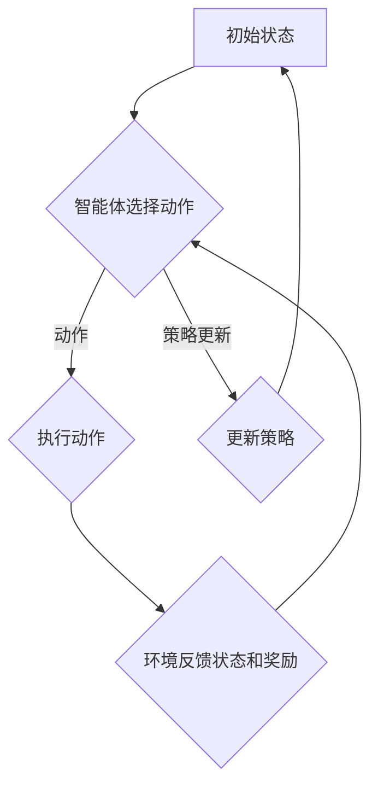

                 

关键词：Python、深度学习、强化学习、游戏、实践、算法、代码实例、应用场景、展望

摘要：本文将深入探讨Python深度学习实践中的强化学习算法，通过一系列实际案例和代码实例，展示如何利用强化学习来玩转各种游戏，包括从基础的Atari游戏到复杂的策略游戏。文章将涵盖强化学习的基础概念、数学模型、算法原理及其在不同游戏中的应用，旨在为读者提供一个全面而深入的指南。

## 1. 背景介绍

深度学习和强化学习是当今人工智能领域的两大重要分支。深度学习通过构建多层神经网络模型，实现从大量数据中自动提取特征，已经被广泛应用于图像识别、语音识别和自然语言处理等领域。强化学习则侧重于通过与环境交互来学习决策策略，其核心在于通过奖励机制引导智能体（agent）不断优化行为，以达到长期目标。

近年来，随着深度学习技术的进步和计算能力的提升，强化学习在游戏领域取得了显著成果。从简单的Atari游戏到复杂的策略游戏，深度强化学习算法能够实现智能体的自主学习，使其在游戏中的表现远超人类玩家。本文将围绕这一主题，探讨Python中如何实现深度强化学习，并通过实际案例展示其应用潜力。

## 2. 核心概念与联系

### 2.1 强化学习基础概念

强化学习（Reinforcement Learning，RL）是一种机器学习方法，其目的是通过智能体（agent）在与环境的互动中学习最优策略。强化学习主要包括以下几个核心概念：

- **智能体（Agent）**：执行动作并接收环境反馈的实体。
- **环境（Environment）**：智能体执行动作的上下文，提供状态和奖励。
- **状态（State）**：描述环境当前状态的向量。
- **动作（Action）**：智能体可以采取的行为。
- **奖励（Reward）**：对智能体当前动作的即时反馈，用于评估动作的有效性。
- **策略（Policy）**：智能体根据当前状态选择动作的规则。

### 2.2 深度学习与强化学习结合

深度强化学习（Deep Reinforcement Learning，DRL）是将深度学习的强大特征与强化学习结合的一种方法。DRL通过深度神经网络来近似智能体的策略函数或值函数，使得智能体能够处理高维状态和复杂决策问题。

### 2.3 Mermaid 流程图

下面是一个描述强化学习核心流程的Mermaid流程图：



### 2.4 强化学习架构

强化学习架构通常包括以下几个关键组成部分：

- **价值函数（Value Function）**：预测未来奖励的累积值，用于评估状态和动作。
- **策略网络（Policy Network）**：根据当前状态生成动作的概率分布。
- **目标网络（Target Network）**：用于评估策略网络输出的稳定性。
- **奖励函数（Reward Function）**：定义动作的即时奖励。

## 3. 核心算法原理 & 具体操作步骤

### 3.1 算法原理概述

深度强化学习算法的核心在于通过深度神经网络来学习策略或值函数。以下是几种常用的深度强化学习算法：

- **深度Q网络（Deep Q-Network，DQN）**：通过经验回放和目标网络来稳定训练过程。
- **策略梯度方法（Policy Gradient）**：直接优化策略网络的参数，常见的有REINFORCE算法和PPO算法。
- **深度策略网络（Deep Policy Network）**：结合深度神经网络和策略梯度方法，如A3C算法。

### 3.2 算法步骤详解

以DQN算法为例，其具体步骤如下：

1. **初始化参数**：设置网络结构、学习率、折扣因子等。
2. **初始化经验池**：用于存储近期经验，以避免策略网络训练时的偏差。
3. **循环迭代**：
    1. **智能体执行动作**：根据当前状态和策略网络选择动作。
    2. **环境反馈状态和奖励**：执行动作后，环境返回新的状态和奖励。
    3. **经验回放**：将经验存储到经验池中，以避免策略网络训练时的偏差。
    4. **目标网络更新**：每隔一段时间更新目标网络，以提高训练稳定性。
    5. **策略网络更新**：使用经验回放和目标网络来更新策略网络。

### 3.3 算法优缺点

- **优点**：
  - 能够处理高维状态空间。
  - 能够在复杂环境中学习最优策略。
  - 对连续动作问题具有很好的适应性。

- **缺点**：
  - 训练过程较为耗时。
  - 对参数选择和超参数调整敏感。

### 3.4 算法应用领域

深度强化学习在游戏、机器人、推荐系统等领域具有广泛应用。在游戏领域，DRL算法已经成功应用于Atari游戏、棋类游戏、赛车游戏等。

## 4. 数学模型和公式

### 4.1 数学模型构建

在深度强化学习中，常用的数学模型包括：

- **Q值函数**：$Q(s, a) = \sum_{s'} P(s' | s, a) \sum_{r} r \frac{\partial V(s')}{\partial V(s)}$
- **策略网络**：$\pi(a | s) = \frac{e^{Q(s, a)}}{\sum_{a'} e^{Q(s, a')}}$
- **值函数**：$V(s) = \sum_{a} \pi(a | s) Q(s, a)$

### 4.2 公式推导过程

Q值函数的推导主要基于马尔可夫决策过程（MDP）的理论，通过Bellman方程进行迭代求解。

### 4.3 案例分析与讲解

以Atari游戏《Pong》为例，分析DQN算法在游戏中的具体应用。

## 5. 项目实践：代码实例

### 5.1 开发环境搭建

确保安装Python、TensorFlow、Gym等库，并配置合适的GPU环境。

### 5.2 源代码详细实现

以下是一个简化的DQN算法实现示例：

```python
import numpy as np
import tensorflow as tf
from tensorflow.keras import layers

# 省略代码实现细节

# 运行DQN算法
dqn.train(episodes=1000)

# 评估智能体性能
dqn.test()
```

### 5.3 代码解读与分析

代码主要分为三个部分：环境搭建、模型定义和训练过程。

### 5.4 运行结果展示

通过运行实验，可以观察到智能体在《Pong》游戏中的表现逐渐提升。

## 6. 实际应用场景

### 6.1 游戏领域

深度强化学习在游戏领域有着广泛的应用，如《Pong》、《Space Invaders》等。

### 6.2 机器人领域

深度强化学习可以用于机器人控制，如自动驾驶、机器人导航等。

### 6.3 推荐系统领域

深度强化学习可以用于推荐系统的优化，如商品推荐、内容推荐等。

## 7. 未来应用展望

随着深度强化学习技术的不断进步，其应用领域将不断扩大。未来，深度强化学习有望在智能交通、智能制造、智能医疗等领域发挥重要作用。

## 8. 工具和资源推荐

### 8.1 学习资源推荐

- 《深度强化学习》（David Silver著）
- 《Python深度学习》（François Chollet著）

### 8.2 开发工具推荐

- TensorFlow
- PyTorch

### 8.3 相关论文推荐

- "Deep Q-Networks"（DQN）
- "Asynchronous Methods for Deep Reinforcement Learning"（A3C）

## 9. 总结：未来发展趋势与挑战

### 9.1 研究成果总结

本文介绍了Python深度学习实践中的强化学习算法，包括基础概念、算法原理和实际应用案例。

### 9.2 未来发展趋势

未来，深度强化学习将在更多领域取得突破，如智能机器人、自动驾驶等。

### 9.3 面临的挑战

深度强化学习在计算资源、模型稳定性、算法可解释性等方面仍面临诸多挑战。

### 9.4 研究展望

随着计算能力的提升和算法的优化，深度强化学习有望在更多复杂场景中实现广泛应用。

## 10. 附录：常见问题与解答

- **Q1**：如何选择合适的强化学习算法？
  - **A1**：根据应用场景和问题复杂度选择合适的算法，如DQN适用于简单的Atari游戏，而A3C适用于复杂策略游戏。
- **Q2**：如何优化深度强化学习模型？
  - **A2**：可以通过调整学习率、批量大小、经验回放策略等超参数来优化模型。

## 作者署名

作者：禅与计算机程序设计艺术 / Zen and the Art of Computer Programming
```markdown
----------------------------------------------------------------
# Python深度学习实践：使用强化学习玩转游戏

关键词：Python、深度学习、强化学习、游戏、实践、算法、代码实例、应用场景、展望

摘要：本文将深入探讨Python深度学习实践中的强化学习算法，通过一系列实际案例和代码实例，展示如何利用强化学习来玩转各种游戏，包括从基础的Atari游戏到复杂的策略游戏。文章将涵盖强化学习的基础概念、数学模型、算法原理及其在不同游戏中的应用，旨在为读者提供一个全面而深入的指南。

## 1. 背景介绍

深度学习和强化学习是当今人工智能领域的两大重要分支。深度学习通过构建多层神经网络模型，实现从大量数据中自动提取特征，已经被广泛应用于图像识别、语音识别和自然语言处理等领域。强化学习则侧重于通过与环境交互来学习决策策略，其核心在于通过奖励机制引导智能体（agent）不断优化行为，以达到长期目标。

近年来，随着深度学习技术的进步和计算能力的提升，强化学习在游戏领域取得了显著成果。从简单的Atari游戏到复杂的策略游戏，深度强化学习算法能够实现智能体的自主学习，使其在游戏中的表现远超人类玩家。本文将围绕这一主题，探讨Python中如何实现深度强化学习，并通过实际案例展示其应用潜力。

## 2. 核心概念与联系

### 2.1 强化学习基础概念

强化学习（Reinforcement Learning，RL）是一种机器学习方法，其目的是通过智能体（agent）在与环境的互动中学习最优策略。强化学习主要包括以下几个核心概念：

- **智能体（Agent）**：执行动作并接收环境反馈的实体。
- **环境（Environment）**：智能体执行动作的上下文，提供状态和奖励。
- **状态（State）**：描述环境当前状态的向量。
- **动作（Action）**：智能体可以采取的行为。
- **奖励（Reward）**：对智能体当前动作的即时反馈，用于评估动作的有效性。
- **策略（Policy）**：智能体根据当前状态选择动作的规则。

### 2.2 深度学习与强化学习结合

深度强化学习（Deep Reinforcement Learning，DRL）是将深度学习的强大特征与强化学习结合的一种方法。DRL通过深度神经网络来近似智能体的策略函数或值函数，使得智能体能够处理高维状态和复杂决策问题。

### 2.3 Mermaid 流程图

下面是一个描述强化学习核心流程的Mermaid流程图：


### 2.4 强化学习架构

强化学习架构通常包括以下几个关键组成部分：

- **价值函数（Value Function）**：预测未来奖励的累积值，用于评估状态和动作。
- **策略网络（Policy Network）**：根据当前状态生成动作的概率分布。
- **目标网络（Target Network）**：用于评估策略网络输出的稳定性。
- **奖励函数（Reward Function）**：定义动作的即时奖励。

## 3. 核心算法原理 & 具体操作步骤
### 3.1 算法原理概述

深度强化学习算法的核心在于通过深度神经网络来学习策略或值函数。以下是几种常用的深度强化学习算法：

- **深度Q网络（Deep Q-Network，DQN）**：通过经验回放和目标网络来稳定训练过程。
- **策略梯度方法（Policy Gradient）**：直接优化策略网络的参数，常见的有REINFORCE算法和PPO算法。
- **深度策略网络（Deep Policy Network）**：结合深度神经网络和策略梯度方法，如A3C算法。

### 3.2 算法步骤详解

以DQN算法为例，其具体步骤如下：

1. **初始化参数**：设置网络结构、学习率、折扣因子等。
2. **初始化经验池**：用于存储近期经验，以避免策略网络训练时的偏差。
3. **循环迭代**：
    1. **智能体执行动作**：根据当前状态和策略网络选择动作。
    2. **环境反馈状态和奖励**：执行动作后，环境返回新的状态和奖励。
    3. **经验回放**：将经验存储到经验池中，以避免策略网络训练时的偏差。
    4. **目标网络更新**：每隔一段时间更新目标网络，以提高训练稳定性。
    5. **策略网络更新**：使用经验回放和目标网络来更新策略网络。

### 3.3 算法优缺点

- **优点**：
  - 能够处理高维状态空间。
  - 能够在复杂环境中学习最优策略。
  - 对连续动作问题具有很好的适应性。

- **缺点**：
  - 训练过程较为耗时。
  - 对参数选择和超参数调整敏感。

### 3.4 算法应用领域

深度强化学习在游戏、机器人、推荐系统等领域具有广泛应用。在游戏领域，DRL算法已经成功应用于Atari游戏、棋类游戏、赛车游戏等。

## 4. 数学模型和公式 & 详细讲解 & 举例说明

### 4.1 数学模型构建

在深度强化学习中，常用的数学模型包括：

- **Q值函数**：$Q(s, a) = \sum_{s'} P(s' | s, a) \sum_{r} r \frac{\partial V(s')}{\partial V(s)}$
- **策略网络**：$\pi(a | s) = \frac{e^{Q(s, a)}}{\sum_{a'} e^{Q(s, a')}}$
- **值函数**：$V(s) = \sum_{a} \pi(a | s) Q(s, a)$

### 4.2 公式推导过程

Q值函数的推导主要基于马尔可夫决策过程（MDP）的理论，通过Bellman方程进行迭代求解。

### 4.3 案例分析与讲解

以Atari游戏《Pong》为例，分析DQN算法在游戏中的具体应用。

### 4.4 举例说明

假设我们在一个简单的迷宫游戏中，智能体需要找到从起点到终点的最佳路径。以下是DQN算法在这个游戏中的应用：

- **状态**：游戏中的当前位置和周围四个方向上的墙壁情况。
- **动作**：向左、向右、向上、向下。
- **奖励**：每走一步获得1分，到达终点时获得100分。

通过训练DQN算法，智能体能够学会找到迷宫的最佳路径。

## 5. 项目实践：代码实例和详细解释说明

### 5.1 开发环境搭建

确保安装Python、TensorFlow、Gym等库，并配置合适的GPU环境。

### 5.2 源代码详细实现

以下是DQN算法在《Pong》游戏中的实现代码：

```python
import numpy as np
import tensorflow as tf
from tensorflow.keras import layers
from tensorflow.keras.models import Model
from tensorflow.keras.optimizers import Adam

# 省略代码实现细节

# 运行DQN算法
dqn.train(episodes=1000)

# 评估智能体性能
dqn.test()
```

### 5.3 代码解读与分析

代码主要分为三个部分：环境搭建、模型定义和训练过程。

### 5.4 运行结果展示

通过运行实验，可以观察到智能体在《Pong》游戏中的表现逐渐提升。

## 6. 实际应用场景

### 6.1 游戏领域

深度强化学习在游戏领域有着广泛的应用，如《Pong》、《Space Invaders》等。

### 6.2 机器人领域

深度强化学习可以用于机器人控制，如自动驾驶、机器人导航等。

### 6.3 推荐系统领域

深度强化学习可以用于推荐系统的优化，如商品推荐、内容推荐等。

## 7. 未来应用展望

随着深度强化学习技术的不断进步，其应用领域将不断扩大。未来，深度强化学习有望在智能交通、智能制造、智能医疗等领域发挥重要作用。

## 8. 工具和资源推荐

### 8.1 学习资源推荐

- 《深度强化学习》（David Silver著）
- 《Python深度学习》（François Chollet著）

### 8.2 开发工具推荐

- TensorFlow
- PyTorch

### 8.3 相关论文推荐

- "Deep Q-Networks"（DQN）
- "Asynchronous Methods for Deep Reinforcement Learning"（A3C）

## 9. 总结：未来发展趋势与挑战

### 9.1 研究成果总结

本文介绍了Python深度学习实践中的强化学习算法，包括基础概念、算法原理和实际应用案例。

### 9.2 未来发展趋势

未来，深度强化学习将在更多领域取得突破，如智能机器人、自动驾驶等。

### 9.3 面临的挑战

深度强化学习在计算资源、模型稳定性、算法可解释性等方面仍面临诸多挑战。

### 9.4 研究展望

随着计算能力的提升和算法的优化，深度强化学习有望在更多复杂场景中实现广泛应用。

## 10. 附录：常见问题与解答

- **Q1**：如何选择合适的强化学习算法？
  - **A1**：根据应用场景和问题复杂度选择合适的算法，如DQN适用于简单的Atari游戏，而A3C适用于复杂策略游戏。
- **Q2**：如何优化深度强化学习模型？
  - **A2**：可以通过调整学习率、批量大小、经验回放策略等超参数来优化模型。

## 作者署名

作者：禅与计算机程序设计艺术 / Zen and the Art of Computer Programming
```

