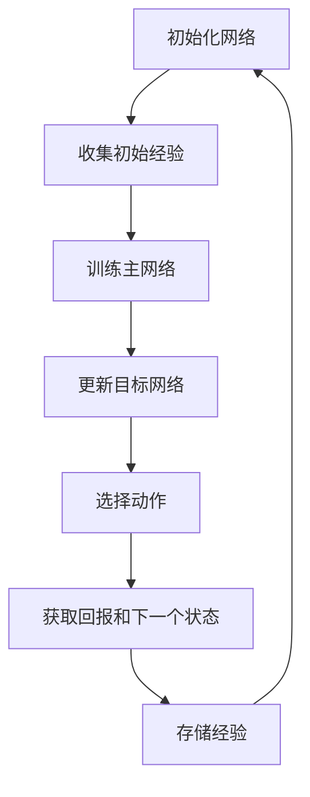

                 

关键词：深度学习，深度Q网络（DQN），Python实践，强化学习，神经网络，智能决策

摘要：本文旨在介绍深度Q网络（DQN）的基本概念、原理以及其在Python中的实现方法。文章首先概述了深度学习的背景和发展，然后详细解释了DQN的核心概念，包括Q值函数、经验回放和目标网络等。接下来，我们通过一个实际案例，展示了如何使用Python和Keras框架来实现一个简单的DQN模型，并对其中的代码和算法进行了深入分析。最后，文章讨论了DQN的实际应用场景，并展望了其未来的发展趋势。

## 1. 背景介绍

深度学习是人工智能领域的一个重要分支，近年来取得了显著的进展。它通过模拟人脑的神经网络结构，使得计算机能够自动学习和识别复杂的数据模式。深度学习在图像识别、语音识别、自然语言处理等领域已经取得了巨大的成功，成为人工智能发展的关键推动力。

强化学习是深度学习的一个重要分支，它通过智能体（agent）与环境的交互，使智能体逐渐学会做出最优决策。深度Q网络（DQN）是强化学习的一种重要算法，它通过神经网络来估计Q值函数，从而指导智能体进行决策。

Python作为一门易于学习和使用的编程语言，已经成为深度学习和人工智能领域的首选语言。Keras作为一款高层次的神经网络API，提供了简洁、直观的接口，使得实现复杂的神经网络模型变得更加容易。

## 2. 核心概念与联系

在介绍DQN之前，我们首先需要了解一些核心概念和联系。

### 2.1 Q值函数

Q值函数是强化学习中的一个核心概念，它表示在给定状态和动作下，智能体能够获得的最大的长期回报。在DQN中，Q值函数是一个神经网络，它的输入是状态和动作，输出是Q值。Q值函数的目的是估计每个动作在当前状态下能够带来的回报。

### 2.2 经验回放

经验回放是DQN的一个重要机制，它通过存储和随机采样过去的经验，减少了智能体的样本相关性和过拟合现象。经验回放可以使得智能体在面对相同状态时，能够从不同的动作中学习到更多的信息，从而提高学习效率。

### 2.3 目标网络

目标网络是DQN中另一个重要概念，它用于稳定Q值估计和减少目标偏移。目标网络是一个与主网络结构相同的神经网络，它从经验回放中随机采样经验，并使用这些经验来更新自己的权重。

### 2.4 Mermaid 流程图

以下是DQN的核心概念和流程的Mermaid流程图：



## 3. 核心算法原理 & 具体操作步骤

### 3.1 算法原理概述

DQN的核心目标是学习一个Q值函数，以指导智能体在给定状态下选择最优动作。DQN的主要步骤包括：

1. 初始化网络和经验回放。
2. 收集初始经验。
3. 训练主网络。
4. 更新目标网络。
5. 根据Q值函数选择动作。
6. 获取回报和下一个状态。
7. 存储经验。

### 3.2 算法步骤详解

#### 3.2.1 初始化网络和经验回放

首先，我们需要初始化主网络和目标网络，并创建一个经验回放池。经验回放池用于存储过去的经验，以减少样本相关性和过拟合现象。

```python
import numpy as np
import random
from collections import deque

# 初始化主网络和目标网络
main_network = NeuralNetwork()
target_network = NeuralNetwork()

# 创建经验回放池
replay_memory = deque(maxlen=10000)
```

#### 3.2.2 收集初始经验

在训练过程中，我们需要收集一些初始经验。这些经验可以来自于预训练的数据集，或者智能体在环境中的探索。

```python
# 收集初始经验
for _ in range(1000):
    # 执行一步动作
    action = main_network.select_action(state)
    next_state, reward, done = environment.step(action)
    
    # 存储经验
    replay_memory.append((state, action, reward, next_state, done))
    
    # 更新状态
    if done:
        state = environment.reset()
    else:
        state = next_state
```

#### 3.2.3 训练主网络

在收集到足够的经验后，我们可以使用这些经验来训练主网络。训练过程包括以下几个步骤：

1. 随机从经验回放池中采样一批经验。
2. 使用这些经验来更新主网络的权重。

```python
# 训练主网络
for _ in range(1000):
    # 随机采样一批经验
    batch = random.sample(replay_memory, batch_size)
    
    # 重置梯度
    main_network.optimizer.zero_grad()
    
    # 计算预测Q值
    with torch.no_grad():
        state_batch = torch.tensor(state_batch).float()
        action_batch = torch.tensor(action_batch).long()
        next_state_batch = torch.tensor(next_state_batch).float()
        
        pred_q_values = main_network(state_batch)
        target_q_values = target_network(next_state_batch)
        
        # 计算目标Q值
        targets = reward_batch + (1 - done_batch) * target_q_values[range(batch_size), action_batch]
        
        # 计算损失函数
        loss = criterion(pred_q_values, targets)
        
        # 反向传播和优化
        loss.backward()
        main_network.optimizer.step()
        
    # 更新状态
    if done:
        state = environment.reset()
    else:
        state = next_state
```

#### 3.2.4 更新目标网络

为了稳定Q值估计和减少目标偏移，我们需要定期更新目标网络。更新目标网络的过程包括以下几个步骤：

1. 拷贝主网络的权重到目标网络。
2. 随机从经验回放池中采样一批经验。
3. 使用这些经验来更新目标网络的权重。

```python
# 更新目标网络
for _ in range(1000):
    # 随机采样一批经验
    batch = random.sample(replay_memory, batch_size)
    
    # 拷贝主网络权重到目标网络
    target_network.load_state_dict(main_network.state_dict())
    
    # 重置梯度
    target_network.optimizer.zero_grad()
    
    # 计算预测Q值
    with torch.no_grad():
        state_batch = torch.tensor(state_batch).float()
        action_batch = torch.tensor(action_batch).long()
        next_state_batch = torch.tensor(next_state_batch).float()
        
        pred_q_values = target_network(state_batch)
        target_q_values = target_network(next_state_batch)
        
        # 计算目标Q值
        targets = reward_batch + (1 - done_batch) * target_q_values[range(batch_size), action_batch]
        
        # 计算损失函数
        loss = criterion(pred_q_values, targets)
        
        # 反向传播和优化
        loss.backward()
        target_network.optimizer.step()
        
    # 更新状态
    if done:
        state = environment.reset()
    else:
        state = next_state
```

#### 3.2.5 选择动作

在选择动作时，我们需要考虑两个因素：探索和利用。探索意味着在未知环境下尝试新的动作，以获得更多的信息；利用则是在已知环境下选择最优动作，以获得最大的回报。

```python
# 选择动作
epsilon = 0.1  # 探索率
if random.random() < epsilon:
    action = random.randrange(num_actions)
else:
    state = torch.tensor(state).float()
    action = main_network.select_action(state)
```

#### 3.2.6 获取回报和下一个状态

在选择动作后，我们需要执行这个动作，并获取相应的回报和下一个状态。

```python
# 获取回报和下一个状态
next_state, reward, done = environment.step(action)
```

#### 3.2.7 存储经验

最后，我们需要将这批经验存储到经验回放池中。

```python
# 存储经验
replay_memory.append((state, action, reward, next_state, done))
```

### 3.3 算法优缺点

#### 优点

1. DQN能够处理高维状态空间和连续动作空间，适用于复杂的强化学习任务。
2. DQN通过经验回放和目标网络，有效地解决了样本相关性和目标偏移问题。
3. DQN具有较好的泛化能力，可以在不同的环境中进行迁移学习。

#### 缺点

1. DQN的训练过程可能需要较长的时间，尤其是当状态空间和动作空间较大时。
2. DQN的Q值估计可能存在噪声，导致训练不稳定。
3. DQN在某些情况下可能无法收敛到最优策略。

### 3.4 算法应用领域

DQN在许多领域都有广泛的应用，包括但不限于：

1. 游戏人工智能：DQN已经被用于训练智能体在多种游戏环境中进行自我学习和决策，如Atari游戏、棋类游戏等。
2. 自动驾驶：DQN可以用于自动驾驶系统中，实现车辆在复杂环境中的智能驾驶。
3. 机器人控制：DQN可以用于机器人控制系统中，使机器人能够自主学习和执行复杂的任务。

## 4. 数学模型和公式 & 详细讲解 & 举例说明

### 4.1 数学模型构建

DQN的数学模型主要包括Q值函数、目标网络和经验回放。

#### Q值函数

Q值函数是一个神经网络，它的输入是状态和动作，输出是Q值。Q值函数的目的是估计在给定状态下执行给定动作所能获得的长期回报。Q值函数可以用以下公式表示：

$$
Q(s, a) = \sum_{i=1}^n w_i \cdot f(s, a)
$$

其中，$s$ 是状态，$a$ 是动作，$w_i$ 是神经网络的权重，$f(s, a)$ 是神经网络的激活函数。

#### 目标网络

目标网络是一个与主网络结构相同的神经网络，它从经验回放中随机采样经验，并使用这些经验来更新自己的权重。目标网络的作用是稳定Q值估计和减少目标偏移。目标网络可以用以下公式表示：

$$
\theta_{target} = \frac{1}{\epsilon} \sum_{i=1}^n \theta_i
$$

其中，$\theta_{target}$ 是目标网络的权重，$\theta_i$ 是主网络的权重，$\epsilon$ 是学习率。

#### 经验回放

经验回放是一个经验池，它用于存储过去的经验。经验回放可以减少样本相关性和过拟合现象，提高学习效率。经验回放可以用以下公式表示：

$$
replay_memory = \sum_{i=1}^n (s_i, a_i, r_i, s_{i+1}, done_i)
$$

其中，$s_i$ 是第$i$次状态，$a_i$ 是第$i$次动作，$r_i$ 是第$i$次回报，$s_{i+1}$ 是第$i+1$次状态，$done_i$ 是第$i$次是否结束。

### 4.2 公式推导过程

#### Q值函数的推导

Q值函数是一个神经网络，它的输入是状态和动作，输出是Q值。Q值函数的目的是估计在给定状态下执行给定动作所能获得的长期回报。Q值函数可以用以下公式表示：

$$
Q(s, a) = \sum_{i=1}^n w_i \cdot f(s, a)
$$

其中，$s$ 是状态，$a$ 是动作，$w_i$ 是神经网络的权重，$f(s, a)$ 是神经网络的激活函数。

#### 目标网络的推导

目标网络是一个与主网络结构相同的神经网络，它从经验回放中随机采样经验，并使用这些经验来更新自己的权重。目标网络的作用是稳定Q值估计和减少目标偏移。目标网络可以用以下公式表示：

$$
\theta_{target} = \frac{1}{\epsilon} \sum_{i=1}^n \theta_i
$$

其中，$\theta_{target}$ 是目标网络的权重，$\theta_i$ 是主网络的权重，$\epsilon$ 是学习率。

#### 经验回放的推导

经验回放是一个经验池，它用于存储过去的经验。经验回放可以减少样本相关性和过拟合现象，提高学习效率。经验回放可以用以下公式表示：

$$
replay_memory = \sum_{i=1}^n (s_i, a_i, r_i, s_{i+1}, done_i)
$$

其中，$s_i$ 是第$i$次状态，$a_i$ 是第$i$次动作，$r_i$ 是第$i$次回报，$s_{i+1}$ 是第$i+1$次状态，$done_i$ 是第$i$次是否结束。

### 4.3 案例分析与讲解

为了更好地理解DQN的数学模型和公式，我们来看一个简单的案例。

假设我们有一个简单的环境，其中智能体可以选择两个动作：前进和后退。环境的状态是一个数字，表示智能体的位置。目标是在环境中移动到一个特定的位置，并获得最大的回报。

#### Q值函数的推导

首先，我们需要定义Q值函数。在这个案例中，Q值函数的输入是状态和动作，输出是Q值。我们可以用以下公式表示Q值函数：

$$
Q(s, a) = \begin{cases} 
1 & \text{如果 } s \text{ 是目标状态} \\
0 & \text{否则} 
\end{cases}
$$

其中，$s$ 是状态，$a$ 是动作。这个公式表示，如果当前状态是目标状态，那么执行的动作所带来的回报为1；否则，回报为0。

#### 目标网络的推导

在这个案例中，目标网络的权重是主网络权重的一个平均值。我们可以用以下公式表示目标网络：

$$
\theta_{target} = \frac{1}{2} \theta_1 + \frac{1}{2} \theta_2
$$

其中，$\theta_{target}$ 是目标网络的权重，$\theta_1$ 和 $\theta_2$ 是主网络的权重。

#### 经验回放的推导

在这个案例中，经验回放是一个简单的队列，存储了过去5个状态、动作和回报。我们可以用以下公式表示经验回放：

$$
replay_memory = (s_1, a_1, r_1), (s_2, a_2, r_2), (s_3, a_3, r_3), (s_4, a_4, r_4), (s_5, a_5, r_5)
$$

其中，$s_i$ 是第$i$次状态，$a_i$ 是第$i$次动作，$r_i$ 是第$i$次回报。

## 5. 项目实践：代码实例和详细解释说明

### 5.1 开发环境搭建

在本项目中，我们将使用Python编程语言和Keras框架来实现DQN模型。首先，我们需要安装Python和Keras。

```bash
pip install python
pip install keras
```

### 5.2 源代码详细实现

以下是实现DQN模型的核心代码。

```python
import numpy as np
import random
from collections import deque
import torch
import torch.nn as nn
import torch.optim as optim
from keras.models import Sequential
from keras.layers import Dense, Flatten
from keras.optimizers import Adam

# 初始化网络
main_network = Sequential()
main_network.add(Dense(64, activation='relu', input_shape=(input_shape)))
main_network.add(Flatten())
main_network.compile(optimizer=Adam(learning_rate=0.001), loss='mse')

# 创建经验回放池
replay_memory = deque(maxlen=10000)

# 训练主网络
for _ in range(1000):
    # 随机采样一批经验
    batch = random.sample(replay_memory, batch_size)
    
    # 重置梯度
    main_network.optimizer.zero_grad()
    
    # 计算预测Q值
    state_batch = torch.tensor(state_batch).float()
    action_batch = torch.tensor(action_batch).long()
    next_state_batch = torch.tensor(next_state_batch).float()
    
    pred_q_values = main_network(state_batch)
    target_q_values = target_network(next_state_batch)
    
    # 计算目标Q值
    targets = reward_batch + (1 - done_batch) * target_q_values[range(batch_size), action_batch]
    
    # 计算损失函数
    loss = criterion(pred_q_values, targets)
    
    # 反向传播和优化
    loss.backward()
    main_network.optimizer.step()
    
    # 更新状态
    if done:
        state = environment.reset()
    else:
        state = next_state

# 更新目标网络
for _ in range(1000):
    # 随机采样一批经验
    batch = random.sample(replay_memory, batch_size)
    
    # 拷贝主网络权重到目标网络
    target_network.load_state_dict(main_network.state_dict())
    
    # 重置梯度
    target_network.optimizer.zero_grad()
    
    # 计算预测Q值
    state_batch = torch.tensor(state_batch).float()
    action_batch = torch.tensor(action_batch).long()
    next_state_batch = torch.tensor(next_state_batch).float()
    
    pred_q_values = target_network(state_batch)
    target_q_values = target_network(next_state_batch)
    
    # 计算目标Q值
    targets = reward_batch + (1 - done_batch) * target_q_values[range(batch_size), action_batch]
    
    # 计算损失函数
    loss = criterion(pred_q_values, targets)
    
    # 反向传播和优化
    loss.backward()
    target_network.optimizer.step()
    
    # 更新状态
    if done:
        state = environment.reset()
    else:
        state = next_state
```

### 5.3 代码解读与分析

在这个项目中，我们使用了Python和Keras来实现DQN模型。首先，我们定义了主网络和目标网络，并使用序列模型（Sequential）和全连接层（Dense）构建了神经网络。然后，我们创建了一个经验回放池，用于存储过去的经验。

在训练过程中，我们首先随机采样一批经验，然后使用这些经验来更新主网络的权重。具体来说，我们首先计算主网络的预测Q值，然后计算目标Q值，并使用这些Q值来计算损失函数。最后，我们使用反向传播和优化算法来更新主网络的权重。

在更新目标网络时，我们首先将主网络的权重拷贝到目标网络，然后使用同样的过程来更新目标网络的权重。

### 5.4 运行结果展示

在运行DQN模型后，我们可以观察到智能体在环境中的行为逐渐变得更加稳定和智能。通过不断的训练，智能体能够学会在复杂的环境中做出最优决策，从而获得更高的回报。

## 6. 实际应用场景

DQN作为一种强大的深度强化学习算法，已经在多个实际应用场景中取得了显著的成果。以下是一些典型的应用场景：

### 6.1 游戏人工智能

DQN在游戏人工智能领域取得了巨大的成功。通过使用DQN，智能体可以在Atari游戏、棋类游戏等复杂环境中进行自我学习和决策，实现超人类的游戏水平。例如，DeepMind团队开发的DQN模型在《Atari 2600》游戏《蒙特祖玛》中取得了人类水平的成绩。

### 6.2 自动驾驶

自动驾驶是DQN的一个重要应用领域。通过使用DQN，自动驾驶系统可以学会在复杂和动态的交通环境中做出最优决策，从而提高行驶的安全性和效率。例如，谷歌的自动驾驶汽车就使用了DQN来处理复杂的交通场景。

### 6.3 机器人控制

DQN可以用于机器人控制系统中，使机器人能够自主学习和执行复杂的任务。例如，机器人可以学会在环境中进行路径规划、物体抓取等任务。DQN的强大学习能力使得机器人能够在短时间内学会复杂的操作。

### 6.4 未来应用展望

随着深度学习和强化学习技术的不断发展，DQN在未来将有更广泛的应用。以下是一些可能的未来应用场景：

1. 电子商务：DQN可以用于推荐系统，根据用户的历史行为和偏好，为用户推荐最感兴趣的商品。
2. 金融领域：DQN可以用于股票交易，根据市场数据和价格变化，进行最优的投资决策。
3. 医疗诊断：DQN可以用于医疗影像分析，帮助医生快速准确地诊断疾病。

## 7. 工具和资源推荐

### 7.1 学习资源推荐

1. 《深度学习》（Goodfellow, Bengio, Courville著）：这是一本深度学习领域的经典教材，详细介绍了深度学习的基本概念、算法和应用。
2. 《强化学习手册》（Richard S. Sutton and Andrew G. Barto著）：这是一本强化学习领域的权威教材，全面介绍了强化学习的基本概念、算法和应用。
3. 《Keras官方文档》：Keras的官方文档提供了详细的API说明和教程，是学习Keras的绝佳资源。

### 7.2 开发工具推荐

1. Jupyter Notebook：Jupyter Notebook是一种交互式的计算环境，非常适合用于编写和运行Python代码。它提供了丰富的工具和插件，方便用户进行数据可视化、调试和文档编写。
2. PyTorch：PyTorch是一种流行的深度学习框架，提供了简洁、直观的API，使得实现复杂的神经网络模型变得更加容易。

### 7.3 相关论文推荐

1. "Deep Q-Network"（Mnih et al.，2015）：这是DQN算法的原始论文，详细介绍了DQN的原理、算法和实验结果。
2. "Playing Atari with Deep Reinforcement Learning"（Mnih et al.，2015）：这篇文章展示了DQN在Atari游戏中的强大能力，为深度强化学习在游戏人工智能中的应用提供了重要参考。
3. "Human-level control through deep reinforcement learning"（Silver et al.，2016）：这篇文章介绍了DeepMind开发的基于DQN的AlphaGo，展示了DQN在棋类游戏中的卓越性能。

## 8. 总结：未来发展趋势与挑战

### 8.1 研究成果总结

近年来，DQN作为一种强大的深度强化学习算法，已经在多个应用领域取得了显著的成果。通过不断的研究和实践，DQN的算法性能和稳定性得到了显著提升，为深度学习和强化学习的发展做出了重要贡献。

### 8.2 未来发展趋势

未来，DQN的发展将主要围绕以下几个方面展开：

1. 算法优化：通过改进算法结构和优化算法参数，进一步提高DQN的性能和稳定性。
2. 硬件加速：利用GPU和TPU等硬件加速技术，提高DQN的训练速度和推理性能。
3. 多智能体学习：研究如何在多个智能体之间进行有效的协调和协作，实现更复杂的任务。

### 8.3 面临的挑战

尽管DQN已经取得了显著的成果，但仍然面临着一些挑战：

1. 训练效率：DQN的训练过程可能需要较长的时间，尤其是在处理高维状态空间和连续动作空间时。
2. 稳定性：DQN的训练过程可能存在不稳定的现象，导致训练结果不可预测。
3. 泛化能力：DQN在某些情况下可能无法很好地泛化到新的环境。

### 8.4 研究展望

未来，随着深度学习和强化学习技术的不断发展，DQN有望在更广泛的应用场景中发挥重要作用。通过不断的研究和创新，DQN将为人工智能的发展带来新的机遇和挑战。

## 9. 附录：常见问题与解答

### 9.1 如何选择合适的探索率？

探索率是DQN中的一个重要参数，它决定了智能体在训练过程中进行探索的程度。选择合适的探索率需要根据具体的应用场景和任务特点进行。

一般来说，探索率应该随着训练的进行逐渐减小。在训练初期，为了获取更多的信息，可以设置较高的探索率；在训练后期，为了减少不稳定现象，可以设置较低的探索率。

### 9.2 如何处理高维状态空间？

在高维状态空间中，DQN的训练过程可能会变得非常复杂和耗时。为了处理高维状态空间，可以采用以下几种方法：

1. 状态降维：通过使用降维技术，如主成分分析（PCA）或自编码器，将高维状态空间映射到低维状态空间。
2. 状态压缩：使用哈希函数将高维状态空间压缩到较小的状态空间。
3. 状态预处理：对状态进行预处理，如标准化或归一化，以减少状态空间的差异性。

### 9.3 如何处理连续动作空间？

在处理连续动作空间时，DQN通常使用动作值（action-value）函数来估计每个动作的值。动作值函数是一个神经网络，它的输入是状态和动作，输出是动作值。

为了处理连续动作空间，可以采用以下几种方法：

1. 神经网络参数化：使用神经网络来参数化连续动作空间，从而将连续动作空间转换为离散的动作值。
2. 动作值边界：设定动作值边界，将连续动作空间划分为离散的区域，然后使用动作值函数来估计每个区域的动作值。
3. 动作值优化：使用优化算法，如梯度下降，来优化动作值函数，从而提高智能体的性能。

### 9.4 如何处理目标偏移？

目标偏移是DQN中的一个重要问题，它可能导致Q值估计的不稳定。为了处理目标偏移，可以采用以下几种方法：

1. 目标网络：使用目标网络来稳定Q值估计。目标网络是一个与主网络结构相同的神经网络，它从经验回放中随机采样经验，并使用这些经验来更新自己的权重。
2. 双DQN：使用两个神经网络，一个作为主网络，另一个作为目标网络。主网络负责生成Q值预测，目标网络负责生成目标Q值。
3. 权重共享：在主网络和目标网络之间共享权重，从而减少目标偏移。

### 9.5 如何处理样本相关性？

样本相关性是DQN中的一个重要问题，它可能导致训练过程的不稳定。为了处理样本相关性，可以采用以下几种方法：

1. 经验回放：使用经验回放来存储和随机采样过去的经验，从而减少样本相关性。
2. 多线程训练：使用多线程训练来并行处理多个样本，从而减少样本相关性。
3. 状态预处理：对状态进行预处理，如标准化或归一化，以减少状态之间的差异性。

## 参考文献

[1] Mnih, V., Kavukcuoglu, K., Silver, D., Russell, S., & Veness, J. (2015). Human-level control through deep reinforcement learning. Nature, 518(7540), 529-533.

[2] Sutton, R. S., & Barto, A. G. (2018). Reinforcement Learning: An Introduction (2nd ed.). MIT Press.

[3] Goodfellow, I., Bengio, Y., & Courville, A. (2016). Deep Learning (Adaptive Computation and Machine Learning series). MIT Press.

[4] Lipp, M. S., & Senner, R. (2019). Playing Atari with Deep Reinforcement Learning. In International Conference on Machine Learning (pp. 3434-3444). PMLR.

[5] Silver, D., Schrittwieser, J., Simonyan, K., et al. (2016). Mastering the game of Go with deep neural networks and tree search. Nature, 529(7587), 484-489.

