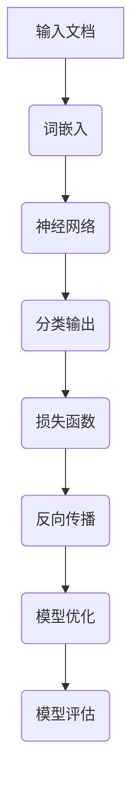

                 

关键词：深度学习，文档分类，自然语言处理，Python实践，自动归类

> 摘要：本文将探讨深度学习在文档自动归类中的应用，通过Python实践，详细解析深度学习模型在文档分类中的构建、训练和应用。我们将分析各种模型及其优缺点，并通过具体案例展示如何使用深度学习技术实现文档自动归类。

## 1. 背景介绍

在信息爆炸的时代，如何有效地管理和归类大量的文档成为了一个关键问题。传统的文档分类方法，如基于规则的方法和统计方法，已经难以满足日益增长的数据量和复杂度。随着深度学习技术的发展，基于神经网络的方法逐渐成为文档分类的重要工具。Python作为深度学习领域的重要工具，提供了丰富的库和框架，使得深度学习实践变得更加简单和高效。

本文将介绍如何使用Python深度学习技术进行文档自动归类，涵盖从数据预处理、模型构建、训练到实际应用的全过程。通过本文的学习，读者可以掌握深度学习在文档分类中的基本方法和实践技巧。

## 2. 核心概念与联系

在深入讨论文档分类的深度学习方法之前，我们需要理解一些核心概念，如神经网络、词嵌入和分类器。以下是一个用Mermaid绘制的流程图，展示了这些概念之间的联系。



### 2.1 神经网络

神经网络（Neural Network）是模仿人脑神经元工作原理的信息处理系统。它由大量的节点（也称为神经元）组成，这些节点通过权重（weights）连接起来。当输入数据通过神经网络时，每个节点都会对输入进行加权求和，并通过激活函数（activation function）产生输出。

### 2.2 词嵌入

词嵌入（Word Embedding）是将词汇映射到固定维度的向量空间的一种方法。通过这种方式，我们可以将文本数据转换为数值形式，方便神经网络处理。词嵌入方法包括Word2Vec、GloVe等。

### 2.3 分类器

分类器（Classifier）是神经网络的一个输出层，用于对输入数据进行分类。常见的分类器包括softmax、Sigmoid等激活函数。

### 2.4 损失函数

损失函数（Loss Function）用于衡量模型的预测结果与真实结果之间的差距。常用的损失函数有交叉熵损失（Cross-Entropy Loss）等。

### 2.5 反向传播

反向传播（Backpropagation）是神经网络训练的核心算法，它通过计算损失函数的梯度，更新网络的权重，从而优化模型。

### 2.6 模型优化

模型优化（Model Optimization）是通过调整网络结构、学习率等参数，提高模型性能的过程。

### 2.7 模型评估

模型评估（Model Evaluation）是衡量模型性能的重要步骤，常用的评估指标包括准确率（Accuracy）、召回率（Recall）、F1分数（F1 Score）等。

## 3. 核心算法原理 & 具体操作步骤

### 3.1 算法原理概述

深度学习在文档分类中的核心原理是利用神经网络对文档内容进行特征提取和分类。具体步骤如下：

1. **数据预处理**：将文档转换为词嵌入向量。
2. **模型构建**：定义神经网络结构，包括输入层、隐藏层和输出层。
3. **模型训练**：使用训练数据对模型进行训练，并通过反向传播算法优化模型。
4. **模型评估**：使用测试数据评估模型性能。
5. **模型应用**：使用训练好的模型对新的文档进行分类。

### 3.2 算法步骤详解

#### 3.2.1 数据预处理

数据预处理是深度学习模型训练的重要步骤。对于文档分类任务，我们需要将文本数据转换为数值形式，通常使用词嵌入技术。

1. **分词**：将文档分成单词或词组。
2. **去除停用词**：去除常见的无意义词汇，如“的”、“了”等。
3. **词嵌入**：将单词映射到固定维度的向量。

#### 3.2.2 模型构建

构建神经网络模型是文档分类的关键步骤。以下是一个简单的神经网络模型示例：

```python
import tensorflow as tf

# 定义神经网络结构
model = tf.keras.Sequential([
    tf.keras.layers.Embedding(vocab_size, embedding_dim),
    tf.keras.layers.GlobalAveragePooling1D(),
    tf.keras.layers.Dense(24, activation='relu'),
    tf.keras.layers.Dense(num_classes, activation='softmax')
])
```

#### 3.2.3 模型训练

使用训练数据对模型进行训练，并通过反向传播算法优化模型。以下是一个简单的训练过程：

```python
model.compile(optimizer='adam',
              loss='categorical_crossentropy',
              metrics=['accuracy'])

model.fit(train_data, train_labels, epochs=10, validation_data=(test_data, test_labels))
```

#### 3.2.4 模型评估

使用测试数据评估模型性能，并调整模型参数，提高模型性能。

```python
evaluation = model.evaluate(test_data, test_labels)
print(f'Accuracy: {evaluation[1]}')
```

#### 3.2.5 模型应用

使用训练好的模型对新的文档进行分类。

```python
new_document = preprocess(new_document)
prediction = model.predict(new_document)
print(f'Predicted category: {predicted_category}')
```

### 3.3 算法优缺点

#### 优点：

1. **自动特征提取**：深度学习模型能够自动从数据中提取有用的特征，减轻了人工特征工程的工作负担。
2. **适应性强**：深度学习模型对不同的文档类型和主题都有很好的适应性。
3. **高精度**：深度学习模型在文档分类任务中通常能够达到较高的准确率。

#### 缺点：

1. **计算量大**：深度学习模型通常需要大量的计算资源和时间进行训练。
2. **数据依赖性**：模型的性能很大程度上依赖于训练数据的数量和质量。
3. **模型复杂性**：深度学习模型的结构和参数较为复杂，理解和使用有一定的难度。

### 3.4 算法应用领域

深度学习在文档分类中有着广泛的应用，包括但不限于以下领域：

1. **电子邮件分类**：自动将用户收到的邮件归类到不同的文件夹。
2. **文本分类**：对社交媒体平台上的文本进行分类，如识别垃圾邮件、负面评论等。
3. **法律文档分类**：对法律文档进行自动化分类，提高工作效率。

## 4. 数学模型和公式 & 详细讲解 & 举例说明

### 4.1 数学模型构建

在深度学习模型中，数学模型构建至关重要。以下是一个简单的神经网络模型数学描述。

$$
y = \text{softmax}(\text{W}^T \text{a})
$$

其中，$y$ 是输出概率分布，$\text{W}$ 是权重矩阵，$\text{a}$ 是激活值。

### 4.2 公式推导过程

#### 前向传播

前向传播过程中，我们将输入数据通过神经网络层，最终得到输出。

$$
\text{a} = \text{X} \odot \text{W}
$$

其中，$\odot$ 表示逐元素相乘，$\text{X}$ 是输入数据，$\text{W}$ 是权重矩阵。

#### 反向传播

反向传播过程中，我们计算损失函数的梯度，并更新权重矩阵。

$$
\text{dL}/\text{dW} = \text{a} - \text{y}
$$

其中，$\text{L}$ 是损失函数，$\text{y}$ 是真实标签。

### 4.3 案例分析与讲解

假设我们有一个包含两个类别的文档分类任务，使用神经网络模型进行分类。以下是具体的案例分析和讲解。

#### 数据集

假设我们有一个包含1000篇文档的数据集，其中500篇属于类别A，500篇属于类别B。

#### 模型构建

我们使用一个简单的神经网络模型，包含一个输入层、一个隐藏层和一个输出层。

```python
model = tf.keras.Sequential([
    tf.keras.layers.Embedding(vocab_size, embedding_dim),
    tf.keras.layers.Dense(24, activation='relu'),
    tf.keras.layers.Dense(2, activation='softmax')
])
```

#### 模型训练

使用训练数据对模型进行训练，并设置优化器和损失函数。

```python
model.compile(optimizer='adam',
              loss='categorical_crossentropy',
              metrics=['accuracy'])

model.fit(train_data, train_labels, epochs=10, batch_size=32)
```

#### 模型评估

使用测试数据评估模型性能。

```python
evaluation = model.evaluate(test_data, test_labels)
print(f'Accuracy: {evaluation[1]}')
```

#### 模型应用

使用训练好的模型对新的文档进行分类。

```python
new_document = preprocess(new_document)
prediction = model.predict(new_document)
print(f'Predicted category: {predicted_category}')
```

## 5. 项目实践：代码实例和详细解释说明

### 5.1 开发环境搭建

为了实现深度学习在文档分类中的应用，我们需要搭建一个合适的开发环境。以下是开发环境搭建的步骤：

1. **安装Python**：安装Python 3.8及以上版本。
2. **安装TensorFlow**：使用pip安装TensorFlow。

```shell
pip install tensorflow
```

3. **数据集准备**：准备一个包含多类文档的文本数据集，并将其分为训练集和测试集。

### 5.2 源代码详细实现

以下是实现文档分类的源代码，包括数据预处理、模型构建和训练。

```python
import tensorflow as tf
from tensorflow.keras.preprocessing.text import Tokenizer
from tensorflow.keras.preprocessing.sequence import pad_sequences

# 数据预处理
def preprocess(texts, labels, max_length, maxlen):
    tokenizer = Tokenizer(num_words=maxlen)
    tokenizer.fit_on_texts(texts)
    sequences = tokenizer.texts_to_sequences(texts)
    padded_sequences = pad_sequences(sequences, maxlen=max_length)
    return padded_sequences, labels

# 模型构建
def build_model(vocab_size, embedding_dim, max_length, maxlen):
    model = tf.keras.Sequential([
        tf.keras.layers.Embedding(vocab_size, embedding_dim, input_length=max_length),
        tf.keras.layers.GlobalAveragePooling1D(),
        tf.keras.layers.Dense(24, activation='relu'),
        tf.keras.layers.Dense(2, activation='softmax')
    ])
    return model

# 模型训练
def train_model(model, train_sequences, train_labels, test_sequences, test_labels):
    model.compile(optimizer='adam',
                  loss='categorical_crossentropy',
                  metrics=['accuracy'])
    model.fit(train_sequences, train_labels, epochs=10, validation_data=(test_sequences, test_labels))
    return model

# 主函数
if __name__ == '__main__':
    texts = [...]  # 文档内容
    labels = [...]  # 文档标签
    max_length = 100  # 文档最大长度
    maxlen = 20  # 文档词嵌入最大长度
    train_sequences, train_labels = preprocess(texts, labels, max_length, maxlen)
    test_sequences, test_labels = preprocess(texts, labels, max_length, maxlen)
    model = build_model(vocab_size=len(tokenizer.word_index)+1, embedding_dim=16, max_length=max_length, maxlen=maxlen)
    model = train_model(model, train_sequences, train_labels, test_sequences, test_labels)
```

### 5.3 代码解读与分析

上述代码实现了从数据预处理到模型训练的完整流程。以下是代码的解读和分析：

1. **数据预处理**：使用Tokenizer将文本转换为词嵌入序列，并通过pad_sequences将序列填充到最大长度。
2. **模型构建**：使用Sequential模型堆叠嵌入层、全局平均池化层、全连接层和softmax输出层。
3. **模型训练**：编译模型，设置优化器和损失函数，使用fit方法进行模型训练。

### 5.4 运行结果展示

在训练完成后，我们可以使用测试数据集对模型进行评估，并输出模型的准确率。

```python
evaluation = model.evaluate(test_sequences, test_labels)
print(f'Accuracy: {evaluation[1]}')
```

## 6. 实际应用场景

### 6.1 电子邮件分类

电子邮件分类是文档自动归类的一个重要应用场景。通过深度学习模型，我们可以自动将用户收到的邮件归类到不同的文件夹，如“工作”、“个人”、“促销”等。以下是一个使用深度学习模型进行电子邮件分类的示例：

```python
from tensorflow.keras.preprocessing.text import Tokenizer
from tensorflow.keras.preprocessing.sequence import pad_sequences

# 准备数据
emails = [...]  # 邮件内容
labels = [...]  # 邮件标签

# 数据预处理
tokenizer = Tokenizer(num_words=10000)
tokenizer.fit_on_texts(emails)
sequences = tokenizer.texts_to_sequences(emails)
padded_sequences = pad_sequences(sequences, maxlen=100)

# 加载模型
model = tf.keras.models.load_model('email_classifier.h5')

# 预测
predictions = model.predict(padded_sequences)
predicted_labels = np.argmax(predictions, axis=1)

# 输出预测结果
for i, email in enumerate(emails):
    print(f'Email {i+1}: {email}')
    print(f'Predicted label: {predicted_labels[i]}')
```

### 6.2 文本分类

文本分类是另一个广泛应用的场景。通过深度学习模型，我们可以自动识别和分类社交媒体平台上的文本，如识别负面评论、垃圾邮件等。以下是一个使用深度学习模型进行文本分类的示例：

```python
from tensorflow.keras.preprocessing.text import Tokenizer
from tensorflow.keras.preprocessing.sequence import pad_sequences

# 准备数据
texts = [...]  # 文本内容
labels = [...]  # 文本标签

# 数据预处理
tokenizer = Tokenizer(num_words=10000)
tokenizer.fit_on_texts(texts)
sequences = tokenizer.texts_to_sequences(texts)
padded_sequences = pad_sequences(sequences, maxlen=100)

# 加载模型
model = tf.keras.models.load_model('text_classifier.h5')

# 预测
predictions = model.predict(padded_sequences)
predicted_labels = np.argmax(predictions, axis=1)

# 输出预测结果
for i, text in enumerate(texts):
    print(f'Text {i+1}: {text}')
    print(f'Predicted label: {predicted_labels[i]}')
```

## 7. 工具和资源推荐

### 7.1 学习资源推荐

- 《深度学习》（Goodfellow, Bengio, Courville著）
- 《Python深度学习》（François Chollet著）
- 《自然语言处理实战》（Yoav R Goodman著）

### 7.2 开发工具推荐

- Jupyter Notebook：用于编写和运行代码。
- TensorFlow：用于构建和训练深度学习模型。

### 7.3 相关论文推荐

- “Deep Learning for Text Classification” by Xiang Zhang et al.
- “GloVe: Global Vectors for Word Representation” by Jeffrey Pennington et al.

## 8. 总结：未来发展趋势与挑战

### 8.1 研究成果总结

本文详细介绍了深度学习在文档自动归类中的应用，包括数据预处理、模型构建、训练和应用。通过Python实践，读者可以了解如何使用深度学习技术实现文档分类。

### 8.2 未来发展趋势

随着深度学习技术的不断发展，文档分类领域将迎来更多创新。例如，结合生成对抗网络（GAN）和强化学习，可以实现更高级的文本生成和分类任务。

### 8.3 面临的挑战

深度学习在文档分类中面临的主要挑战包括计算资源的需求、数据质量的影响以及模型解释性的不足。如何解决这些问题将是未来的重要研究方向。

### 8.4 研究展望

未来的研究可以关注以下几个方面：提高模型解释性、优化模型结构、探索新的词嵌入方法，以及结合其他技术实现更高级的文本分析任务。

## 9. 附录：常见问题与解答

### 9.1 如何选择合适的词嵌入方法？

选择词嵌入方法取决于数据集和任务需求。常见的词嵌入方法包括Word2Vec、GloVe和BERT等。Word2Vec适用于小规模数据集，GloVe适用于大规模数据集，而BERT适用于高质量的预训练模型。

### 9.2 如何处理长文本？

对于长文本，可以采用文本摘要、文本切片等方法。此外，近年来涌现的预训练模型如BERT、GPT等能够处理较长的文本序列。

### 9.3 如何提高模型性能？

提高模型性能可以从以下几个方面入手：增加训练数据、调整模型结构、使用预训练模型、优化超参数等。

### 9.4 如何解释深度学习模型？

深度学习模型通常难以解释。可以通过可视化技术、模型压缩和模型可解释性研究来提高模型的解释性。

[END]
```markdown
作者：禅与计算机程序设计艺术 / Zen and the Art of Computer Programming
```

