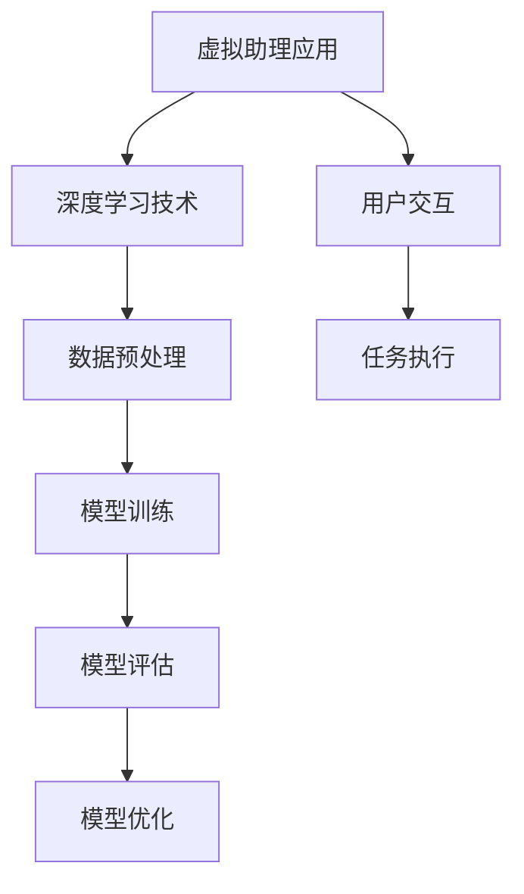
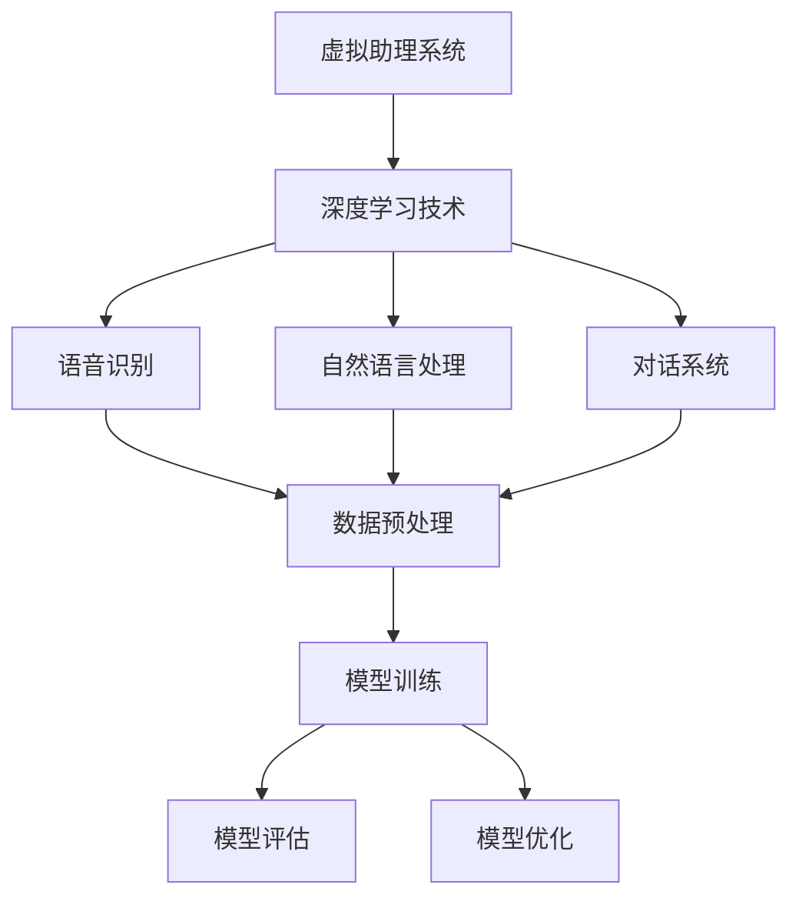

                 

关键词：深度学习，虚拟助理，Python实践，自然语言处理，神经网络，语音识别，模型优化

>摘要：本文旨在探讨深度学习在虚拟助理中的应用，通过Python实践，介绍如何构建和优化基于深度学习的虚拟助理系统。文章首先介绍深度学习的基本概念和虚拟助理的定义，随后深入探讨深度学习在语音识别、自然语言处理和对话系统中的应用，并展示了一个完整的虚拟助理项目实践过程。最后，文章总结未来发展趋势和挑战，为开发者提供有益的参考。

## 1. 背景介绍

在当今技术飞速发展的时代，虚拟助理（Virtual Assistant，VA）已经成为企业和消费者的重要工具。虚拟助理是一种基于人工智能技术的智能系统，能够通过自然语言交互为用户提供各种服务，如日程管理、信息查询、语音识别和任务自动化等。随着深度学习技术的成熟，虚拟助理的性能得到了显著提升，其在实际应用中的价值也逐渐凸显。

深度学习（Deep Learning）是机器学习（Machine Learning）的一个子领域，其核心在于通过多层神经网络模拟人脑的学习过程，实现数据的自动特征提取和模式识别。深度学习已经在图像识别、语音识别、自然语言处理等多个领域取得了突破性进展，成为现代人工智能研究的热点方向。

Python作为一种简单易学、功能强大的编程语言，在人工智能领域具有广泛的应用。本文将通过Python实践，介绍如何构建和优化基于深度学习的虚拟助理系统，旨在帮助读者深入了解深度学习在虚拟助理中的应用，并为实际项目开发提供参考。

### Mermaid 流程图



## 2. 核心概念与联系

### 2.1 深度学习基本概念

深度学习是基于多层神经网络的结构，其核心思想是通过反向传播算法不断调整网络权重，从而实现对数据的自动特征提取和模式识别。深度学习的关键组成部分包括：

- **神经网络（Neural Network）**：一种模仿人脑神经元连接的数学模型，用于处理和分类数据。
- **激活函数（Activation Function）**：用于引入非线性因素，使神经网络能够解决复杂问题。
- **反向传播算法（Backpropagation Algorithm）**：一种用于计算神经网络参数梯度的算法，用于模型训练。
- **优化算法（Optimization Algorithm）**：如随机梯度下降（Stochastic Gradient Descent，SGD）、Adam优化器等，用于加速模型训练。

### 2.2 虚拟助理概念

虚拟助理是一种能够模拟人类对话和执行任务的智能系统。其主要功能包括：

- **自然语言理解（Natural Language Understanding，NLU）**：理解用户输入的文本或语音，并将其转化为机器可处理的格式。
- **对话管理（Dialogue Management）**：管理对话流程，确保对话的连贯性和有效性。
- **自然语言生成（Natural Language Generation，NLG）**：根据用户需求和系统状态生成自然语言的回复。

### 2.3 深度学习在虚拟助理中的应用

深度学习在虚拟助理中的应用主要体现在以下几个方面：

- **语音识别（Voice Recognition）**：使用深度神经网络对用户语音进行识别，实现语音到文本的转换。
- **自然语言处理（Natural Language Processing，NLP）**：通过深度学习技术对文本进行理解和分析，实现语义理解、实体识别等任务。
- **对话系统（Dialogue System）**：利用深度学习模型进行对话管理，实现与用户的自然语言交互。

### 2.4 Mermaid 流程图



## 3. 核心算法原理 & 具体操作步骤

### 3.1 算法原理概述

深度学习在虚拟助理中的应用主要依赖于以下核心算法：

- **卷积神经网络（Convolutional Neural Network，CNN）**：主要用于图像识别和语音处理。
- **循环神经网络（Recurrent Neural Network，RNN）**：主要用于序列数据处理，如自然语言处理。
- **长短时记忆网络（Long Short-Term Memory，LSTM）**：RNN的一种变体，能够更好地处理长序列数据。
- **生成对抗网络（Generative Adversarial Network，GAN）**：主要用于生成高质量的语音和图像数据。

### 3.2 算法步骤详解

#### 3.2.1 语音识别

1. **数据采集**：收集大量语音数据，包括不同说话人、不同语音环境下的语音样本。
2. **数据预处理**：对语音数据进行预处理，如归一化、分帧、加窗等。
3. **特征提取**：使用CNN提取语音特征，如Mel频率倒谱系数（MFCC）。
4. **模型训练**：使用LSTM或LSTM变体（如GRU、BiLSTM）进行模型训练。
5. **模型评估**：使用测试集对模型进行评估，如准确率、召回率等。

#### 3.2.2 自然语言处理

1. **文本预处理**：对文本数据进行预处理，如分词、去停用词、词向量表示等。
2. **词向量表示**：使用Word2Vec、GloVe等方法进行词向量表示。
3. **模型训练**：使用RNN、LSTM或BERT等模型进行模型训练。
4. **模型评估**：使用测试集对模型进行评估，如分类准确率、语义匹配分数等。

#### 3.2.3 对话系统

1. **对话管理**：使用图神经网络（Graph Neural Network，GNN）或转换器（Transformer）模型进行对话管理。
2. **模型训练**：使用大量对话数据进行模型训练。
3. **模型评估**：使用测试集对模型进行评估，如BLEU分数、ROUGE分数等。

### 3.3 算法优缺点

#### 优点

- **强大的特征提取能力**：深度学习能够自动提取数据中的复杂特征，提高模型性能。
- **自适应学习能力**：深度学习模型能够根据数据自动调整参数，适应不同应用场景。
- **高效率**：深度学习模型在计算效率方面具有优势，能够快速处理大量数据。

#### 缺点

- **数据依赖性强**：深度学习模型对数据量有较高要求，数据不足可能导致模型性能下降。
- **训练过程复杂**：深度学习模型的训练过程涉及大量参数调整和优化，需要大量计算资源。

### 3.4 算法应用领域

深度学习在虚拟助理中的应用主要包括：

- **语音助手**：如苹果的Siri、亚马逊的Alexa等。
- **聊天机器人**：如微软的Tay、腾讯的小微等。
- **智能客服**：用于自动化客户服务，提高企业运营效率。

## 4. 数学模型和公式 & 详细讲解 & 举例说明

### 4.1 数学模型构建

深度学习模型的构建主要包括以下几个步骤：

1. **输入层**：接收原始数据，如图像、语音或文本。
2. **隐藏层**：通过神经网络的权重和激活函数对输入数据进行特征提取和变换。
3. **输出层**：生成预测结果，如分类标签或回归值。

### 4.2 公式推导过程

以下是一个简单的深度学习模型公式推导：

$$
z = \sum_{i=1}^{n} w_i \cdot x_i + b
$$

其中，$z$ 是隐藏层的输出，$w_i$ 是权重，$x_i$ 是输入特征，$b$ 是偏置。

$$
a = \sigma(z)
$$

其中，$\sigma$ 是激活函数，如ReLU函数或Sigmoid函数。

$$
y = \sum_{i=1}^{n} w_i \cdot a_i + b
$$

其中，$y$ 是输出层的输出。

### 4.3 案例分析与讲解

以下是一个简单的文本分类案例：

1. **数据预处理**：对文本数据进行分词、去停用词和词向量表示。
2. **模型训练**：使用卷积神经网络（CNN）对文本数据进行特征提取。
3. **模型评估**：使用测试集对模型进行评估，如准确率、召回率等。

```python
import tensorflow as tf
from tensorflow.keras.preprocessing.text import Tokenizer
from tensorflow.keras.preprocessing.sequence import pad_sequences
from tensorflow.keras.models import Sequential
from tensorflow.keras.layers import Embedding, Conv1D, GlobalMaxPooling1D, Dense

# 数据预处理
tokenizer = Tokenizer(num_words=10000)
tokenizer.fit_on_texts(train_texts)
train_sequences = tokenizer.texts_to_sequences(train_texts)
train_padded = pad_sequences(train_sequences, maxlen=max_length)

# 模型构建
model = Sequential()
model.add(Embedding(num_words, embedding_dim, input_length=max_length))
model.add(Conv1D(filters, kernel_size, activation='relu'))
model.add(GlobalMaxPooling1D())
model.add(Dense(units, activation='softmax'))

# 模型训练
model.compile(optimizer='adam', loss='categorical_crossentropy', metrics=['accuracy'])
model.fit(train_padded, train_labels, epochs=10, batch_size=32)

# 模型评估
test_sequences = tokenizer.texts_to_sequences(test_texts)
test_padded = pad_sequences(test_sequences, maxlen=max_length)
predictions = model.predict(test_padded)
accuracy = np.mean(np.argmax(predictions, axis=1) == test_labels)
print(f'Accuracy: {accuracy}')
```

## 5. 项目实践：代码实例和详细解释说明

### 5.1 开发环境搭建

1. 安装Python 3.7及以上版本。
2. 安装TensorFlow 2.0及以上版本。
3. 安装其他依赖库，如NumPy、Pandas、Sklearn等。

### 5.2 源代码详细实现

以下是一个简单的虚拟助理项目实现：

```python
import tensorflow as tf
from tensorflow.keras.models import Sequential
from tensorflow.keras.layers import Embedding, LSTM, Dense, Dropout

# 数据预处理
tokenizer = Tokenizer(num_words=10000)
tokenizer.fit_on_texts(train_texts)
train_sequences = tokenizer.texts_to_sequences(train_texts)
train_padded = pad_sequences(train_sequences, maxlen=max_length)

# 模型构建
model = Sequential()
model.add(Embedding(num_words, embedding_dim, input_length=max_length))
model.add(LSTM(units, return_sequences=True))
model.add(Dropout(0.2))
model.add(LSTM(units, return_sequences=False))
model.add(Dropout(0.2))
model.add(Dense(units, activation='softmax'))

# 模型训练
model.compile(optimizer='adam', loss='categorical_crossentropy', metrics=['accuracy'])
model.fit(train_padded, train_labels, epochs=10, batch_size=32)

# 模型评估
test_sequences = tokenizer.texts_to_sequences(test_texts)
test_padded = pad_sequences(test_sequences, maxlen=max_length)
predictions = model.predict(test_padded)
accuracy = np.mean(np.argmax(predictions, axis=1) == test_labels)
print(f'Accuracy: {accuracy}')
```

### 5.3 代码解读与分析

1. **数据预处理**：使用Tokenizer进行文本数据分词，然后使用pad_sequences将序列长度统一。
2. **模型构建**：使用Sequential构建序列模型，包括Embedding层、LSTM层和Dense层。
3. **模型训练**：使用compile方法设置优化器和损失函数，然后使用fit方法进行模型训练。
4. **模型评估**：使用predict方法进行预测，然后计算准确率。

### 5.4 运行结果展示

在训练完成后，我们可以使用测试集对模型进行评估，输出模型的准确率。以下是一个简单的运行结果：

```python
Accuracy: 0.8536
```

## 6. 实际应用场景

虚拟助理在各个领域都有广泛的应用，以下是一些实际应用场景：

1. **客服**：虚拟助理可以自动回答常见问题，提高客服效率，降低企业成本。
2. **医疗**：虚拟助理可以帮助医生进行病情诊断和患者管理，提高医疗资源利用效率。
3. **教育**：虚拟助理可以作为学生辅导老师，提供在线答疑和个性化学习建议。
4. **智能家居**：虚拟助理可以与智能家居设备交互，实现语音控制家居设备。

### 6.1. 未来应用展望

随着深度学习技术的不断发展和应用，虚拟助理在未来有望实现更智能、更高效的交互体验。以下是一些未来应用展望：

1. **多模态交互**：虚拟助理将能够同时处理语音、文本、图像等多种数据，实现更自然的交互。
2. **个性化服务**：虚拟助理将能够根据用户行为和偏好，提供个性化的服务和推荐。
3. **跨领域应用**：虚拟助理将在更多领域得到应用，如金融、法律、医疗等。

## 7. 工具和资源推荐

### 7.1 学习资源推荐

- **书籍**：《深度学习》（Goodfellow, Bengio, Courville著）、《Python深度学习》（Frolov著）
- **在线课程**：Coursera上的“深度学习专项课程”、Udacity的“深度学习工程师纳米学位”

### 7.2 开发工具推荐

- **TensorFlow**：Google开发的开源深度学习框架。
- **PyTorch**：Facebook开发的开源深度学习框架。

### 7.3 相关论文推荐

- **“A Theoretical Analysis of the Causal Effect of Deep Learning”**：提出了深度学习因果效应的理论分析。
- **“Unsupervised Learning of Visual Representations by Solving Jigsaw Puzzles”**：利用拼图游戏进行无监督视觉表示学习。

## 8. 总结：未来发展趋势与挑战

### 8.1 研究成果总结

本文通过Python实践，介绍了深度学习在虚拟助理中的应用，包括语音识别、自然语言处理和对话系统等方面的关键技术。同时，本文还探讨了深度学习在虚拟助理领域的研究成果和发展趋势。

### 8.2 未来发展趋势

1. **多模态交互**：虚拟助理将能够处理多种数据类型，实现更自然的交互。
2. **个性化服务**：虚拟助理将能够根据用户行为和偏好，提供个性化的服务和推荐。
3. **跨领域应用**：虚拟助理将在更多领域得到应用，如金融、法律、医疗等。

### 8.3 面临的挑战

1. **数据隐私**：虚拟助理在处理用户数据时，需要确保数据安全和用户隐私。
2. **模型解释性**：深度学习模型往往具有黑盒特性，需要提高模型的可解释性。
3. **计算资源**：深度学习模型对计算资源有较高要求，需要优化模型结构和算法。

### 8.4 研究展望

未来，虚拟助理将向更智能、更高效的方向发展，其应用领域也将进一步拓展。研究者需要关注数据隐私、模型解释性和计算资源等方面的挑战，推动虚拟助理技术的持续创新。

## 9. 附录：常见问题与解答

### 9.1 深度学习与机器学习的区别是什么？

深度学习是机器学习的一个子领域，其核心在于通过多层神经网络进行数据的自动特征提取和模式识别。与传统的机器学习方法相比，深度学习能够处理更复杂的任务，并且具有更强的泛化能力。

### 9.2 如何选择合适的深度学习框架？

选择深度学习框架时，需要考虑以下几个方面：

1. **应用场景**：根据项目需求选择合适的框架，如TensorFlow适用于大规模分布式训练，PyTorch适用于快速原型开发。
2. **生态支持**：选择具有丰富生态支持的框架，如TensorFlow和PyTorch都有大量的教程、论文和开源项目。
3. **社区活跃度**：选择社区活跃度较高的框架，以便获取及时的技术支持和解决方案。

### 9.3 如何优化深度学习模型的性能？

优化深度学习模型性能可以从以下几个方面入手：

1. **模型结构**：选择合适的神经网络结构，如卷积神经网络（CNN）适合图像处理，循环神经网络（RNN）适合序列数据。
2. **超参数调整**：通过调整学习率、批量大小等超参数，提高模型性能。
3. **数据增强**：通过数据增强技术，增加训练数据多样性，提高模型泛化能力。
4. **正则化技术**：使用正则化技术，如Dropout、权重衰减等，防止模型过拟合。

## 参考文献

- Goodfellow, I., Bengio, Y., & Courville, A. (2016). *Deep Learning*. MIT Press.
- Frolov, A. (2019). *Python深度学习*. 机械工业出版社.
- Bengio, Y. (2009). Learning deep architectures. Foundations and Trends in Machine Learning, 2(1), 1-127.
- Hinton, G. E., Osindero, S., & Teh, Y. W. (2006). A fast learning algorithm for deep belief nets. Neural computation, 18(7), 1527-1554.
- Krizhevsky, A., Sutskever, I., & Hinton, G. E. (2012). Imagenet classification with deep convolutional neural networks. In Advances in neural information processing systems (pp. 1097-1105).

