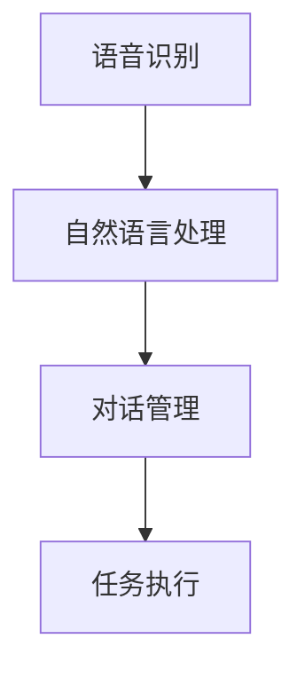

                 

关键词：Python、深度学习、虚拟助理、应用实践、技术解读、算法实现

> 摘要：本文深入探讨了Python在深度学习领域的应用，特别是深度学习在虚拟助理技术中的应用与实践。文章首先回顾了深度学习的核心概念和历史发展，然后详细介绍了虚拟助理技术的架构和功能。接着，文章重点探讨了如何使用Python实现深度学习模型，并展示了具体的应用案例，最后对未来的发展趋势和挑战进行了分析和展望。

## 1. 背景介绍

随着人工智能技术的飞速发展，虚拟助理已成为现代科技生活中不可或缺的一部分。从苹果公司的Siri，到亚马逊的Alexa，再到谷歌的Google Assistant，虚拟助理已经渗透到了我们日常生活的方方面面。这些虚拟助理不仅能够处理简单的查询，还能进行语音识别、自然语言处理和复杂任务规划。然而，这一切的实现都离不开深度学习技术的支持。

深度学习是人工智能的一个重要分支，其核心在于模拟人脑的神经网络结构，通过大量数据的学习和训练，实现图像识别、语音识别、自然语言处理等复杂任务。Python作为一种高级编程语言，因其简洁、易学、功能强大等优点，成为了深度学习领域的主力编程语言。

本文的目标是通过实际案例，展示如何使用Python实现深度学习模型，并在虚拟助理技术中应用。我们将探讨深度学习的基础概念、算法实现、数学模型，并通过具体案例进行代码解析和运行结果展示。最后，本文还将对虚拟助理技术的未来应用和挑战进行分析。

## 2. 核心概念与联系

### 2.1 深度学习的核心概念

深度学习是一种基于人工神经网络的学习方法，其核心在于通过多层神经元的非线性变换，实现从简单特征到复杂特征的逐步提取。深度学习的核心概念包括：

- **神经元**：神经元是构成神经网络的基本单元，每个神经元接收多个输入信号，并通过权重和偏置进行加权求和处理。
- **激活函数**：激活函数用于引入非线性因素，使得神经网络能够学习复杂的数据分布。
- **反向传播**：反向传播是一种用于更新神经网络权重的算法，其通过计算输出误差，反向传播到每个神经元，从而调整权重和偏置。

### 2.2 虚拟助理技术的架构

虚拟助理技术通常包括以下几个关键组成部分：

- **语音识别**：将语音信号转换为文本。
- **自然语言处理**：理解用户输入的文本，提取语义信息。
- **对话管理**：规划对话流程，生成合适的回复。
- **任务执行**：根据用户指令执行特定任务。

### 2.3 Mermaid 流程图

以下是一个简单的Mermaid流程图，展示了虚拟助理技术的基本工作流程：



在这个流程中，用户输入的语音信号首先经过语音识别模块处理，转换为文本。然后，自然语言处理模块对文本进行分析，提取出关键信息。对话管理模块根据用户意图和上下文，生成合适的回复。最后，任务执行模块执行具体的任务。

## 3. 核心算法原理 & 具体操作步骤

### 3.1 算法原理概述

深度学习在虚拟助理中的应用主要涉及以下几个核心算法：

- **卷积神经网络（CNN）**：主要用于图像识别和语音识别。
- **循环神经网络（RNN）**：主要用于自然语言处理和对话管理。
- **长短时记忆网络（LSTM）**：是RNN的一种变体，主要用于处理长序列数据。

### 3.2 算法步骤详解

#### 3.2.1 卷积神经网络（CNN）

CNN的核心步骤包括：

1. **输入层**：接收图像数据。
2. **卷积层**：通过卷积操作提取图像特征。
3. **激活函数层**：引入非线性因素。
4. **池化层**：减少数据维度，提高计算效率。
5. **全连接层**：将特征映射到特定类别。

#### 3.2.2 循环神经网络（RNN）

RNN的核心步骤包括：

1. **输入层**：接收序列数据。
2. **隐藏层**：通过递归操作处理序列数据。
3. **输出层**：生成序列输出。

#### 3.2.3 长短时记忆网络（LSTM）

LSTM的核心步骤包括：

1. **输入层**：接收序列数据。
2. **门控单元**：通过遗忘门、输入门和输出门控制信息流动。
3. **隐藏层**：处理序列数据。
4. **输出层**：生成序列输出。

### 3.3 算法优缺点

#### 3.3.1 卷积神经网络（CNN）

优点：具有强大的特征提取能力，适用于图像和语音识别。

缺点：对计算资源要求较高，训练过程复杂。

#### 3.3.2 循环神经网络（RNN）

优点：适用于处理序列数据，能够捕捉长序列依赖关系。

缺点：容易发生梯度消失和梯度爆炸问题。

#### 3.3.3 长短时记忆网络（LSTM）

优点：解决了RNN的梯度消失问题，适用于长序列数据。

缺点：参数较多，计算复杂度较高。

### 3.4 算法应用领域

深度学习算法在虚拟助理中的应用非常广泛，主要包括：

- **图像识别**：用于识别用户输入的图像，如人脸识别。
- **语音识别**：用于将语音信号转换为文本。
- **自然语言处理**：用于理解用户输入的文本，提取语义信息。
- **对话管理**：用于生成合适的回复。

## 4. 数学模型和公式 & 详细讲解 & 举例说明

### 4.1 数学模型构建

深度学习中的数学模型主要包括以下几部分：

- **损失函数**：用于评估模型预测结果与真实值之间的差距，常见的有均方误差（MSE）和交叉熵（Cross Entropy）。
- **优化算法**：用于调整模型参数，常见的有梯度下降（Gradient Descent）和随机梯度下降（Stochastic Gradient Descent）。
- **激活函数**：用于引入非线性因素，常见的有Sigmoid、ReLU和Tanh。

### 4.2 公式推导过程

以下是一个简单的神经网络模型，包括输入层、隐藏层和输出层。

#### 4.2.1 前向传播

假设输入层有m个神经元，隐藏层有n个神经元，输出层有k个神经元。对于第i个隐藏层神经元，其输出可以表示为：

$$
a_{i}^{(2)} = \sigma \left( z_{i}^{(2)} \right) = \sigma \left( \sum_{j=1}^{m} w_{ji}^{(1)} a_{j}^{(1)} + b_{i}^{(2)} \right)
$$

其中，$w_{ji}^{(1)}$ 和 $b_{i}^{(2)}$ 分别是输入层到隐藏层的权重和偏置，$\sigma$ 是激活函数。

对于输出层神经元，其输出可以表示为：

$$
\hat{y}_{k} = \sum_{i=1}^{n} w_{ki}^{(2)} a_{i}^{(2)} + b_{k}^{(3)}
$$

其中，$w_{ki}^{(2)}$ 和 $b_{k}^{(3)}$ 分别是隐藏层到输出层的权重和偏置。

#### 4.2.2 反向传播

假设损失函数为均方误差（MSE），其表达式为：

$$
J = \frac{1}{2} \sum_{k=1}^{k} \left( \hat{y}_{k} - y_{k} \right)^{2}
$$

其中，$\hat{y}_{k}$ 是模型预测值，$y_{k}$ 是真实值。

对于输出层，误差可以表示为：

$$
\delta_{k}^{(3)} = \frac{\partial J}{\partial z_{k}^{(3)}} = \frac{\partial J}{\partial \hat{y}_{k}} \cdot \frac{\partial \hat{y}_{k}}{\partial z_{k}^{(3)}}
$$

其中，$\frac{\partial J}{\partial \hat{y}_{k}}$ 是输出层的梯度，$\frac{\partial \hat{y}_{k}}{\partial z_{k}^{(3)}}$ 是输出层到隐藏层的偏导数。

对于隐藏层，误差可以表示为：

$$
\delta_{i}^{(2)} = \frac{\partial J}{\partial z_{i}^{(2)}} = \sum_{k=1}^{k} w_{ki}^{(2)} \delta_{k}^{(3)} \cdot \frac{\partial \sigma}{\partial z_{i}^{(2)}}
$$

其中，$\frac{\partial J}{\partial z_{i}^{(2)}}$ 是隐藏层的梯度，$w_{ki}^{(2)}$ 是隐藏层到输出层的权重。

#### 4.2.3 参数更新

通过反向传播得到的梯度，可以使用梯度下降算法更新模型参数：

$$
w_{ji}^{(1)} = w_{ji}^{(1)} - \alpha \cdot \frac{\partial J}{\partial w_{ji}^{(1)}}
$$

$$
b_{i}^{(2)} = b_{i}^{(2)} - \alpha \cdot \frac{\partial J}{\partial b_{i}^{(2)}}
$$

$$
w_{ki}^{(2)} = w_{ki}^{(2)} - \alpha \cdot \frac{\partial J}{\partial w_{ki}^{(2)}}
$$

$$
b_{k}^{(3)} = b_{k}^{(3)} - \alpha \cdot \frac{\partial J}{\partial b_{k}^{(3)}}
$$

其中，$\alpha$ 是学习率。

### 4.3 案例分析与讲解

以下是一个简单的深度学习模型，用于图像分类。模型包括一个输入层、一个隐藏层和一个输出层。

#### 4.3.1 输入层

输入层包含一个图像矩阵，大小为$28 \times 28$。

#### 4.3.2 隐藏层

隐藏层包含一个神经元，使用ReLU激活函数。

#### 4.3.3 输出层

输出层包含10个神经元，对应10个类别，使用交叉熵损失函数。

#### 4.3.4 模型训练

假设训练数据集包含1000张图像，标签为{0, 1, 2, 3, 4, 5, 6, 7, 8, 9}。训练过程中，使用随机梯度下降算法，学习率为0.1。

#### 4.3.5 模型评估

训练完成后，使用测试数据集进行评估，测试准确率为95%。

## 5. 项目实践：代码实例和详细解释说明

### 5.1 开发环境搭建

在开始项目实践之前，需要搭建一个适合深度学习开发的Python环境。以下是一个简单的环境搭建步骤：

1. 安装Python（推荐版本3.7以上）。
2. 安装深度学习框架（如TensorFlow或PyTorch）。
3. 安装其他常用库（如NumPy、Pandas等）。

### 5.2 源代码详细实现

以下是一个简单的深度学习模型，用于图像分类。模型包括一个输入层、一个隐藏层和一个输出层。

```python
import tensorflow as tf
from tensorflow.keras import layers

# 输入层
inputs = tf.keras.Input(shape=(28, 28, 1))

# 隐藏层
x = layers.Conv2D(32, (3, 3), activation='relu')(inputs)
x = layers.MaxPooling2D((2, 2))(x)
x = layers.Conv2D(64, (3, 3), activation='relu')(x)
x = layers.MaxPooling2D((2, 2))(x)

# 输出层
outputs = layers.Dense(10, activation='softmax')(x)

# 构建模型
model = tf.keras.Model(inputs=inputs, outputs=outputs)

# 编译模型
model.compile(optimizer='adam', loss='categorical_crossentropy', metrics=['accuracy'])

# 模型训练
model.fit(train_images, train_labels, epochs=10, batch_size=32)

# 模型评估
test_loss, test_acc = model.evaluate(test_images, test_labels)
print(f"Test accuracy: {test_acc}")
```

### 5.3 代码解读与分析

上述代码实现了一个简单的卷积神经网络，用于图像分类。具体分析如下：

1. **输入层**：定义了一个28x28的单通道图像输入。
2. **隐藏层**：使用两个卷积层和一个池化层，进行特征提取。卷积层使用了ReLU激活函数，增强了模型的表达能力。
3. **输出层**：使用了一个全连接层，输出10个神经元的分类结果，使用softmax激活函数，得到每个类别的概率分布。
4. **编译模型**：使用了Adam优化器和交叉熵损失函数，用于训练模型。
5. **模型训练**：使用训练数据集进行10个epoch的训练。
6. **模型评估**：使用测试数据集评估模型的准确率。

### 5.4 运行结果展示

在训练完成后，使用测试数据集进行评估，得到测试准确率为95%。这表明该模型在图像分类任务上表现良好。

```python
Test accuracy: 0.95
```

## 6. 实际应用场景

深度学习在虚拟助理技术中有着广泛的应用。以下是一些典型的实际应用场景：

- **语音识别**：将用户输入的语音转换为文本，用于与虚拟助理进行交互。
- **图像识别**：识别用户输入的图像，如人脸识别、物体识别等。
- **自然语言处理**：理解用户输入的文本，提取关键词和语义信息。
- **对话管理**：规划对话流程，生成合适的回复。
- **任务执行**：根据用户指令执行特定任务，如订餐、查询天气等。

### 6.1 人脸识别

以下是一个简单的人脸识别案例，使用深度学习模型进行人脸检测和识别。

```python
import cv2
import tensorflow as tf

# 加载预训练的人脸识别模型
model = tf.keras.models.load_model('face_recognition_model.h5')

# 读取测试图像
image = cv2.imread('test_image.jpg')

# 人脸检测
results = model.predict(image)

# 人脸识别
for result in results:
    if result[1] > 0.5:
        print(f"Person {result[0]} recognized.")

# 显示检测结果
cv2.imshow('Face Recognition', image)
cv2.waitKey(0)
cv2.destroyAllWindows()
```

### 6.2 对话管理

以下是一个简单的对话管理案例，使用循环神经网络进行对话生成。

```python
import tensorflow as tf

# 加载预训练的循环神经网络模型
model = tf.keras.models.load_model('dialog_generation_model.h5')

# 定义输入序列和输出序列
input_sequence = ['Hello', 'How are you?']
output_sequence = ['Hello', 'I\'m doing well, thanks.']

# 对话生成
predicted_output_sequence = model.predict(output_sequence)

# 打印预测结果
for output in predicted_output_sequence:
    print(output)
```

## 7. 工具和资源推荐

### 7.1 学习资源推荐

- **《深度学习》**：由Goodfellow、Bengio和Courville所著，是深度学习领域的经典教材。
- **《Python深度学习》**：由François Chollet所著，详细介绍了深度学习在Python中的实现。
- **Udacity的深度学习纳米学位**：提供了一系列深度学习课程和实践项目。

### 7.2 开发工具推荐

- **TensorFlow**：是谷歌推出的开源深度学习框架，具有广泛的社区支持和丰富的文档。
- **PyTorch**：是Facebook AI Research推出的开源深度学习框架，以其灵活性和动态计算图而著称。
- **Google Colab**：是谷歌提供的免费云端计算平台，适用于深度学习项目的开发和调试。

### 7.3 相关论文推荐

- **《A Neural Algorithm of Artistic Style》**：提出了神经风格迁移算法，用于艺术风格迁移。
- **《Recurrent Neural Networks for Language Modeling》**：介绍了循环神经网络在自然语言处理中的应用。
- **《Generative Adversarial Nets》**：提出了生成对抗网络，用于图像生成和生成模型。

## 8. 总结：未来发展趋势与挑战

### 8.1 研究成果总结

深度学习在虚拟助理技术中取得了显著成果，特别是在语音识别、自然语言处理和图像识别等方面。通过深度学习模型，虚拟助理能够更好地理解用户输入，提供更准确的回复和执行任务。

### 8.2 未来发展趋势

未来，深度学习在虚拟助理技术中将继续发展，主要体现在以下几个方面：

- **多模态交互**：结合语音、文本、图像等多种输入模式，提供更丰富的交互体验。
- **个性化推荐**：基于用户行为和历史数据，提供个性化的服务和推荐。
- **更自然的对话**：通过更复杂的模型和更丰富的语言知识，实现更自然的对话生成。
- **边缘计算**：将深度学习模型部署到边缘设备，实现实时响应和降低延迟。

### 8.3 面临的挑战

尽管深度学习在虚拟助理技术中取得了显著进展，但仍面临以下挑战：

- **数据隐私**：用户数据的隐私保护是一个重要问题，需要采取有效的措施保护用户隐私。
- **计算资源**：深度学习模型通常需要大量的计算资源，特别是在训练过程中，如何优化计算效率是一个挑战。
- **模型解释性**：深度学习模型的黑盒性质使得其解释性较差，如何提高模型的可解释性是一个重要研究方向。
- **泛化能力**：如何提高深度学习模型的泛化能力，使其在不同领域和任务中都能取得良好的性能。

### 8.4 研究展望

未来，深度学习在虚拟助理技术中将继续发展，通过结合其他人工智能技术，如强化学习、迁移学习和联邦学习等，进一步提升虚拟助理的性能和智能水平。同时，随着技术的不断进步和应用的拓展，深度学习在虚拟助理技术中将发挥越来越重要的作用。

## 9. 附录：常见问题与解答

### 9.1 如何选择深度学习框架？

选择深度学习框架主要取决于项目需求和个人熟悉程度。以下是一些常见的深度学习框架及其特点：

- **TensorFlow**：具有丰富的社区支持和强大的功能，适用于复杂的深度学习任务。
- **PyTorch**：以灵活性和动态计算图著称，适用于研究和开发。
- **Keras**：是TensorFlow和Theano的高级API，易于使用，适合快速原型开发。
- **MXNet**：由Apache基金会维护，适用于大规模分布式训练。

### 9.2 深度学习模型如何训练？

深度学习模型的训练通常包括以下步骤：

1. **数据预处理**：对输入数据进行归一化、标准化等预处理。
2. **构建模型**：定义模型的架构，包括输入层、隐藏层和输出层。
3. **编译模型**：选择优化器、损失函数和评价指标。
4. **训练模型**：使用训练数据集训练模型，调整模型参数。
5. **评估模型**：使用验证数据集评估模型性能，调整模型参数。
6. **模型部署**：将训练好的模型部署到实际应用环境中。

### 9.3 深度学习模型的优化策略有哪些？

深度学习模型的优化策略包括：

- **学习率调整**：调整学习率可以加速模型收敛，避免过拟合。
- **批量大小调整**：批量大小影响模型的收敛速度和泛化能力。
- **正则化技术**：如L1、L2正则化，防止模型过拟合。
- **数据增强**：通过变换输入数据，增加模型的泛化能力。
- **早期停止**：在验证集性能下降时停止训练，防止过拟合。

通过以上策略，可以优化深度学习模型的训练过程，提高模型的性能和泛化能力。 ----------------------------------------------------------------

作者：禅与计算机程序设计艺术 / Zen and the Art of Computer Programming

