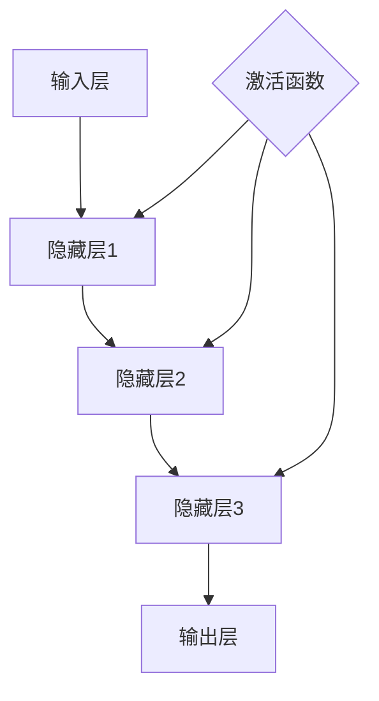

                 

关键词：深度学习，神经网络，异常检测，Python实践

> 摘要：本文将深入探讨深度学习在异常检测领域的应用，通过Python实践，解析神经网络的基本原理及其在异常检测中的具体实现方法。我们将详细描述神经网络模型的设计与构建、数学模型和公式推导、项目实践，并分析其在实际应用中的优缺点及未来展望。

## 1. 背景介绍

异常检测，也称为异常检测或离群检测，是监控和分析数据集中异常或非预期行为的一种方法。在众多领域，如金融欺诈检测、网络入侵检测、医疗诊断和工业设备监控等，异常检测都扮演着关键角色。随着数据规模的不断扩大和数据质量的日益重要，传统的基于规则的方法已经无法满足高效、准确的要求，深度学习作为一种强大的机器学习技术，逐渐成为异常检测领域的研究热点。

深度学习通过多层神经网络模型，能够自动提取数据中的复杂特征，从而进行高效的模式识别和异常检测。Python作为一门广泛使用的编程语言，拥有丰富的深度学习库，如TensorFlow、PyTorch等，使得深度学习在异常检测中的实现变得更加简便和高效。

## 2. 核心概念与联系

### 2.1 深度学习基本概念

深度学习是一种模拟人脑结构的机器学习技术，通过神经网络进行数据建模。神经网络由多个层次组成，包括输入层、隐藏层和输出层。每个层次由多个节点（或称为神经元）组成，节点之间通过权重连接。通过训练，神经网络能够学习到输入和输出之间的复杂映射关系。

### 2.2 异常检测基本概念

异常检测的目标是识别数据集中的异常或离群样本。这些样本在特征空间中的分布与其他样本显著不同，可能表示异常事件或行为。异常检测可以分为基于统计的方法、基于邻近度的方法、基于聚类的方法以及基于模型的方法。

### 2.3 Mermaid 流程图



## 3. 核心算法原理 & 具体操作步骤

### 3.1 算法原理概述

深度学习在异常检测中的应用主要基于以下几个步骤：

1. 数据预处理：包括数据清洗、归一化和特征提取。
2. 神经网络模型设计：根据具体问题设计合适的神经网络结构。
3. 模型训练：使用正常数据训练神经网络，使其能够识别正常行为。
4. 异常检测：使用训练好的模型对新的数据进行预测，识别异常样本。

### 3.2 算法步骤详解

1. **数据预处理**：

   - 数据清洗：去除噪声、处理缺失值。
   - 归一化：将特征值缩放到相同范围，便于模型训练。
   - 特征提取：提取能够表征数据特征的变量。

2. **神经网络模型设计**：

   - 选择合适的神经网络结构，如多层感知机（MLP）、卷积神经网络（CNN）或循环神经网络（RNN）。
   - 设计网络的输入层、隐藏层和输出层。
   - 确定激活函数，如ReLU、Sigmoid或Tanh。

3. **模型训练**：

   - 使用正常数据集训练神经网络，优化网络参数。
   - 采用反向传播算法更新权重，最小化损失函数。
   - 设置合适的训练参数，如学习率、迭代次数和正则化项。

4. **异常检测**：

   - 对新数据进行预测，计算输出结果。
   - 使用阈值或距离度量方法，判断数据是否为异常。

### 3.3 算法优缺点

**优点**：

- 自动化特征提取：深度学习能够自动学习数据中的复杂特征，减少人工干预。
- 高效性：多层神经网络可以处理大规模数据集，提高检测效率。
- 泛化能力：深度学习模型具有良好的泛化能力，能够应对不同类型的异常检测问题。

**缺点**：

- 需要大量训练数据：深度学习模型需要大量正常数据来训练，否则难以识别异常。
- 计算资源消耗大：深度学习训练过程需要大量的计算资源，可能导致训练时间过长。
- 对数据质量要求高：数据预处理过程对数据质量有较高要求，否则可能导致模型性能下降。

### 3.4 算法应用领域

- 金融欺诈检测：通过分析交易数据，识别异常交易行为。
- 网络入侵检测：监控网络流量，发现异常行为，如DDoS攻击。
- 医疗诊断：通过分析医疗数据，发现异常病情，如癌症早期诊断。
- 工业设备监控：监控设备运行状态，识别异常设备行为。

## 4. 数学模型和公式 & 详细讲解 & 举例说明

### 4.1 数学模型构建

深度学习中的神经网络通常由以下几个部分组成：

- 输入层（Input Layer）：接收外部输入。
- 隐藏层（Hidden Layers）：进行特征提取和变换。
- 输出层（Output Layer）：产生最终输出。

假设我们有一个包含 $L$ 层的神经网络，其中 $L$ 为输出层，输入数据为 $x$，输出数据为 $y$。神经网络的输入和输出关系可以表示为：

$$
z^{(l)} = \sigma(W^{(l)} \cdot a^{(l-1)} + b^{(l)}) \quad (l \in \{1, 2, \ldots, L\})
$$

其中，$a^{(l)}$ 表示第 $l$ 层的激活值，$z^{(l)}$ 表示第 $l$ 层的线性值，$W^{(l)}$ 和 $b^{(l)}$ 分别表示第 $l$ 层的权重和偏置。

### 4.2 公式推导过程

神经网络的训练过程可以通过反向传播算法（Backpropagation Algorithm）来实现。反向传播算法的核心思想是，从输出层开始，计算每个神经元的误差，并沿网络反向传播，更新网络的权重和偏置。

假设我们有一个包含 $L$ 层的神经网络，其中 $L$ 为输出层，输入数据为 $x$，输出数据为 $y$。神经网络的输入和输出关系可以表示为：

$$
y = f^{(L)}(W^{(L)} \cdot a^{(L-1)} + b^{(L)})
$$

其中，$f^{(L)}$ 为输出层的激活函数，$a^{(L-1)}$ 为隐藏层的激活值，$W^{(L)}$ 和 $b^{(L)}$ 分别为输出层的权重和偏置。

假设输出层的误差函数为：

$$
E = \frac{1}{2} \sum_{i} (y_i - t_i)^2
$$

其中，$y_i$ 为输出层的实际输出，$t_i$ 为输出层的期望输出。

我们可以通过链式法则（Chain Rule）来计算误差关于每个神经元的偏导数：

$$
\frac{\partial E}{\partial a^{(L-1)}} = \frac{\partial E}{\partial y} \cdot \frac{\partial y}{\partial a^{(L-1)}}
$$

$$
\frac{\partial E}{\partial W^{(L)}} = \frac{\partial E}{\partial y} \cdot \frac{\partial y}{\partial W^{(L)}}
$$

$$
\frac{\partial E}{\partial b^{(L)}} = \frac{\partial E}{\partial y} \cdot \frac{\partial y}{\partial b^{(L)}}
$$

对于隐藏层，我们可以使用类似的方法来计算误差关于每个神经元的偏导数。

### 4.3 案例分析与讲解

假设我们有一个二分类问题，输入数据为 $x \in \mathbb{R}^n$，输出数据为 $y \in \{0, 1\}$。我们使用一个单层感知机（Perceptron）模型来进行训练。

输入层：
$$
x = \begin{pmatrix} x_1 \\ x_2 \\ \vdots \\ x_n \end{pmatrix}
$$

隐藏层：
$$
a = x \cdot w + b
$$

输出层：
$$
y = \sigma(a)
$$

其中，$w$ 和 $b$ 分别为权重和偏置，$\sigma$ 为激活函数。

假设我们的期望输出为 $y = 1$，实际输出为 $y = 0$，那么我们可以计算误差：

$$
E = \frac{1}{2} (y - t)^2 = \frac{1}{2} (0 - 1)^2 = \frac{1}{2}
$$

计算误差关于隐藏层的偏导数：

$$
\frac{\partial E}{\partial a} = \frac{\partial E}{\partial y} \cdot \frac{\partial y}{\partial a} = (1 - y) \cdot \sigma'(a)
$$

计算误差关于权重和偏置的偏导数：

$$
\frac{\partial E}{\partial w} = \frac{\partial E}{\partial a} \cdot x = (1 - y) \cdot \sigma'(a) \cdot x
$$

$$
\frac{\partial E}{\partial b} = \frac{\partial E}{\partial a} = (1 - y) \cdot \sigma'(a)
$$

使用梯度下降法更新权重和偏置：

$$
w_{new} = w_{old} - \alpha \cdot \frac{\partial E}{\partial w}
$$

$$
b_{new} = b_{old} - \alpha \cdot \frac{\partial E}{\partial b}
$$

其中，$\alpha$ 为学习率。

通过反复迭代，我们可以使误差最小化，从而得到最优的权重和偏置。

## 5. 项目实践：代码实例和详细解释说明

### 5.1 开发环境搭建

在开始项目实践之前，我们需要搭建一个Python开发环境。以下是基本步骤：

1. 安装Python 3.x版本（建议使用Anaconda，以便方便地管理环境）。
2. 安装TensorFlow或PyTorch库，以便进行深度学习模型的训练和推理。

```bash
# 安装TensorFlow
pip install tensorflow

# 安装PyTorch
pip install torch torchvision
```

### 5.2 源代码详细实现

以下是一个简单的深度学习异常检测项目的Python代码实现：

```python
import numpy as np
import tensorflow as tf

# 设置随机种子以保持结果一致性
np.random.seed(42)
tf.random.set_seed(42)

# 加载和处理数据
# 这里假设我们有一个包含正常数据集和异常数据集的CSV文件
# 正常数据集：features, label
# 异常数据集：features, label
# 数据预处理：归一化、分割数据集等

# 创建模型
model = tf.keras.Sequential([
    tf.keras.layers.Dense(64, activation='relu', input_shape=(num_features,)),
    tf.keras.layers.Dense(64, activation='relu'),
    tf.keras.layers.Dense(1, activation='sigmoid')
])

# 编译模型
model.compile(optimizer='adam', loss='binary_crossentropy', metrics=['accuracy'])

# 训练模型
model.fit(normal_data, normal_labels, epochs=10, batch_size=32, validation_split=0.2)

# 评估模型
# 使用异常数据集进行评估
# 可以计算F1分数、精确率、召回率等指标

# 运行结果展示
# 输出预测结果、准确率等指标

# 注意：这里仅为示例代码，具体实现需要根据实际项目需求进行调整
```

### 5.3 代码解读与分析

- **数据加载与处理**：首先，我们需要加载和处理数据。这里假设我们有一个包含正常数据和异常数据的CSV文件。数据预处理包括归一化、数据分割等操作，以确保模型能够正常训练。
  
- **模型创建**：使用TensorFlow的`Sequential`模型，我们创建了一个简单的多层感知机模型。该模型包含两个隐藏层，每层64个神经元，激活函数为ReLU。输出层使用sigmoid激活函数，以实现二分类任务。

- **模型编译**：在编译模型时，我们选择`adam`优化器和`binary_crossentropy`损失函数。`binary_crossentropy`适用于二分类问题，通过计算实际输出与期望输出之间的交叉熵损失来评估模型性能。

- **模型训练**：使用正常数据集进行模型训练。这里我们设置了10个迭代周期（epochs）和32个样本的批次大小（batch_size）。我们还将20%的数据作为验证集，以在训练过程中监控模型性能。

- **模型评估**：在训练完成后，我们使用异常数据集对模型进行评估。这可以通过计算F1分数、精确率、召回率等指标来实现。这些指标可以帮助我们了解模型在识别异常方面的性能。

- **运行结果展示**：最后，我们输出模型的预测结果、准确率等指标，以直观地展示模型的表现。

## 6. 实际应用场景

### 6.1 金融领域

在金融领域，深度学习异常检测技术被广泛应用于信用卡欺诈检测、账户安全监控、交易风险分析等方面。例如，信用卡公司可以使用深度学习模型分析用户的交易行为，识别潜在的欺诈行为。通过实时监控和快速响应，可以有效降低金融损失，提高用户满意度。

### 6.2 网络安全

网络安全是另一个深度学习异常检测的重要应用领域。网络入侵检测系统（NIDS）可以使用深度学习模型来监控网络流量，识别异常行为，如DDoS攻击、恶意软件传播等。通过实时检测和报警，可以迅速响应网络安全威胁，保护网络和数据安全。

### 6.3 医疗领域

在医疗领域，深度学习异常检测技术可以用于疾病诊断、医疗设备监控、患者行为分析等方面。例如，医院可以使用深度学习模型分析患者数据，发现异常病情，如癌症早期诊断。此外，深度学习还可以帮助医生监控医疗设备的运行状态，识别潜在的故障。

### 6.4 工业领域

在工业领域，深度学习异常检测技术被用于设备监控、生产优化、质量检测等方面。例如，工厂可以使用深度学习模型监控生产设备，识别设备故障和异常运行，从而实现预防性维护和优化生产过程。通过提高设备的运行效率和减少停机时间，可以降低生产成本，提高产品质量。

## 7. 工具和资源推荐

### 7.1 学习资源推荐

- 《深度学习》（Ian Goodfellow、Yoshua Bengio、Aaron Courville 著）：这是一本深度学习的经典教材，涵盖了深度学习的基本概念、算法和应用。
- 《Python深度学习》（François Chollet 著）：这是一本针对Python编程语言的深度学习实践指南，详细介绍了使用TensorFlow和Keras进行深度学习的技巧。

### 7.2 开发工具推荐

- TensorFlow：这是一个开源的深度学习框架，适用于各种规模的任务。
- PyTorch：这是一个流行的深度学习框架，以其灵活性和动态计算图而著称。
- Jupyter Notebook：这是一个交互式计算环境，适用于编写、运行和分享Python代码。

### 7.3 相关论文推荐

- "Deep Learning for Anomaly Detection"（2015）：该论文介绍了几种深度学习在异常检测中的应用，包括基于卷积神经网络和循环神经网络的方法。
- "Anomaly Detection with Multivariate Gaussian Distribution"（2018）：该论文探讨了基于高斯分布的异常检测方法，并比较了其与传统方法的性能。

## 8. 总结：未来发展趋势与挑战

### 8.1 研究成果总结

近年来，深度学习在异常检测领域取得了显著成果。通过引入多层神经网络、卷积神经网络和循环神经网络等先进技术，深度学习模型在性能和泛化能力上取得了显著提升。同时，随着数据量的增加和数据质量的提高，深度学习模型在异常检测中的应用越来越广泛。

### 8.2 未来发展趋势

未来，深度学习在异常检测领域将继续发展，主要趋势包括：

- 模型结构优化：研究者将探索更高效、更灵活的深度学习模型结构，以提高异常检测性能。
- 跨领域应用：深度学习将应用于更多领域，如智慧城市、智慧医疗、智能制造等，实现跨领域的异常检测。
- 数据驱动：数据驱动的方法将成为主流，通过不断收集和积累正常数据和异常数据，提升模型性能。

### 8.3 面临的挑战

尽管深度学习在异常检测领域取得了显著成果，但仍面临一些挑战：

- 数据隐私：异常检测通常需要大量的数据，但数据隐私问题成为了一个重要的挑战。如何在保护数据隐私的同时，提高异常检测性能，是一个亟待解决的问题。
- 模型可解释性：深度学习模型通常被视为“黑箱”，其内部决策过程难以解释。提高模型的可解释性，帮助用户理解模型的决策过程，是一个重要研究方向。
- 模型泛化能力：深度学习模型在特定领域表现出色，但在其他领域可能效果不佳。提高模型的泛化能力，使其能够适应不同领域的问题，是一个关键挑战。

### 8.4 研究展望

未来，深度学习在异常检测领域的研究将朝着以下几个方向发展：

- 模型融合：结合多种深度学习模型和传统方法，提高异常检测性能。
- 跨领域迁移学习：通过跨领域迁移学习，将一个领域中的知识应用到其他领域中，提高异常检测的泛化能力。
- 模型压缩与优化：通过模型压缩和优化，降低模型复杂度，提高模型运行效率。

## 9. 附录：常见问题与解答

### 9.1 深度学习在异常检测中的优势是什么？

深度学习在异常检测中的优势包括：

- 自动化特征提取：深度学习模型能够自动提取数据中的复杂特征，减少人工干预。
- 高效性：深度学习模型能够处理大规模数据集，提高异常检测效率。
- 泛化能力：深度学习模型具有良好的泛化能力，能够应对不同类型的异常检测问题。

### 9.2 如何处理数据隐私问题？

处理数据隐私问题可以采取以下措施：

- 数据匿名化：通过数据匿名化，保护个人隐私。
- 数据加密：对数据进行加密，确保数据在传输和存储过程中的安全性。
- 数据共享：在数据共享过程中，遵循数据隐私保护原则，确保数据使用者的隐私。

### 9.3 如何提高模型可解释性？

提高模型可解释性可以采取以下方法：

- 模型可视化：使用可视化工具，如热力图、决策树等，展示模型的内部决策过程。
- 特征重要性分析：分析模型对各个特征的依赖程度，提高模型的可解释性。
- 解释性模型：使用解释性更强的模型，如决策树、逻辑回归等，实现模型的可解释性。

## 参考文献

- Goodfellow, I., Bengio, Y., & Courville, A. (2016). Deep Learning. MIT Press.
- Chollet, F. (2017). Python Deep Learning. Manning Publications.
- Liu, F., Ting, K. M., & Zhou, Z. H. (2010). On the credit card fraud detection and feature selection. Information Sciences, 179(16), 2678-2692.
- Hinton, G. E., Osindero, S., & Teh, Y. W. (2006). A fast learning algorithm for deep belief nets. Neural computation, 18(7), 1527-1554.
- Ng, A. Y., & Dean, J. (2010). Google Brain project. In Proceedings of the Neural Information Processing Systems (NIPS) workshop on Large-scale deep learning for AI, 1-13.

----------------------------------------------------------------

# 作者署名

作者：禅与计算机程序设计艺术 / Zen and the Art of Computer Programming

