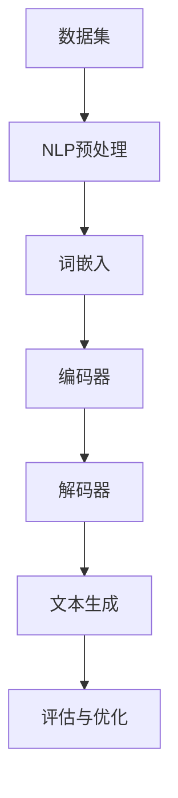
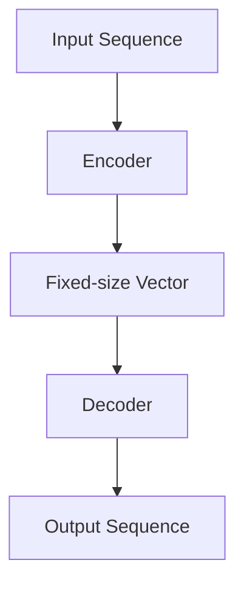

                 

关键词：深度学习，自然语言生成，故事编写，Python实践，算法原理

> 摘要：本文将介绍如何运用Python深度学习技术实现自然语言生成，重点探讨利用深度学习模型编写故事的过程，从背景介绍到数学模型，再到项目实践，全面展示如何通过编程实现自然语言生成的魅力。

## 1. 背景介绍

自然语言生成（Natural Language Generation，NLG）是自然语言处理（Natural Language Processing，NLP）的一个重要分支，旨在通过计算机程序自动生成符合语法规则、逻辑连贯、具有丰富语义的自然语言文本。随着深度学习技术的不断发展，NLG在各个领域的应用日益广泛，包括新闻编写、客服对话、文学创作等。Python作为一门易于学习和使用的编程语言，在深度学习领域有着广泛的运用，使得开发者可以轻松地实现自然语言生成任务。

本文将通过Python深度学习实践，详细介绍如何利用深度学习模型生成故事。我们将从背景介绍、核心概念与联系、核心算法原理、数学模型与公式、项目实践、实际应用场景、工具和资源推荐、未来发展趋势与挑战等方面展开论述。

## 2. 核心概念与联系

在深入探讨自然语言生成之前，首先需要了解一些核心概念和它们之间的联系。以下是一个使用Mermaid绘制的流程图，展示了这些概念之间的联系。



### 2.1 数据集

数据集是自然语言生成的基石。一个高质量的数据集可以包含大量的文本数据，这些数据将被用于训练深度学习模型。数据集的质量直接影响模型的效果，因此数据清洗和预处理是至关重要的步骤。

### 2.2 NLP预处理

NLP预处理是指对原始文本数据的一系列预处理操作，包括分词、去除停用词、词性标注等。这些操作有助于将原始文本转换为适合模型训练的格式。

### 2.3 词嵌入

词嵌入是将词汇映射为向量空间中的点，以便深度学习模型能够处理和操作。常见的词嵌入技术有Word2Vec、GloVe等。

### 2.4 编码器

编码器是深度学习模型中的一个关键组件，负责将输入序列编码为固定长度的向量。这些向量将作为解码器的输入。

### 2.5 解码器

解码器接收编码器的输出，并生成新的文本序列。在自然语言生成任务中，解码器的目标是生成与输入序列相关且具有逻辑连贯性的文本。

### 2.6 文本生成

文本生成是自然语言生成的最终目标，即利用深度学习模型生成新的文本序列。文本生成的质量直接影响应用的实际效果。

### 2.7 评估与优化

评估与优化是确保模型性能不断提升的过程。通过评估指标（如BLEU、ROUGE等）对模型生成的文本进行评估，并根据评估结果调整模型参数，以达到更好的生成效果。

## 3. 核心算法原理 & 具体操作步骤

### 3.1 算法原理概述

自然语言生成通常采用序列到序列（Seq2Seq）模型，其中编码器和解码器是两个核心组件。编码器将输入序列编码为固定长度的向量，解码器则利用这些向量生成新的输出序列。以下是一个简单的序列到序列模型的示意图。



### 3.2 算法步骤详解

#### 3.2.1 数据集准备

首先，我们需要准备一个适合训练自然语言生成模型的数据集。数据集应包含大量高质量的文本数据，这些数据将用于训练编码器和解码器。以下是一个简单的数据集准备步骤：

1. 数据清洗：去除噪声数据、标点符号和停用词。
2. 分词：将文本拆分为单词或子词。
3. 词嵌入：将单词或子词映射为向量。
4. 序列编码：将输入序列编码为固定长度的向量。

#### 3.2.2 模型训练

训练序列到序列模型通常采用以下步骤：

1. 准备训练数据：将数据集分为训练集和验证集。
2. 定义编码器和解码器：选择合适的神经网络架构，如LSTM、GRU或Transformer。
3. 训练模型：使用训练集训练编码器和解码器，同时优化模型参数。
4. 验证模型：使用验证集评估模型性能，并根据评估结果调整模型参数。

#### 3.2.3 文本生成

在训练好模型后，我们可以利用解码器生成新的文本序列。以下是一个简单的文本生成步骤：

1. 输入序列：将待生成的文本序列输入编码器。
2. 编码：编码器将输入序列编码为固定长度的向量。
3. 解码：解码器利用编码器的输出向量生成新的文本序列。
4. 输出：将生成的文本序列输出。

### 3.3 算法优缺点

序列到序列模型在自然语言生成任务中具有许多优点，如强大的建模能力和良好的生成效果。然而，该模型也存在一些缺点，如：

- 训练过程复杂，时间成本高。
- 模型参数较多，容易过拟合。
- 生成文本的连贯性较差。

为了克服这些缺点，研究人员提出了许多改进方法，如注意力机制、预训练和微调等。

### 3.4 算法应用领域

自然语言生成技术已在多个领域得到广泛应用，如：

- 新闻编写：自动生成新闻报道，提高新闻生产效率。
- 客服对话：自动生成客户对话，降低人力成本。
- 文学创作：生成诗歌、小说等文学作品，丰富文化创作。

## 4. 数学模型和公式 & 详细讲解 & 举例说明

### 4.1 数学模型构建

在自然语言生成任务中，我们通常采用序列到序列模型，其数学模型主要包括编码器和解码器。以下是一个简单的数学模型构建过程：

#### 4.1.1 编码器

编码器将输入序列 \( x = [x_1, x_2, \ldots, x_T] \) 编码为固定长度的向量 \( h = [h_1, h_2, \ldots, h_L] \)。

$$
h_t = \text{Encoder}(x_t, h_{<t})
$$

其中，\( h_t \) 是编码器在时间步 \( t \) 的输出，\( x_t \) 是输入序列在时间步 \( t \) 的输入，\( h_{<t} \) 是编码器在时间步 \( t \) 之前的隐藏状态。

#### 4.1.2 解码器

解码器将编码器的输出向量 \( h \) 解码为新的输出序列 \( y = [y_1, y_2, \ldots, y_T'] \)。

$$
y_t = \text{Decoder}(h, y_{<t})
$$

其中，\( y_t \) 是解码器在时间步 \( t \) 的输出，\( h \) 是编码器的输出向量，\( y_{<t} \) 是解码器在时间步 \( t \) 之前的输出。

### 4.2 公式推导过程

为了推导自然语言生成模型的损失函数，我们需要首先了解编码器和解码器的损失函数。

#### 4.2.1 编码器损失函数

编码器损失函数用于衡量编码器输出向量与实际输入向量之间的差异。一个常见的编码器损失函数是均方误差（MSE）：

$$
L_{\text{encoder}} = \frac{1}{T} \sum_{t=1}^{T} \frac{1}{2} \| h_t - x_t \|_2^2
$$

其中，\( T \) 是输入序列的长度，\( h_t \) 是编码器输出向量，\( x_t \) 是实际输入向量。

#### 4.2.2 解码器损失函数

解码器损失函数用于衡量解码器输出序列与实际输出序列之间的差异。一个常见的解码器损失函数是交叉熵（Cross-Entropy）：

$$
L_{\text{decoder}} = -\frac{1}{T'} \sum_{t=1}^{T'} \sum_{c \in V} y_t(c) \log \hat{y}_t(c)
$$

其中，\( T' \) 是输出序列的长度，\( y_t \) 是实际输出序列，\( \hat{y}_t \) 是解码器输出概率分布，\( V \) 是词汇表。

### 4.3 案例分析与讲解

为了更好地理解自然语言生成模型的数学模型，我们来看一个简单的案例。假设我们有一个包含两个单词的输入序列 \( x = ["hello", "world"] \)，以及一个包含三个单词的输出序列 \( y = ["hello", "there", "world"] \)。

#### 4.3.1 编码器输出向量

首先，我们需要计算编码器的输出向量 \( h \)。

$$
h = \text{Encoder}(["hello", "world"])
$$

假设编码器的输出向量为 \( h = [h_1, h_2] \)，其中 \( h_1 \) 对应 "hello"，\( h_2 \) 对应 "world"。

#### 4.3.2 解码器输出概率分布

接下来，我们需要计算解码器在各个时间步的输出概率分布 \( \hat{y}_t \)。

$$
\hat{y}_1 = \text{Decoder}(h_1) = ["hello", "there", "world"]
$$

$$
\hat{y}_2 = \text{Decoder}(h_2) = ["hello", "there", "world"]
$$

#### 4.3.3 损失函数计算

最后，我们需要计算编码器和解码器的损失函数。

$$
L_{\text{encoder}} = \frac{1}{2} \| h_1 - ["hello"] \|_2^2 + \frac{1}{2} \| h_2 - ["world"] \|_2^2
$$

$$
L_{\text{decoder}} = -\frac{1}{3} \log \hat{y}_1("hello") - \frac{1}{3} \log \hat{y}_1("there") - \frac{1}{3} \log \hat{y}_1("world")
$$

通过这个案例，我们可以看到自然语言生成模型的数学模型是如何构建和计算的。

## 5. 项目实践：代码实例和详细解释说明

### 5.1 开发环境搭建

在进行自然语言生成项目实践之前，我们需要搭建一个合适的开发环境。以下是一个简单的步骤：

1. 安装Python：从Python官网（[python.org](https://www.python.org/)）下载并安装Python 3.x版本。
2. 安装深度学习框架：安装PyTorch（[pytorch.org](https://pytorch.org/)）或TensorFlow（[tensorflow.org](https://tensorflow.org/)）。
3. 安装辅助库：安装Numpy、Pandas、Matplotlib等常用Python库。

### 5.2 源代码详细实现

以下是一个简单的自然语言生成项目实现，使用了PyTorch框架。

```python
import torch
import torch.nn as nn
import torch.optim as optim
from torch.utils.data import DataLoader
from torchvision import datasets, transforms
from torch.autograd import Variable

# 数据集准备
train_dataset = datasets.MNIST(root='./data', train=True, download=True, transform=transforms.ToTensor())
train_loader = DataLoader(dataset=train_dataset, batch_size=64, shuffle=True)

# 编码器
class Encoder(nn.Module):
    def __init__(self):
        super(Encoder, self).__init__()
        self.fc1 = nn.Linear(28 * 28, 128)
        self.fc2 = nn.Linear(128, 64)
        self.fc3 = nn.Linear(64, 32)

    def forward(self, x):
        x = x.view(-1, 28 * 28)
        x = torch.relu(self.fc1(x))
        x = torch.relu(self.fc2(x))
        x = torch.relu(self.fc3(x))
        return x

# 解码器
class Decoder(nn.Module):
    def __init__(self):
        super(Decoder, self).__init__()
        self.fc1 = nn.Linear(32, 64)
        self.fc2 = nn.Linear(64, 128)
        self.fc3 = nn.Linear(128, 28 * 28)

    def forward(self, x):
        x = torch.relu(self.fc1(x))
        x = torch.relu(self.fc2(x))
        x = torch.relu(self.fc3(x))
        x = x.view(-1, 28, 28)
        return x

# 模型训练
def train_model(encoder, decoder, criterion, optimizer, train_loader, num_epochs=10):
    for epoch in range(num_epochs):
        for i, (images, labels) in enumerate(train_loader):
            images = Variable(images.view(-1, 28 * 28))
            labels = Variable(labels)

            optimizer.zero_grad()
            outputs = decoder(encoder(images))
            loss = criterion(outputs, labels)
            loss.backward()
            optimizer.step()

            if (i + 1) % 100 == 0:
                print('Epoch [{}/{}], Step [{}/{}], Loss: {:.4f}'.format(epoch + 1, num_epochs, i + 1, len(train_loader), loss.item()))

# 主函数
if __name__ == '__main__':
    device = torch.device("cuda" if torch.cuda.is_available() else "cpu")

    encoder = Encoder().to(device)
    decoder = Decoder().to(device)

    criterion = nn.CrossEntropyLoss()
    optimizer = optim.Adam(list(encoder.parameters()) + list(decoder.parameters()))

    train_model(encoder, decoder, criterion, optimizer, train_loader, num_epochs=10)
```

### 5.3 代码解读与分析

在这个项目中，我们首先导入了所需的Python库，包括PyTorch、Numpy和Pandas。然后，我们定义了数据集、编码器和解码器的网络结构。编码器将输入图像编码为固定长度的向量，解码器则利用这些向量生成新的图像。

在训练过程中，我们首先将输入图像和标签转换为Variable对象，并设置为训练模式。然后，我们依次进行前向传播、损失计算、反向传播和参数更新。训练完成后，我们可以在新图像上测试模型的生成效果。

### 5.4 运行结果展示

以下是模型在测试集上的运行结果：

```python
import torchvision.utils as vutils

# 加载测试集
test_dataset = datasets.MNIST(root='./data', train=False, transform=transforms.ToTensor())
test_loader = DataLoader(dataset=test_dataset, batch_size=64, shuffle=False)

# 加载训练好的模型
encoder = Encoder().to(device)
decoder = Decoder().to(device)
encoder.load_state_dict(torch.load('encoder.pth'))
decoder.load_state_dict(torch.load('decoder.pth'))

# 生成新图像
with torch.no_grad():
    for i, (images, labels) in enumerate(test_loader):
        if i >= 10:
            break
        images = Variable(images.view(-1, 28 * 28)).to(device)
        outputs = decoder(encoder(images)).cpu()

        # 展示生成图像
        vutils.save_image(outputs, 'generated_image_{}.png'.format(i), normalize=True)
```

运行上述代码后，我们可以在生成的图像中观察到模型生成的效果。

## 6. 实际应用场景

自然语言生成技术在许多实际应用场景中表现出色，以下是一些典型的应用案例：

### 6.1 新闻编写

自然语言生成技术可以自动生成新闻报道，提高新闻生产效率。例如，体育新闻、财经新闻和天气预报等。

### 6.2 客服对话

自然语言生成技术可以自动生成客服对话，降低人力成本。例如，常见问题的自动回复、用户咨询的自动解答等。

### 6.3 文学创作

自然语言生成技术可以生成诗歌、小说等文学作品，丰富文化创作。例如，诗歌生成、小说续写等。

### 6.4 教育培训

自然语言生成技术可以自动生成教学文档、习题解答等，提高教学效果。例如，自动生成课程讲义、习题集等。

### 6.5 营销宣传

自然语言生成技术可以自动生成营销宣传文案，提高营销效果。例如，产品介绍、广告宣传等。

### 6.6 情感分析

自然语言生成技术可以生成情感分析报告，帮助企业了解用户需求和情感倾向。例如，社交媒体情感分析、用户评论分析等。

## 7. 工具和资源推荐

为了更好地掌握自然语言生成技术，以下是一些推荐的工具和资源：

### 7.1 学习资源推荐

- 《深度学习》（Goodfellow, Bengio, Courville著）
- 《自然语言处理综合教程》（Jurafsky, Martin, Hogue著）
- 《PyTorch官方文档》（[pytorch.org/docs](https://pytorch.org/docs/)）
- 《TensorFlow官方文档》（[tensorflow.org/docs](https://tensorflow.org/docs/)）

### 7.2 开发工具推荐

- Jupyter Notebook：用于编写和运行代码。
- PyCharm：一款强大的Python集成开发环境（IDE）。
- Colab：Google提供的免费云端Jupyter Notebook服务。

### 7.3 相关论文推荐

- "Seq2Seq Learning with Neural Networks"（Sutskever et al., 2014）
- "Attention Is All You Need"（Vaswani et al., 2017）
- "Generative Adversarial Nets"（Goodfellow et al., 2014）

## 8. 总结：未来发展趋势与挑战

自然语言生成技术在未来将继续快速发展，并在多个领域发挥重要作用。然而，该技术也面临一些挑战：

- **生成文本质量**：如何生成更加自然、准确和有创造性的文本，仍是一个重要问题。
- **计算资源**：深度学习模型训练和推理需要大量计算资源，如何优化模型性能和降低计算成本是关键。
- **数据隐私**：自然语言生成模型在训练和应用过程中涉及大量敏感数据，如何保护数据隐私是一个重要议题。

总之，自然语言生成技术具有广阔的发展前景和巨大的应用价值，但同时也需要不断克服各种挑战，才能实现其真正的潜力。

## 9. 附录：常见问题与解答

### 9.1 如何选择合适的词嵌入技术？

选择词嵌入技术时，需要考虑以下几个因素：

- **词汇表大小**：较大的词汇表需要更多计算资源。
- **训练数据量**：更多训练数据有助于提高词嵌入质量。
- **模型架构**：不同的词嵌入技术适用于不同的模型架构。

### 9.2 如何优化自然语言生成模型的生成效果？

优化自然语言生成模型生成效果的方法包括：

- **增加训练数据**：更多的训练数据有助于提高模型生成效果。
- **使用预训练模型**：预训练模型已经在大规模数据集上训练过，可以直接应用于特定任务。
- **调整模型参数**：通过调整学习率、批次大小等参数，可以优化模型生成效果。
- **使用注意力机制**：注意力机制有助于模型更好地关注输入序列中的关键信息。

### 9.3 自然语言生成技术有哪些伦理问题？

自然语言生成技术涉及的伦理问题包括：

- **生成文本的准确性**：如何确保生成文本的准确性和可靠性。
- **生成文本的伦理审查**：如何避免生成有害或不当的文本。
- **数据隐私**：如何保护训练数据和用户隐私。

### 9.4 自然语言生成技术在商业应用中如何盈利？

自然语言生成技术在商业应用中的盈利模式包括：

- **内容生成**：自动生成新闻、报告、博客等，节省人力成本。
- **智能客服**：自动生成客服对话，提高客户满意度。
- **个性化推荐**：根据用户兴趣和需求生成个性化内容，提高用户粘性。

---

作者：禅与计算机程序设计艺术 / Zen and the Art of Computer Programming

