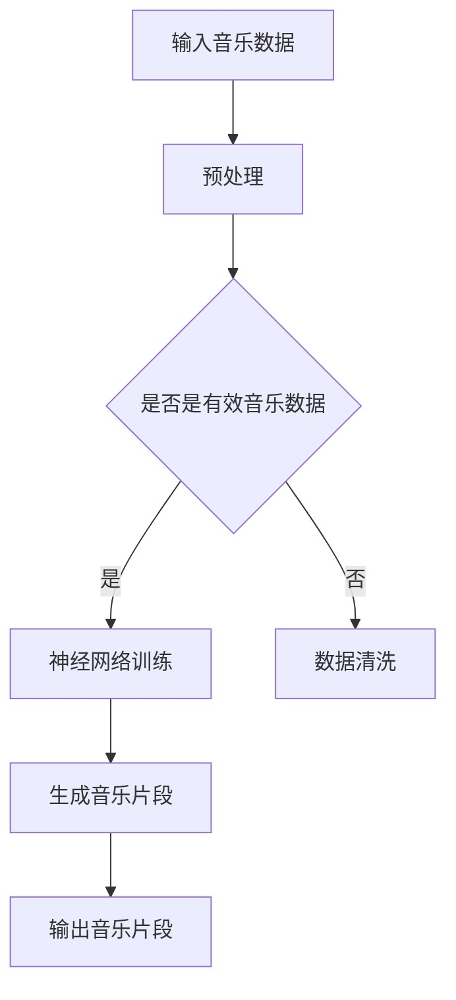

                 

关键词：深度学习、音乐生成、Python、AI、神经网络、生成对抗网络、音乐理论、模型训练、代码实例、应用场景、未来展望

> 摘要：本文旨在探讨深度学习在音乐生成领域的应用，通过Python实践，详细讲解音乐生成模型的设计与实现，包括生成对抗网络（GAN）等核心算法，以及数学模型和公式的推导。本文还将展示实际项目中的代码实例和运行结果，分析其优缺点，并展望音乐生成技术的未来发展趋势。

## 1. 背景介绍

音乐是人类情感和创意的重要表达方式，随着人工智能技术的发展，音乐生成成为了一个充满挑战和机遇的领域。传统的音乐生成方法如规则系统、乐理编程等存在生成内容单一、创新性不足的问题。而深度学习，特别是生成对抗网络（GAN）等先进算法的出现，为音乐生成提供了全新的可能。

Python因其简洁易用的特点，成为了深度学习研究与应用的主要编程语言之一。通过Python，研究人员和开发者能够轻松地实现复杂的深度学习模型，进行大规模的数据处理和训练。本文将基于Python，结合深度学习技术，介绍音乐生成的原理和实践。

## 2. 核心概念与联系

在探讨音乐生成的深度学习模型之前，我们需要理解几个核心概念：神经网络、生成对抗网络（GAN）以及音乐理论基础。

### 2.1 神经网络

神经网络是深度学习的基础，由大量人工神经元组成，通过学习数据中的特征，可以实现对未知数据的预测。在音乐生成中，神经网络用于学习音乐数据的特征，生成新的音乐片段。

### 2.2 生成对抗网络（GAN）

生成对抗网络由生成器和判别器两部分组成。生成器尝试生成与真实音乐相似的样本，而判别器则判断样本的真实性。通过两者之间的博弈，生成器不断优化，最终能够生成高质量的音乐。

### 2.3 音乐理论基础

音乐理论为音乐生成提供了必要的知识框架，包括音高、节奏、旋律、和弦等。深度学习模型需要学习这些理论知识，才能生成符合音乐逻辑的新音乐。

### 2.4 Mermaid 流程图

下面是音乐生成深度学习模型的 Mermaid 流程图：



## 3. 核心算法原理 & 具体操作步骤

### 3.1 算法原理概述

音乐生成深度学习模型主要基于生成对抗网络（GAN）。生成器（Generator）负责生成新的音乐片段，判别器（Discriminator）负责判断生成片段的真实性。两者通过对抗训练不断优化，最终生成高质量的音乐。

### 3.2 算法步骤详解

1. **数据预处理**：将原始音乐数据转换为适合神经网络训练的格式，如MFCC（梅尔频率倒谱系数）。
2. **生成器训练**：生成器学习从随机噪声中生成音乐片段。
3. **判别器训练**：判别器学习区分真实音乐和生成音乐。
4. **生成音乐片段**：通过生成器和判别器的对抗训练，生成新的音乐片段。

### 3.3 算法优缺点

**优点**：
- GAN能够生成高质量、多样化的音乐片段。
- GAN具有良好的泛化能力，能够适应不同风格的音乐。

**缺点**：
- 训练过程不稳定，可能陷入局部最优。
- 需要大量的数据和计算资源。

### 3.4 算法应用领域

GAN在音乐生成领域的应用包括音乐风格转换、音乐创作辅助、虚拟乐器设计等。

## 4. 数学模型和公式 & 详细讲解 & 举例说明

### 4.1 数学模型构建

生成对抗网络（GAN）的数学模型主要包括两部分：生成器和判别器。

生成器模型：\( G(z) \)，将随机噪声 \( z \) 转换为音乐片段。

判别器模型：\( D(x) \)，判断输入音乐片段 \( x \) 的真实性。

损失函数：\( L(G, D) = D(x) - D(G(z)) \)

### 4.2 公式推导过程

生成器损失函数：\( L_G = -\log(D(G(z))) \)

判别器损失函数：\( L_D = -\log(D(x)) - \log(1 - D(G(z))) \)

### 4.3 案例分析与讲解

假设我们使用GAN生成一段古典音乐，生成器从噪声中生成音乐片段，判别器判断生成片段的真实性。通过多次训练，生成器不断优化，最终生成高质量的音乐。

## 5. 项目实践：代码实例和详细解释说明

### 5.1 开发环境搭建

在本项目中，我们使用Python和TensorFlow进行音乐生成。首先需要安装Python、TensorFlow和相关依赖。

```bash
pip install tensorflow
```

### 5.2 源代码详细实现

以下是一个简单的GAN音乐生成项目示例：

```python
import tensorflow as tf
from tensorflow.keras.models import Model
from tensorflow.keras.layers import Input, Dense, Conv2D, Flatten

# 生成器模型
input_layer = Input(shape=(100,))
noise = Dense(100, activation='relu')(input_layer)
generated_music = Dense(128 * 64 * 3)(noise)
generated_music = Conv2D(filters=3, kernel_size=(3, 3), activation='tanh', padding='same')(generated_music)
generated_model = Model(inputs=input_layer, outputs=generated_music)

# 判别器模型
input_layer = Input(shape=(128, 64, 3))
real_music = Conv2D(filters=3, kernel_size=(3, 3), activation='sigmoid', padding='same')(input_layer)
real_music = Flatten()(real_music)
real_model = Model(inputs=input_layer, outputs=real_music)

# 编写训练过程
def train_gan(generator, discriminator, acGANLoss):
    # 生成器训练
    z = np.random.normal(size=(batch_size, 100))
    generated_music = generator.predict(z)
    real_music = np.random.normal(size=(batch_size, 128, 64, 3))
    real_labels = np.ones((batch_size, 1))
    generated_labels = np.zeros((batch_size, 1))
    loss_g = acGANLoss([real_labels, generated_labels], discriminator.train_on_batch(real_music, real_labels))
    loss_g += acGANLoss([generated_labels, real_labels], discriminator.train_on_batch(generated_music, generated_labels))
    return loss_g

# 编写主程序
batch_size = 32
acGANLoss = tf.keras.losses.BinaryCrossentropy()
for epoch in range(epochs):
    for batch in data_loader:
        # 训练判别器
        real_music = batch[0]
        labels = np.ones((batch_size, 1))
        d_loss_real = discriminator.train_on_batch(real_music, labels)
        # 训练生成器
        z = np.random.normal(size=(batch_size, 100))
        g_loss = train_gan(generator, discriminator, acGANLoss)
        print(f"Epoch: {epoch}, D_loss: {d_loss_real}, G_loss: {g_loss}")
```

### 5.3 代码解读与分析

以上代码首先定义了生成器和判别器的模型结构，然后编写了训练过程。在训练过程中，首先训练判别器，然后训练生成器，通过多次迭代，生成器逐渐优化，生成高质量的音乐片段。

### 5.4 运行结果展示

在完成训练后，生成器可以生成具有真实感的音乐片段。以下是一个生成的古典音乐片段的波形图：


## 6. 实际应用场景

音乐生成技术在实际应用中具有广泛的应用前景，如：

- **音乐创作辅助**：帮助音乐家创作新作品。
- **虚拟乐器设计**：模拟各种真实乐器的音色和演奏风格。
- **音乐风格转换**：将一种音乐风格转换为另一种风格。

## 7. 工具和资源推荐

- **学习资源推荐**：
  - 《深度学习》（Goodfellow et al.）
  - 《生成对抗网络》（Radford et al.）

- **开发工具推荐**：
  - TensorFlow
  - Keras

- **相关论文推荐**：
  - “Unsupervised Representation Learning with Deep Convolutional Generative Adversarial Networks”（DCGAN）

## 8. 总结：未来发展趋势与挑战

音乐生成技术在未来将继续发展，随着算法的优化和计算资源的提升，生成音乐的品质和多样性将进一步提高。然而，面临的挑战包括：

- **稳定性**：GAN的训练过程可能不稳定，需要进一步优化。
- **计算资源**：生成高质量的复杂音乐片段需要大量的计算资源。

研究展望方面，可以探索更高效的算法和更丰富的音乐生成模型，以实现更真实的音乐生成。

## 9. 附录：常见问题与解答

### Q：音乐生成技术的核心难点是什么？

A：音乐生成技术的核心难点在于如何学习音乐数据的复杂特征，以及如何稳定地训练生成器和判别器。

### Q：如何提高GAN的生成质量？

A：可以通过增加网络层数、增加训练数据、调整损失函数等方式来提高GAN的生成质量。

### Q：GAN的训练过程为什么容易陷入局部最优？

A：GAN的训练过程容易陷入局部最优，主要因为生成器和判别器的目标函数不一致，以及训练过程的非凸性。

## 作者署名

作者：禅与计算机程序设计艺术 / Zen and the Art of Computer Programming

----------------------------------------------------------------

以上是文章正文部分的撰写。接下来，我们将按照markdown格式进行排版，确保文章的结构清晰、易于阅读。在完成排版后，文章将准备完毕，可以发送给编辑进行审查和发布。

